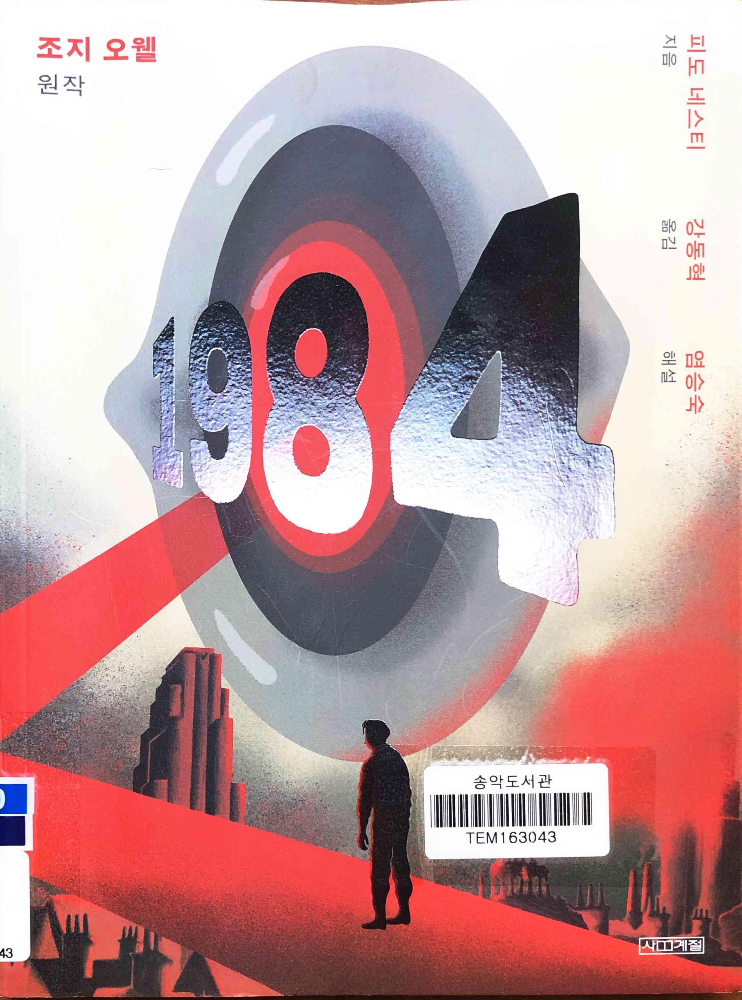
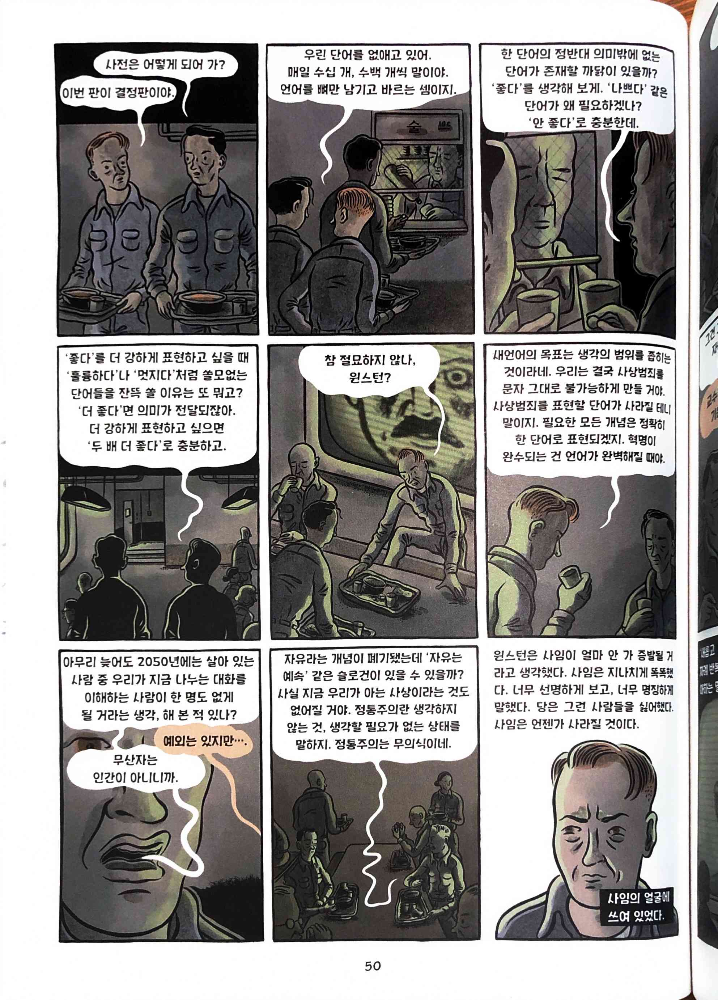
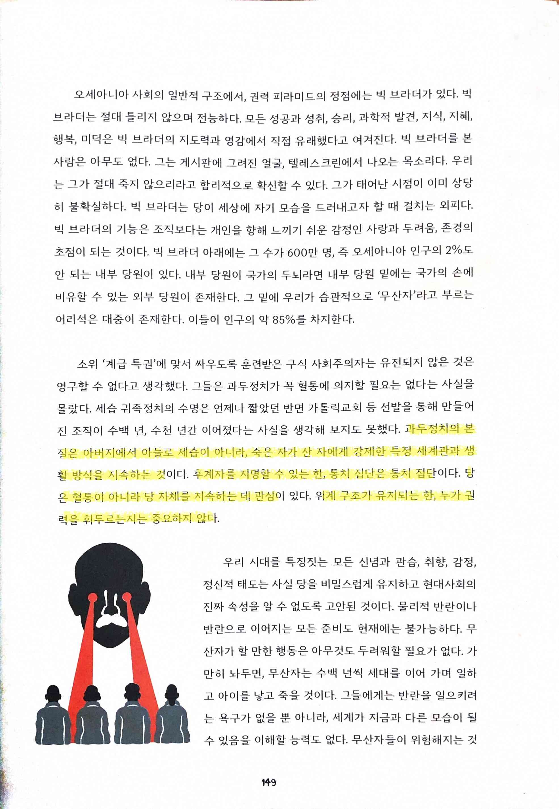
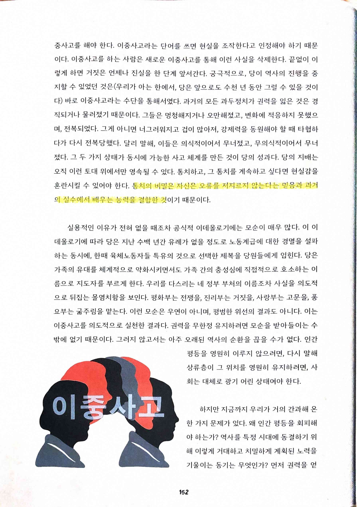
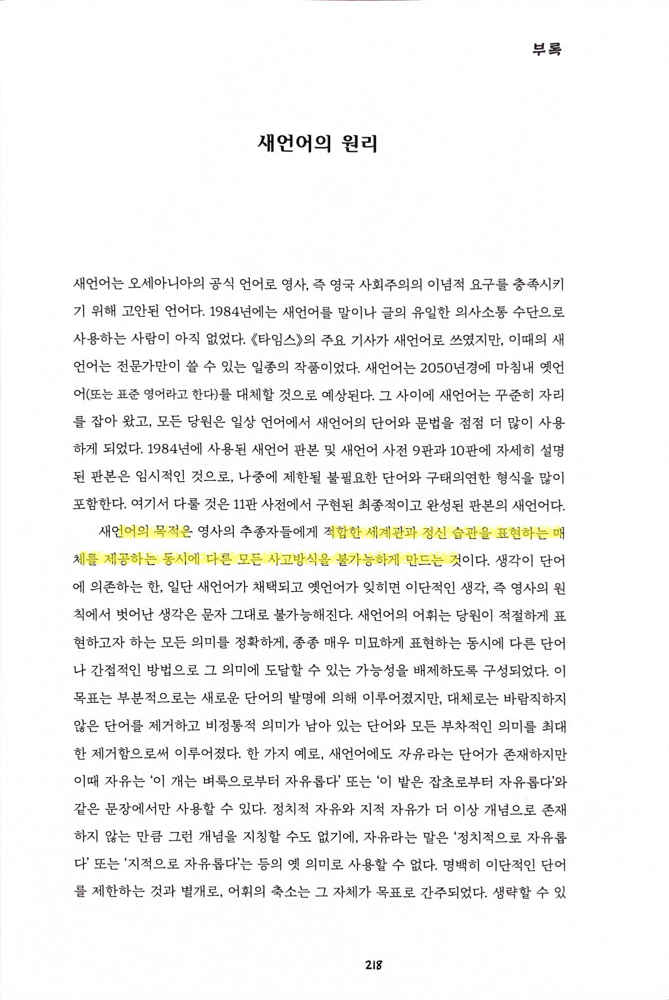
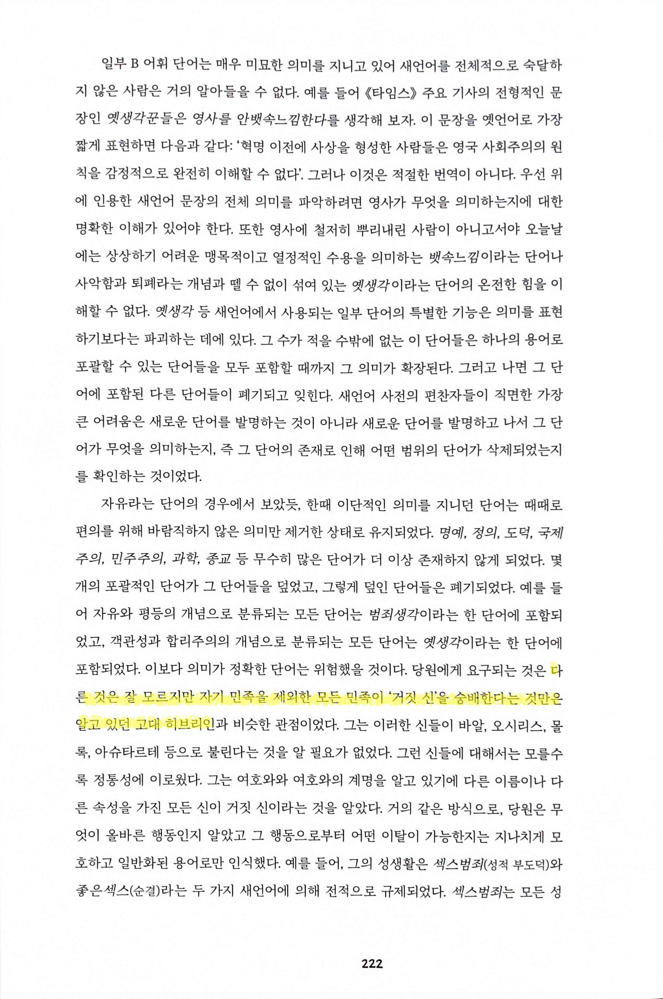
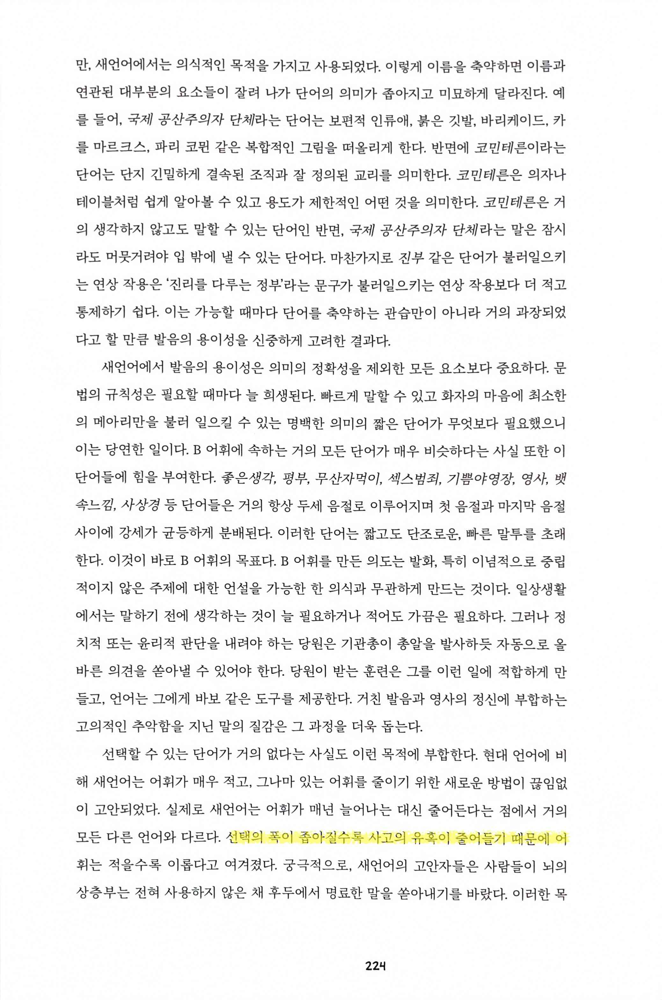
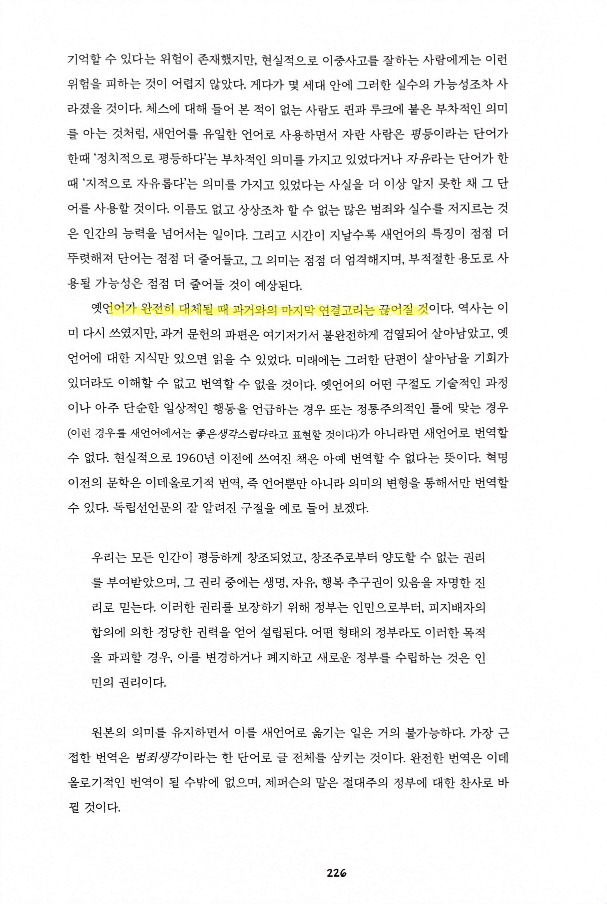
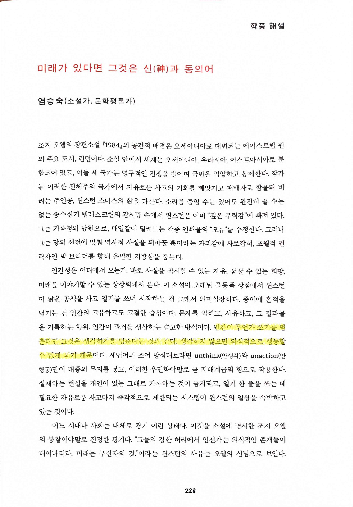

# 1984

Tags: graphic-novel
Date: March 22, 2025
Score: ★★★☆☆

- ★★★☆☆ March 22, 2025
    - 조지 오웰의 『1984』를 다시 읽었다. 어린 시절 접했지만, 내용이 기억나지 않았기에 도서관에 들렀다가 눈에 띄어 다시 펼쳤다. 가장 크게 다가온 감정은 두 가지였다. 첫째, 조지 오웰은 대단한 천재라는 것. 둘째, 작품이 전하는 암울함.
    - 1920년대의 작가가 미래를 이렇게 정확하게 예측할 수 있었을까? 물론 그의 천재성도 있겠지만, 인간의 정치 체제가 근본적으로 변하지 않았기 때문일 수도 있다. 읽는 내내 감탄과 함께 깊은 침잠을 경험했다.
    - 윈스턴이 빅 브라더의 감시를 피했다고 생각했지만, 사실 모든 것이 감시 아래 있었던 것처럼, 우리의 삶도 빅 테크와 각종 감시 장비로부터 벗어나기 어렵다. 머지않아 『1984』의 텔레스크린처럼 모든 순간이 기록될지도 모른다. 중국의 AI 발전 속도를 보면, 이미 실현되었을 수도 있다는 생각이 든다. 이 글을 온라인에 저장하는 내 모습도 아이러니하게 느껴진다.
    - 한 가지 이해가 가지 않는 점, 이 책과 함께 조지 오웰의 또 다른 명작 ‘동물 농장’이 왜 어린이 도서관에 있는걸까? 중고교생 정도면 읽을만 하기 때문일까?
- p50
    
    
    
- p149 `과두 정치의 본질은 아버지에서 아들로 세습이 아니라, 죽은 자가 산 자에게 강제한 특정 세계관과 생활 방식을 지속하는 것이다. 후계자를 지명할 수 있는 한, 통치 집단은 통치 집단이다. 당은 혈통이 아니라 당 자체를 지속하는 데 관심이 있다. 위계 구조가 유지되는 한, 누가 권력을 휘두르는지는 중요하지 않다`
    
    
    
    - 과두 정치가 아니라 그냥 정치라고 써도 크게 틀리지 않는다는 생각
- p152 `통치의 비밀은 자신은 오류를 저지르지 않는다는 믿음과 과거의 실수에서 배우는 능력을 결합한 것`
    
    
    
    - 이 부분을 읽으면서 소름이 끼쳤다. 스스로 옳다는 확신을 가진 자들이 얼마나 많은 사람들을 괴롭혔고 괴롭히고 있는가.
- p218 `새언어의 목적은... 적합한 세계관과 정신 습관을 표현하는 매체를 제공하는 동시에 다른 모든 사고방식을 불가능하게 만드는 것`
    
    
    
    - 언어의 한계가 사고의 한계를 결정한다
- p222 `다른 것은 잘 모르지만 자기 민족을 제외한 모든 민족이 '거짓 신'을 숭배한다는 것만은 알고 있던 고대 히브리인`
    
    
    
- p224 `선택의 폭이 좁아질수록 사고의 유혹이 줄어들기 때문`
    
    
    
- p226 `옛언어가 완전히 대체될 때 과거와의 마지막 연결고리는 끊어질 것`
    
    
    
    - 그래서 일제도 그렇게 우리 말을 탄압하고 창씨 개명을 하려고 했었지
- p228 `인간이 무언가 쓰기를 멈춘다면 그것은 생각하기를 멈춘다는 것과 같다. 생각하지 않으면 의식적으로 행동할 수 없게 되기 때문`
    
    
