축적의 길
=========
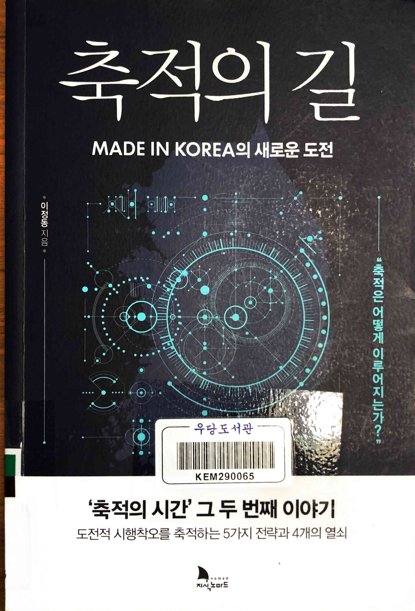

# PART1 대전환: 착각에서 축적으로

## 1장 고도 상승을 멈춘 로켓
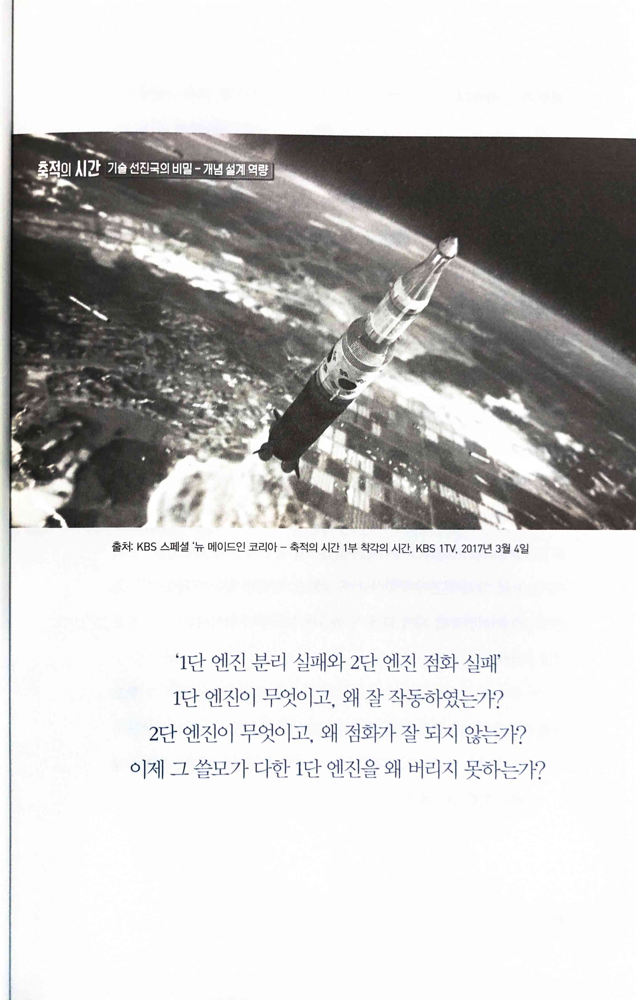

## 2장 한국산업의 위기 개념설계 역량이 없다
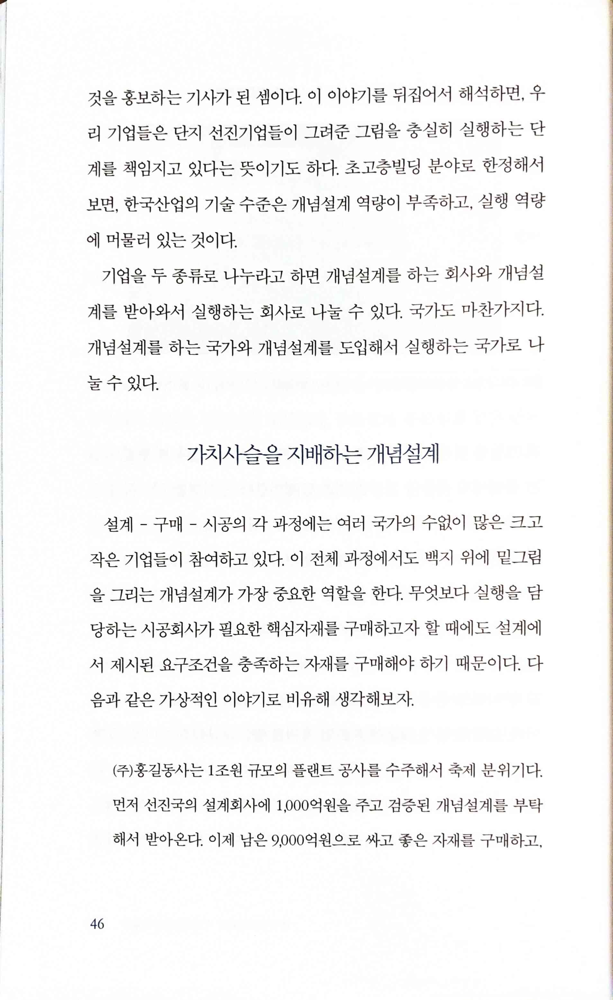

> 개념설계를 하는 국가(회사)와 개념설계를 도입해서 실행하는 국가(회사)

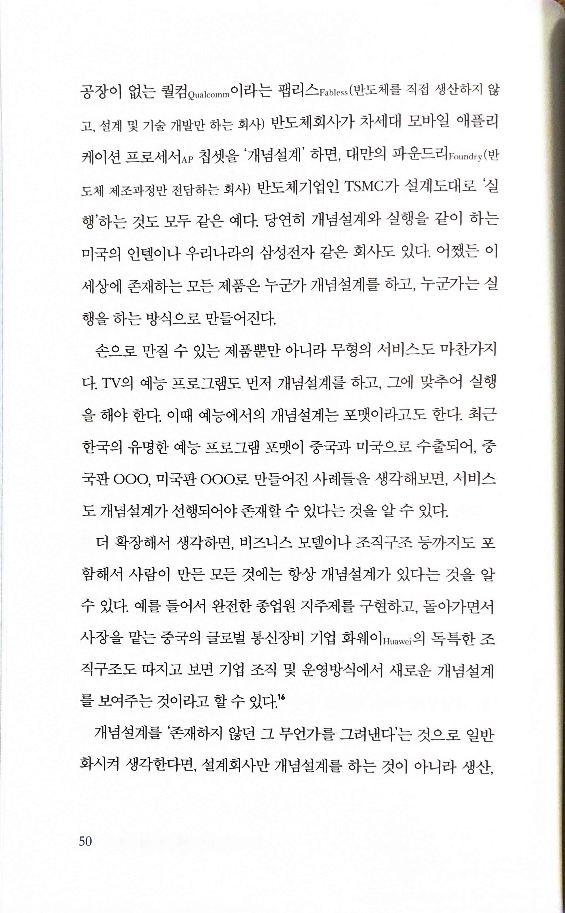

> 비즈니스 모델이나 조직구조 등까지도 포함해서 사람이 만든 모든 것에는 항상 개념설계가 있다
* 산업의 차이와 무관하게 일반적으로 우리 조직 문화가 뒤쳐지고 생산성이 낮은 이유

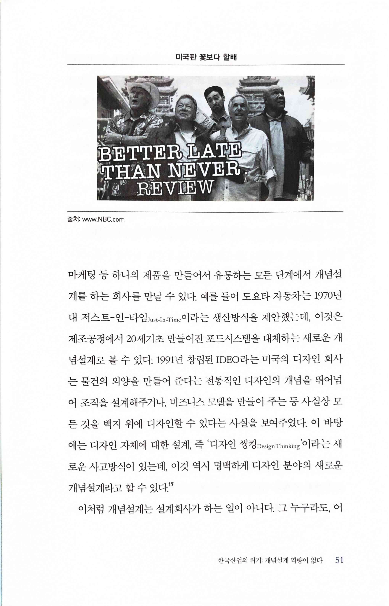

> 모든 단계에서 개념설계를 하는 회사를 만날 수 있다. 예를 들어 도요타 자동차는 1970년대 저스트-인-타임Just-In-Time이라는 생산방식을 제안했는데, 이것은 제조공정에서 20세기초 만들어진 포드시스템을 대체하는 새로운 개념설계로 볼 수 있다. 1991년 창립된 IDEO라는 미국의 디자인 회사는 물건의 외양을 만들어 준다는 전통적인 디자인의 개념을 뛰어넘어 조직을 설계해주거나, 비즈니스 모델을 만들어 주는 등 사실상 모든 것을 백지 위에 디자인할 수 있다는 사실을 보여주었다. 이 바탕에는 디자인 자체에 대한 설계, 즉 '디자인 씽킹Design Thinking'이라는 새로운 사고방식이 있는데, 이것 역시 명백하게 디자인 분야의 새로운 개념설계라고 할 수 있다.

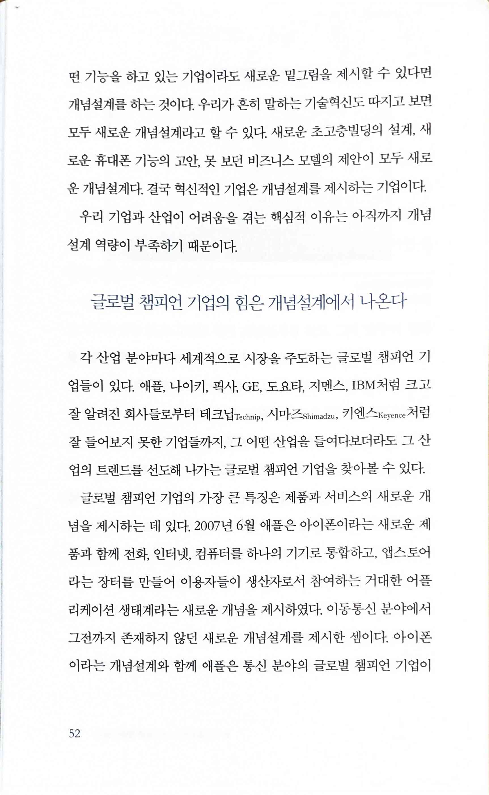

> 결국 혁신적인 기업은 개념설계를 제시하는 기업이다.
>
> 우리 기업과 산업이 어려움을 겪는 핵심적 이유는 아직까지 개념 설계 역량이 부족하기 때문이다.

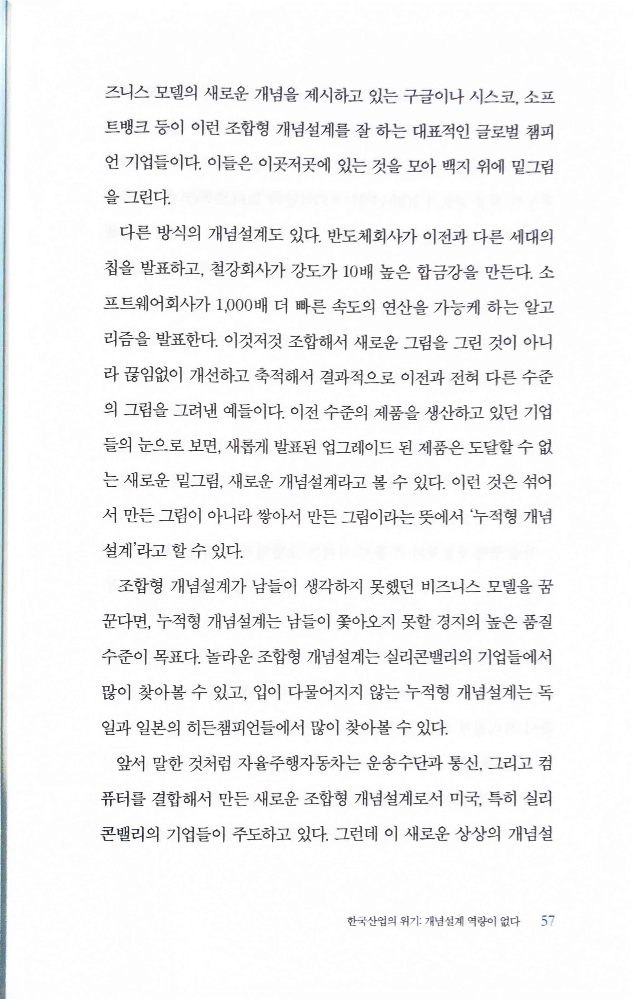

> 조합형 개념설계가 남들이 생각하지 못했던 비즈니스 모델을 꿈꾼다면, 누적형 개념설계는 남들이 쫓아오지 못할 경지의 높은 품질수준이 목표다. 놀라운 조합형 개념설계는 실리콘밸리의 기업들에서 많이 찾아볼 수 있고, 입이 다물어지지 않는 누적형 개념설계는 독일과 일본의 히든챔피언들에서 많이 찾아볼 수 있다.

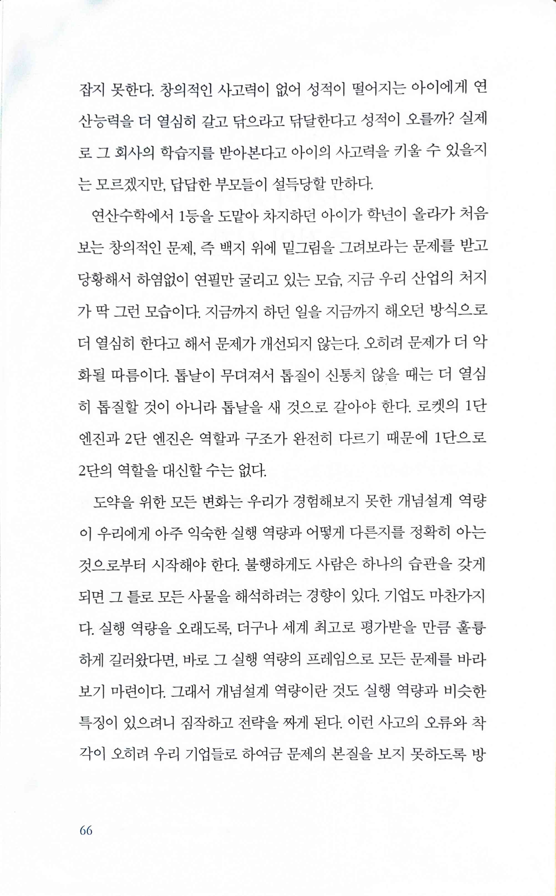

> 도약을 위한 모든 변화는 우리가 경험해보지 못한 개념설계 역량이 우리에게 아주 익숙한 실행 역량과 어떻게 다른지를 정확히 아는것으로부터 시작해야 한다. 불행하게도 사람은 하나의 습관을 갖게되면 그 틀로 모든 사물을 해석하려는 경향이 있다. 기업도 마찬가지다. 실행 역량을 오래도록, 더구나 세계 최고로 평가받을 만큼 훌륭하게 길러왔다면, 바로 그 실행 역량의 프레임으로 모든 문제를 바라보기 마련이다. 그래서 개념설계 역량이란 것도 실행 역량과 비슷한 특징이 있으려니 짐작하고 전략을 짜게 된다. 이런 사고의 오류와 착각이 오히려 우리 기업들로 하여금 문제의 본질을 보지 못하도록 방해하는 역할을 한다.

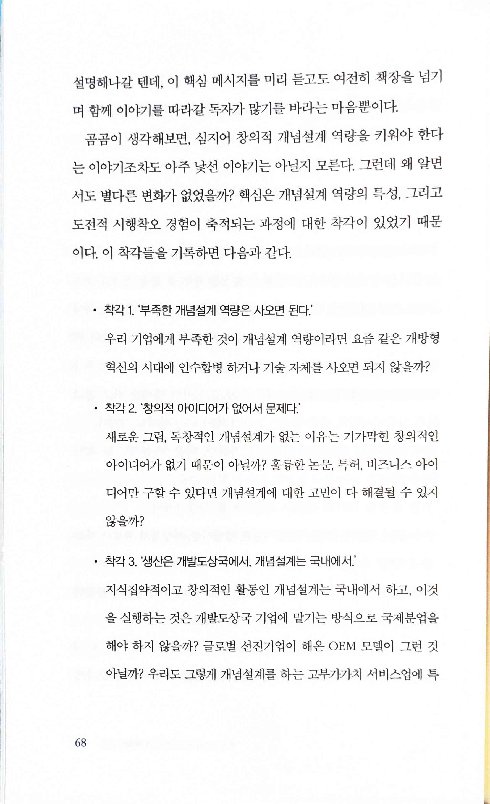 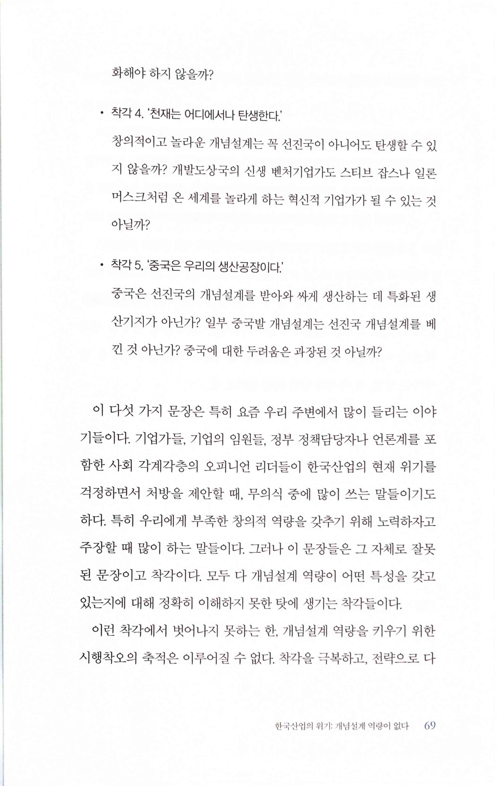

> 곰곰이 생각해보면, 심지어 창의적 개념설계 역량을 키워야 한다는 이야기조차도 아주 낯선 이야기는 아닐지 모른다. 그런데 왜 알면서도 별다른 변화가 없었을까? 핵심은 개념설계 역량의 특성, 그리고 도전적 시행착오 경험이 축적되는 과정에 대한 착각이 있었기 때문이다. 이 착각들을 기록하면 다음과 같다.
>
> • 착각 1. '부족한 개념설계 역량은 사오면 된다.'
>
> • 착각 2. '창의적 아이디어가 없어서 문제다.'
>
> • 착각 3. '생산은 개발도상국에서, 개념설계는 국내에서.'
>
> • 착각 4. '천재는 어디에서나 탄생한다.'
>
> • 착각 5. '중국은 우리의 생산공장이다.'

# PART 2 축적의 전략: 축적은 어떻게 이루어지는가?

## 3장 축적의 전략 1. 시행착오 경험을 담는 궁극의 그릇 고수를 키워라
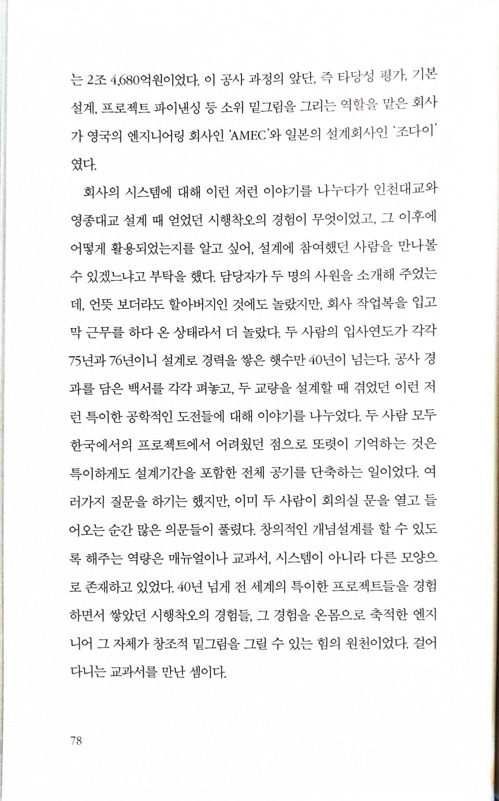

> (일본의 설계회사인 '조다이') 두 사람 모두 한국에서의 프로젝트 - 인천대교, 영종대교 - 에서 어려웠던 점으로 또렷이 기억하는 것은 특이하게도 설계기간을 포함한 전체 공기를 단축하는 일이었다.

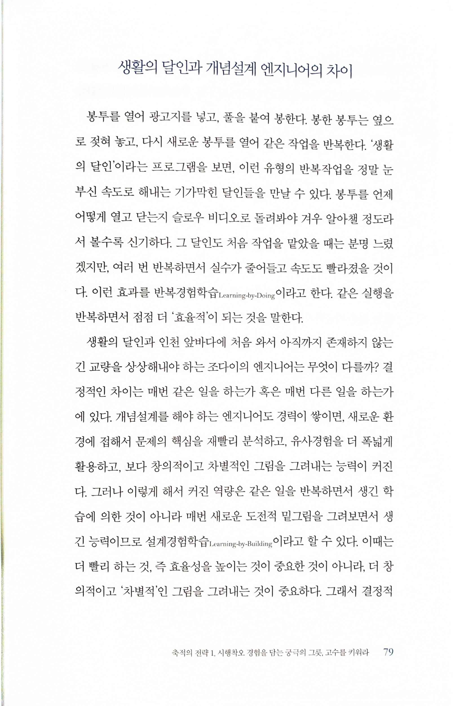

> 반복경험학습 Learning-by-Doing이라고 한다. 같은 실행을 반복하면서 점점 더 '효율적'이 되는 것
>
> 매번 새로운 도전적 밑그림을 그려보면서 생긴 능력이므로 설계경험학습 Learning-by-Building이라고 할 수 있다. 이때는 더 빨리 하는 것, 즉 효율성을 높이는 것이 중요한 것이 아니라, 더 창의적이고 '차별적인 그림을 그려내는 것이 중요하다. 그래서 결정적으로 개념설계를 할 수 있는 역량은 매뉴얼로 만들 수 없다. 직접 그림을 그려보고, 적용해보고 안되는 경우를 경험해보고, 다시 그림을 고치는 과정을 반복해보아야만 길러지는 역량이다.

> 지식 가운데 매뉴얼이나 교과서의 형태로 표현할 수 있는 것을 형식지 Explicit Knowledge라고 한다. 반대로 직접 해본 경험과 기억의 형태로 되어 있어 교과서로 표현할 수 없는 것을 암묵지Tacit Knowledge라고 한다. 기술이 발전해오면서 많은 암묵지가 형식지로 전환되어 왔다... 앞으로도 이런 추세는 계속되어 대부분의 암묵지가 형식지로 바뀌겠지만, 끝내 바뀌지 않는 것은 지금까지 없던 밑그림을 그리는 개념설계 역량일 것이다.

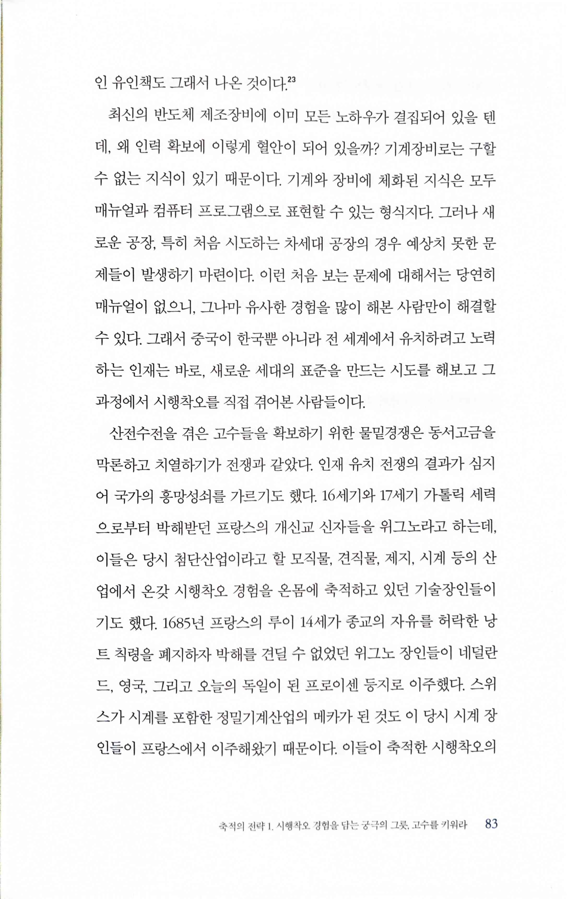 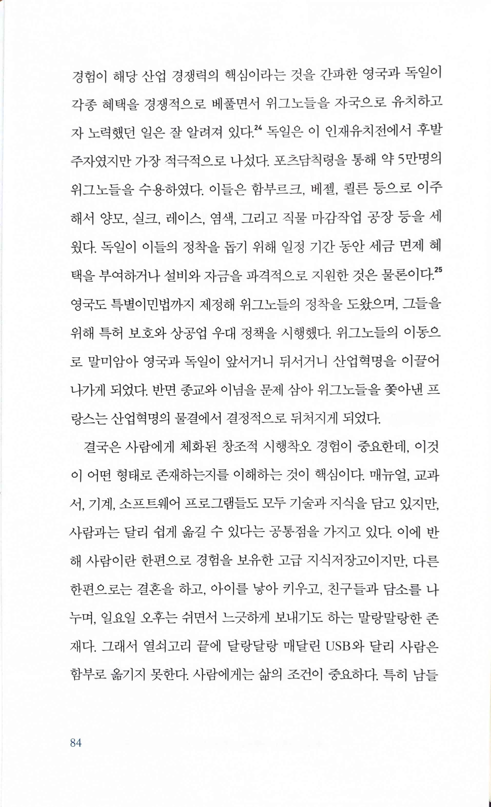

> 인재 유치 전쟁의 결과가 심지어 국가의 흥망성쇠를 가르기도 했다. 16세기와 17세기 가톨릭 세력으로부터 박해받던 프랑스의 개신교 신자들을 위그노라고 하는데, 이들은 당시 첨단산업이라고 할 모직물, 견직물, 제지, 시계 등의 산업에서 온갖 시행착오 경험을 온몸에 축적하고 있던 기술장인들이기도 했다. 1685년 프랑스의 루이 14세가 종교의 자유를 허락한 낭트 칙령을 폐지하자 박해를 견딜 수 없었던 위그노 장인들이 네덜란드, 영국, 그리고 오늘의 독일이 된 프로이센 등지로 이주했다. 스위스가 시계를 포함한 정밀기계산업의 메카가 된 것도 이 당시 시계 장인들이 프랑스에서 이주해왔기 때문이다. 이들이 축적한 시행착오의 경험이 해당 산업 경쟁력의 핵심이라는 것을 간파한 영국과 독일이 각종 혜택을 경쟁적으로 베풀면서 위그노들을 자국으로 유치하고자 노력했던 일은 잘 알려져 있다. 독일은 이 인재유치전에서 후발주자였지만 가장 적극적으로 나섰다. 포츠담칙령을 통해 약 5만명의 위그노들을 수용하였다. 이들은 함부르크, 베젤, 쾰른 등으로 이주해서 양모, 실크, 레이스, 염색, 그리고 직물 마감작업 공장 등을 세웠다. 독일이 이들의 정착을 돕기 위해 일정 기간 동안 세금 면제 혜택을 부여하거나 설비와 자금을 파격적으로 지원한 것은 물론이다. 영국도 특별이민법까지 제정해 위그노들의 정착을 도왔으며, 그들을 위해 특허 보호와 상공업 우대 정책을 시행했다. 위그노들의 이동으로 말미암아 영국과 독일이 앞서거니 뒤서거니 산업혁명을 이끌어나가게 되었다. 반면 종교와 이념을 문제 삼아 위그노들을 쫓아낸 프랑스는 산업혁명의 물결에서 결정적으로 뒤처지게 되었다.

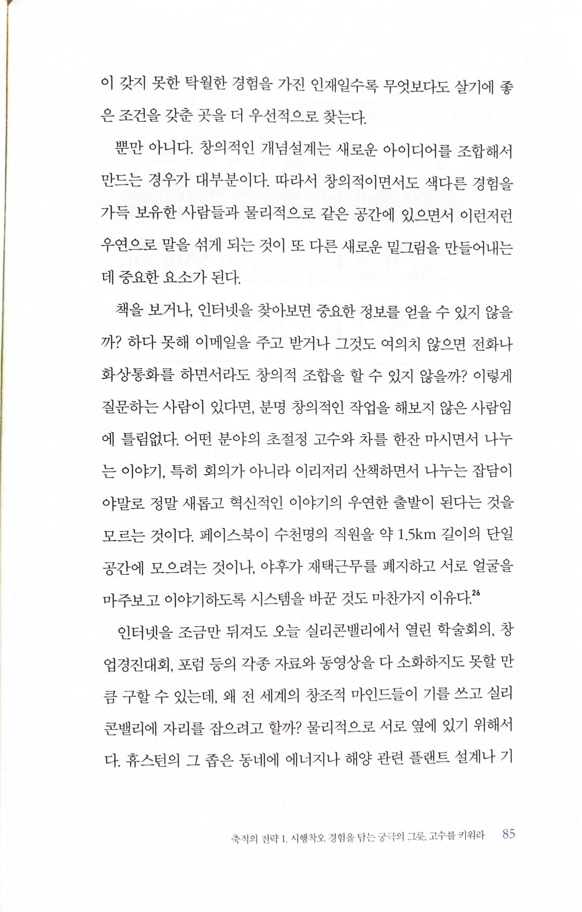 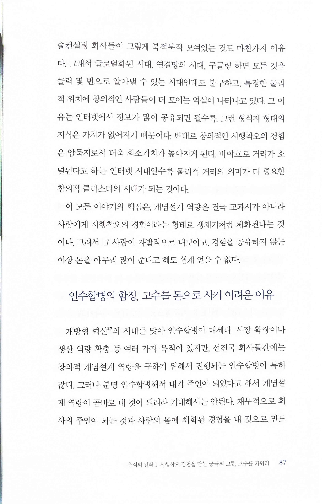

> 핵심은, 개념설계 역량은 결국 교과서가 아니라 사람에게 시행착오의 경험이라는 형태로 생채기처럼 체화된다는 것이다. 그래서 그 사람이 자발적으로 내보이고, 경험을 공유하지 않는 이상 돈을 아무리 많이 준다고 해도 쉽게 얻을 수 없다.
* 저자는 Automatic이나 Elastic Search같은 사례는 outlier로 간주하는 걸까?

## 4장 축적의 전략 2. 아이디어는 흔하다. 스케일업 역량을 키워라
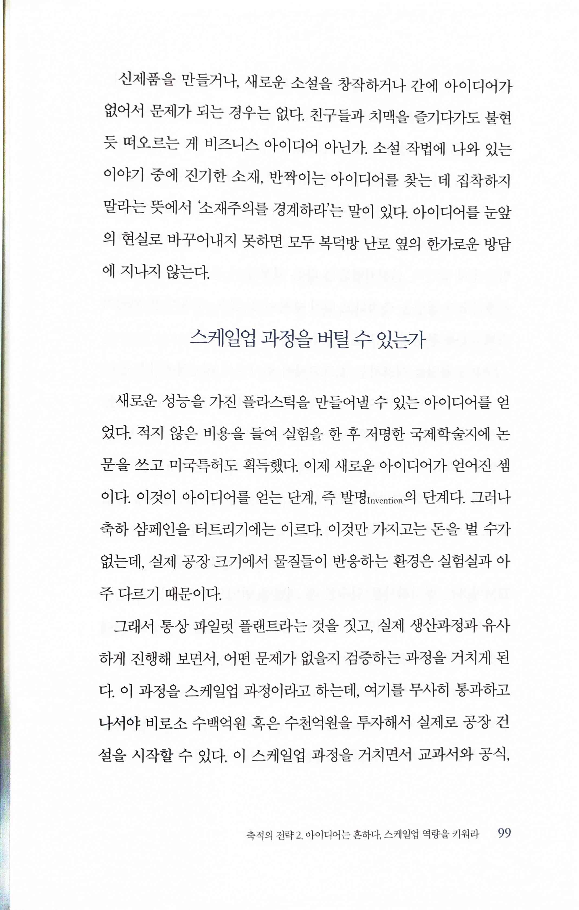

> 소설 작법에 나와 있는 이야기 중에 진기한 소재, 반짝이는 아이디어를 찾는 데 집착하지 말라는 뜻에서 '소재주의를 경계하라'는 말이 있다.
>
> 아이디어를 얻는 단계, 즉 발명 Invention의 단계다. 그러나 축하 샴페인을 터트리기에는 이르다. 이것만 가지고는 돈을 벌 수가 없는데, 실제 공장 크기에서 물질들이 반응하는 환경은 실험실과 아주 다르기 때문이다.
 
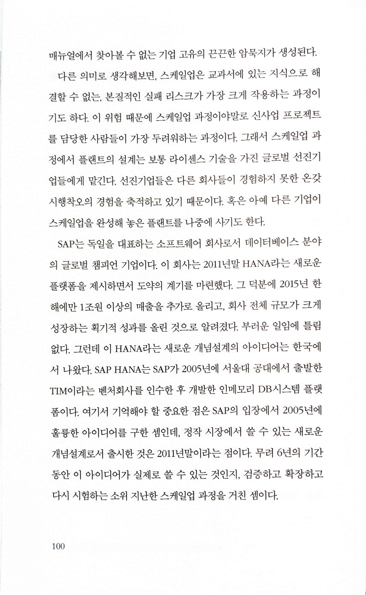

> 이 스케일업 과정을 거치면서 교과서와 공식, 매뉴얼에서 찾아볼 수 없는 기업 고유의 끈끈한 암묵지가 생성된다... 스케일업은 교과서에 있는 지식으로 해결할 수 없는 본질적인 실패 리스크가 가장 크게 작용하는 과정

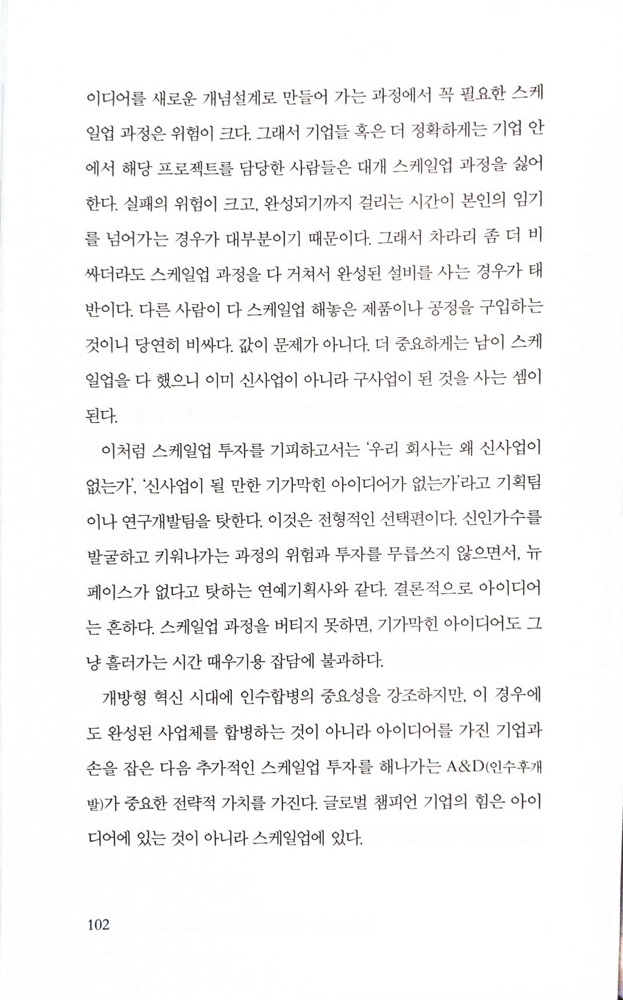

> 아이디어를 새로운 개념설계로 만들어 가는 과정에서 꼭 필요한 스케일업 과정은 위험이 크다. 그래서 기업들 혹은 더 정확하게는 기업 안에서 해당 프로젝트를 담당한 사람들은 대개 스케일업 과정을 싫어한다. 실패의 위험이 크고, 완성되기까지 걸리는 시간이 본인의 임기를 넘어가는 경우가 대부분이기 때문이다. 그래서 차라리 좀 더 비싸더라도 스케일업 과정을 다 거쳐서 완성된 설비를 사는 경우가 태반이다. 다른 사람이 다 스케일업 해놓은 제품이나 공정을 구입하는 것이니 당연히 비싸다. 값이 문제가 아니다. 더 중요하게는 남이 스케일업을 다 했으니 이미 신사업이 아니라 구사업이 된 것을 사는 셈이 된다.
>
> 이처럼 스케일업 투자를 기피하고서는 '우리 회사는 왜 신사업이 없는가', '신사업이 될 만한 기가막힌 아이디어가 없는가'라고 기획팀이나 연구개발팀을 탓한다. 이것은 전형적인 선택편이다. 신인가수를 발굴하고 키워나가는 과정의 위험과 투자를 무릅쓰지 않으면서, 뉴페이스가 없다고 탓하는 연예기획사와 같다. 결론적으로 아이디어는 흔하다. 스케일업 과정을 버티지 못하면, 기가막힌 아이디어도 그냥 흘러가는 시간 때우기용 잡담에 불과하다.

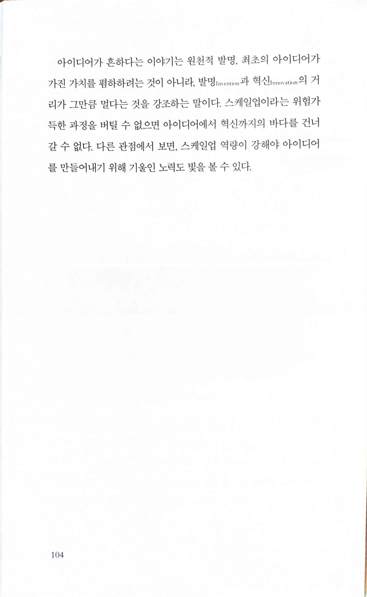

> 아이디어가 흔하다는 이야기는 원천적 발명, 최초의 아이디어가 가진 가치를 폄하하려는 것이 아니라, 발명Invention과 혁신Innovation의 거리가 그만큼 멀다는 것을 강조하는 말이다. 스케일업이라는 위험가득한 과정을 버틸 수 없으면 아이디어에서 혁신까지의 바다를 건너갈 수 없다. 다른 관점에서 보면, 스케일업 역량이 강해야 아이디어를 만들어내기 위해 기울인 노력도 빛을 볼 수 있다.

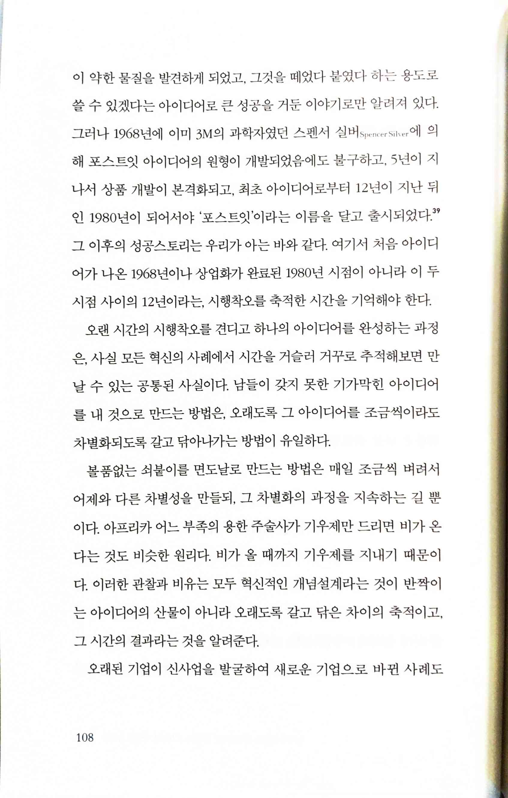

> 1968년에 이미 3M의 과학자였던 스펜서 실버 Spencer Silver에 의해 포스트잇 아이디어의 원형이 개발되었음에도 불구하고, 5년이 지나서 상품 개발이 본격화되고, 최초 아이디어로부터 12년이 지난 뒤인 1980년이 되어서야 '포스트잇'이라는 이름을 달고 출시되었다.
>
> 오랜 시간의 시행착오를 견디고 하나의 아이디어를 완성하는 과정은, 사실 모든 혁신의 사례에서 시간을 거슬러 거꾸로 추적해보면 만날 수 있는 공통된 사실이다. 남들이 갖지 못한 기가막힌 아이디어를 내 것으로 만드는 방법은 오래도록 그 아이디어를 조금씩이라도 차별화되도록 갈고 닦아나가는 방법이 유일하다.

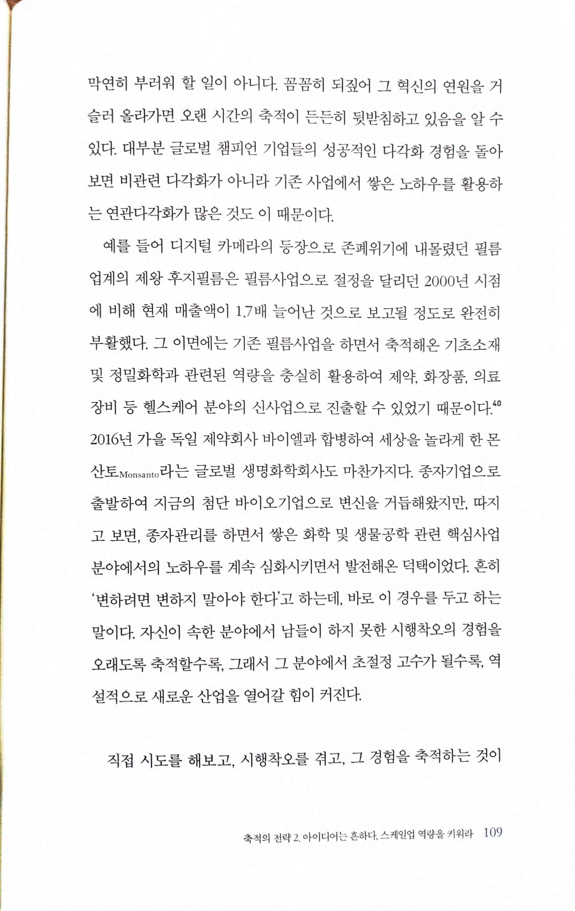

> '변하려면 변하지 말아야 한다'... 

## 5장 축적의 전략 3. 시행착오를 뒷받침할 제조 현장을 키워라
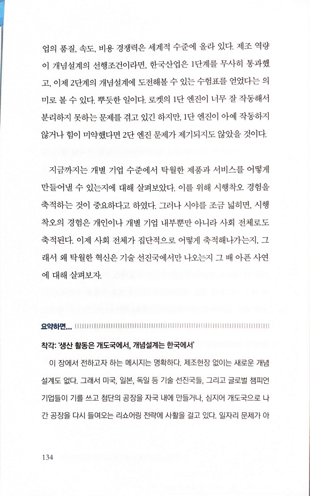 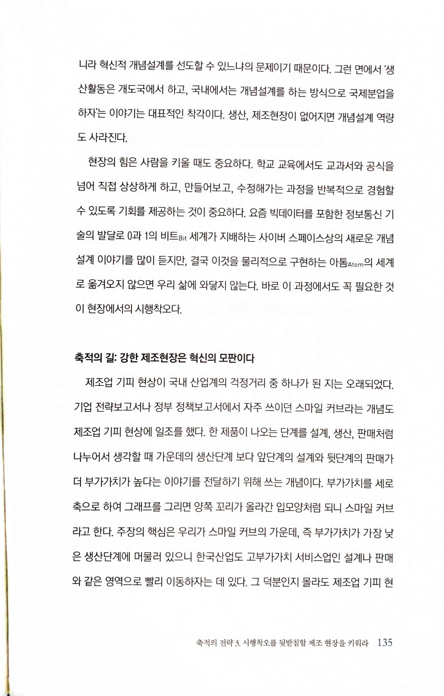

> 착각: '생산 활동은 개도국에서, 개념설계는 한국에서'
>
> '생산활동은 개도국에서 하고, 국내에서는 개념설계를 하는 방식으로 국제분업을 하자'는 이야기는 대표적인 착각이다. 생산, 제조현장이 없어지면 개념설계 역량도 사라진다.
>
> 축적의 길: 강한 제조현장은 혁신의 모판이다

## 6장 축적의 전략 4. 고독한 천재는 없다. 사회적 축적을 꾀하라
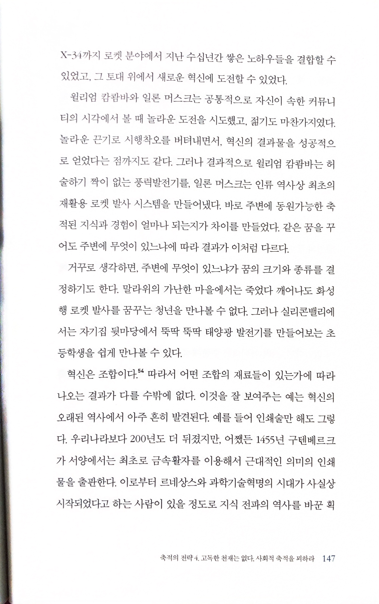 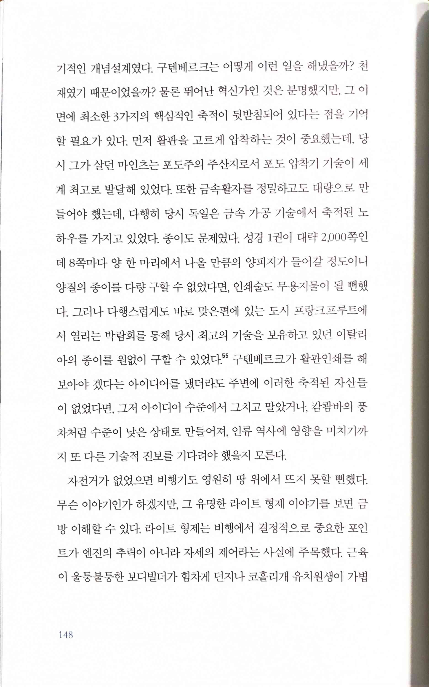

> 혁신은 조합이다... 구텐베르크가 뛰어난 혁신가인 것은 분명했지만, 그 이면에 최소한 3가지의 핵심적인 축적이 뒷받침되어 있다는 점을 기억할 필요가 있다. 먼저 활판을 고르게 압착하는 것이 중요했는데, 당시 그가 살던 마인츠는 포도주의 주산지로서 포도 압착기 기술이 세계 최고로 발달해 있었다. 또한 금속활자를 정밀하고도 대량으로 만들어야 했는데, 다행히 당시 독일은 금속 가공 기술에서 축적된 노하우를 가지고 있었다. 종이도 문제였다. 성경 1권이 대략 2,000 쪽인데 8쪽마다 양 한 마리에서 나올 만큼의 양피지가 들어갈 정도이니 양질의 종이를 다량 구할 수 없었다면, 인쇄술도 무용지물이 될 뻔했다. 그러나 다행스럽게도 바로 맞은편에 있는 도시 프랑크프루트에서 열리는 박람회를 통해 당시 최고의 기술을 보유하고 있던 이탈리아의 종이를 원없이 구할 수 있었다.

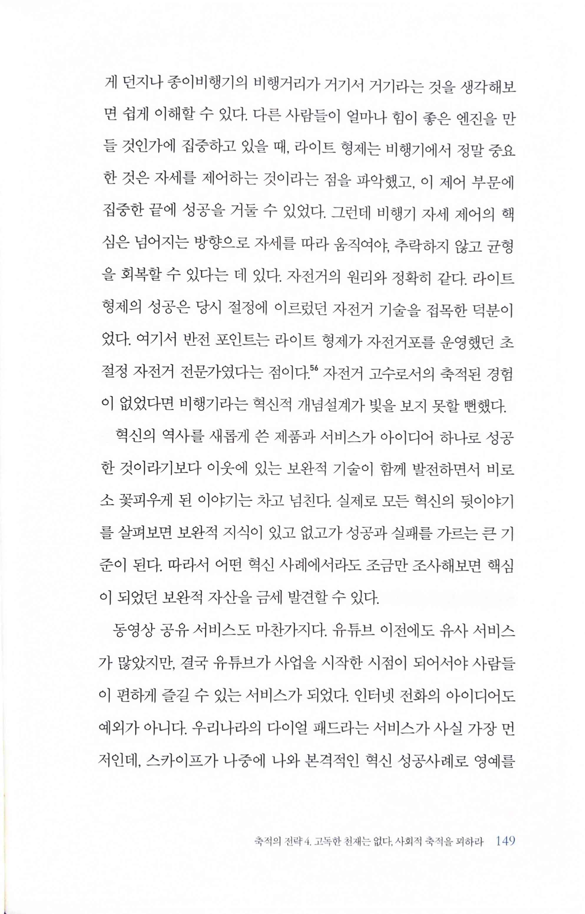

> 자전거가 없었으면 비행기도 영원히 땅 위에서 뜨지 못할 뻔했다... 라이트 형제는 비행에서 결정적으로 중요한 포인트가 엔진의 추력이 아니라 자세의 제어라는 사실에 주목했다... 비행기 자세 제어의 핵심은 넘어지는 방향으로 자세를 따라 움직여야 추락하지 않고 균형을 회복할 수 있다는 데 있다. 자전거의 원리와 정확히 같다. 라이트 형제의 성공은 당시 절정에 이르렀던 자전거 기술을 접목한 덕분이었다. 여기서 반전 포인트는 라이트 형제가 자전거포를 운영했던 초절정 자전거 전문가였다는 점이다. 자전거 고수로서의 축적된 경험이 없었다면 비행기라는 혁신적 개념설계가 빛을 보지 못할 뻔했다.
>
> 모든 혁신의 뒷이야기를 살펴보면 보완적 지식이 있고 없고가 성공과 실패를 가르는 큰 기준이 된다. 따라서 어떤 혁신 사례에서라도 조금만 조사해보면 핵심이 되었던 보완적 자산을 금세 발견할 수 있다.

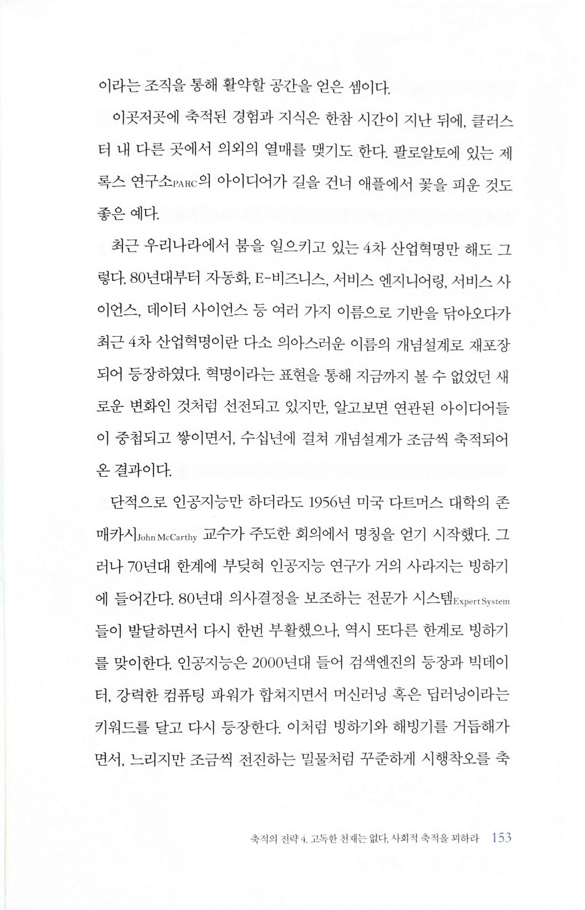

> 혁명이라는 표현을 통해 지금까지 볼 수 없었던 새로운 변화인 것처럼 선전되고 있지만, 알고보면 연관된 아이디어들이 중첩되고 쌓이면서, 수십년에 걸쳐 개념설계가 조금씩 축적되어온 결과이다.

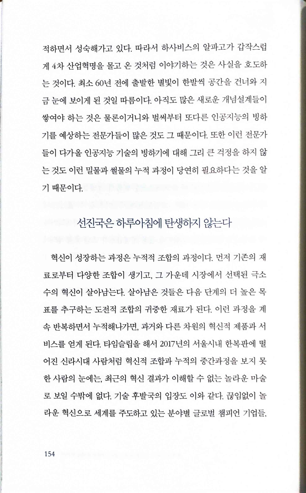

> 혁신이 성장하는 과정은 누적적 조합의 과정이다. 먼저 기존의 재료로부터 다양한 조합이 생기고, 그 가운데 시장에서 선택된 극소수의 혁신이 살아남는다. 살아남은 것들은 다음 단계의 더 높은 목표를 추구하는 도전적 조합의 귀중한 재료가 된다. 이런 과정을 계속 반복하면서 누적해나가면, 과거와 다른 차원의 혁신적 제품과 서비스를 얻게 된다. 

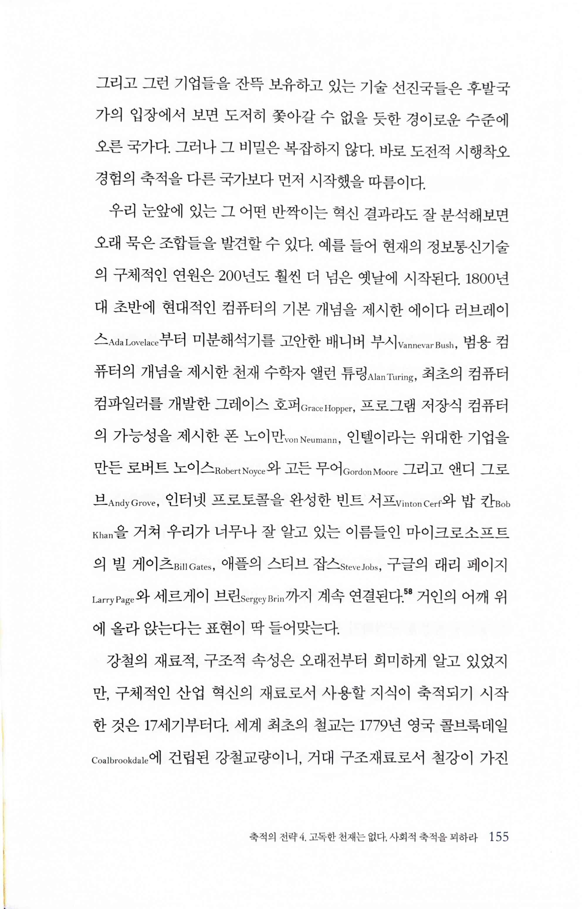

> 기술 선진국들은 후발국가의 입장에서 보면 도저히 쫓아갈 수 없을 듯한 경이로운 수준에 오른 국가다. 그러나 그 비밀은 복잡하지 않다. 바로 도전적 시행착오 경험의 축적을 다른 국가보다 먼저 시작했을 따름이다.
>
> ... 거인의 어깨 위에 올라 앉는다는 표현이 딱 들어맞는다.

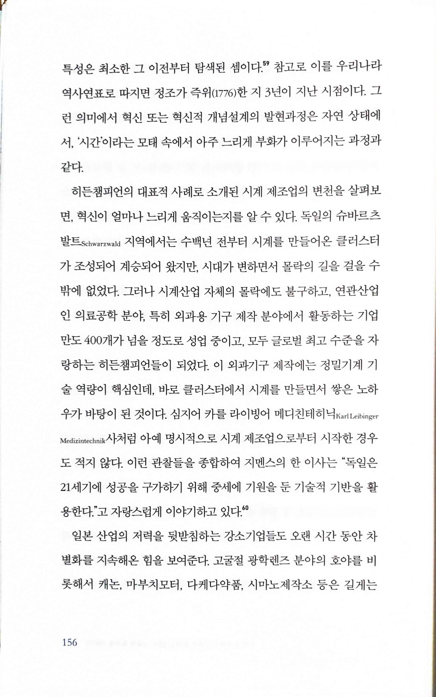

> 강철의 재료적, 구조적 속성은 오래전부터 희미하게 알고 있었지만, 구체적인 산업 혁신의 재료로서 사용할 지식이 축적되기 시작한 것은 17세기부터다. 세계 최초의 철교는 1779년 영국 콜브룩데일 Coalbrookdale에 건립된 강철교량이니, 거대 구조재료로서 철강이 가진 특성은 최소한 그 이전부터 탐색된 셈이다. 참고로 이를 우리나라 역사연표로 따지면 정조가 즉위(1776) 한지 3년이 지난 시점이다. 그런 의미에서 혁신 또는 혁신적 개념설계의 발현과정은 자연 상태에서, '시간'이라는 모태 속에서 아주 느리게 부화가 이루어지는 과정과 같다.
>
> 히든챔피언의 대표적 사례로 소개된 독일 시계 제조업, 일본 광학기업

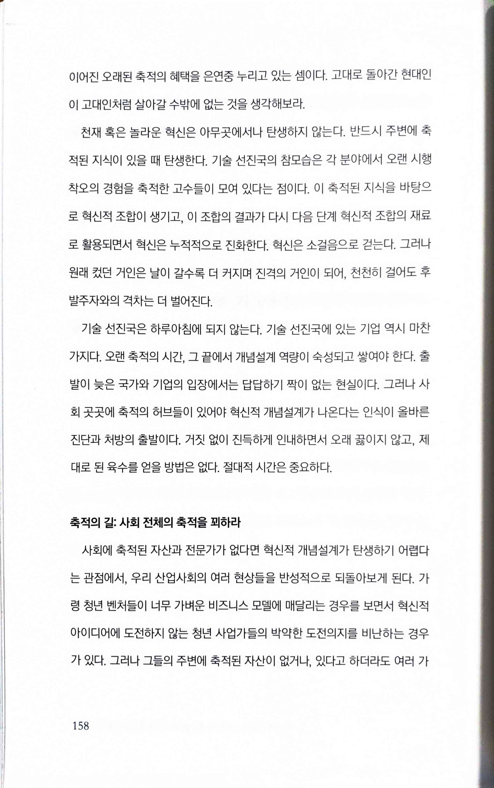

> 천재 혹은 놀라운 혁신은 아무곳에서나 탄생하지 않는다. 반드시 주변에 축적된 지식이 있을 때 탄생한다. 기술 선진국의 참모습은 각 분야에서 오랜 시행착오의 경험을 축적한 고수들이 모여 있다는 점이다. 이 축적된 지식을 바탕으로 혁신적 조합이 생기고, 이 조합의 결과가 다시 다음 단계 혁신적 조합의 재료로 활용되면서 혁신은 누적적으로 진화한다. 혁신은 소걸음으로 걷는다. 그러나 원래 컸던 거인은 날이 갈수록 더 커지며 진격의 거인이 되어, 천천히 걸어도 후발주자와의 격차는 더 벌어진다.
>
> ... 절대적 시간은 중요하다.

## 7장 축적의 전략 5. 중국의 경쟁력 비밀을 이해하고 이용하라
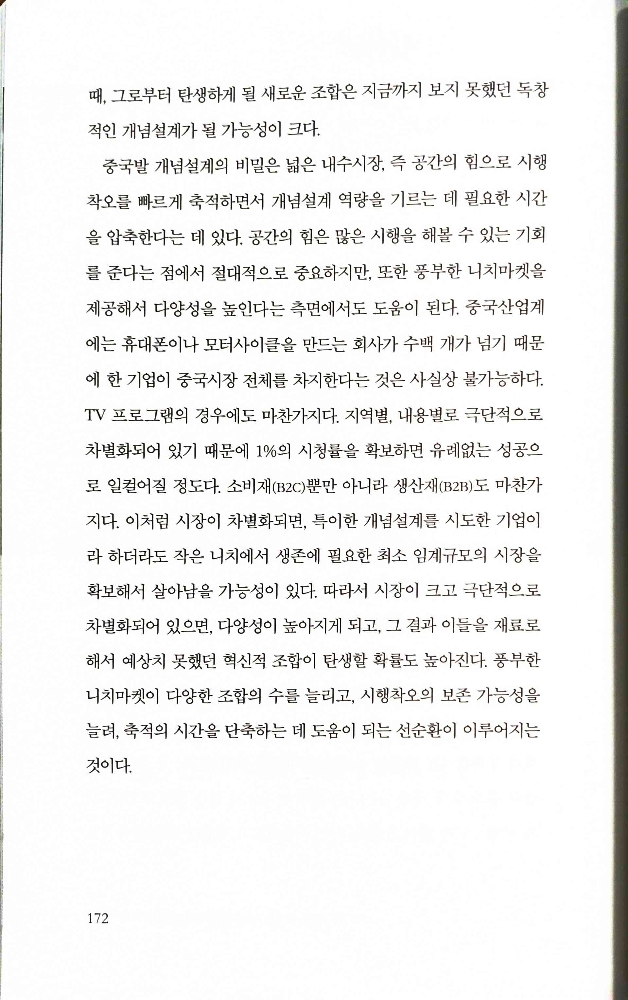

> 중국발 개념설계의 비밀은 넓은 내수시장, 즉 공간의 힘으로 시행착오를 빠르게 축적하면서 개념설계 역량을 기르는 데 필요한 시간을 압축한다는 데 있다.

# PART 3 축적에서 길을 찾다

## 8장 성장 정체의 진정한 원인
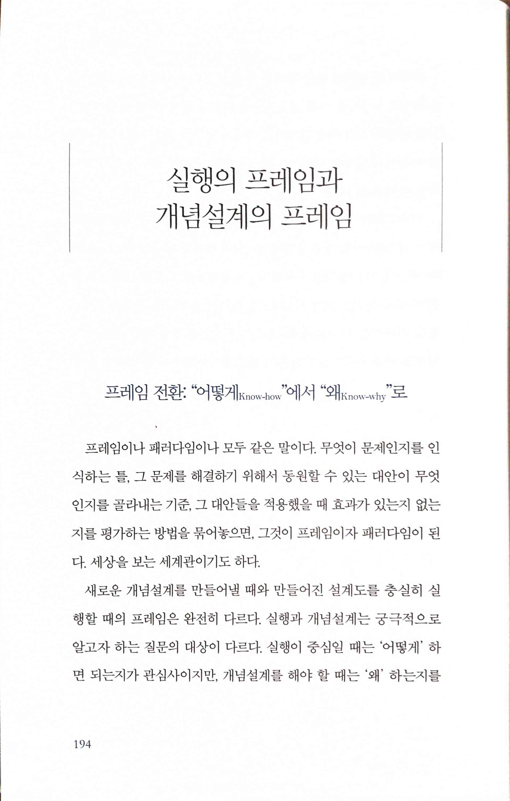

> 프레임이나 패러다임이나 모두 같은 말이다. 무엇이 문제인지를 인식하는 틀, 그 문제를 해결하기 위해서 동원할 수 있는 대안이 무엇인지를 골라내는 기준, 그 대안들을 적용했을 때 효과가 있는지 없는지를 평가하는 방법을 묶어놓으면, 그것이 프레임이자 패러다임이 된다. 세상을 보는 세계관이기도 하다.
>
> 새로운 개념설계를 만들어낼 때와 만들어진 설계도를 충실히 실행할 때의 프레임은 완전히 다르다. 실행과 개념설계는 궁극적으로알고자 하는 질문의 대상이 다르다. 실행이 중심일 때는 '어떻게 하면 되는지가 관심사이지만, 개념설계를 해야 할 때는 '왜' 하는지를 파악하지 않으면 독창적인 밑그림을 그릴 수 없다. 그래서 실행 역량을 노우-하우Know-how라고 한다면, 개념설계 역량은 노우-와이 Know-why라고 한다.

> 어떤 행위가 바람직한지를 판단하는 기준도 다르다. 실행에서는 무엇보다 효율성 Efficiency이 기준이다. 같은 산출을 얻는다면 보다 적은 투입, 같은 투입을 한다면 더 많은 산출을 얻어내는 대안이 효율성 측면에서 더 바람직한 것으로 선호된다. 그러나 '개념설계'에서는 차별성Differentiation이 기준이다. 자원을 얼마나 사용했는지 상관없이 남들과 얼마나 다른 밑그림을 그려낼 수 있는지가 중요하다.
>
> 시행착오에 대한 관점도 다르다. 이미 그려진 밑그림을 효율적으로 적용해야 하는 관점에서 보면 시행착오란 가능하면 피해야하는 부정적 사건이다. 따라서 크던 작던 실패가 발생하면 일벌백계로 누군가에게 책임을 물어, 조직 전체에 실패하지 않도록 조심하라는 신호를 보내야 한다. 반면 개념설계를 할 때는 처음 접하는 도전적 과제일수록 시행착오가 필수적이라는 인식을 당연하게 받아들인다. 오히려 시행착오를 빨리 많이 할수록 더 독창적인 밑그림을 그릴 가능성이 높기 때문에 심지어 빠른 시행착오를 조직적으로 장려하기도 한다.
* Agile 방법론과도 맞닿는 부분

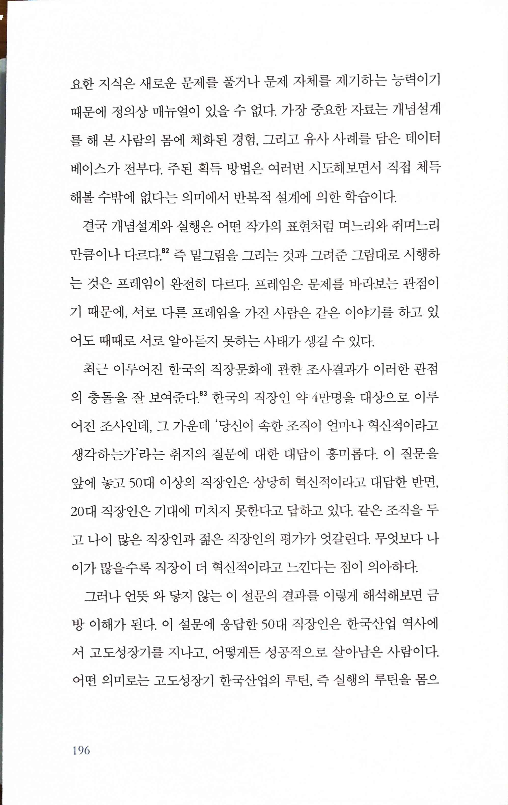

> 필요한 지식의 표현 방법도 크게 다르다. 실행에 필요한 지식은 대체로 매뉴얼이나 교과서 형태로 표현되어 있는 경우가 많다. 명시적인 형태로 표현되어 있지 않더라도 선임자, 코치, 교사, 지도자가 말이나 행동으로 직접 보여주는 방식으로라도 가르쳐줄 수 있다. 주된 획득 방법은 반복적 실행에 의한 학습이다. 이에 반해 개념설계에 필요한 지식은 새로운 문제를 풀거나 문제 자체를 제기하는 능력이기 때문에 정의상 매뉴얼이 있을 수 없다. 가장 중요한 자료는 개념설계를 해 본 사람의 몸에 체화된 경험, 그리고 유사 사례를 담은 데이터베이스가 전부다. 주된 획득 방법은 여러번 시도해보면서 직접 체득해볼 수밖에 없다는 의미에서 반복적 설계에 의한 학습이다.
>
> 한국의 직장문화에 관한 조사결과가 이러한 관점의 충돌을 잘 보여준다... '당신이 속한 조직이 얼마나 혁신적이라고 생각하는가'... 50대 이상의 직장인은 상당히 혁신적이라고 대답한 반면, 20대 직장인은 기대에 미치지 못한다고 답하고 있다.
* 문제는 여전히 조직의 실행 결정권은 50대(사실 나이가 문제가 아니라 과거의 생각에서 벗어나지 못하는 게 문제)가 대부분 가지고 있다는 점

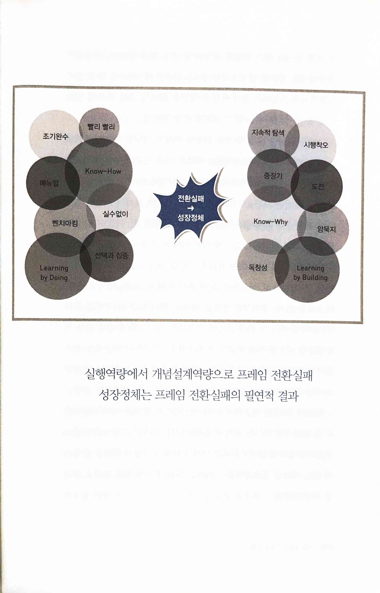

> 실행역량에서 개념설계역량으로 프레임 전환실패 성장정체는 프레임 전환실패의 필연적 결과

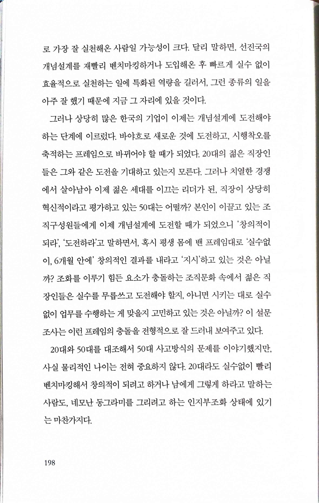

> 상당히 많은 한국의 기업이 이제는 개념설계에 도전해야 하는 단계에 이르렀다. 바야흐로 새로운 것에 도전하고, 시행착오를 축적하는 프레임으로 바뀌어야 할 때가 되었다... 치열한 경쟁에서 살아남아 이제 젊은 세대를 이끄는 리더가 된, 직장이 상당히 혁신적이라고 평가하고 있는 50대는 어떨까? 본인이 이끌고 있는 조직구성원들에게 이제 개념설계에 도전할 때가 되었으니 '창의적이 되라', '도전하라'고 말하면서, 혹시 평생 몸에 밴 프레임대로 실수없이, 6개월 안에' 창의적인 결과를 내라고 '지시'하고 있는 것은 아닐까? 조화를 이루기 힘든 요소가 충돌하는 조직문화 속에서 젊은 직장인들은 실수를 무릅쓰고 도전해야 할지, 아니면 시키는 대로 실수 없이 업무를 수행하는 게 맞을지 고민하고 있는 것은 아닐까?

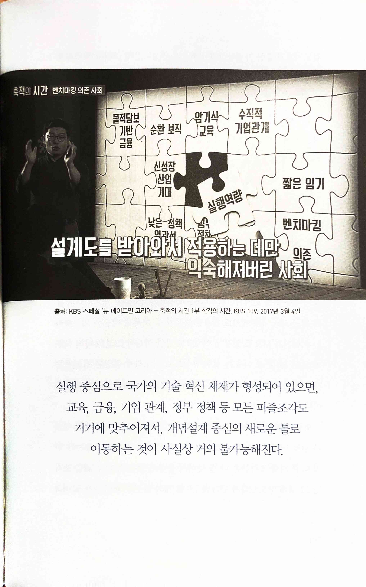

> 실행 중심으로 국가의 기술 혁신 체제가 형성되어 있으면, 교육, 금융, 기업 관계, 정부 정책 등 모든 퍼즐조각도 거기에 맞추어져서, 개념설계 중심의 새로운 틀로 이동하는 것이 사실상 거의 불가능해진다.

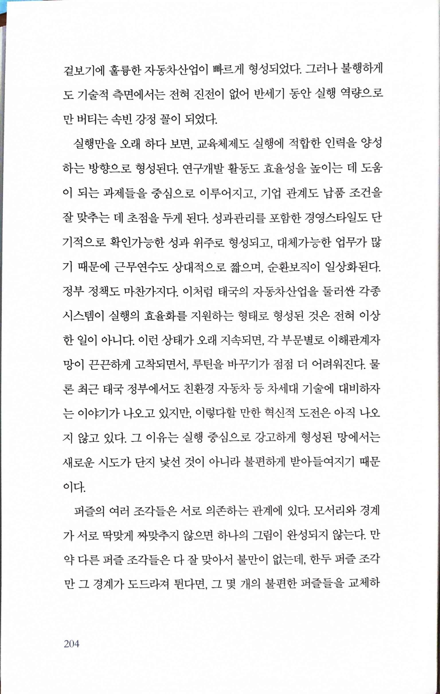

> 실행만을 오래 하다 보면, 교육체제도 실행에 적합한 인력을 양성하는 방향으로 형성된다. 연구개발 활동도 효율성을 높이는 데 도움이 되는 과제들을 중심으로 이루어지고, 기업 관계도 납품 조건을 잘 맞추는 데 초점을 두게 된다. 성과관리를 포함한 경영스타일도 단기적으로 확인가능한 성과 위주로 형성되고, 대체가능한 업무가 많기 때문에 근무연수도 상대적으로 짧으며, 순환보직이 일상화된다. 정부 정책도 마찬가지다. 이처럼 태국의 자동차산업을 둘러싼 각종 시스템이 실행의 효율화를 지원하는 형태로 형성된 것은 전혀 이상한 일이 아니다. 이런 상태가 오래 지속되면, 각 부문별로 이해관계자망이 끈끈하게 고착되면서, 루틴을 바꾸기가 점점 더 어려워진다. 물론 최근 태국 정부에서도 친환경 자동차 등 차세대 기술에 대비하자는 이야기가 나오고 있지만, 이렇다할 만한 혁신적 도전은 아직 나오지 않고 있다. 그 이유는 실행 중심으로 강고하게 형성된 망에서는 새로운 시도가 단지 낯선 것이 아니라 불편하게 받아들여지기 때문이다.

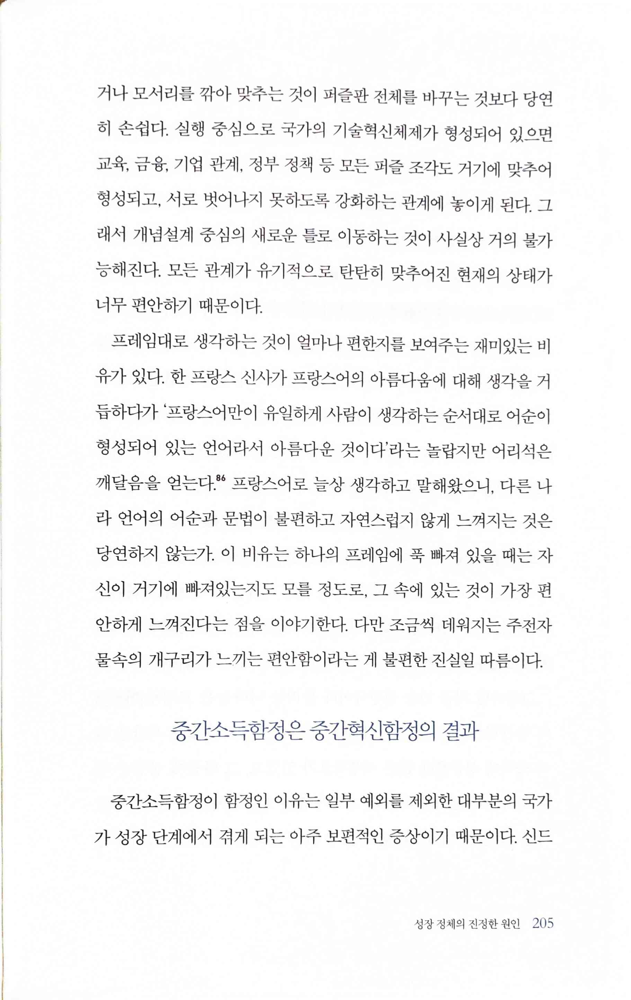

> 실행 중심으로 국가의 기술혁신체제가 형성되어 있으면 교육, 금융, 기업 관계, 정부 정책 등 모든 퍼즐 조각도 거기에 맞추어 형성되고, 서로 벗어나지 못하도록 강화하는 관계에 놓이게 된다. 그래서 개념설계 중심의 새로운 틀로 이동하는 것이 사실상 거의 불가능해진다. 모든 관계가 유기적으로 탄탄히 맞추어진 현재의 상태가 너무 편안하기 때문이다.
>
> ... 하나의 프레임에 푹 빠져 있을 때는 자신이 거기에 빠져있는지도 모를 정도로, 그 속에 있는 것이 가장 편안하게 느껴진다는 점을 이야기한다. 다만 조금씩 데워지는 주전자 물속의 개구리가 느끼는 편안함이라는 게 불편한 진실일 따름이다.

## 9장 '메이드 인 코리아', 반 잔의 물

> 자본재 도입과 제조업기반, 그리고 수출이라는 전략적 키워드를 바탕으로 실행을 통한 학습이 이루어졌고, 실행 역량을 축적하면서 세계적 수준의 제조 역량, 이른바 메뉴팩처링 엑셀런시 Manufacturing Excellency가 길러졌다.
>
> ... 아무런 축적기반이 없는 상태에서 이 모든 것들을 해낸다는 것은 그 자체로 놀라운 도전의 과정이다.
 
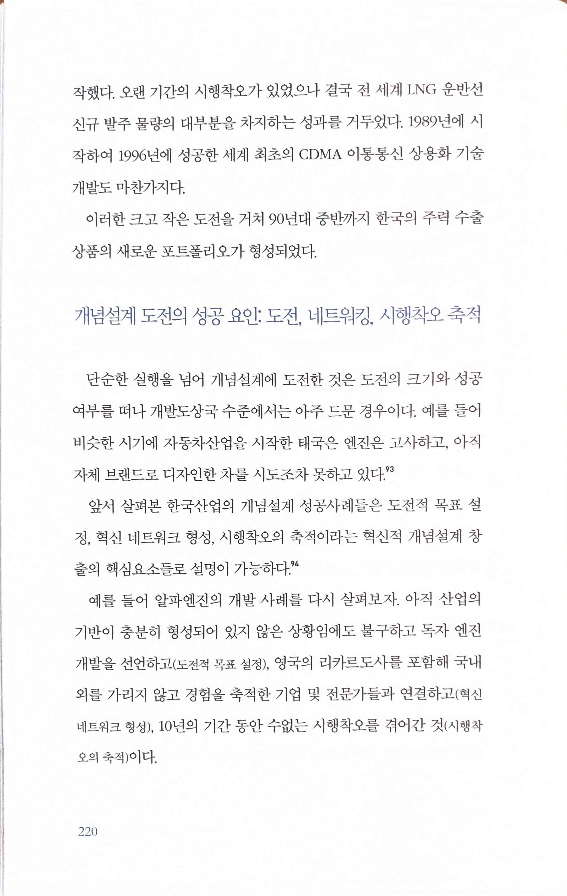

> 한국산업의 개념설계 성공사례들은 도전적 목표 설정, 혁신 네트워크 형성, 시행착오의 축적이라는 혁신적 개념설계 창출의 핵심요소들로 설명이 가능하다.

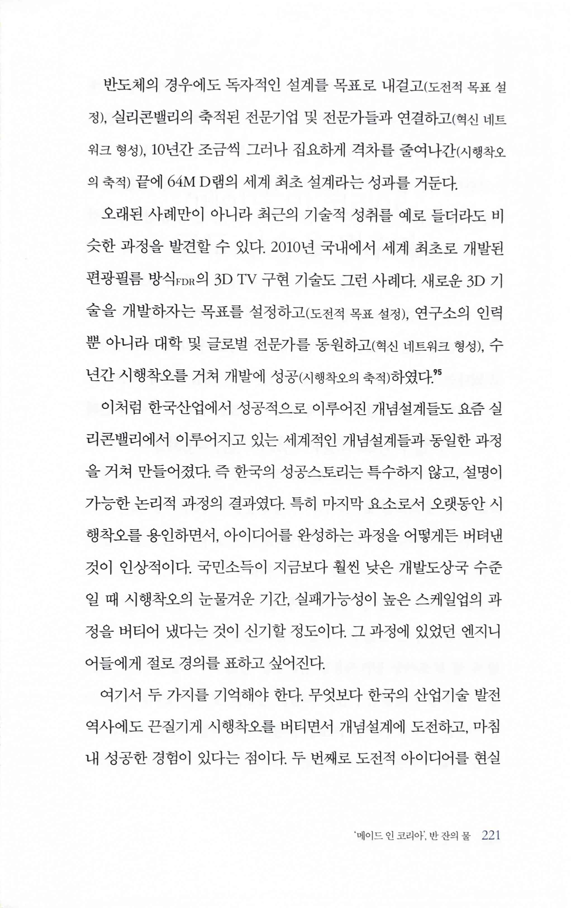 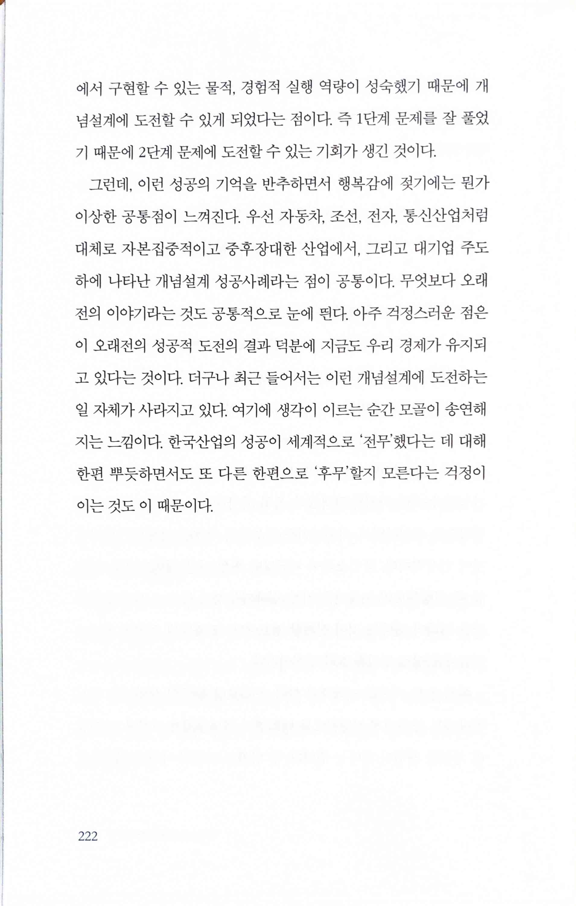

> 한국산업에서 성공적으로 이루어진 개념설계들도 요즘 실리콘밸리에서 이루어지고 있는 세계적인 개념설계들과 동일한 과정을 거쳐 만들어졌다. 즉 한국의 성공스토리는 특수하지 않고, 설명이 가능한 논리적 과정의 결과였다. 특히 마지막 요소로서 오랫동안 시행착오를 용인하면서, 아이디어를 완성하는 과정을 어떻게든 버텨낸 것이 인상적이다. 국민소득이 지금보다 훨씬 낮은 개발도상국 수준일 때 시행착오의 눈물겨운 기간, 실패가능성이 높은 스케일업의 과정을 버티어 냈다는 것이 신기할 정도이다. 그 과정에 있었던 엔지니어들에게 절로 경의를 표하고 싶어진다.
>
> 여기서 두 가지를 기억해야 한다. 무엇보다 한국의 산업기술 발전 역사에도 끈질기게 시행착오를 버티면서 개념설계에 도전하고, 마침내 성공한 경험이 있다는 점이다. 두 번째로 도전적 아이디어를 현실에서 구현할 수 있는 물적, 경험적 실행 역량이 성숙했기 때문에 개념설계에 도전할 수 있게 되었다는 점이다. 즉 1단계 문제를 잘 풀었기 때문에 2단계 문제에 도전할 수 있는 기회가 생긴 것이다.
>
> 이상한 공통점... 우선 자동차, 조선, 전자, 통신산업처럼 대체로 자본집중적이고 중후장대한 산업에서, 그리고 대기업 주도하에 나타난 개념설계 성공사례라는 점. 무엇보다 오래전의 이야기라는 점... 최근 들어서는 이런 개념설계에 도전하는 일 자체가 사라지고 있다.

> 한국 기업의 투자 의사결정 속도가 날이 갈수록 느려지고, 투자 분야도 보수적으로 변해간다는 비판이 많이 제기되고 있다. 기업 의사결정의 보수화는 기업 부문의 유보금이 커지고, 면세점 등 제도적 독점이라 할 수 있는 사업에 많은 기업들이 사활을 걸고 있는 상황을 통해 일부 드러난다.  똑똑한 학생들이 의사와 변호사가 되는 길로 몰리는 현상을 보며 청년들을 향해 도전하지 않는 세대라고 혀를 끌끌 차지만, 기업들의 안전한 투자 성향을 보노라면 마치 거울 이미지를 보는 듯하다. 반면 일본의 높은 기술경쟁력, 개념설계 역량은 일본 기업이 부활하는 데 결정적인 발판이 되고 있다. '빨리 빨리'가 '꾸준함'을 이긴 알았는데, 알고 보니 착각이었던 셈이다.
>
> 성장률 저하라는 결과도 문제지만, 그 이면에서 새로운 제품과 새로운 기업의 도전이 없고, 혁신 역량이 극단적으로 양극화되어 있으며, 나아가 투자 성향이 보수화되고 제조업기반이 무너지고 있는 현상들을 보면, 지금보다 앞으로 5년 후의 미래가 더 걱정이다.
* 지금의 상황을 보면 저자가 뭐라고 할지 궁금하다

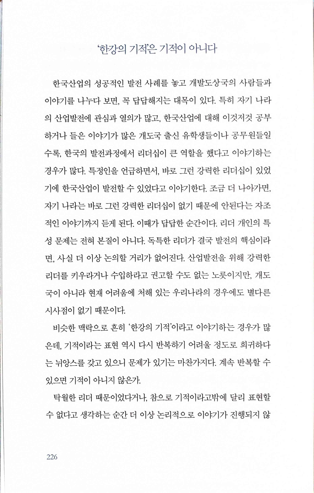 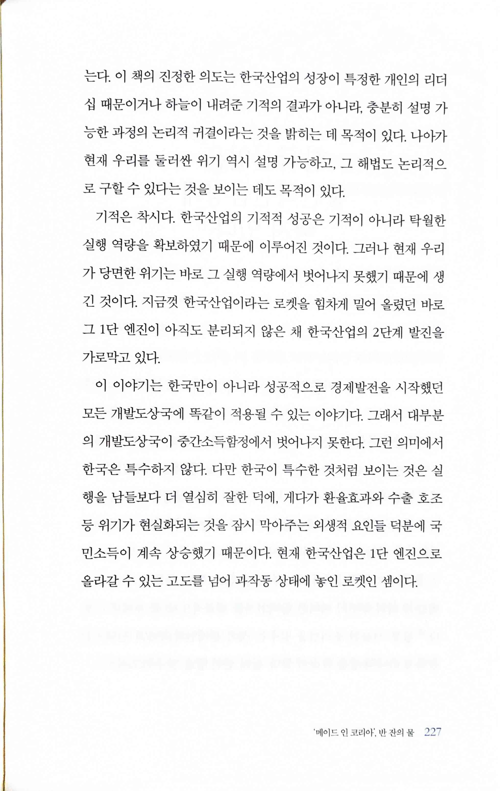

> 탁월한 리더 때문이었다거나, 참으로 기적이라고밖에 달리 표현할 수 없다고 생각하는 순간 더 이상 논리적으로 이야기가 진행되지 않는다. 이 책의 진정한 의도는 한국산업의 성장이 특정한 개인의 리더십 때문이거나 하늘이 내려준 기적의 결과가 아니라, 충분히 설명 가능한 과정의 논리적 귀결이라는 것을 밝히는 데 목적이 있다. 나아가 현재 우리를 둘러싼 위기 역시 설명 가능하고, 그 해법도 논리적으로 구할 수 있다는 것을 보이는 데도 목적이 있다.
>
> 기적은 착시다. 한국산업의 기적적 성공은 기적이 아니라 탁월한 실행 역량을 확보하였기 때문에 이루어진 것이다. 그러나 현재 우리가 당면한 위기는 바로 그 실행 역량에서 벗어나지 못했기 때문에 생긴 것이다. 지금껏 한국산업이라는 로켓을 힘차게 밀어 올렸던 바로 그 1단 엔진이 아직도 분리되지 않은 채 한국산업의 2단계 발진을 가로막고 있다.

 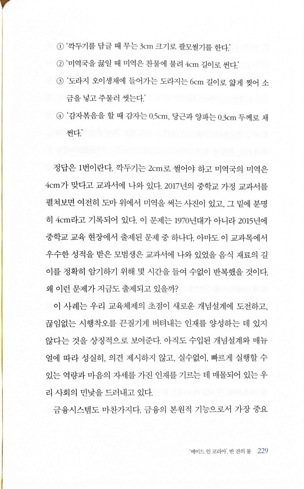

> 한국산업은 중간혁신함정에 빠져 있다. 빨리 빨리, 실수없이, 벤치마킹하면서, 유량 Flow 중심으로 일시에 자원을 동원해서 해결하고 타깃을 재빨리 옮겨가는 실행자 루틴에 빠져 있다. 실행의 습관에 오래빠져 있다 보니, 산업을 둘러싼 모든 제도와 문화가 이를 지원하거나강화하는 방향으로 퍼즐처럼 맞추어져 있다.
>
> 우리 교육체제의 초점이 새로운 개념설계에 도전하고, 끊임없는 시행착오를 끈질기게 버텨내는 인재를 양성하는 데 있지않다는 것을 상징적으로 보여준다. 아직도 수입된 개념설계와 매뉴얼에 따라 성실히, 의견 제시하지 않고, 실수없이 빠르게 실행할 수있는 역량과 마음의 자세를 가진 인재를 기르는 데 매몰되어 있는 우리 사회의 민낯을 드러내고 있다.

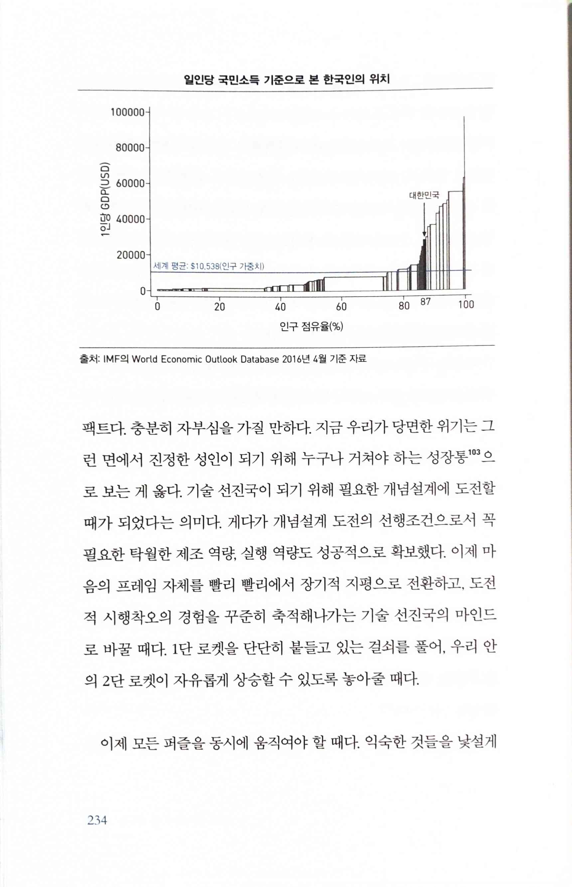

> 지금 우리가 당면한 위기는 그런 면에서 진정한 성인이 되기 위해 누구나 거쳐야 하는 성장통으로 보는 게 옳다. 기술 선진국이 되기 위해 필요한 개념설계에 도전할 때가 되었다는 의미다. 게다가 개념설계 도전의 선행조건으로서 꼭 필요한 탁월한 제조 역량, 실행 역량도 성공적으로 확보했다. 이제 마음의 프레임 자체를 빨리 빨리에서 장기적 지평으로 전환하고, 도전적 시행착오의 경험을 꾸준히 축적해나가는 기술 선진국의 마인드로 바꿀 때다.

## 10장 기술 선진국의 비전과 축적의 길

### 축적의 길로 가는 4개의 열쇠

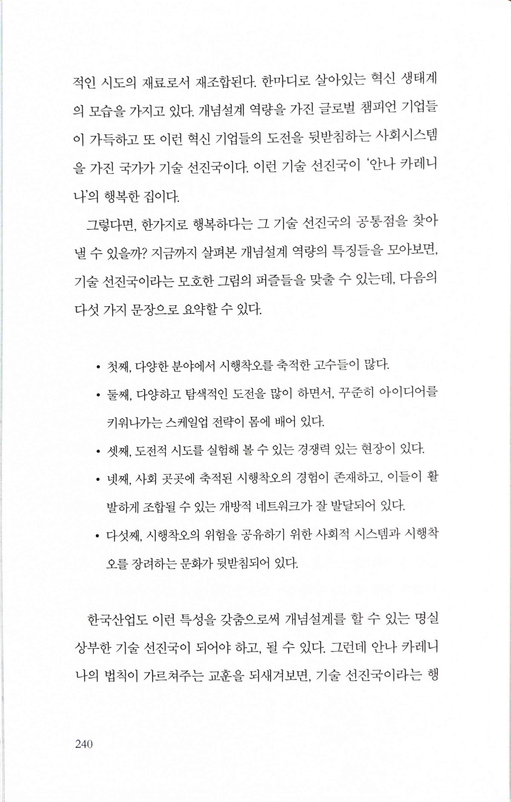

> 개념설계 역량의 특징들
>
> • 첫째, 다양한 분야에서 시행착오를 축적한 고수들이 많다.
>
> • 둘째, 다양하고 탐색적인 도전을 많이 하면서 꾸준히 아이디어를 키워나가는 스케일업 전략이 몸에 배어 있다.
>
> • 셋째, 도전적 시도를 실험해 볼 수 있는 경쟁력 있는 현장이 있다., 이들이 활
>
> • 넷째, 사회 곳곳에 축적된 시행착오의 경험이 존재하고발하게 조합될 수 있는 개방적 네트워크가 잘 발달되어 있다.
>
> • 다섯째, 시행착오의 위험을 공유하기 위한 사회적 시스템과 시행착오를 장려하는 문화가 뒷받침되어 있다.

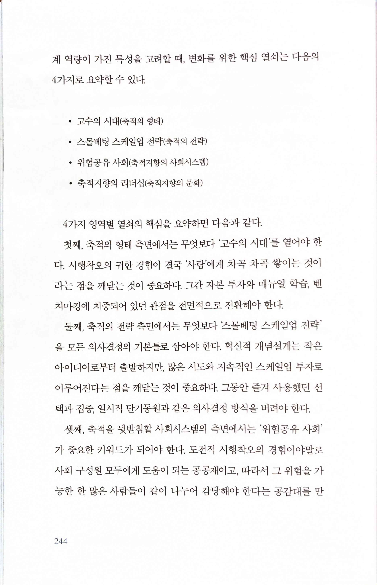 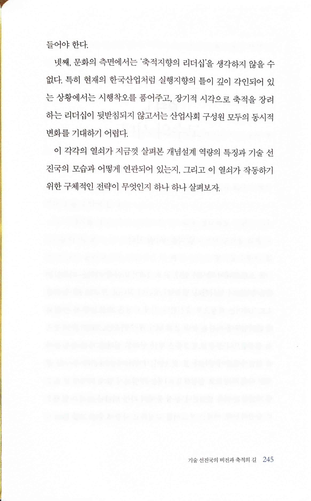

> 변화를 위한 핵심 열쇠
>
> • 고수의 시대(축적의 형태)
>
> • 스몰베팅 스케일업 전략(축적의 전략)
>
> • 위험공유 사회(축적지향의 사회시스템)
>
> • 축적지향의 리더십(축적지향의 문화)

### 열쇠 1. 고수의 시대
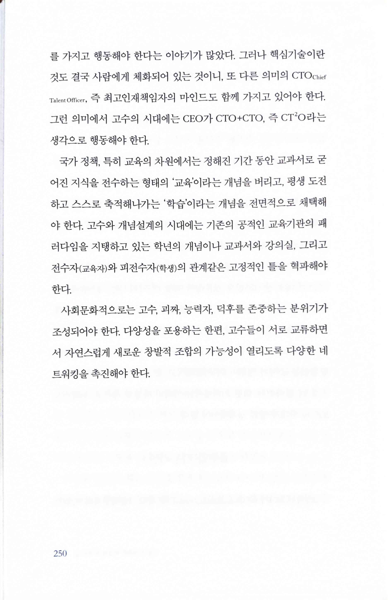

> 핵심기술이란것도 결국 사람에게 체화되어 있는 것이니, 또 다른 의미의 CTO Chief Talent Officer, 즉 최고인재책임자의 마인드도 함께 가지고 있어야 한다.
>
> 국가 정책, 특히 교육의 차원에서는 정해진 기간 동안 교과서로 굳어진 지식을 전수하는 형태의 '교육'이라는 개념을 버리고, 평생 도전하고 스스로 축적해나가는 '학습'이라는 개념을 전면적으로 채택해야 한다.
>
> 사회문화적으로는 고수, 괴짜, 능력자, 덕후를 존중하는 분위기가 조성되어야 한다.
 

### 열쇠 2. 스몰베팅 스케일업 전략
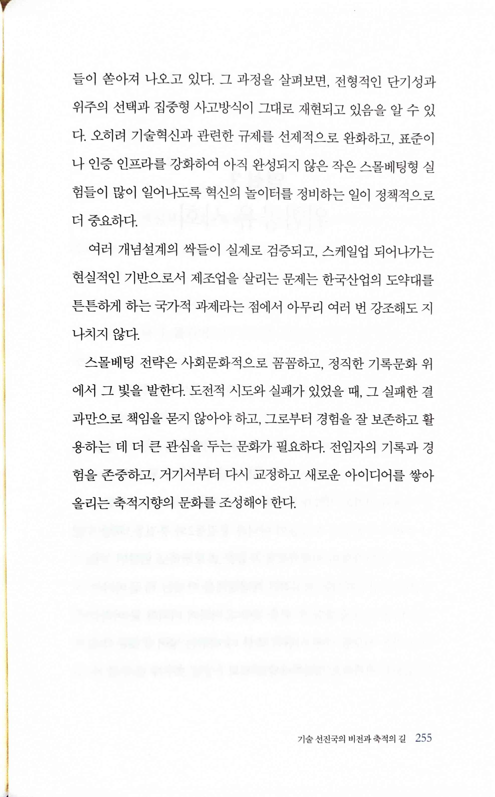

> 도전적 시도와 실패가 있었을 때, 그 실패한 결과만으로 책임을 묻지 않아야 하고, 그로부터 경험을 잘 보존하고 활용하는 데 더 큰 관심을 두는 문화가 필요하다. 전임자의 기록과 경험을 존중하고, 거기서부터 다시 교정하고 새로운 아이디어를 쌓아올리는 축적지향의 문화를 조성해야 한다.

### 열쇠 3. 위험공유 사회
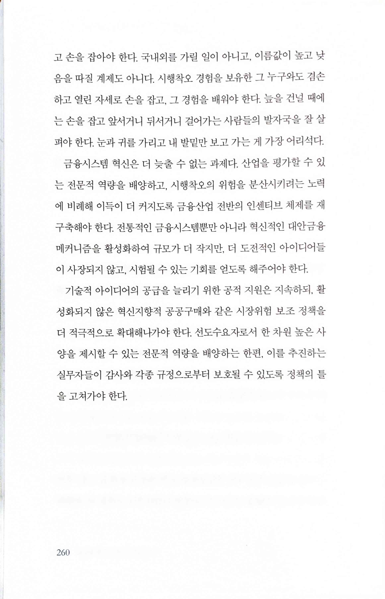

> 금융시스템 혁신은 더 늦출 수 없는 과제다. 산업을 평가할 수 있는 전문적 역량을 배양하고, 시행착오의 위험을 분산시키려는 노력에 비례해 이득이 더 커지도록 금융산업 전반의 인센티브 체제를 재구축해야 한다. 전통적인 금융시스템뿐만 아니라 혁신적인 대안금융 메커니즘을 활성화하여 규모가 더 작지만, 더 도전적인 아이디어들이 사장되지 않고, 시험될 수 있는 기회를 얻도록 해주어야 한다.

### 열쇠 4. 축적지향의 리더십
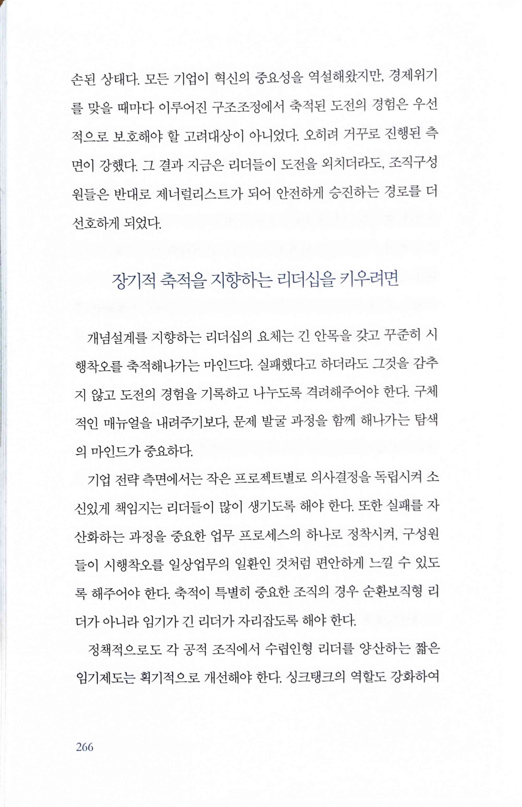

> 개념설계를 지향하는 리더십의 요체는 긴 안목을 갖고 꾸준히 시행착오를 축적해나가는 마인드다. 실패했다고 하더라도 그것을 감추지 않고 도전의 경험을 기록하고 나누도록 격려해주어야 한다. 구체적인 매뉴얼을 내려주기보다 문제 발굴 과정을 함께 해나가는 탐색의 마인드가 중요하다.
>
> 기업 전략 측면에서는 작은 프로젝트별로 의사결정을 독립시켜 소신있게 책임지는 리더들이 많이 생기도록 해야 한다. 또한 실패를 자산화하는 과정을 중요한 업무 프로세스의 하나로 정착시켜 구성원들이 시행착오를 일상업무의 일환인 것처럼 편안하게 느낄 수 있도록 해주어야 한다. 축적이 특별히 중요한 조직의 경우 순환보직형 리더가 아니라 임기가 긴 리더가 자리잡도록 해야 한다.

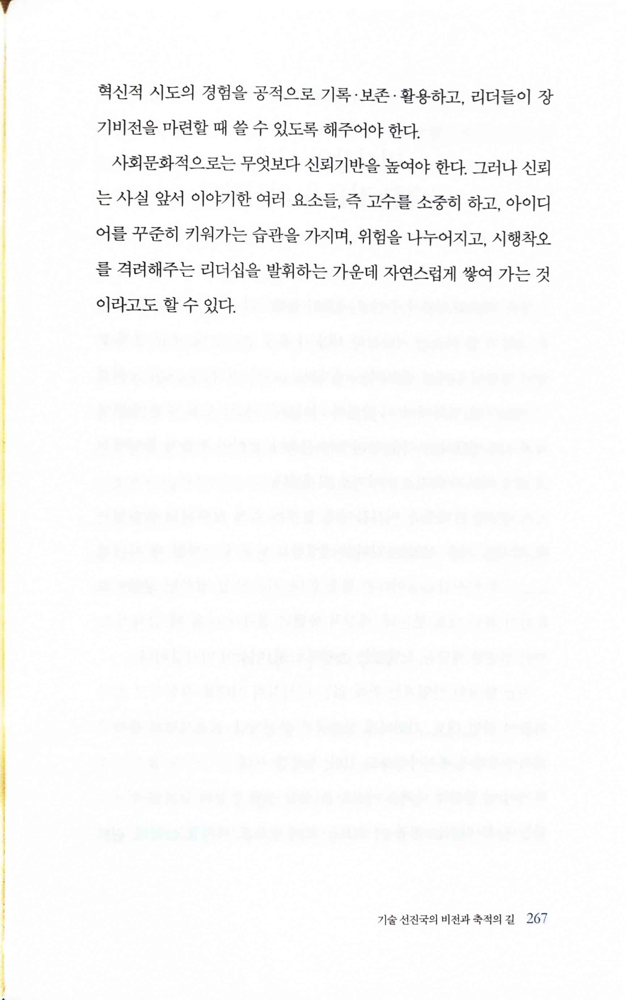

> 정책적으로도 각 공적 조직에서 수렵인형 리더를 양산하는 짧은 임기제도는 획기적으로 개선해야 한다.
>
> 사회문화적으로는 무엇보다 신뢰기반을 높여야 한다. 그러나 신뢰는 사실 앞서 이야기한 여러 요소들, 즉 고수를 소중히 하고, 아이디어를 꾸준히 키워가는 습관을 가지며, 위험을 나누어지고, 시행착오를 격려해주는 리더십을 발휘하는 가운데 자연스럽게 쌓여 가는 것이라고도 할 수 있다.

# 기타
* 왜 PIGS의 I를 아일랜드로 착각했는지 알 수 없으나, 이 책에서 반복적으로 실수를 하고 있음
  * [PIGS (economics) - Wikipedia](https://en.wikipedia.org/wiki/PIGS_(economics))
  * 위 link에서도 나오지만 PIIGS나 GIPSI로 쓰는 경우 Ireland를 포함시키곤 함
  * 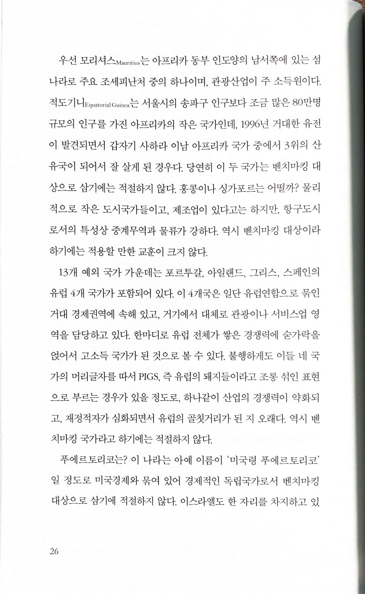
  * 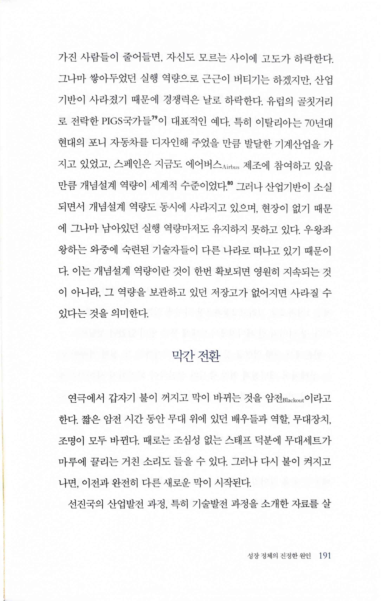
  * 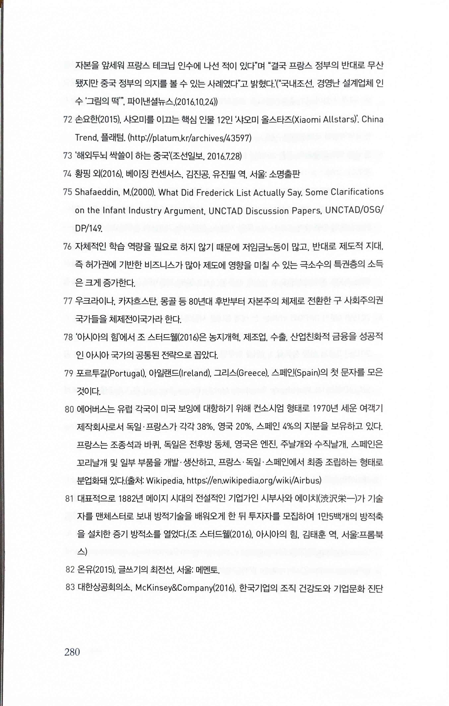