축적의 시간
===========

* 책이 나온지 좀 오래되어서 지금와서 보면 세부적인 부분은 약간 맞지 않는 부분들도 있으나 전체적인 논조는 정말 맞는 이야기. 다만 그렇게 하기 위해서는 한국 사회 전체가 바뀌어야 하는데 그걸 할 수 있는 구체적인 방법은 과연 뭘까? 과연 우리에게 시간이 남아 있을까? 이 책의 시점에서 이미 8년이 지난 지금을 보면 우리나라의 전성기가 막 지난게 아닌가 하는 의구심만이 든다.

# PART 1 '창조적 축적, 한국산업의 미래를 여는 키워드

## 0. 창조적 축적 지향의 패러다임으로 바꾸어야 한다 - 이정동
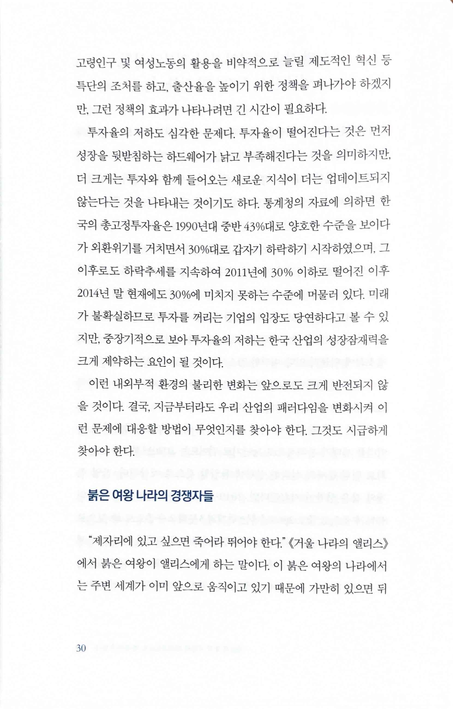 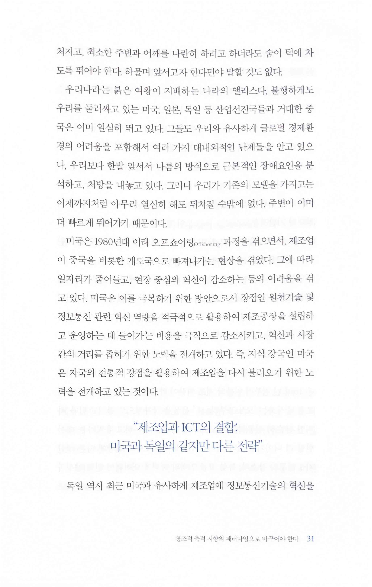

> “제자리에 있고 싶으면 죽어라 뛰어야 한다." <거울 나라의 앨리스>에서 붉은 여왕이 앨리스에게 하는 말이다. 이 붉은 여왕의 나라에서는 주변 세계가 이미 앞으로 움직이고 있기 때문에 가만히 있으면 뒤처지고, 최소한 주변과 어깨를 나란히 하려고 하더라도 숨이 턱에 차도록 뛰어야 한다. 하물며 앞서고자 한다면야 말할 것도 없다.

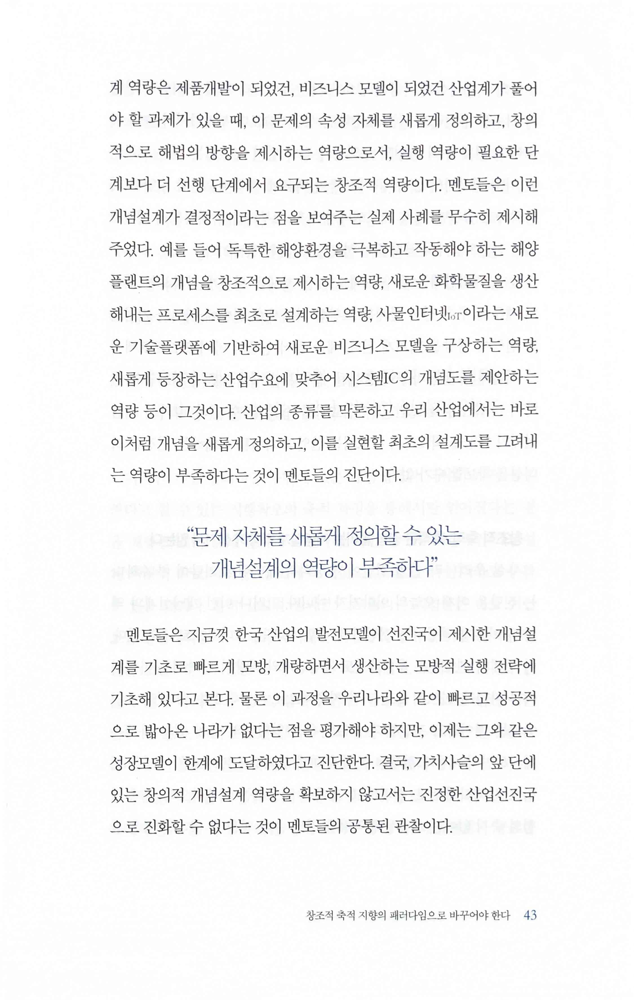

> "문제 자체를 새롭게 정의할 수 있는 개념설계의 역량이 부족하다"

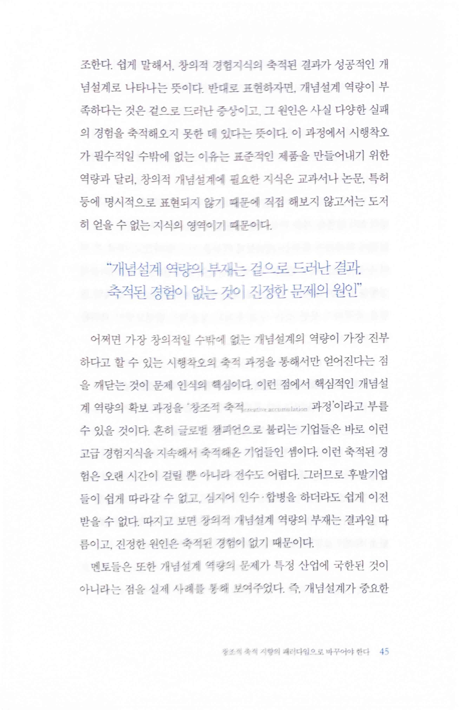

> "개념설계 역량의 부재는 겉으로 드러난 결과. 축적된 경험이 없는 것이 진정한 문제의 원인"

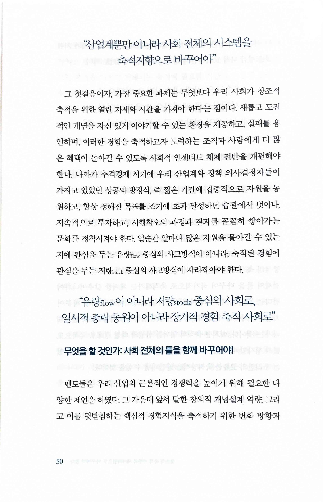

> "산업계뿐만 아니라 사회 전체의 시스템을 축적지향으로 바꾸어야"
>
> "유량flow 이 아니라 저랑stock 중심의 사회로, 일시적 총력 동원이 아니라 장기적 경험 축적 사회로"

# PART 2 멘토들에게 길을 묻다

## 1. 선진국의 비밀은 제조업의 경쟁력에 있다 - 김태유
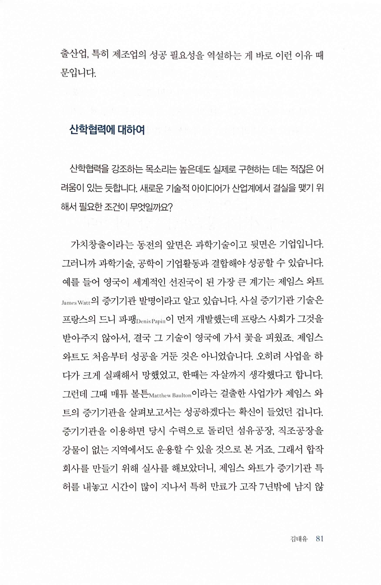

> 가치창출이라는 동전의 앞면은 과학기술이고 뒷면은 기업입니다. 그러니까 과학기술, 공학이 기업활동과 결합해야 성공할 수 있습니다.
* 제임스 와트 James Watt의 증기기관 발명, 드니 파팽 Denis Papin, 매튜 볼튼 Matthew Baulton

## 2. 축적된 경험을 통해서만 배울 수 있는 지식을 구하라 - 김용환
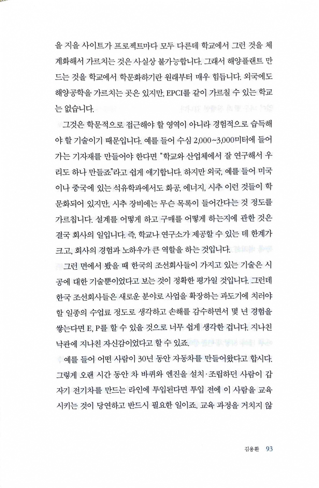

> 학문적으로 접근해야 할 영역이 아니라 경험적으로 습득해야 할 기술

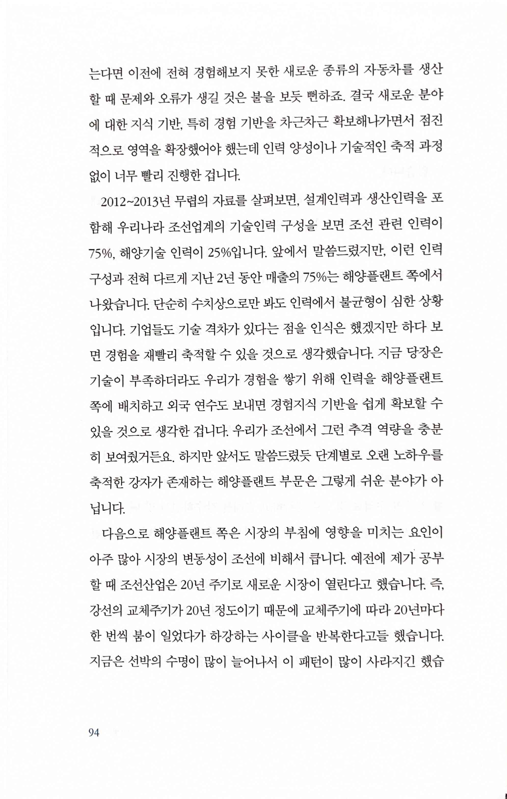

> 결국 새로운 분야에 대한 지식 기반, 특히 경험 기반을 차근차근 확보해나가면서 점진적으로 영역을 확장했어야 했는데 인력 양성이나 기술적인 축적 과정없이 너무 빨리 진행한 겁니다.

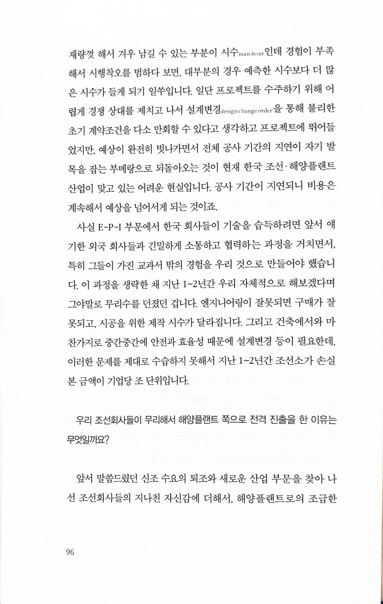

> 사실 E-P-I 부문에서 한국 회사들이 기술을 습득하려면 앞서 얘기한 외국 회사들과 긴밀하게 소통하고 협력하는 과정을 거치면서, 특히 그들이 가진 교과서 밖의 경험을 우리 것으로 만들어야 했습니다.
* 해양플랜트의 전체 과정: 엔지니어링 Engineering - 구매 Procurement - 시공 Construction - 설치 Installation

## 3. 축적된 경험 없이는 프로젝트의 큰 그림을 그릴 수 없다 - 고현무
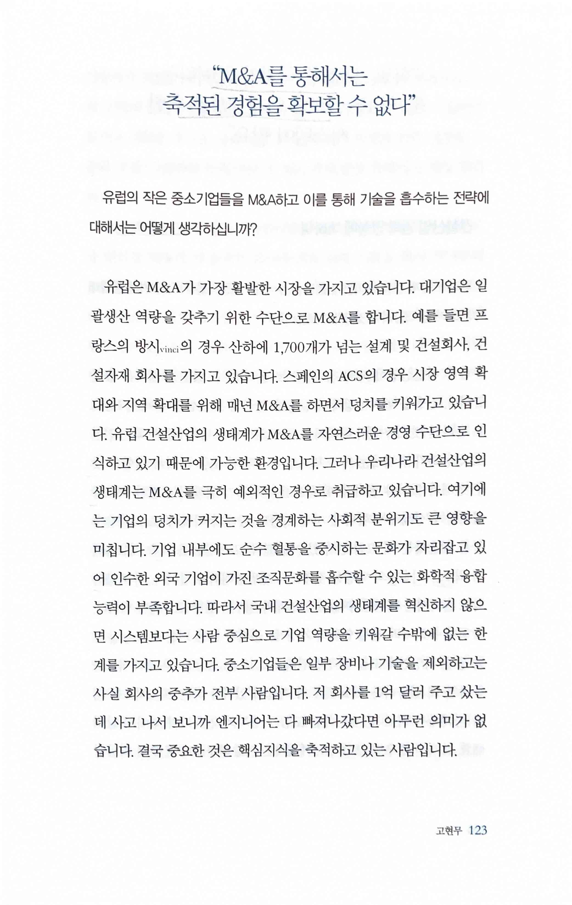

> 기업 내부에도 순수 혈통을 중시하는 문화가 자리잡고 있어 인수한 외국 기업이 가진 조직문화를 흡수할 수 있는 화학적 융합능력이 부족합니다. 따라서 국내 건설산업의 생태계를 혁신하지 않으면 시스템보다는 사람 중심으로 기업 역량을 키워갈 수밖에 없는 한계를 가지고 있습니다... 결국 중요한 것은 핵심지식을 축적하고 있는 사람입니다.
* 건설산업에 국한된 문제는 아닐 듯

## 4. 교과서에 없는 것은 직접 경험하면서 배워야 한다 - 한종훈

## 5. 기술을 아는 CEO가 없다 - 신창수
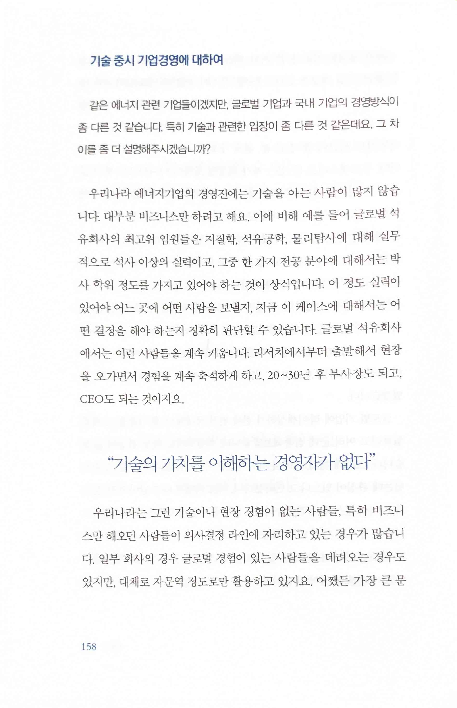

> "기술의 가치를 이해하는 경영자가 없다"

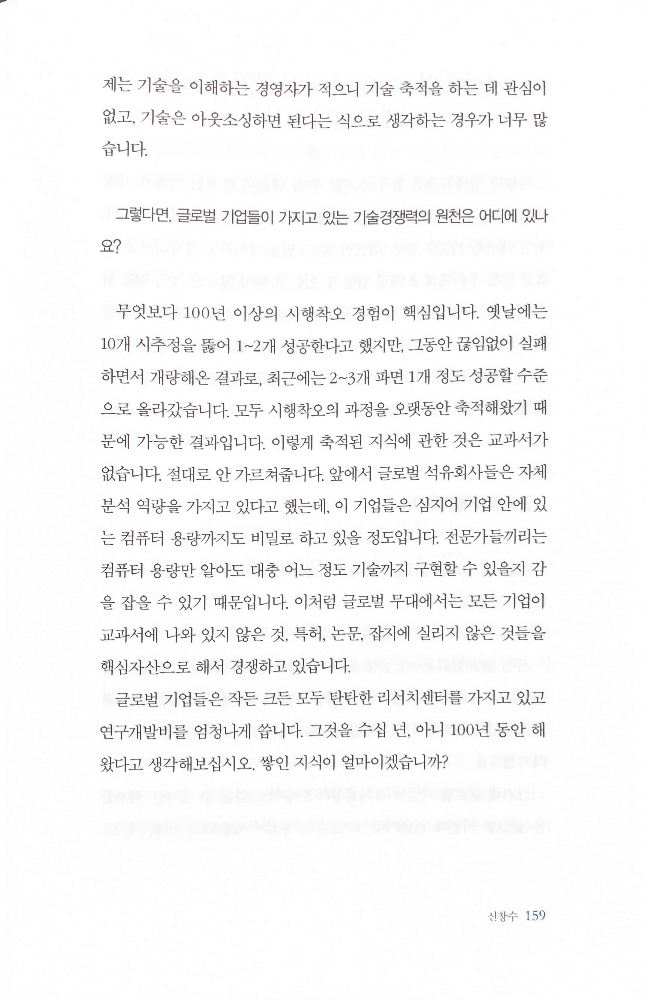

> 가장 큰 문제는 기술을 이해하는 경영자가 적으니 기술 축적을 하는 데 관심이 없고, 기술은 아웃소싱하면 된다는 식으로 생각하는 경우가 너무 많습니다.
>
> 글로벌 무대에서는 모든 기업이 교과서에 나와 있지 않은 것, 특허, 논문, 잡지에 실리지 않은 것들을 핵심자산으로 해서 경쟁하고 있습니다.

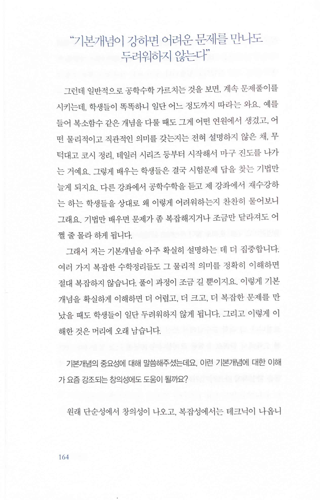 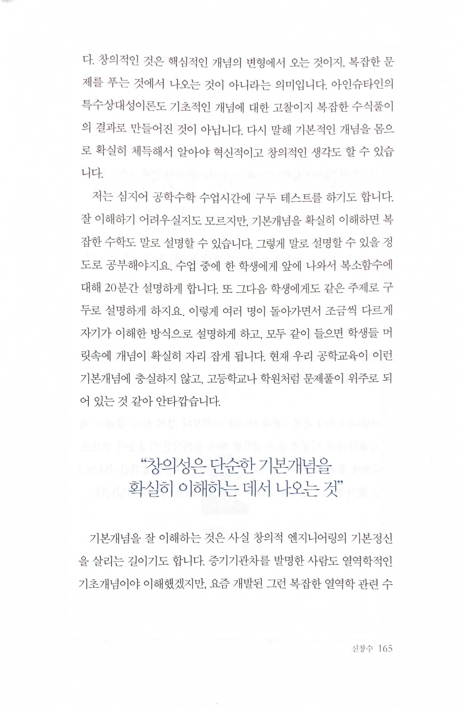

> 단순성에서 창의성이 나오고, 복잡성에서는 테크닉이 나옵니다. 창의적인 것은 핵심적인 개념의 변형에서 오는 것이지, 복잡한 문제를 푸는 것에서 나오는 것이 아니라는 의미입니다. 아인슈타인의 특수상대성이론도 기초적인 개념에 대한 고찰이지 복잡한 수식풀이의 결과로 만들어진 것이 아닙니다. 다시 말해 기본적인 개념을 몸으로 확실히 체득해서 알아야 혁신적이고 창의적인 생각도 할 수 있습니다.
>
> "창의성은 단순한 기본개념을 확실히 이해하는 데서 나오는 것”

## 6. 급속한 ICT 패러다임 변화의 물결 속에 한국이 잠기고 있다 - 이병기
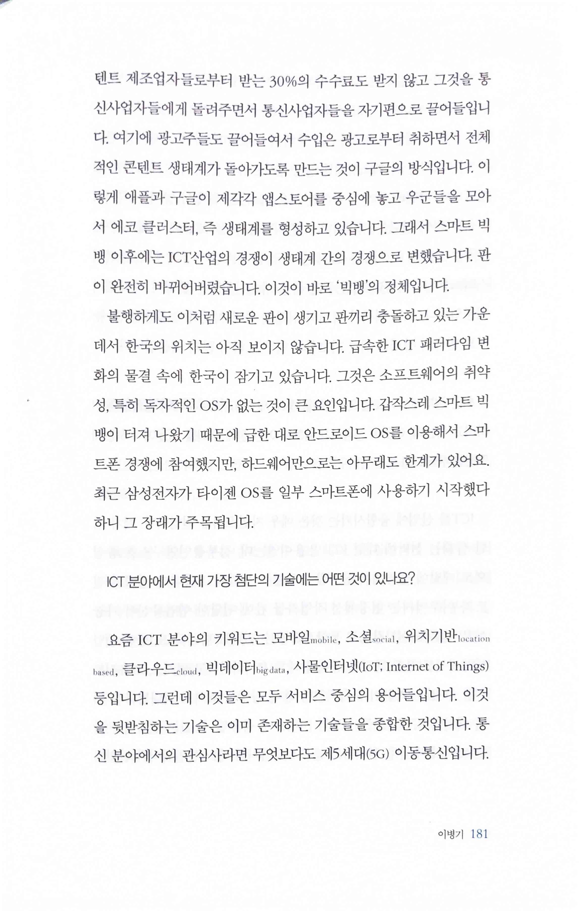

> 최근 삼성전자가 타이젠 OS를 일부 스마트폰에 사용하기 시작했다하니 그 장래가 주목됩니다.
* 정말 기대를 했다면 아무리 뛰어난 교수님이라도 잘못 생각한 것. 주변 개발자들은 아무도 기대한 사람이 없었음. 기술 문제가 아니라 문화적으로 sw 개발을 잘할 거란 기대를 할 수가 없었던 상황

## 7. 기초와 응용을 넘어선 제3의 지식, 아키텍처의 영역에 도전하라 - 박영준
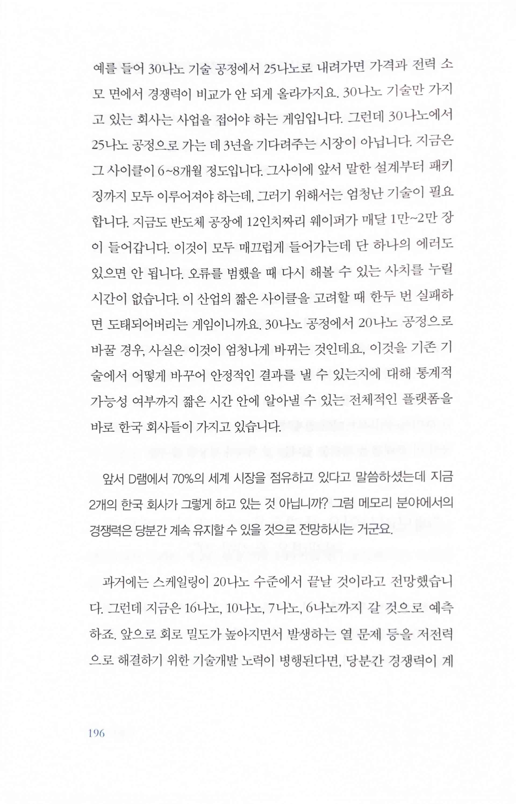

* 책의 시간을 느낄 수 있는 부분. 지금은 3나노를 갈 수 있느냐 여부가 모두의 관심사인데, 이 책의 현재는 20~30나노를 이야기하는 시절

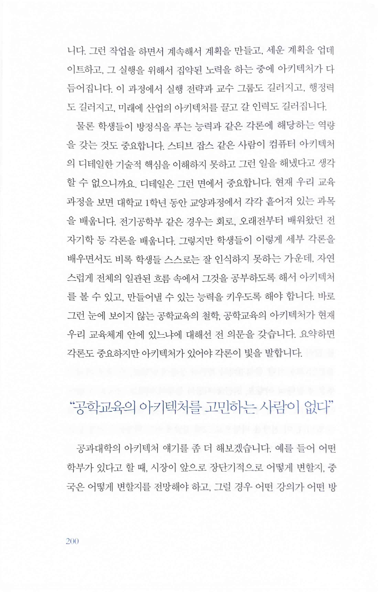

> 스티브 잡스 같은 사람이 컴퓨터 아키텍처의 디테일한 기술적 핵심을 이해하지 못하고 그런 일을 해냈다고 생각할 수 없으니까요.
* 뭘 이야기하고 싶은지는 알겠지만 아키텍쳐의 디테일을 이해했다고 보기는 어렵지 않을까?

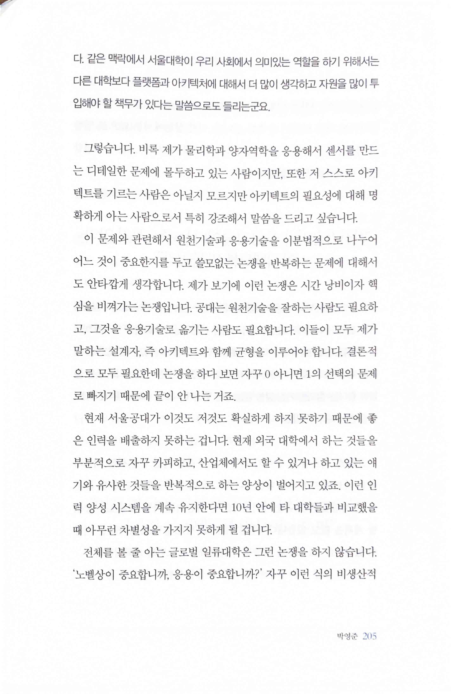

> 이 문제와 관련해서 원천기술과 응용기술을 이분법적으로 나누어 어느 것이 중요한지를 두고 쓸모없는 논쟁을 반복하는 문제에 대해서도 안타깝게 생각합니다. 제가 보기에 이런 논쟁은 시간 낭비이자 핵심을 비껴가는 논쟁입니다. 공대는 원천기술을 잘하는 사람도 필요하고, 그것을 응용기술로 옮기는 사람도 필요합니다. 이들이 모두 제가 말하는 설계자, 즉 아키텍트와 함께 균형을 이루어야 합니다. 결론적으로 모두 필요한데 논쟁을 하다 보면 자꾸 0 아니면 1의 선택의 문제로 빠지기 때문에 끝이 안 나는 거죠.

## 8. 반도체, 7~8년 뒤가 문제다 - 이종호
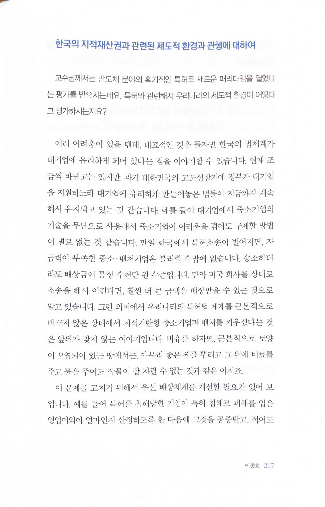

> 여러 어려움이 있을 텐데, 대표적인 것을 들자면 한국의 법체계가 대기업에 유리하게 되어 있다는 점을 이야기할 수 있습니다. 현재 조금씩 바뀌고는 있지만, 과거 대한민국의 고도성장기에 정부가 대기업을 지원하느라 대기업에 유리하게 만들어놓은 법들이 지금까지 계속해서 유지되고 있는 것 같습니다. 예를 들어 대기업에서 중소기업의 기술을 무단으로 사용해서 중소기업이 어려움을 겪어도 구제할 방법이 별로 없는 것 같습니다. 만일 한국에서 특허소송이 벌어지면, 자금력이 부족한 중소·벤처기업은 불리할 수밖에 없습니다. 승소하더라도 배상금이 통상 수천만 원 수준입니다. 만약 미국 회사를 상대로 소송을 해서 이긴다면, 훨씬 더 큰 금액을 배상받을 수 있는 것으로 알고 있습니다. 그런 의미에서 우리나라의 특허법 체계를 근본적으로 바꾸지 않은 상태에서 지식기반형 중소기업과 벤처를 키우겠다는 것은 앞뒤가 맞지 않는 이야기입니다. 비유를 하자면, 근본적으로 토양이 오염되어 있는 땅에서는 아무리 좋은 씨를 뿌리고 그 위에 비료를 주고 물을 주어도 작물이 잘 자랄 수 없는 것과 같은 이치죠.

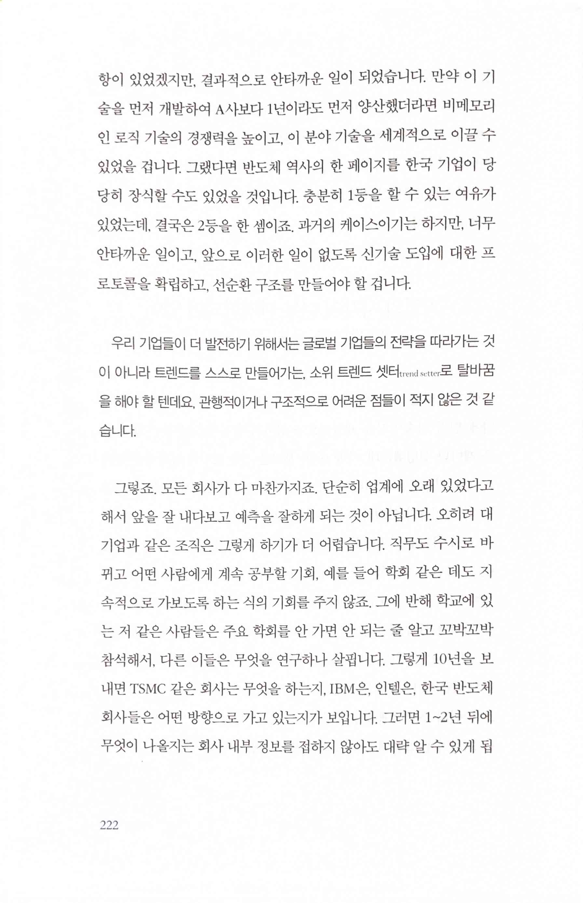

> 단순히 업계에 오래 있었다고해서 앞을 잘 내다보고 예측을 잘하게 되는 것이 아닙니다. 오히려 대기업과 같은 조직은 그렇게 하기가 더 어렵습니다.

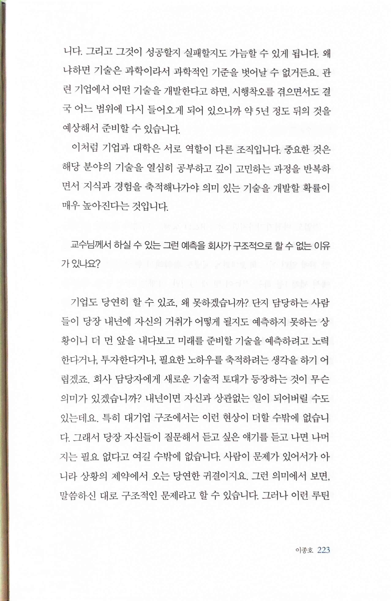

> 이처럼 기업과 대학은 서로 역할이 다른 조직입니다. 중요한 것은 해당 분야의 기술을 열심히 공부하고 깊이 고민하는 과정을 반복하면서 지식과 경험을 축적해나가야 의미 있는 기술을 개발할 확률이 매우 높아진다는 것입니다.
>
> 기업도 당연히 할 수 있죠. 왜 못하겠습니까?... 사람이 문제가 있어서가 아니라 상황의 제약에서 오는 당연한 귀결이지요. 그런 의미에서 보면, 말씀하신 대로 구조적인 문제라고 할 수 있습니다.

## 9. 반도체의 성공 경험이 모든 사업에서 다 통하는 것은 아니다 - 황기웅
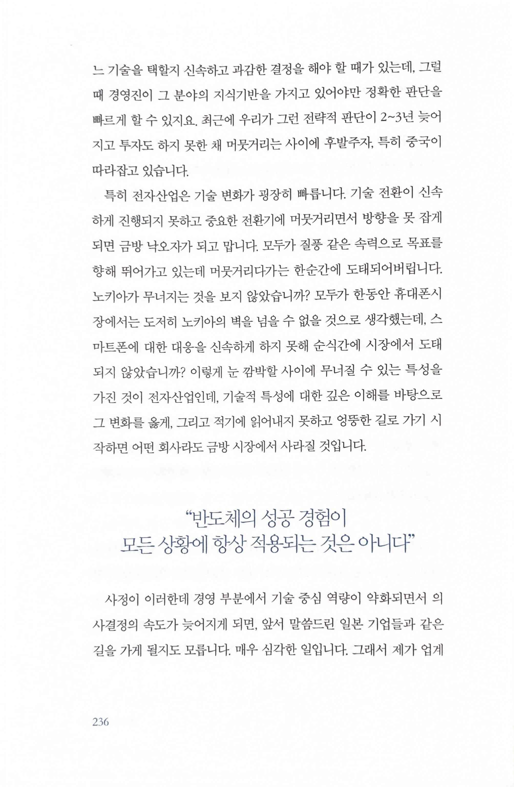

> 기술의 분기점에서 어느 기술을 택할지 신속하고 과감한 결정을 해야 할 때가 있는데, 그럴때 경영진이 그 분야의 지식기반을 가지고 있어야만 정확한 판단을 빠르게 할 수 있지요.
>
> “반도체의 성공 경험이 모든 상황에 항상 적용되는 것은 아니다"
>
> 사정이 이러한데 경영 부분에서 기술 중심 역량이 약화되면서 의사결정의 속도가 늦어지게 되면, 앞서 말씀드린 일본 기업들과 같은 길을 가게 될지도 모릅니다. 매우 심각한 일입니다.
 
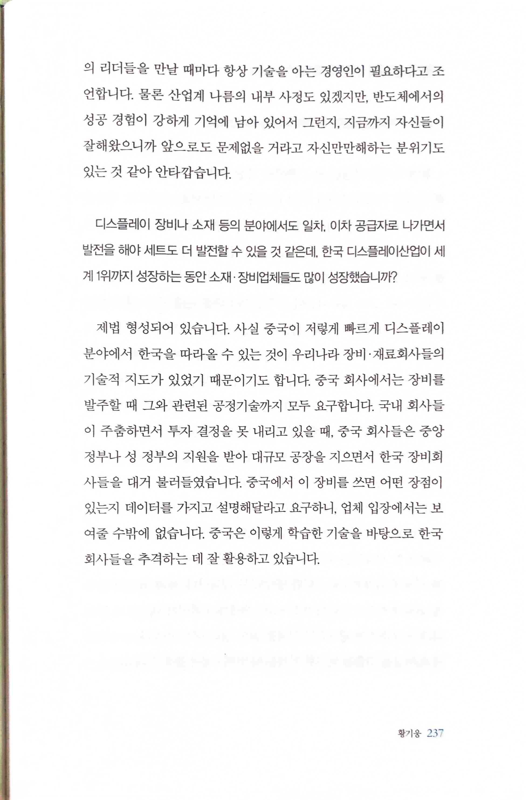

> 물론 산업계 나름의 내부 사정도 있겠지만, 반도체에서의 성공 경험이 강하게 기억에 남아 있어서 그런지, 지금까지 자신들이 잘해왔으니까 앞으로도 문제없을 거라고 자신만만해하는 분위기도 있는 것 같아 안타깝습니다.

## 10. 시스템업체의 소재부품업체 수직계열화 방식은 더 이상 경쟁력이 없다 - 김형준

## 11. 차세대 기술에 대한 투자는 시기가 있다. 놓치면 따라잡지 못한다 - 이창희

> 우리는 항상 첨단의 팬시한 것만 추구하는 경향이 있어요.

## 12. 시작부터 글로벌을 지향하지 않는 소프트웨어는 무의미하다 - 차상균
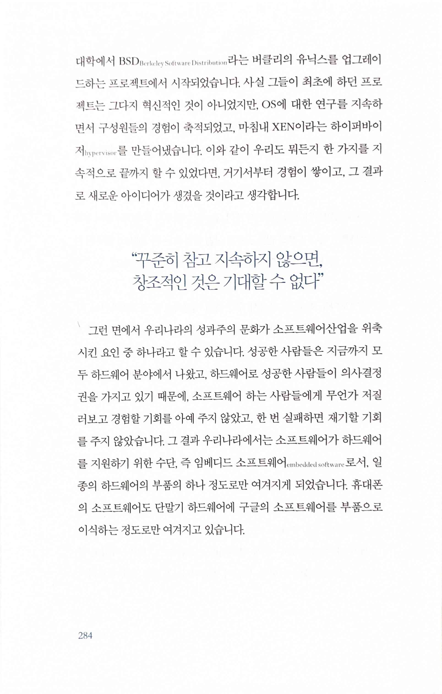

> 우리도 뭐든지 한 가지를 지속적으로 끝까지 할 수 있었다면, 거기서부터 경험이 쌓이고, 그 결과로 새로운 아이디어가 생겼을 것이라고 생각합니다.
>
> "꾸준히 참고 지속하지 않으면, 창조적인 것은 기대할수 없다"
>
> 그런 면에서 우리나라의 성과주의 문화가 소프트웨어산업을 위축시킨 요인 중 하나라고 할 수 있습니다. 성공한 사람들은 지금까지 모두 하드웨어 분야에서 나왔고, 하드웨어로 성공한 사람들이 의사결정권을 가지고 있기 때문에, 소프트웨어 하는 사람들에게 무언가 저질러보고 경험할 기회를 아예 주지 않았고, 한 번 실패하면 재기할 기회를 주지 않았습니다.

## 13. 변화와 도전을 반기는 사회 분위기에서 혁신이 꽃핀다 - 서승우

## 14. 위험과 성과를 공유하는 파트너십형 산학협력이 필요하다 - 최만수

## 15. 기초가 없는 융합은 거짓말이다 - 현택환
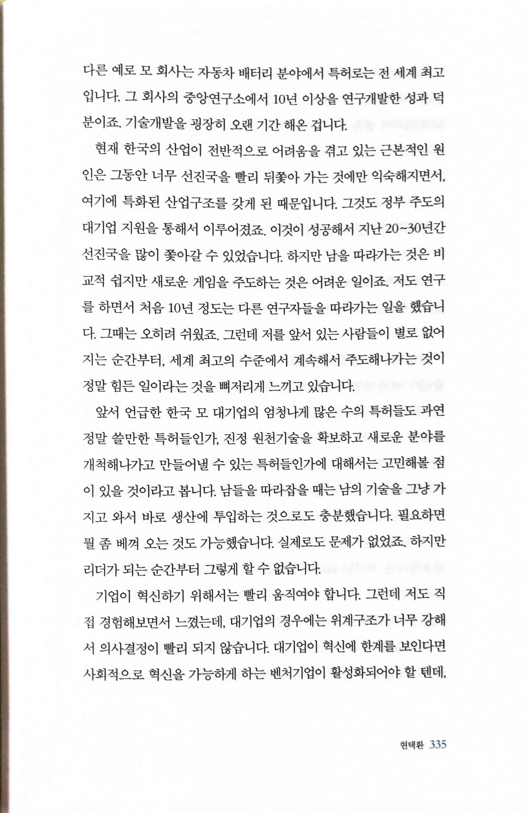

> 현재 한국의 산업이 전반적으로 어려움을 겪고 있는 근본적인 원인은 그동안 너무 선진국을 빨리 뒤쫓아가는 것에만 익숙해지면서, 여기에 특화된 산업구조를 갖게 된 때문입니다... 하지만 남을 따라가는 것은 비교적 쉽지만 새로운 게임을 주도하는 것은 어려운 일이죠.
>
> 기업이 혁신하기 위해서는 빨리 움직여야 합니다. 그런데 저도 직접 경험해보면서 느꼈는데, 대기업의 경우에는 위계구조가 너무 강해서 의사결정이 빨리 되지 않습니다.

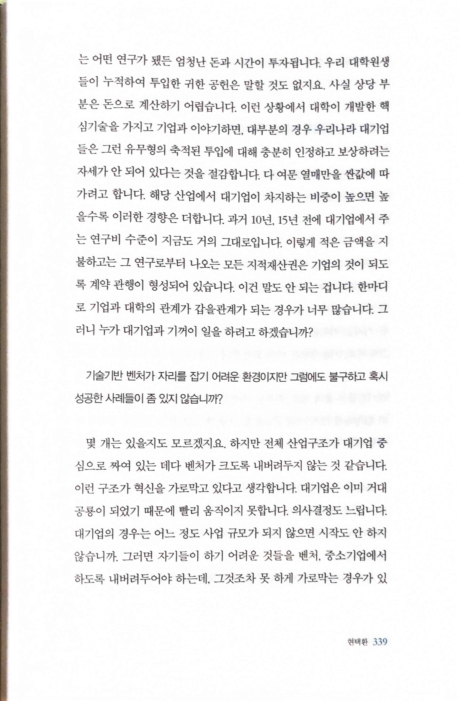

> 대부분의 경우 우리나라 대기업들은 그런 유무형의 축적된 투입에 대해 충분히 인정하고 보상하려는 자세가 안 되어 있다는 것을 절감합니다. 다 여문 열매만을 싼값에 따가려고 합니다. 해당 산업에서 대기업이 차지하는 비중이 높으면 높을수록 이러한 경향은 더합니다.
>
> 전체 산업구조가 대기업 중심으로 짜여 있는 데다 벤처가 크도록 내버려두지 않는 것 같습니다. 이런 구조가 혁신을 가로막고 있다고 생각합니다. 대기업은 이미 거대공룡이 되었기 때문에 빨리 움직이지 못합니다. 의사결정도 느립니다. 대기업의 경우는 어느 정도 사업 규모가 되지 않으면 시작도 안 하지 않습니까. 그러면 자기들이 하기 어려운 것들을 벤처, 중소기업에서 하도록 내버려두어야 하는데, 그것조차 못 하게 가로막는 경우가 있습니다.

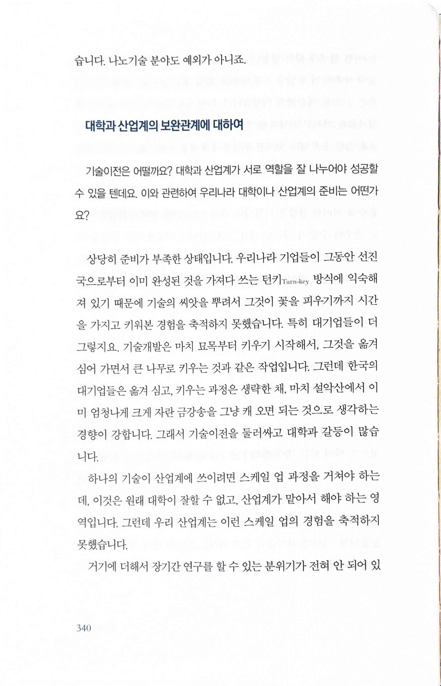

> 우리나라 기업들이 그동안 선진국으로부터 이미 완성된 것을 가져다 쓰는 턴키 Turn-key 방식에 익숙해져 있기 때문에 기술의 씨앗을 뿌려서 그것이 꽃을 피우기까지 시간을 가지고 키워본 경험을 축적하지 못했습니다. 특히 대기업들이 더 그렇지요. 기술개발은 마치 묘목부터 키우기 시작해서, 그것을 옮겨 심어 가면서 큰 나무로 키우는 것과 같은 작업입니다. 그런데 한국의 대기업들은 옮겨 심고, 키우는 과정은 생략한 채, 마치 설악산에서 이미 엄청나게 크게 자란 금강송을 그냥 캐 오면 되는 것으로 생각하는 경향이 강합니다. 그래서 기술이전을 둘러싸고 대학과 갈등이 많습니다.
>
> 하나의 기술이 산업계에 쓰이려면 스케일 업 과정을 거쳐야 하는데, 이것은 원래 대학이 잘할 수 없고, 산업계가 맡아서 해야 하는 영역입니다. 그런데 우리 산업계는 이런 스케일 업의 경험을 축적하지 못했습니다.

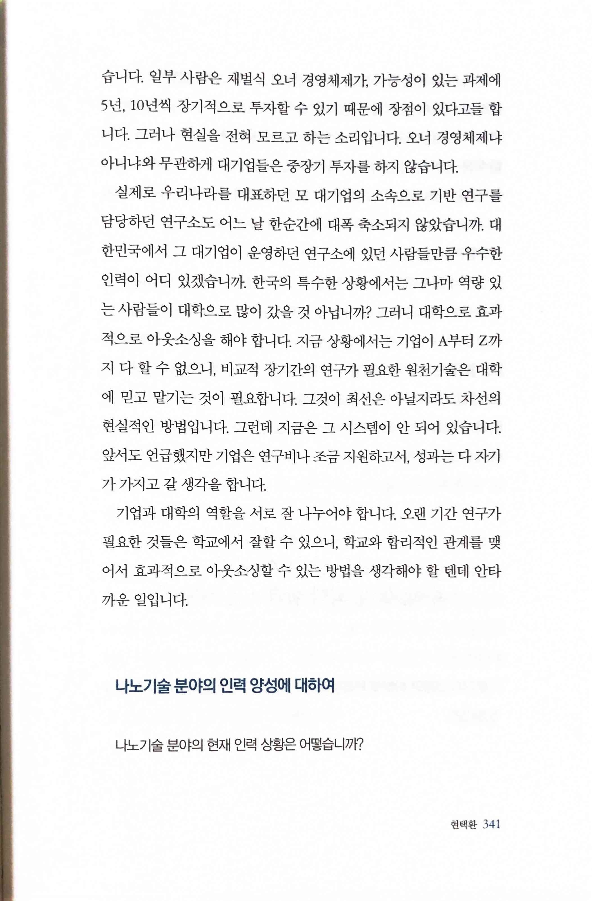

> 거기에 더해서 장기간 연구를 할 수 있는 분위기가 전혀 안 되어 있습니다. 일부 사람은 재벌식 오너 경영체제가 가능성이 있는 과제에5년, 10년씩 장기적으로 투자할 수 있기 때문에 장점이 있다고들 합니다. 그러나 현실을 전혀 모르고 하는 소리입니다. 오너 경영체제냐 아니냐와 무관하게 대기업들은 중장기 투자를 하지 않습니다.
>
> 기업은 연구비나 조금 지원하고서, 성과는 다 자기가 가지고 갈 생각을 합니다.

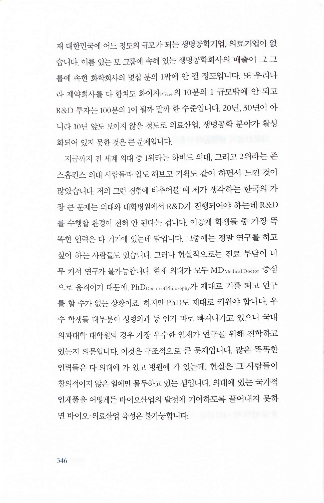

> 한국의 가장 큰 문제는 의대와 대학병원에서 R&D가 진행되어야 하는데 R&D를 수행할 환경이 전혀 안 된다... 현재 의대가 모두 MD Medical Doctor 중심으로 움직이기 때문에, PhD Doctor of Philosophy가 제대로 기를 펴고 연구를 할 수가 없는 상황

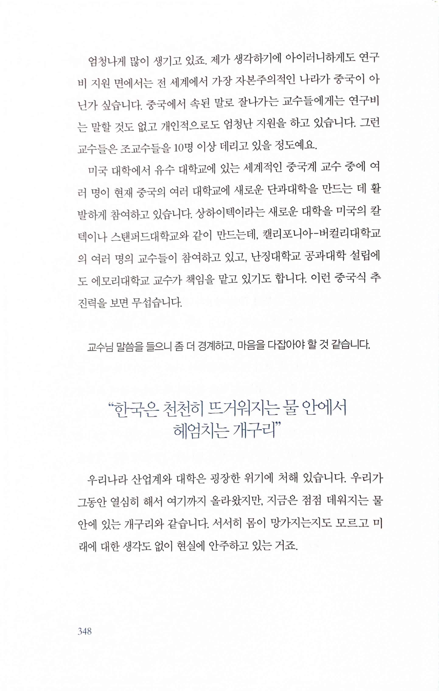

> "한국은 천천히 뜨거워지는 물 안에서 헤엄치는 개구리"

## 16. 중견기업을 히든챔피언으로 만드는 감동스토리를 써라 - 차국헌
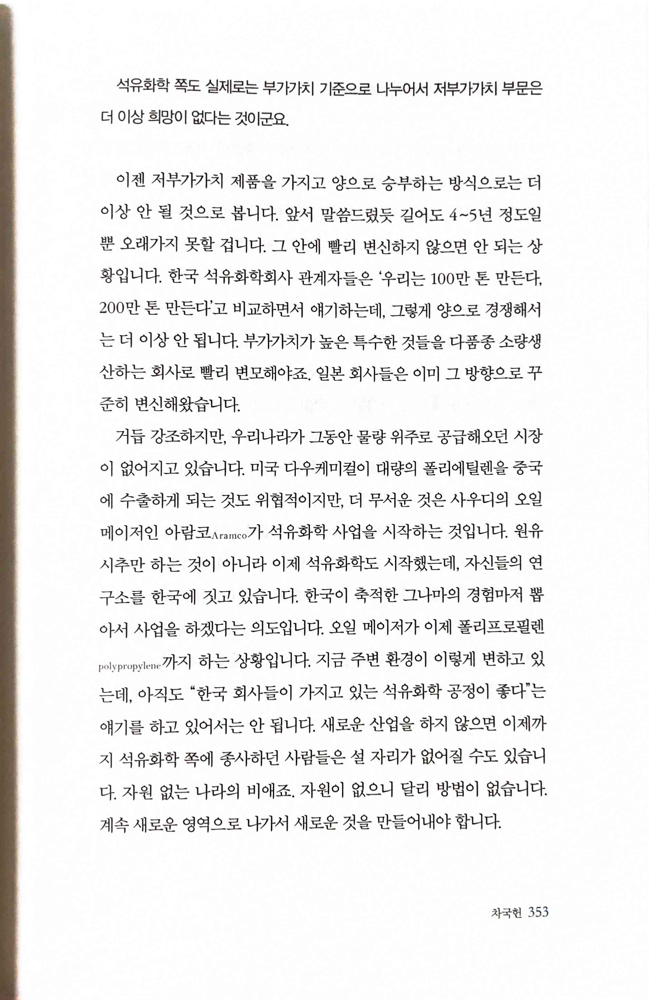

> 자원 없는 나라의 비애죠. 자원이 없으니 달리 방법이 없습니다. 계속 새로운 영역으로 나가서 새로운 것을 만들어내야 합니다.

> 생산하는 사람들은 모든 것을 양적으로 많이 만들어서 우리가 그것 때문에 돈을 벌었다는 것을 보여주고 싶어 하지만, 불행하게도 그런 방식은 이제 통하지 않는 시대가 되었습니다. 안 하던 일을 하려면 실패도 어느 정도 용인해주면서 새로운 제품을 만들어서 큰 시장을 개척할 생각을 해야 하는데 그렇게 일해본 경험이 없는 겁니다.
>
> 굉장한 지적인 투자가 필요합니다. 잠시 시도했다가 잘 안 될 것 같으면 조급하게 포기해버리고 그래서는 안 됩니다. 지속적으로 경험을 축적해나가는 자세를 가져야 합니다.
* 과거 리더들의 말을 별로 귀담아 들을 게 없는 경우, 많은 이유중 하나가 여기 있다. 없던 걸 만들어 낸 경험, 성공의 경험은 맞고 그 자체는 존경할만하나, 이미 현실은 그걸로 뭔가 할 수 없는 환경인데, 변화의 필요성 자체를 모르고 노력을 안 한다고 생각하는 경우가 대부분이다.

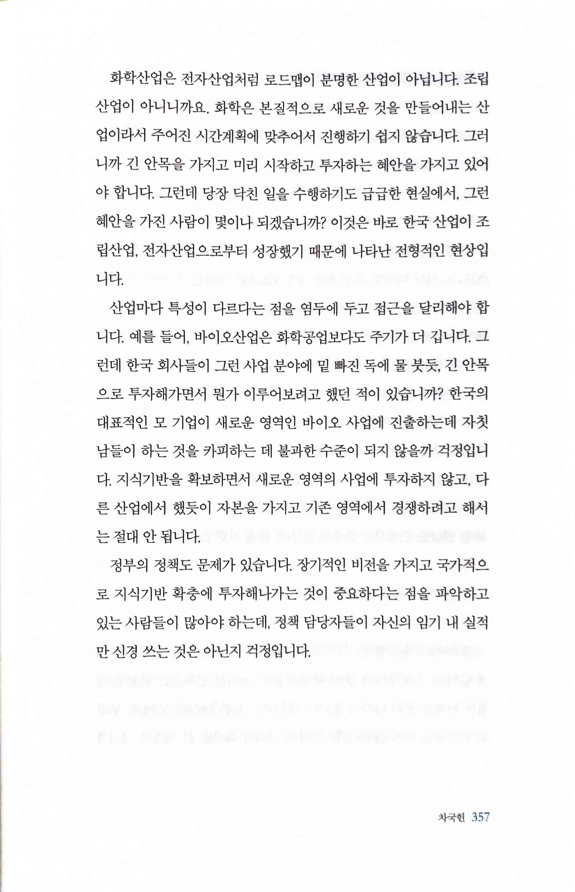

> 긴 안목을 가지고 미리 시작하고 투자하는 혜안을 가지고 있어야 합니다. 그런데 당장 닥친 일을 수행하기도 급급한 현실에서 그런 혜안을 가진 사람이 몇이나 되겠습니까? 이것은 바로 한국 산업이 조립산업, 전자산업으로부터 성장했기 때문에 나타난 전형적인 현상입니다.
>
> 정부의 정책도 문제가 있습니다. 장기적인 비전을 가지고 국가적으로 지식기반 확충에 투자해나가는 것이 중요하다는 점을 파악하고 있는 사람들이 많아야 하는데, 정책 담당자들이 자신의 임기 내 실적만 신경 쓰는 것은 아닌지 걱정입니다.

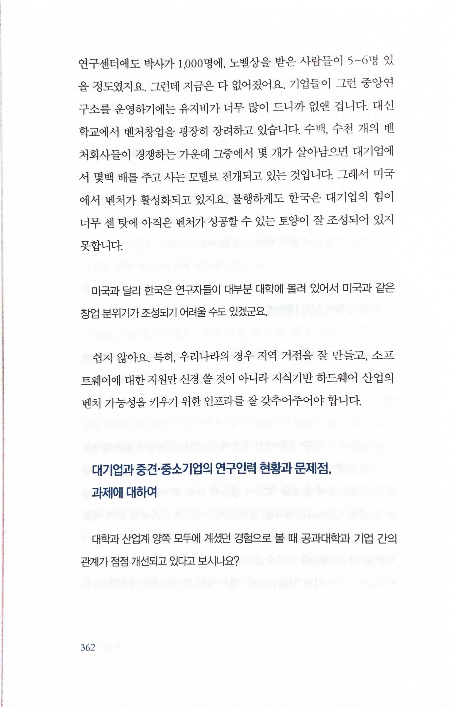

> 우리나라의 경우 지역 거점을 잘 만들고, 소프트웨어에 대한 지원만 신경 쓸 것이 아니라 지식기반 하드웨어 산업의 벤처 가능성을 키우기 위한 인프라를 잘 갖추어주어야 합니다.
* 그러나 하드웨어 스타트업의 성공 가능성은 소프트웨어보다 훨씬 낮고 더 어려움

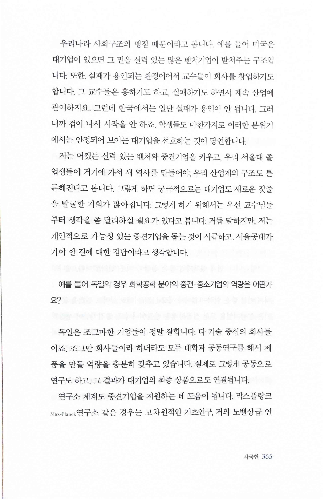

> 한국에서는 일단 실패가 용인이 안 됩니다. 그러니까 겁이 나서 시작을 안 하죠. 학생들도 마찬가지로 이러한 분위기에서는 안정되어 보이는 대기업을 선호하는 것이 당연합니다.

## 17. 선진화된 사회시스템이 히든챔피언 기업을 만든다 - 박진우
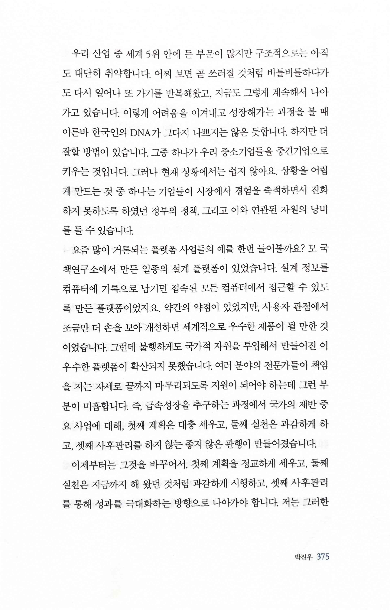

> 상황을 어렵게 만드는 것 중 하나는 기업들이 시장에서 경험을 축적하면서 진화하지 못하도록 하였던 정부의 정책, 그리고 이와 연관된 자원의 낭비를 들 수 있습니다.
>
> 급속성장을 추구하는 과정에서 국가의 제반 중요 사업에 대해, 첫째 계획은 대충 세우고, 둘째 실천은 과감하게 하고, 셋째 사후관리를 하지 않는 좋지 않은 관행이 만들어졌습니다.
>
> 이제부터는 그것을 바꾸어서 첫째 계획을 정교하게 세우고, 둘째 실천은 지금까지 해 왔던 것처럼 과감하게 시행하고, 셋째 사후관리를 통해 성과를 극대화하는 방향으로 나아가야 합니다. 저는 그러한 프로세스를 '선진화된 시스템'이라고 이야기합니다.
 
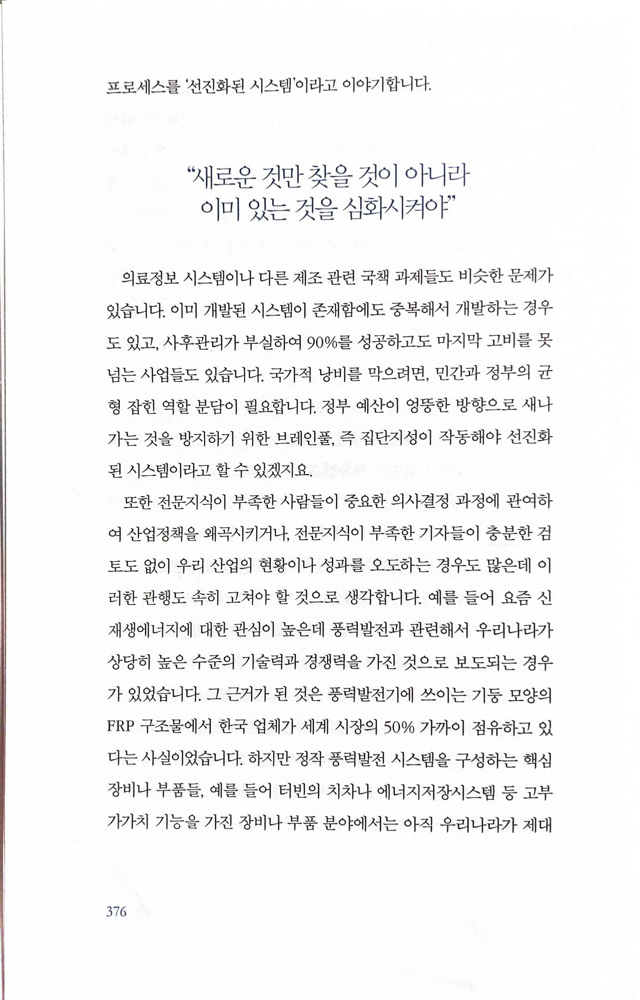

> "새로운 것만 찾을 것이 아니라 이미 있는 것을 심화시켜야"

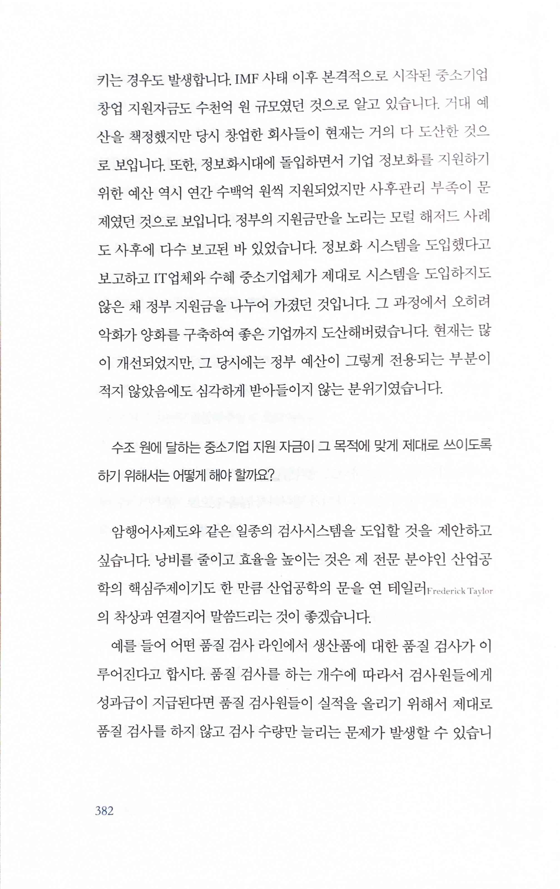 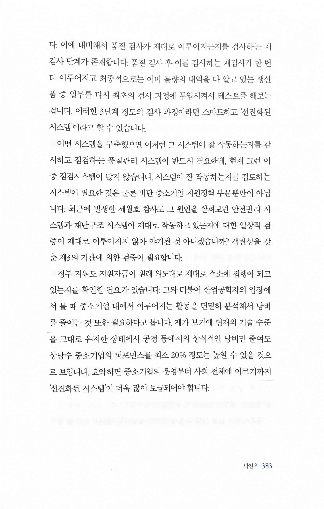

> 암행어사제도와 같은 일종의 검사시스템을 도입할 것을 제안하고 싶습니다. 낭비를 줄이고 효율을 높이는 것은 제 전문 분야인 산업공학의 핵심주제이기도 한 만큼 산업공학의 문을 연 테일러 Frederick Taylor의 착상과 연결지어 말씀드리는 것이 좋겠습니다.
>
> 제가 보기에 현재의 기술 수준을 그대로 유지한 상태에서 공정 등에서의 상식적인 낭비만 줄여도 상당수 중소기업의 퍼포먼스를 최소 20% 정도는 높일 수 있을 것으로 보입니다. 요약하면 중소기업의 운영부터 사회 전체에 이르기까지 '선진화된 시스템'이 더욱 많이 보급되어야 합니다.

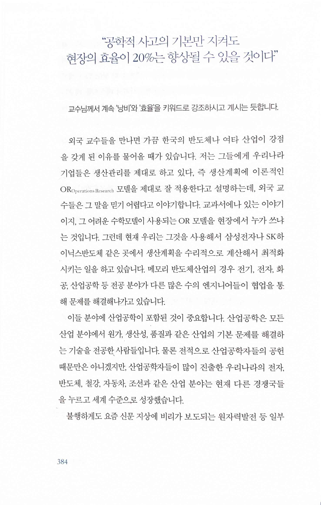

> "공학적 사고의 기본만 지켜도 현장의 효율이 20%는 향상될 수 있을 것이다"
>
> 이들 분야에 산업공학이 포함된 것이 중요합니다. 산업공학은 모든 산업 분야에서 원가, 생산성, 품질과 같은 산업의 기본 문제를 해결하는 기술을 전공한 사람들입니다.
* 하지만 산업공학이 모든 분야에 대해 해결책도 아니고, 또 장기적인 계획을 세워서 보는 데는 운용하는 사람의 문제일 수도 있겠지만, 현실에서는 제조 분야가 아니면 잘 될 수가 없는데 과연 그런 건 알고 있을까?

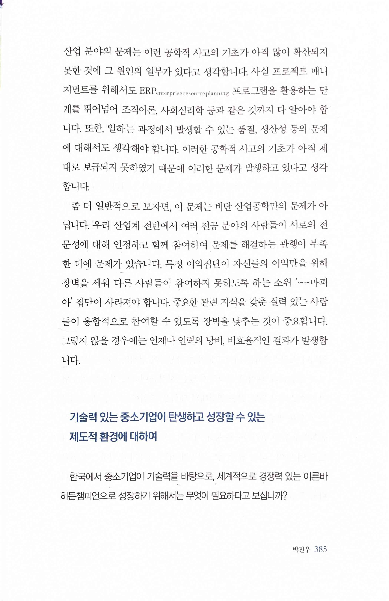

> 불행하게도 요즘 신문지상에 비리가 보도되는 원자력발전 등 일부 산업 분야의 문제는 이런 공학적 사고의 기초가 아직 많이 확산되지 못한 것에 그 원인의 일부가 있다고 생각합니다. 사실 프로젝트 매니지먼트를 위해서도 ERP enterprise resource planning 프로그램을 활용하는 단계를 뛰어넘어 조직이론, 사회심리학 등과 같은 것까지 다 알아야 합니다. 또한, 일하는 과정에서 발생할 수 있는 품질, 생산성 등의 문제에 대해서도 생각해야 합니다. 이러한 공학적 사고의 기초가 아직 제대로 보급되지 못하였기 때문에 이러한 문제가 발생하고 있다고 생각합니다.
* 공학적 사고가 있다고 해서 과연 비리가 없어질 수 있을까? 이 부분은 크게 동감이 되진 않음

## 18. 동북아 섬유클러스터로 통일을 대비하라 - 강태진
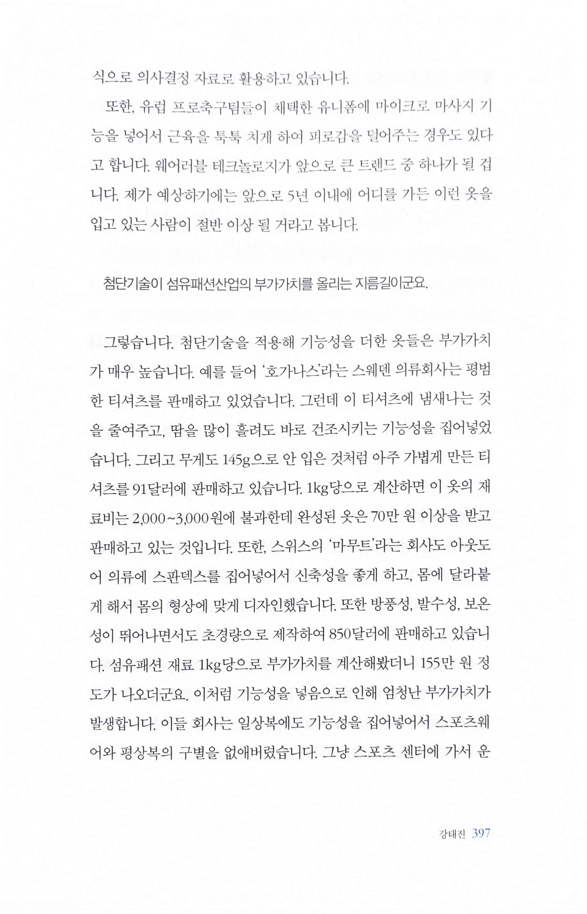

> 제가 예상하기에는 앞으로 5년 이내에 어디를 가든 이런 옷을 입고 있는 사람이 절반 이상 될 거라고 봅니다.
* 이 책의 시점에서 거의 8년이 지났는데, 히트텍같은 걸 제외하면 웨어러블 의류가 아직은 멀지 않은가? (첨단 기술을 적용한 의류는 웨어러블하고 별도로 보고)

## 19. 뿌리산업에 첨단의 날개를 달아라 - 권동일
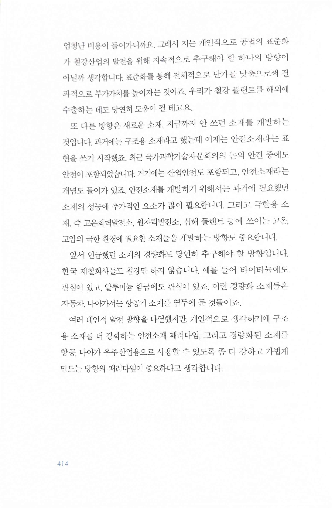

> 그래서 저는 개인적으로 공법의 표준화가 철강산업의 발전을 위해 지속적으로 추구해야 할 하나의 방향이 아닐까 생각합니다. 표준화를 통해 전체적으로 단가를 낮춤으로써 결과적으로 부가가치를 높이자는 것이죠.
* 철강산업뿐만 아니라 모든 산업에 적용할 수 있는 말이지 않을까?

## 20. 벤처와 중소기업을 지원하는 에코시스템이 없다 - 박희재
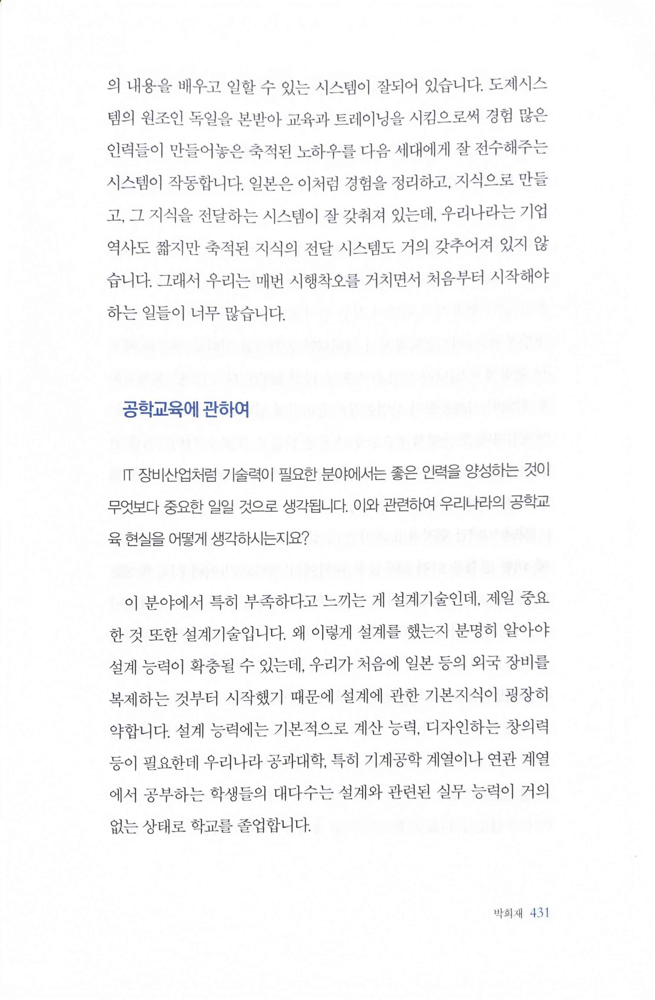

> 우리나라는 기업역사도 짧지만 축적된 지식의 전달 시스템도 거의 갖추어져 있지 않습니다. 그래서 우리는 매번 시행착오를 거치면서 처음부터 시작해야 하는 일들이 너무 많습니다.
>
> 특히 부족하다고 느끼는 게 설계기술인데, 제일 중요한 것 또한 설계기술입니다. 왜 이렇게 설계를 했는지 분명히 알아야 설계 능력이 확충될 수 있는데, 우리가 처음에 일본 등의 외국 장비를 복제하는 것부터 시작했기 때문에 설계에 관한 기본지식이 굉장히 약합니다. 설계 능력에는 기본적으로 계산 능력, 디자인하는 창의력 등이 필요한데 우리나라 공과대학, 특히 기계공학 계열이나 연관 계열에서 공부하는 학생들의 대다수는 설계와 관련된 실무 능력이 거의 없는 상태로 학교를 졸업합니다.

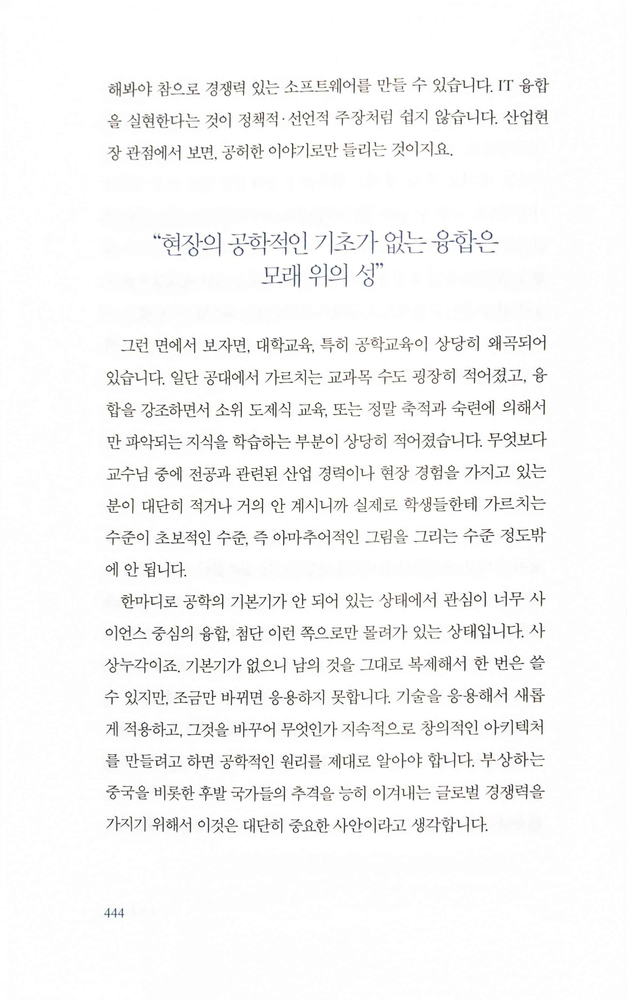

> “현장의 공학적인 기초가 없는 융합은 모래 위의 성"
>
> 한마디로 공학의 기본기가 안 되어 있는 상태에서 관심이 너무 사이언스 중심의 융합 첨단 이런 쪽으로만 몰려가 있는 상태입니다. 사상누각이죠. 기본기가 없으니 남의 것을 그대로 복제해서 한 번은 쓸 수 있지만, 조금만 바뀌면 응용하지 못합니다. 기술을 응용해서 새롭게 적용하고, 그것을 바꾸어 무엇인가 지속적으로 창의적인 아키텍처를 만들려고 하면 공학적인 원리를 제대로 알아야 합니다. 부상하는 중국을 비롯한 후발 국가들의 추격을 능히 이겨내는 글로벌 경쟁력을 가지기 위해서 이것은 대단히 중요한 사안이라고 생각합니다.

## 21. 중국의 인재를 뽑고, 한국의 인재와 섞어 경쟁시켜라 - 설승기
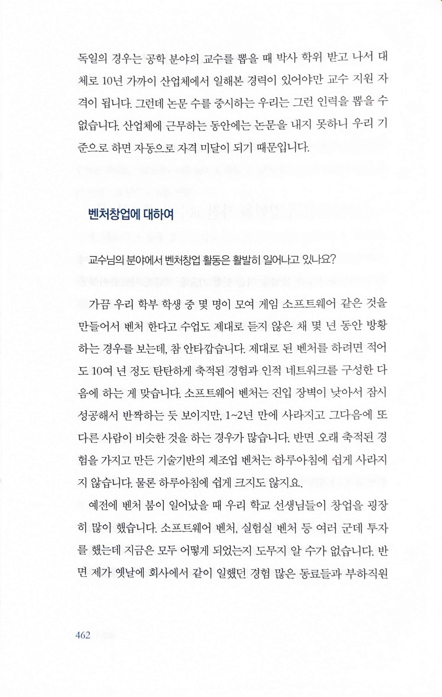

> 제대로 된 벤처를 하려면 적어도 10여 년 정도 탄탄하게 축적된 경험과 인적 네트워크를 구성한 다음에 하는 게 맞습니다. 소프트웨어 벤처는 진입 장벽이 낮아서 잠시 성공해서 반짝하는 듯 보이지만, 1~2년 만에 사라지고 그다음에 또 다른 사람이 비슷한 것을 하는 경우가 많습니다. 반면 오래 축적된 경험을 가지고 만든 기술기반의 제조업 벤처는 하루아침에 쉽게 사라지지 않습니다. 물론 하루아침에 쉽게 크지도 않지요.
* 어느 정도는 동감이지만 중국의 선전같은 지역이 있으면 모를까, 제조업 스타트업은 정말 어렵고 쉽지 않음. 

> “기술기반의 묵직한 벤처를 만들어야 오래간다"

## 22. 공대는 산업현장의 문제를 해결하는 것으로 평가받아야 - 강신형
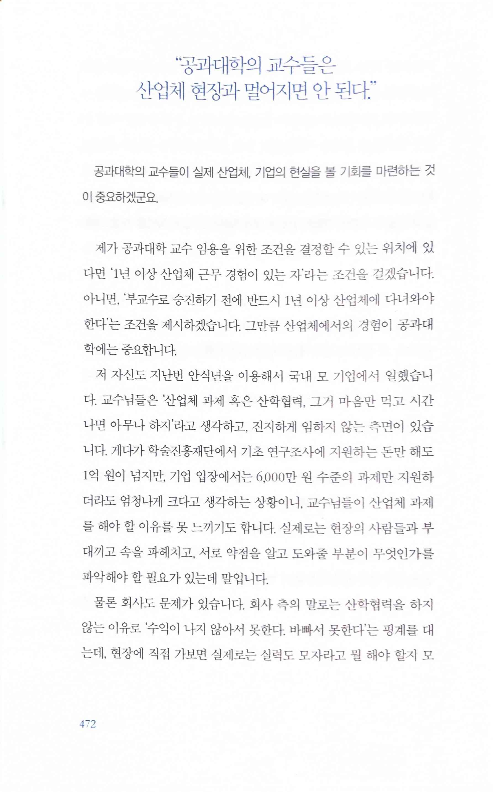

> "공과대학의 교수들은 산업체 현장과 멀어지면 안 된다."
 
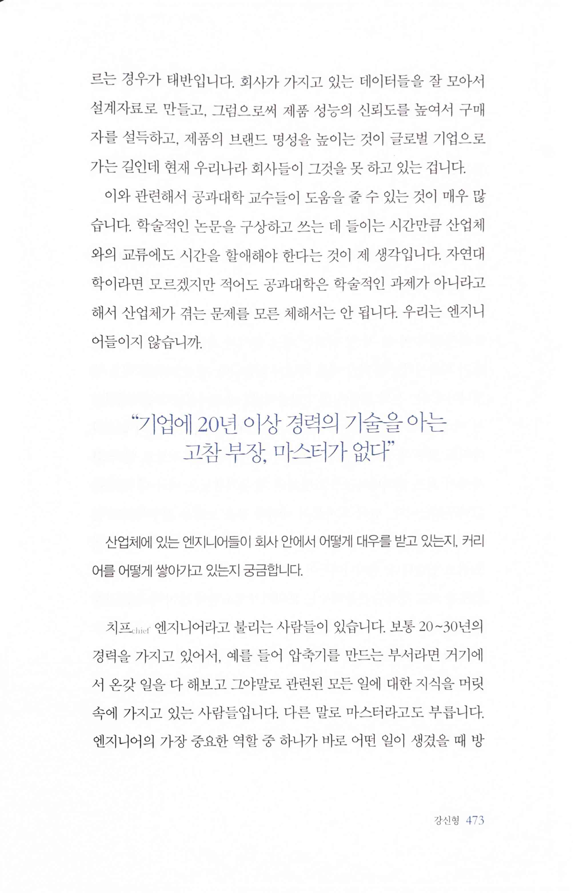

> 자연대학이라면 모르겠지만 적어도 공과대학은 학술적인 과제가 아니라고 해서 산업체가 겪는 문제를 모른 체해서는 안 됩니다. 우리는 엔지니어들이지 않습니까.

## 23. 실패에 대한 두려움이 전략을 왜곡시킨다 - 김승조
 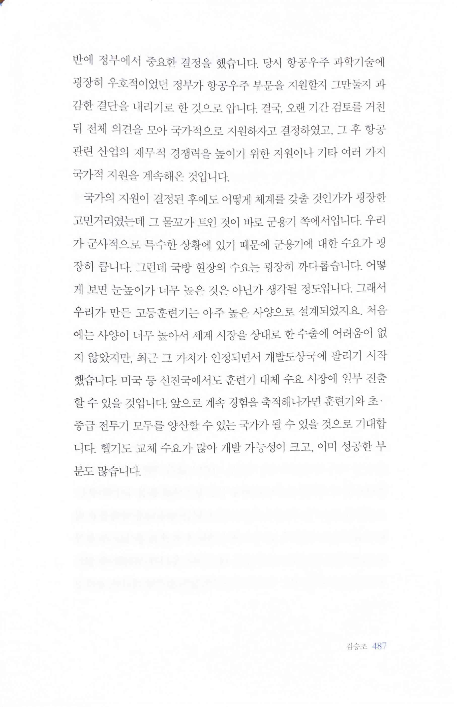

> 결국 체계를 만드는 사업을 해야 하는데, 체계를 하자고 제안하면 경제관료들은 우선 경제성이 있는지부터 묻습니다. 검토해서 일정 수준 이상의 경제성이 없는 것으로 판단되면 예산 배분을 안 해주죠. 항공우주산업이 가지는 국가적 중요성과 달리, 경제성을 증명하기 어렵기 때문에 체계 중심의 사업을 추진하는 데 어려움이 많습니다.
>
> 그럼에도 국가 사업이니까 그 명맥을 유지해오다가, 2000년대 초중반에 정부에서 중요한 결정을 했습니다. 당시 항공우주 과학기술에 굉장히 우호적이었던 정부가 항공우주 부문을 지원할지 그만둘지 과감한 결단을 내리기로 한 것으로 압니다. 결국, 오랜 기간 검토를 거친 뒤 전체 의견을 모아 국가적으로 지원하자고 결정하였고, 그 후 항공관련 산업의 재무적 경쟁력을 높이기 위한 지원이나 기타 여러 가지 국가적 지원을 계속해온 것입니다.
* 앞을 내다보는 리더의 역할과 그 결과

## 24. 수직계열 체제를 깨야 기계산업이 산다 - 주종남
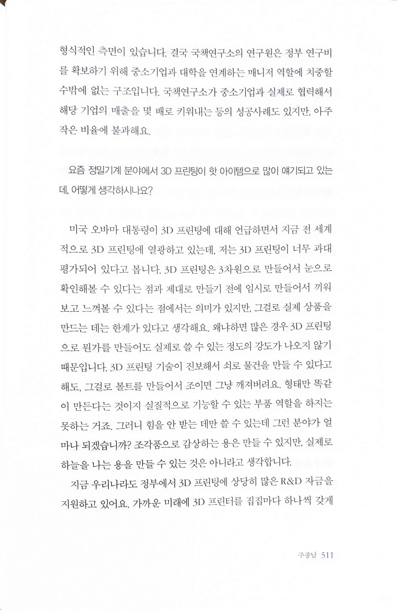 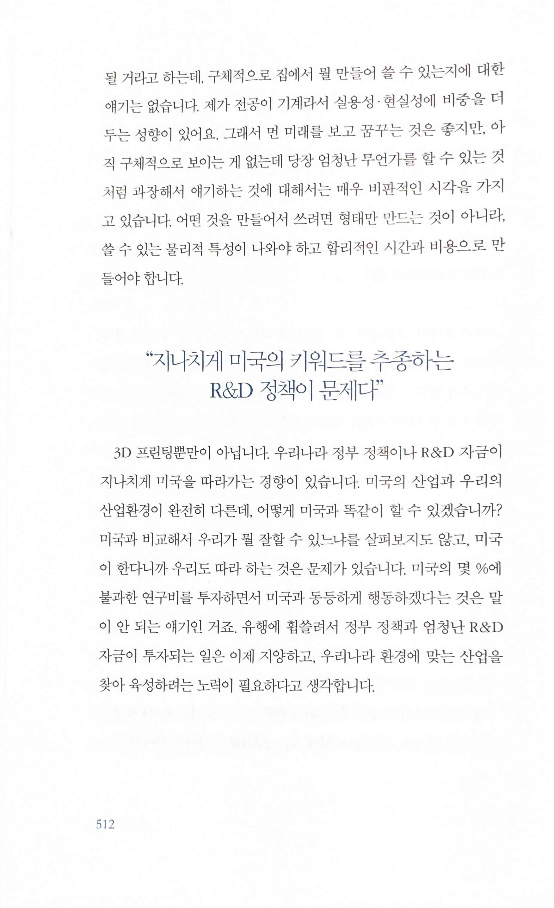

> 먼 미래를 보고 꿈꾸는 것은 좋지만, 아직 구체적으로 보이는 게 없는데 당장 엄청난 무언가를 할 수 있는 것처럼 과장해서 얘기하는 것에 대해서는 매우 비판적인 시각을 가지고 있습니다. 어떤 것을 만들어서 쓰려면 형태만 만드는 것이 아니라, 쓸 수 있는 물리적 특성이 나와야 하고 합리적인 시간과 비용으로 만들어야 합니다.
>
> "지나치게 미국의 키워드를 추종하는 R&D 정책이 문제다"

## 25. 기술을 아는 사람이 중심에 있어야 일류기업이 된다 - 주한규

## 26. 기술로 승부하는 기업은 경험 축적 없이 저절로 생기지 않는다 - 김민수
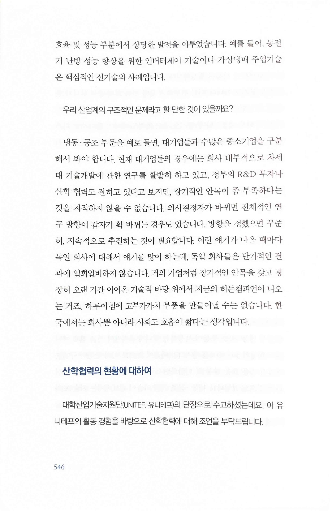

> 장기적인 안목이 좀 부족하다는 것을 지적하지 않을 수 없습니다. 의사결정자가 바뀌면 전체적인 연구 방향이 갑자기 확 바뀌는 경우도 있습니다. 방향을 정했으면 꾸준히, 지속적으로 추진하는 것이 필요합니다... 거의 가업처럼 장기적인 안목을 갖고 굉장히 오랜 기간 이어온 기술적 바탕 위에서 지금의 히든챔피언이 나오는 거죠. 하루아침에 고부가가치 부품을 만들어낼 수는 없습니다. 한국에서는 회사뿐 아니라 사회도 호흡이 짧다는 생각입니다.