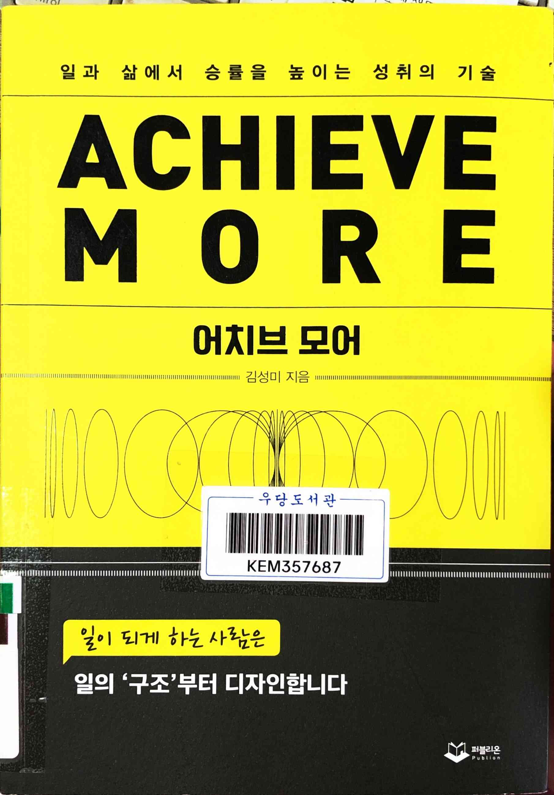
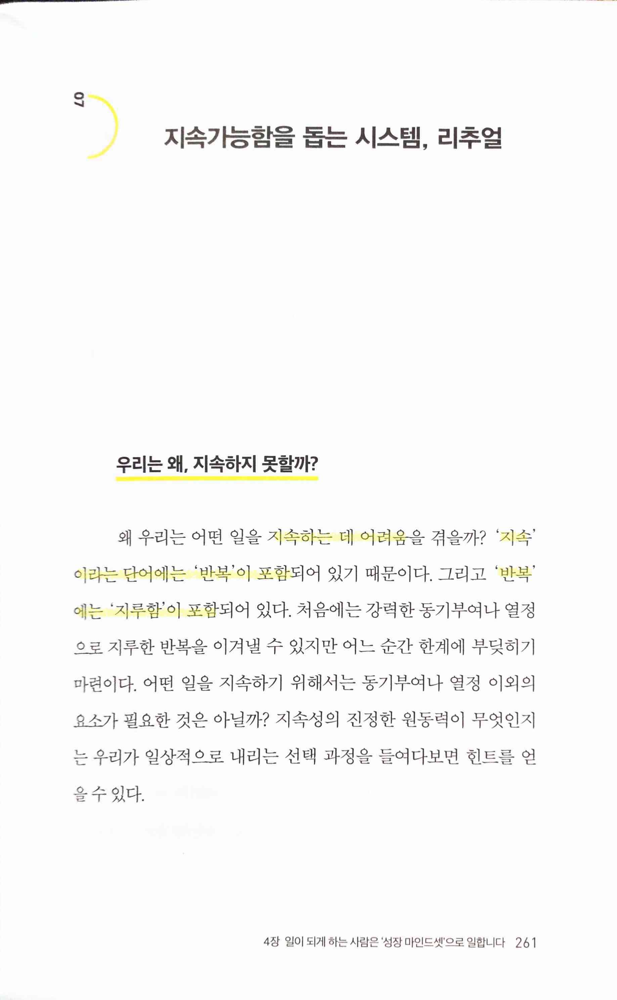
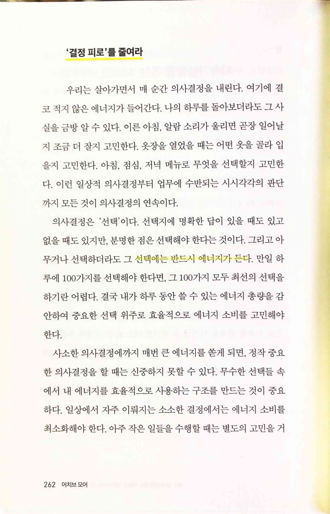
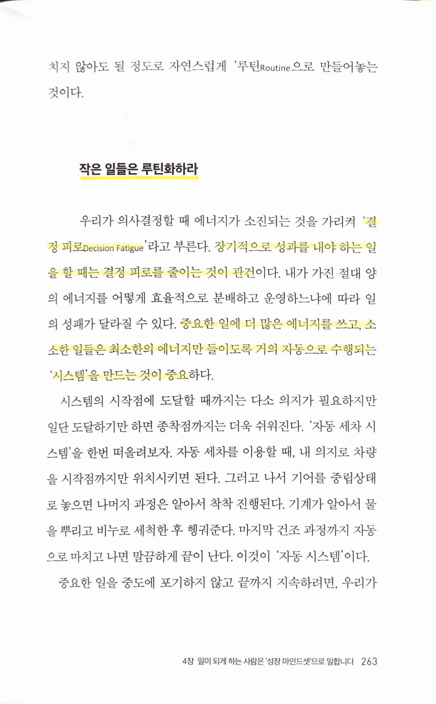
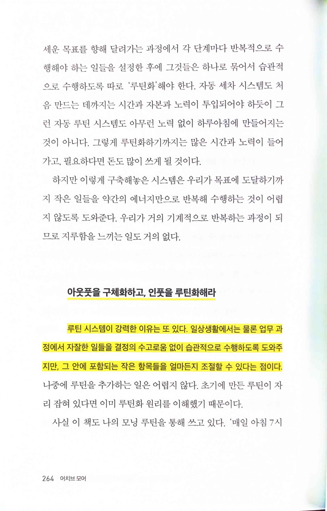
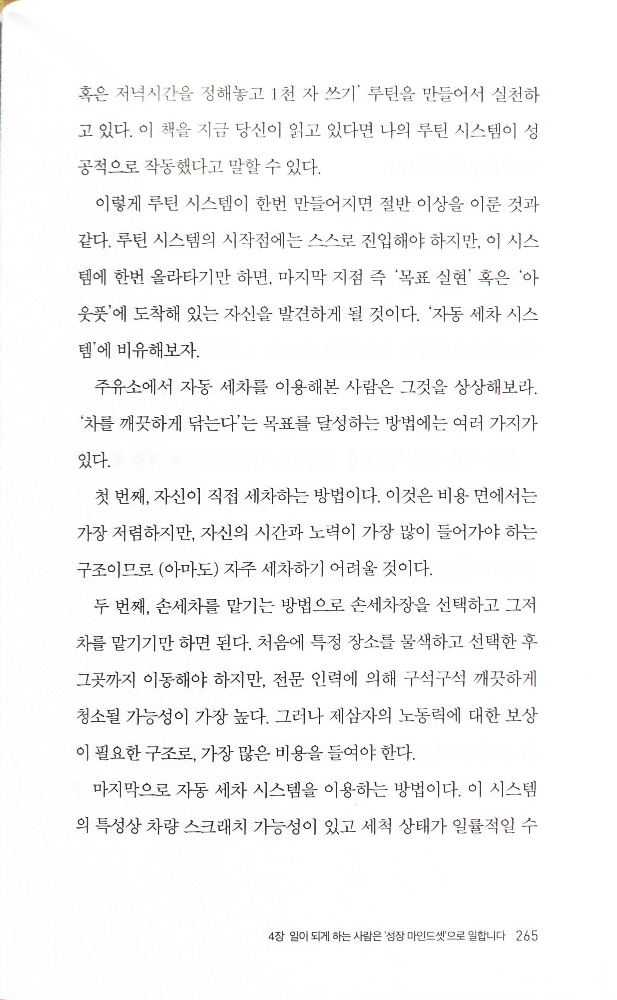
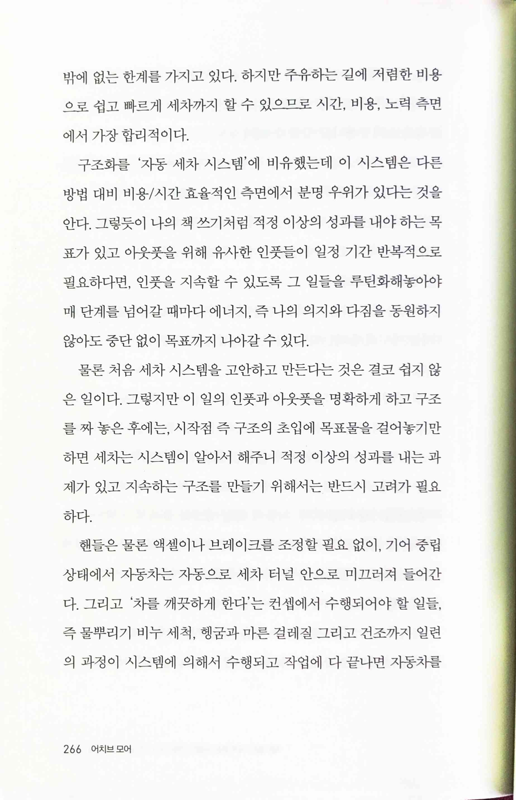
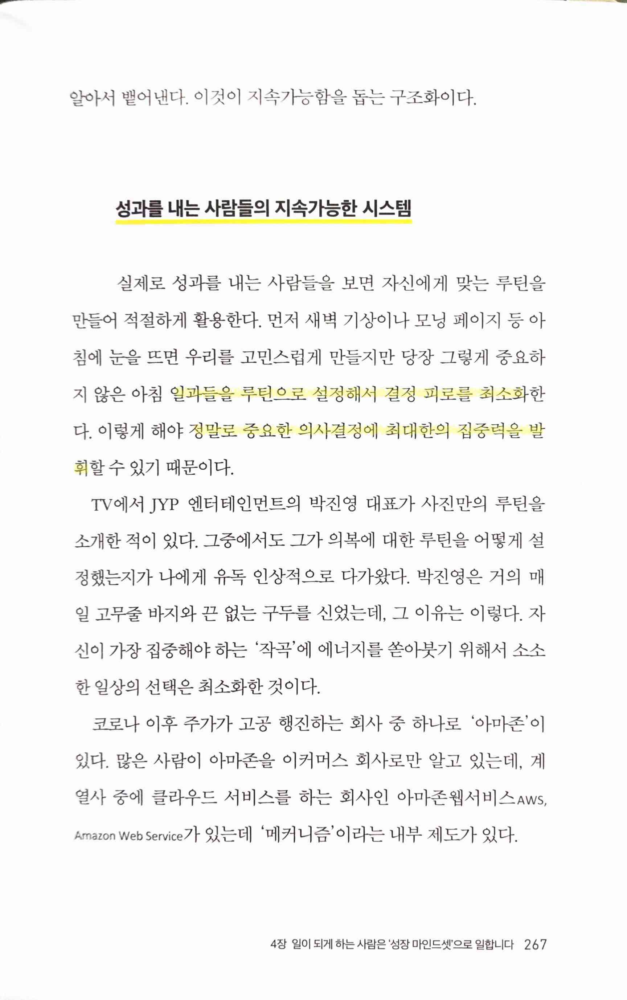
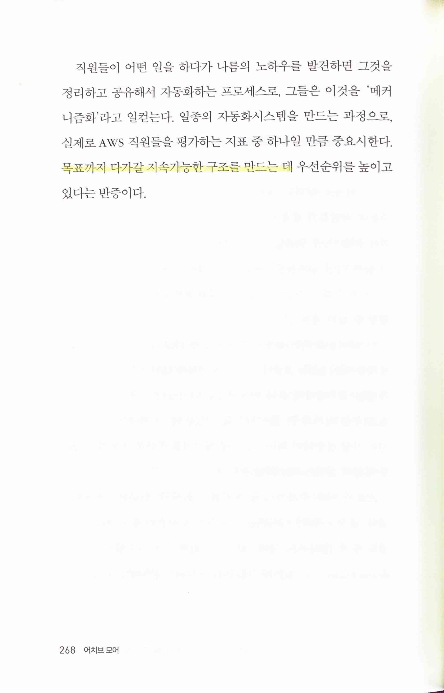
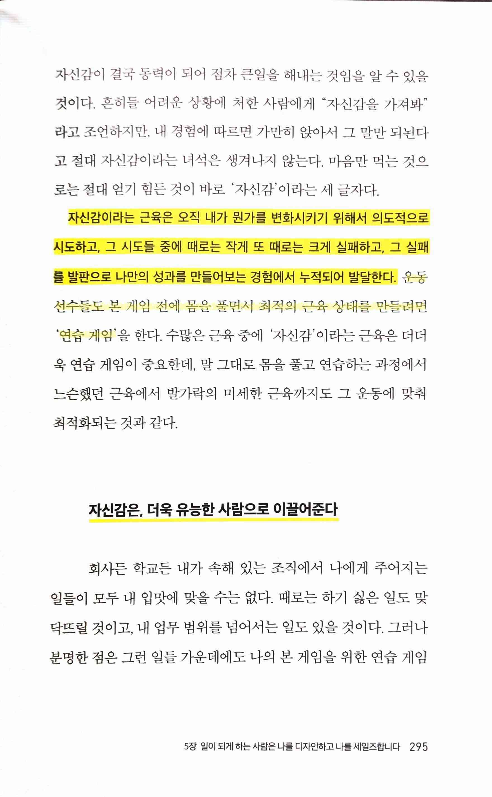

일과 삶에서 승률을 높이는 성취의 기술 ACHIEVE MORE
==================================================

* ★★★★☆ 2023.04.13~14
* 보기에 따라서는, 대단한 사람이 쓴 책도 많은데 평범한 MS에 다니는 사람이 쓴 책까지 읽냐고 할 수도 있겠으나, 일을 잘 하는 데 필요한 여러가지 좋은 이야기를 자신의 삶을 바탕으로 매우 읽기 쉽게 전개한다는 점에서 매우 좋은 책이라고 생각한다. 똑같은 이야기도 얼마나 전달이 되느냐에 따라 효과가 달라질텐데, 나에게 맞아서 그런지는 모르겠으나, 읽는데 거의 걸림돌이 없어서 저자의 생각을 매우 쉽게 받아들이고 해석할 수 있었다.

> `지속`이라는 단어에는 `반복`이 포함... `반복`에는 `지루함`이 포함

> `결정 피로 Decision Fatigue`를 줄여라
* `루틴 Routine`의 중요성과 연결되는 부분
> 선택에는 반드시 에너지가 든다

> 장기적으로 성과를 내야 하는 일을 할 때는 결정 피로를 줄이는 것이 관건... 중요한 일에 더 많은 에너지를 쓰고, 소소한 일들은 최소한의 에너지만 들이도록 거의 자동으로 수행되는 '시스템'을 만드는 것이 중요

  

* 루틴 시스템, 구조화를 '자동 세차 시스템'에 비유

> 중요하지 않은 아침 일과들을 루틴으로 설정해서 결정 피로를 최소화한다. 이렇게 해야 정말로 중요한 의사결정에 최대한의 집중력을 발휘할 수 있기 때문이다.
>
> 아마존웹서비스 Aws,Amazon Web Service '메커니즘'이라는 내부 제도

> 목표까지 다가갈 지속가능한 구조를 만드는 데 우선순위를 높이고 있다는 반증

> 운동선수들도 본 게임 전에 몸을 풀면서 최적의 근육 상태를 만들려면 '연습 게임'을 한다.