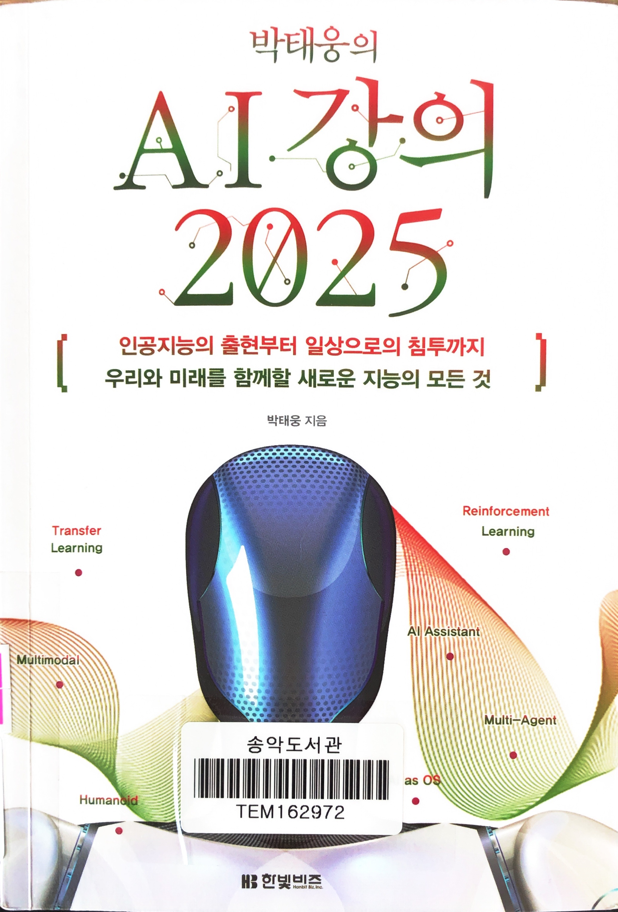
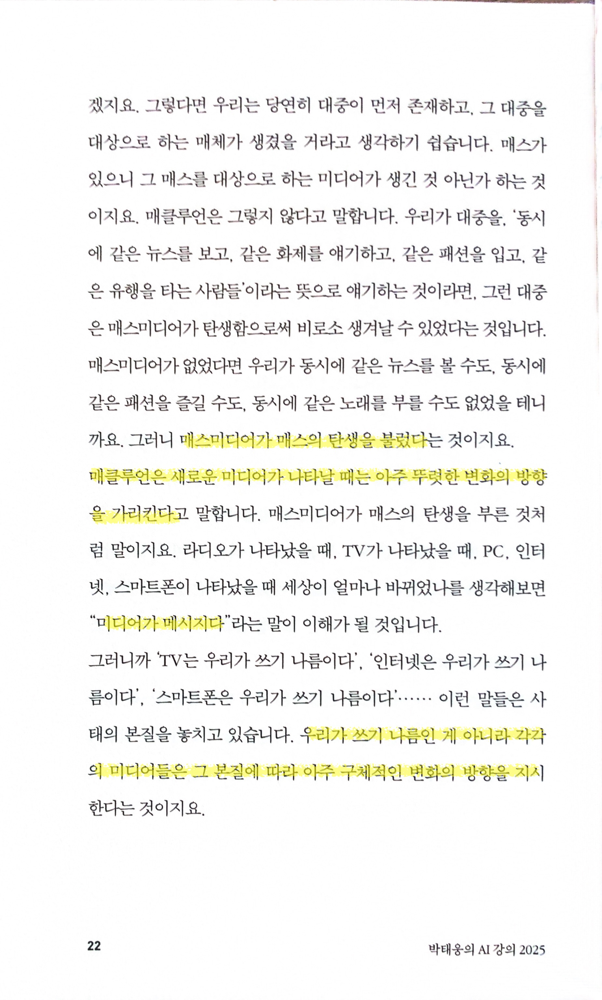
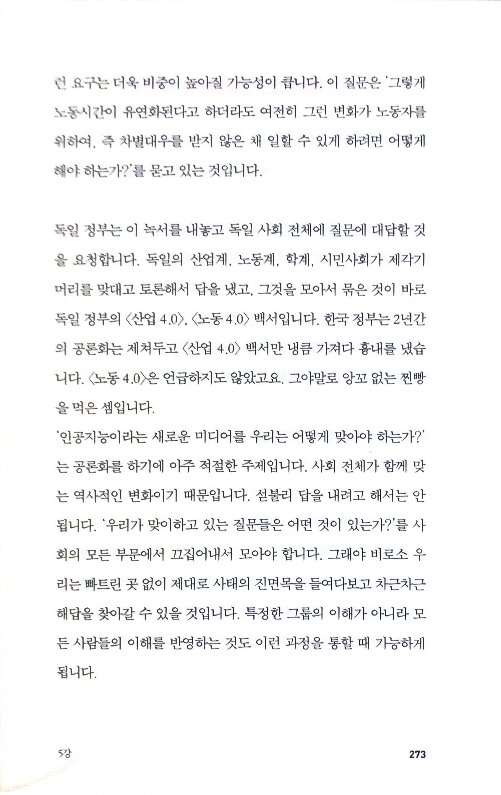
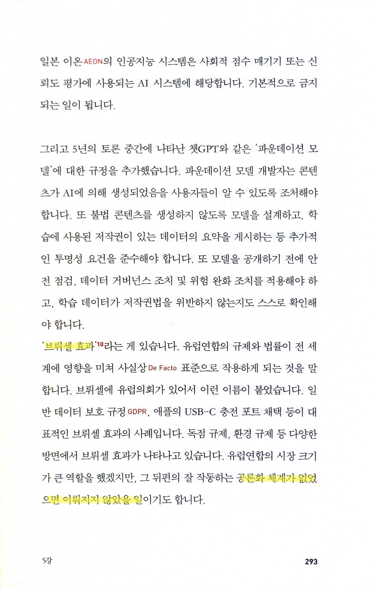

# 박태웅의 AI 강의 2025

Tags: artificial-intelligence
Date: March 8, 2025 → March 9, 2025
Score: ★★★☆☆

- ★★★☆☆ March 8, 2025 → March 9, 2025 시기가 적절하기도 하지만, 내용도 좋으니 1년만에 개정판이 나온 책. AI에 대해 전반적으로 알고 싶은 사람들을 위해 입문서격으로 매우 좋기도 하지만, 다른 AI 책에서는 정말 보기 힘든, 정책적인 제언이나 사회 전반을 생각하는 저자의 마음씀, 걱정이 느껴지는 면도 좋다. 나이가 들어서인지 모르겠으나, (나 같은 평범한 사람이 걱정한다고 바뀔 건 없겠지만) AI의 발전은 기대보다는 걱정이 더 크다.

    《박태웅의 AI 강의》가 1년 만에 개정판으로 출간된 것은 AI 기술의 급속한 진화 속도와 시기적 적절성을 동시에 반영한 결과라 할 수 있다. 이 책은 단순한 기술 설명서를 넘어 AI의 사회적 영향과 윤리적 문제를 꼬집으면서도, 초보자에게도 친절한 접근성을 갖춘 입문서로 자리 잡고 있다. 특히 다른 AI 책에서는 보기 힘든 정책적 제언과 사회적 고민이 돋보인다.

    저자는 AI의 기술적 트렌드(예: AI as OS, 멀티모달, 휴머노이드)를 체계적으로 설명하는 동시에, 이로 인해 발생할 수 있는 위험과 대응 방안을 제시한다. 예를 들어, 거대 언어 모델(LLM)의 근본적 한계인 "할루시네이션" 문제나, AI 개발 과정의 데이터 편향, (투입하는 자원의 거대화에 따른 자연스러운) 독점화 위험 등을 지적하며, "AI는 선택이 아닌 필수"라는 인식을 강조한다. 이는 단순한 기술 혁신을 넘어 사회적 책임과 윤리적 토론이 필수적임을 일깨워준다.

    특히 주목할 만한 점은 정부와 정책의 실패 사례에 대한 직설적 비판이다. 한국 정부의 녹서에 대한 평가는(p273), 기술 혁신의 글로벌 경쟁에서 뒤처질 수 있는 위험을 경고하며, 공론화와 민주적 논의의 중요성을 강조한다. 또한 독일의 녹서·백서 프로세스(p273), 유럽의 AI법을 사례로 들며, "브뤼셀 효과"와 같은 국제적 규제 동향을 통해 정책의 방향성을 제시한다(p293).

    저자는 "AI는 스며드는 기술"이라며, 기술의 급속한 확산 속에서도 윤리적·사회적 관점에서의 통제가 필요함을 역설한다. 개인적으로는 나이가 들어서인지 AI의 발전으로 기대보다는 걱정이 더 크다.

    책의 두께가 일부 독자들에게는 과도한 느낌을 줄 수도 있고, 정책 제언의 구체성은 다소 부족할 수 있다. 그럼에도 이 책은 AI의 기술적 진보와 그에 따른 사회적 책임을 동시에 들여다보는 "AI 리터러시" 함양의 필수 도서로 평가받을 만하다. 초보자는 기술 용어를 쉽게 이해할 수 있고, 전문가나 정책 입안자는 윤리적 논쟁과 글로벌 트렌드를 통찰할 수 있는 균형 잡힌 안내서라 할 수 있다.

- p22 `매스미디어가 매스의 탄생을 불렀다`
    
    
    
    - 규모는 엄청나게 다를지언정 function follows form과도 맥락이 일치하는 부분
- p273 우리 정부가 잘하는 일도 많지만, 이런 쪽은 제대로 하는 경우가 드물다. 원인은 복합적일 것이고 (특히 [나라를 위해서 일한다는 거짓말](https://github.com/hyunjun/bookmarks/blob/master/the_lie_of_working_for_your_country.md) 의 이야기를 생각해보면) 정부의 탓만은 아니겠지만, 여전히 정부가 가지고 있는 힘이 있는데, 수준 낮은 고위 공직자나 선출직들로 인해 이상하게 동작하는 경우가 많단 생각이 든다.
    
    
    
- p293 `브뤼셀 효과` , `공론화 체계가 없었으면 이뤄지지 않았을 일`
    
    
