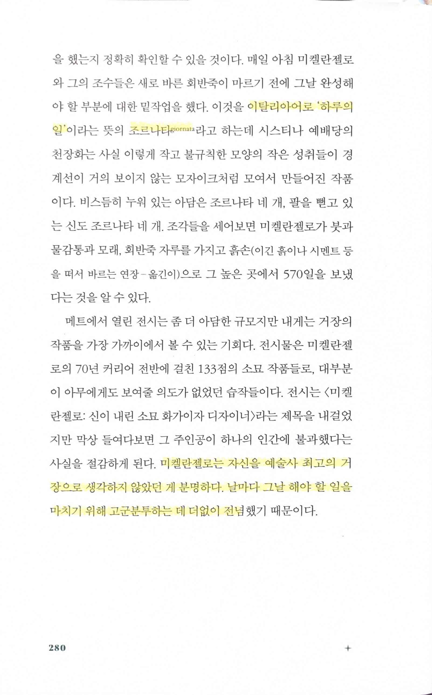
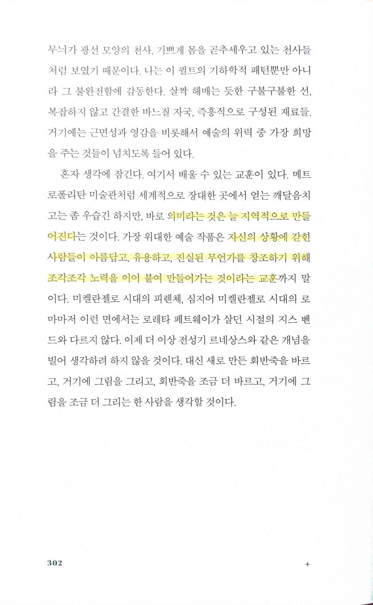

# 나는 메트로폴리탄 미술관의 경비원입니다

Tags: essay
Date: May 23, 2024
Score: ★★★☆☆

- ★★★☆☆ May 23, 2024
    - [https://www.patrickbringley.com/art](https://www.patrickbringley.com/art)

- p280
    - 조르나타 giornata: 이탈리아어로 ‘하루의 일’
        - [https://en.wikipedia.org/wiki/Giornata](https://en.wikipedia.org/wiki/Giornata)
    - 미켈란젤로는 자신을 예술사 최고의 거장으로 생각하지 않았던 게 분명하다. 날마다 그날 해야 할 일을 마치기 위해 고군분투하는 데 더없이 전념

- 의미라는 것은 늘 지역적으로 만들어진다… 자신의 상황에 갇힌 사람들이 아름답고, 유용하고, 진실된 무언가를 창조하기 위해 조각조각 노력을 이어 붙여 만들어가는 것이라는 교훈
