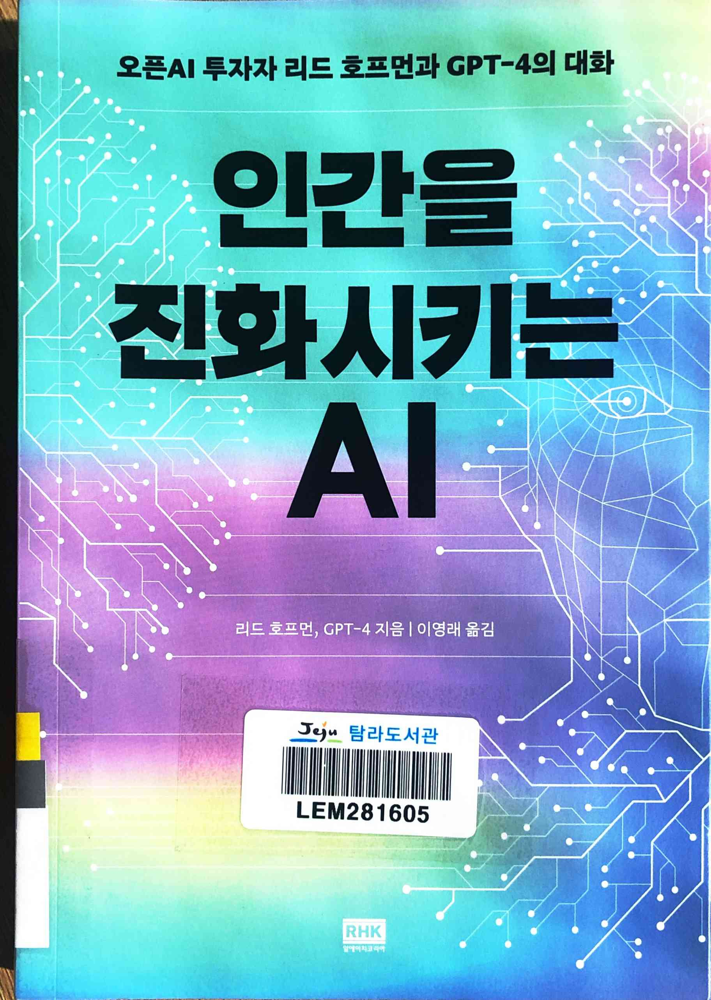
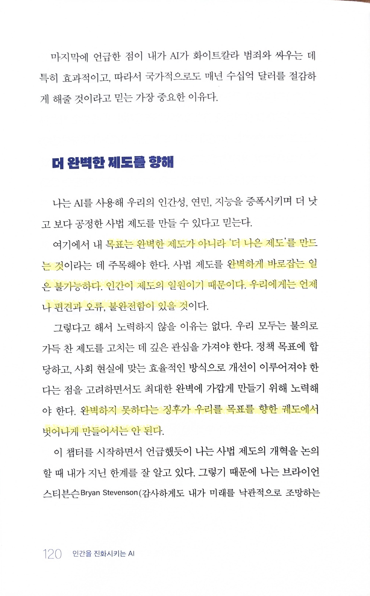
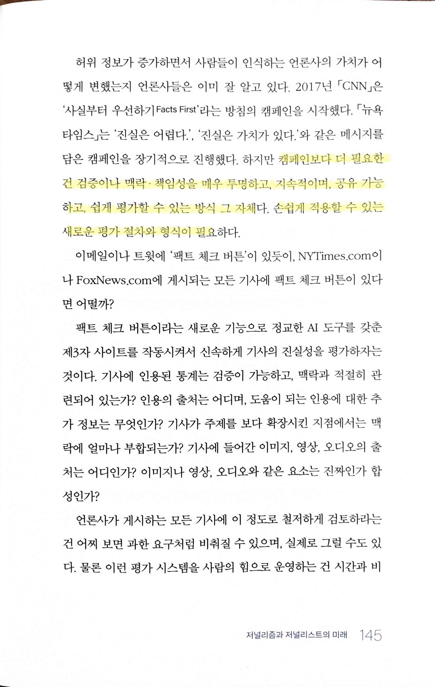
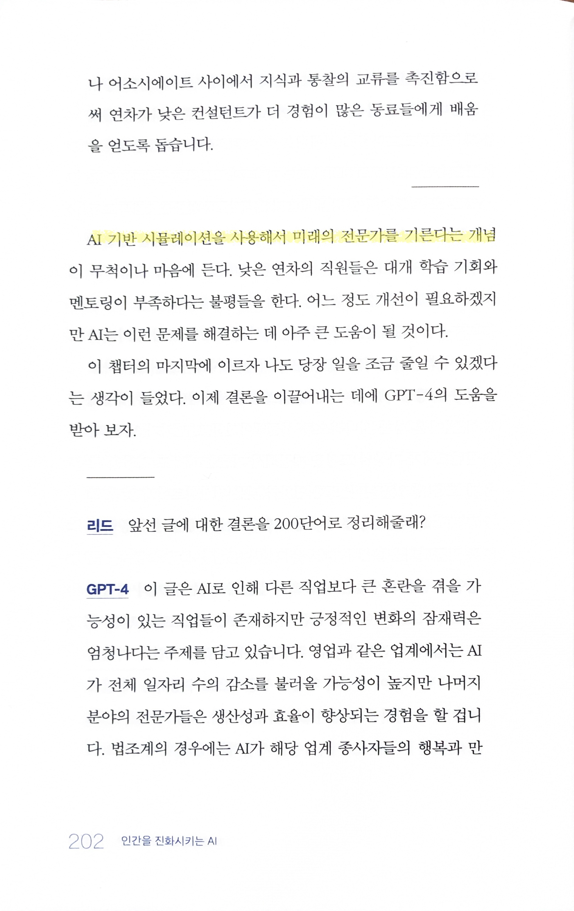
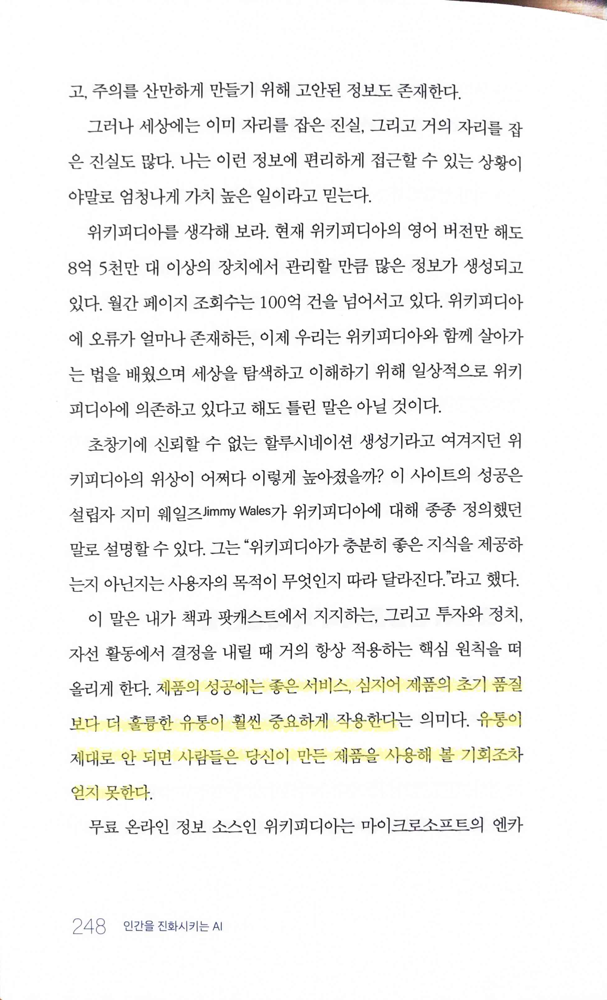
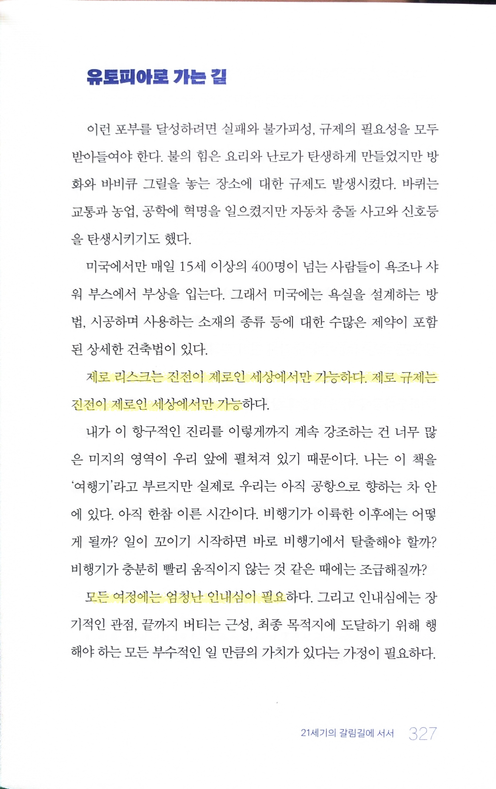

# 인간을 진화시키는 AI

Tags: artificial-intelligence
Date: December 7, 2023
Score: ★★★☆☆

- ★★★☆☆ 2023.12.03,06,07
    - [Impromptu :: Amplifying Our Humanity Through AI](https://www.impromptubook.com/)

- 리드 호프먼이 공화당 지지로 유명하긴 한데… 속내가 정말 어떨지는 궁금하다

- 인간이 하는 모든 일은 완벽할 수 없다는 건 정말 동의한다. 그렇기에 항상 노력이 필요하고

- 프로세스, 시스템 혹은 어떤 용어로 부르건 (그리고 어떤 사람들은 이런 걸 항상 싫어하지만) 말보다 효과적인 건 제도

- 사람이 주도해야 한다는 건 대부분 사람들은 동의하겠지만 시스템이 이렇게 갖춰질 지는 알 수 없는 일이라고 생각

- BM이 효과적이어야 하는 것도 그래서인듯. 사람들에게 효과적으로 노출이 되고 효율적으로 사용할 수 있게 하는 방법이 있어야 좋은 도구도 쓸모가 생길테니

- bug를 만들고 싶지 않으면 code를 작성하지 않으면 된다. 대신 만들 수 있는 feature도 없어지겠지
