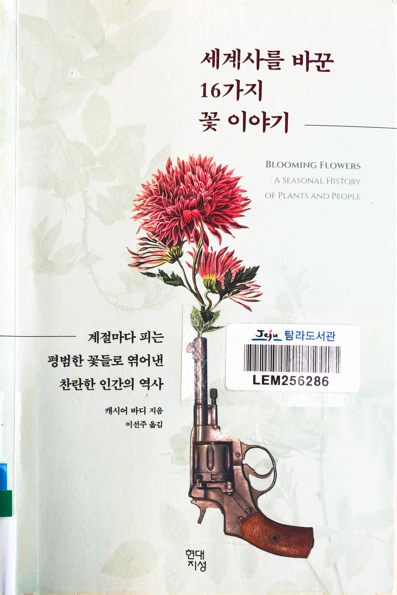
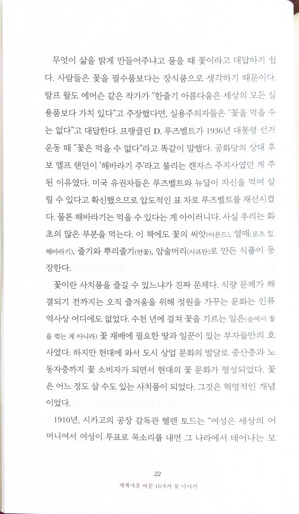
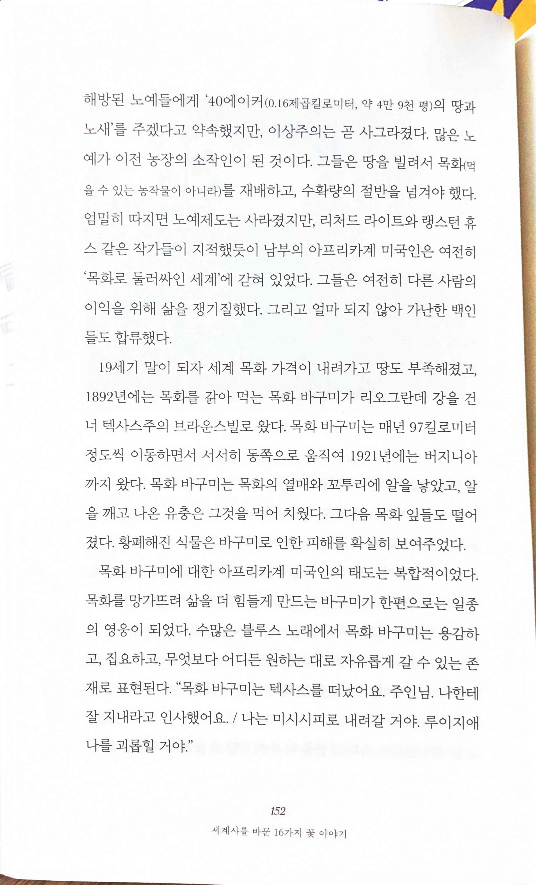
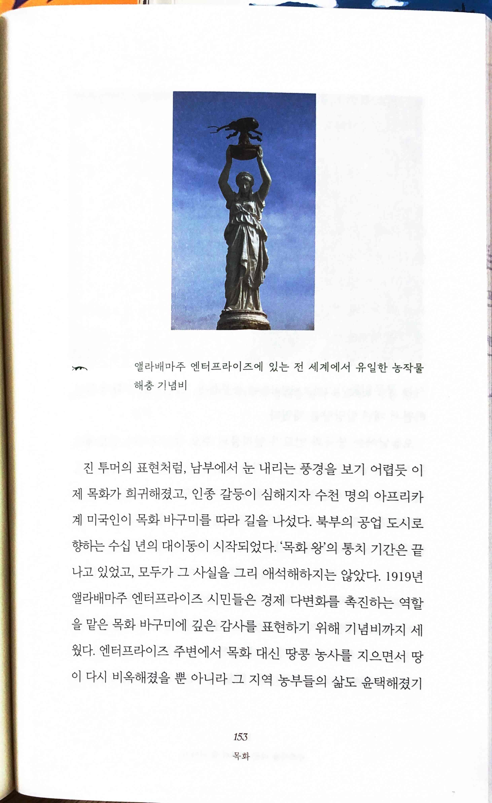

# 세계사를 바꾼 16가지 꽃 이야기

* `무엇이 삶을 밝게 만들어주냐고 물을 때 꽃이라고 대답하기 쉽다. 사람들은 꽃을 필수품보다는 장식품으로 생각하기 때문이다. 랄프 왈도 에머슨 같은 작가가 "한줄기 아름다움은 세상의 모든 실용품보다 가치 있다"고 주장했다면, 실용주의자들은 "꽃을 먹을 수는 없다”고 대답한다. 프랭클린 D. 루즈벨트가 1936년 대통령 선거운동 때 “꽃은 먹을 수 없다"라고 똑같이 말했다. 공화당의 상대 후보 앨프 랜던이 '해바라기 주라고 불리는 캔자스 주지사였던 게 주된 이유였다. 미국 유권자들은 루즈벨트와 뉴딜이 자신을 먹여 살릴 수 있다고 확신했으므로 압도적인 표 차로 루즈벨트를 재선시켰다. 물론 해바라기는 먹을 수 있다는 게 아이러니다. 사실 우리는 화초의 많은 부분을 먹는다. 이 책에도 꽃의 씨앗(아몬드), 열매(로즈 힙, 해바라기), 줄기와 뿌리줄기(연꽃), 암술머리(사프란)로 만든 식품이 등장한다.`

 

* `노예제도는 사라졌지만, 리처드 라이트와 랭스턴 휴스 같은 작가들이 지적했듯이 남부의 아프리카계 미국인은 여전히'목화로 둘러싸인 세계'에 갇혀 있었다. 그들은 여전히 다른 사람의 이익을 위해 삶을 쟁기질했다.`
* `목화 바구미에 대한 아프리카계 미국인의 태도는 복합적이었다.목화를 망가뜨려 삶을 더 힘들게 만드는 바구미가 한편으로는 일종의 영웅이 되었다. 수많은 블루스 노래에서 목화 바구미는 용감하고, 집요하고, 무엇보다 어디든 원하는 대로 자유롭게 갈 수 있는 존재로 표현된다.`