카스트 가장 민주적인 나라의 위선적 신분제
=========================================
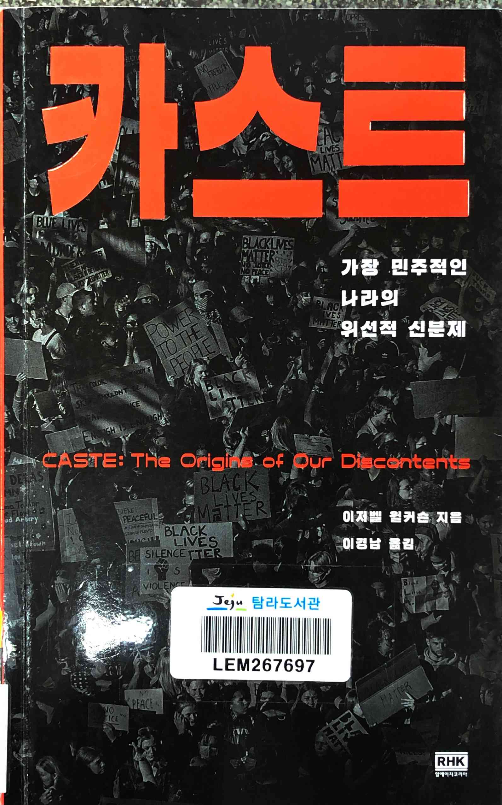

* 중요한 이야기라는 건 알지만 심각하다는 걸 강조하기 위해 반복적으로 이야기하는 방식이라 잘 읽히지는 않음

 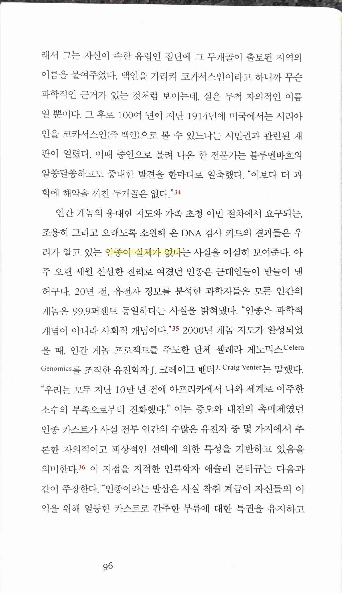 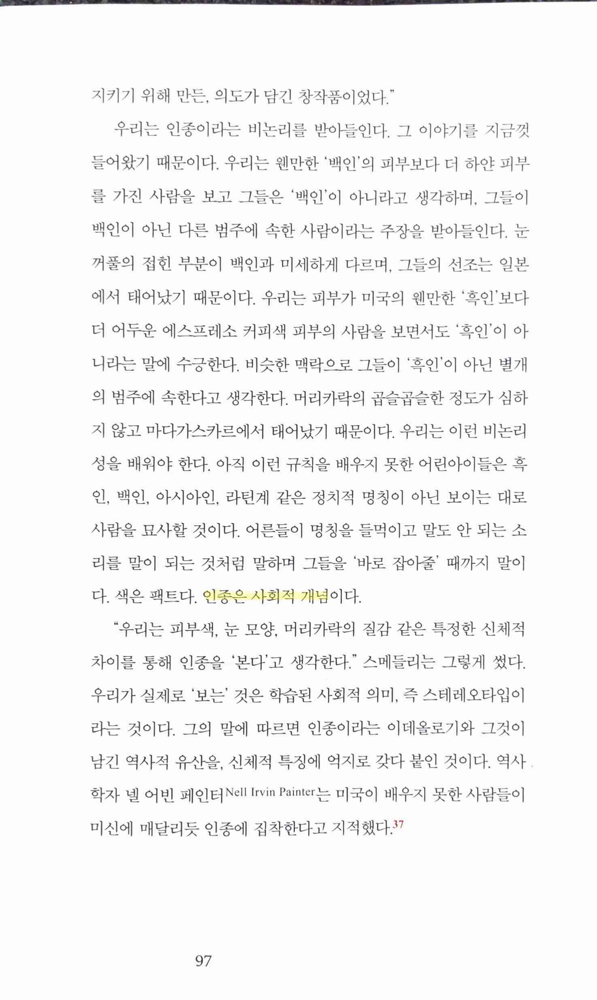

> "미국인이 생각하는 인종이란 깊고 건널 수 없는 차이에 대한 진술이다. (・・・) 그것은 극복할 수 없는 사회적 거리를 뜻한다."
>
> 인간과 인간 사이에 선을 긋기가 거의 불가능
>
> 인종이 실체가 없다
>
> 인종은 사회적 개념

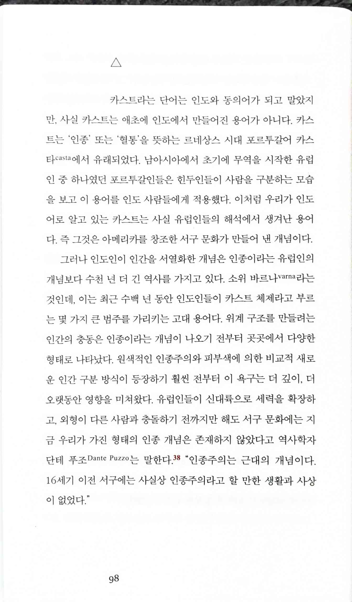

> "인종주의는 근대의 개념이다. 16세기 이전 서구에는 사실상 인종주의라고 할 만한 생활과 사상이 없었다."

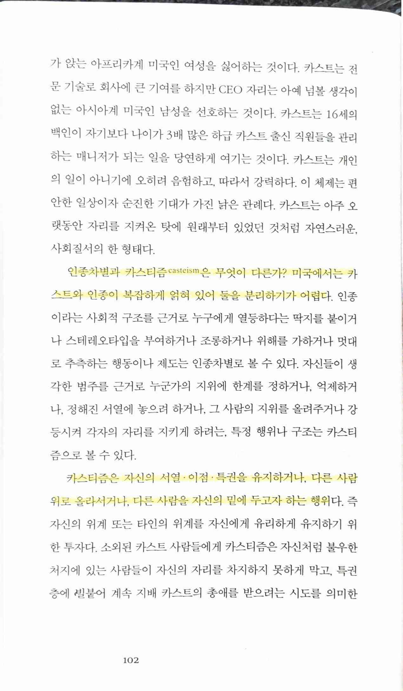

> 인종차별과 카스티즘casteism은 무엇이 다른가? 미국에서는 카스트와 인종이 복잡하게 얽혀 있어 둘을 분리하기가 어렵다.
>
> 카스티즘은 자신의 서열 · 이점 · 특권을 유지하거나, 다른 사람위로 올라서거나, 다른 사람을 자신의 밑에 두고자 하는 행위다.

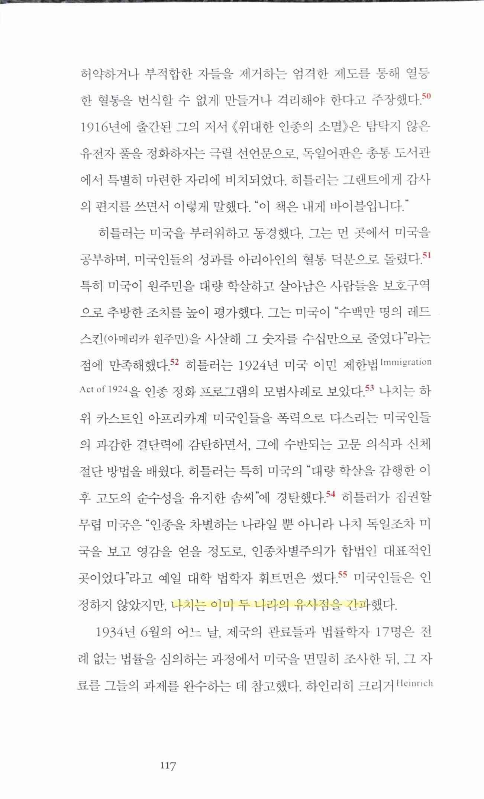 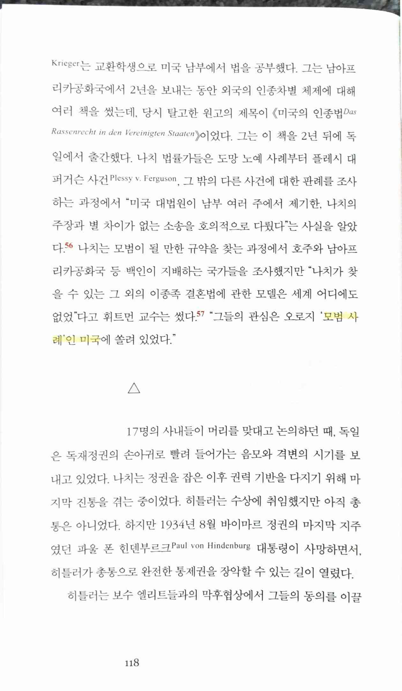

> 나치는 이미 두 나라의 유사점을 간파했다.
>
> "그들의 관심은 오로지 '모범 사례인 미국에 쏠려 있었다."

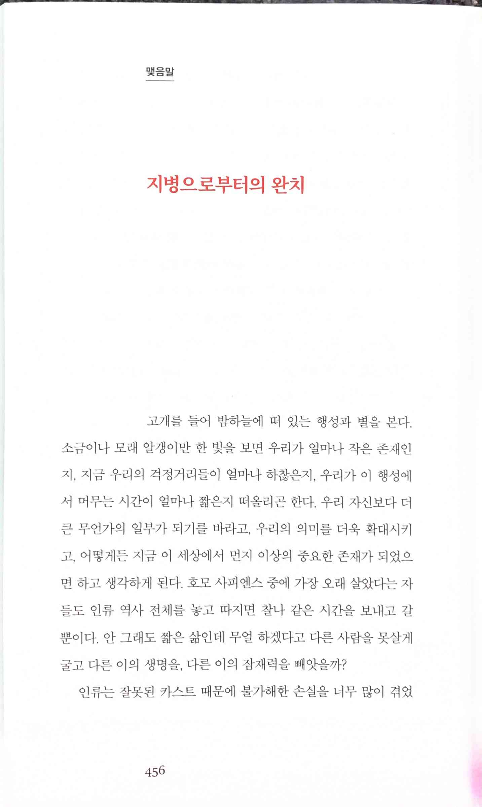 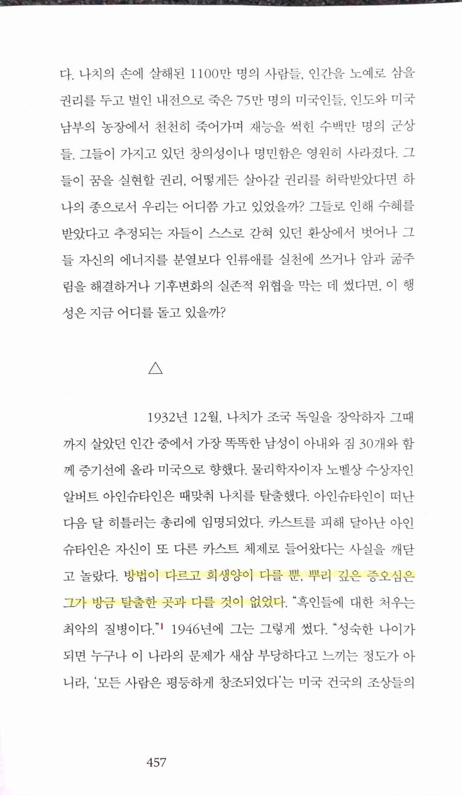 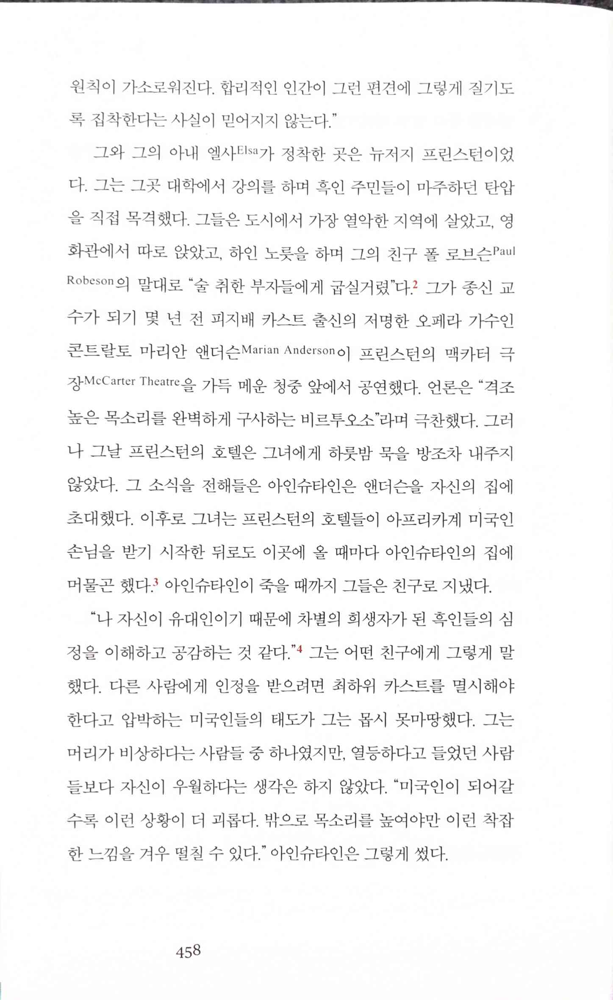 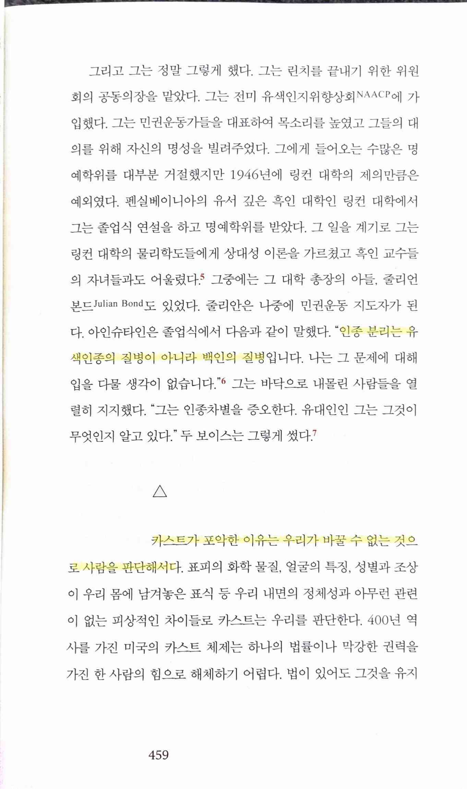 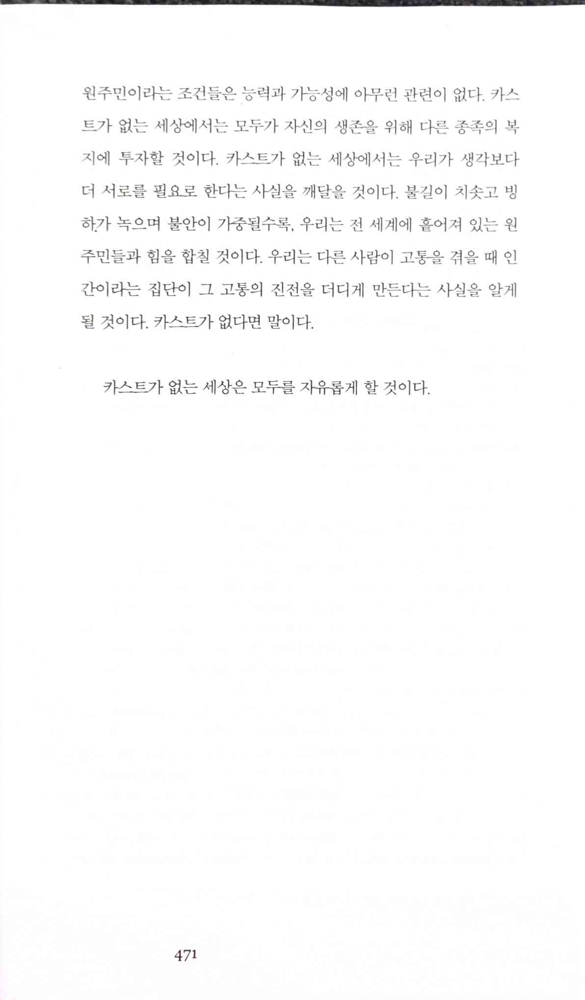

> 방법이 다르고 희생양이 다를 뿐, 뿌리 깊은 증오심은 그가 방금 탈출한 곳과 다를 것이 없었다.
>
> 인종 분리는 유색인종의 질병이 아니라 백인의 질병
>
> 카스트가 포악한 이유는 우리가 바꿀 수 없는 것으로 사람을 판단해서다.