# 우리에게는 다른 데이터가 필요하다

Tags: data-scientist, data_science, management
Date: November 5, 2023
Score: ★★★★☆

- 2023.11.05 ★★★★☆
    - Civic data, civic hacker에 대해 집중하는 사회과학 책으로만 예상하고 있었는데, 읽어보니 전반적인 management에 적용해도 좋을만큼 훨씬 넓은 영역을 다루고 있었고, 또 좋은 책이란 생각이 든다.

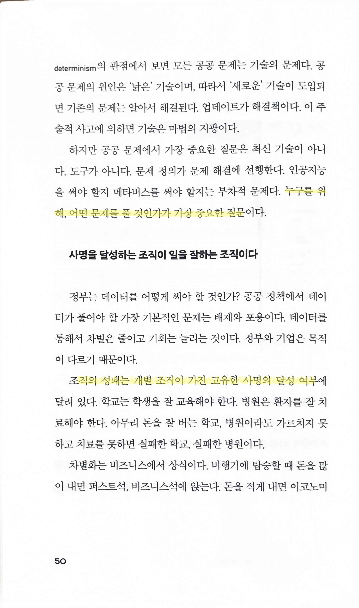

- business에서도 마찬가지. 어떤 사용자를 타겟으로 어떤 문제를 해결하는 BM을 만드는 게 가장 중요하다. 조직의 성패는 결국 이런 사명/비전/미션/…을 달성할 수 있느냐에 달려있다.

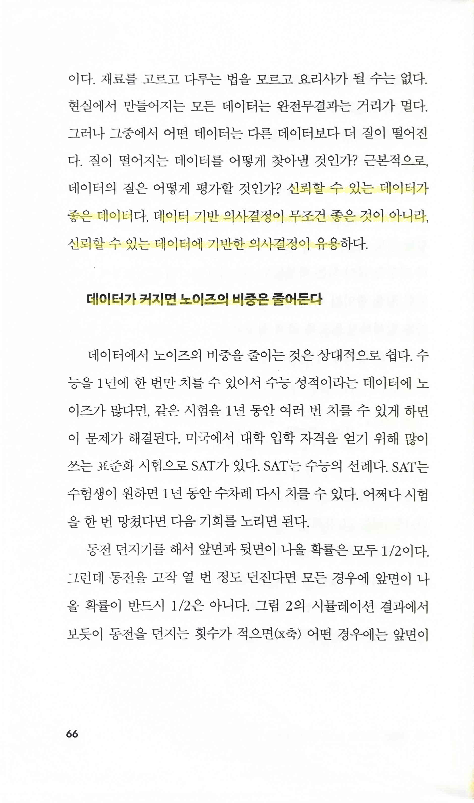

- `신뢰할 수 있는 데이터`의 중요성. 결국 데이터 수집 및 가공의 단계부터가 중요하고, 대부분의 책에서도 실무에서는 이 단계가 사실상 성공과 실패를 가르는 가장 큰 요인이라고 이야기한다.
- `데이터가 커지면 노이즈의 비중은 줄어든다`
    - 야구가 다른 스포츠보다 sabremetrics가 먼저 발달하고 영향력이 클 수 밖에 없는 이유. 경기 수도 가장 많은 데다가 모든 플레이를 끊어서 공 하나마다 분석 할 수 있기 때문에 다른 종목에 비해 압도적으로 통계의 영향력이 크다. 그로 인한 반대 급부로 야구가 재미없어 진다는 일종의 자성(?)의 목소리도 나오기도 하고.
    - 축구나 농구같은 종목도 이제 2차로 가공한 데이터를 통해 경기를 분석하는 게 일반화되었지만 아직 이런 문제(?)가 발생할 정도는 아니다.

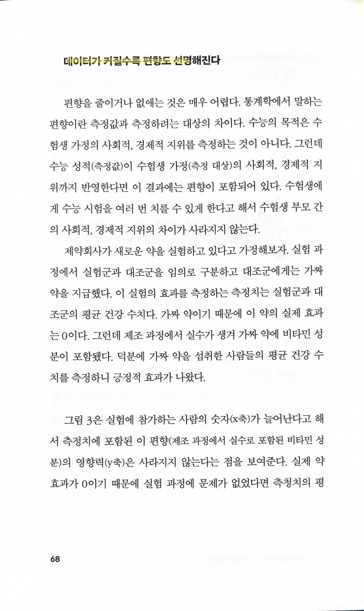

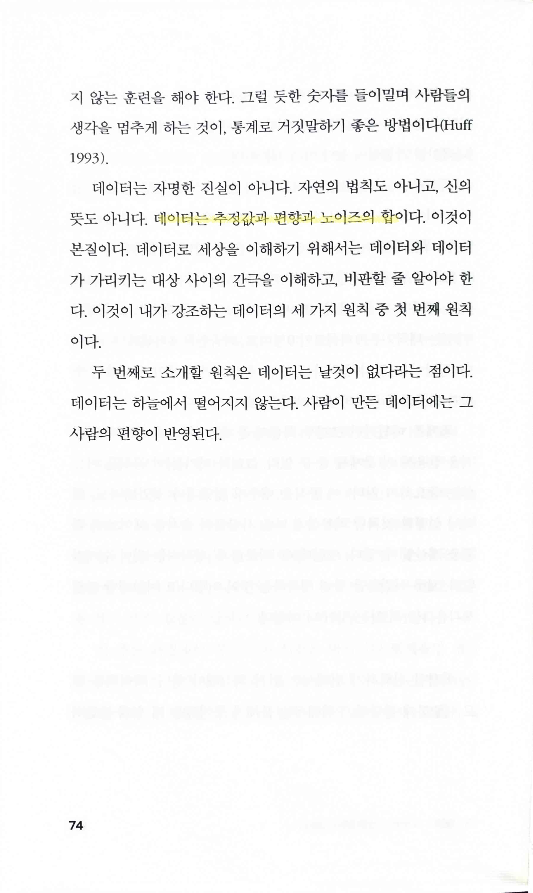

- `데이터는 추정값과 편향과 노이즈의 합`
    - 그만큼 신뢰할 수 있는 데이터를 확보하는 건 매우 어려운 일이다

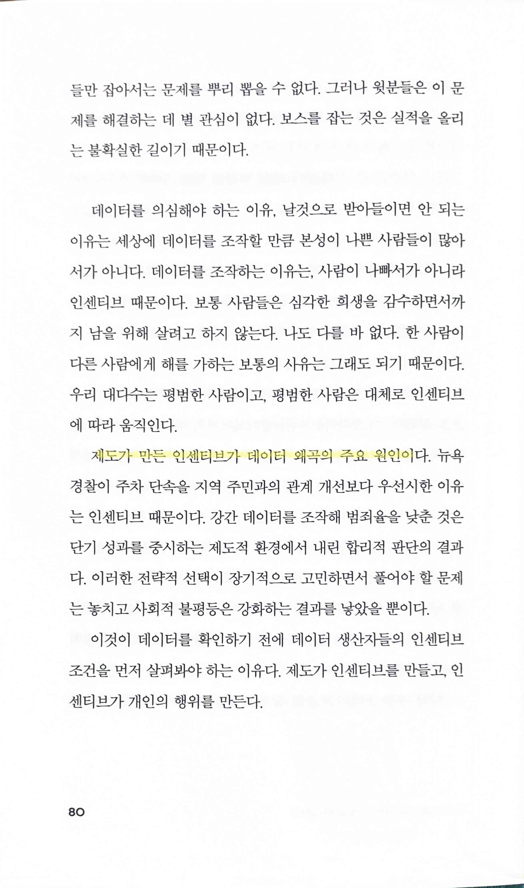

- `제도가 만든 인센티브가 데이터 왜곡의 주요 원인`
    - 데이터 왜곡만이 아니다. 사람들의 행동 자체에 영향을 준다. 가장 대표적인 게 우리나라 주택 정책. 어떤 제도를 만들어도 투기업자들은 언제나 틈을 찾아 버블을 만들어 내려고 하고, 어떤 사람들은 집값 부양을 위해 보통 사람들은 생각지도 못할 행동을 실행한다.

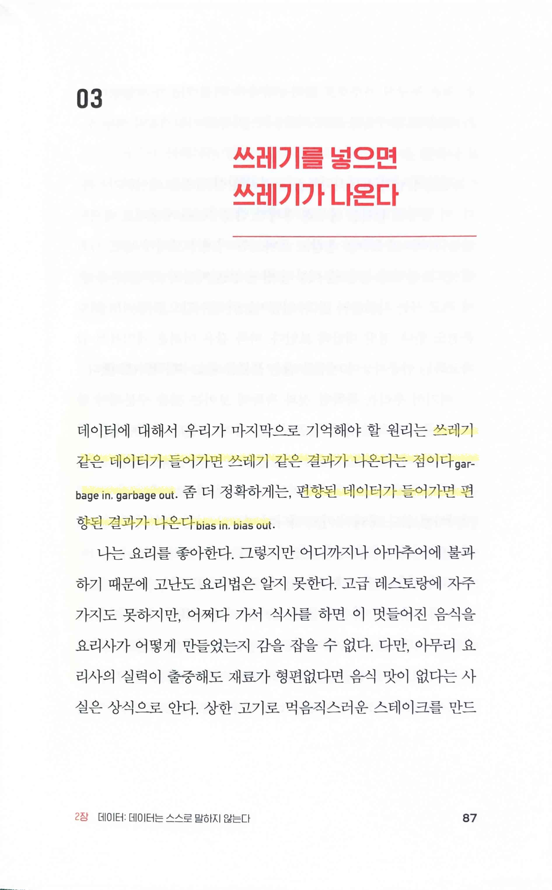

- 같은 말이지만, `garbage in, garbage out`보다는 `bias in, bias out` 이 훨씬 부드럽고 이야기할 때 좋겠단 생각이 든다. 특히 computer science에 대한 지식이 없는 사람에게는 garbage란 용어가 공격적으로 들릴 수 있겠단 생각을 예전에는 못 했었다.

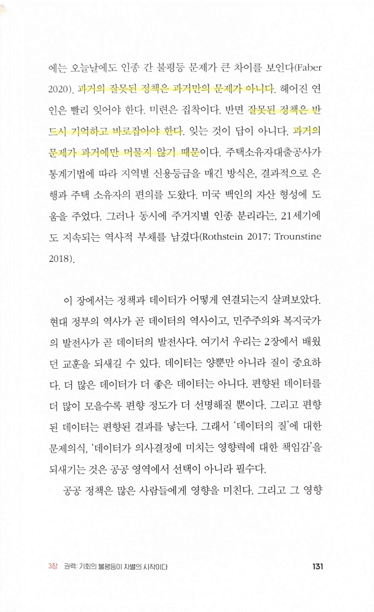

- 과거의 잘못된 정책은 결국 개발에서는 bug나 마찬가지이다. 과거에 만들어낸 bug는 돌아보고 해결하지 않으면 해당 system 자체를 폐기하지 않는 한 현재나 미래에도 작건 크건 영향을 미친다. 그래서 retrospective 회고 시간이나 bug report에서 5 whys같은 기법으로 원인을 찾는 시간을 가지는 게 중요하다.

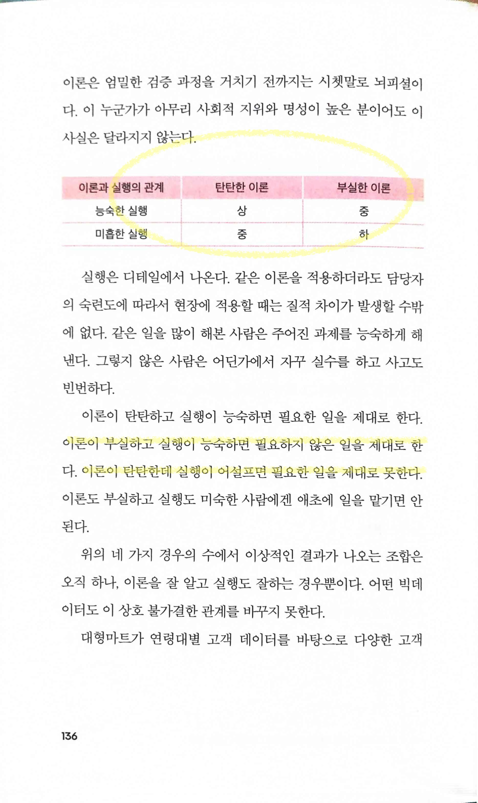

- 내가 즐겨 쓰는 무협지의 내공 외공 비유나 efficiency effectiveness, 아이젠하워 매트릭스 등하고도 연결해서 생각해볼 수 있을 거 같다

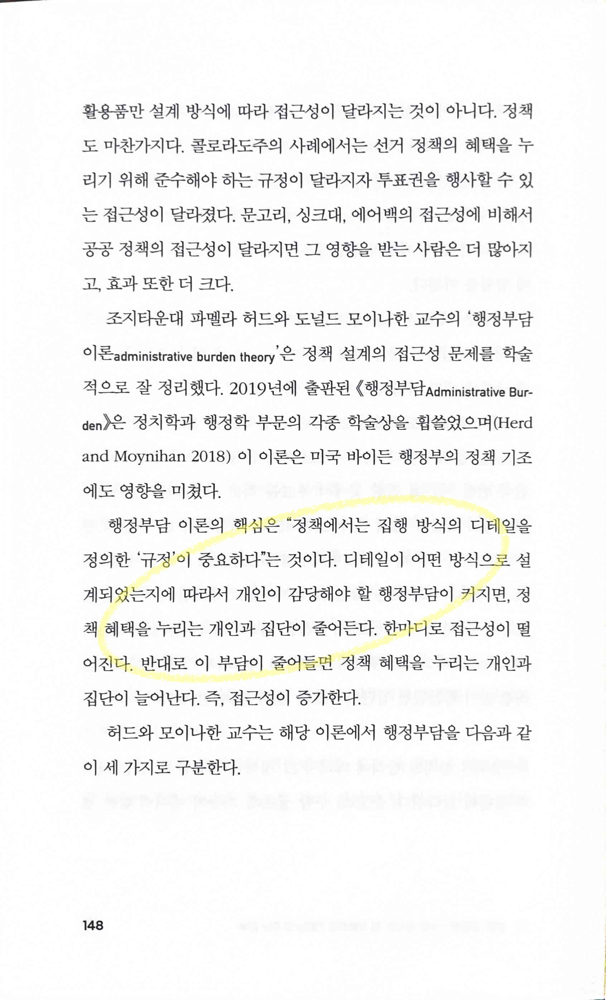

- `악마는 디테일에 있다 The devil is in the detail` 과도 연결되는 말

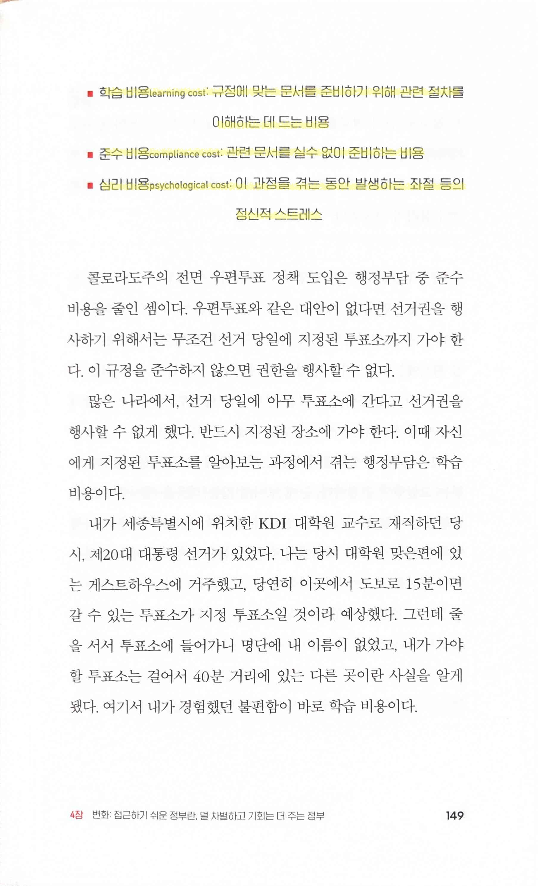

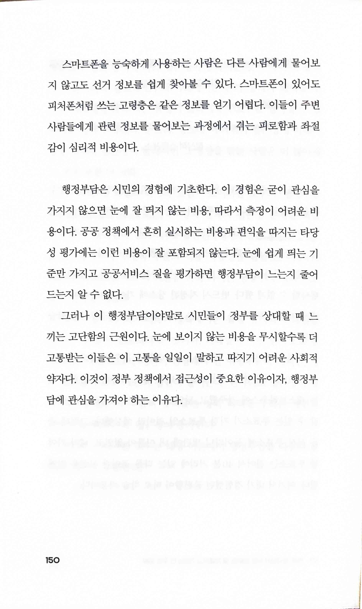

- `학습 비용 learning cost`, `준수 비용 compliance cost심리 비용 psychological cost` 모두 사용자들에게 시스템을 제공할 때 business 관점에서도 생각해봐야 할 문제로 연결 가능하단 생각이 든다.

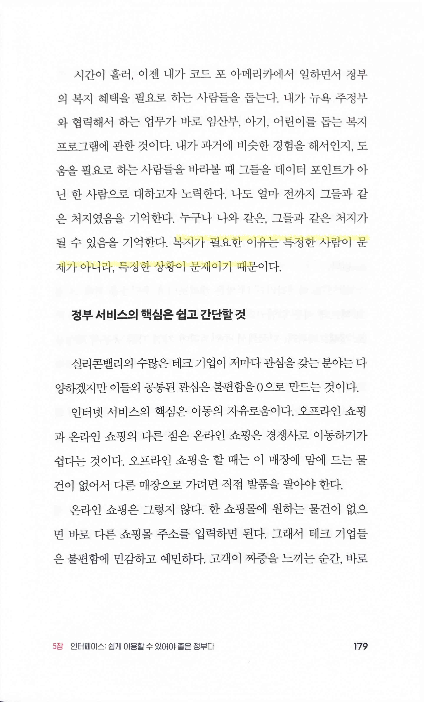

- `복지가 필요한 이유는 특정한 사람이 문제가 아니라, 특정한 상황이 문제이기 때문`
    - 이 책에서 딱 하나의 문장만 선택하라면 이 문장을 선택하겠다. 저자가 어떤 사람인지 모르겠으나 선한 사람일 거란 생각이 든다.

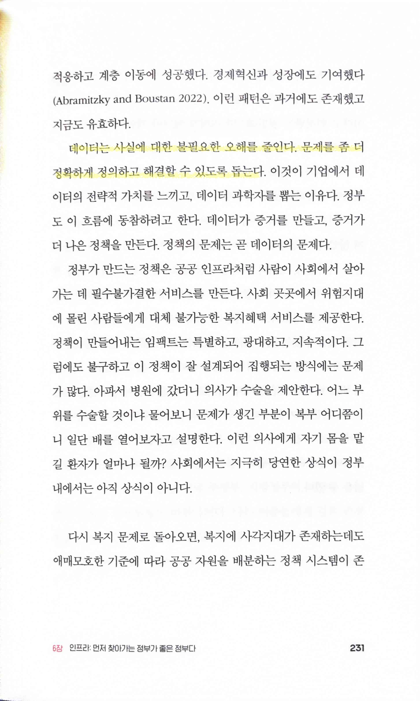

- `데이터는 사실에 대한 불필요한 오해를 줄인다. 문제를 좀 더 정확하게 정의하고 해결할 수 있도록 돕는다.`

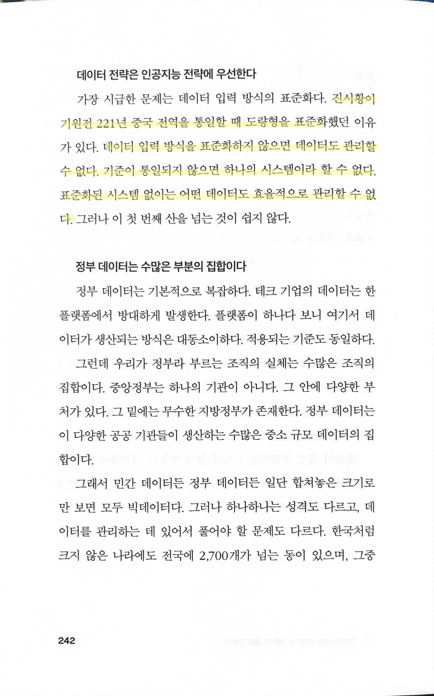

- 표준화를 2200여년 전에 도입했던 진시황. 내가 경험하고 있지만, 겨우 몇 십명 되는 작은 조직에서도 이런 표준화가 쉬운 일이 아니다.

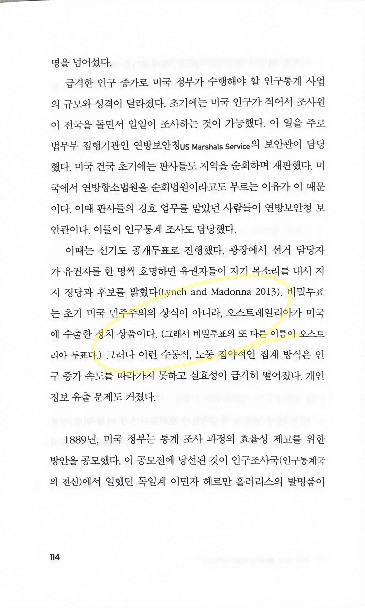

- 이 책에서 (큰 건 아니지만) 유일한 문제로 생각한 페이지. 오스트레일리아가 맞는가 오스트리아가 맞는가? 검색해봐도 쉽게 찾을 수가 없어서 뭐가 맞는지 모르겠다.
