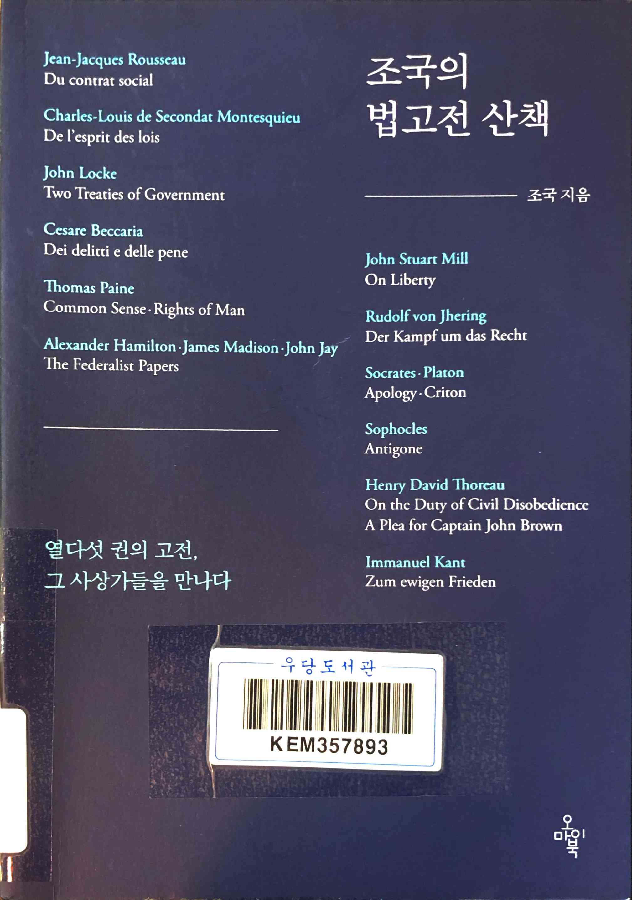
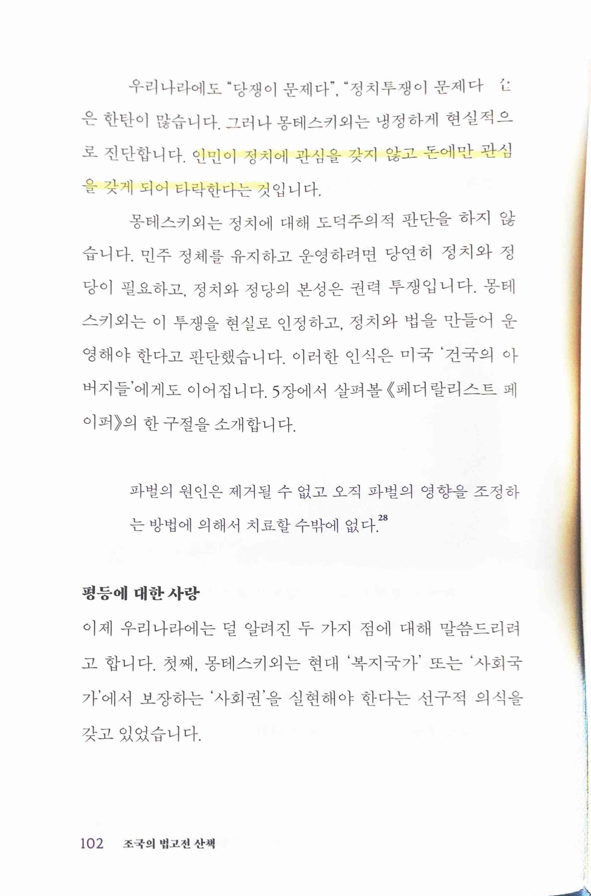
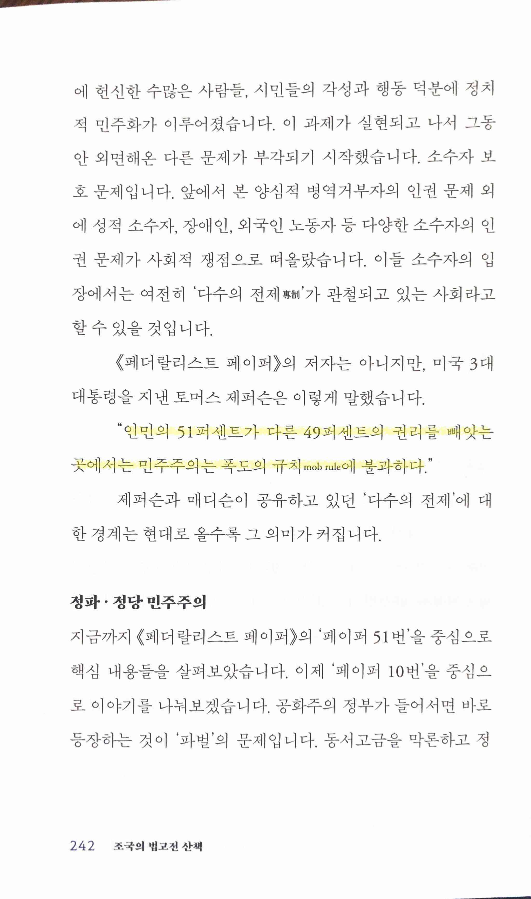
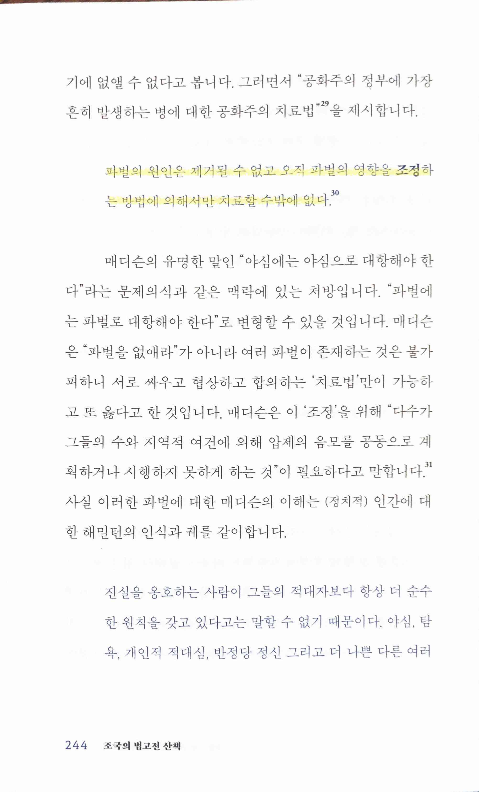
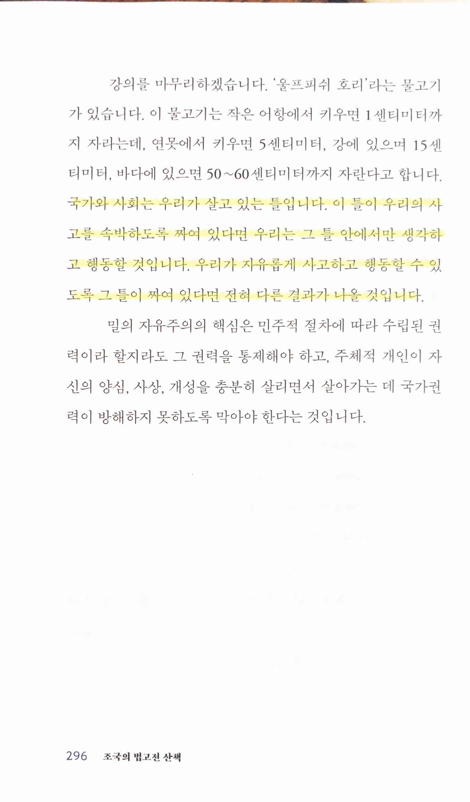

조국의 법고전 산책
==================

> 인민이 정치에 관심을 갖지 않고 돈에만 관심을 갖게 되어 타락한다

> 토머스 제퍼슨 “인민의 51퍼센트가 다른 49퍼센트의 권리를 빼앗는곳에서는 민주주의는 폭도의 규칙 mob rule에 불과하다.”
* [Democracy is nothing more than mob rule...(Spurious Quotation) | Thomas Jefferson's Monticello](https://www.monticello.org/research-education/thomas-jefferson-encyclopedia/democracy-nothing-more-mob-rulespurious-quotation/)

> 파벌의 원인은 제거될 수 없고 오직 파벌의 영향을 조정하는 방법에 의해서만 치료할 수밖에 없다.
* [A. 해밀턴, J. 매디슨, J. 제이 <페더랄리스트 페이퍼>(1787-1788)](https://m.ohmyschool.org/img_files/video/201807/1512610f-1ca8-4a7f-844c-905c081d17c1.pdf)

> 진리와 정의의 이익을 위해서는 다른 무엇보다도 소수의 의견자의 독설을 규제하기보다는 다수 의견자의 독설을 제한하는 것이 더욱 중요하다.

> '울프피쉬 호리'... 국가와 사회는 우리가 살고 있는 틀입니다. 이 틀이 우리의 사고를 속박하도록 짜여 있다면 우리는 그 틀 안에서만 생각하고 행동할 것입니다. 우리가 자유롭게 사고하고 행동할 수 있도록 그 틀이 짜여 있다면 전혀 다른 결과가 나올 것입니다.