# Connect 커넥트 스탠퍼드 인간관계 수업
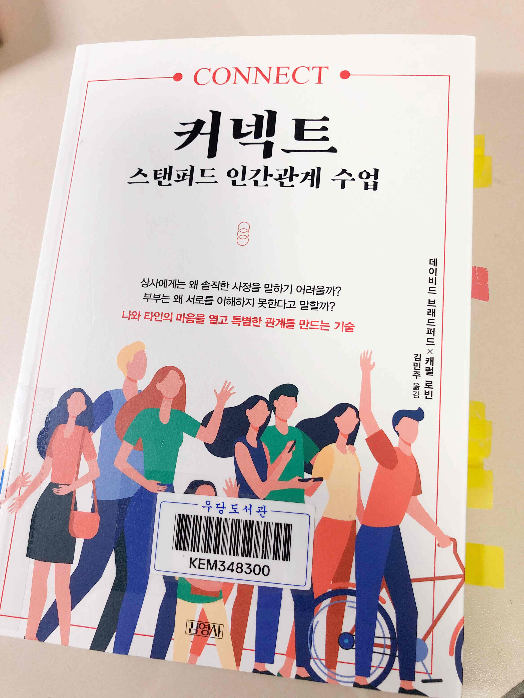

### 1장 좋은 관계에서 각별한 관계로
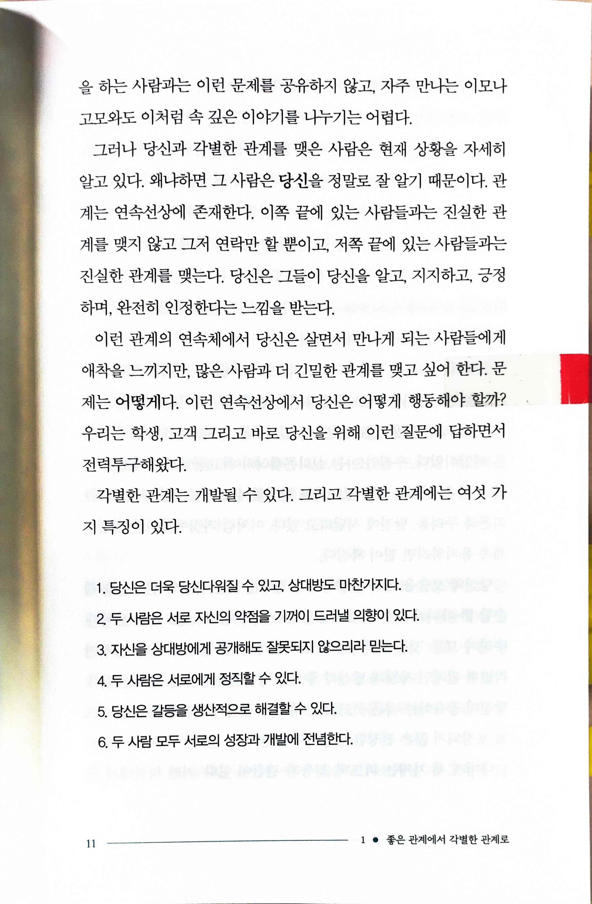

> 각별한 관계의 여섯 가지 특징
>
> 1. 당신은 더욱 당신다워질 수 있고, 상대방도 마찬가지다.
>
> 2 두 사람은 서로 자신의 약점을 기꺼이 드러낼 의향이 있다.
>
> 3. 자신을 상대방에게 공개해도 잘못되지 않으리라 믿는다.
>
> 4. 두 사람은 서로에게 정직할 수 있다.
>
> 5. 당신은 갈등을 생산적으로 해결할 수 있다.
>
> 6. 두 사람 모두 서로의 성장과 개발에 전념한다.

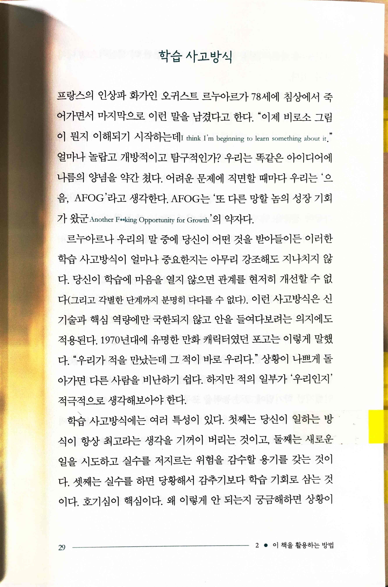

> 학습 사고방식에는 여러 특성이 있다. 첫째는 당신이 일하는 방식이 항상 최고라는 생각을 기꺼이 버리는 것이고, 둘째는 새로운 일을 시도하고 실수를 저지르는 위험을 감수할 용기를 갖는 것이다. 셋째는 실수를 하면 당황해서 감추기보다 학습 기회로 삼는 것이다. 호기심이 핵심이다.

## 1부 - 좋은 관계를 만들고 싶다면

### 3장 사적인 이야기를 꺼내기 망설여질 때
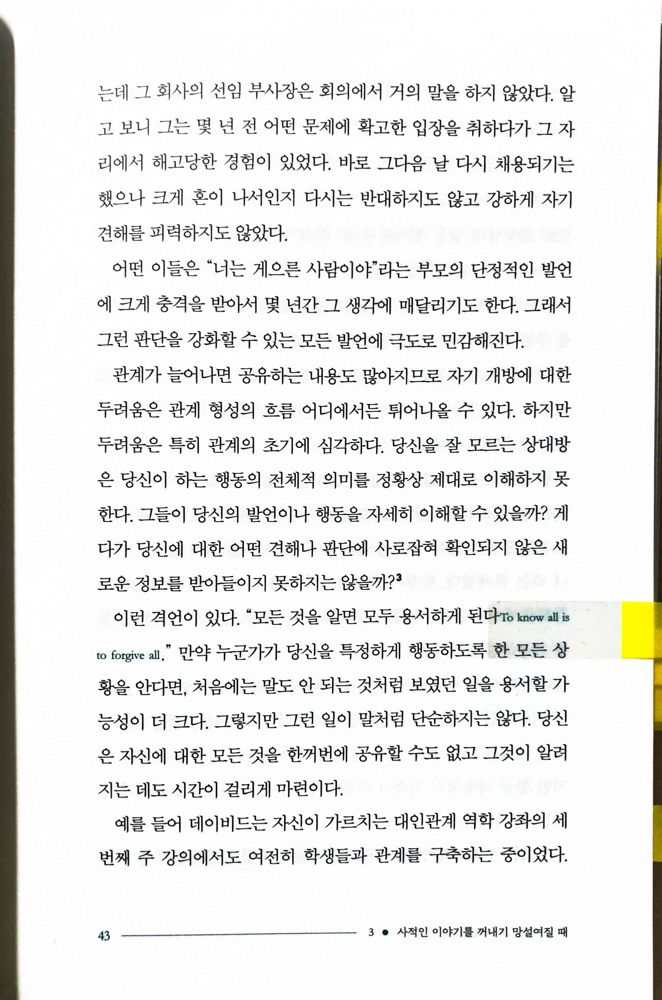

> “모든 것을 알면 모두 용서하게 된다To know all is to forgive all."  만약 누군가가 당신을 특정하게 행동하도록 한 모든 상황을 안다면, 처음에는 말도 안 되는 것처럼 보였던 일을 용서할 가능성이 더 크다.

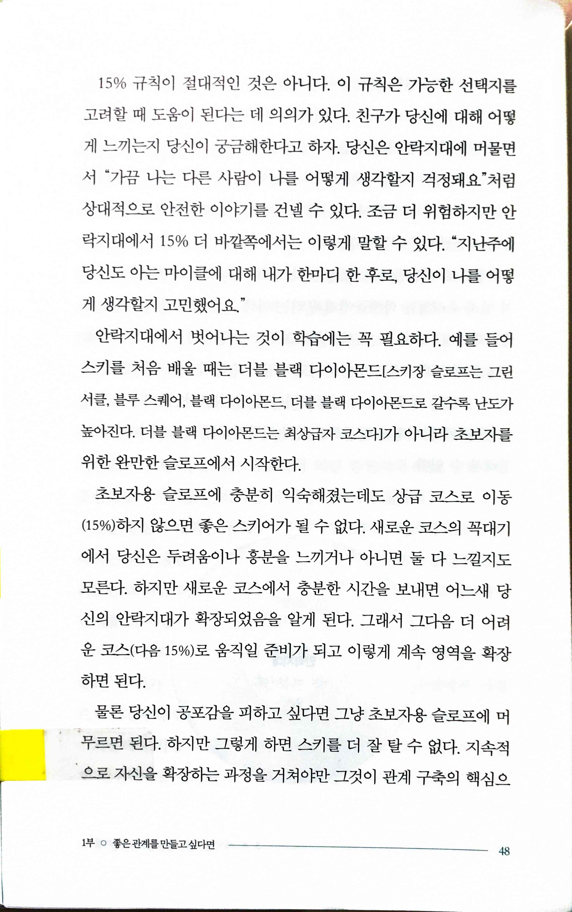

> 물론 당신이 공포감을 피하고 싶다면 그냥 초보자용 슬로프에 머무르면 된다. 하지만 그렇게 하면 스키를 더 잘 탈 수 없다. 지속적으로 자신을 확장하는 과정을 거쳐야

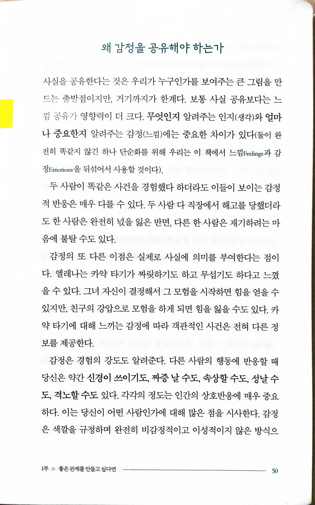

> 사실을 공유한다는 것은 우리가 누구인가를 보여주는 큰 그림을 만드는 출발점이지만, 거기까지가 한계다. 보통 사실 공유보다는 느낌 공유가 영향력이 더 크다. 무엇인지 알려주는 인지(생각)와 얼마나 중요한지 알려주는 감정(느낌)에는 중요한 차이가 있다

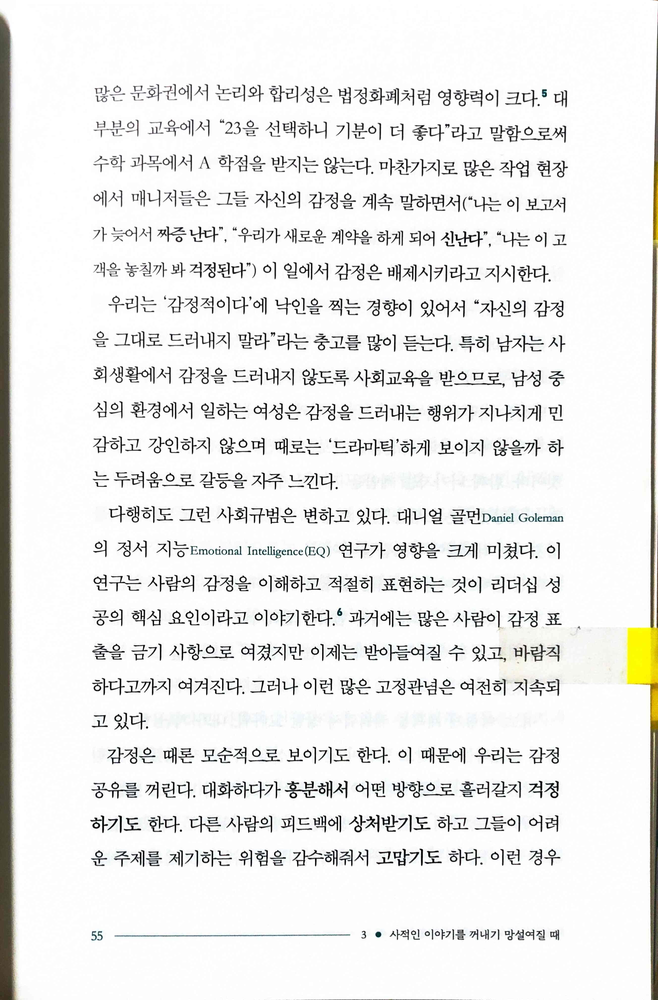

> 대니얼 골먼 Daniel Goleman의 정서 지능 Emotional Intelligence(EQ) 연구가 영향을 크게 미쳤다. 이 연구는 사람의 감정을 이해하고 적절히 표현하는 것이 리더십 성공의 핵심 요인이라고 이야기한다. 과거에는 많은 사람이 감정 표출을 금기 사항으로 여겼지만 이제는 받아들여질 수 있고, 바람직하다고까지 여겨진다.

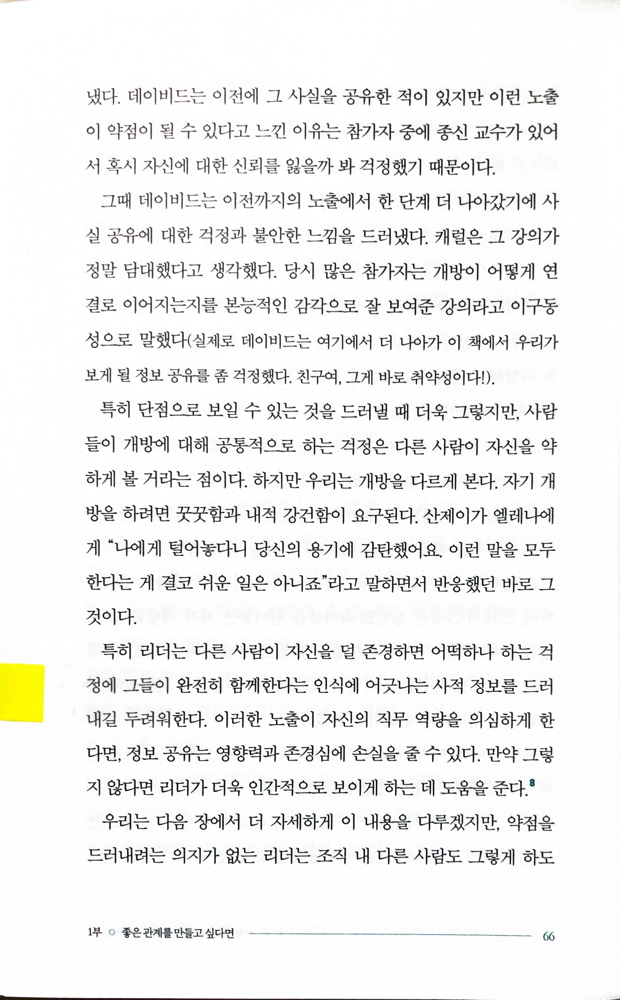

> 특히 리더는 다른 사람이 자신을 덜 존경하면 어떡하나 하는 걱정에 그들이 완전히 함께한다는 인식에 어긋나는 사적 정보를 드러내길 두려워한다. 이러한 노출이 자신의 직무 역량을 의심하게 한다면, 정보 공유는 영향력과 존경심에 손실을 줄 수 있다. 만약 그렇지 않다면 리더가 더욱 인간적으로 보이게 하는 데 도움을 준다.

### 4장 상대방이 마음을 열지 않을 때
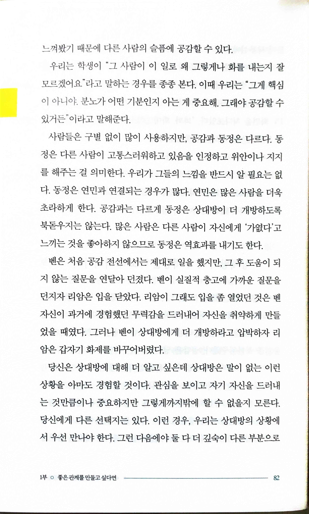

> 우리는 학생이 "그 사람이 이 일로 왜 그렇게나 화를 내는지 잘 모르겠어요"라고 말하는 경우를 종종 본다. 이때 우리는 "그게 핵심이 아니야, 분노가 어떤 기분인지 아는 게 중요해. 그래야 공감할 수 있거든"이라고 말해준다.

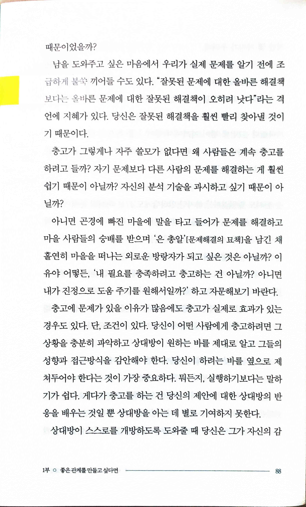

> 남을 도와주고 싶은 마음에서 우리가 실제 문제를 알기 전에 조급하게 불쑥 끼어들 수도 있다. “잘못된 문제에 대한 올바른 해결책보다는 올바른 문제에 대한 잘못된 해결책이 오히려 낫다"라는 격언에 지혜가 있다. 당신은 잘못된 해결책을 훨씬 빨리 찾아낼 것이기 때문이다.

> 상호작용성Reciprocity 은 자기 개방에서 결정적 요소다. 그런데 누가 먼저 자신을 노출할 것인가? 더 많이 노출하면 할수록 외적으로 보여지는 모습을 더 통제할 수 있지만, 지위나 인지된 지위의 문제가 있을 때 노출 결정이 얼마나 더 어려워지는지를 고려해야만 한다. '지위status'는 조직 내 위치, 업적의 정도, 혹은 교육 수준일 수 있다.

### 5장 관계의 주도권이 한 사람에게 쏠려 있을 때
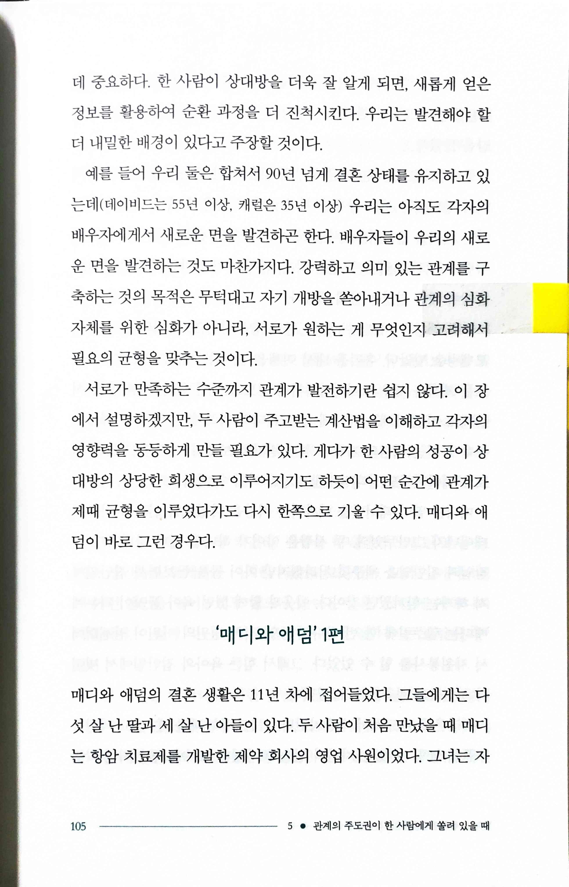

> 강력하고 의미 있는 관계를 구축하는 것의 목적은 무턱대고 자기 개방을 쏟아내거나 관계의 심화자체를 위한 심화가 아니라, 서로가 원하는 게 무엇인지 고려해서필요의 균형을 맞추는 것이다.

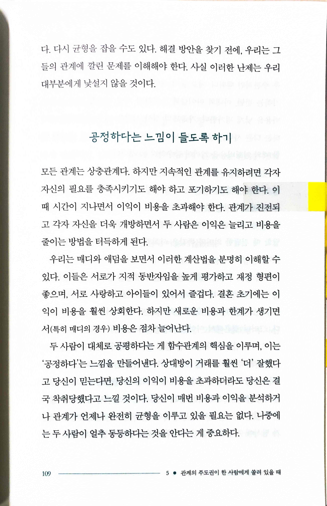

> 모든 관계는 상충관계다. 하지만 지속적인 관계를 유지하려면 각자 자신의 필요를 충족시키기도 해야 하고 포기하기도 해야 한다. 이때 시간이 지나면서 이익이 비용을 초과해야 한다. 관계가 진전되고 각자 자신을 더욱 개방하면서 두 사람은 이익은 늘리고 비용을 줄이는 방법을 터득하게 된다.

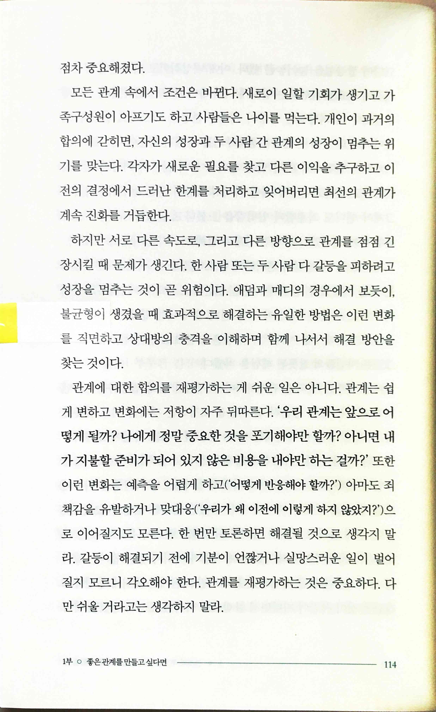

> 불균형이 생겼을 때 효과적으로 해결하는 유일한 방법은 이런 변화를 직면하고 상대방의 충격을 이해하며 함께 나서서 해결 방안을 찾는 것이다.

### 6장 사소한 불편이 큰 문제로 변하려 할 때
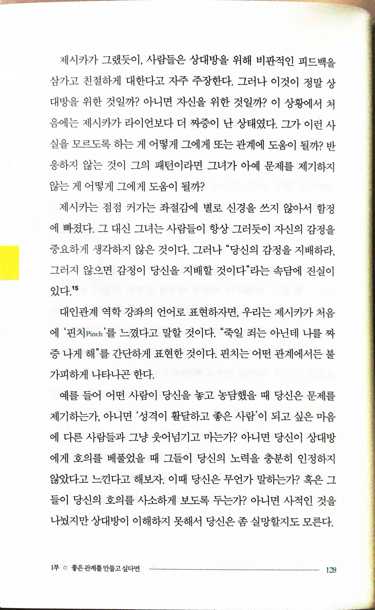

> "당신의 감정을 지배하라, 그러지 않으면 감정이 당신을 지배할 것이다"

### 7장 비난하지 않고 피드백하고 싶을 때
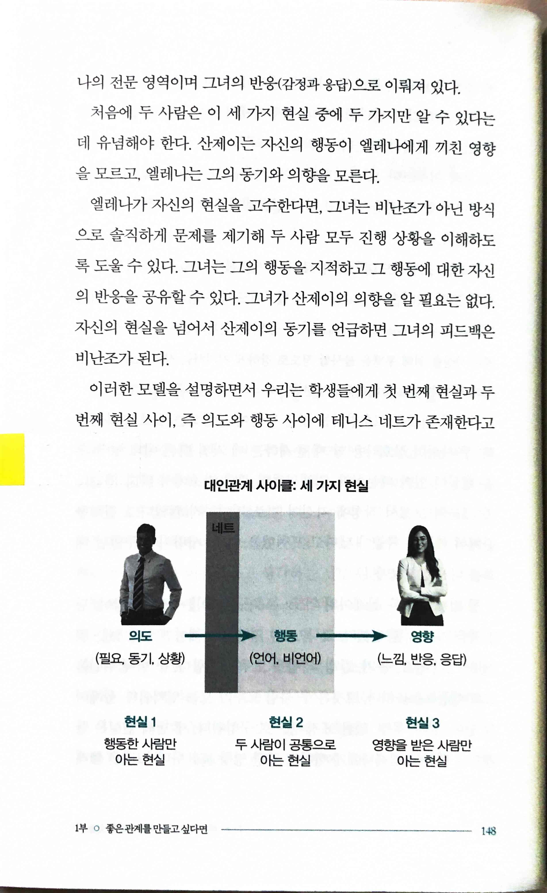

> 대인관계 사이클: 세 가지 현실

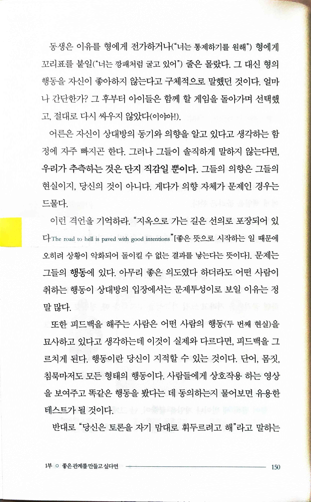

> "지옥으로 가는 길은 선의로 포장되어 있다The road to hell is paved with good intentions" [좋은 뜻으로 시작하는 일 때문에 오히려 상황이 악화되어 돌이킬 수 없는 결과를 낳는다는 뜻이다]. 문제는 그들의 행동에 있다. 아무리 좋은 의도였다 하더라도 어떤 사람이 취하는 행동이 상대방의 입장에서는 문제투성이로 보일 이유는 정말 많다.

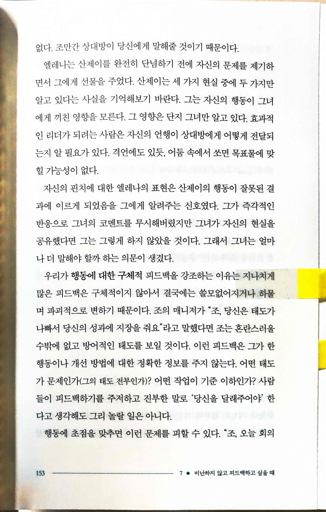

> 우리가 행동에 대한 구체적 피드백을 강조하는 이유는 지나치게 많은 피드백은 구체적이지 않아서 결국에는 쓸모없어지거나 하물며 파괴적으로 변하기 때문이다... 행동에 초점을 맞추면 이런 문제를 피할 수 있다.

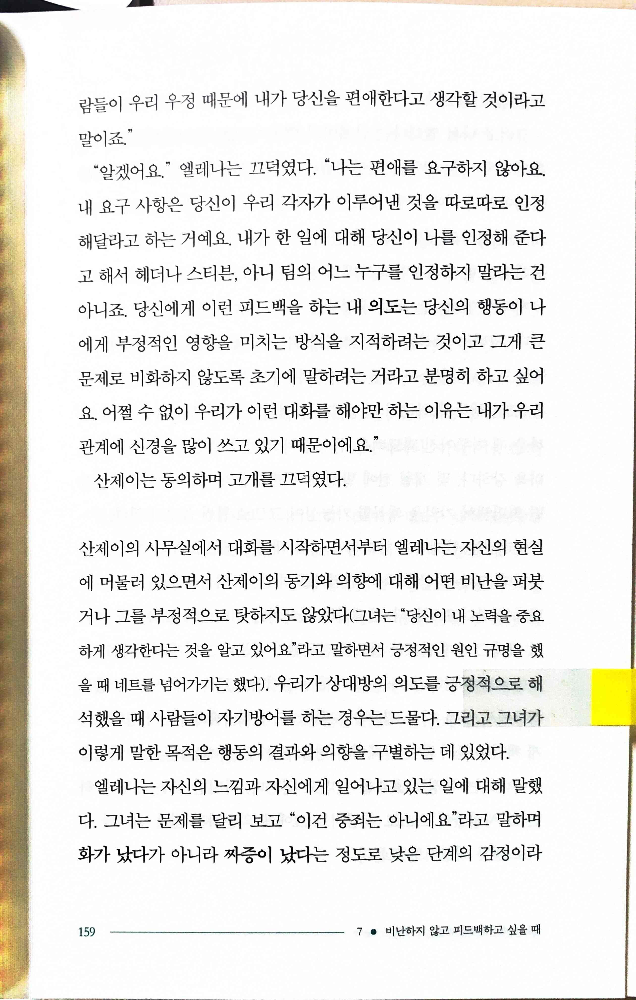

> 우리가 상대방의 의도를 긍정적으로 해석했을 때 사람들이 자기방어를 하는 경우는 드물다... 이렇게 말한 목적은 행동의 결과와 의향을 구별하는 데 있었다.

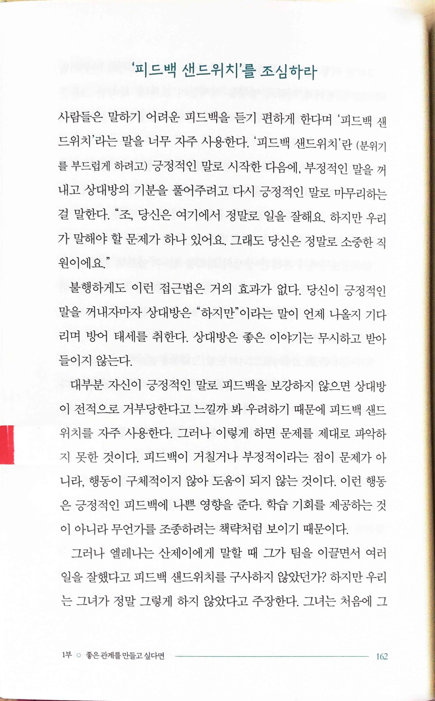

> '피드백 샌드위치'란 (분위기를 부드럽게 하려고) 긍정적인 말로 시작한 다음에, 부정적인 말을 꺼내고 상대방의 기분을 풀어주려고 다시 긍정적인 말로 마무리하는걸 말한다.
>
> 불행하게도 이런 접근법은 거의 효과가 없다. 당신이 긍정적인말을 꺼내자마자 상대방은 "하지만"이라는 말이 언제 나올지 기다리며 방어 태세를 취한다. 상대방은 좋은 이야기는 무시하고 받아들이지 않는다.
>
> 대부분 자신이 긍정적인 말로 피드백을 보강하지 않으면 상대방이 전적으로 거부당한다고 느낄까 봐 우려하기 때문에 피드백 샌드위치를 자주 사용한다. 그러나 이렇게 하면 문제를 제대로 파악하지 못한 것이다. 피드백이 거칠거나 부정적이라는 점이 문제가 아니라, 행동이 구체적이지 않아 도움이 되지 않는 것이다. 이런 행동은 긍정적인 피드백에 나쁜 영향을 준다. 학습 기회를 제공하는 것이 아니라 무언가를 조종하려는 책략처럼 보이기 때문이다.

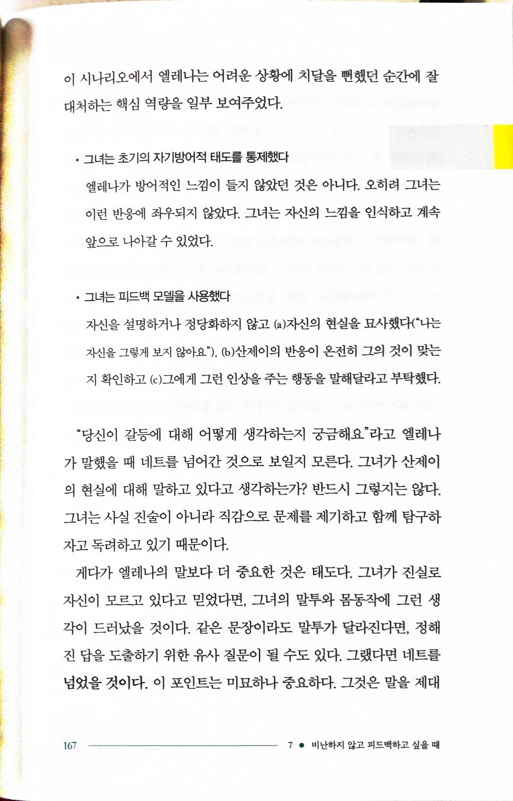

> 초기의 자기방어적 태도를 통제
>
> 피드백 모델을 사용

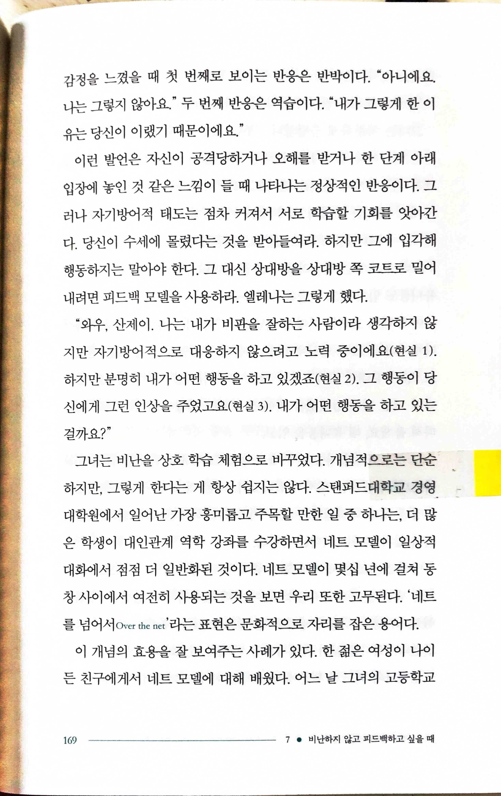

> 비난을 상호 학습 체험으로 바꾸었다. 개념적으로는 단순하지만, 그렇게 한다는 게 항상 쉽지는 않다... '네트를 넘어서Over the net'라는 표현은 문화적으로 자리를 잡은 용어다.

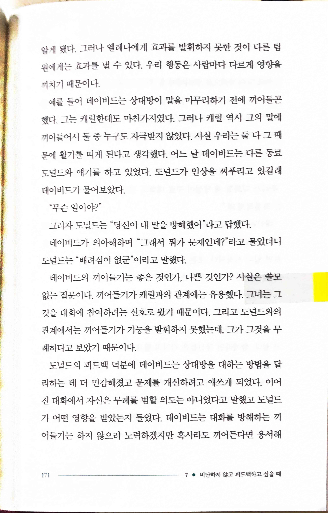

> 끼어들기는 좋은 것인가, 나쁜 것인가? 사실은 쓸모없는 질문이다. 끼어들기가 A와의 관계에는 유용했다. 그녀는 그것을 대화에 참여하려는 신호로 봤기 때문이다. 그리고 B와의 관계에서는 끼어들기가 기능을 발휘하지 못했는데, 그가 그것을 무례하다고 보았기 때문이다.

### 8장 피드백했는데 상대방이 받아들이지 않을 때
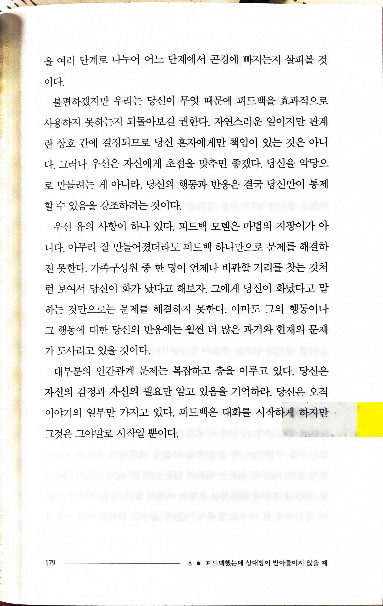

> 대부분의 인간관계 문제는 복잡하고 층을 이루고 있다. 당신은 자신의 감정과 자신의 필요만 알고 있음을 기억하라. 당신은 오직 이야기의 일부만 가지고 있다. 피드백은 대화를 시작하게 하지만 그것은 그야말로 시작일 뿐이다.

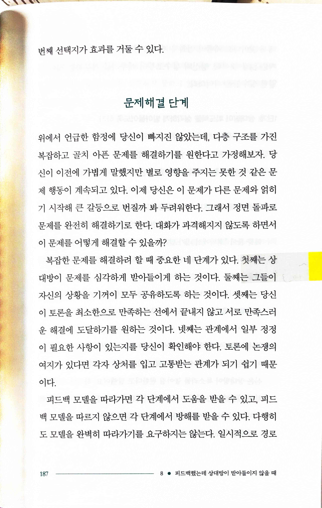

> 복잡한 문제를 해결하려 할 때 중요한 네 단계가 있다. 첫째는 상대방이 문제를 심각하게 받아들이게 하는 것이다. 둘째는 그들이 자신의 상황을 기꺼이 모두 공유하도록 하는 것이다. 셋째는 당신이 토론을 최소한으로 만족하는 선에서 끝내지 않고 서로 만족스러운 해결에 도달하기를 원하는 것이다. 넷째는 관계에서 일부 정정이 필요한 사항이 있는지를 당신이 확인해야 한다. 토론에 논쟁의 여지가 있다면 각자 상처를 입고 고통받는 관계가 되기 쉽기 때문이다.

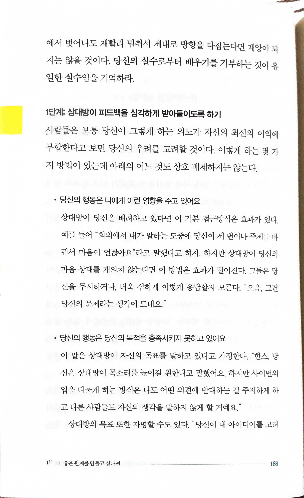

> 1단계: 상대방이 피드백을 심각하게 받아들이도록 하기
>
> 사람들은 보통 당신이 그렇게 하는 의도가 자신의 최선의 이익에 부합한다고 보면 당신의 우려를 고려할 것이다.
>
> • 당신의 행동은 나에게 이런 영향을 주고 있어요
>
> • 당신의 행동은 당신의 목적을 충족시키지 못하고 있어요

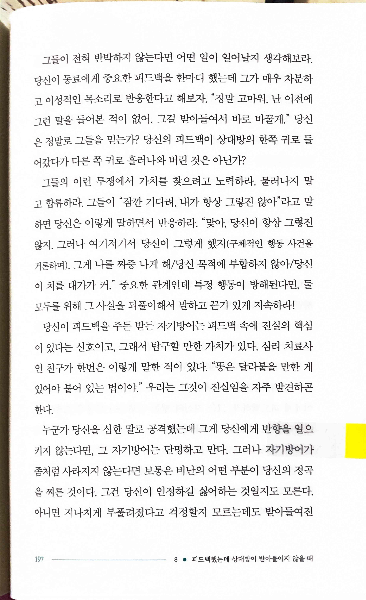

> 누군가 당신을 심한 말로 공격했는데 그게 당신에게 반향을 일으키지 않는다면, 그 자기방어는 단명하고 만다. 그러나 자기방어가좀처럼 사라지지 않는다면 보통은 비난의 어떤 부분이 당신의 정곡을 찌른 것이다. 그건 당신이 인정하길 싫어하는 것일지도 모른다. 아니면 지나치게 부풀려졌다고 걱정할지 모르는데도 받아들여진다. 그걸 인정하면 당신이 어떻게 반응해야 할지에 대한 선택권을 갖게 된다.

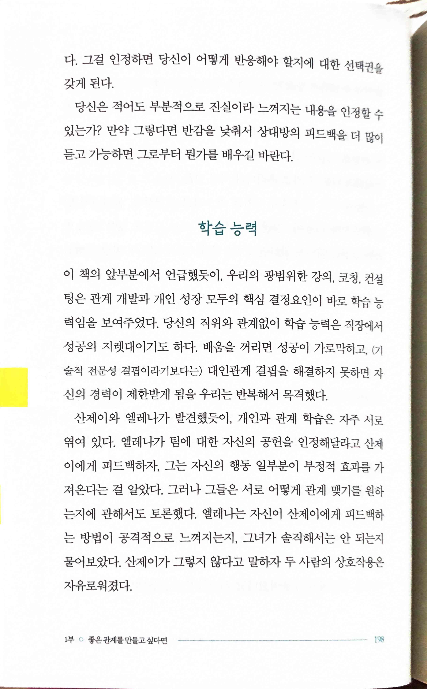

> 관계 개발과 개인 성장 모두의 핵심 결정요인이 바로 학습 능력임을 보여주었다. 당신의 직위와 관계없이 학습 능력은 직장에서 성공의 지렛대이기도 하다. 배움을 꺼리면 성공이 가로막히고 (기술적 전문성 결핍이라기보다는) 대인관계 결핍을 해결하지 못하면 자신의 경력이 제한받게 됨을 우리는 반복해서 목격했다.

### 9장 오래된 관계를 개선하고 싶을 때
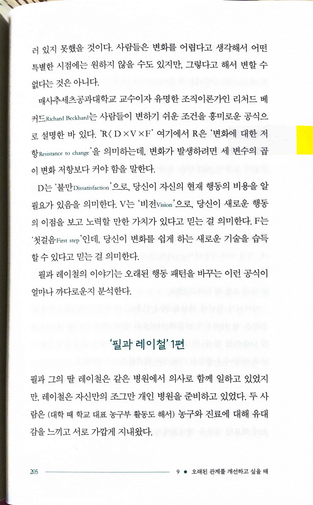

> 매사추세츠공과대학교 교수이자 유명한 조직이론가인 리처드 베커드 Richand Beckhard는 사람들이 변하기 쉬운 조건을 흥미로운 공식으로 설명한 바 있다. 'R< D x V x F'.  R은 '변화에 대한 저항Resistance to change', 변화가 발생하려면 세 변수의 곱이 변화 저항보다 커야 함
>
> D는 '불만Dissatisfaction'으로, 당신이 자신의 현재 행동의 비용을 알 필요가 있음을 의미한다. V는 '비전Vision'으로, 당신이 새로운 행동의 이점을 보고 노력할 만한 가치가 있다고 믿는 걸 의미한다. F는 '첫걸음First step '인데, 당신이 변화를 쉽게 하는 새로운 기술을 습득할 수 있다고 믿는 걸 의미한다.

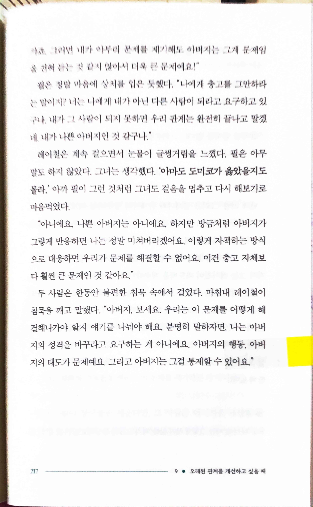

### 10장 가까운 사이에 갈등이 심해졌을 때
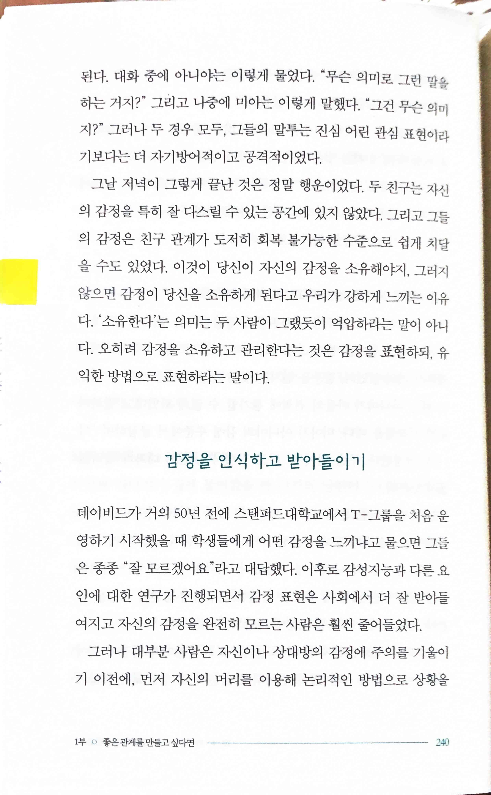

> 자신의 감정을 소유해야지, 그러지 않으면 감정이 당신을 소유하게 된다... '소유한다'는 의미는 억압하라는 말이 아니다. 오히려 감정을 소유하고 관리한다는 것은 감정을 표현하되, 유익한 방법으로 표현하라는 말이다.

### 11장 감정이 격해져 소통이 어려울 때
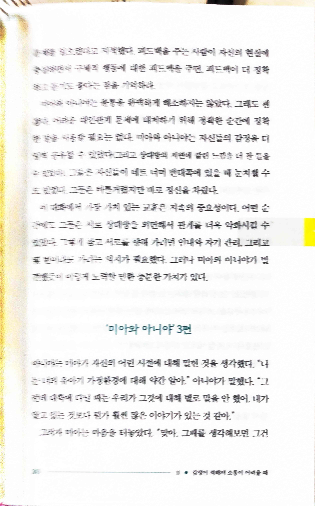

> 지속의 중요성... 어떤 순간에도 그들은 서로 상대방을 외면해서 관계를 더욱 악화시킬 수 있었다. 그렇게 참고 서로를 향해 가려면 인내와 자기 관리 그리고 몇 번이라도 가려는 의지가 필요했다. 

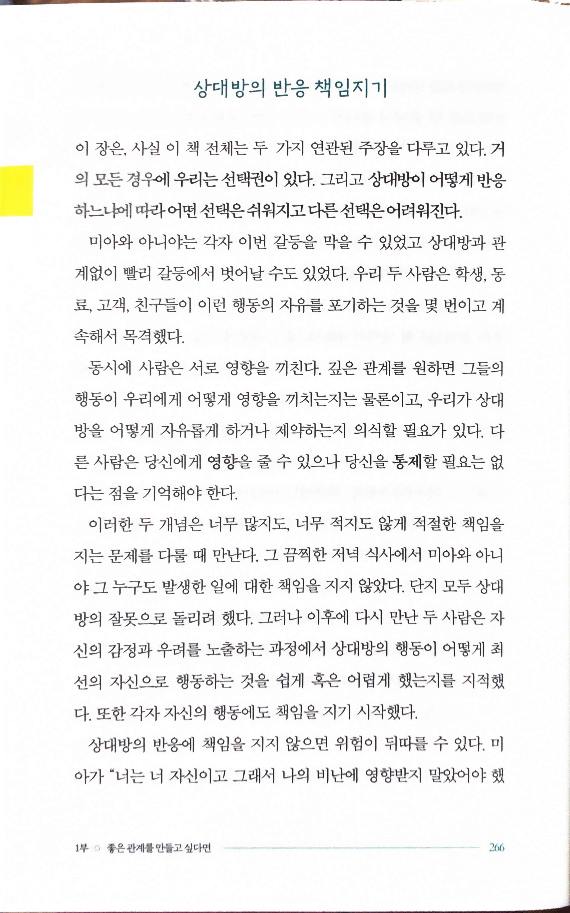

> 거의 모든 경우에 우리는 선택권이 있다. 그리고 상대방이 어떻게 반응하느냐에 따라 어떤 선택은 쉬워지고 다른 선택은 어려워진다.

### 12장 아무리 대화해도 문제가 해결되지 않을 때
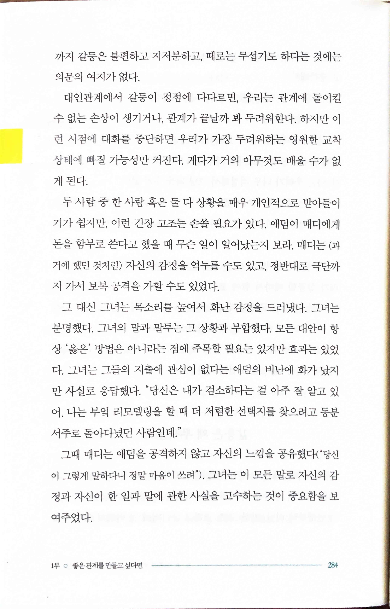

> 대인관계에서 갈등이 정점에 다다르면, 우리는 관계에 돌이킬 수 없는 손상이 생기거나, 관계가 끝날까 봐 두려워한다. 하지만 이런 시점에 대화를 중단하면 우리가 가장 두려워하는 영원한 교착상태에 빠질 가능성만 커진다. 게다가 거의 아무것도 배울 수가 없게 된다.

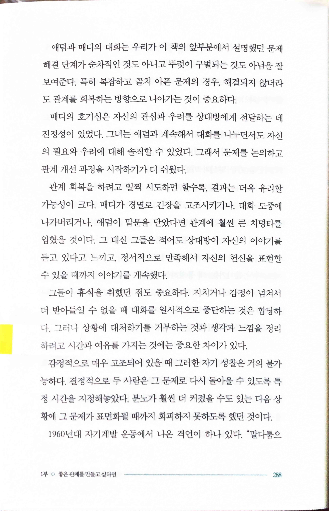

> 휴식 중요... 지치거나 감정이 넘쳐서더 받아들일 수 없을 때 대화를 일시적으로 중단하는 것은 합당하다. 그러나 상황에 대처하기를 거부하는 것과 생각과 느낌을 정리하려고 시간과 여유를 가지는 것에는 중요한 차이가 있다.

## 2부 - 각별한 관계를 만들고 싶다면

### 13장 갈등의 근원을 알게 됐을 때
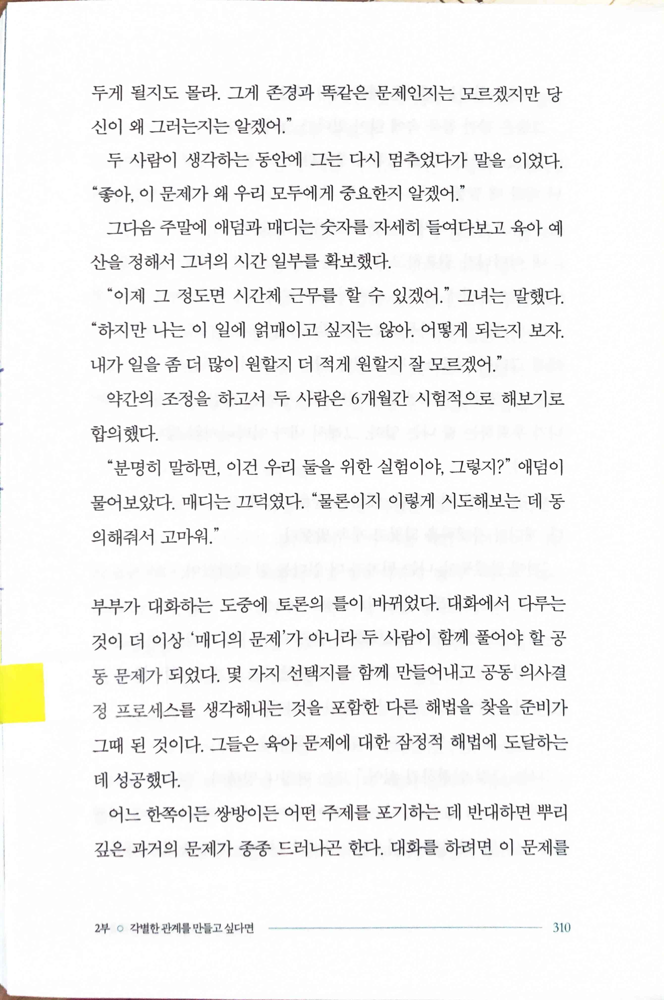

> 공동 문제가 되었다. 몇 가지 선택지를 함께 만들어내고 공동 의사결정 프로세스를 생각해내는 것을 포함한 다른 해법을 찾을 준비가 그때 된 것이다.

### 14장 받아들일 수 없는 요청을 상대방이 할 때
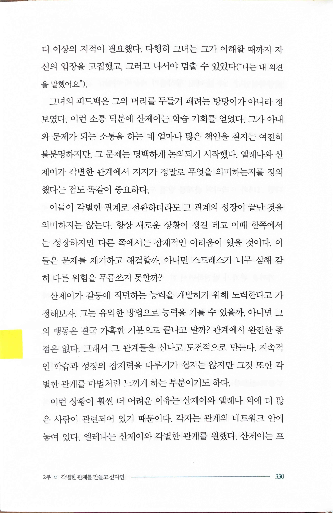

> 관계에서 완전한 종점은 없다. 그래서 그 관계들을 신나고 도전적으로 만든다. 지속적인 학습과 성장의 잠재력을 다루기가 쉽지는 않지만 그것 또한 각별한 관계를 마법처럼 느끼게 하는 부분이기도 하다.

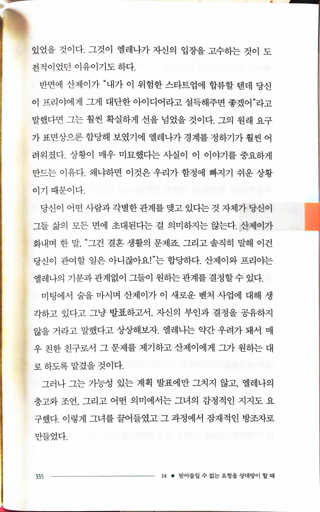

> 당신이 어떤 사람과 각별한 관계를 맺고 있다는 것 자체가 당신이 그들 삶의 모든 면에 초대된다는 걸 의미하지는 않는다.

### 15장 상대방 때문에 고통스러운 기억이 되살아날 때
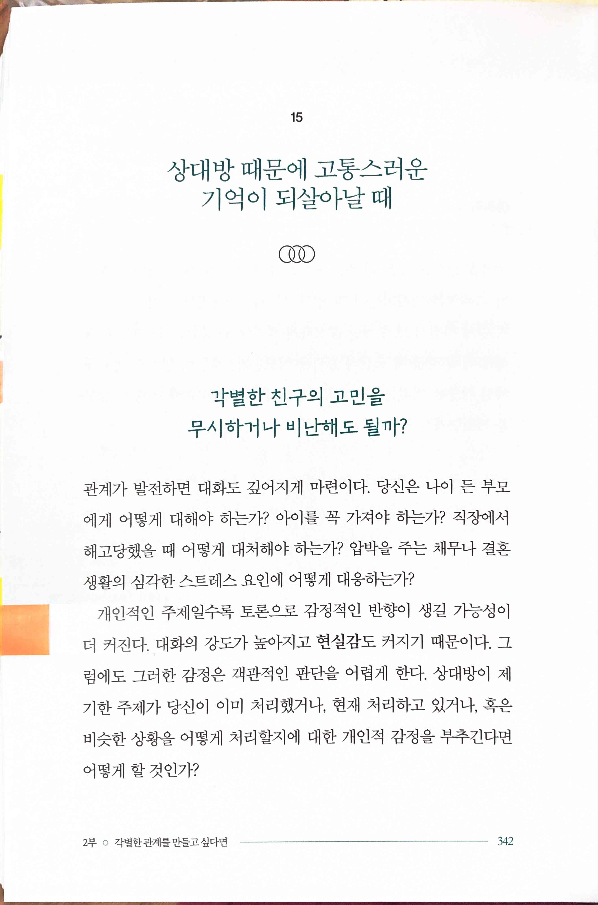

> 개인적인 주제일수록 토론으로 감정적인 반향이 생길 가능성이 더 커진다. 대화의 강도가 높아지고 현실감도 커지기 때문이다. 그럼에도 그러한 감정은 객관적인 판단을 어렵게 한다. 상대방이 제기한 주제가 당신이 이미 처리했거나, 현재 처리하고 있거나, 혹은 비슷한 상황을 어떻게 처리할지에 대한 개인적 감정을 부추긴다면 어떻게 할 것인가?

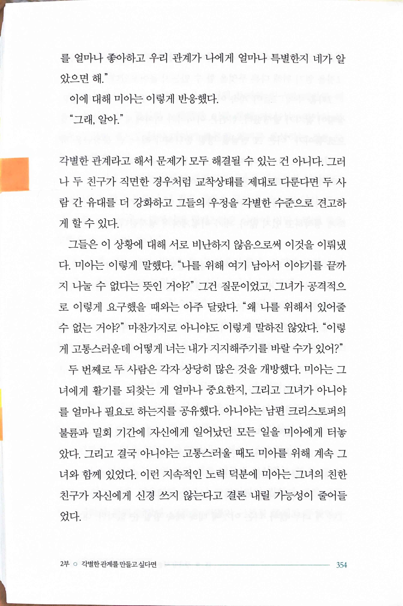

> 각별한 관계라고 해서 문제가 모두 해결될 수 있는 건 아니다.

### 16장 서로 원하는 것이 다를 때
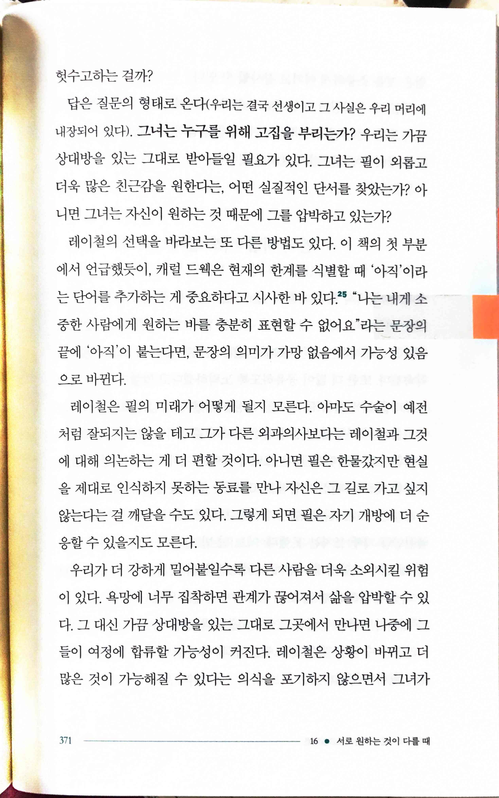

> '아직'이라는 단어를 추가하는 게 중요하다고 시사한 바 있다... 문장의 끝에 '아직'이 붙는다면, 문장의 의미가 가망 없음에서 가능성 있음으로 바뀐다.

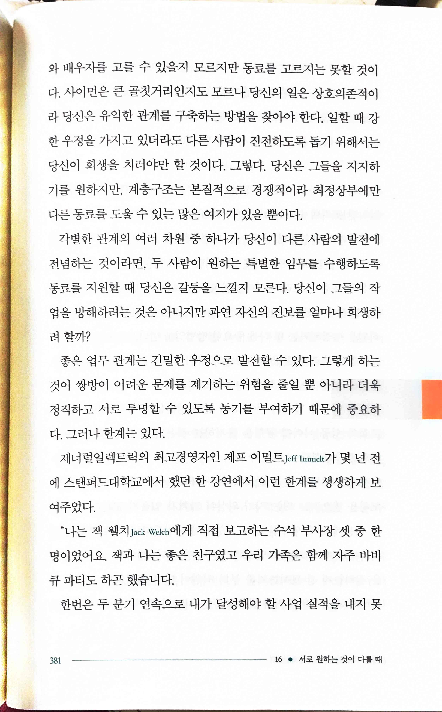

> 좋은 업무 관계는 긴밀한 우정으로 발전할 수 있다. 그렇게 하는 것이 쌍방이 어려운 문제를 제기하는 위험을 줄일 뿐 아니라 더욱 정직하고 서로 투명할 수 있도록 동기를 부여하기 때문에 중요하다. 그러나 한계는 있다.

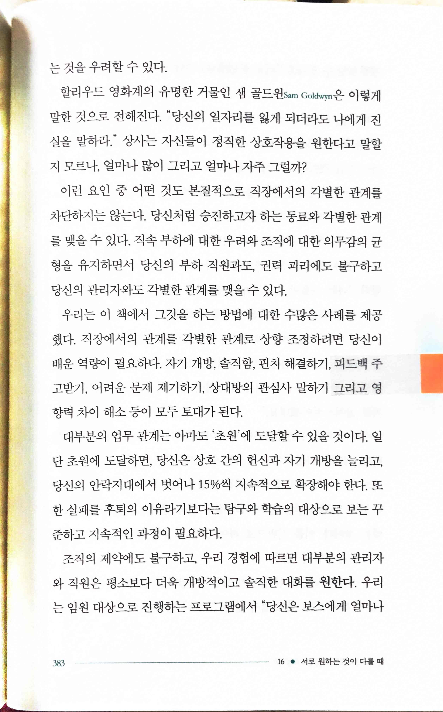

> 직장에서의 관계를 각별한 관계로 상향 조정하려면 당신이배운 역량이 필요하다. 자기 개방, 솔직함, 핀치 해결하기, 피드백 주고받기 어려운 문제 제기하기, 상대방의 관심사 말하기 그리고 영향력 차이 해소 등이 모두 토대가 된다.

### 17장 각별한 사이가 틀어졌다가 회복되다
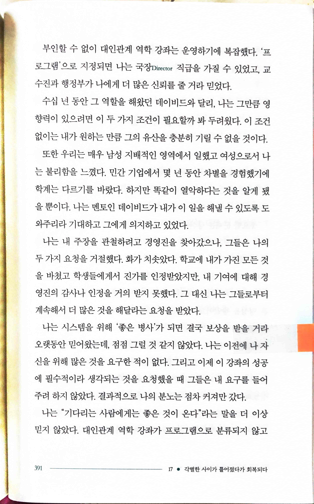

> 시스템을 위해 '좋은 병사'가 되면 결국 보상을 받을 거라 오랫동안 믿어왔는데, 점점 그럴 것 같지 않았다.

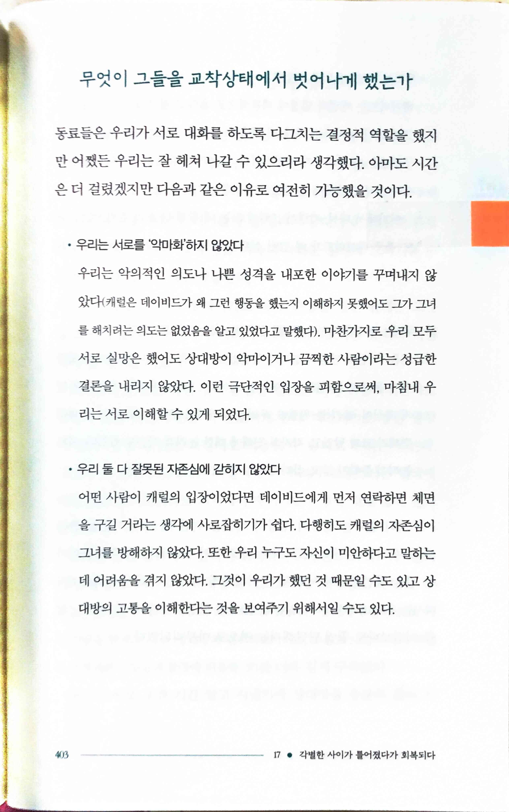 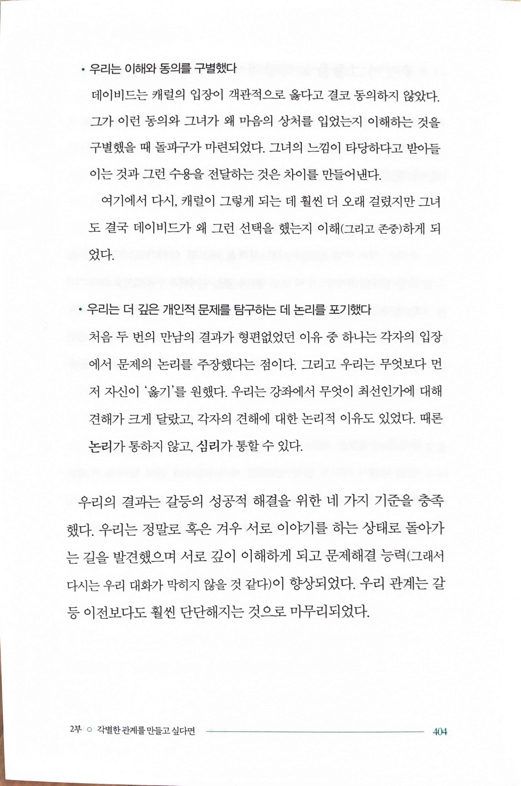

> 무엇이 그들을 교착상태에서 벗어나게 했는가
>
> 서로를 '악마화'하지 않았다
>
> 잘못된 자존심에 갇히지 않았다
>
> 이해와 동의를 구별했다
>
> 더 깊은 개인적 문제를 탐구하는 데 논리를 포기했다.

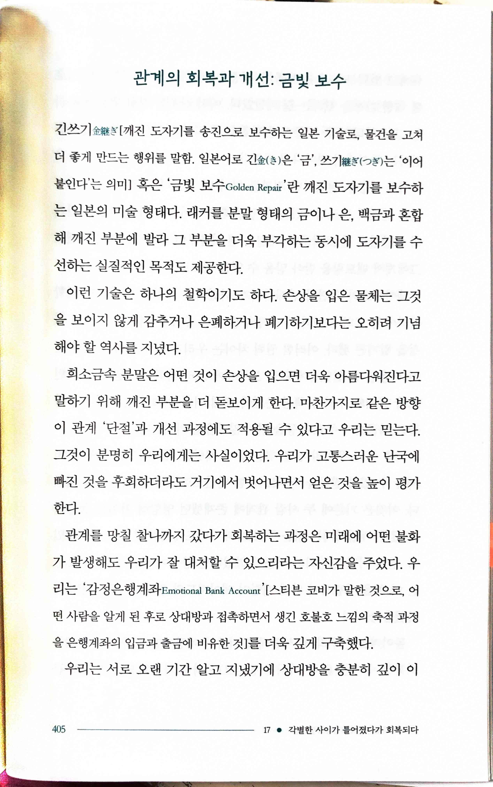

## 후기
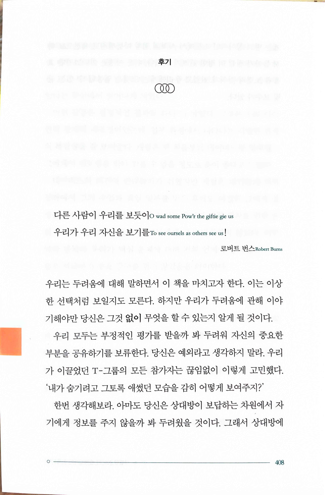

> 우리 모두는 부정적인 평가를 받을까 봐 두려워 자신의 중요한 부분을 공유하기를 보류한다. 당신은 예외라고 생각하지 말라... '내가 숨기려고 그토록 애썼던 모습을 감히 어떻게 보여주지?'

## 부록 1 감정 어휘 더 알아보기
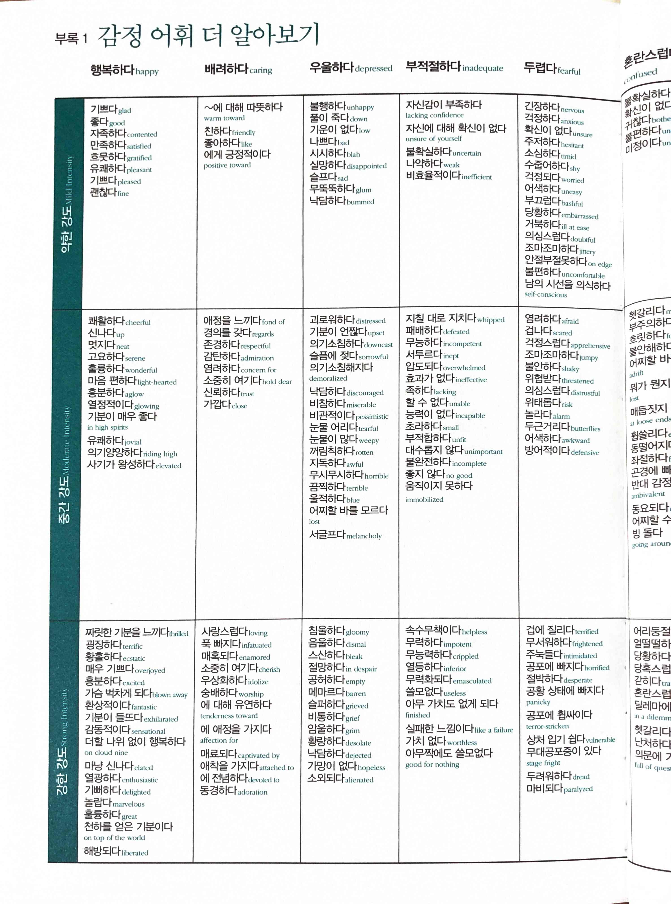 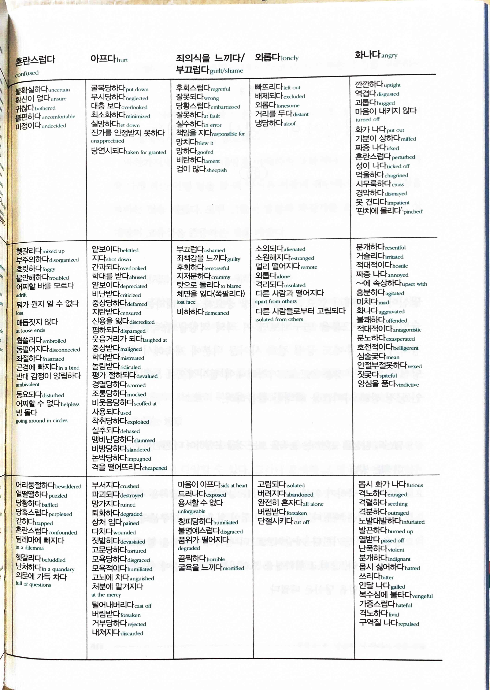

## 부록 2 당신이 이 책에서 배운 것들

> • 당신의 감정을 표현하는 능력을 보는 것을 포함하여 더 완전히 본연의 자신이 되는 방법

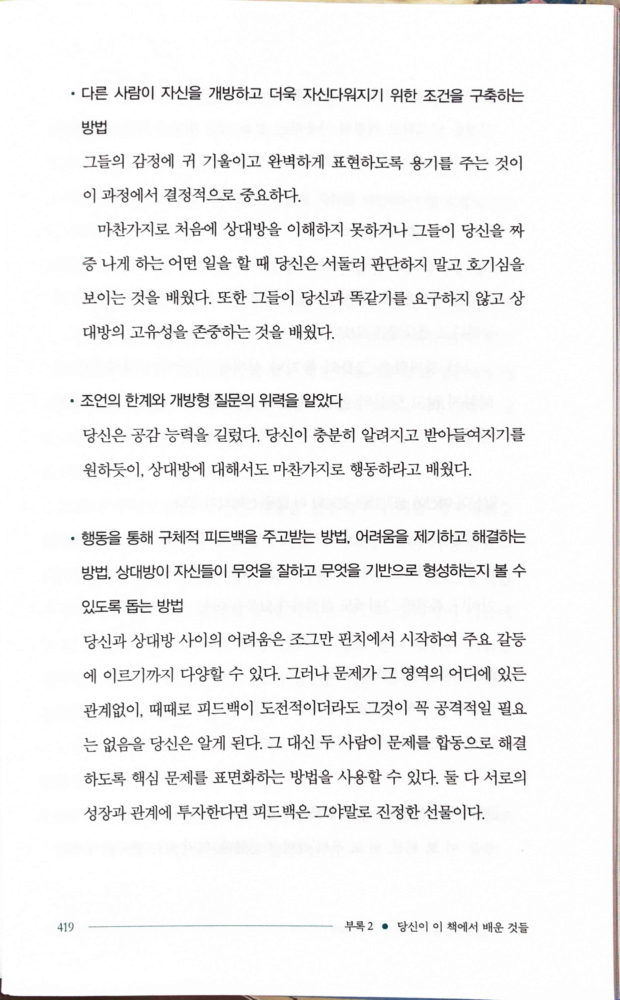

> • 다른 사람이 자신을 개방하고 더욱 자신다워지기 위한 조건을 구축하는 방법
>
> • 조언의 한계와 개방형 질문의 위력을 알았다
>
> • 행동을 통해 구체적 피드백을 주고받는 방법, 어려움을 제기하고 해결하는방법, 상대방이 자신들이 무엇을 잘하고 무엇을 기반으로 형성하는지 볼 수있도록 돕는 방법


> • 감정의 위력과 영역의 가치를 인정했다
>
> • 지지는 여러 형태로 나타난다
>
> • 당신이 예전에 생각했던 것보다 더 많은 선택지가 있다.
>
> • 갈등이 파괴적일 필요는 없다
>
> • 관계는 일직선으로는 거의 발전하지 않는다


> • 당신은 자신이 무엇을 잘하는지, 어떻게 자신을 제한하는지를 포함해 자신에 대해 더 많이 배웠다.


> 상대방과 마주하는 데 편안해지는 것보다는 더욱 유능하게 되는 것에 목표를 두어라. 새로운 행동 경로를 만들려면 연습과 끈기가 필요하다. 그러나 계속 노력하고 당신의 발전을 귀히 여겨라. 일시적 좌절에 휘둘리지 말라.
>
> 책을 마무리하며, 오귀스트 르누아르가 죽어가면서 한 말로 돌아가자 "이제 비로소 그림이 뭔지 이해되기 시작하는데." 우리는 당신이 끝까지 끊임없는 발견이 있는, 지속적으로 발전하는 인생을 살기를 기원한다. 이런 게 인생이어야 한다.