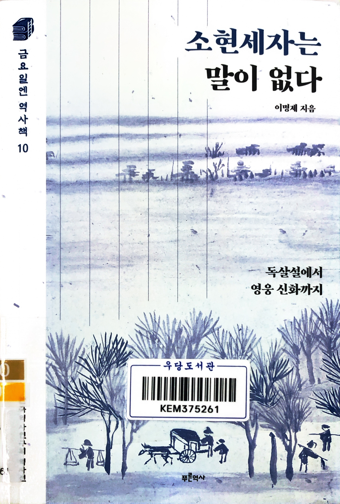
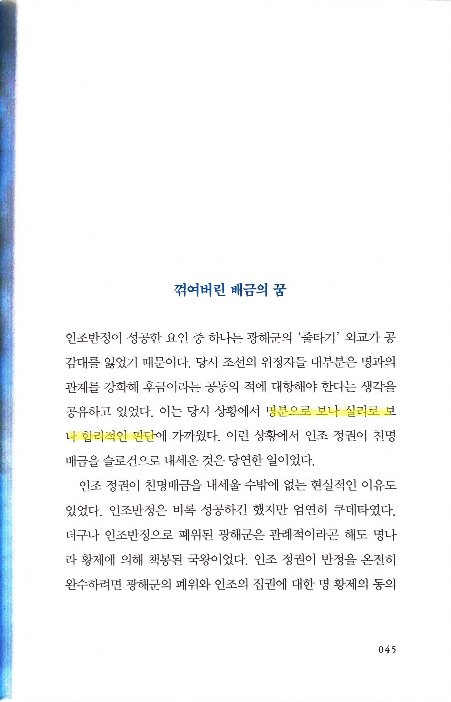
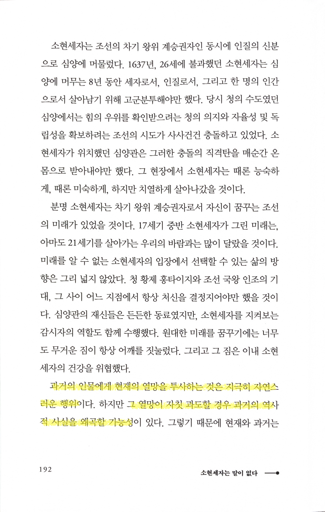

# 소현세자는 말이 없다

Tags: history
Date: September 30, 2024
Score: ★★★☆☆

- ★★★☆☆ September 30, 2024 역사 전문가인 저자가 보기에 소현세자에 대한 일종의 (조선의 근대화를 이끌 수도 있었던 못다 핀 영웅이라는) 신화가 형성되는 건 이야깃거리에 그쳐야지, 이런 인식을 일반적으로 갖는 건 위험할 수 있다는 생각을 한 걸로 보인다. 근거를 통해 차분히 설명하는 저자의 글을 보면 충분히 동의할 수 있고 사료에서는 소현세자 개인에 대해서도 알 수 있는 부분이 매우 적어서 드라마나 영화에서 표현하는 소현세자는 실제와는 매우 거리가 있을 거라는 점을 쉽게 납득할 수 있다. 역사에 조금이라도 관심있는 사람이라면 재미있게, 쉽게 읽을 수 있다.
    - 우당 문911.055-이34ㅅ
- p45 명분으로 보나 실리로 보나 합리적인 판단

    

    - 명분에 있어서는 동의할 수 있다. 그러나 실리적인 면에서도 정말 합리적인 판단이었는지는 잘 모르겠다. 한국전쟁이 끝난지 70년이 되었으나 한국 사회에서는 여전히 반공이 엄청나게 강력한 힘을 갖는 말이고, 친미는 당연하고 거부할 수 없는 가치를 갖는다고 생각하는 사람이 대다수이다. 그런 점을 감안할 때 조선시대의 중화질서에 대한 신봉은 감히 손대기 어려운 가치라는 건 충분히 이해할 수 있는 일이다. 그러나 당시의 상황을 볼 때 과연 실리적으로도 합리적인 선택이었을까? 역사 전문가인 저자에게는 그럴 수도 있겠지만, 그에 대한 설명은 책에서 충분하지 않았다는 생각이다.
- p192 과거의 인물에게 현재의 열망을 투사하는 것은 지극히 자연스러운 행위… 그 열망이 자칫 과도할 경우 과거의 역사적 사실을 왜곡할 가능성

    
