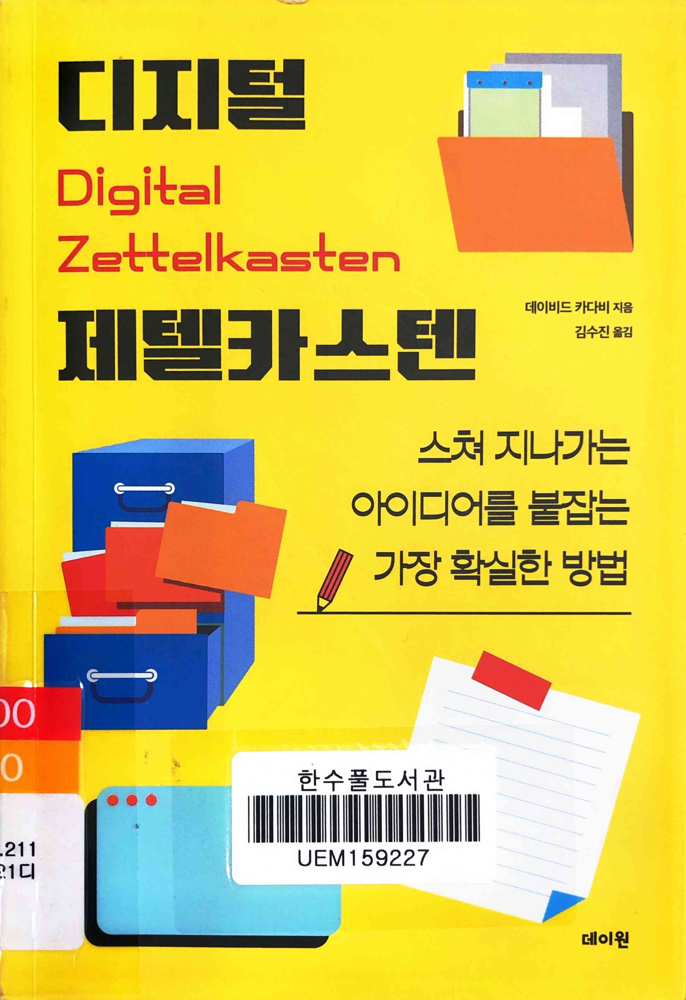
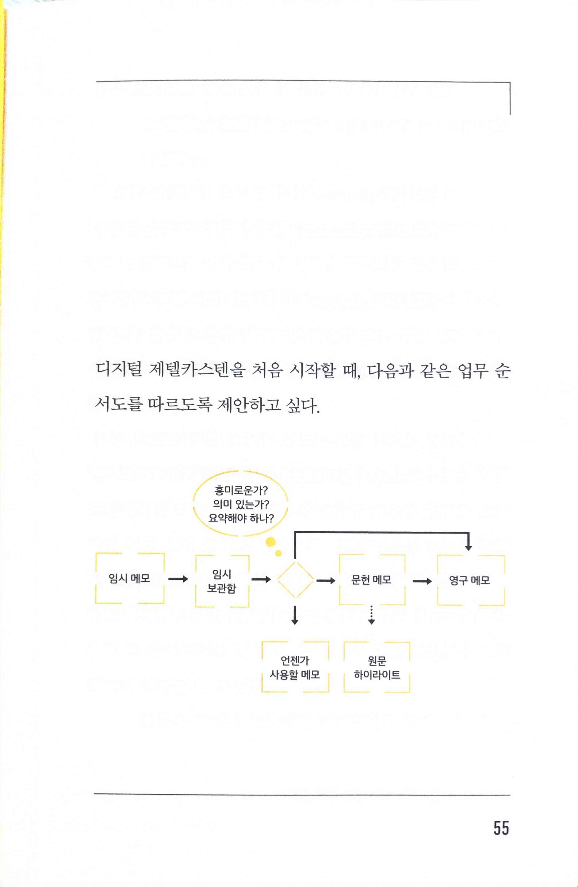
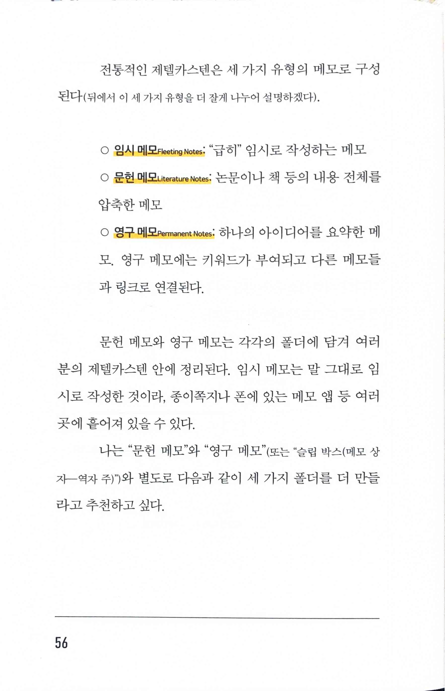
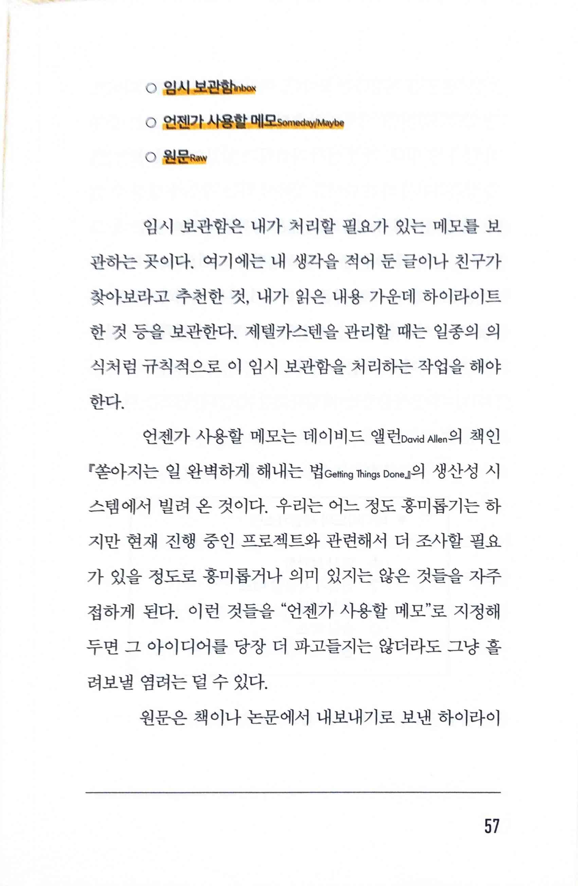
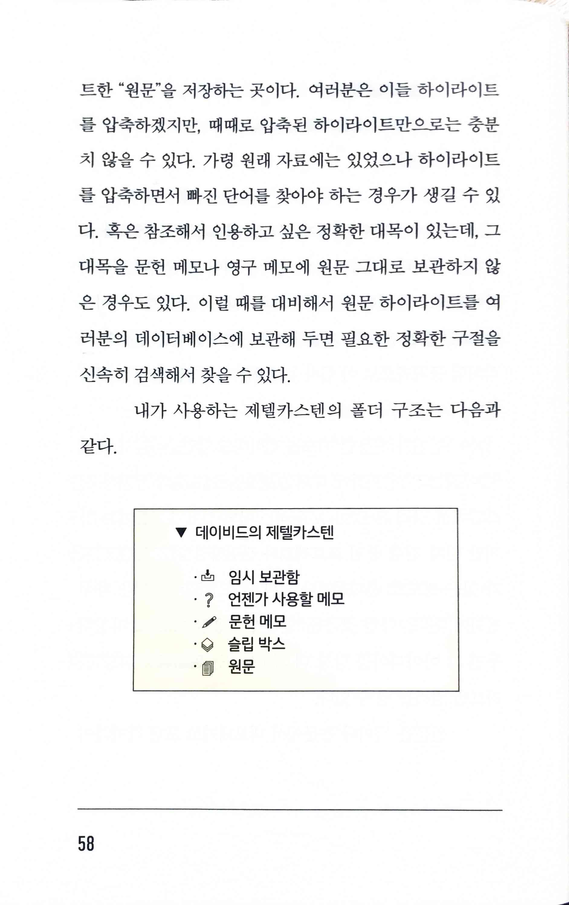
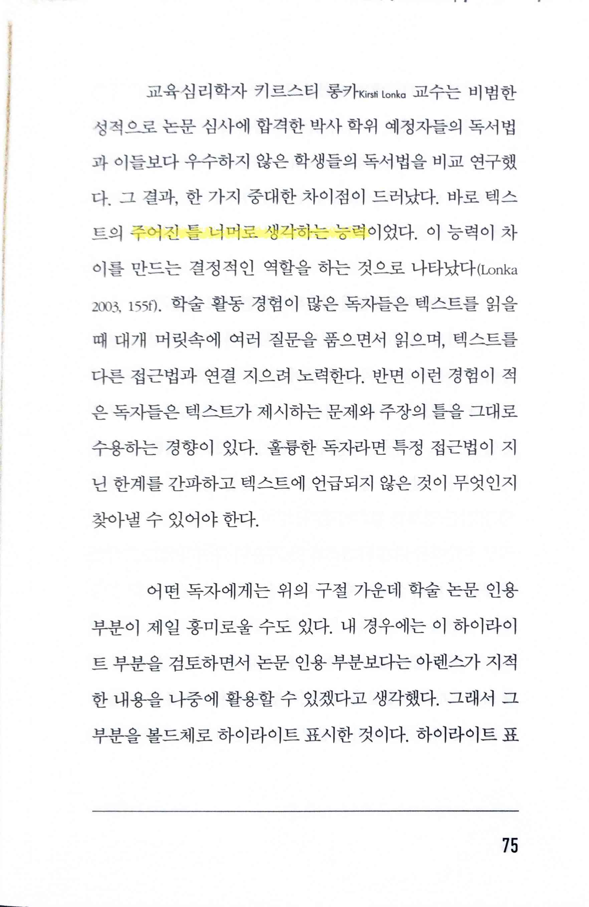

# 디지털 제텔카스텐 Digital Zettelkasten

Tags: productivity
Date: January 19, 2025 → January 20, 2025
Score: ★★★☆☆

- ★★★☆☆ January 19, 2025 → January 20, 2025
    - https://kadavy.net/zettelkasten-software-tools/
    - [제텔카스텐 슬기로운 메모 생활 how to take smart notes](https://www.notion.so/how-to-take-smart-notes-1743f0c2cf658006a676e8a5f5410d9e?pvs=21)
    - [세컨드 브레인](https://www.notion.so/552613aaee17460abf0a0107668e7fa4?pvs=21)
    - [세컨드 브래인 부스트 second brain boost](https://www.notion.so/second-brain-boost-ac74392f9cb7465486bffe537addcc1b?pvs=21)
- pp55~58 임시 메모, 임시 보관함, 언젠가 사용할 메모, 문헌 메모, 원문 하이라이트, 영구 메모
    
    
    
    
    
    
    
    
    
- p75 주어진 틀 너머로 생각하는 능력
    
    
    
    - `In comparison to less successful students unusually successful doctoral students have the ability to think beyond the frames of a given text.`
        - https://api.hypothes.is/a/ZrcN2JqREeyMJwdcoeubMQ
