다이브 딥
=======
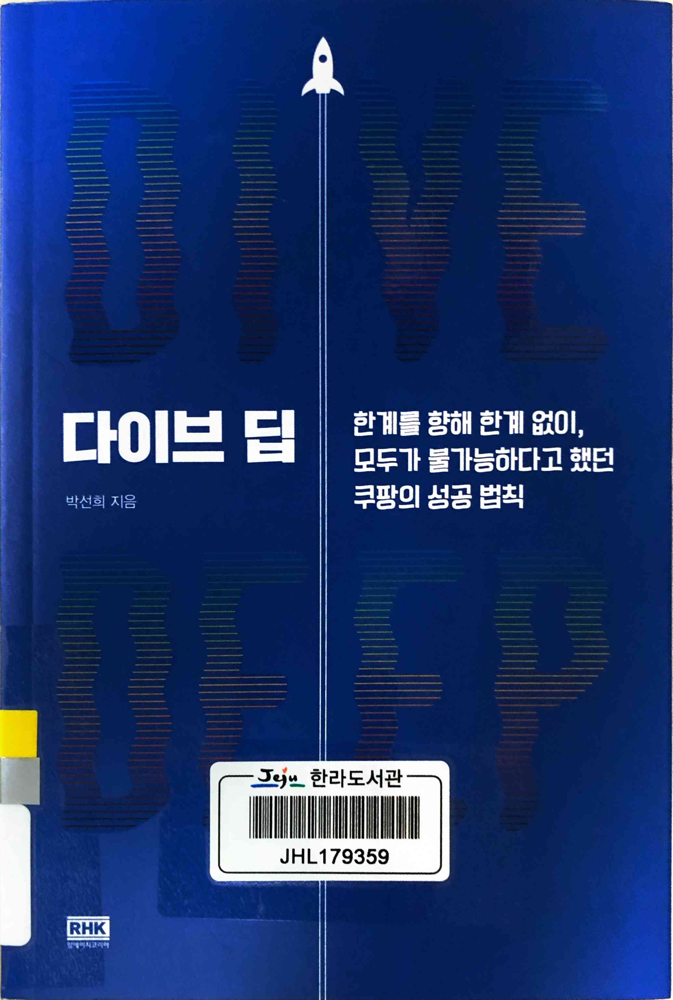

* ★★★☆☆ 2023.05.09 이런 책이 그렇듯 일단 반 정도는 회사의 홍보를 위한 책이라고 간주해야 한다. 쿠팡의 성취는 정말 놀랍지만, 그 이면에 있는 고객들의 불만은 잘 이야기하지 않거나 이야기를 하더라도 결국 잘 해결해서 극복했다는 스토리로 주로 사용하기 때문이다. 그럼에도 불구하고, 다른 어떤 한국 회사도 달성하지 못한 굉장한 성취를 했다는 점은 현실이다. 계획된 적자를 한국에 최초로 도입했다는 부분부터 뉴욕에 IPO를 하고 그 뒤에도 멈추지 않는 쿠팡의 질주를 한 번 되새겨보는 것 만으로도 큰 가치가 있다.

# 1 다이브 누구보다 빠르게
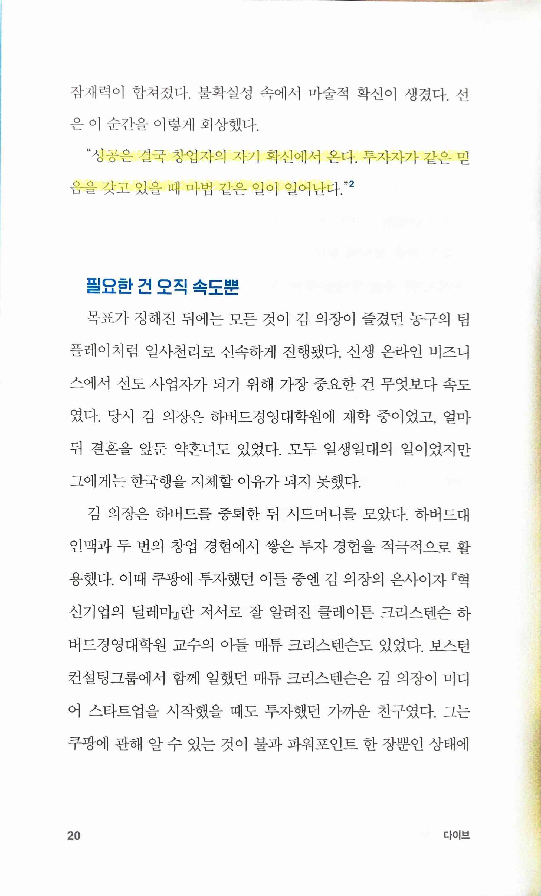

> “성공은 결국 창업자의 자기 확신에서 온다. 투자자가 같은 믿음을 갖고 있을 때 마법 같은 일이 일어난다."

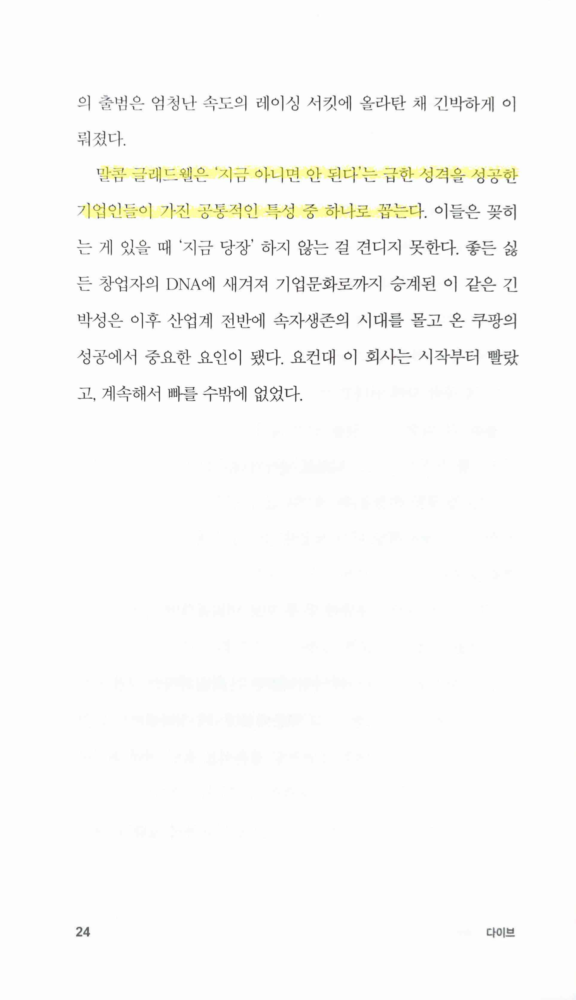

> `말콤 글래드웰`은 '지금 아니면 안 된다'는 급한 성격을 성공한 기업인들이 가진 공통적인 특성 중 하나로 꼽는다.

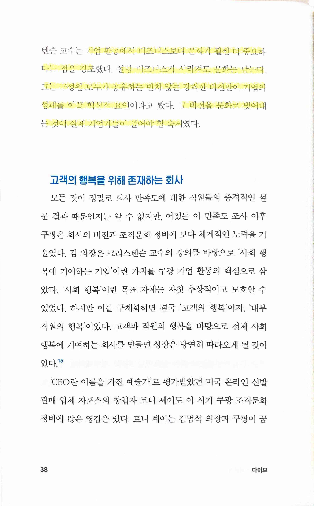

> 크리스텐슨 교수는 기업 활동에서 비즈니스보다 문화가 훨씬 더 중요하다는 점을 강조했다. 설령 비즈니스가 사라져도 문화는 남는다. 그는 구성원 모두가 공유하는 변치 않는 강력한 비전만이 기업의 성패를 이끌 핵심적 요인이라고 봤다. 그 비전을 문화로 빚어내는 것이 실제 기업가들이 풀어야 할 숙제였다.

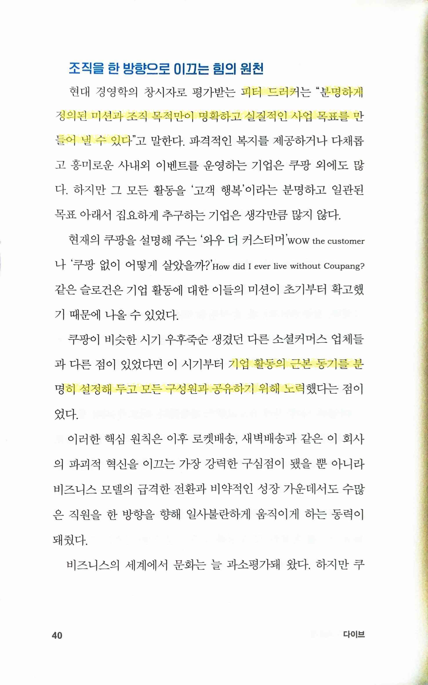

> `피터 드러커` "분명하게 정의된 미션과 조직 목적만이 명확하고 실질적인 사업 목표를 만들어 낼 수 있다"
>
> 쿠팡이... 다른 점이 있었다면 ... 기업 활동의 근본 동기를 분명히 설정해 두고 모든 구성원과 공유하기 위해 노력

# 2 목적지 한 곳만 본다
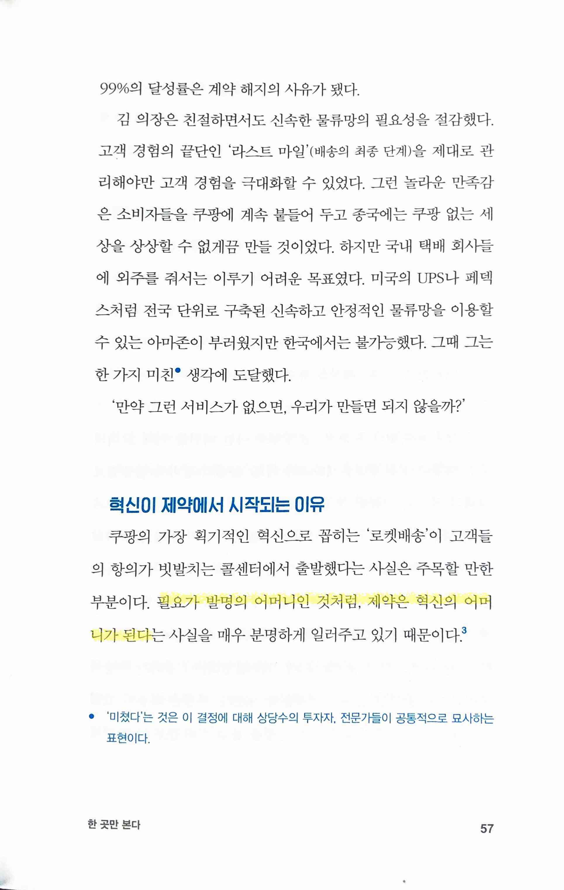

> 필요가 발명의 어머니인 것처럼, 제약은 혁신의 어머니가 된다

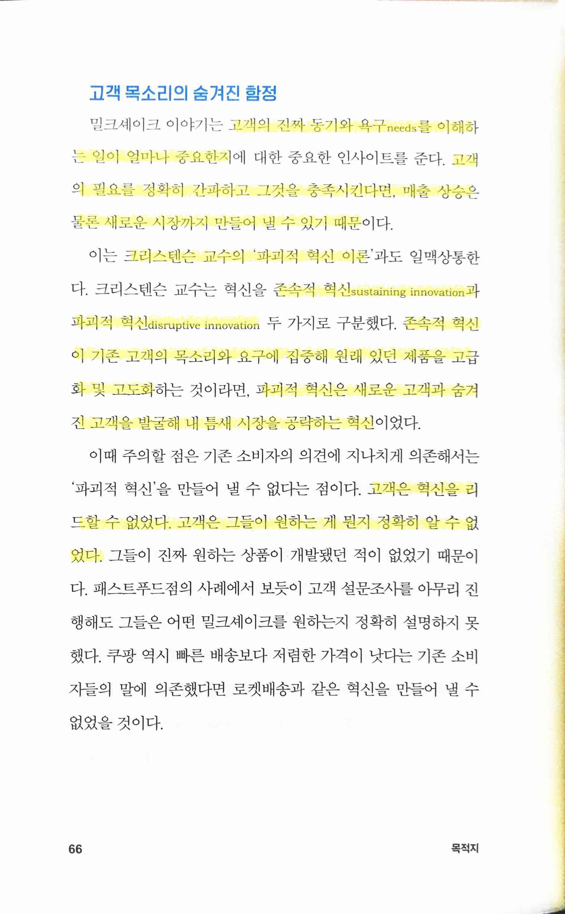

> 고객의 진짜 동기와 욕구 needs를 이해하는 일이 얼마나 중요한지... 고객의 필요를 정확히 간파하고 그것을 충족시킨다면, 매출 상승은 물론 새로운 시장까지 만들어 낼 수 있...다.
>
> 크리스텐슨 교수의 '파괴적 혁신 이론'... `존속적 혁신 sustaining innovation`이 기존 고객의 목소리와 요구에 집중해 원래 있던 제품을 고급화 및 고도화하는 것이라면, `파괴적 혁신 disruptive innovation`은 새로운 고객과 숨겨진 고객을 발굴해 내 틈새 시장을 공략하는 혁신
>
> ... 고객은 혁신을 리드할 수 없었다. 고객은 그들이 원하는 게 뭔지 정확히 알 수 없었다.

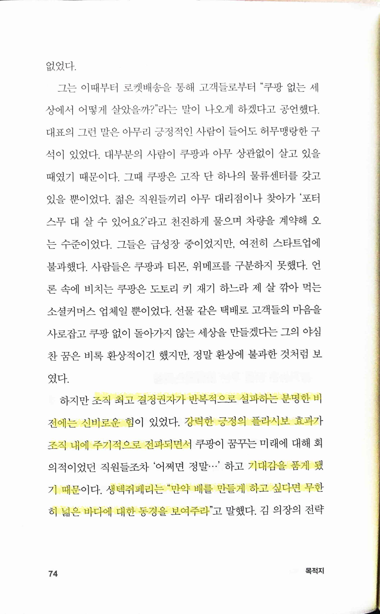

> 조직 최고 결정권자가 반복적으로 설파하는 분명한 비전에는 신비로운 힘이 있었다. 강력한 긍정의 플라시보 효과가 조직 내에 주기적으로 전파되면서 ... 기대감을 품게 됐기 때문이다. `생텍쥐페리`는 "만약 배를 만들게 하고 싶다면 무한히 넓은 바다에 대한 동경을 보여주라"고 말했다.

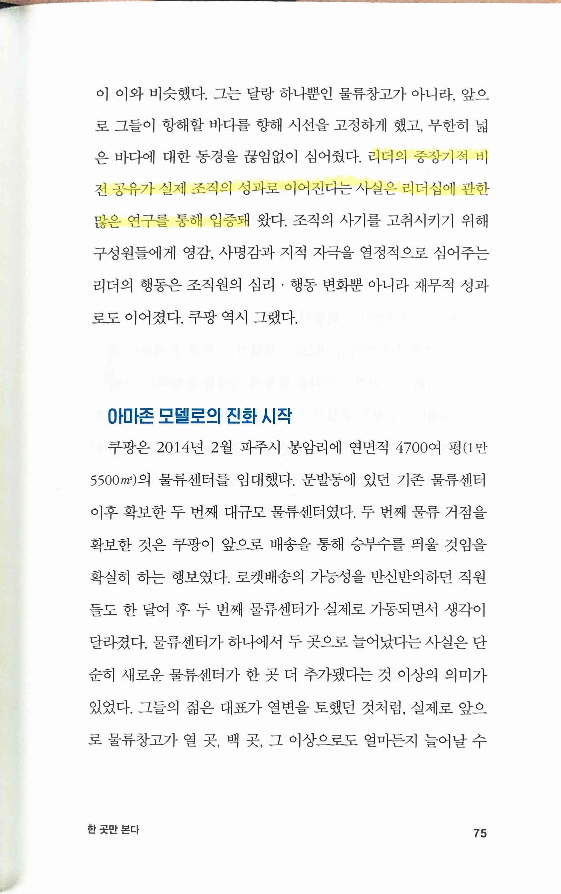

> 리더의 중장기적 비전 공유가 실제 조직의 성과로 이어진다는 사실은 리더십에 관한 많은 연구를 통해 입증

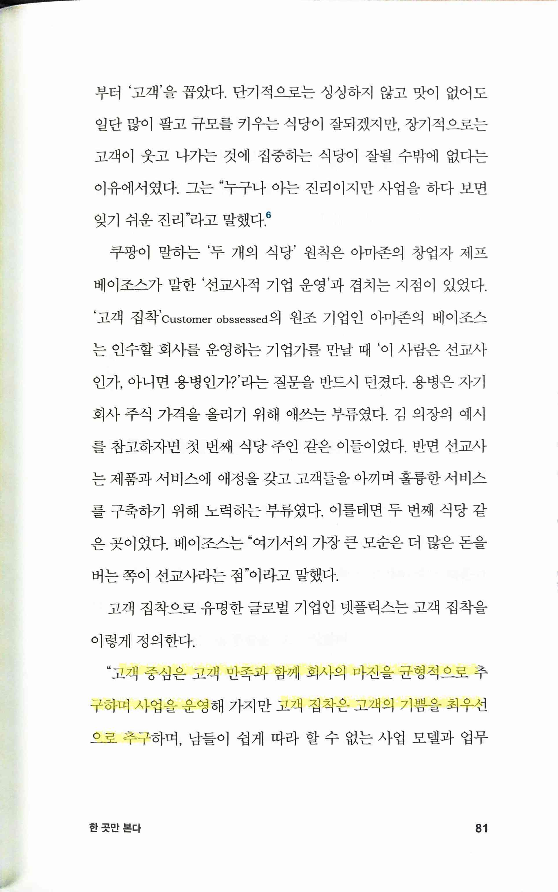

> `고객 중심`은 고객 만족과 함께 회사의 마진을 균형적으로 추구하며 사업을 운영해 가지만 `고객 집착`은 고객의 기쁨을 최우선으로 추구...

# 3 버디 최고와 동행하라
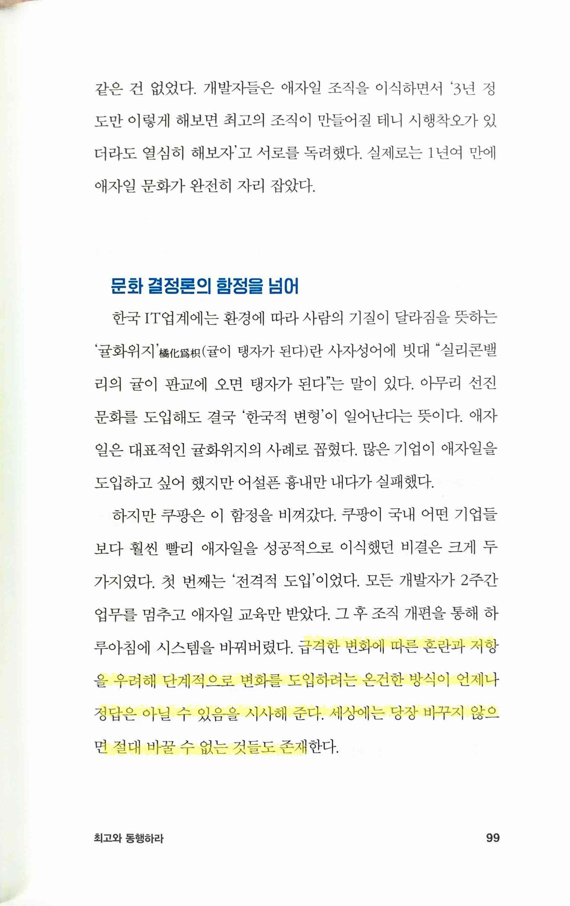

> 급격한 변화에 따른 혼란과 저항을 우려해 단계적으로 변화를 도입하려는 온건한 방식이 언제나 정답은 아닐 수 있음을 시사해 준다. 세상에는 당장 바꾸지 않으면 절대 바꿀 수 없는 것들도 존재한다.

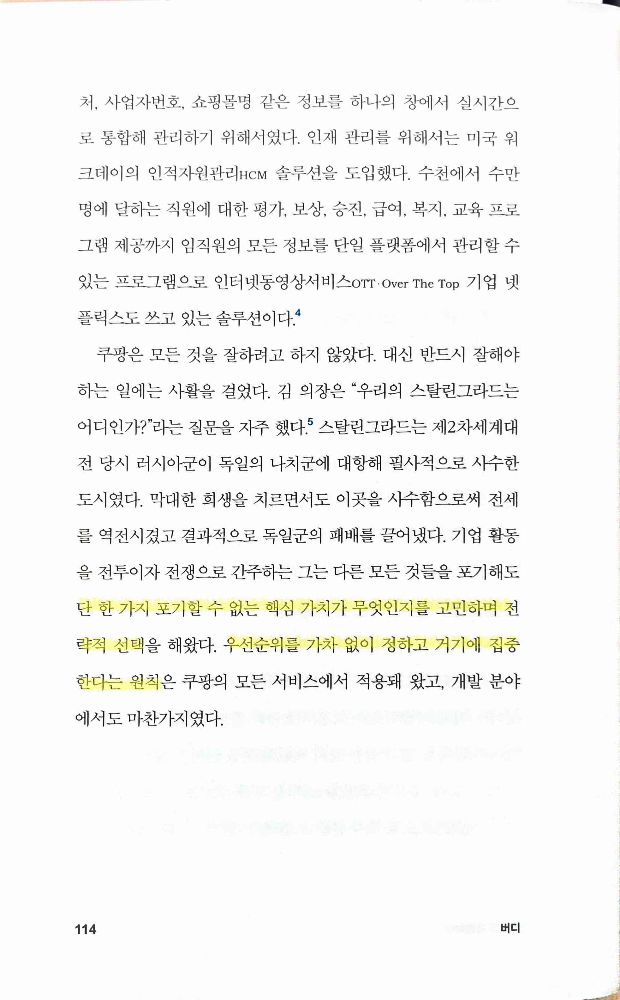

> 단 한 가지 포기할 수 없는 핵심 가치가 무엇인지를 고민하며 전략적 선택. 우선순위를 가차 없이 정하고 거기에 집중

# 4 기술 제약을 혁신으로
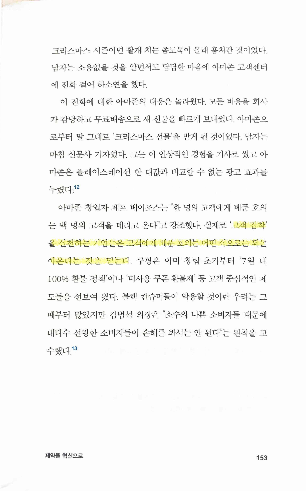

> `고객 집착`을 실천하는 기업들은 고객에게 베푼 호의는 어떤 식으로든 되돌아온다는 것을 믿는다.

# 5 부스터 추진력을 높이는 법
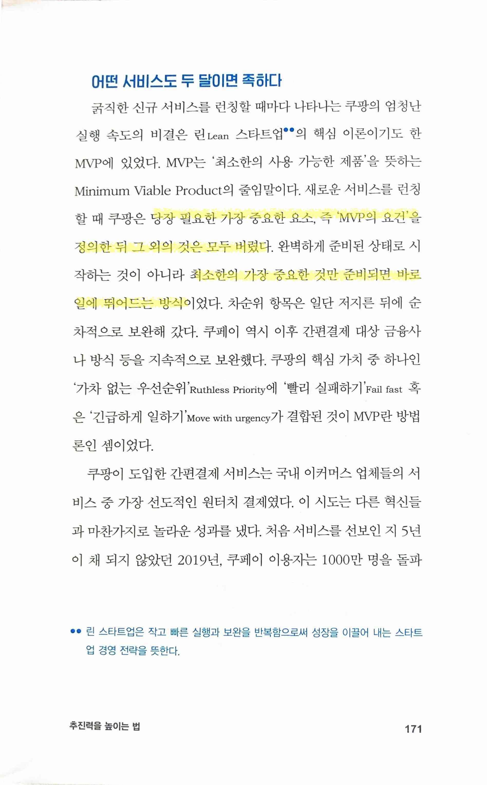

> 당장 필요한 가장 중요한 요소, 즉 `MVP의 요건`을 정의한 뒤 그 외의 것은 모두 버렸다... 최소한의 가장 중요한 것만 준비되면 바로 일에 뛰어드는 방식

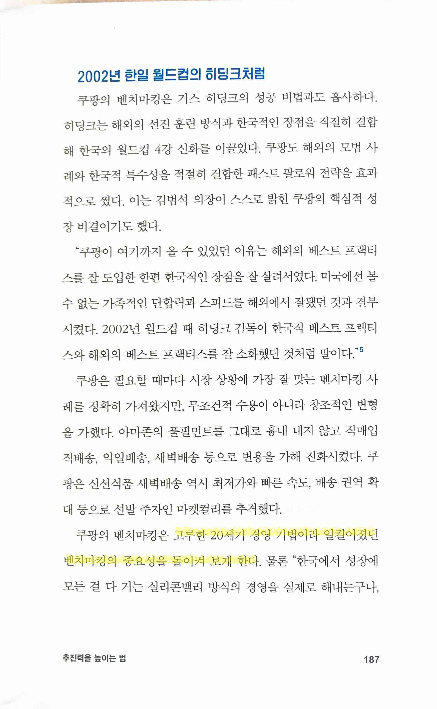

> 고루한 20세기 경영 기법이라 일컬어졌던 벤치마킹의 중요성을 돌이켜 보게 한다.

# 6 탐험 한계 없음
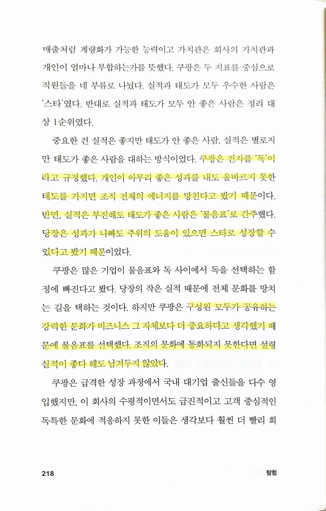

> 쿠팡은 전자를 '독'이라고 규정했다. 개인이 아무리 좋은 성과를 내도 올바르지 못한 태도를 가지면 조직 전체의 에너지를 망친다고 봤기 때문이다. 반면, 실적은 부진해도 태도가 좋은 사람은 '물음표'로 간주했다.당장은 성과가 나빠도 주위의 도움이 있으면 스타로 성장할 수있다고 봤기 때문이었다.
>
> 구성원 `모두가 공유하는 강력한 문화`가 비즈니스 그 자체보다 더 중요하다고 생각했기 때문에 물음표를 선택했다. 조직의 문화에 동화되지 못한다면 설령실적이 좋다 해도 남겨두지 않았다.

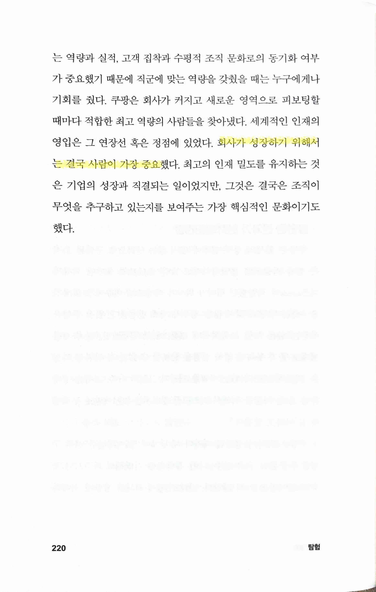

> 회사가 성장하기 위해서는 결국 사람이 가장 중요

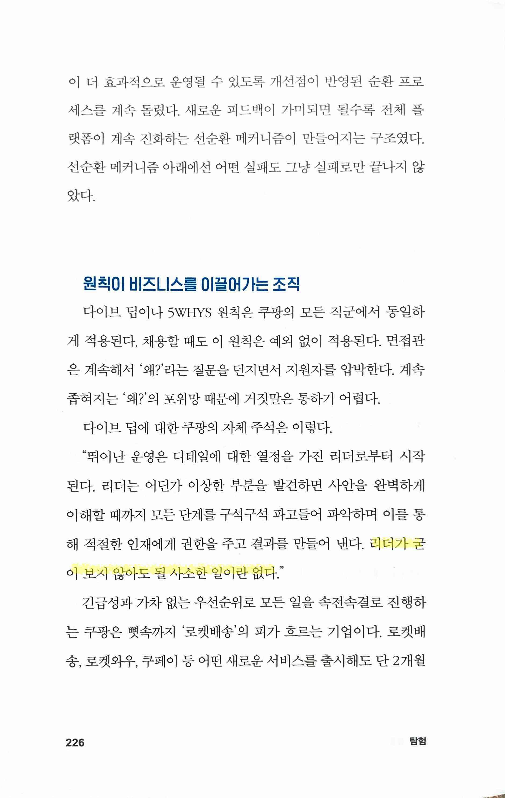

> 리더가 굳이 보지 않아도 될 사소한 일이란 없다.

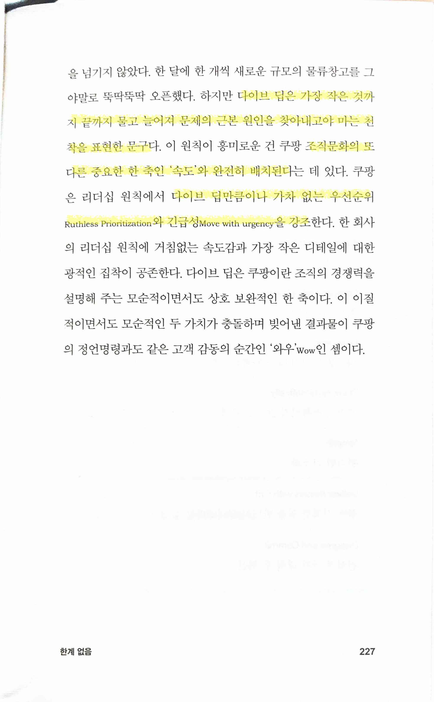

> `다이브 딥`은 가장 작은 것까지 끝까지 물고 늘어져 문제의 근본 원인을 찾아내고야 마는 천착을 표현한 문구... 조직문화의 또 다른 중요한 한 축인 `속도`와 완전히 배치... 다이브 딥만큼이나 `가차 없는 우선순위 Ruthless Prioritization` 와 `긴급성 Move with urgency` 을 강조

# 에필로그 쿠팡의 법칙과 미래

> 자기 주도적인 인재 밀도가 높았다.

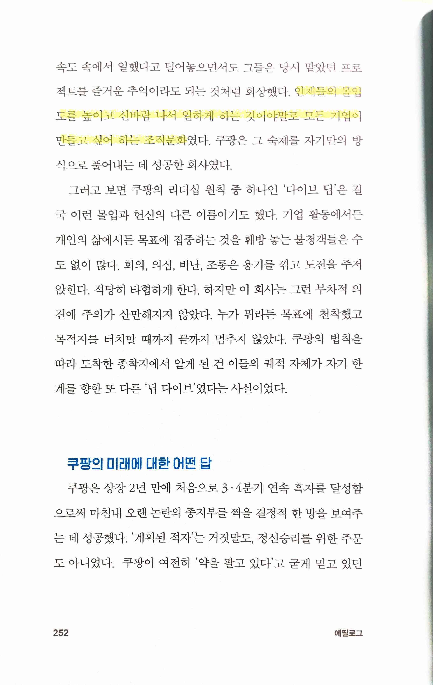

> 인재들의 몰입도를 높이고 신바람 나서 일하게 하는 것이야말로 모든 기업이 만들고 싶어 하는 조직문화