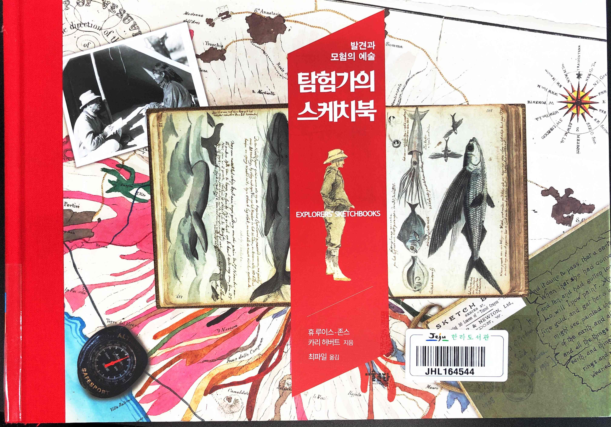
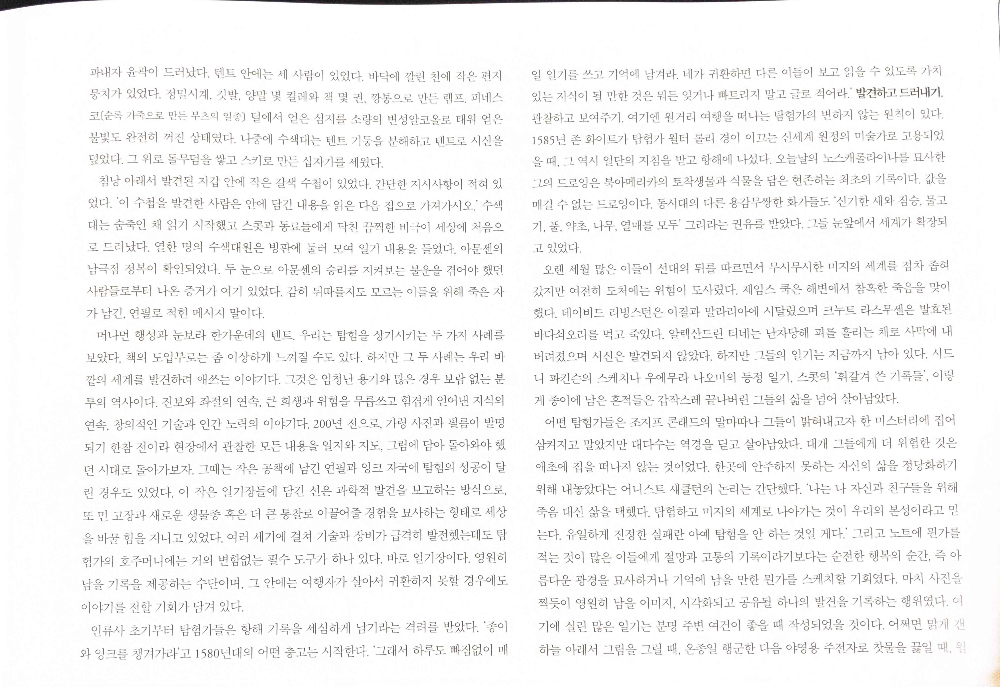
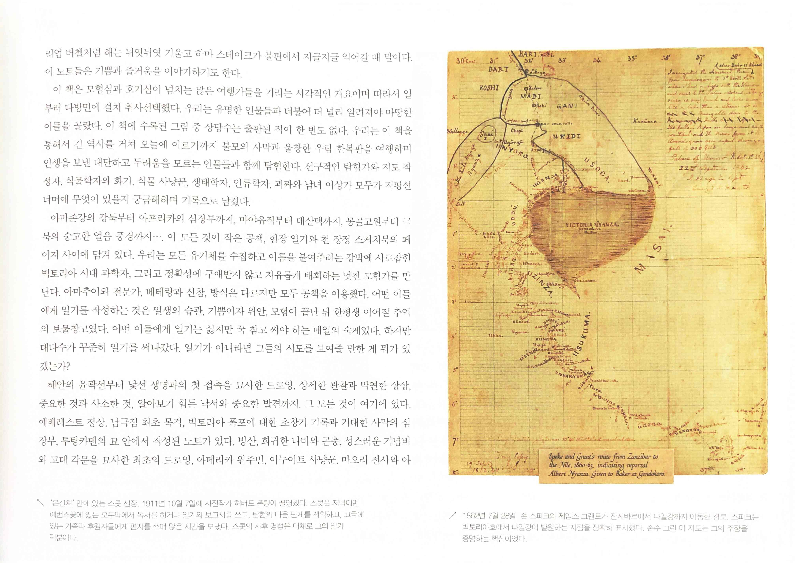
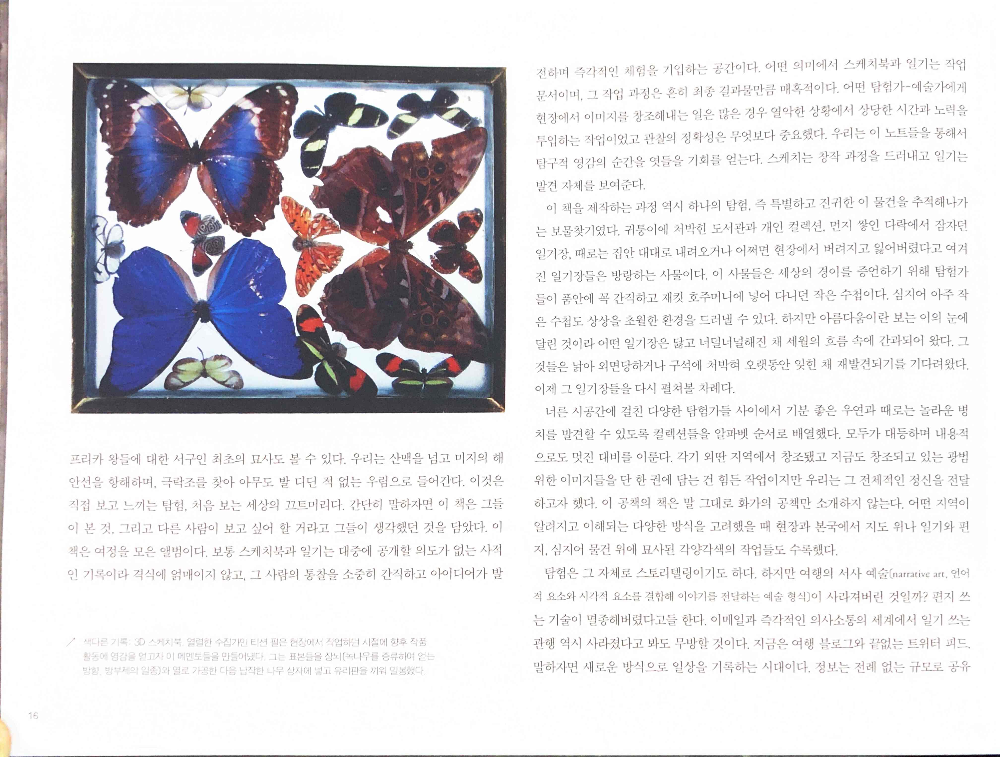
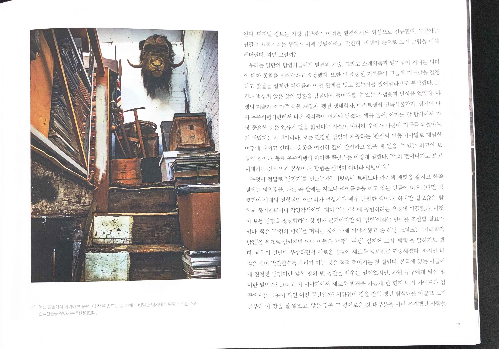
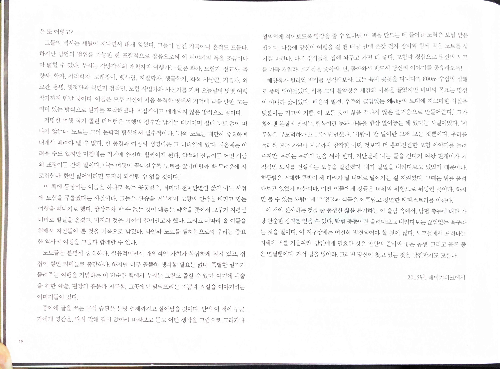

# 탐험가의 스케치북

* `'머나먼 행성과 눈보라 한가운데의 텐트, 우리는 탐험을 상기시키는 두 가지 사례를 보았다. 책의 도입부로는 좀 이상하게 느껴질 수도 있다. 하지만 그 두 사례는 우리 바깔의 세계를 발견하려 애쓰는 이야기다. 그것은 엄청난 용기와 많은 경우 보람 없는 분투의 역사이다. 진보와 좌절의 연속, 큰 희생과 위험을 무릅쓰고 힘겹게 얻어낸 지식의 연속, 창의적인 기술과 인간 노력의 이야기다. 200년 전으로, 가령 사진과 필름이 발명되기 한참 전이라 현장에서 관찰한 모든 내용을 일지와 지도, 그림에 담아 돌아와야 했던 시대로 돌아가보자. 그때는 작은 공책에 남긴 연필과 잉크 자국에 탐험의 성공이 달린 경우도 있었다. 이 작은 일기장들에 담긴 선은 과학적 발견을 보고하는 방식으로 또 먼 고장과 새로운 생물종 혹은 더 큰 통찰로 이끌어줄 경험을 묘사하는 형태로 세상을 바꿀 힘을 지니고 있었다. 여러 세기에 걸쳐 기술과 장비가 급격히 발전했는데도 탐험가의 호주머니에는 거의 변함없는 필수 도구가 하나 있다. 바로 일기장이다. 영원히 남을 기록을 제공하는 수단이며, 그 안에는 여행자가 살아서 귀환하지 못할 경우에도 이야기를 전할 기회가 담겨 있다.`
* `인류사 초기부터 탐험가들은 항해 기록을 세심하게 남기라는 격려를 받았다. '종이와 잉크를 챙겨가라고 1580년대의 어떤 충고는 시작한다. '그래서 하루도 빠짐없이 매일 일기를 쓰고 기억에 남겨라. 네가 귀환하면 다른 이들이 보고 읽을 수 있도록 가치있는 지식이 될 만한 것은 뭐든 잊거나 빠트리지 말고 글로 적어라.' 발견하고 드러내기 관찰하고 보여주기. 여기엔 원거리 여행을 떠나는 탐험가의 변하지 않는 원칙이 있다.`
  * 발견하고 드러내기 관찰하고 보여주기
* `이렇게 종이에 남은 흔적들은 갑작스레 끝나버린 그들의 삶을 넘어 살아남았다.`
* `노트에 뭔가를 적는 것이 많은 이들에게 절망과 고통의 기록이라기보다는 순전한 행복의 순간, 즉 아름다운 광경을 묘사하거나 기억에 남을 만한 뭔가를 스케치할 기회였다. 마치 사진을 찍듯이 영원히 남을 이미지, 시각화되고 공유될 하나의 발견을 기록하는 행위였다.`

 

* `탐험은 그 자체로 스토리텔링이기도 하다. 하지만 여행의 서사 예술 (narrative art. 언어적 요소와 시각적 요소를 결합해 이야기를 전달하는 예술 형식)이 사라져버린 것일까? 편지 쓰는 기술이 멸종해버렸다고들 한다. 이메일과 즉각적인 의사소통의 세계에서 일기 쓰는관행 역시 사라졌다고 봐도 무방할 것이다. 지금은 여행 블로그와 끝없는 트위터 피드말하자면 새로운 방식으로 일상을 기록하는 시대이다. 정보는 전례 없는 규모로 공유된다. 디지털 정보는 가장 접근하기 어려운 환경에서도 위성으로 전송된다. 누군가는 연필로 끄적거리는 행위가 이제 옛일이라고 말한다. 픽셀이 손으로 그린 그림을 대체해버렸다. 과연 그럴까?`
* `우주비행사 마이클 콜린스는 이렇게 말했다. 멀리 뻗어나가고 보고 이해하는 것은 인간 본성이다. 탐험은 선택이 아니라 명령이다."`

* `이 책에 등장하는 이들을 하나로 묶는 공통점은 저마다 천차만별인 삶의 어느 시점에 모험을 무릅썼다는 사실이다. 그들은 관습을 거부하며 고향의 안락을 버리고 힘든 여행을 떠나기로 했다. 상상조차 할 수 없는 것이 내놓는 약속을 좇아서 모두가 지평선 너머로 발길을 옮겼고, 미지의 것을 기꺼이 끌어안고자 했다. 그리고 뒤따라 올 이들을 위해서 자신들이 본 것을 기록으로 남겼다. 타인의 노트를 펼쳐봄으로써 우리는 중요한 역사적 여정을 그들과 함께할 수 있다.`
* `노트들은 분명히 중요하다. 실용적이면서 개인적인 가치가 복잡하게 담겨 있고, 겹겹이 쌓인 의미들로 충만하다. 하지만 너무 골똘히 생각할 필요는 없다. 특별한 일기가 들려주는 여행을 기념하는 이 단순한 책에서 우리는 그림도 즐길 수 있다. 여기에 예술을 위한 예술, 현장의 흥분과 지루함, 그곳에서 맞닥뜨리는 기쁨과 좌절을 이야기하는 이미지들이 있다.`
* `종이에 글을 쓰는 구식 습관은 분명 언제까지고 살아남을 것이다. 만약 이 책이 누군가에게 영감을 다시 말해 잠시 앉아서 바라보고 듣고 어떤 생각을 그림으로 그리거나 짤막하게 적어보도록 영감을 줄 수 있다면 이 책을 만드는 데 들어간 노력은 보답 받은 셈이다. 다음에 당신이 여행을 갈 땐 배낭 안에 온갖 전자 장비와 함께 작은 노트를 기길 바란다. 다른 장비들을 집에 놔두고 가면 더 좋다. 모험과 경험으로 당신의 노트를 가득 채워라. 호기심을 좇아라. 단, 돌아와서 반드시 당신의 이야기를 공유하도록!`
* `해양학자 윌리엄 비비를 생각해보라. 그는 육지 곳곳을 다니다가 800m 수심의 심해로 풍덩 뛰어들었다. 비록 그의 활약상은 세간의 이목을 끌었지만 비비의 목표는 명성이 아니라 삶이었다. '배움과 발견, 우주의 끊임없는 왜why 의 토대에 자그마한 사실을 덧붙이는 지고의 기쁨, 이 모든 것이 삶을 끝나지 않은 즐거움으로 만들어준다. 그가 찾아낸 본질적 진리는 행복이란 눈과 마음을 항상 열어놓는 데 있다는 사실이었다.`