빠르게 실패하기 FAIL FAST, FAIL OFTEN
=====================================
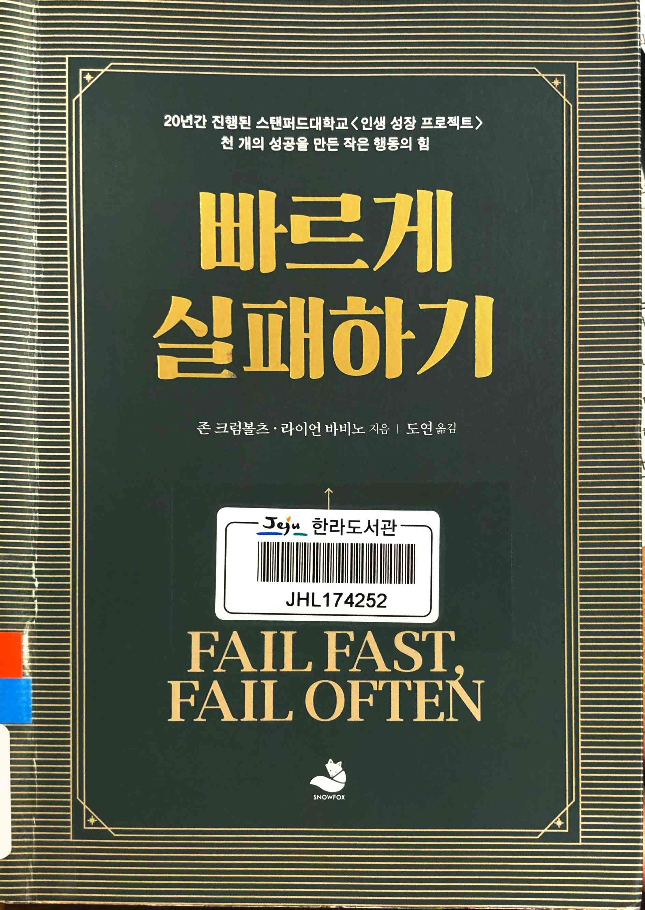

* ★★★★☆ 2023.04.11~12
* '실행'을 강조하고 그걸 할 수 있도록 여러가지 심리학적인 걸림돌을 제거해주는 책. 분야가 전혀 다르지만 agile 원칙과도 바로 연결지어 생각해볼 수 있다. 작게, 자주 실패해서 결국 성공의 길로 연결하는 agile 방법과 심리학의 측면이 이렇게 긴밀하게 연결된다는 점이 놀라우면서도 또 한편 당연하다는 생각도 든다. 또 한 가지는 같이 하는 사람들의 중요성. 혼자서 일을 하는 게 아니니 그만큼 같이 일하는 사람들이 개인에 주는 영향이 크기 때문에 동료, 특히 생각을 공유하는 사람들의 가치가 매우 크다는 점 역시 협력을 중시하는 agile의 가치와 이어진다는 생각이 든다.

# Chapter 1 지금 바로 즐거움을 느낄 수있는 일인가?

# Chapter 2 가능한 더 빨리 시작하고 최대한 더 많이 실패하라
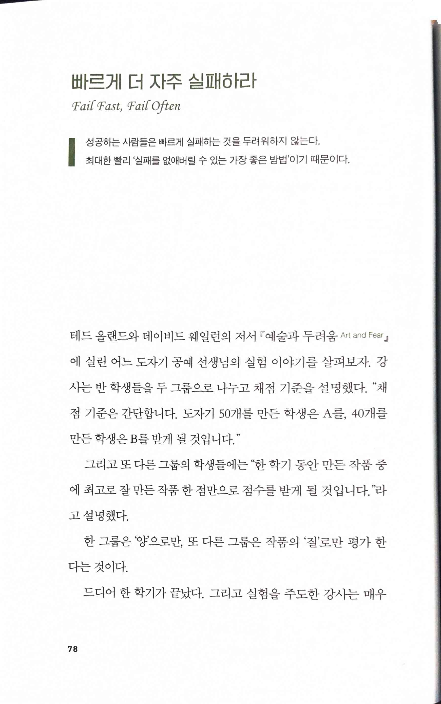 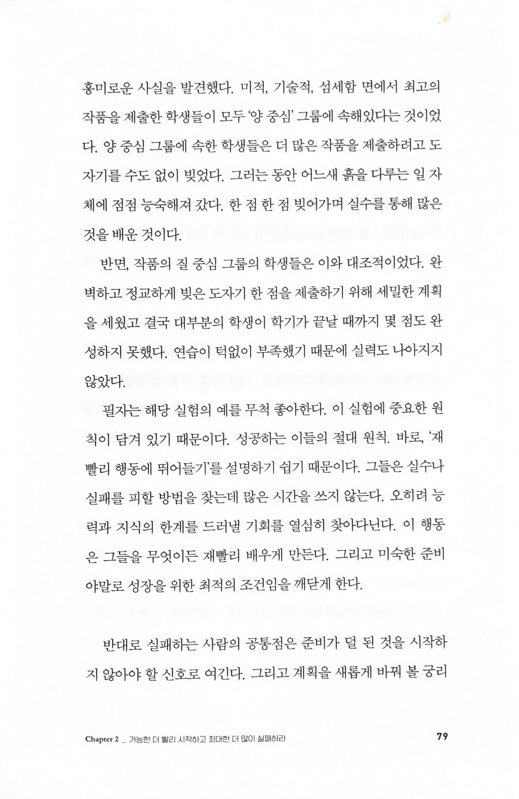

> 테드 올랜드와 데이비드 웨일런의 저서 '예술과 두려움 Art and Fear'에 실린 어느 도자기 공예 선생님의 실험 이야기

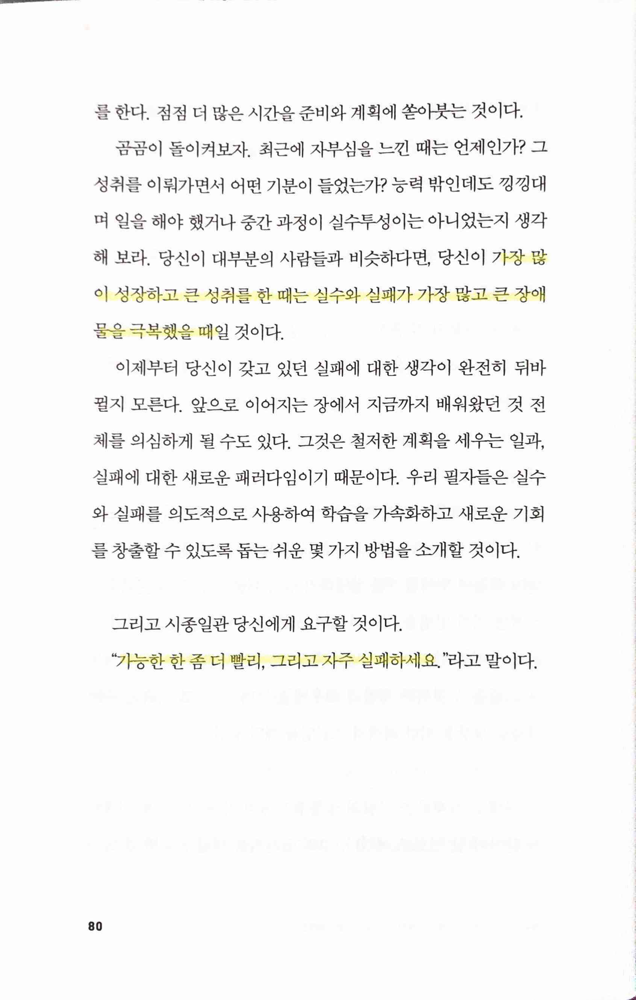

> 가장 많이 성장하고 큰 성취를 한 때는 실수와 실패가 가장 많고 큰 장애물을 극복했을 때
>
> "가능한 한 좀 더 빨리, 그리고 자주 실패하세요."

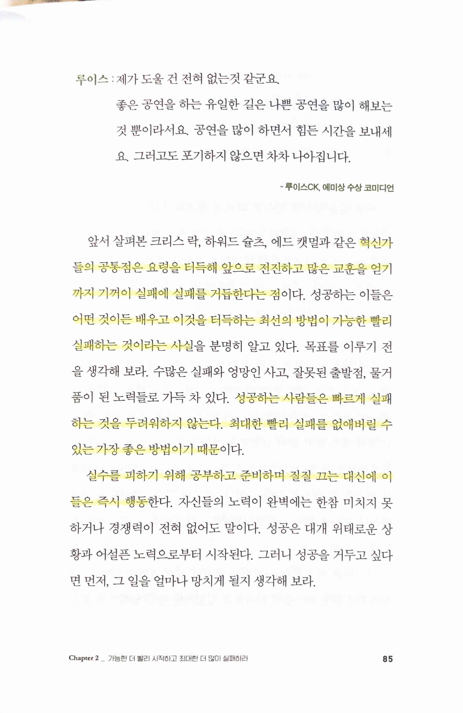

> 혁신가들의 공통점은 요령을 터득해 앞으로 전진하고 많은 교훈을 얻기까지 기꺼이 실패에 실패를 거듭한다는 점... 어떤 것이든 배우고 이것을 터득하는 최선의 방법이 가능한 빨리 실패하는 것이라는 사실... 성공하는 사람들은 빠르게 실패하는 것을 두려워하지 않는다. 최대한 빨리 실패를 없애버릴 수있는 가장 좋은 방법이기 때문.
>
> 실수를 피하기 위해 공부하고 준비하며 질질 끄는 대신에 이들은 즉시 행동한다.

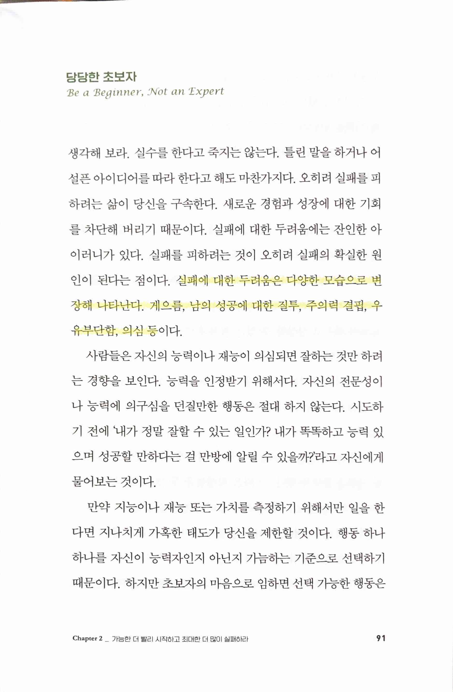

> 실패에 대한 두려움에는 잔인한 아이러니가 있다. 실패를 피하려는 것이 오히려 실패의 확실한 원인이 된다는 점이다. 실패에 대한 두려움은 다양한 모습으로 변장해 나타난다. 게으름, 남의 성공에 대한 질투, 주의력 결핍, 우유부단함, 의심 등이다.

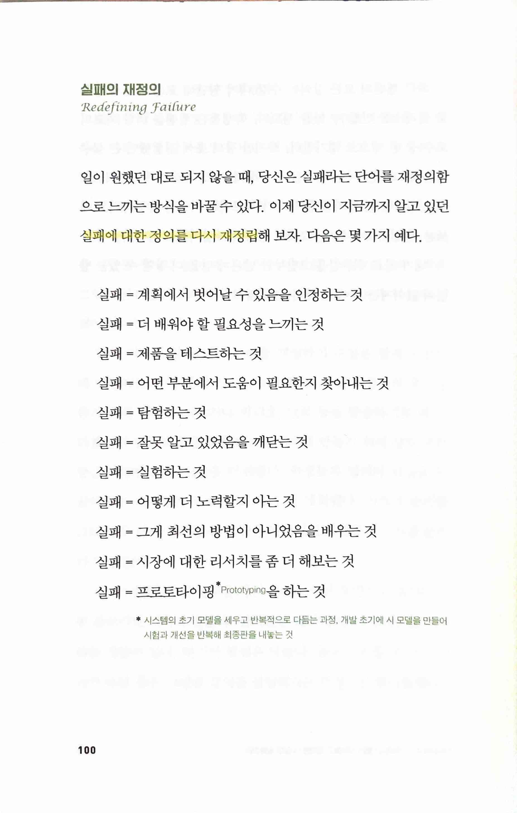

> 실패의 재정의 Redefining Failure

# Chapter 3 성공의 본질은 무엇인가?
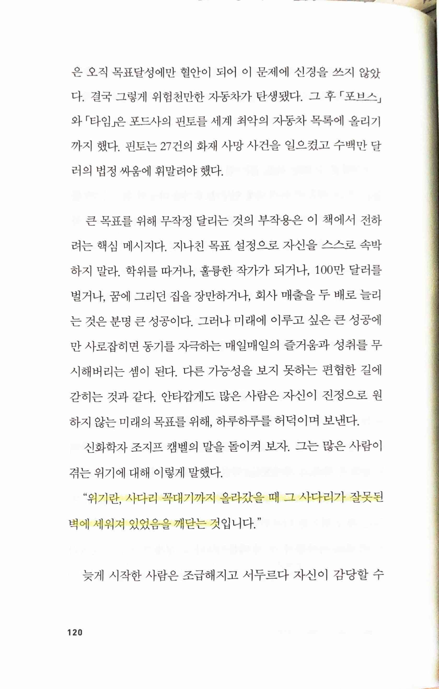

> 신화학자 조지프 캠벨 "위기란, 사다리 꼭대기까지 올라갔을 때 그 사다리가 잘못된 벽에 세워져 있었음을 깨닫는 것입니다."
* 생산을 완료하고 판매에 나선 product에서 결함이 발생해 대규모 리콜이 발생하는 경우를 설명하는 적절한 말. 가장 최근의 사례로는 폭스바겐을 들면 알맞을 거 같다.

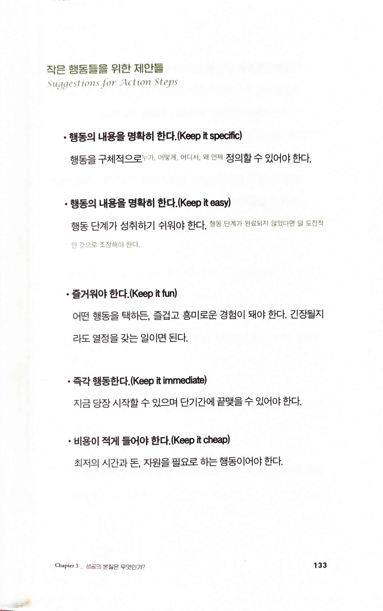 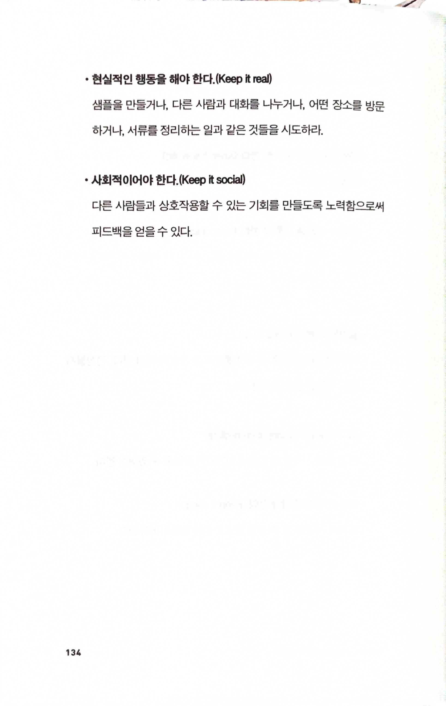

> 작은 행동들을 위한 제안들 Suggestions for Action Steps
>
> • 행동의 내용을 명확히 한다.(Keep it specific) 행동을 구체적으로(누가 어떻게 어디서, 왜 언제)정의할 수 있어야 한다.
>
> • 행동의 내용을 명확히 한다.(Keep it easy) 행동 단계가 성취하기 쉬워야 한다. 행동 단계가 완료되지 않았다면 덜 도전적인 것으로 조정해야 한다.
>
> • 즐거워야 한다.(Keep it fun) 어떤 행동을 택하든, 즐겁고 흥미로운 경험이 돼야 한다. 긴장될지라도 열정을 갖는 일이면 된다.
>
> • 즉각 행동한다. (Keep it immediate) 지금 당장 시작할 수 있으며 단기간에 끝맺을 수 있어야 한다.
>
> • 비용이 적게 들어야 한다.(Keep it cheap) 최저의 시간과 돈, 자원을 필요로 하는 행동이어야 한다.
>
> • 현실적인 행동을 해야 한다. (Keep it real) 샘플을 만들거나, 다른 사람과 대화를 나누거나, 어떤 장소를 방문하거나, 서류를 정리하는 일과 같은 것들을 시도하라.
>
> • 사회적이어야 한다.(Keep it social) 다른 사람들과 상호작용할 수 있는 기회를 만들도록 노력함으로써 피드백을 얻을 수 있다.

# Chapter 4 기회의 순간마다 나타나는 저항의 본질에 맞서라
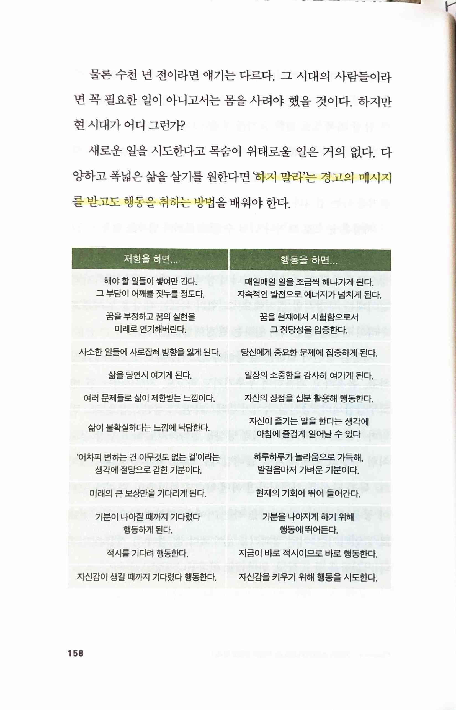

> '하지 말라'는 경고의 메시지를 받고도 행동을 취하는 방법을 배워야 한다.

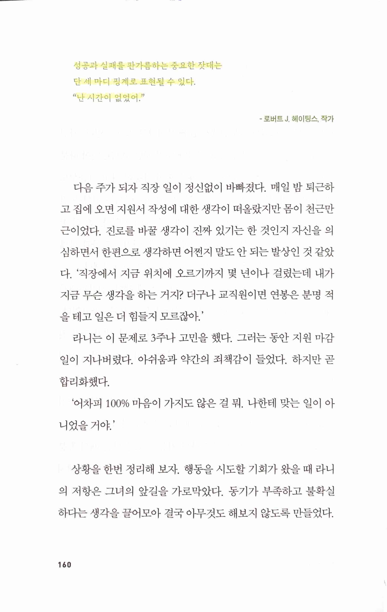

> 성공과 실패를 판가름하는 중요한 잣대는 단 세 마디 핑계로 표현될 수 있다. "난 시간이 없었어." - 로버트 J. 헤이팅스 작가

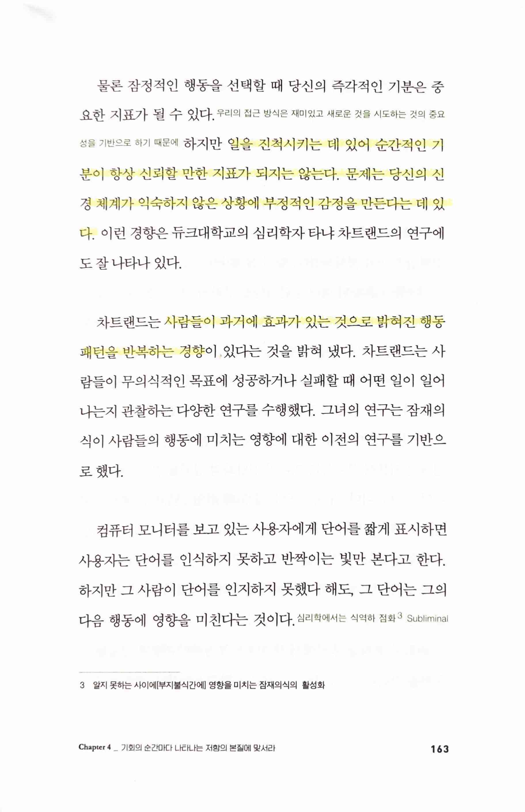

> 일을 진척시키는 데 있어 순간적인 기분이 항상 신뢰할 만한 지표가 되지는 않는다. 문제는 당신의 신경 체계가 익숙하지 않은 상황에 부정적인 감정을 만든다는 데 있다.
>
> 사람들 과거에 효과가 있는 것으로 밝혀진 행동패턴을 반복하는 경향이 있다

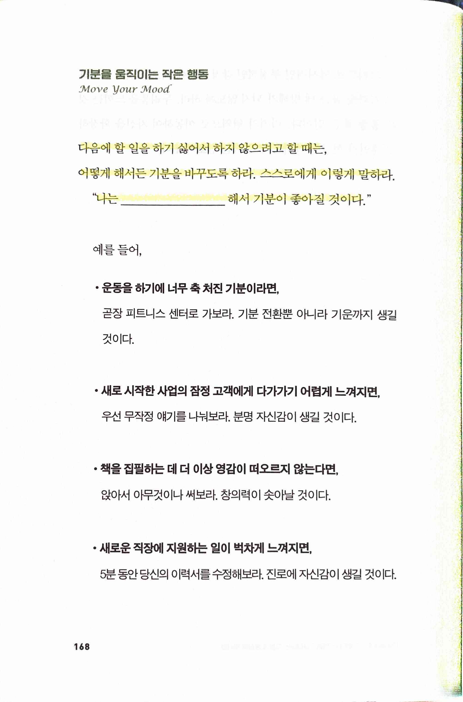 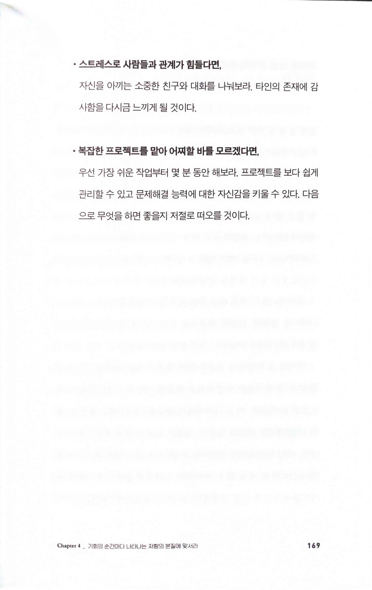

> 기분을 움직이는 작은 행동 Move Your Mood
>
> 다음에 할 일을 하기 싫어서 하지 않으려고 할 때는, 어떻게 해서든 기분을 바꾸도록 하라. 스스로에게 이렇게 말하라. "나는 ~해서 기분이 좋아질 것이다."

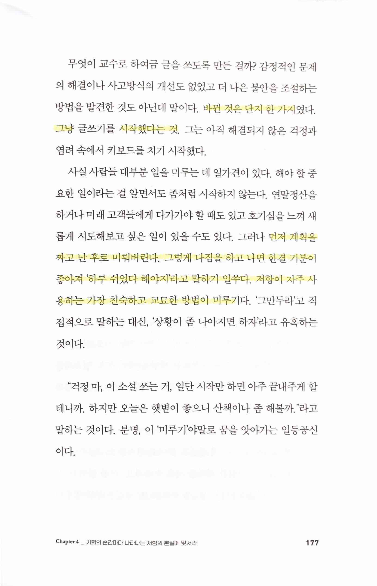

> 바뀐 것은 단지 한 가지. 그냥 시작했다는 것
* 생각하면 할수록 Nike의 'Just do it'은 역사에 남을 문구일 듯 싶다
> 사람들 대부분 일을 미루는 데 일가견이 있다... 먼저 계획을 짜고 난 후로 미뤄버린다. 그렇게 다짐을 하고 나면 한결 기분이 좋아져 '하루 쉬었다 해야지'라고 말하기 일쑤다. 저항이 자주 사용하는 가장 친숙하고 교묘한 방법이 미루기다.

# Chapter 5 행동을 방해하는 분석적 사고를 넘어서라
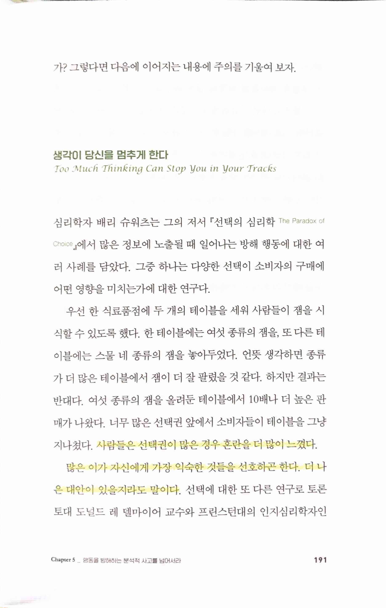

> 사람들은 선택권이 많은 경우 혼란을 더 많이 느꼈다.
>
> 많은 이가 자신에게 가장 익숙한 것들을 선호하곤 한다. 더 나은 대안이 있을지라도 말이다.

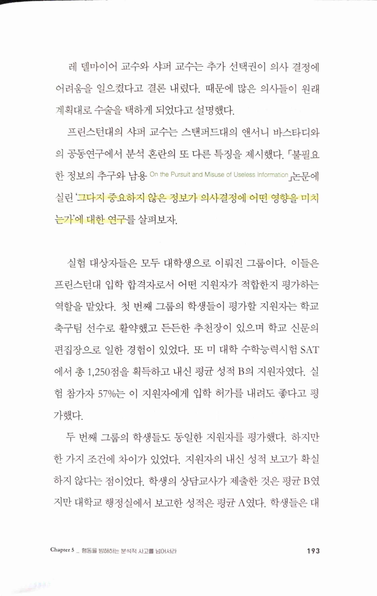 

> '그다지 중요하지 않은 정보가 의사결정에 어떤 영향을 미치는가'에 대한 연구
>
> 사람들은 추가적인 정보를 얻기 위해 의사결정을 미룰 수 있는 기회가 오면 이를 쉽게 택한다는 것이다. 하지만 막상 그 정보를 얻게 되면 그 정보가 과대평가되어 의사결정에 혼란을 빚는다.
>
> 정보를 추려내는 과정은 단순히 혼란을 줄 뿐 아니라 완전히 지치게 만들 수도 있다.

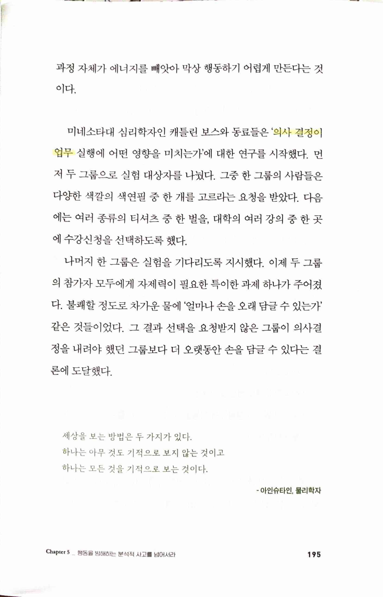

> '의사 결정이 업무 실행에 어떤 영향을 미치는가'에 대한 연구

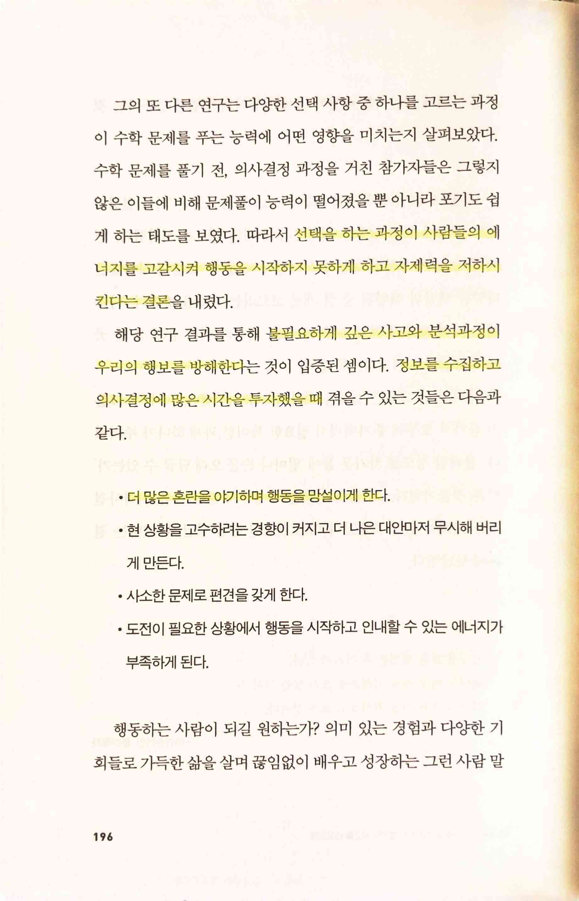

> 선택을 하는 과정이 사람들의 에너지를 고갈시켜 행동을 시작하지 못하게 하고 자제력을 저하시킨다는 결론
* 결정 피로 decision fatigue
> 해당 연구 결과를 통해 불필요하게 깊은 사고와 분석과정이 우리의 행보를 방해한다... 정보를 수집하고 의사결정에 많은 시간을 투자했을 때 ... 더 많은 혼란을 야기하며 행동을 망설이게 한다.

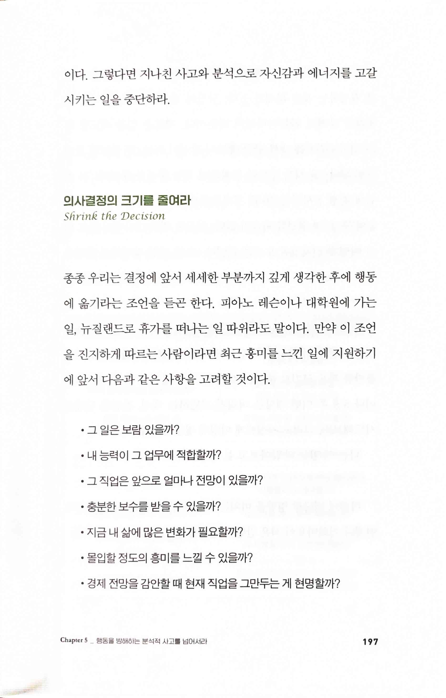

> 의사결정의 크기를 줄여라 Shrink the Decision

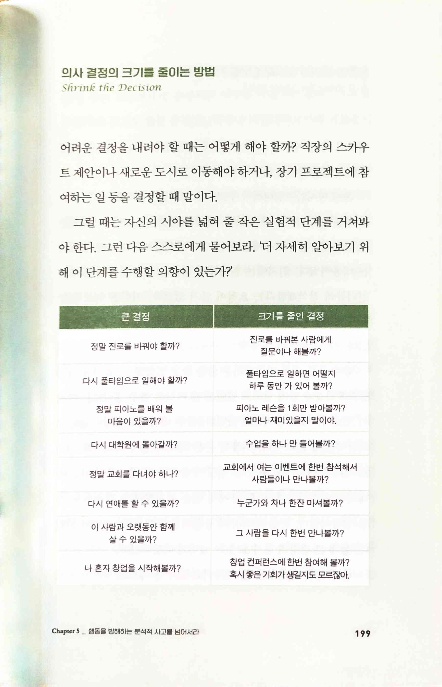

> 의사 결정의 크기를 줄이는 방법 Shrink the Decision

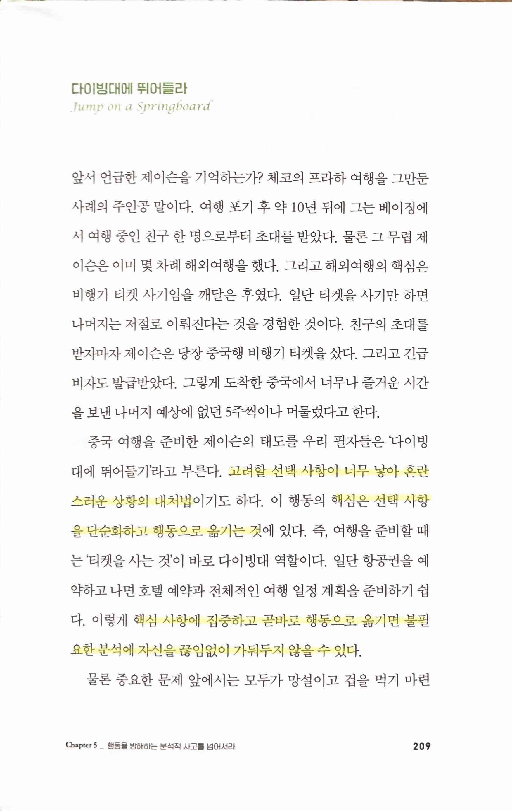

> 다이빙대에 뛰어들라 Jump on a Springboard
>
> 고려할 선택 사항이 너무 낳아 혼란스러운 상황의 대처법... 핵심은 선택 사항을 단순화하고 행동으로 옮기는 것... 핵심 사항에 집중하고 곧바로 행동으로 옮기면 불필요한 분석에 자신을 끊임없이 가둬두지 않을 수 있다.

# Chapter 6 호기심이 생기는 흥미로운 일을 시도하라

# Chapter 7 좋아하지도 않는 일에 인생을 낭비하지 마라

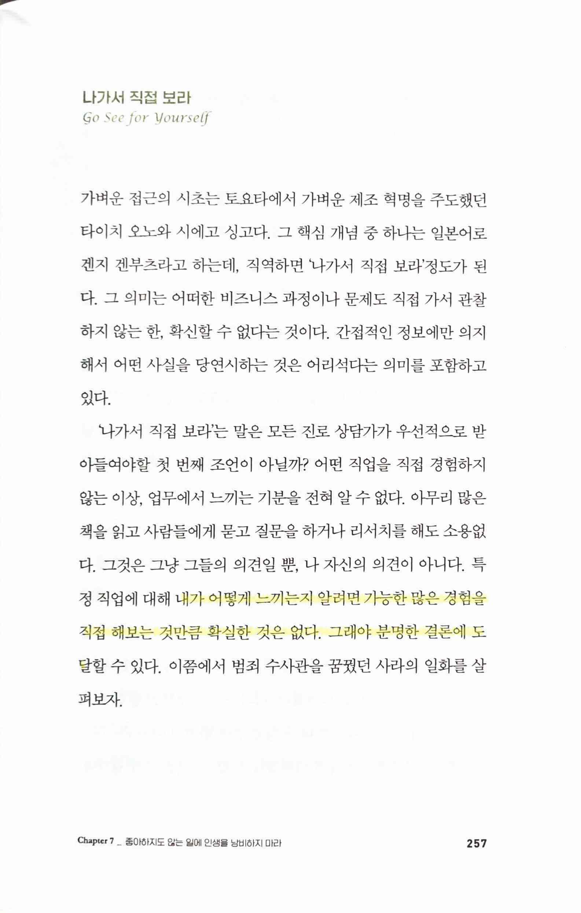

> 나가서 직접 보라 Go See for Yourself
>
> 내가 어떻게 느끼는지 알려면 가능한 많은 경험을 직접 해보는 것만큼 확실한 것은 없다. 그래야 분명한 결론에 도달할 수 있다.

# Chapter 8 고정된 틀에서 벗어나는 혁신가가 되어라
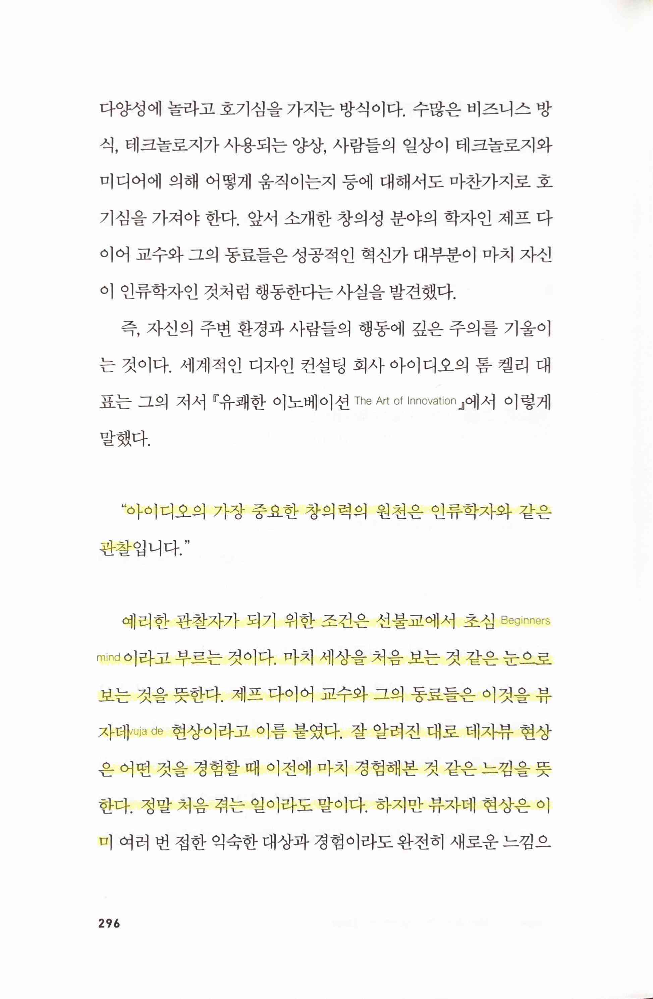

> 세계적인 디자인 컨설팅 회사 아이디오의 톰 켈리 대표는 그의 저서 '유쾌한 이노베이션 The Art of Innovation'에서 이렇게 말했다.
>
> "아이디오의 가장 중요한 창의력의 원천은 인류학자와 같은 관찰입니다."
>
> 예리한 관찰자가 되기 위한 조건은 선불교에서 초심 Beginners mind 이라고 부르는 것이다. 마치 세상을 처음 보는 것 같은 눈으로 보는 것을 뜻한다. 제프 다이어 교수와 그의 동료들은 이것을 `뷰자데 vuja de` 현상이라고 이름 붙였다. 잘 알려진 대로 데자뷰 현상은 어떤 것을 경험할 때 이전에 마치 경험해본 것 같은 느낌을 뜻한다. 정말 처음 겪는 일이라도 말이다. 하지만 뷰자데 현상은 이미 여러 번 접한 익숙한 대상과 경험이라도 완전히 새로운 느낌으로 보는 것이다.
* [(1) 뷰자데(Vu ja de) | LinkedIn](https://www.linkedin.com/pulse/%EB%B7%B0%EC%9E%90%EB%8D%B0vu-ja-de-brian-kwon/?originalSubdomain=kr)

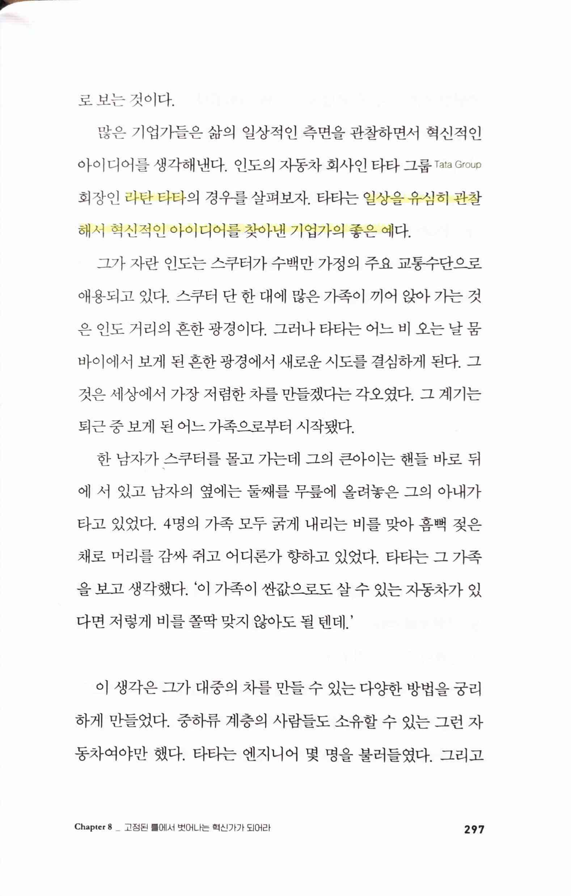

> 라탄 타타 일상을 유심히 관찰해서 혁신적인 아이디어를 찾아낸 기업가의 좋은 예

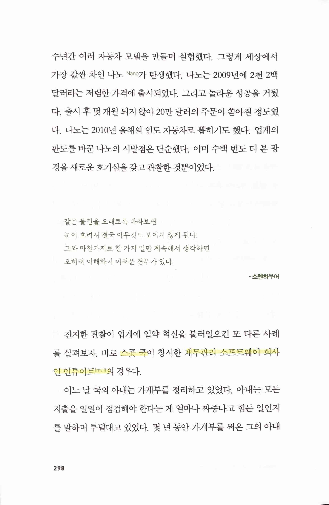 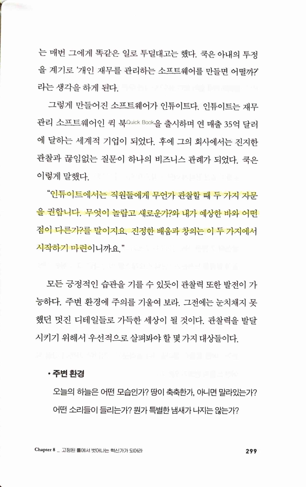

> 스콧 쿡 재무관리 소프트웨어 회사 인튜이트 Intuit
>
> “인튜이트에서는 직원들에게 무언가 관찰할 때 두 가지 자문을 권합니다. 무엇이 놀랍고 새로운가? 내가 예상한 바와 어떤 점이 다른가? 말이지요. 진정한 배움과 창의는 이 두 가지에서 시작하기 마련이니까요."

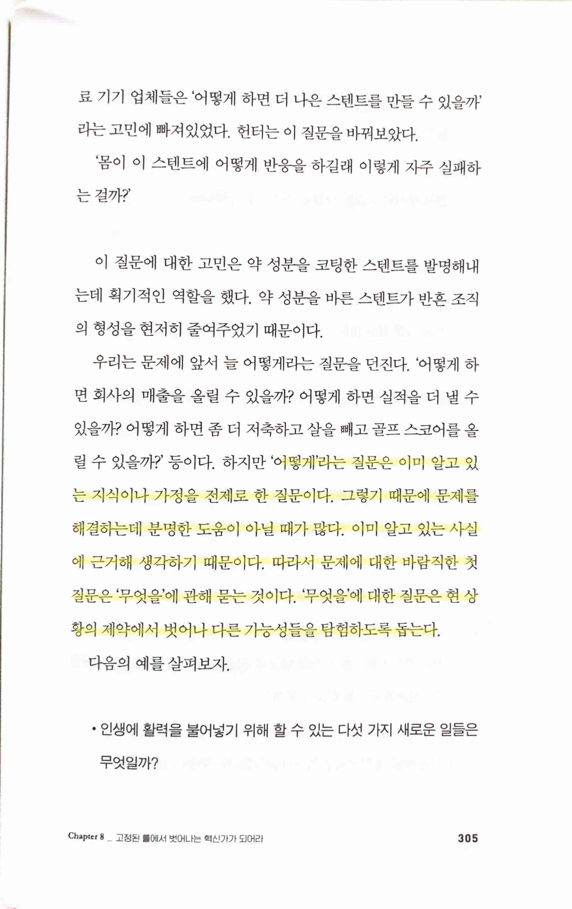

> `어떻게`라는 질문은 이미 알고 있는 지식이나 가정을 전제로 한 질문이다. 그렇기 때문에 문제를 해결하는데 분명한 도움이 아닐 때가 많다. 이미 알고 있는 사실에 근거해 생각하기 때문이다. 따라서 문제에 대한 바람직한 첫 질문은 `무엇을`에 관해 묻는 것이다. `무엇을`에 대한 질문은 현상황의 제약에서 벗어나 다른 가능성들을 탐험하도록 돕는다.

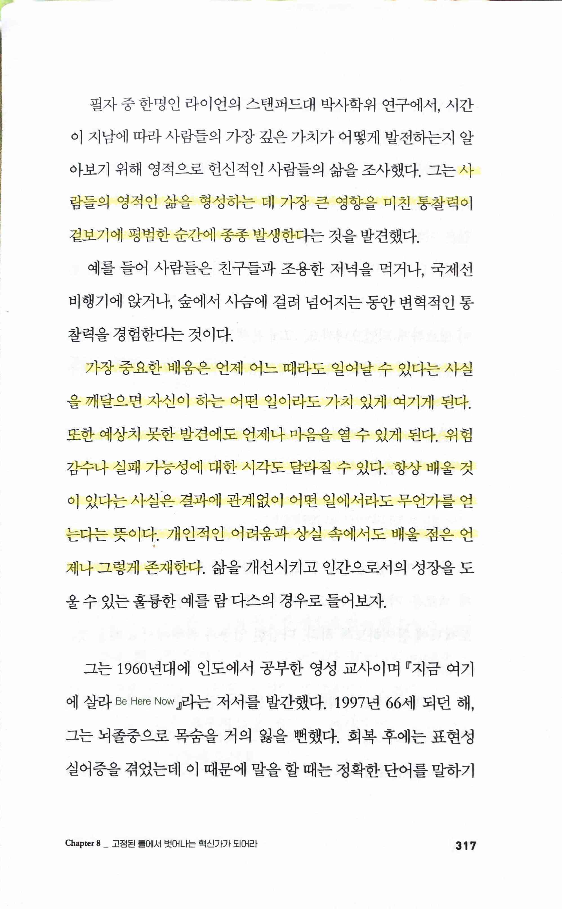

> 사람들의 영적인 삶을 형성하는 데 가장 큰 영향을 미친 통찰력이 겉보기에 평범한 순간에 종종 발생한다
>
> 가장 중요한 배움은 언제 어느 때라도 일어날 수 있다는 사실을 깨달으면 자신이 하는 어떤 일이라도 가치 있게 여기게 된다. 또한 예상치 못한 발견에도 언제나 마음을 열 수 있게 된다. 위험감수나 실패 가능성에 대한 시각도 달라질 수 있다. 항상 배울 것이 있다는 사실은 결과에 관계없이 어떤 일에서라도 무언가를 얻는다는 뜻이다. 개인적인 어려움과 상실 속에서도 배울 점은 언제나 그렇게 존재한다.

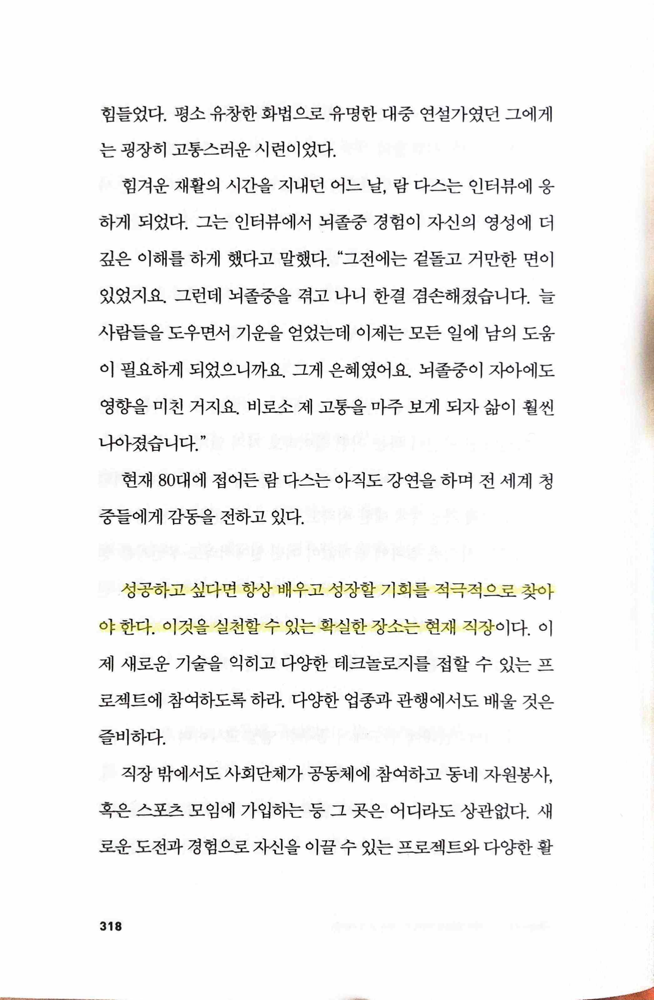

> 성공하고 싶다면 항상 배우고 성장할 기회를 적극적으로 찾아야 한다. 이것을 실천할 수 있는 확실한 장소는 현재 직장이다.

# Chapter 9 배경이나 관점이 전혀 다른 사람들이 모여 있는 곳으로 가라
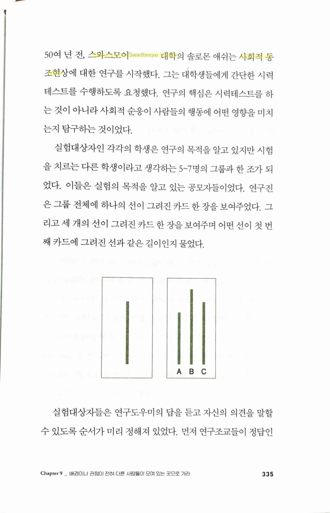 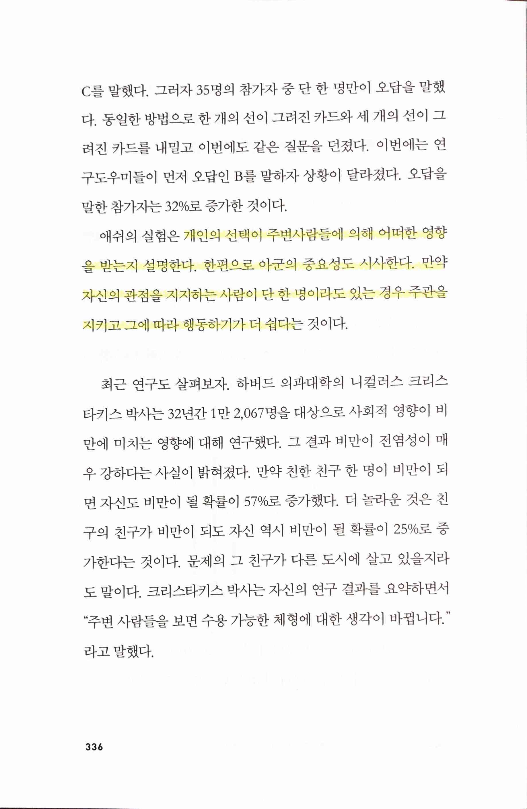

> 스와스모어 Swarthmore 대학 솔로몬 애쉬 사회적 동조현상에 대한 연구
>
> 애쉬의 실험은 개인의 선택이 주변사람들에 의해 어떠한 영향을 받는지 설명한다. 한편으로 `아군의 중요성`도 시사한다. 만약 자신의 관점을 지지하는 사람이 단 한 명이라도 있는 경우 주관을 지키고 그에 따라 행동하기가 더 쉽다는 것이다.

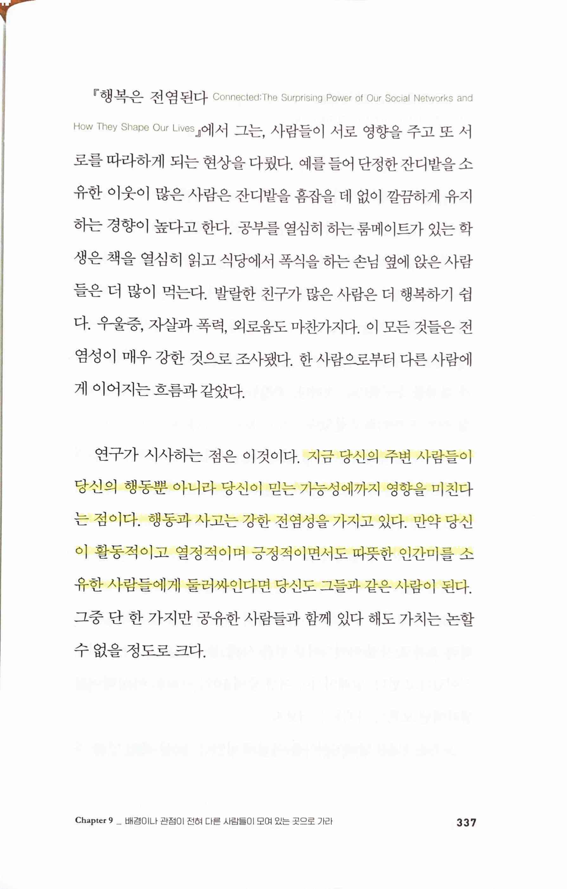

> 지금 당신의 주변 사람들이 당신의 행동뿐 아니라 당신이 믿는 가능성에까지 영향을 미친다는 점이다. 행동과 사고는 강한 전염성을 가지고 있다. 만약 당신이 활동적이고 열정적이며 긍정적이면서도 따뜻한 인간미를 소유한 사람들에게 둘러싸인다면 당신도 그들과 같은 사람이 된다.