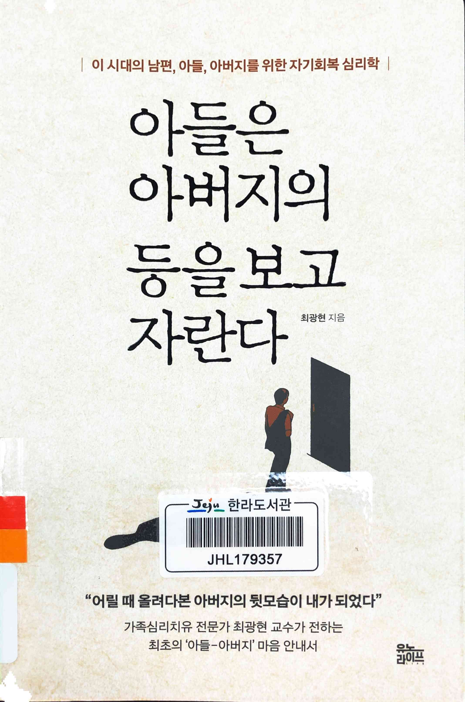
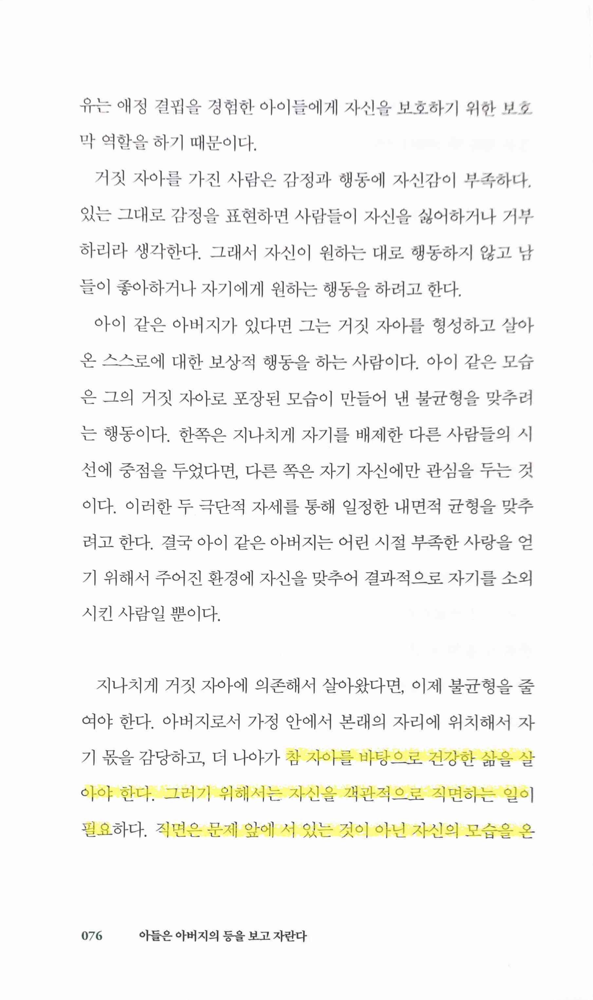
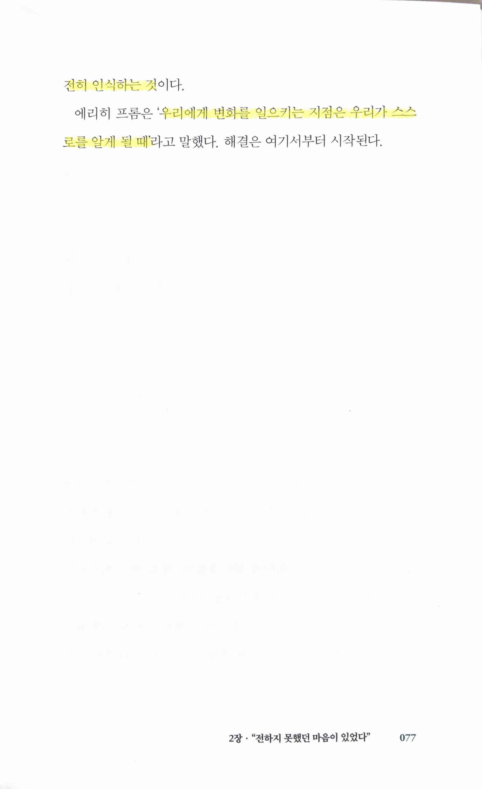

아들은 아버지의 등을 보고 자란다
========================

* ★★★☆☆ 2023.05.09 전반적으로 좋은 책. 급격한 감정/생각의 변화를 가져오진 않지만 읽으면서 담담히 끄덕이게 하는 좋은 책이다. 스스로를 직면하는데서 모든 게 출발해야 한다는 점에 매우 동의하는데, 심리학 관련된 주제들의 문제는 스스로를 돌아보는 거 자체가 보통 사람들에겐 정말 쉽지 않은 일이라는 점. 사실 어느 일이나 그렇지만 현재 상태를 정확히 진단해야 고치건 발전시키건 앞으로 나아갈 수 있는데, 눈에 보이는 일들도 그러는 게 쉽지 않은데 여태 신경쓰지 않던 혹은 모르고 외면하던 자아를 돌아보는 일이 얼마나 어려운지는 점점 정신적인 부분에 관련된 사회 문제들이 증가하는 것 만으로도 간접적으로 증명된다고 생각한다. 책을 읽는다고 스스로 문제를 진단하고 치유하는 일이 가능하진 않겠지만, 최소한 문제가 있다는 걸 스스로 깨닫기만 하더라도 좋은 출발점이 될 수 있다고 본다.

 

> 참 자아를 바탕으로 건강한 삶을 살아야 한다. 그러기 위해서는 자신을 객관적으로 직면하는 일이 필요하다. 직면은 문제 앞에 서 있는 것이 아닌 자신의 모습을 온전히 인식하는 것이다.
>
> 에리히 프롬은 '우리에게 변화를 일으키는 지점은 우리가 스스로를 알게 될 때'라고 말했다. 해결은 여기서부터 시작된다.