몰입의 즐거움
=============
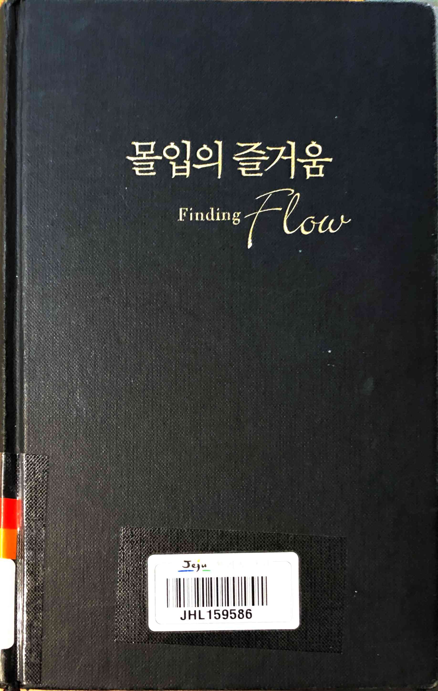

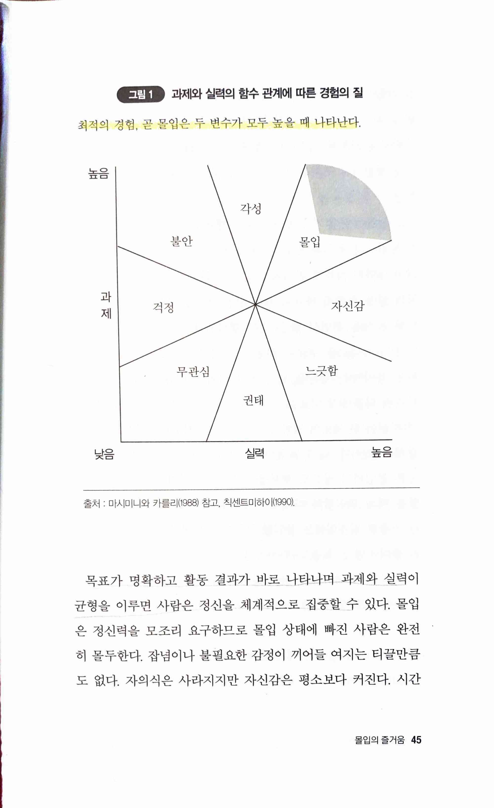

> `최적의 경험`, 곧 `몰입`은 두 변수가 모두 높을 때 나타난다.

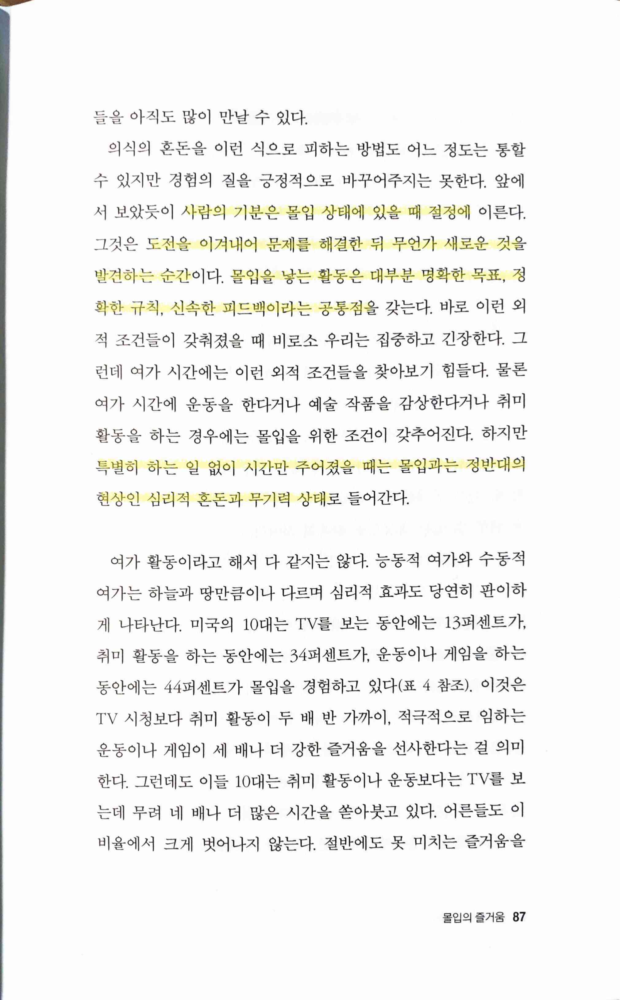

> 사람의 기분은 몰입 상태에 있을 때 절정... 도전을 이겨내어 문제를 해결한 뒤 무언가 새로운 것을 발견하는 순간... 몰입을 낳는 활동은 대부분 `명확한 목표`, `정확한 규칙`, `신속한 피드백`이라는 공통점... 특별히 하는 일 없이 시간만 주어졌을 때는 몰입과는 정반대의 현상인 심리적 혼돈과 무기력 상태로

> 사회적 동물이며, 단지 보호받기 위해서만이 아니라 생활의 즐거움을 익히기 위해서라도 무리를 이루어 살아야 한다... 멍텅구리를 뜻하는 영어 단어 'idiot'는 혼자 사는 사람을 뜻하는 그리스어에서 나온 말이다. 공동체에서 떨어져 나와 혼자 사는 사람은 정신적으로 문제가 있다는 발상

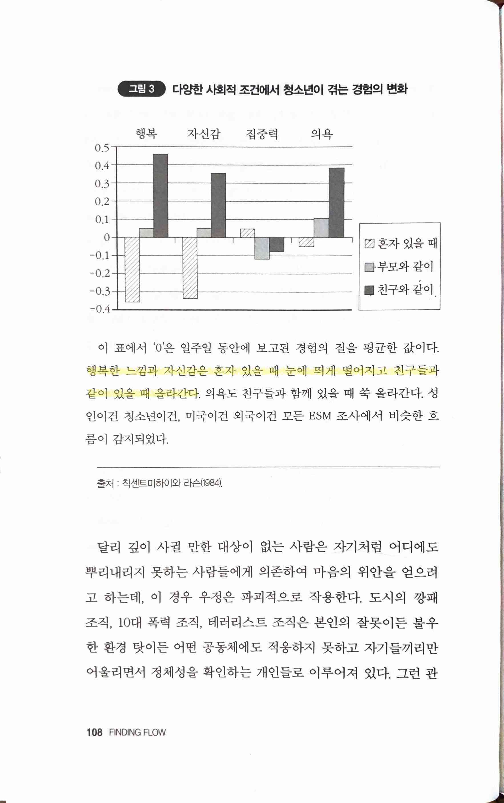

> 행복한 느낌과 자신감은 혼자 있을 때 눈에 띄게 떨어지고 친구들과 같이 있을 때 올라간다.

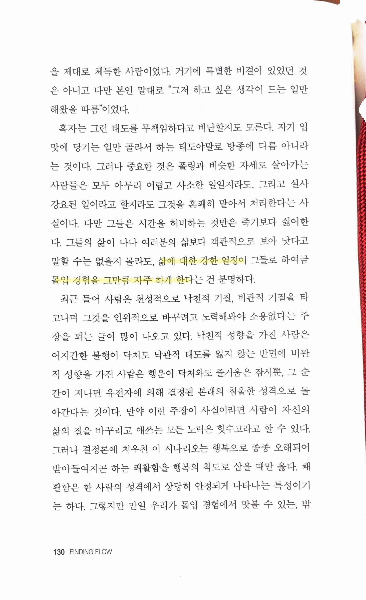

> 삶에 대한 강한 `열정`이 ... 몰입 경험을 그만큼 자주 하게 한다

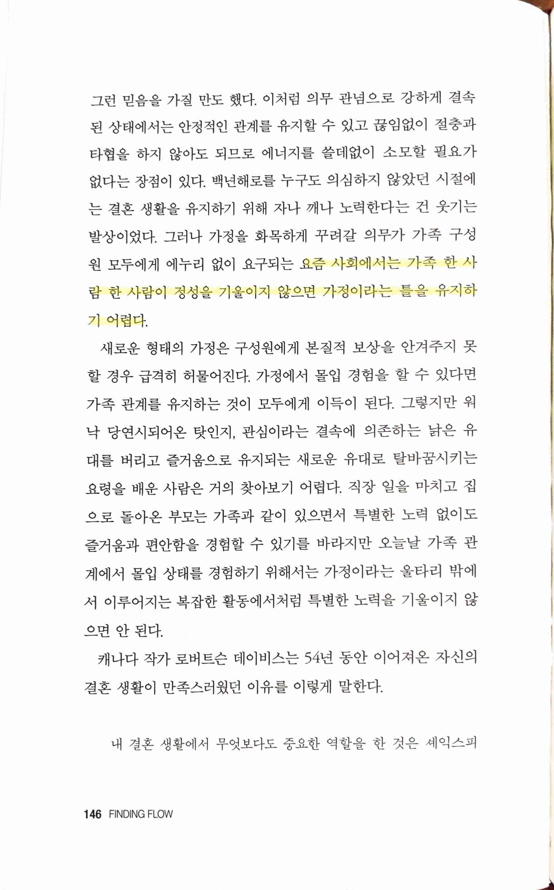

> 요즘 사회에서는 가족 한 사람 한 사람이 정성을 기울이지 않으면 가정이라는 틀을 유지하기 어렵다.

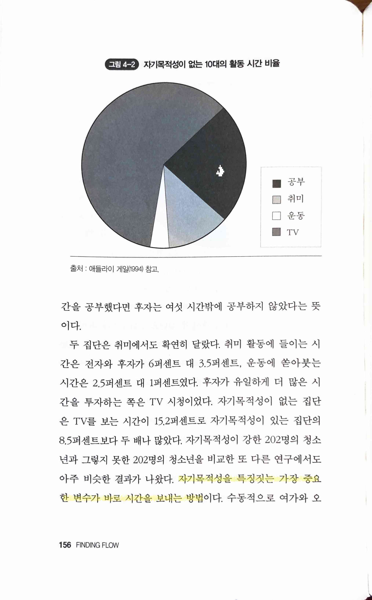

> `자기목적성`을 특징짓는 가장 중요한 변수가 바로 시간을 보내는 방법

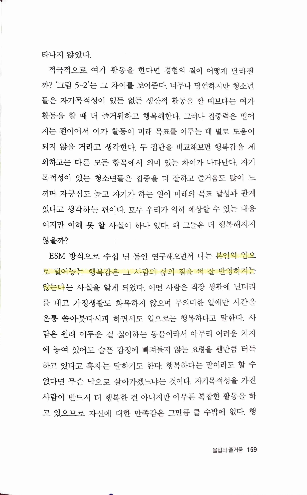

> 본인의 입으로 털어놓는 행복감은 그 사람의 삶의 질을 썩 잘 반영하지는 않는다

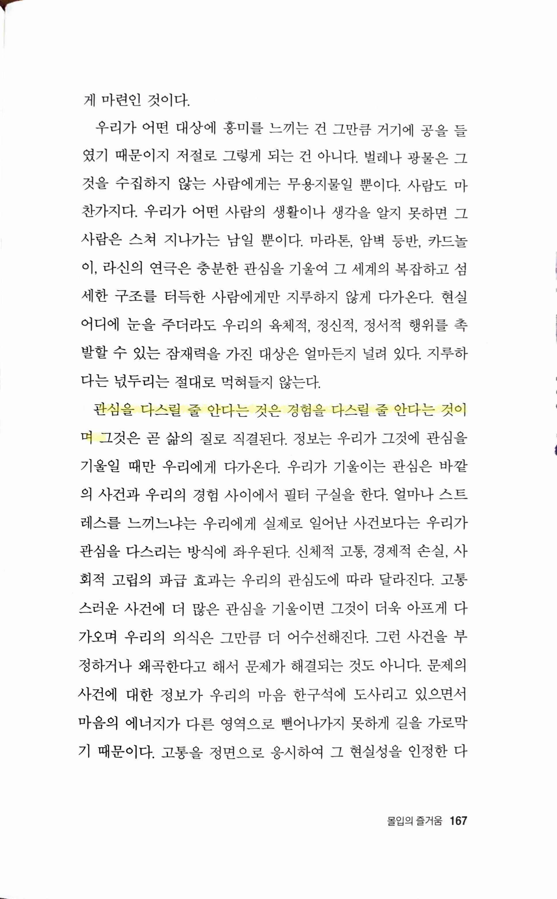

> 관심을 다스릴 줄 안다는 것은 경험을 다스릴 줄 안다는 것이며 그것은 곧 삶의 질로 직결

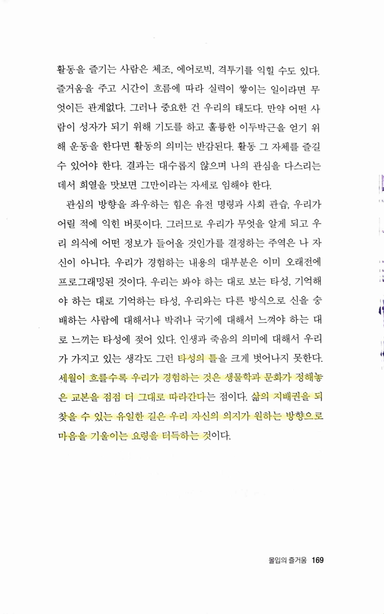

> `타성`의 틀... 세월이 흐를수록 우리가 경험하는 것은 생물학과 문화가 정해놓은 교본을 점점 더 그대로 따라간다... 삶의 지배권을 되찾을 수 있는 유일한 길은 우리 자신의 의지가 원하는 방향으로 마음을 기울이는 요령을 터득하는 것

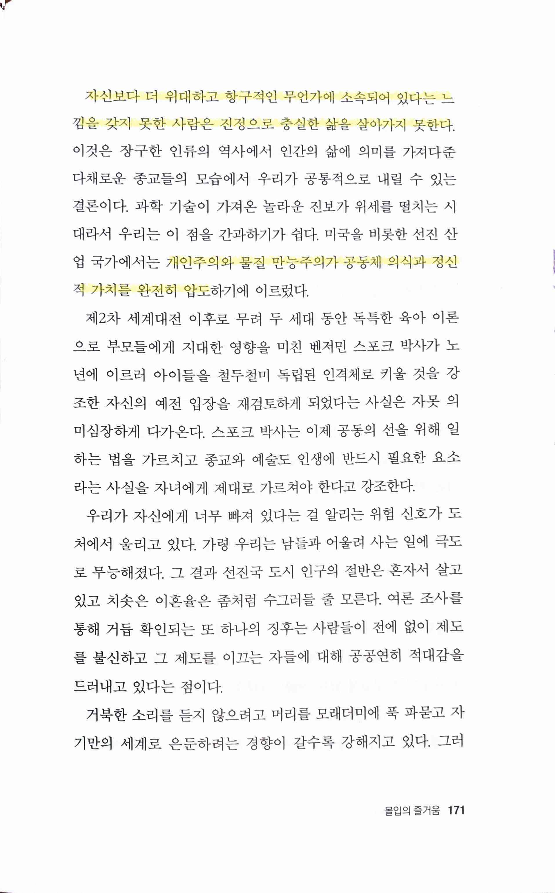

> 자신보다 더 위대하고 항구적인 무언가에 소속되어 있다는 느낌을 갖지 못한 사람은 진정으로 충실한 삶을 살아가지 못한다... 개인주의와 물질 만능주의가 공동체 의식과 정신적 가치를 완전히 압도

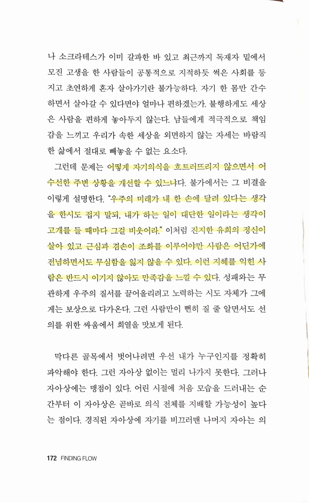

> 어떻게 자기의식을 흐트러뜨리지 않으면서 어수선한 주변 상황을 개선할 수 있느냐... "우주의 미래가 내 한 손에 달려 있다는 생각을 한시도 접지 말되 내가 하는 일이 대단한 일이라는 생각이 고개를 들 때마다 그걸 비웃어라" 이처럼 진지한 유희의 정신이살아 있고 근심과 겸손이 조화를 이루어야만 사람은 어딘가에 전념하면서도 무심함을 잃지 않을 수 있다. 이런 지혜를 익힌 사람은 반드시 이기지 않아도 만족감을 느낄 수 있다.

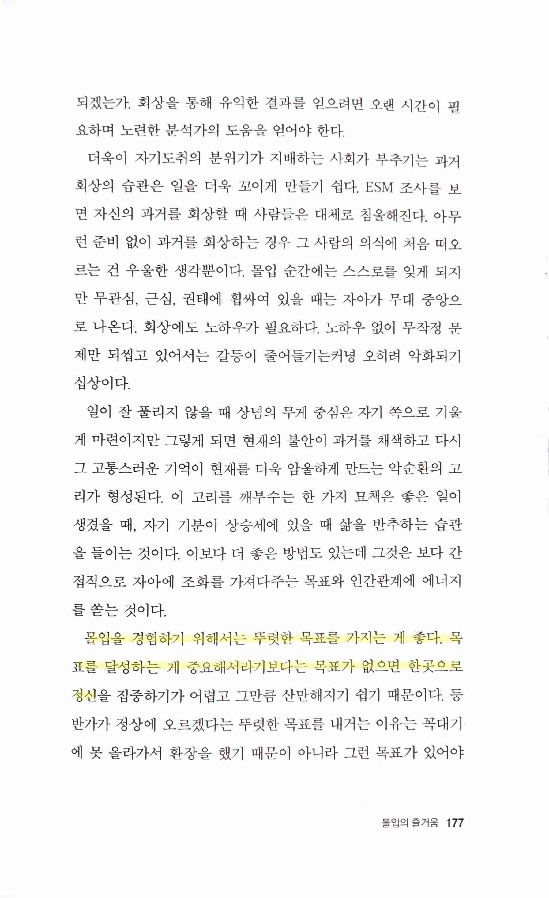 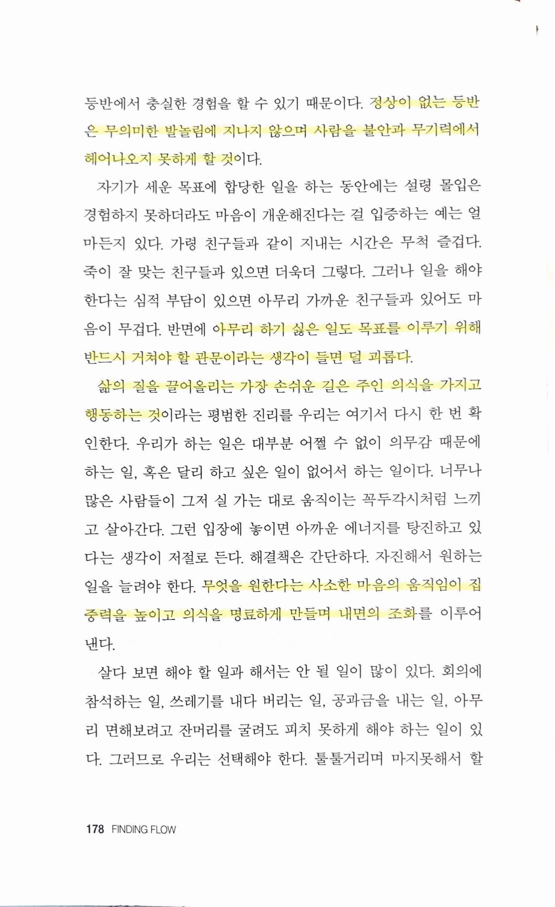 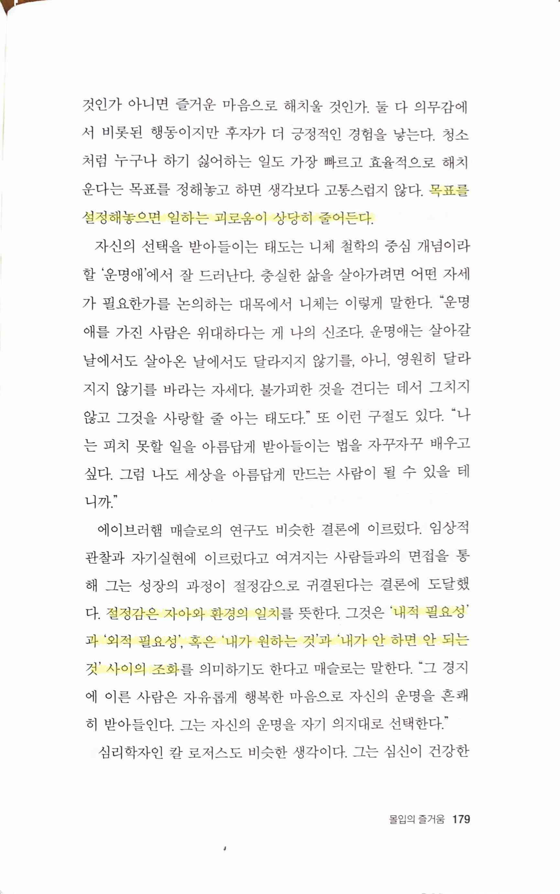 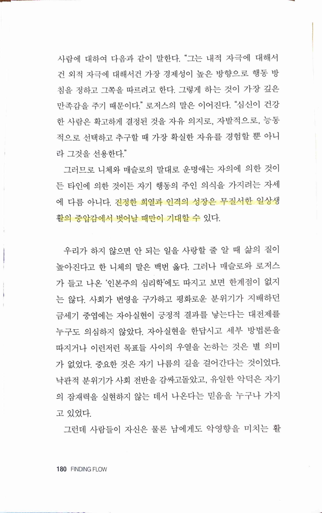

> 몰입을 경험하기 위해서는 뚜렷한 `목표`를 가지는 게 좋다. 목표를 달성하는 게 중요해서라기보다는 목표가 없으면 한곳으로 정신을 집중하기가 어렵고 그만큼 산만해지기 쉽기 때문
>
> 정상이 없는 등반은 무의미한 발놀림에 지나지 않으며 사람을 불안과 무기력에서 헤어나오지 못하게 할 것
>
> 아무리 하기 싫은 일도 목표를 이루기 위해 반드시 거쳐야 할 관문이라는 생각이 들면 덜 괴롭다.
>
> 삶의 질을 끌어올리는 가장 손쉬운 길은 `주인 의식`을 가지고 행동하는 것이라는 평범한 진리... 무엇을 원한다는 사소한 마음의 움직임이 집중력을 높이고 의식을 명료하게 만들며 내면의 조화를 이루어낸다.
>
> 목표를 설정해놓으면 일하는 괴로움이 상당히 줄어든다.
>
> 절정감은 자아와 환경의 일치... '내적 필요성'과 '외적 필요성', 혹은 '내가 원하는 것'과 '내가 안 하면 안 되는것' 사이의 조화
>
> 진정한 희열과 인격의 성장은 무질서한 일상생활의 중압감에서 벗어날 때만이 기대할 수 있다.

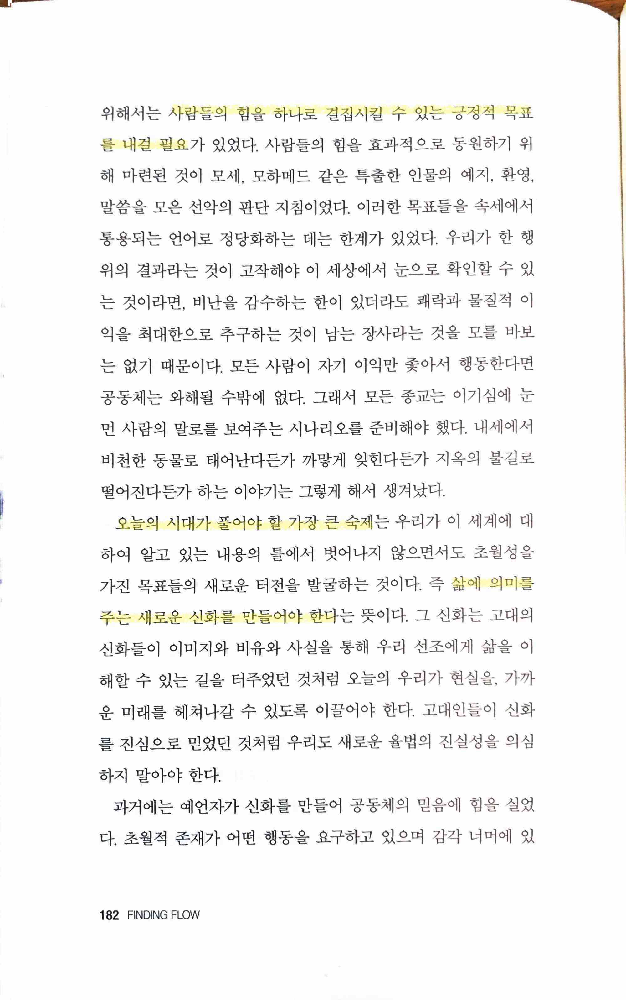

> 사람들의 힘을 하나로 결집시킬 수 있는 `긍정적 목표`를 내걸 필요
>
> 오늘의 시대가 풀어야 할 가장 큰 숙제는... 삶에 의미를 주는 새로운 신화를 만들어야

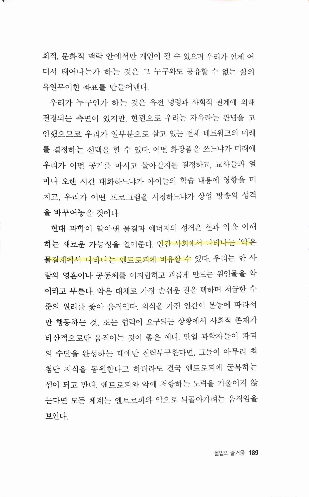 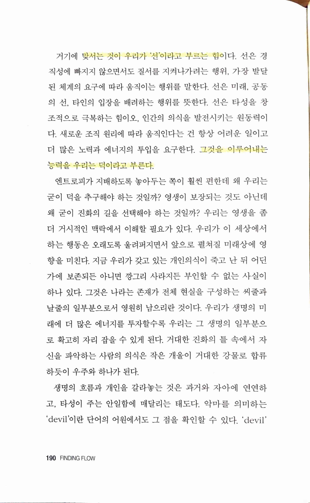

> 인간 사회에서 나타나는 `악`은 물질계에서 나타나는 `엔트로피`에 비유
>
> 거기에 맞서는 것이 우리가 `선`이라고 부르는 힘... 그것을 이루어내는 능력을 우리는 `덕`이라고 부른다.