프레임의 힘
===========
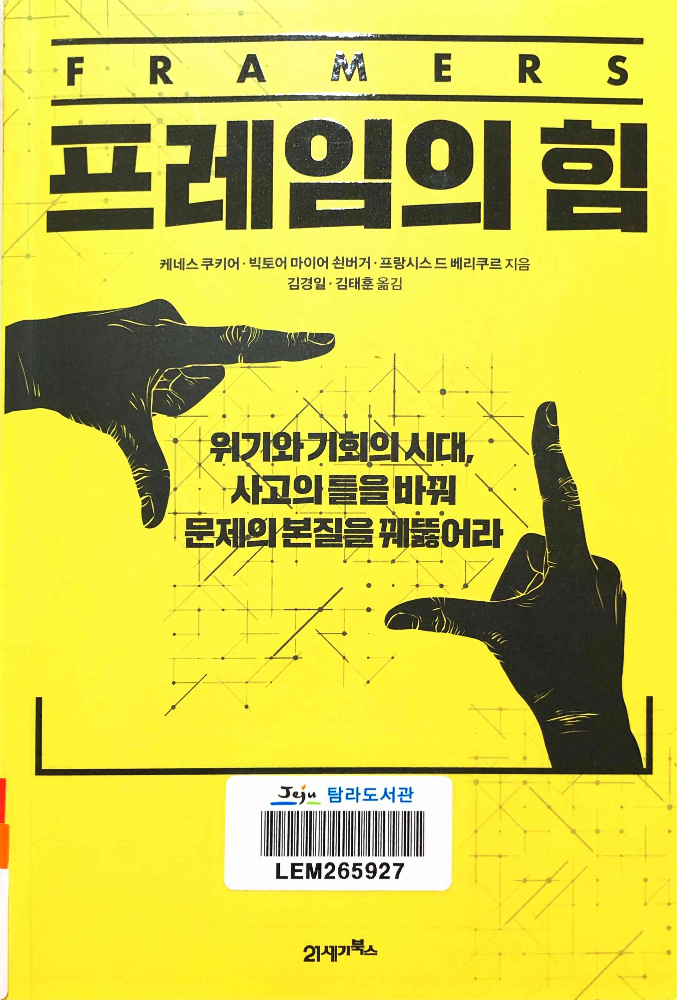

* [The Most Important Human Skill: Review of “Framers”](https://www.forbes.com/sites/calumchace/2021/05/13/the-most-important-human-skill-review-of-framers/?sh=753bf74c6a28)

# 1장 결정 Decisions
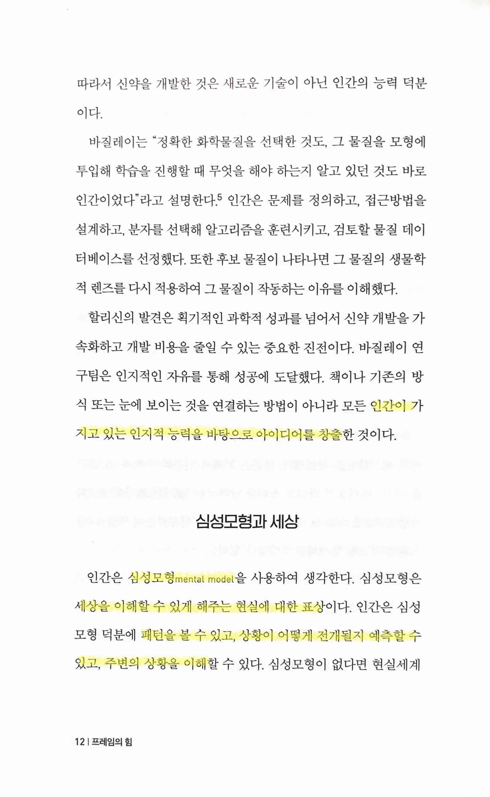 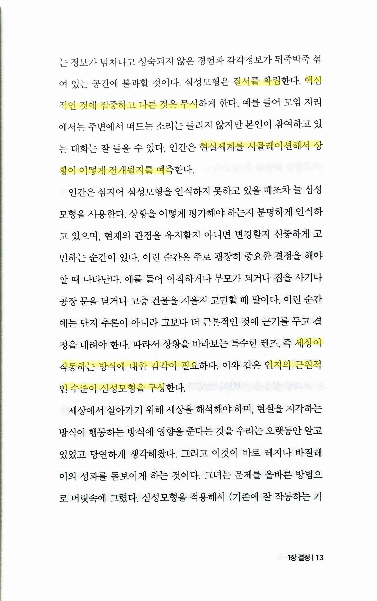 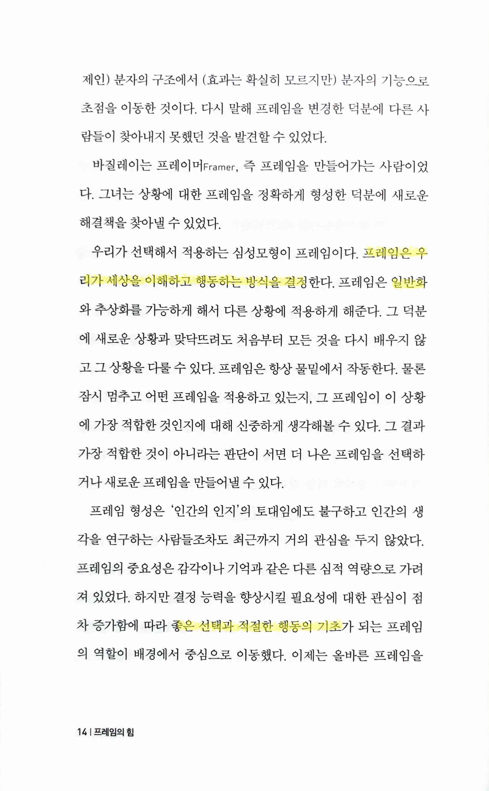 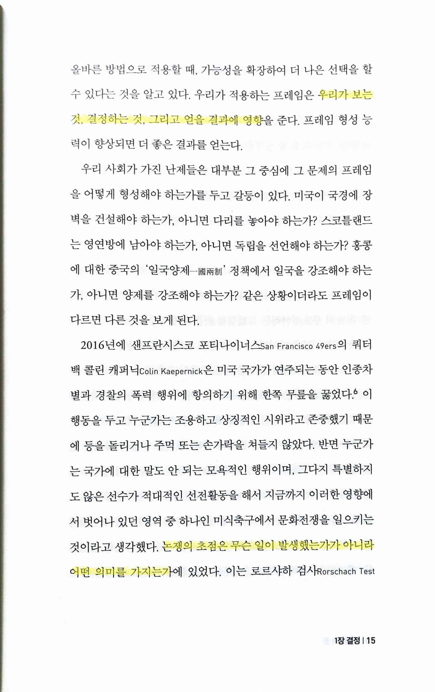

> 인간이 가지고 있는 인지적 능력을 바탕으로 아이디어를 창출
>
> `심성모형 mental model` 세상을 이해할 수 있게 해주는 현실에 대한 표상. 패턴을 볼 수 있고, 상황이 어떻게 전개될지 예측할 수 있고, 주변의 상황을 이해
>
> 질서를 확립. 핵심적인 것에 집중하고 다른 것은 무시. 현실세계를 시뮬레이션해서 상황이 어떻게 전개될지를 예측
>
> 세상이 작동하는 방식에 대한 감각 필요. 인지의 근원적인 수준이 심성모형을 구성
>
> 프레임은 우리가 세상을 이해하고 행동하는 방식을 결정. 일반화와 추상화를 가능하게
>
> 좋은 선택과 적절한 행동의 기초
>
> 우리가 보는 것, 결정하는 것, 그리고 얻을 결과에 영향
>
> 논쟁의 초점은 무슨 일이 발생했는가가 아니라 어떤 의미를 가지는가

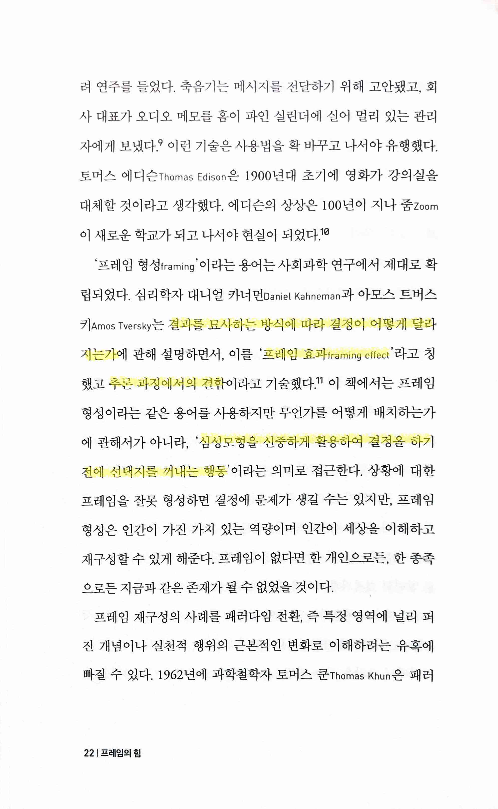

> 결과를 묘사하는 방식에 따라 결정이 어떻게 달라지는가 `'프레임 효과 framing effect'` 추론 과정에서의 결함. '심성모형을 신중하게 활용하여 결정을 하기 전에 선택지를 꺼내는 행동'

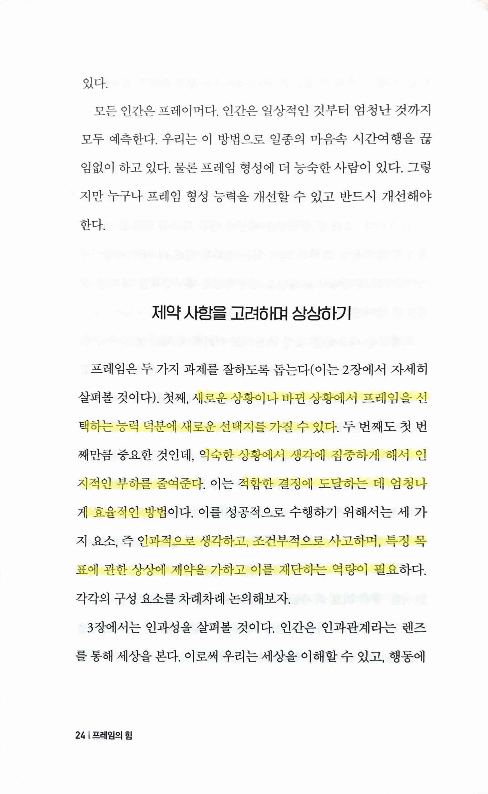

> 새로운 상황이나 바뀐 상황에서 프레임을 선택하는 능력 덕분에 새로운 선택지를 가질 수 있다. 익숙한 상황에서 생각에 집중하게 해서 인지적인 부하를 줄여준다. 적합한 결정에 도달하는 데 엄청나게 효율적인 방법... 인과적으로 생각하고, 조건부적으로 사고하며, 특정 목표에 관한 상상에 제약을 가하고 이를 재단하는 역량이 필요

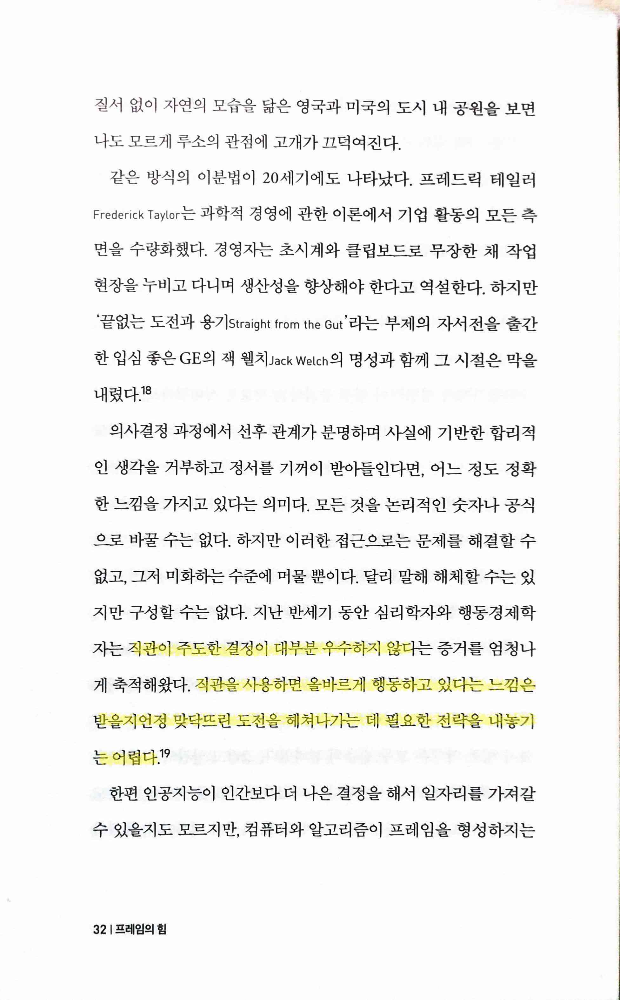

> 직관이 주도한 결정이 대부분 우수하지 않다. 직관을 사용하면 올바르게 행동하고 있다는 느낌은 받을지언정 맞닥뜨린 도전을 헤쳐나가는 데 필요한 전략을 내놓기는 어렵다.

# 2장 프레임 형성 Framing
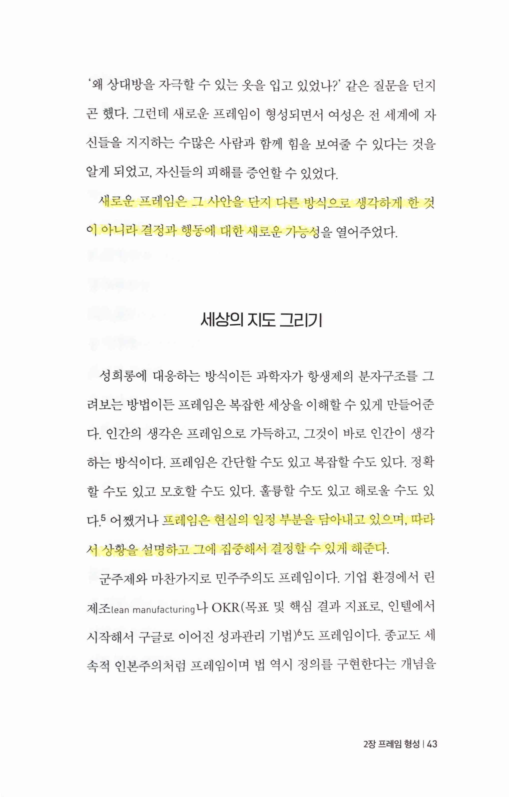

> 새로운 프레임은 그 사안을 단지 다른 방식으로 생각하게 한 것이 아니라 결정과 행동에 대한 새로운 가능성
>
> 프레임은 현실의 일정 부분을 담아내고 있으며, 따라서 상황을 설명하고 그에 집중해서 결정할 수 있게 해준다.

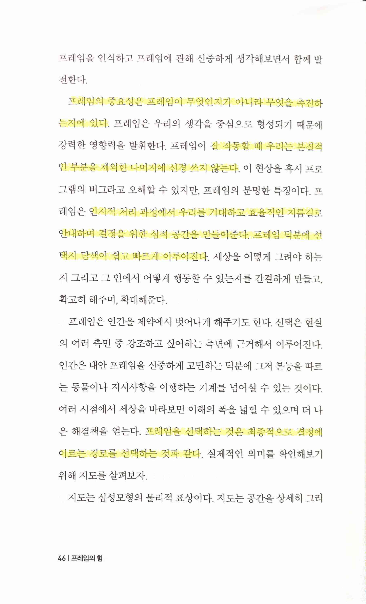

> 프레임의 중요성은 프레임이 무엇인지가 아니라 무엇을 촉진하는지에 있다... 잘 작동할 때 우리는 본질적인 부분을 제외한 나머지에 신경 쓰지 않는다... 인지적 처리 과정에서 우리를 거대하고 효율적인 지름길로 안내하며 결정을 위한 심적 공간을 만들어준다. 프레임 덕분에 선택지 탐색이 쉽고 빠르게 이루어진다.
>
> 프레임을 선택하는 것은 최종적으로 결정에 이르는 경로를 선택하는 것과 같다.

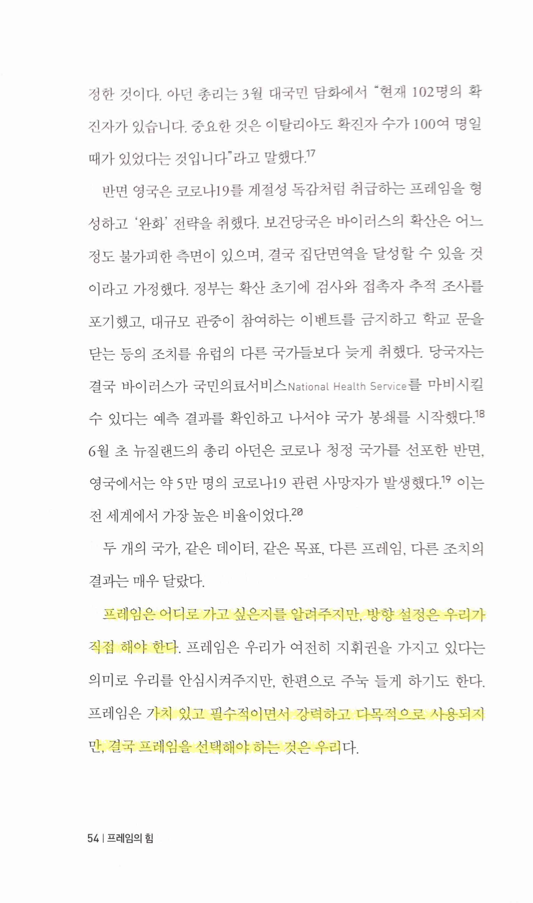

> 프레임은 어디로 가고 싶은지를 알려주지만, 방향 설정은 우리가 직접 해야 한다... 가치 있고 필수적이면서 강력하고 다목적으로 사용되지만, 결국 프레임을 선택해야 하는 것은 우리다.

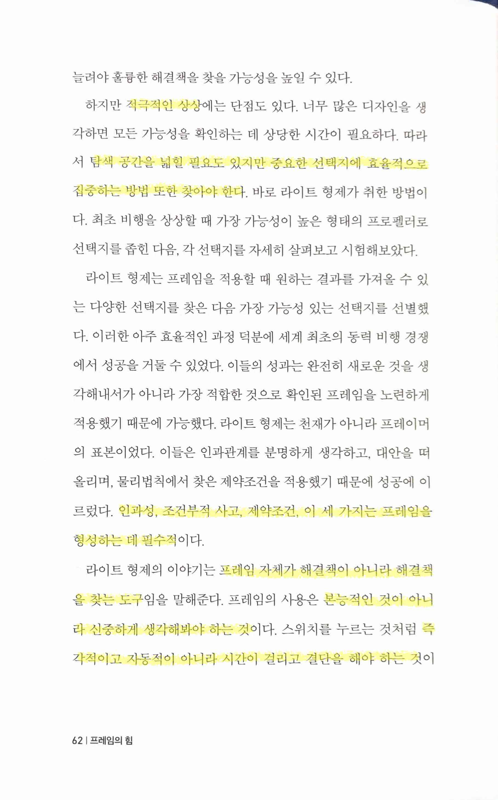

> 적극적인 상상에는 단점도. 탐색 공간을 넓힐 필요도 있지만 중요한 선택지에 효율적으로 집중하는 방법 또한 찾아야 한다.
>
> `인과성`, `조건부적 사고`, `제약조건`, 이 세 가지는 프레임을 형성하는 데 필수적
>
> 프레임 자체가 해결책이 아니라 해결책을 찾는 도구. 본능적인 것이 아니라 신중하게 생각해봐야 하는 것. 즉각적이고 자동적이 아니라 시간이 걸리고 결단을 해야 하는 것

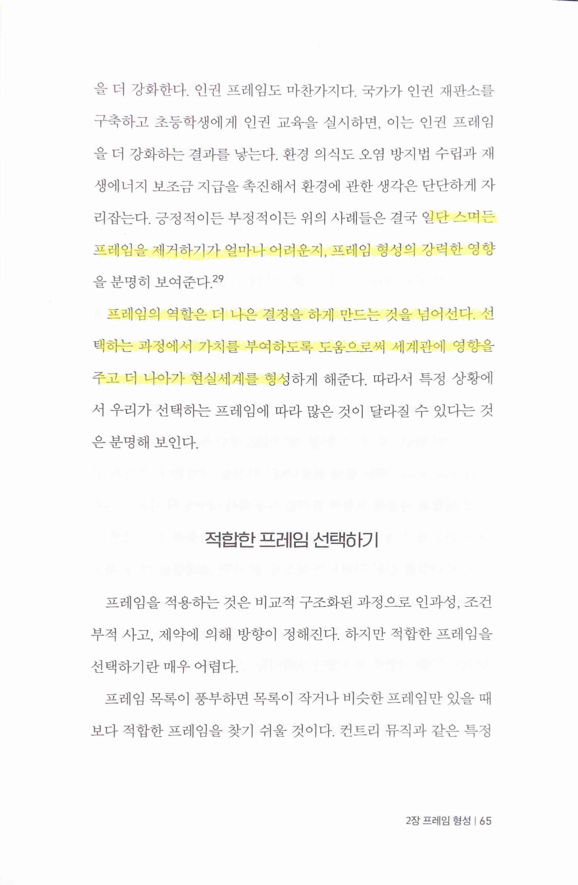

> 일단 스며든 프레임을 제거하기가 얼마나 어려운지, 프레임 형성의 강력한 영향
>
> 프레임의 역할은 더 나은 결정을 하게 만드는 것을 넘어선다. 선택하는 과정에서 가치를 부여하도록 도움으로써 세계관에 영향을 주고 더 나아가 현실세계를 형성

# 3장 인과성 Causality
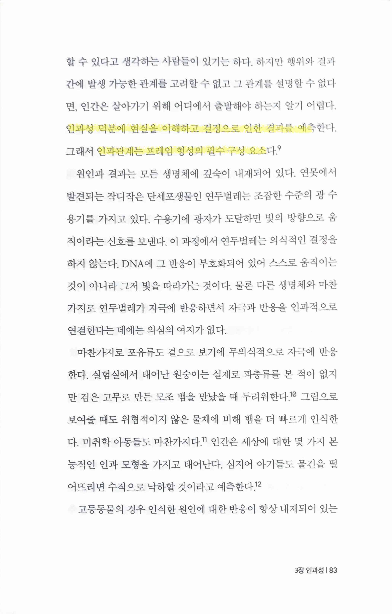

> 인과성 덕분에 현실을 이해하고 결정으로 인한 결과를 예측. 인과관계는 프레임 형성의 필수 구성 요소

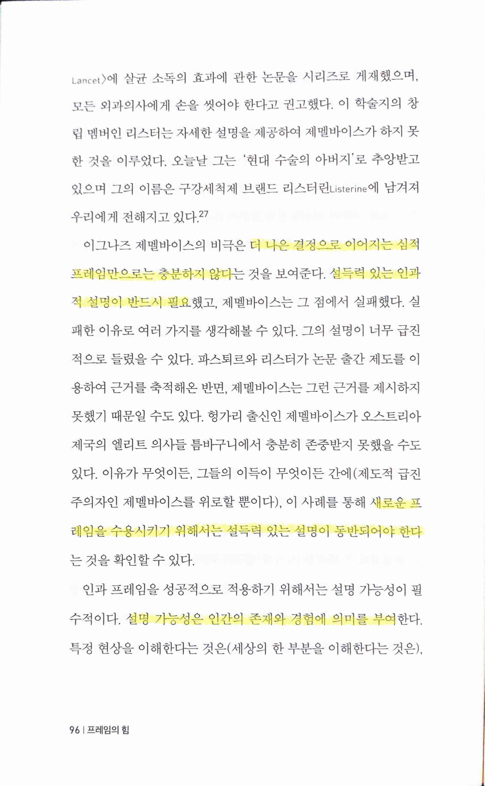

> 더 나은 결정으로 이어지는 심적 프레임만으로는 충분하지 않다. 설득력 있는 인과적 설명이 반드시 필요... 새로운 프레임을 수용시키기 위해서는 설득력 있는 설명이 동반되어야 한다
>
> 설명 가능성이 필수적

# 4장 조건부적 사고 Counterfactuals
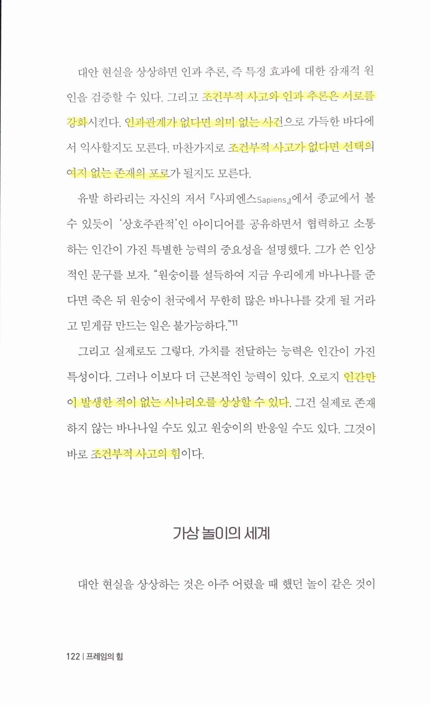

> 조건부적 사고와 인과 추론은 서로를 강화. 인과관계가 없다면 의미 없는 사건. 조건부적 사고가 없다면 선택의 여지 없는 존재의 포로
>
> 오로지 인간만이 발생한 적이 없는 시나리오를 상상. 조건부적 사고의 힘

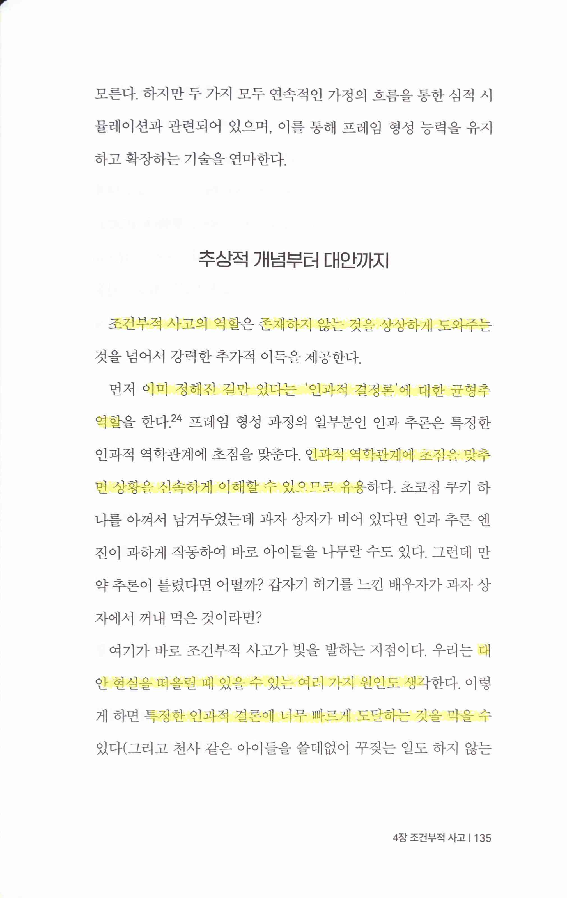

> 조건부적 사고의 역할은 존재하지 않는 것을 상상하게 도와주는 것을 넘어서 강력한 추가적 이득을 제공
>
> 이미 정해진 길만 있다는 '인과적 결정론'에 대한 균형추 역할. 인과적 역학관계에 초점을 맞추면 상황을 신속하게 이해할 수 있으므로 유용
>조건부적 사고를 하면 인과관계를 더 잘 생각하게 된다... 초점을 깊게 하기보다는 넓혀주는 선택지를 떠올리기 때문에 매우 도움. 인과관계를 생각. 이때 하나의 원인에만 집중하면 상상력을 자극하지 못한다. 따라서 대안 현실의 상상이 성공적인 프레임 형성의 핵심 요소

손쉽게 적용할 수 있는 방식으로 상호작용
> 대안 현실을 떠올릴 때 있을 수 있는 여러 가지 원인도 생각. 특정한 인과적 결론에 너무 빠르게 도달하는 것을 막을 수

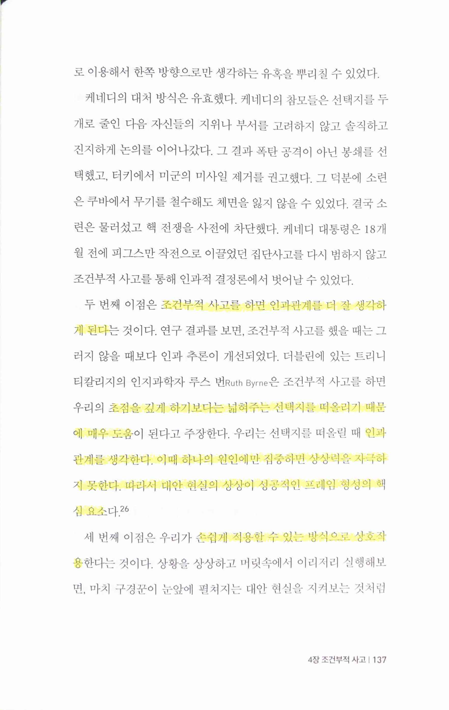

> 조건부적 사고를 하면 인과관계를 더 잘 생각하게 된다... 초점을 깊게 하기보다는 넓혀주는 선택지를 떠올리기 때문에 매우 도움. 인과관계를 생각. 이때 하나의 원인에만 집중하면 상상력을 자극하지 못한다. 따라서 대안 현실의 상상이 성공적인 프레임 형성의 핵심 요소
>
> 손쉽게 적용할 수 있는 방식으로 상호작용

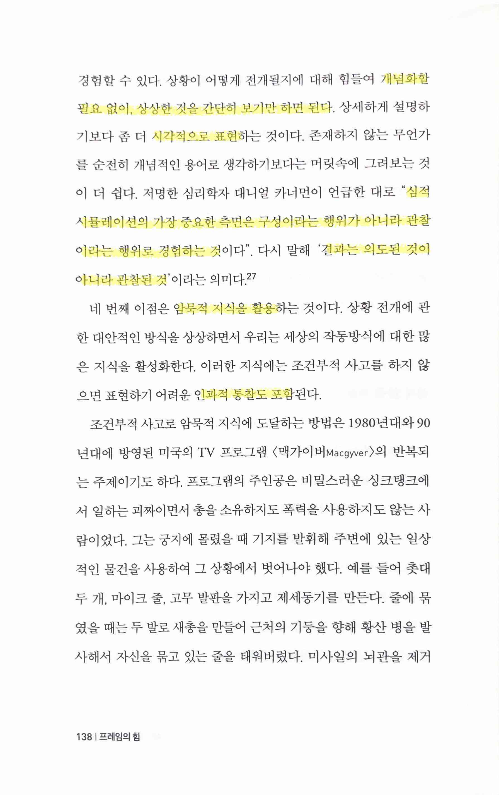

> 개념화할 필요 없이, 상상한 것을 간단히 보기만 하면 된다. 시각적으로 표현... "심적 시뮬레이션의 가장 중요한 측면은 구성이라는 행위가 아니라 관찰이라는 행위로 경험하는 것". 다시 말해 '결과는 의도된 것이 아니라 관찰된 것'
>
> 암묵적 지식을 활용. 인과적 통찰도 포함

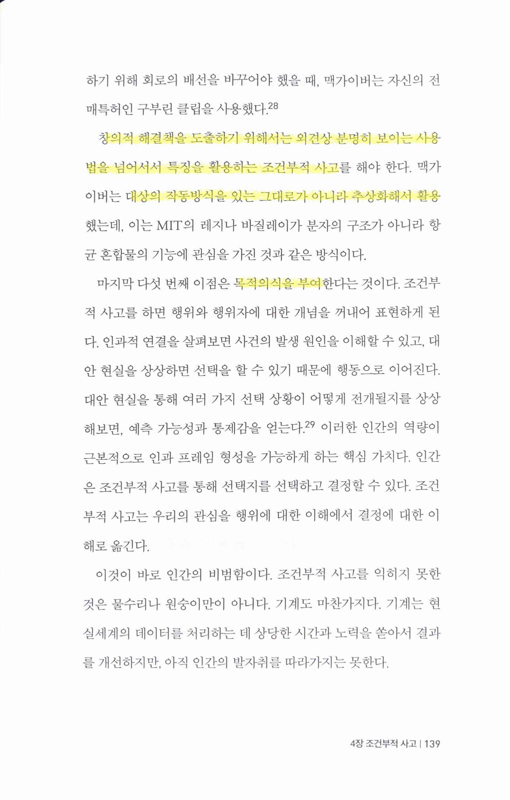

> 창의적 해결책을 도출하기 위해서는 외견상 분명히 보이는 사용법을 넘어서서 특징을 활용하는 조건부적 사고를 해야. 대상의 작동방식을 있는 그대로가 아니라 추상화해서 활용
>
> 목적의식을 부여

# 5장 제약조건 Constraints
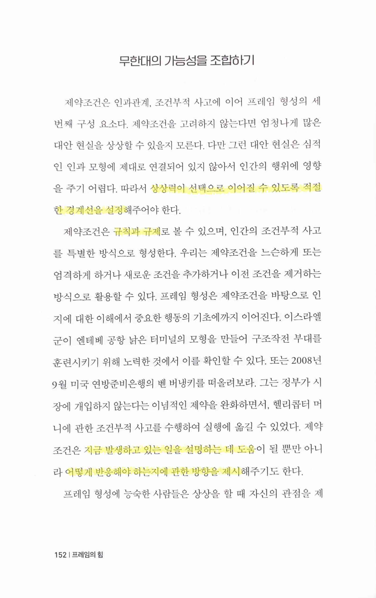

> 상상력이 선택으로 이어질 수 있도록 적절한 경계선을 설정
>
> 제약조건은 규칙과 규제... 지금 발생하고 있는 일을 설명하는 데 도움. 어떻게 반응해야 하는지에 관한 방향을 제시

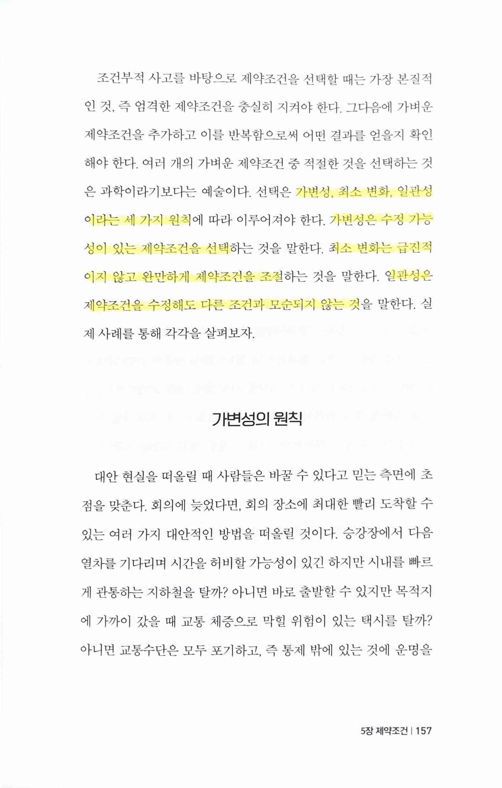

> `가변성`, `최소 변화`, `일관성`이라는 세 가지 원칙. 가변성은 수정 가능성이 있는 제약조건을 선택. 최소 변화는 급진적이지 않고 완만하게 제약조건을 조절. 일관성은 제약조건을 수정해도 다른 조건과 모순되지 않는 것

# 6장 프레임 재구성 Reframing
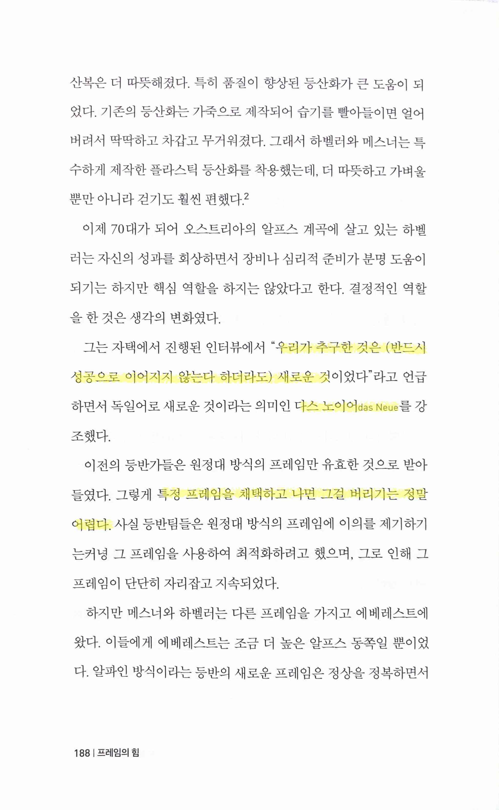

> “우리가 추구한 것은 (반드시 성공으로 이어지지 않는다 하더라도) 새로운 것이었다" 다스 노이어 das Neue를 강조
>
> 특정 프레임을 채택하고 나면 그걸 버리기는 정말 어렵다

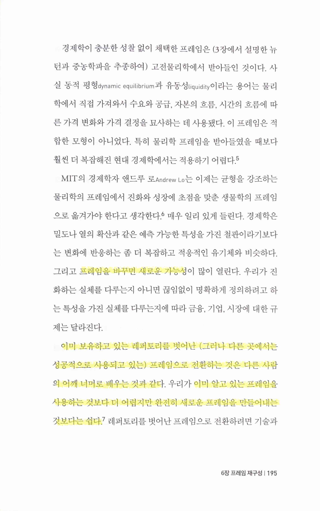

> 프레임을 바꾸면 새로운 가능성
>
> 이미 보유하고 있는 레퍼토리를 벗어난 (그러나 다른 곳에서는 성공적으로 사용되고 있는) 프레임으로 전환하는 것은 다른 사람의 어깨 너머로 배우는 것과 같다. 우리가 이미 알고 있는 프레임을 사용하는 것보다 더 어렵지만 완전히 새로운 프레임을 만들어내는 것보다는 쉽다!

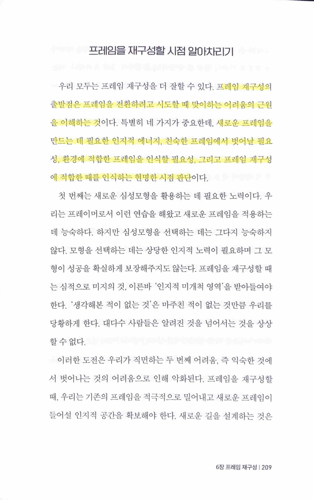

> 프레임 재구성의 출발점은 프레임을 전환하려고 시도할 때 맞이하는 어려움의 근원을 이해하는 것. 새로운 프레임을 만드는 데 필요한 인지적 에너지, 친숙한 프레임에서 벗어날 필요성, 환경에 적합한 프레임을 인식할 필요성, 그리고 프레임 재구성에 적합한 때를 인식하는 현명한 시점 판단

# 7장 학습 Learning
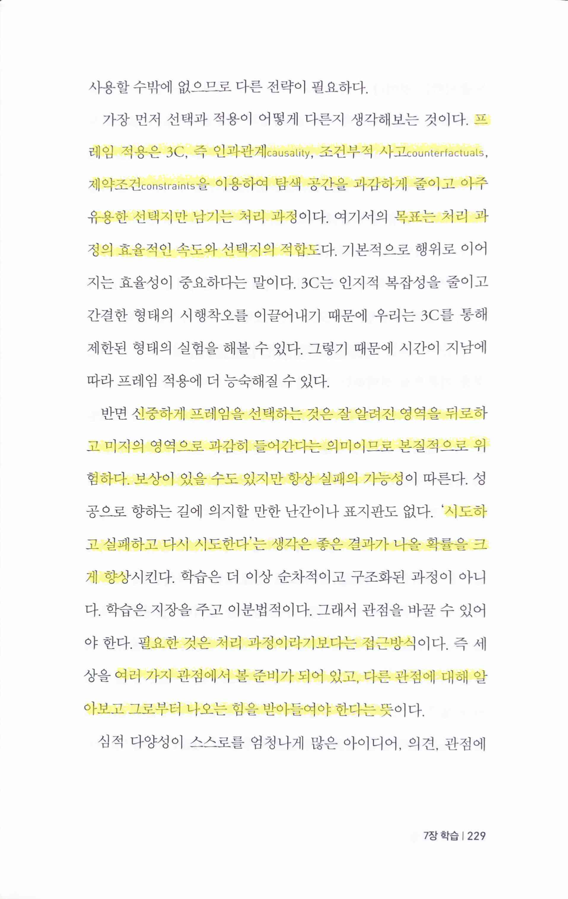

> 프레임 적용은 3C, 즉 `인과관계 causality`, `조건부적 사고 counterfactuals`, `제약조건 constraints` 을 이용하여 탐색 공간을 과감하게 줄이고 아주 유용한 선택지만 남기는 처리 과정. 목표는 처리 과정의 효율적인 속도와 선택지의 적합도
>
> 신중하게 프레임을 선택하는 것은 잘 알려진 영역을 뒤로하고 미지의 영역으로 과감히 들어간다는 의미이므로 본질적으로 위험하다. 보상이 있을 수도 있지만 항상 실패의 가능성. '시도하고 실패하고 다시 시도한다'는 생각은 좋은 결과가 나올 확률을 크게 향상... 필요한 것은 처리 과정이라기보다는 접근방식. 여러 가지 관점에서 볼 준비가 되어 있고, 다른 관점에 대해 알아보고 그로부터 나오는 힘을 받아들여야 한다는 뜻 

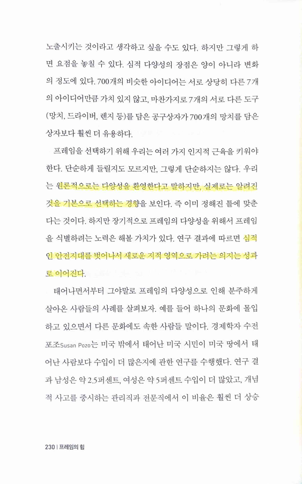

> 원론적으로는 다양성을 환영한다고 말하지만, 실제로는 알려진 것을 기본으로 선택하는 경향. 심적인 안전지대를 벗어나서 새로운 지적 영역으로 가려는 의지는 성과로 이어진다.

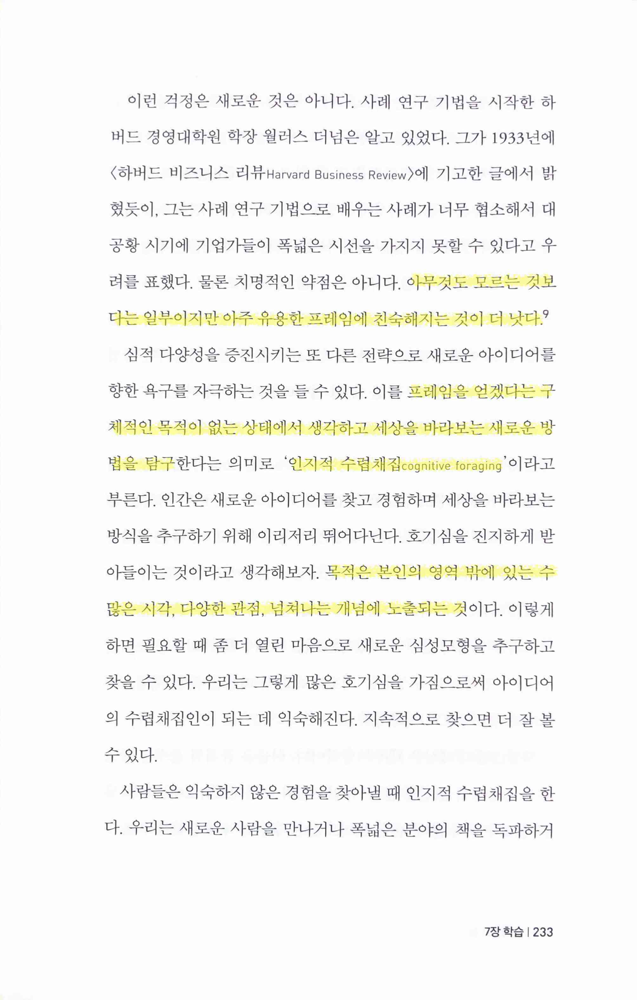

> 아무것도 모르는 것보다는 일부이지만 아주 유용한 프레임에 친숙해지는 것이 더 낫다.
>
> 프레임을 얻겠다는 구체적인 목적이 없는 상태에서 생각하고 세상을 바라보는 새로운 방법을 탐구 `'인지적 수렵채집 cognitive foraging'` 목적은 본인의 영역 밖에 있는 수많은 시각, 다양한 관점, 넘쳐나는 개념에 노출되는 것

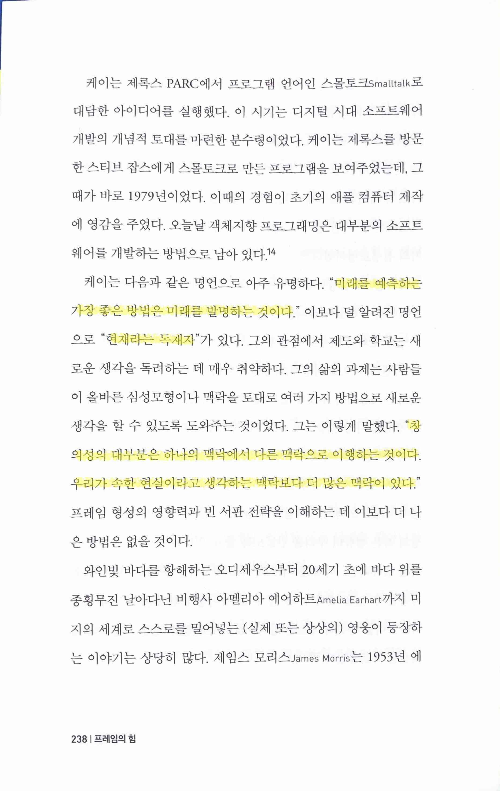

> "미래를 예측하는 가장 좋은 방법은 미래를 발명하는 것이다." "현재라는 독재자" “창의성의 대부분은 하나의 맥락에서 다른 맥락으로 이행하는 것이다. 우리가 속한 현실이라고 생각하는 맥락보다 더 많은 맥락이 있다."

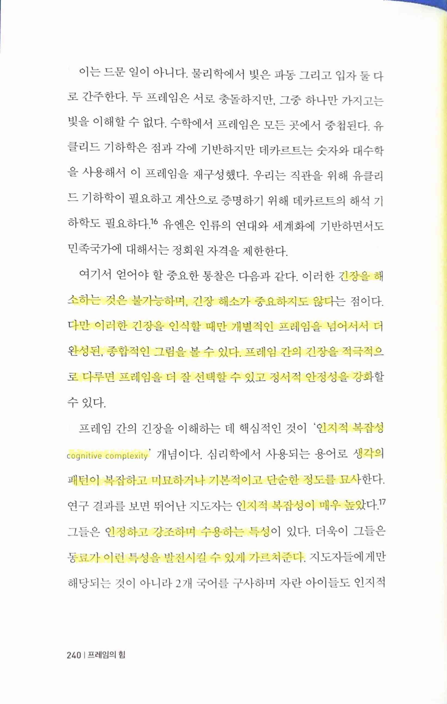

> 긴장을 해소하는 것은 불가능하며, 긴장 해소가 중요하지도 않다. 다만 이러한 긴장을 인식할 때만 개별적인 프레임을 넘어서서 더 완성된 종합적인 그림을 볼 수 있다. 프레임 간의 긴장을 적극적으로 다루면 프레임을 더 잘 선택할 수 있고 정서적 안정성을 강화
>
> `'인지적 복잡성 cognitive complexity'` 생각의 패턴이 복잡하고 미묘하거나 기본적이고 단순한 정도를 묘사. 인지적 복잡성이 매우 높았다. 인정하고 강조하며 수용하는 특성. 동료가 이런 특성을 발전시킬 수 있게 가르쳐준다.

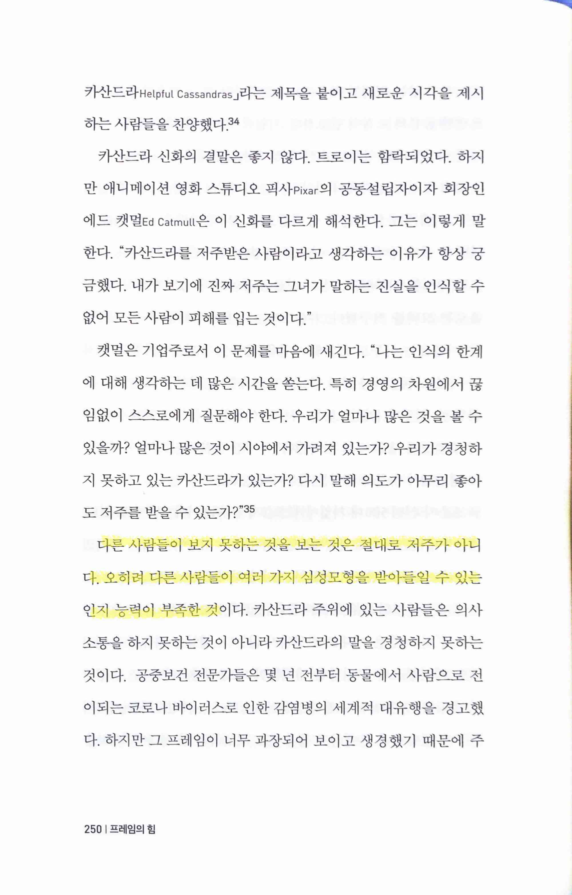

> `카산드라 Cassandras` 다른 사람들이 보지 못하는 것을 보는 것은 절대로 저주가 아니다. 오히려 다른 사람들이 여러 가지 심성모형을 받아들일 수 있는 인지 능력이 부족한 것

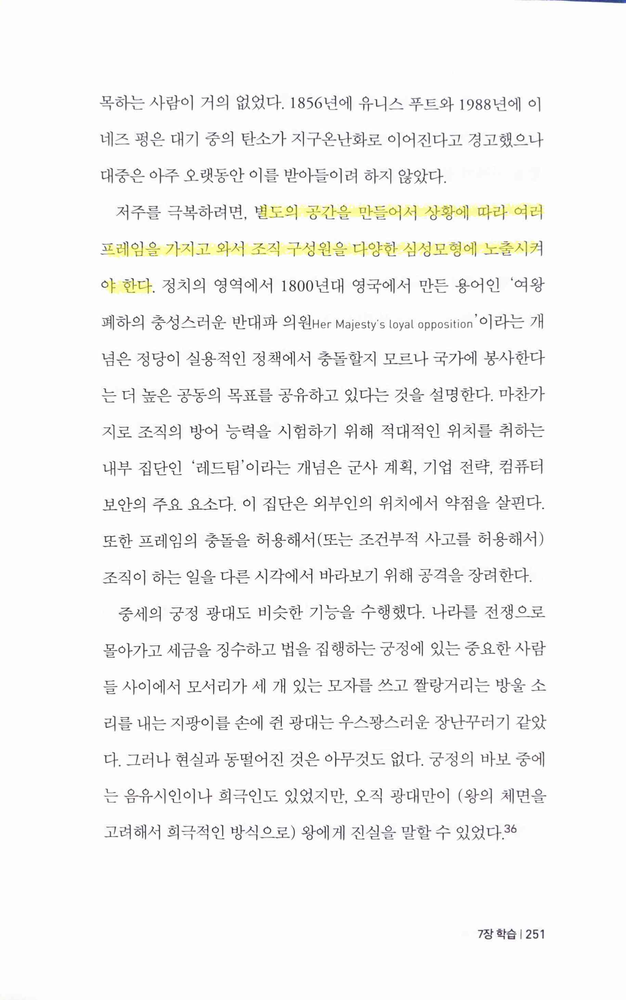

> 별도의 공간을 만들어서 상황에 따라 여러 프레임을 가지고 와서 조직 구성원을 다양한 심성모형에 노출시켜야 한다.

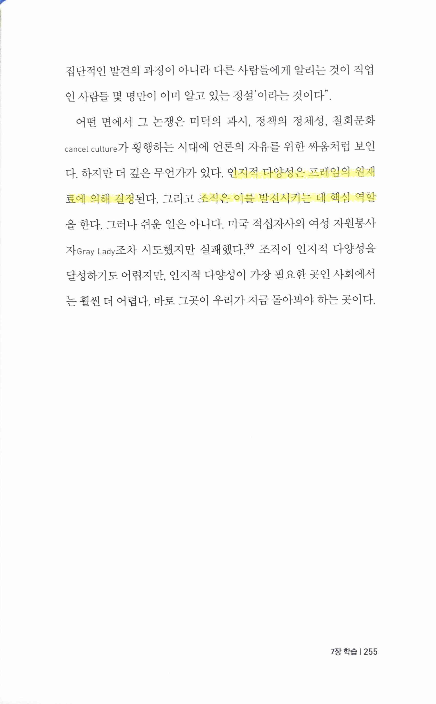

> 인지적 다양성은 프레임의 원재료에 의해 결정. 조직은 이를 발전시키는 데 핵심 역할

# 8장 다원주의 Pluralism
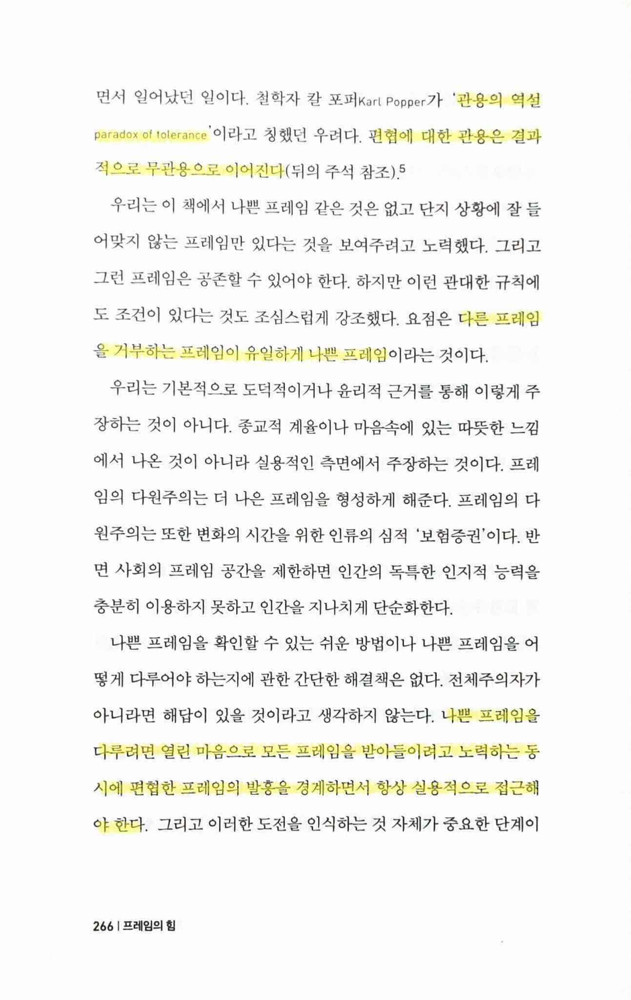

> 칼 포퍼 Karl Popper `'관용의 역설 paradox of tolerance'` 편협에 대한 관용은 결과적으로 무관용으로 이어진다
>
> 다른 프레임을 거부하는 프레임이 유일하게 나쁜 프레임
>
> 나쁜 프레임을 다루려면 열린 마음으로 모든 프레임을 받아들이려고 노력하는 동시에 편협한 프레임의 발흥을 경계하면서 항상 실용적으로 접근해야 한다.

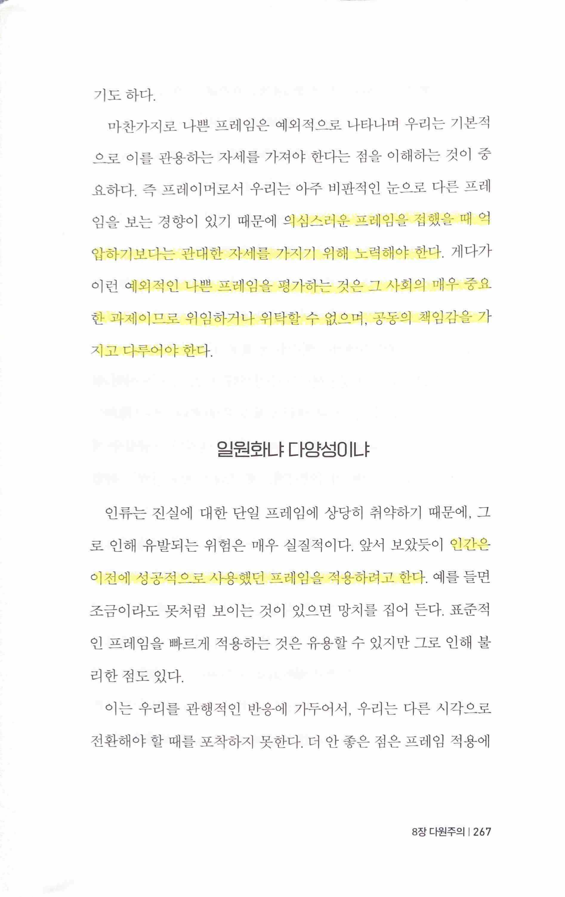

> 의심스러운 프레임을 접했을 때 억압하기보다는 관대한 자세를 가지기 위해 노력해야 한다. 예외적인 나쁜 프레임을 평가하는 것은 그 사회의 매우 중요한 과제이므로 위임하거나 위탁할 수 없으며, 공동의 책임감을 가지고 다루어야 한다.
>
> 인간은 이전에 성공적으로 사용했던 프레임을 적용하려고 한다.

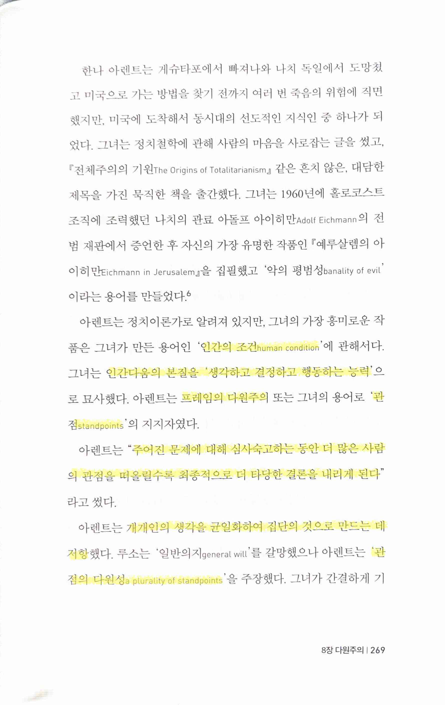

> `'인간의 조건 human condition'` 인간다움의 본질을 '생각하고 결정하고 행동하는 능력'으로 묘사. 프레임의 다원주의 '관점 standpoints'
>
> "주어진 문제에 대해 심사숙고하는 동안 더 많은 사람의 관점을 떠올릴수록 최종적으로 더 타당한 결론을 내리게 된다"
>
> 개개인의 생각을 균일화하여 집단의 것으로 만드는 데 저항. 루소는 `'일반의지 general will'` 아렌트는 `'관점의 다원성 a plurality of standpoints'`

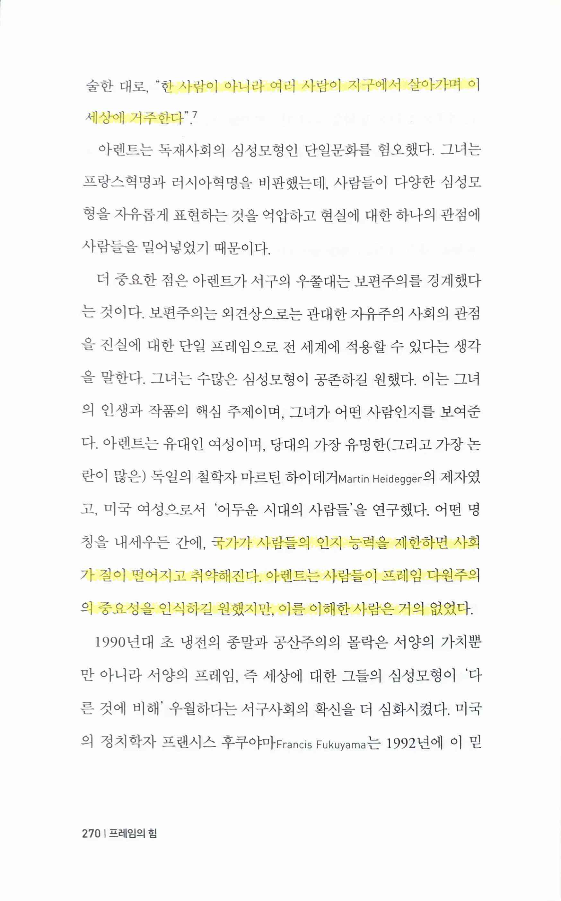

> "한 사람이 아니라 여러 사람이 지구에서 살아가며 이 세상에 거주한다"
>
> 국가가 사람들의 인지 능력을 제한하면 사회가 질이 떨어지고 취약해진다. 아렌트는 사람들이 프레임 다원주의의 중요성을 인식하길 원했지만, 이를 이해한 사람은 거의 없었다.

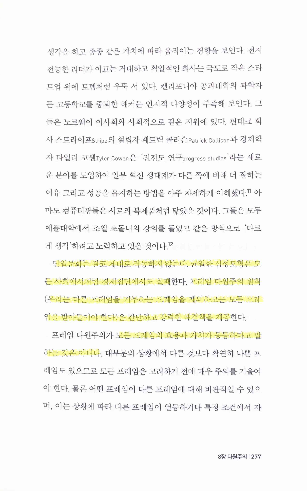

> 단일문화는 결코 제대로 작동하지 않는다. 균일한 심성모형은 모든 사회에서처럼 경제집단에서도 실패. 프레임 다원주의 원칙(우리는 다른 프레임을 거부하는 프레임을 제외하고는 모든 프레임을 받아들여야 한다)은 간단하고 강력한 해결책을 제공
>
> 모든 프레임의 효용과 가치가 동등하다고 말하는 것은 아니다.

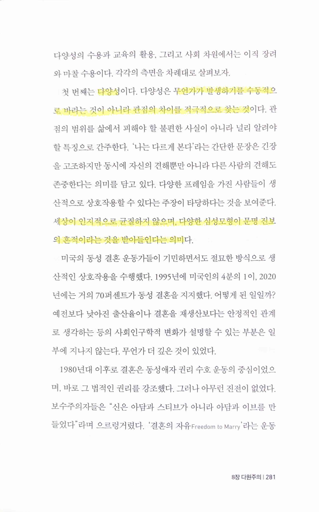

> 다양성. 무언가가 발생하기를 수동적으로 바라는 것이 아니라 관점의 차이를 적극적으로 찾는 것... 세상이 인지적으로 균질하지 않으며, 다양한 심성모형이 문명 진보의 흔적이라는 것을 받아들인다는 의미

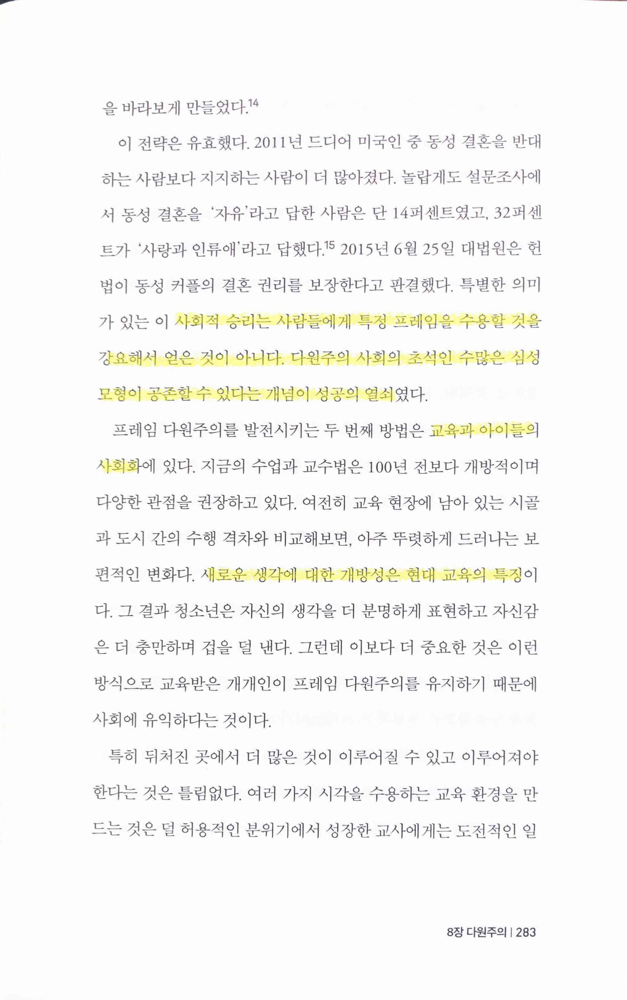

> 사회적 승리는 사람들에게 특정 프레임을 수용할 것을 강요해서 얻은 것이 아니다. 다원주의 사회의 초석인 수많은 심성모형이 공존할 수 있다는 개념이 성공의 열쇠
>
> 교육과 아이들의 사회화. 새로운 생각에 대한 개방성은 현대 교육의 특징

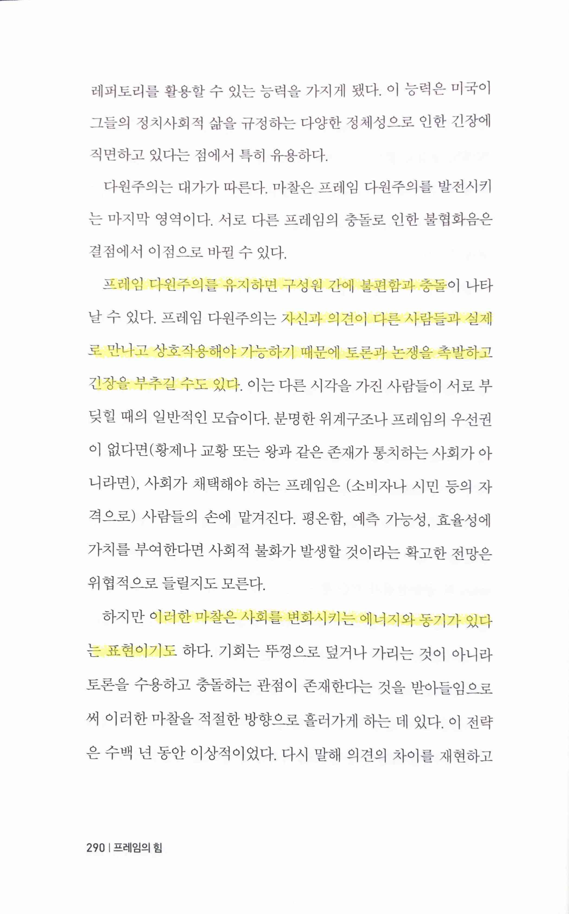

> 프레임 다원주의를 유지하면 구성원 간에 불편함과 충돌. 자신과 의견이 다른 사람들과 실제로 만나고 상호작용해야 가능하기 때문에 토론과 논쟁을 촉발하고 긴장을 부추길 수도 있다.
>
> 이러한 마찰은 사회를 변화시키는 에너지와 동기가 있다는 표현이기도 하다.

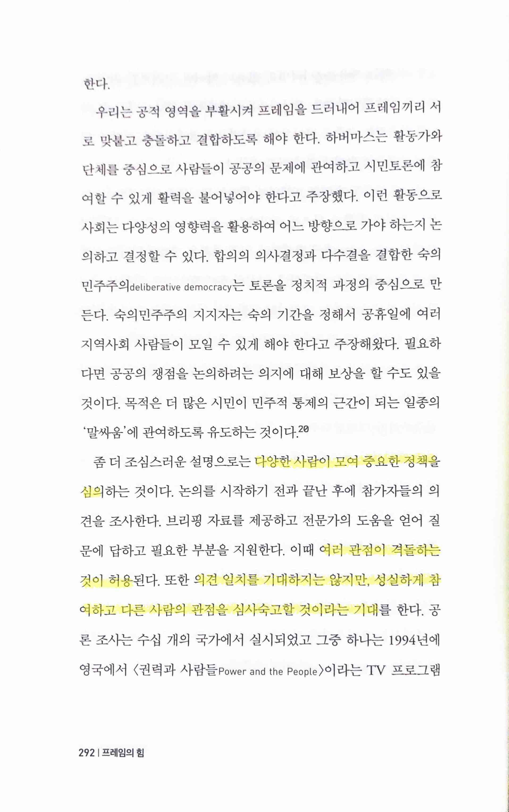

> 다양한 사람이 모여 중요한 정책을 심의. 여러 관점이 격돌하는 것이 허용. 의견 일치를 기대하지는 않지만, 성실하게 참여하고 다른 사람의 관점을 심사숙고할 것이라는 기대

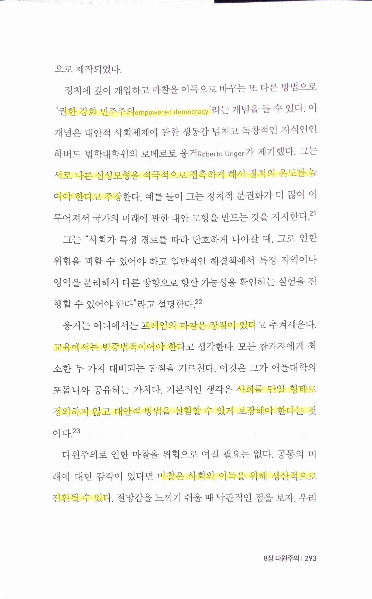

> '권한 강화 민주주의 empowered democracy' 서로 다른 심성모형을 적극적으로 접촉하게 해서 정치의 온도를 높여야 한다
>
> 프레임의 마찰은 장점이 있다. 교육에서는 변증법적이어야 한다. 사회를 단일 형태로 정의하지 않고 대안적 방법을 실험할 수 있게 보장해야 한다
>
> 마찰은 사회의 이득을 위해 생산적으로 전환될 수 있다.

# 9장 경계 Vigilance
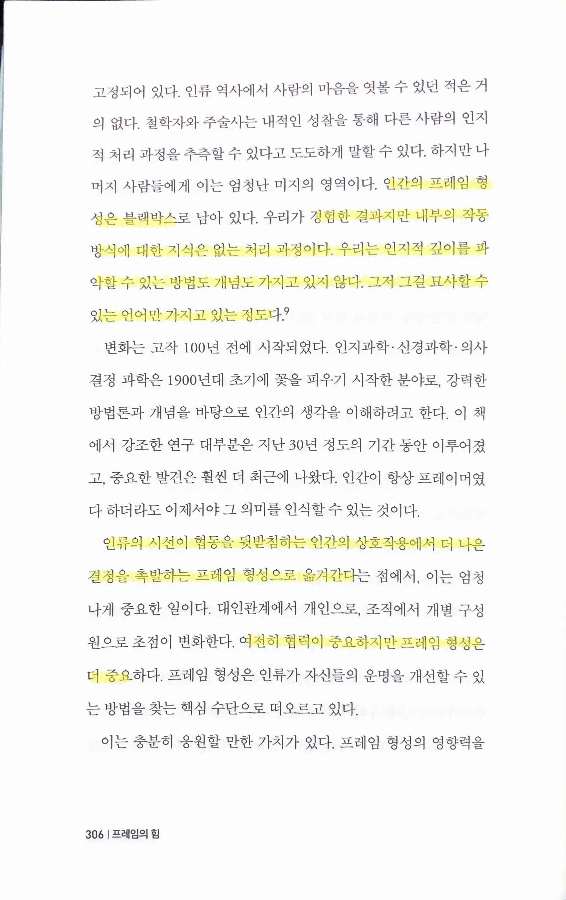

> 인간의 프레임 형성은 블랙박스. 경험한 결과지만 내부의 작동방식에 대한 지식은 없는 처리 과정. 우리는 인지적 깊이를 파악할 수 있는 방법도 개념도 가지고 있지 않다. 그저 그걸 묘사할 수 있는 언어만 가지고 있는 정도
>
> 인류의 시선이 협동을 뒷받침하는 인간의 상호작용에서 더 나은 결정을 촉발하는 프레임 형성으로 옮겨간다... 여전히 협력이 중요하지만 프레임 형성은 더 중요

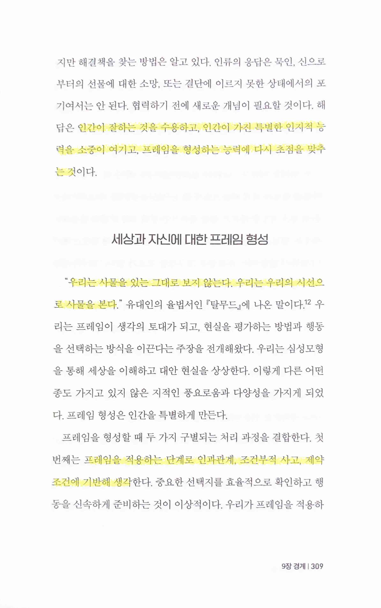

> 인간이 잘하는 것을 수용하고, 인간이 가진 특별한 인지적 능력을 소중이 여기고, 프레임을 형성하는 능력에 다시 초점을 맞추는 것
>
> "우리는 사물을 있는 그대로 보지 않는다. 우리는 우리의 시선으로 사물을 본다." 『탈무드』
>
> 프레임을 적용하는 단계로 인과관계, 조건부적 사고, 제약조건에 기반해 생각

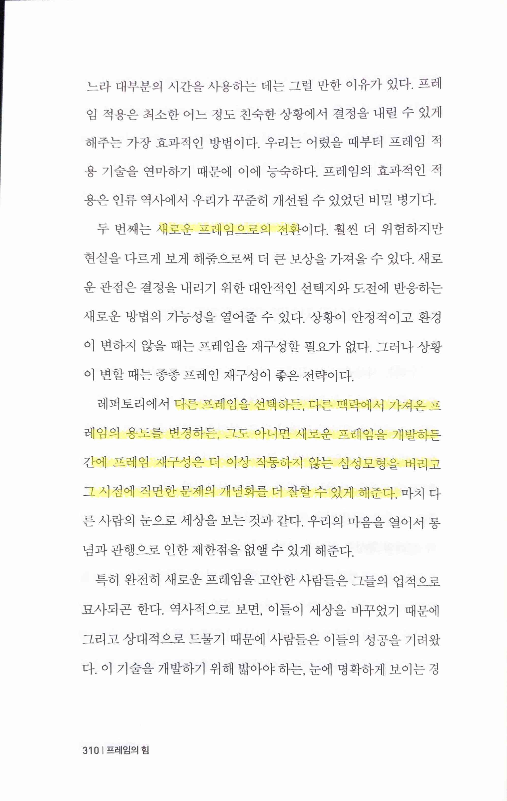

> 새로운 프레임으로의 전환
>
> 다른 프레임을 선택하든, 다른 맥락에서 가져온 프레임의 용도를 변경하든, 그도 아니면 새로운 프레임을 개발하든 간에 프레임 재구성은 더 이상 작동하지 않는 심성모형을 버리고 그 시점에 직면한 문제의 개념화를 더 잘할 수 있게 해준다.

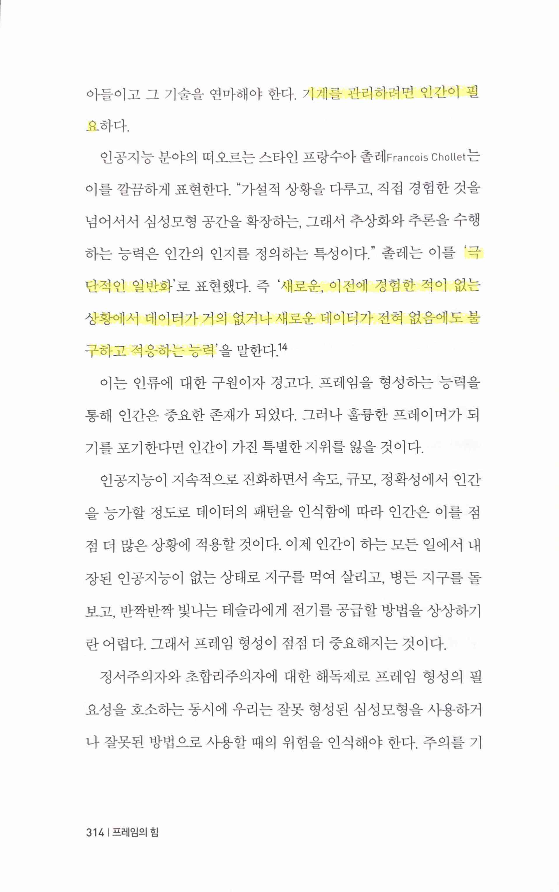

> 기계를 관리하려면 인간이 필요
>
> 프랑수아 홀레 Francois Chollet '극단적인 일반화'. '새로운, 이전에 경험한 적이 없는 상황에서 데이터가 거의 없거나 새로운 데이터가 전혀 없음에도 불구하고 적응하는 능력'

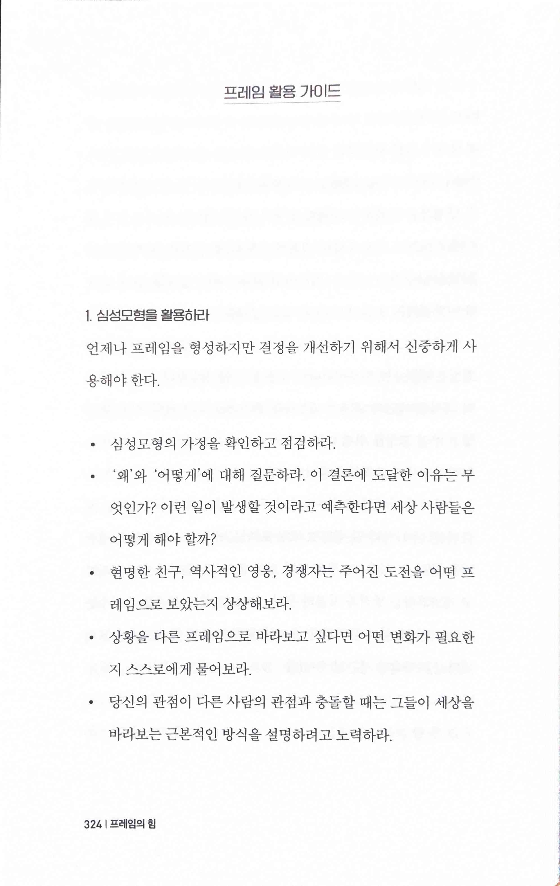
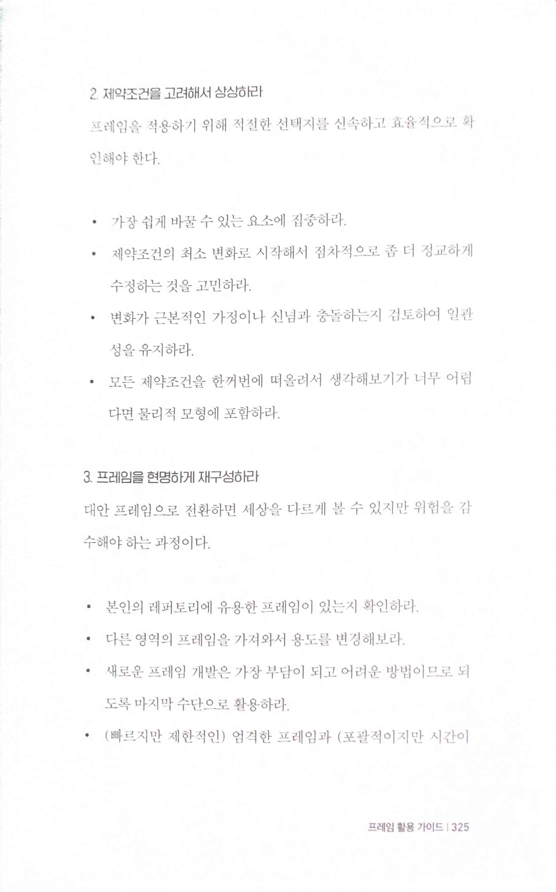
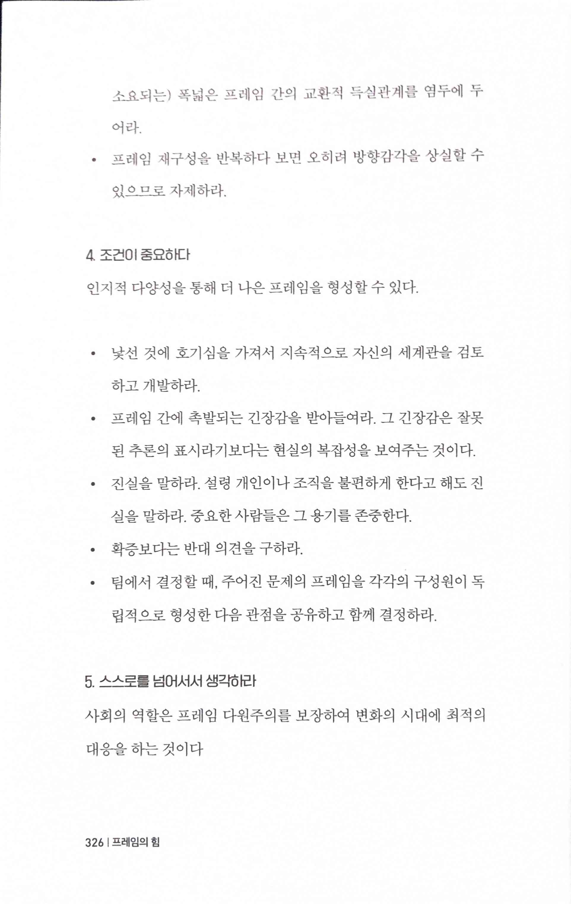
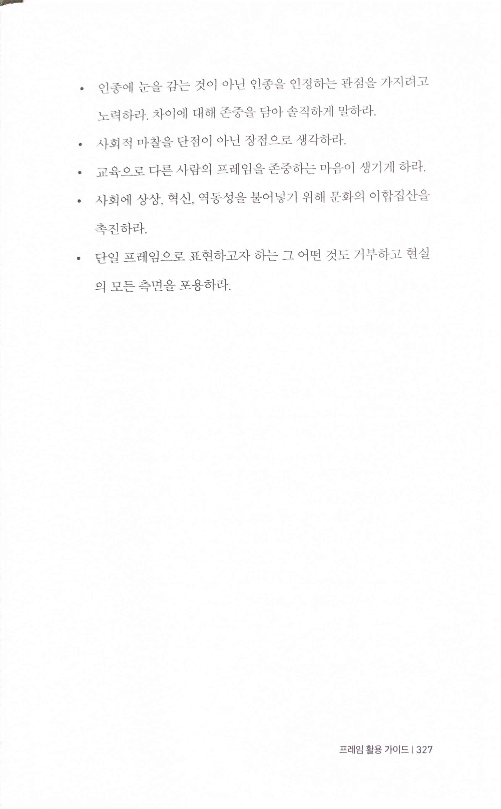