# 한글과 타자기

Tags: history
Date: March 1, 2024
Score: ★★★★☆

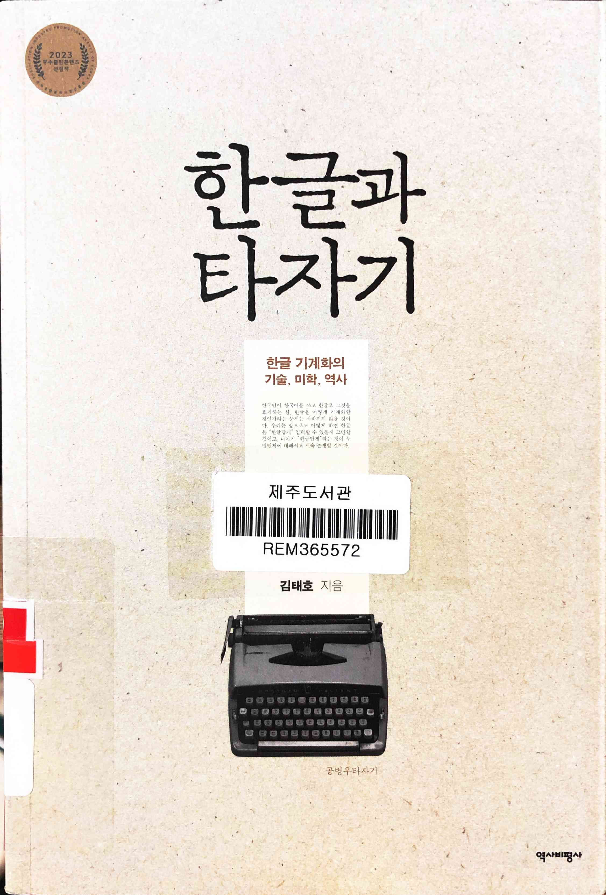

- [한글과 타자기 - 한글 기계화의 기술, 미학, 역사 : 인문교양 - (주)역사비평사](http://yukbi.com/19/12137902)
    - ★★★★☆ March 1, 2024 80~90년대에 컴퓨터를 사용했던 사람들은 한글 사용의 격변기를 지났다고 생각할 수 있는데 그건 컴퓨터를 사용한 이후의 변화였을 뿐, 한글 기계화의 역사는 그 이전부터 시작했고 훨씬 더 격렬했다는 걸 알 수 있다. 가장 유명한 건 역시 공병우이기에 그의 개인사도 꽤 많은 부분을 차지하고 또 흔히 생각하는 이미지와 다른 부분도 있다는 걸 알 수 있어서 흥미로웠으며, 기술만이 아니라 사회 정치적인 부분과도 연결이 된다는 점 역시 많은 시사점이 있다. 매우 좋은, 추천할만한 책
    - 제주 555.72-김832한

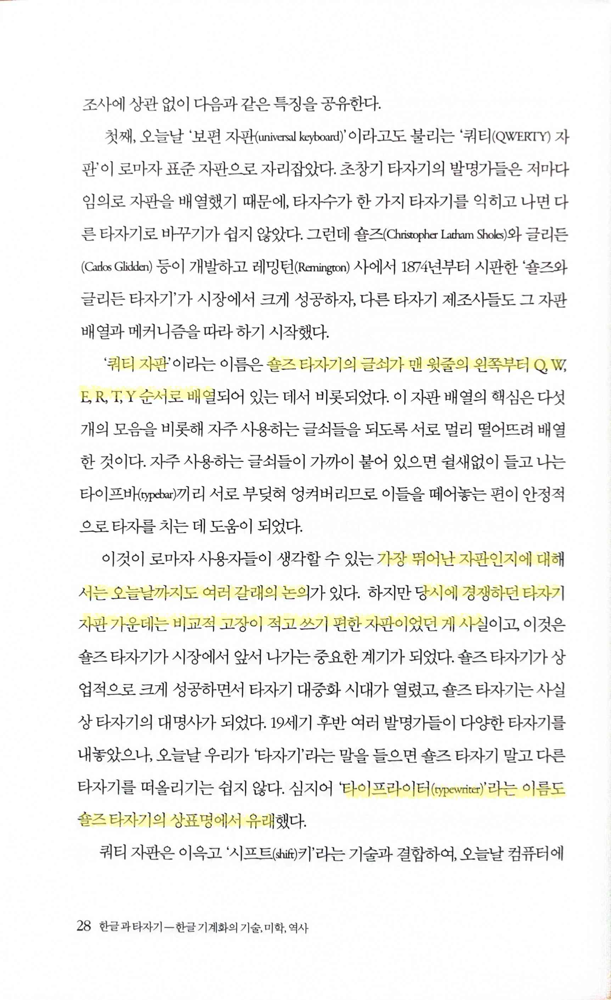

- 숄즈 타자기가 바로 우리가 이야기하는 qwerty 자판의 원조인데, typewriter 유래도 역시 이거였는지는 처음 알았음
    - PMF product market fit이 한 가지 요인으로만 결정되지 않는다는 많은 예 중 하나

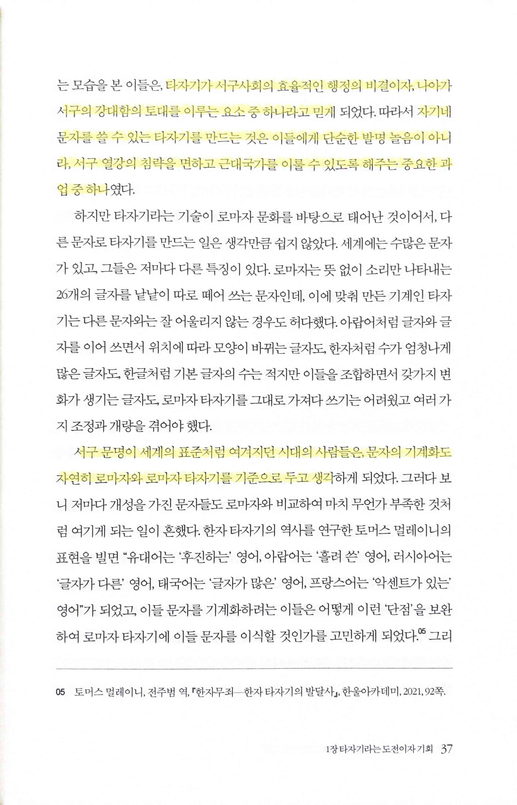

> 타자기가 서구사회의 효율적인 행정의 비결이자, 나아가 서구의 강대함의 토대를 이루는 요소 중 하나라고 믿게… 자기네 문자를 쓸 수 있는 타자기를 만드는 것은 이들에게 단순한 발명 놀음이 아니라, 서구 열강의 침략을 면하고 근대국가를 이룰 수 있도록 해주는 중요한 과업 중 하나
> 
> 
> 서구 문명이 세계의 표준처럼 여겨지던 시대의 사람들은, 문자의 기계화도 자연히 로마자와 로마자 타자기를 기준으로 두고 생각
> 

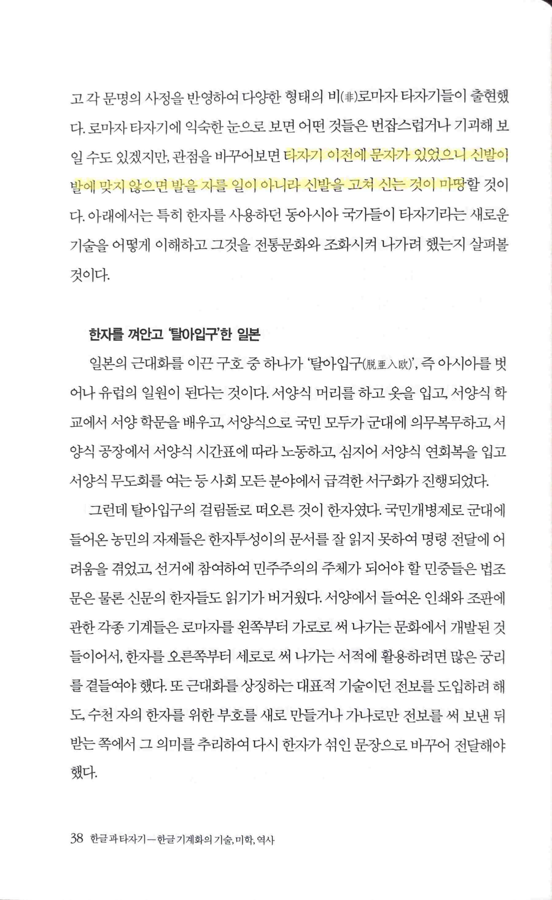

> 타자기 이전에 문자가 있었으니 신발이 발에 맞지 않으면 발을 자를 일이 아니라 신발을 고쳐 신는 것이 마땅
> 

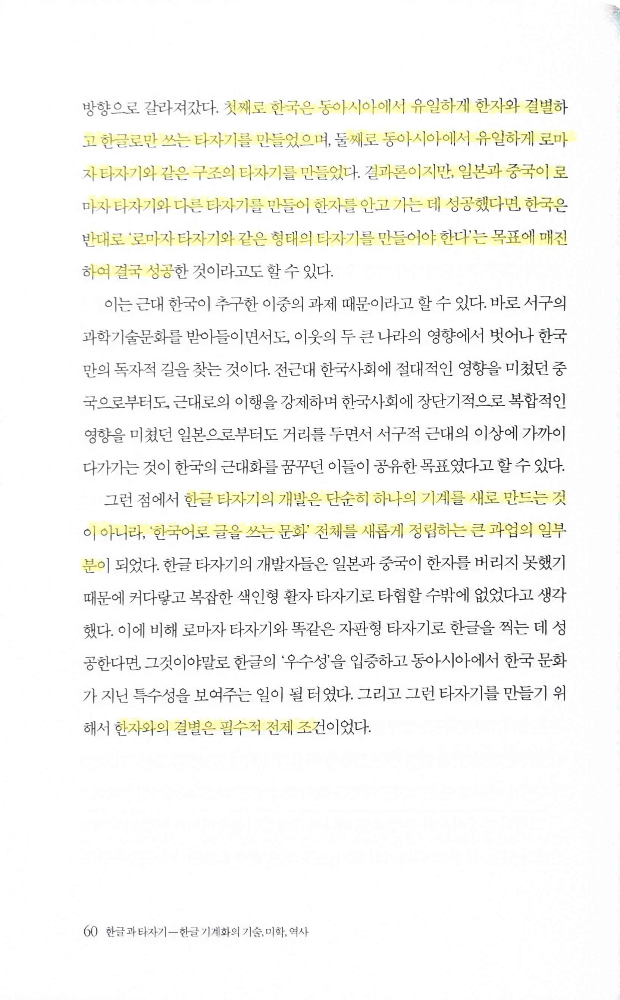

> 첫째로 한국은 동아시아에서 유일하게 한자와 결별하고 한글로만 쓰는 타자기를 만들었으며, 둘째로 동아시아에서 유일하게 로마자 타자기와 같은 구조의 타자기를 만들었다. 결과론이지만, 일본과 중국이 로마자 타자기와 다른 타자기를 만들어 한자를 안고 가는 데 성공했다면, 한국은 반대로 ‘로마자 타자기와 같은 형태의 타자기를 만들어야 한다’는 목표에 매진하여 결국 성공
> 

> 한글 타자기의 개발은 단순히 하나의 기계를 새로 만드는 것이 아니라, ‘한국어로 글을 쓰는 문화’ 전체를 새롭게 정립하는 큰 과업의 일부분… 한자와의 결별은 필수적 전제 조건
> 

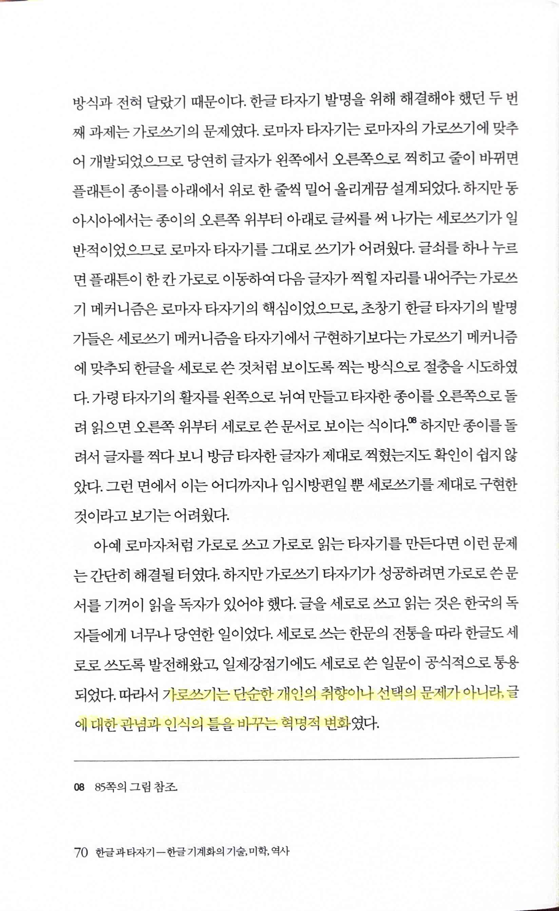

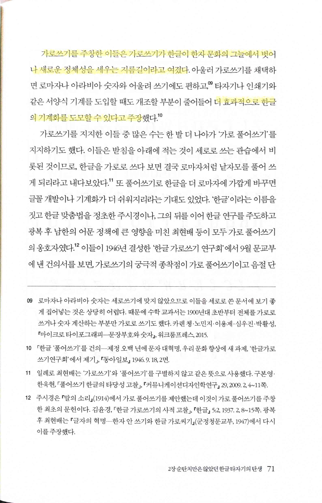

- pp70~71

    > 가로쓰기는 단순한 개인의 취향이나 선택의 문제가 아니라, 글에 대한 관념과 인식의 틀을 바꾸는 혁명적 변화
    > 

    > 가로쓰기를 주창한 이들은 가로쓰기가 한글이 한자 문화의 그늘에서 벗어나 새로운 정체성을 세우는 지름길이라고 여겼다… 더 효과적으로 한글의 기계화를 도모할 수 있다고 주장
    > 

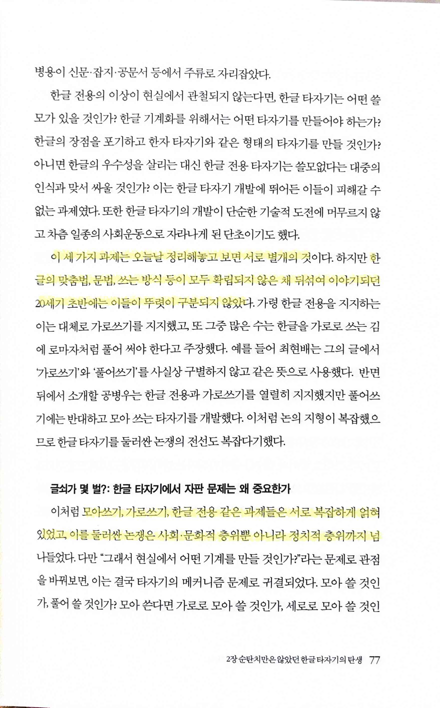

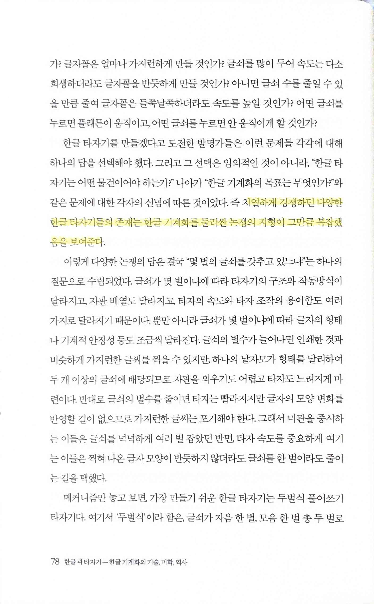

- pp77~78

    > 이 세 가지 과제는 오늘날 정리해놓고 보면 서로 별개의 것… 한글의 맞춤법, 문법, 쓰는 방식 등이 모두 확립되지 않은 채 뒤섞여 이야기되던 20세기 초반에는 이들이 뚜렷이 구분되지 않았다
    > 

    > 모아쓰기, 가로쓰기, 한글 전용 같은 과제들은 서로 복잡하게 얽혀 있었고, 이를 둘러싼 논쟁은 사회 문화적 층위뿐 아니라 정치적 층위까지 넘나들었다
    > 

    > 치열하게 경쟁하던 다양한 한글 타자기들의 존재는 한글 기계화를 둘러싼 논쟁의 지형이 그만큼 복잡했음을 보여준다
    > 

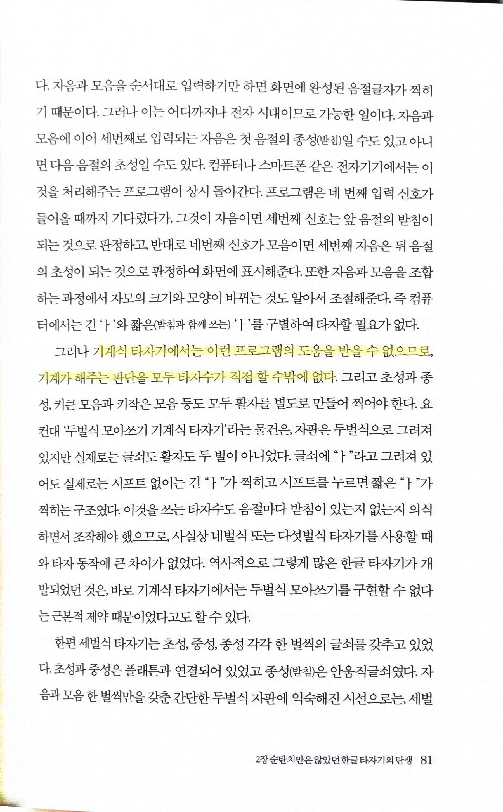

- 모든 기계화, 자동화의 역사에서 발생하는 부분이 여기서도 역시 존재했다

    > 기계식 타자기에서는 이런 프로그램의 도움을 받을 수 없으므로, 기계가 해주는 판단을 모두 타자수가 직접 할 수밖에 없다
    > 

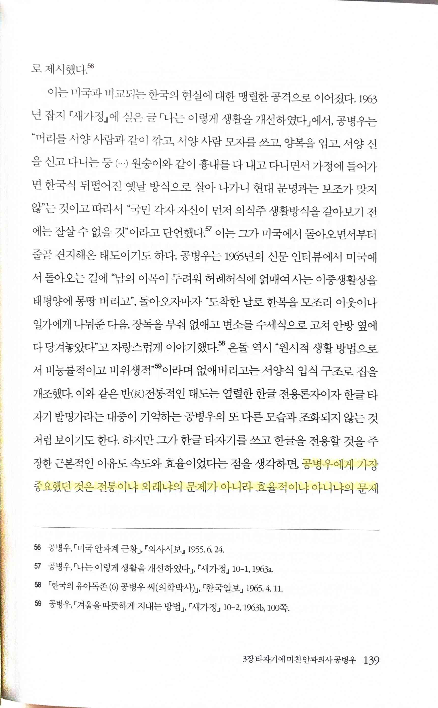

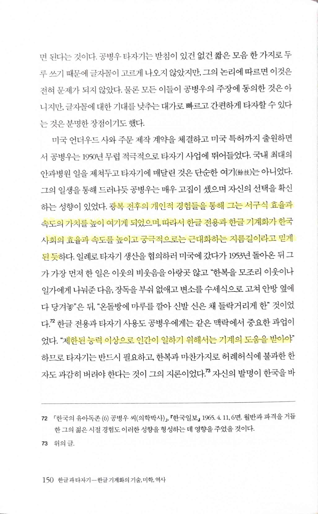

- p139

    > 공병우에게 가장 중요했던 것은 전통이냐 외래냐의 문제가 아니라 효율적이냐 아니냐의 문제
    > 
- p150

    > 광복 전후의 개인적 경험들을 통해 그는 서구식 효율과 속도의 가치를 높이 여기게 되었으며, 따라서 한글 전용과 한글 기계화가 한국 사회의 효율과 속도를 높이고 궁극적으로는 근대화하는 지름길이라고 믿게 된 듯… “제한된 능력 이상으로 인간이 일하기 위해서는 기계의 도움을 받아야”
    > 

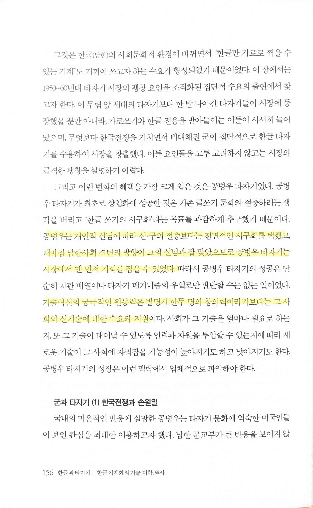

- 개인의 노력도 중요하지만 역시 시대와 상황에 맞는 적정 기술의 중요성, PMF product market fit

    > 공병우는 개인적 신념에 따라 신구의 절충보다는 전면적인 서구화를 택했고, 때마침 남한사회 격변의 방향이 그의 신념과 잘 맞았으므로 공병우 타자기는 시장에서 맨 먼저 기회를 잡을 수 있었다
    > 

    > 기술혁신의 궁극적인 원동력은 발명가 한두 명의 창의력이라기보다는 그 사회의 신기술에 대한 수요와 지원
    > 

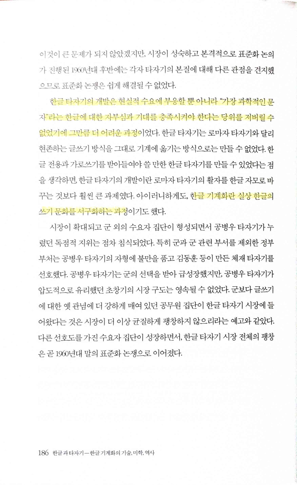

> 한글 타자기의 개발은 현실적 수요에 부응할 뿐 아니라 “가장 과학적인 문자”라는 한글에 대한 자부심과 기대를 충족시켜야 한다는 당위를 저버릴 수 없었기에 그만큼 더 어려운 과정… 한글 기계화란 실상 한글의 쓰기 문화를 서구화하는 과정
>
