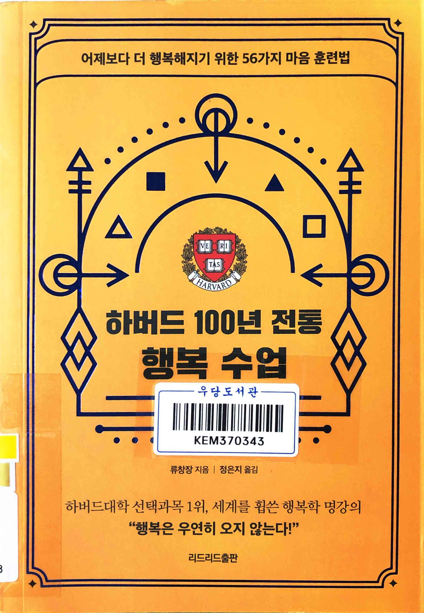
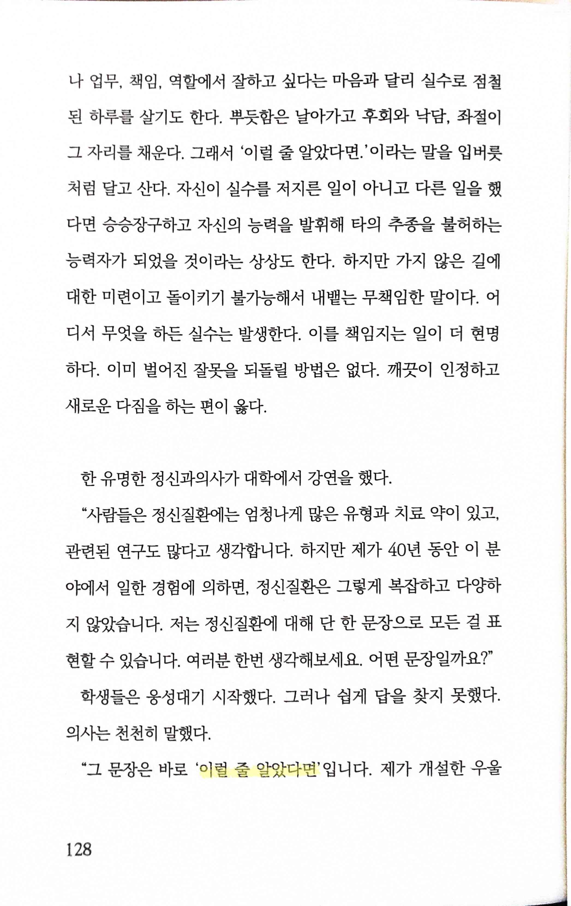
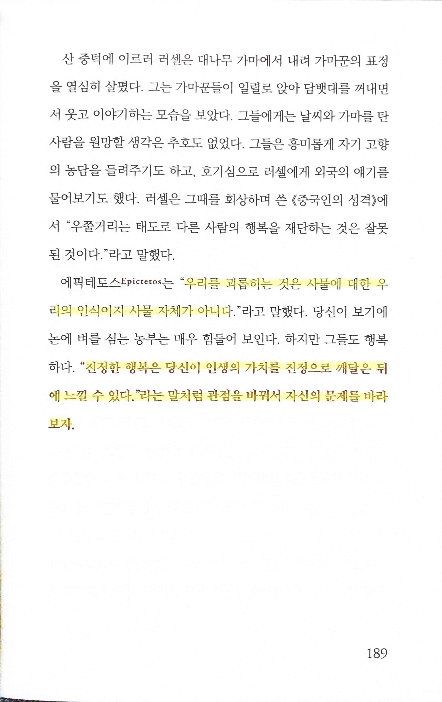
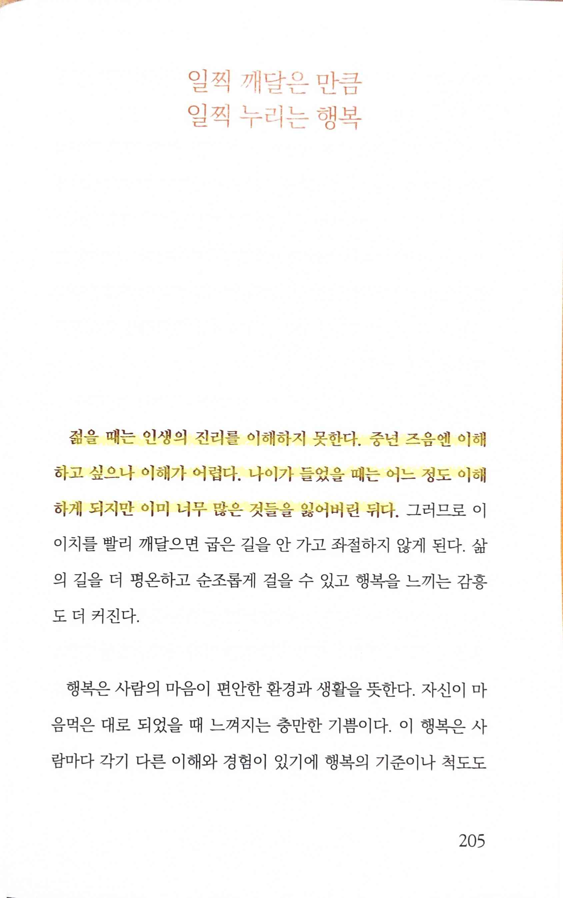

# 하버드 100년 전통 행복 수업

Tags: psychology
Date: March 12, 2024
Score: ★★★☆☆

- 하버드 100년 전통 행복 수업 [세계를 휩쓴 행복한 명강의, 행복은 우연히 오지 않는다 < 종합 < 기사본문 - 문학뉴스](https://www.munhaknews.com/news/articleView.html?idxno=74514)
    - ★★★☆☆ 2024.03.12
    - 우당 문191.6-류811ㅎ
    
    [https://www.youtube.com/watch?v=bhCJyNNqul8](https://www.youtube.com/watch?v=bhCJyNNqul8)
    

- pp128~129
    
    > ‘이럴 줄 알았다면’
    만약 잘못을 통해 깨달음을 얻었다면, 당신은 그 잘못으로 인해 후회할 필요가 없다… 과거는 이미 죽었다. 미래만이 자신의 것이다
    과거는 바꿀 수 없고 우리에게는 두 가지 선택이 있다. 하나는 과거의 경험에 걸려 넘어져서 ‘이럴 줄 알았다면’이라고 후회하며 사는 것이고, 다른 하나는 용감하게 사실을 받아들이고 오늘을 잘 살아가는 것이다
    > 

> 우리를 괴롭히는 것은 사물에 대한 우리의 인식이지 사물 자체가 아니다
> 
> 
> “진정한 행복은 당신이 인생의 가치를 진정으로 깨달은 뒤에 느낄 수 있다”라는 말처럼 관점을 바꿔서 자신의 문제를 바라보자
> 

> 젊을 때는 인생의 진리를 이해하지 못한다. 중년 즈음엔 이해하고 싶으나 이해가 어렵다. 나이가 들었을 때는 어느 정도 이해하게 되지만 이미 너무 많은 것들을 잃어버린 뒤다
> 
- 다른 모든 부분도 마음에 들지만, 가장 마음에 와닿는 건 이 구절. 이래서 뻔한 이야기라고 생각하고, 정말 그럴까 의심하면서도 이런 책을 계속해서 읽게 된단 생각이 들었다. 나이가 더 들어서 많은 것들을 잃어버린 후에는 이해할 수 있을까?
