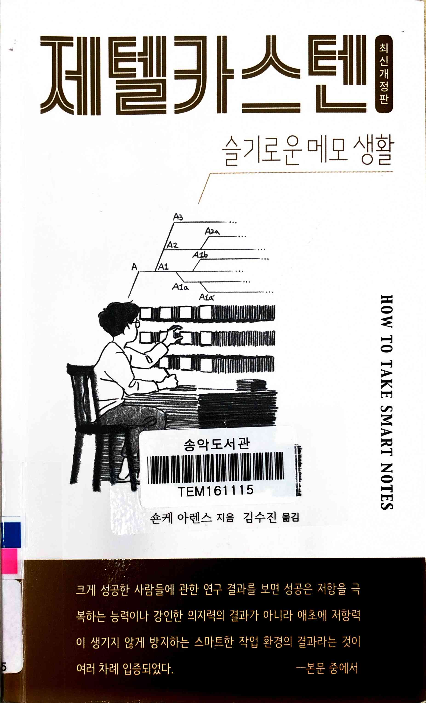
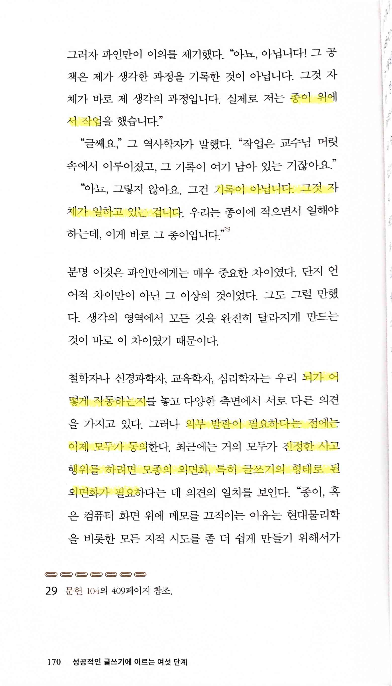
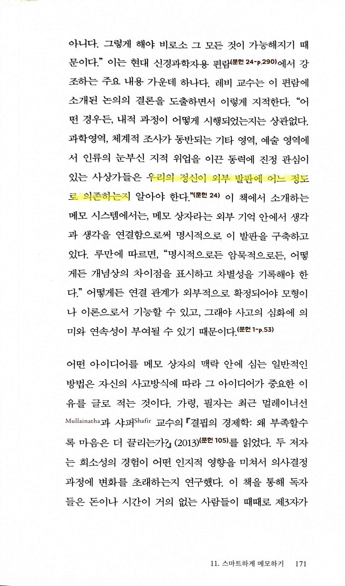
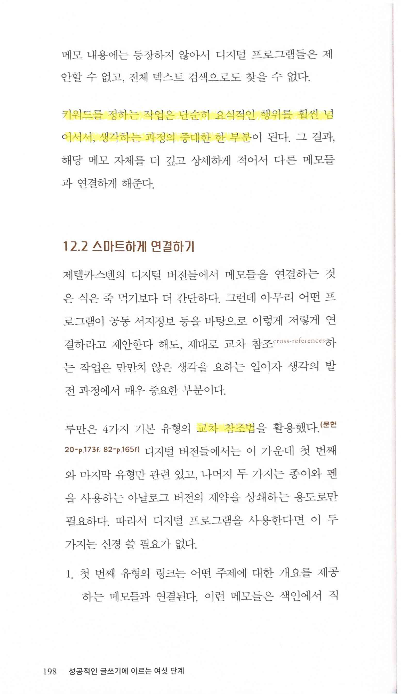
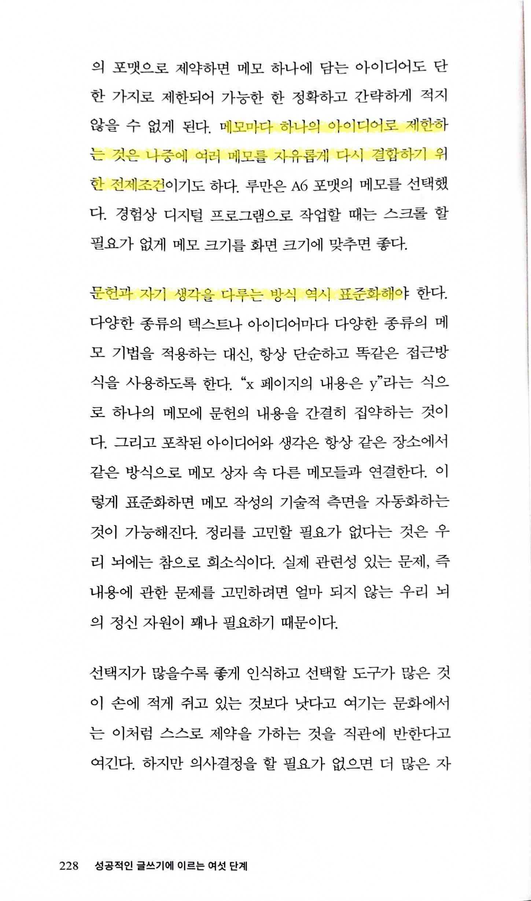
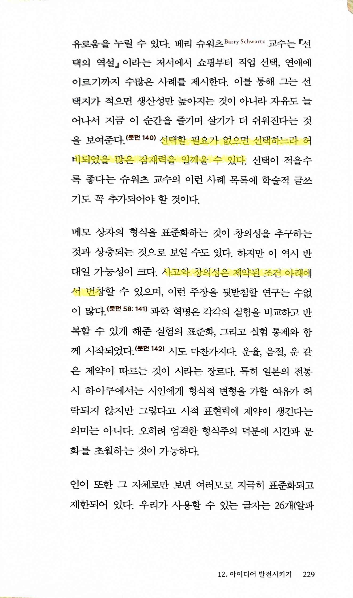
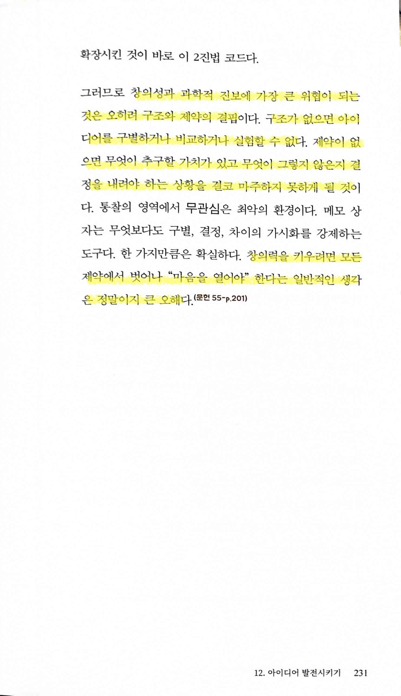

# 제텔카스텐 슬기로운 메모 생활 how to take smart notes

Tags: productivity
Date: January 6, 2025 → January 8, 2025
Score: ★★★☆☆

- ★★★☆☆ January 6, 2025 → January 8, 2025
    - https://www.uni-bielefeld.de/fakultaeten/soziologie/forschung/luhmann-archiv/index.xml
    - https://www.soenkeahrens.de/en/takesmartnotes
    - https://www.zklab.kr/
    - [세컨드 브레인](https://www.notion.so/552613aaee17460abf0a0107668e7fa4?pvs=21)
    - [세컨드 브래인 부스트 second brain boost](https://www.notion.so/second-brain-boost-ac74392f9cb7465486bffe537addcc1b?pvs=21)
- pp170~171 뇌, 우리 정신이 동작하기 위해서는 외부 발판이 필요하고, 이게 일반적으로 글쓰기라는 이야기. 그 대표적인 인물이 리차드 파인만. 파인만의 글쓰기는 작업을 기록하는 게 아니라, 그 자체가 일하는 것이고 작업하는 것이라는 말
    
    
    
    
    
- p198 키워드를 정하는 작업은… 생각하는 과정의 중대한 한 부분 - 어떻게 보면 당연한게, 몇 개의 키워드로 문장을 정리한다는 건 일종의 summary, 대표성을 갖는 단어를 선택하는 작업이므로 생각하는 과정의 중요한 부분이 된다
    
    
    
- pp228~229, p231 제약이 있어야 오히려 창의력이 발휘된다는 이야기, 대표적인 예로 하이쿠를 들었음
    
    
    
    
    
    
    
    - 창의성과 과학적 진보에 가장 큰 위협이 되는 것은 오히려 구조와 제약의 결핍
    - 구조가 없으면 아이디어를 구별하거나 비교하거나 실험할 수 없다
    - 제약이 없으면 무엇이 추구할 가치가 있고 무엇이 그렇지 않은지 결정을 내려야 하는 상황을 결코 마주하지 못하게 될 것
    - 창의력을 키우려면 모든 제약에서 벗어나 “마음을 열어야” 한다는 일반적인 생각은 정말이지 큰 오해
