인류본사 오리엔트-중동의 눈으로 본 1만 2,000년 인류사
=====================================================
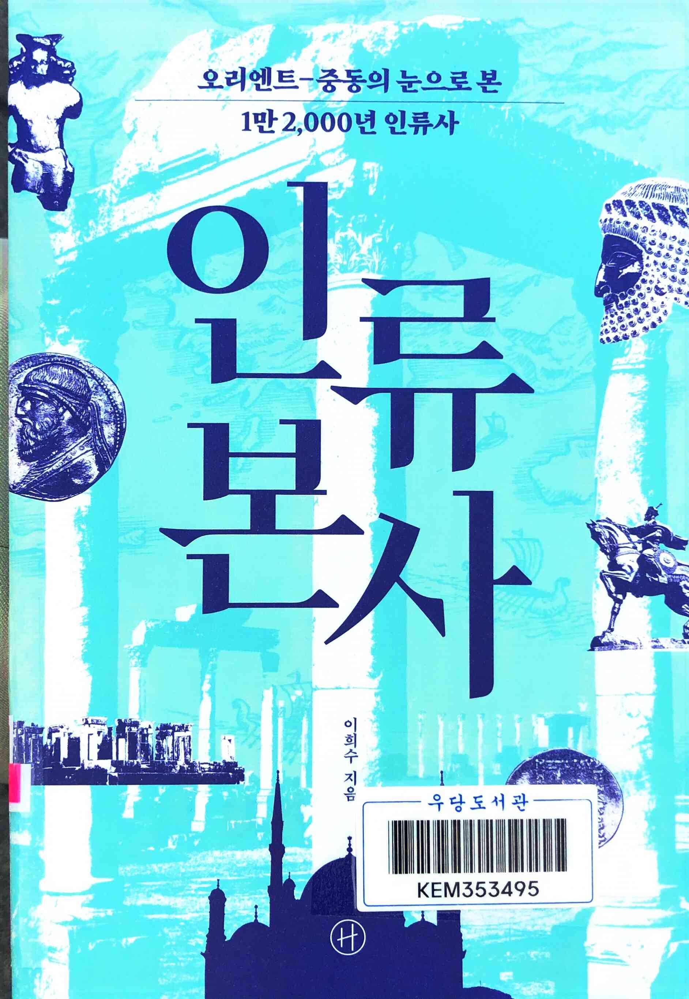

* [“중동의 눈으로 본 1만 2,000년 인류사” 이희수의 신간도서 『인류 본사』 < 책과 사람 < 기사본문 - 한국강사신문](http://www.lecturernews.com/news/articleView.html?idxno=99337)
* [중동—이슬람 문화에 대한 올바른 이해는 왜 필요할까? - YouTube](https://www.youtube.com/watch?v=Nd53A1KUNSg)
* [파르티아 제국(부제 : 로마에 맞서 300년을 버틴 강국) - YouTube](https://www.youtube.com/watch?v=rQK1YzGobVw)

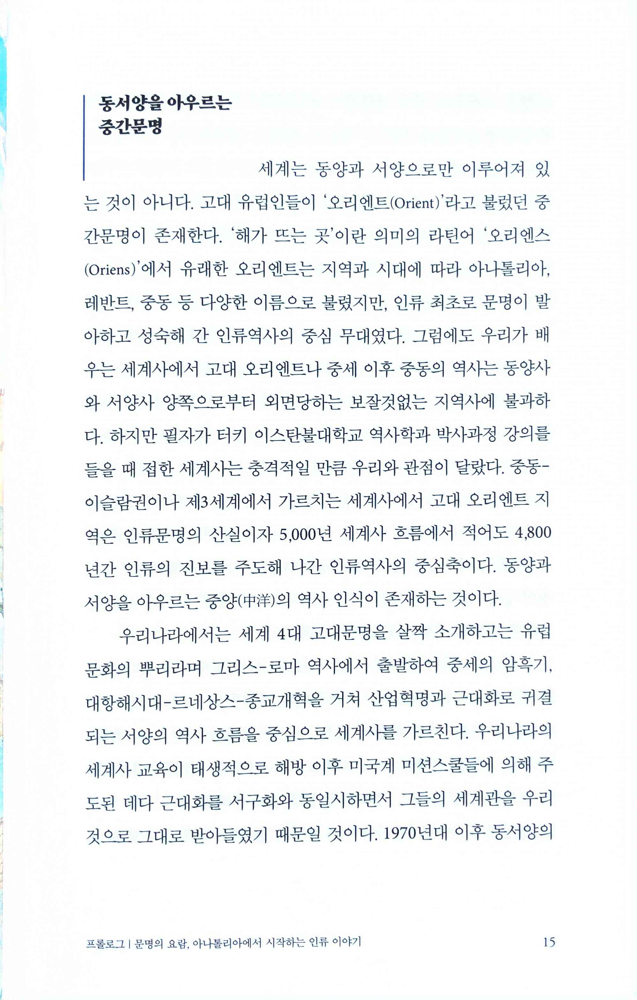

> 세계는 동양과 서양으로만 이루어져 있는 것이 아니다. 고대 유럽인들이 '오리엔트(Orient)'라고 불렀던 중간문명이 존재한다. '해가 뜨는 곳'이란 의미의 라틴어 `'오리엔스(Oriens)'`에서 유래한 오리엔트는 지역과 시대에 따라 아나톨리아, 레반트, 중동 등 다양한 이름으로 불렸지만, 인류 최초로 문명이 발아하고 성숙해 간 인류역사의 중심 무대였다.
>
> 우리나라의 세계사 교육이 태생적으로 해방 이후 미국계 미션스쿨들에 의해 주도된 데다 근대화를 서구화와 동일시하면서 그들의 세계관을 우리것으로 그대로 받아들였기 때문일 것이다.
* 여전히 우리나라에서도 보기 쉬운 대서양이 중심에 있는 세계지도들이 대표적인 예

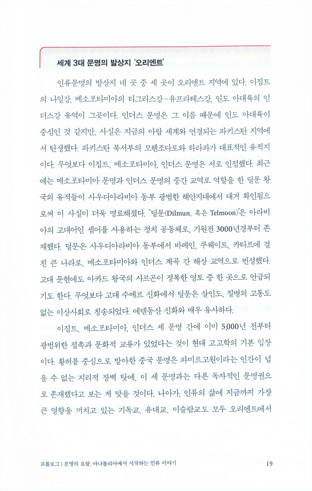

> 인류문명의 발상지 네 곳 중 세 곳이 오리엔트 지역에 있다. 이집트의 나일강, 메소포타미아의 티그리스강-유프라테스강, 인도 아대륙의 인더스강 유역이 그곳이다.
>
> 이집트, 메소포타미아, 인더스 세 문명 간에 이미 5,000 년 전부터 광범위한 접촉과 문화적 교류가 있었다는 것이 현대 고고학의 기본 입장이다.

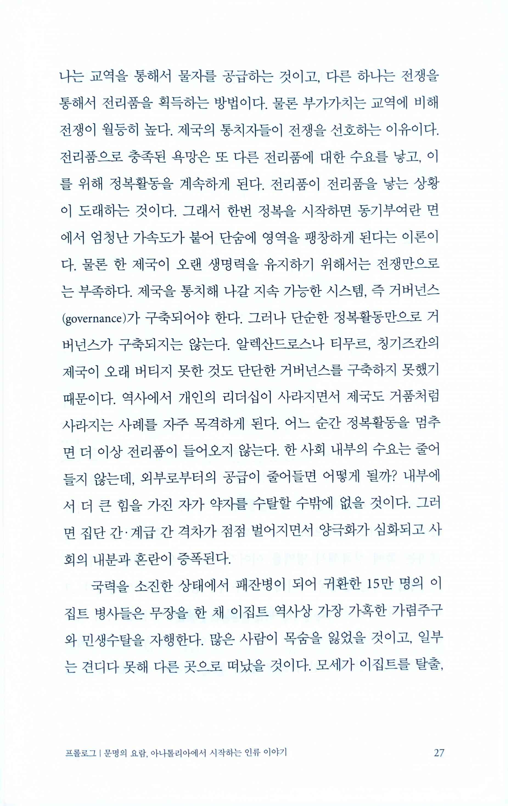

> 한 제국이 오랜 생명력을 유지하기 위해서는 전쟁만으로는 부족하다. 제국을 통치해 나갈 지속 가능한 시스템, 즉 `거버넌스(governance)`가 구축되어야 한다.

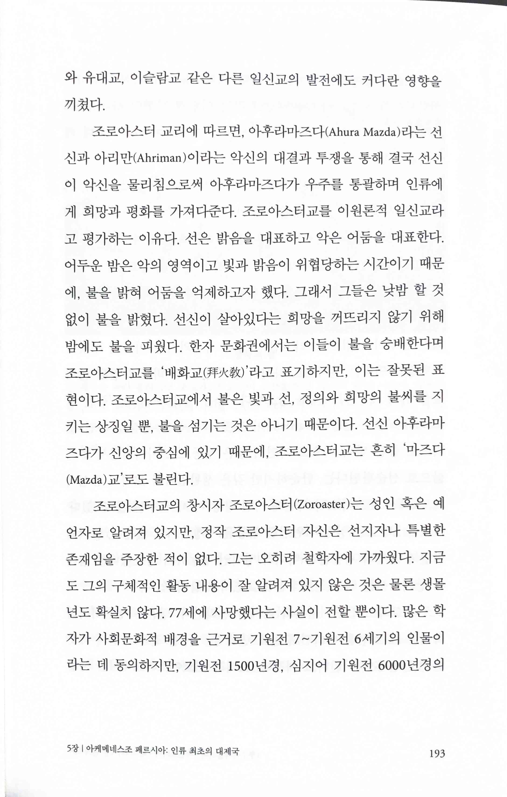

> 조로아스터 교리에 따르면, `아후라마즈다(Ahura Mazda)`라는 선신과 `아리만(Ahriman)`이라는 악신의 대결과 투쟁을 통해 결국 선신이 악신을 물리침으로써 아후라마즈다가 우주를 통괄하며 인류에게 희망과 평화를 가져다준다. 조로아스터교를 이원론적 일신교라고 평가하는 이유다... 한자 문화권에서는 이들이 불을 숭배한다며 조로아스터교를 '배화교(拜火敎)'라고 표기하지만, 이는 잘못된 표현이다. 조로아스터교에서 불은 빛과 선, 정의와 희망의 불씨를 지키는 상징일 뿐, 불을 섬기는 것은 아니기 때문이다. 선신 아후라마즈다가 신앙의 중심에 있기 때문에, 조로아스터교는 흔히 '마즈다(Mazda)교'로도 불린다.
* 결국 수많은 무협지 속 명교 明敎에 대한 묘사도 잘못된 인식에 바탕을 둔 것

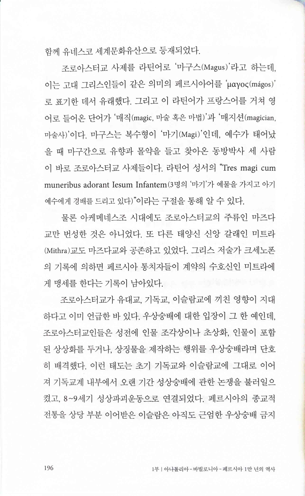

> 조로아스터교 사제를 라틴어로 `'마구스(Magus)'`라고 하는데... 마구스는 복수형이 `'마기(Magi)'`인데, 예수가 태어났을 때 마구간으로 유향과 몰약을 들고 찾아온 동방박사 세 사람이 바로 조로아스터교 사제들이다. 라틴어 성서의 “Tres magi cummuneribus adorant Iesum Infantem (3명의 '기'가 예물을 가지고 아기 예수에게 경배를 드리고 있다)"이라는 구절을 통해 알 수 있다.
>
> 조로아스터교가 유대교, 기독교, 이슬람교에 끼친 영향이 지대하다고 이미 언급한 바 있다. 우상숭배에 대한 입장이 그 한 예인데, 조로아스터교인들은 성전에 인물 조각상이나 초상화, 인물이 포함된 상상화를 두거나, 상징물을 제작하는 행위를 우상숭배라며 단호히 배격했다. 이런 태도는 초기 기독교와 이슬람교에 그대로 이어져 기독교계 내부에서 오랜 기간 성상숭배에 관한 논쟁을 불러일으켰고, 8~9세기 성상파괴운동으로 연결되었다. 페르시아의 종교적 전통을 상당 부분 이어받은 이슬람은 아직도 근엄한 우상숭배 금지

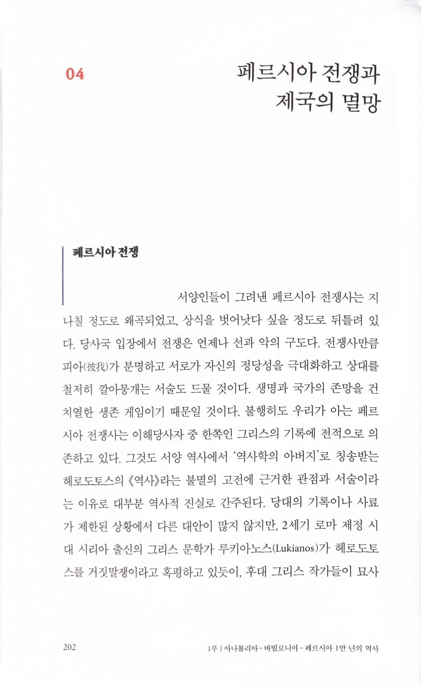 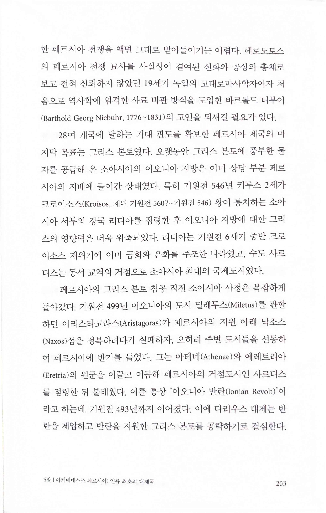

> 서양인들이 그려낸 페르시아 전쟁사는 지나칠 정도로 왜곡되었고, 상식을 벗어낫다 싶을 정도로 뒤틀려 있다... 불행히도 우리가 아는 페르시아 전쟁사는 이해당사자 중 한쪽인 그리스의 기록에 전적으로 의존하고 있다. 그것도 서양 역사에서 '역사학의 아버지'로 칭송받는 헤로도토스의 《역사》라는 불멸의 고전에 근거한 관점과 서술이라는 이유로 대부분 역사적 진실로 간주된다. 당대의 기록이나 사료가 제한된 상황에서 다른 대안이 많지 않지만, 2세기 로마 제정 시대 시리아 출신의 그리스 문학가 루키아노스(Lukianos)가 헤로도토스를 거짓말쟁이라고 혹평하고 있듯이, 후대 그리스 작가들이 묘사한 페르시아 전쟁을 액면 그대로 받아들이기는 어렵다. 헤로도토스의 페르시아 전쟁 묘사를 사실성이 결여된 신화와 공상의 총체로보고 전혀 신뢰하지 않았던 19세기 독일의 고대로마사학자이자 처음으로 역사학에 엄격한 사료 비판 방식을 도입한 바르톨드 니부어(Barthold Georg Niebuhr, 1776~1831)의 고언을 되새길 필요가 있다.

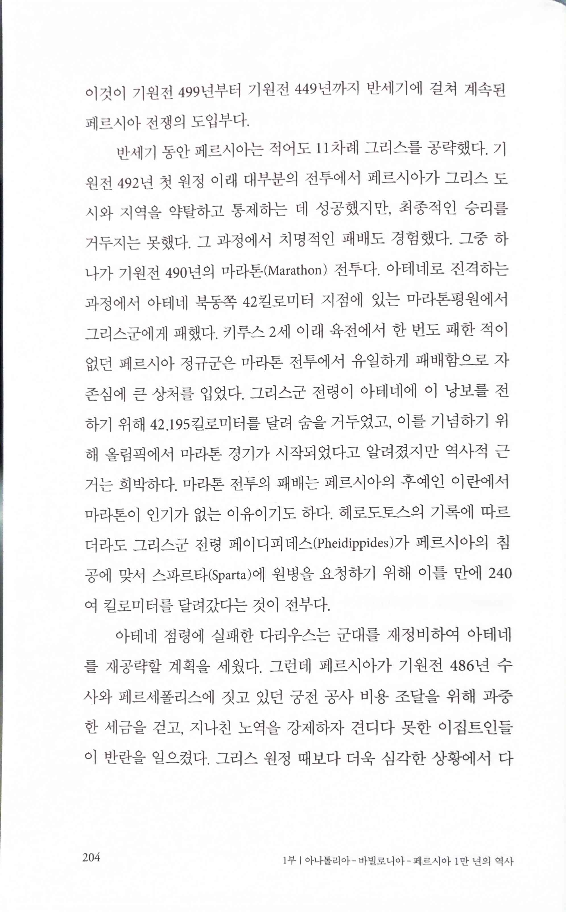

> 반세기 동안 페르시아는 적어도 11차례 그리스를 공략했다. 기원전 492년 첫 원정 이래 대부분의 전투에서 페르시아가 그리스 도시와 지역을 약탈하고 통제하는 데 성공했지만, 최종적인 승리를 거두지는 못했다. 그 과정에서 치명적인 패배도 경험했다. 그중 하나가 기원전 490 년의 `마라톤(Marathon)` 전투다. 아테네로 진격하는 과정에서 아테네 북동쪽 42 킬로미터 지점에 있는 마라톤평원에서 그리스군에게 패했다. 키루스 2세 이래 육전에서 한 번도 패한 적이 없던 페르시아 정규군은 마라톤 전투에서 유일하게 패배함으로 자존심에 큰 상처를 입었다. 그리스군 전령이 아테네에 이 낭보를 전하기 위해 42.195킬로미터를 달려 숨을 거두었고, 이를 기념하기 위해 올림픽에서 마라톤 경기가 시작되었다고 알려졌지만 역사적 근거는 희박하다.
* 마라톤이 올림픽의 꽃으로 우대받는 이유도 결국은 서양 중심의 역사관에 의했던 것

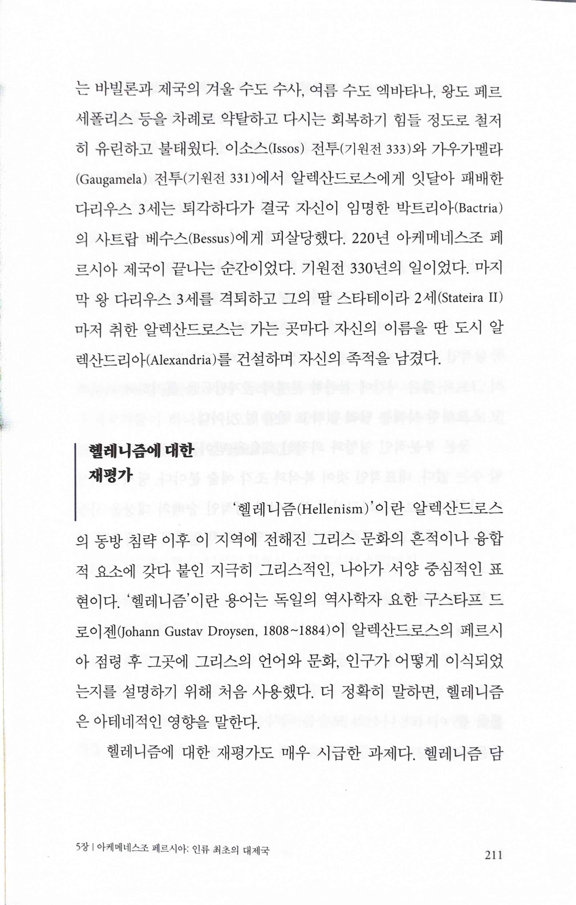 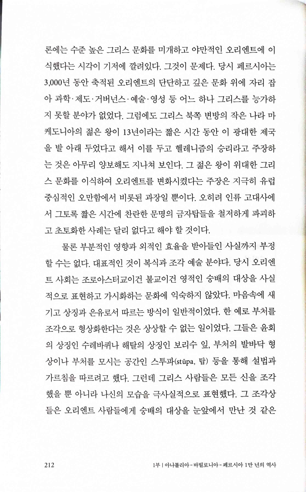 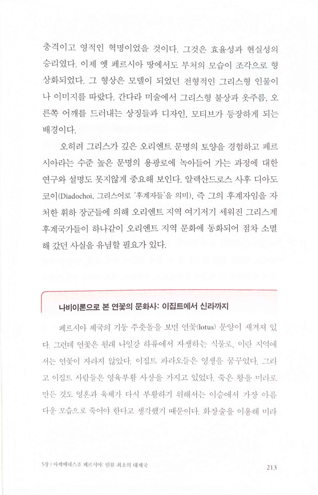

> `'헬레니즘(Hellenism)'`이란 알렉산드로스의 동방 침략 이후 이 지역에 전해진 그리스 문화의 흔적이나 융합적 요소에 갖다 붙인 지극히 그리스적인, 나아가 서양 중심적인 표현이다. '헬레니즘'이란 용어는 독일의 역사학자 요한 구스타프 드로이젠(Johann Gustay Droysen, 1808~1884) 이 알렉산드로스의 페르시아 점령 후 그곳에 그리스의 언어와 문화, 인구가 어떻게 이식되었는지를 설명하기 위해 처음 사용했다. 더 정확히 말하면, 헬레니즘은 아테네적인 영향을 말한다.
>
> 헬레니즘에 대한 재평가도 매우 시급한 과제다. 헬레니즘 담론에는 수준 높은 그리스 문화를 미개하고 야만적인 오리엔트에 이식했다는 시각이 기저에 깔려있다. 그것이 문제다. 당시 페르시아는3,000년 동안 축적된 오리엔트의 단단하고 깊은 문화 위에 자리 잡아 과학·제도·거버넌스·예술·영성 등 어느 하나 그리스를 능가하지 못할 분야가 없었다. 그럼에도 그리스 북쪽 변방의 작은 나라 마케도니아의 젊은 왕이 13년이라는 짧은 시간 동안 이 광대한 제국을 발 아래 두었다고 해서 이를 두고 헬레니즘의 승리라고 주장하는 것은 아무리 양보해도 지나쳐 보인다. 그 젊은 왕이 위대한 그리스 문화를 이식하여 오리엔트를 변화시켰다는 주장은 지극히 유럽중심적인 오만함에서 비롯된 과장일 뿐이다. 오히려 인류 고대사에서 그토록 짧은 시간에 찬란한 문명의 금자탑들을 철저하게 파괴하고 초토화한 사례는 달리 없다고 해야 할 것이다.
>
> 오히려 그리스가 깊은 오리엔트 문명의 토양을 경험하고 페르시아라는 수준 높은 문명의 용광로에 녹아들어 가는 과정에 대한 연구와 설명도 못지않게 중요해 보인다. 알렉산드로스 사후 `디아도코이` (`Diadochoi`, 그리스어로 '후계자들'을 의미), 즉 그의 후계자임을 자처한 휘하 장군들에 의해 오리엔트 지역 여기저기 세워진 그리스계 후계국가들이 하나같이 오리엔트 지역 문화에 동화되어 점차 소멸해 갔던 사실을 유념할 필요가 있다.

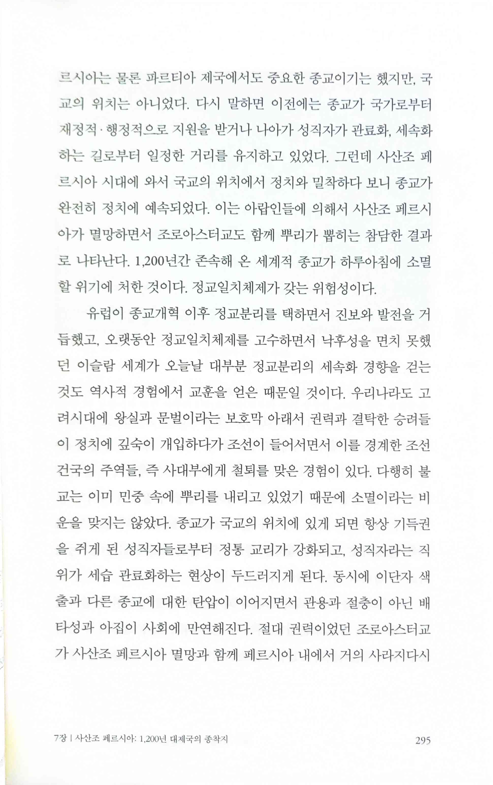

> 이전에는 종교가 국가로부터 재정적·행정적으로 지원을 받거나 나아가 성직자가 관료화, 세속화하는 길로부터 일정한 거리를 유지하고 있었다. 그런데 사산조 페르시아 시대에 와서 국교의 위치에서 정치와 밀착하다 보니 종교가 완전히 정치에 예속되었다. 이는 아랍인들에 의해서 사산조 페르시아가 멸망하면서 조로아스터교도 함께 뿌리가 뽑히는 참담한 결과로 나타난다. 1,200년간 존속해 온 세계적 종교가 하루아침에 소멸할 위기에 처한 것이다. 정교일치체제가 갖는 위험성이다.
* SPoF처럼 이해해도 되는 걸까?
> 종교가 국교의 위치에 있게 되면 항상 기득권을 쥐게 된 성직자들로부터 정통 교리가 강화되고, 성직자라는 직위가 세습 관료화하는 현상이 두드러지게 된다. 동시에 이단자 색출과 다른 종교에 대한 탄압이 이어지면서 관용과 절충이 아닌 배타성과 아집이 사회에 만연해진다.
* 절대 권력은 절대 부패하는 거와 마찬가지인 걸까?

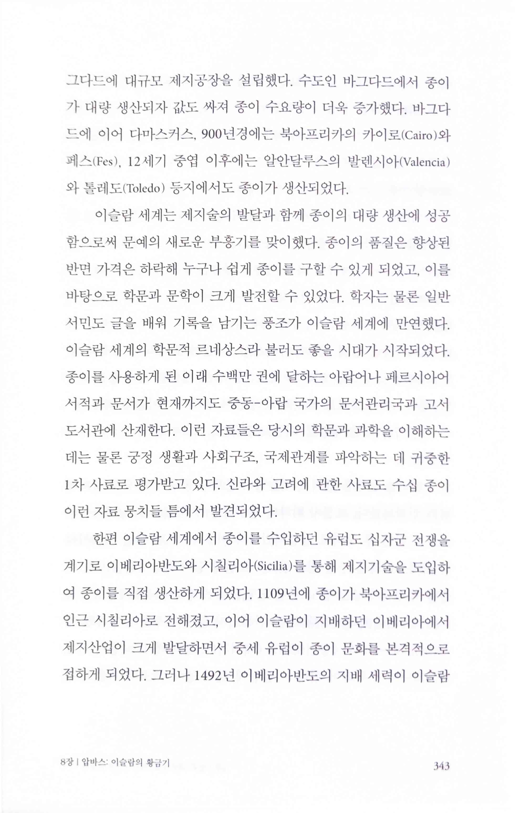

> 이슬람 세계는 제지술의 발달과 함께 종이의 대량 생산에 성공함으로써 문예의 새로운 부흥기를 맞이했다. 종이의 품질은 향상된 반면 가격은 하락해 누구나 쉽게 종이를 구할 수 있게 되었고, 이를 바탕으로 학문과 문학이 크게 발전할 수 있었다. 학자는 물론 일반 서민도 글을 배워 기록을 남기는 풍조가 이슬람 세계에 만연했다.이슬람 세계의 학문적 르네상스라 불러도 좋을 시대가 시작되었다.
* 이런 걸 보면 고선지의 탈라스 전투 패배가 세계사에 정말 큰 역할을 했다. 
* 마치 지금은 인터넷을 통해 네트워크를 따라 business가 발전하듯이 종이 제지술을 통해 지식과 정보가 유통되면서 발전을 가져왔다고 이해해도 될까? 구텐베르크의 인쇄술만큼 효과가 있는 건지는 이 책의 내용만으로는 잘 모르겠다.

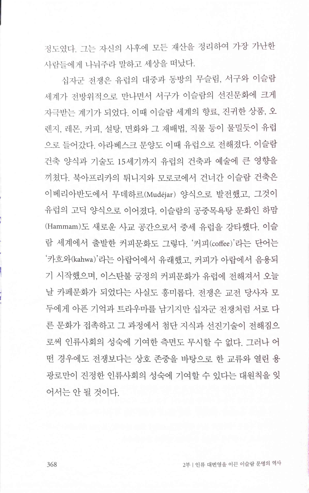

> 십자군 전쟁은 유럽의 대중과 동방의 무슬림, 서구와 이슬람 세계가 전방위적으로 만나면서 서구가 이슬람의 선진문화에 크게 자극받는 계기가 되었다. 이때 이슬람 세계의 향료, 진귀한 상품, 오렌지, 레몬, 커피, 설탕, 면화와 그 재배법, 직물 등이 물밀듯이 유럽으로 들어갔다. `아라베스크` 문양도 이때 유럽으로 전해졌다. 이슬람 건축 양식과 기술도 15세기까지 유럽의 건축과 예술에 큰 영향을 끼쳤다. 북아프리카의 튀니지와 모로코에서 건너간 이슬람 건축은 이베리아반도에서 `무데하르(Mudéjar)` 양식으로 발전했고, 그것이 유럽의 `고딕` 양식으로 이어졌다. 이슬람의 공중목욕탕 문화인 `하맘(Hammam)`도 새로운 사교 공간으로서 중세 유럽을 강타했다. 이슬람 세계에서 출발한 커피문화도 그렇다. '커피 (coffee)'라는 단어는 `'카흐와(kahwa)'`라는 아랍어에서 유래했고, 커피가 아랍에서 음용되기 시작했으며, 이스탄불 궁정의 커피문화가 유럽에 전해져서 오늘날 카페문화가 되었다는 사실도 흥미롭다.

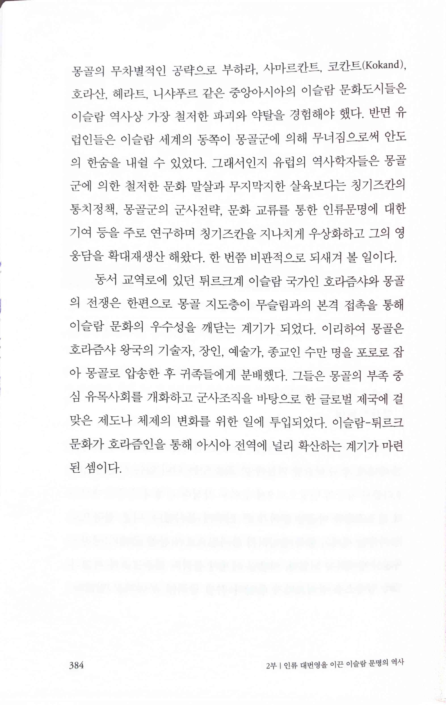

> 몽골의 무차별적인 공략으로 부하라, 사마르칸트, 코칸트(Kokand), 호라산, 헤라트, 니샤푸르 같은 중앙아시아의 이슬람 문화도시들은 이슬람 역사상 가장 철저한 파괴와 약탈을 경험해야 했다. 반면 유럽인들은 이슬람 세계의 동쪽이 몽골군에 의해 무너짐으로써 안도의 한숨을 내쉴 수 있었다. 그래서인지 유럽의 역사학자들은 몽골군에 의한 철저한 문화 말살과 무지막지한 살육보다는 칭기즈칸의 통치정책, 몽골군의 군사전략, 문화 교류를 통한 인류문명에 대한 기여 등을 주로 연구하며 칭기즈칸을 지나치게 우상화하고 그의 영웅담을 확대재생산 해왔다. 한 번쯤 비판적으로 되새겨 볼 일이다.
* 칭기즈칸도 과대 평가되었다는 의미일까?

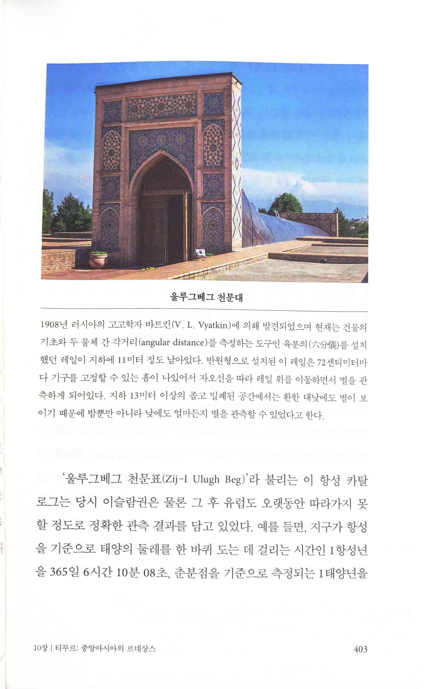 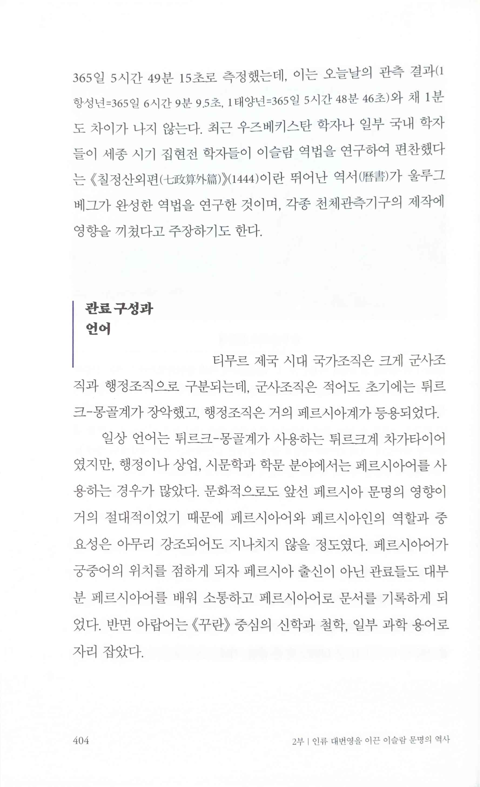

> '울루그베그 천문표(Zij-I Ulugh Beg)'
>
> 최근 우즈베키스탄 학자나 일부 국내 학자들이 세종 시기 집현전 학자들이 이슬람 역법을 연구하여 편찬했다는 《칠정산외편(七政算外篇)》(1444)이란 뛰어난 역서(曆書)가 울루그 베그가 완성한 역법을 연구한 것이며, 각종 천체관측기구의 제작에 영향을 끼쳤다고 주장하기도 한다.
* 어떤 근거인지 정말 흥미롭다.

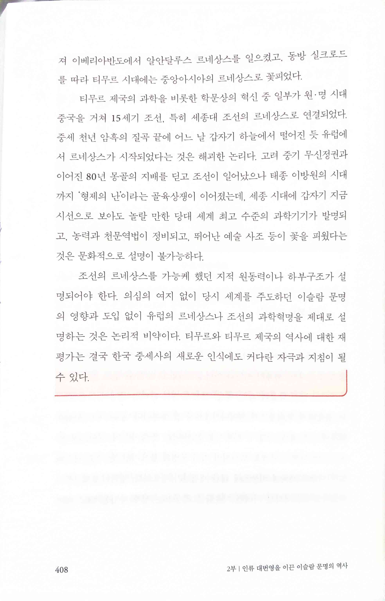

> 티무르 제국의 과학을 비롯한 학문상의 혁신 중 일부가 원 · 명 시대 중국을 거쳐 15세기 조선, 특히 세종대 조선의 르네상스로 연결되었다...
>
> 조선의 르네상스를 가능케 했던 지적 원동력이나 하부구조가 설명되어야 한다. 의심의 여지 없이 당시 세계를 주도하던 이슬람 문명의 영향과 도입 없이 유럽의 르네상스나 조선의 과학혁명을 제대로 설명하는 것은 논리적 비약이다. 티무르와 티무르 제국의 역사에 대한 재평가는 결국 한국 중세사의 새로운 인식에도 커다란 자극과 지침이 될 수 있다.
* 세종대왕이 아무리 똑똑해도 혼자서 모든 걸 할 수 없다는 건 당연한 일이지만, 티무르의 문화가 중국을 거쳐 조선에 전달되었다는 건 참 대담한 발상이란 생각이 든다. 더 많은 연구를 통해 근거를 발견해서 설명할 수 있다면 재미있겠다.

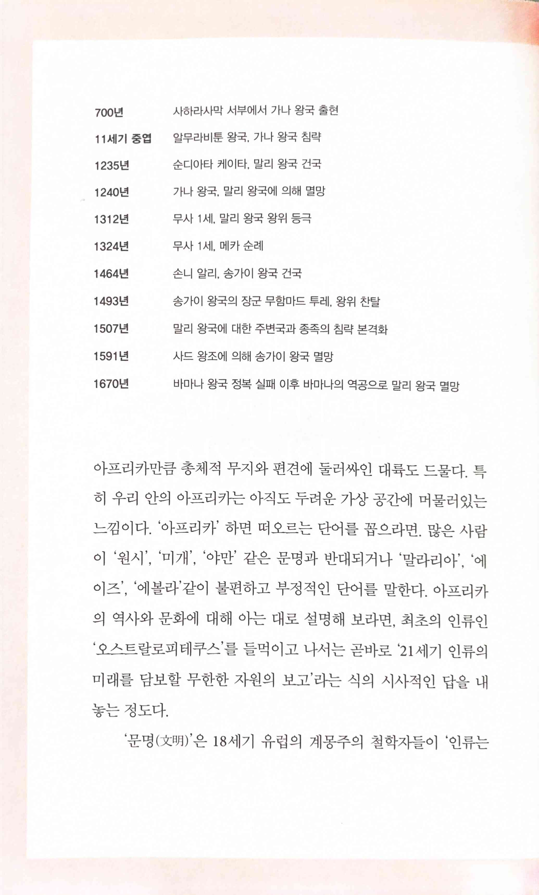

> 아프리카만큼 총체적 무지와 편견에 둘러싸인 대륙도 드물다. 특히 우리 안의 아프리카는 아직도 두려운 가상 공간에 머물러있는느낌이다. '아프리카' 하면 떠오르는 단어를 꼽으라면 많은 사람이 '원시', '미개', '야만' 같은 문명과 반대되거나 '말라리아', '에이즈', '에볼라'같이 불편하고 부정적인 단어를 말한다. 아프리카의 역사와 문화에 대해 아는 대로 설명해 보라면, 최초의 인류인 '오스트랄로피테쿠스'를 들먹이고 나서는 곧바로 '21세기 인류의 미래를 담보할 무한한 자원의 보고'라는 식의 시사적인 답을 내놓는 정도다.

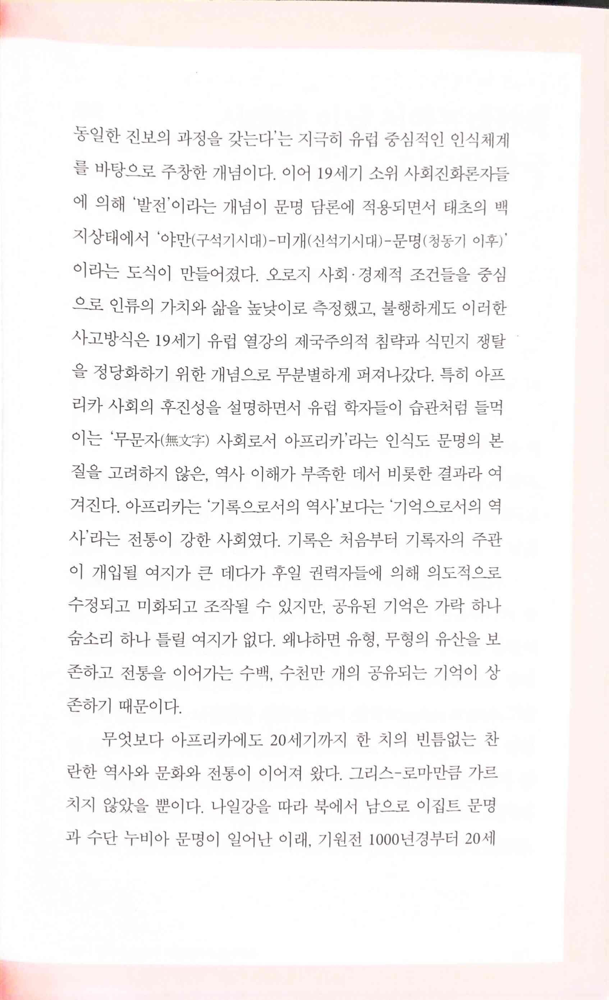

> '문명(文明)'은 18세기 유럽의 계몽주의 철학자들이 '인류는 동일한 진보의 과정을 갖는다'는 지극히 유럽 중심적인 인식체계를 바탕으로 주창한 개념이다. 이어 19세기 소위 사회진화론자들에 의해 '발전'이라는 개념이 문명 담론에 적용되면서 태초의 백지상태에서 '야만(구석기시대)-미개(신석기시대)-문명(청동기 이후)'이라는 도식이 만들어졌다. 오로지 사회·경제적 조건들을 중심으로 인류의 가치와 삶을 높낮이로 측정했고, 불행하게도 이러한 사고방식은 19세기 유럽 열강의 제국주의적 침략과 식민지 쟁탈을 정당화하기 위한 개념으로 무분별하게 퍼져나갔다. 특히 아프리카 사회의 후진성을 설명하면서 유럽 학자들이 습관처럼 들먹이는 '무문자(無文字) 사회로서 아프리카'라는 인식도 문명의 본질을 고려하지 않은, 역사 이해가 부족한 데서 비롯한 결과라 여겨진다. 아프리카는 '기록으로서의 역사'보다는 '기억으로서의 역사'라는 전통이 강한 사회였다. 기록은 처음부터 기록자의 주관이 개입될 여지가 큰 데다가 후일 권력자들에 의해 의도적으로 수정되고 미화되고 조작될 수 있지만, 공유된 기억은 가락 하나 숨소리 하나 틀릴 여지가 없다. 왜냐하면 유형, 무형의 유산을 보존하고 전통을 이어가는 수백 수천만 개의 공유되는 기억이 상존하기 때문이다.
* 주장하는 바에 동감하지만, 기억이 틀릴 여지가 없다는 건 전혀 동의할 수 없다. 인지 과학에 대해서 조금만 생각해봐도 인간의 기억이란 왜곡될 여지가 매우 크며, 수많은 사람이 공유된다고 해도, 지배자들에 의해 의도된 형태로 기억이 전승되는 경우는 현대사만 봐도 오히려 확실하다. 겨우 수십년 전의 일에 대해서도 이데올로기에 따라 평가가 극명하게 나뉘는데, 공유된 기억이라고 틀릴 수 없다는 건 비현실적인 주장이다.

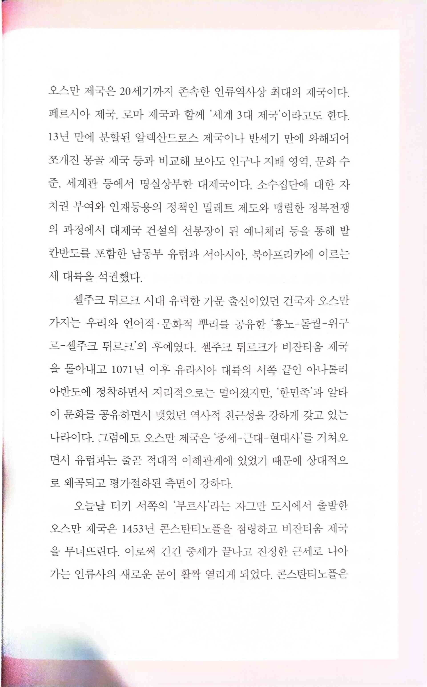

> 셀주크 튀르크 시대 유력한 가문 출신이었던 건국자 오스만 가지는 우리와 언어적 · 문화적 뿌리를 공유한 '흉노-돌궐-위구르-셀주크 튀르크'의 후예였다.

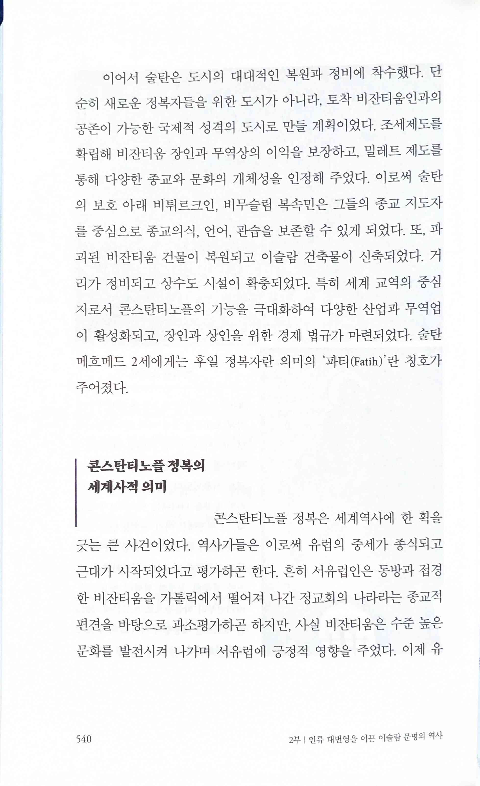 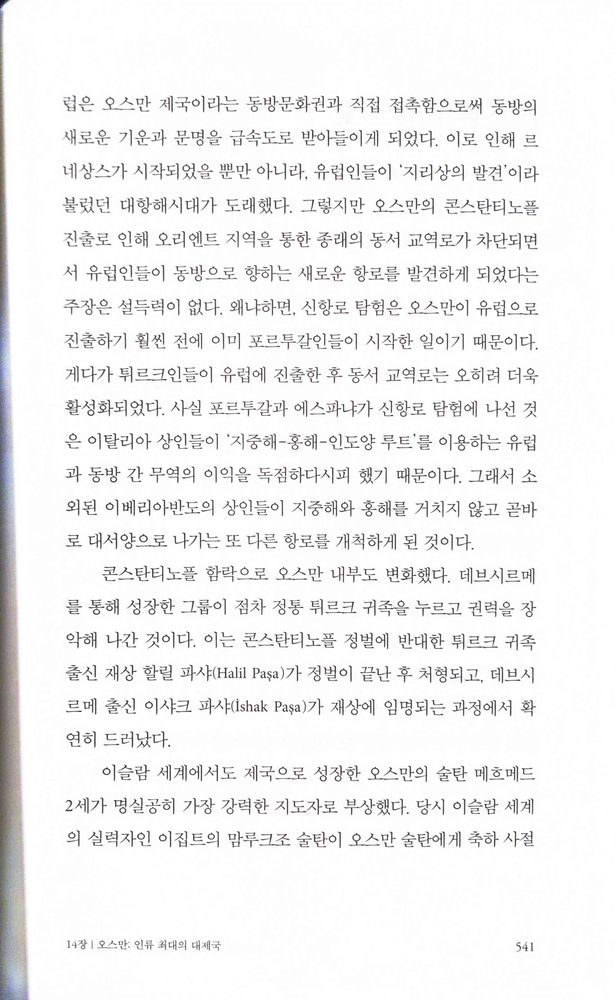

> 콘스탄티노플 정복은 세계역사에 한 획을 긋는 큰 사건이었다. 역사가들은 이로써 유럽의 중세가 종식되고 근대가 시작되었다고 평가하곤 한다. 흔히 서유럽인은 동방과 접경한 비잔티움을 가톨릭에서 떨어져 나간 정교회의 나라라는 종교적 편견을 바탕으로 과소평가하곤 하지만, 사실 비잔티움은 수준 높은 문화를 발전시켜 나가며 서유럽에 긍정적 영향을 주었다. 이제 유럽은 오스만 제국이라는 동방문화권과 직접 접촉함으로써 동방의 새로운 기운과 문명을 급속도로 받아들이게 되었다. 이로 인해 르네상스가 시작되었을 뿐만 아니라, 유럽인들이 '지리상의 발견'이라 불렀던 대항해 시대가 도래했다. 그렇지만 오스만의 콘스탄티노플 진출로 인해 오리엔트 지역을 통한 종래의 동서 교역로가 차단되면서 유럽인들이 동방으로 향하는 새로운 항로를 발견하게 되었다는 주장은 설득력이 없다. 왜냐하면, 신항로 탐험은 오스만이 유럽으로 진출하기 훨씬 전에 이미 포르투갈인들이 시작한 일이기 때문이다. 게다가 튀르크인들이 유럽에 진출한 후 동서 교역로는 오히려 더욱 활성화되었다. 사실 포르투갈과 에스파냐가 신항로 탐험에 나선 것은 이탈리아 상인들이 '지중해 - 홍해 - 인도양 루트'를 이용하는 유럽과 동방 간 무역의 이익을 독점하다시피 했기 때문이다. 그래서 소외된 이베리아반도의 상인들이 지중해와 홍해를 거치지 않고 곧바로 대서양으로 나가는 또 다른 항로를 개척하게 된 것이다.

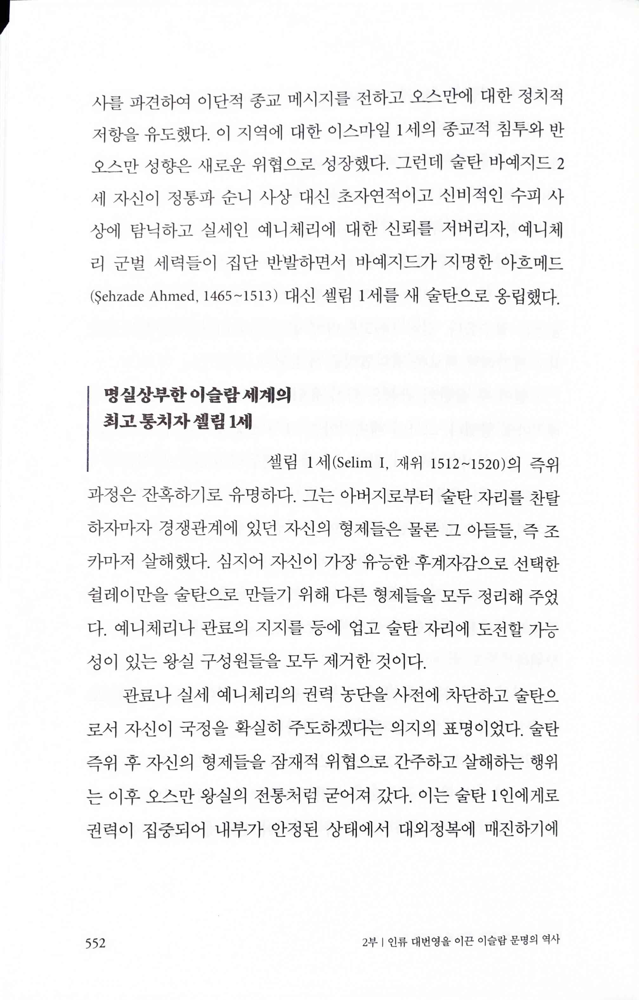

> 셀림 1세(Selim I. 재위 1512~1520)의 즉위 과정은 잔혹하기로 유명하다. 그는 아버지로부터 술탄 자리를 찬탈하자마자 경쟁관계에 있던 자신의 형제들은 물론 그 아들들, 즉 조카마저 살해했다. 심지어 자신이 가장 유능한 후계자감으로 선택한 쉴레이만을 술탄으로 만들기 위해 다른 형제들을 모두 정리해 주었다. 예니체리나 관료의 지지를 등에 업고 술탄 자리에 도전할 가능성이 있는 왕실 구성원들을 모두 제거한 것이다.
* 태종의 공신, 외척 처리가 연상된다.

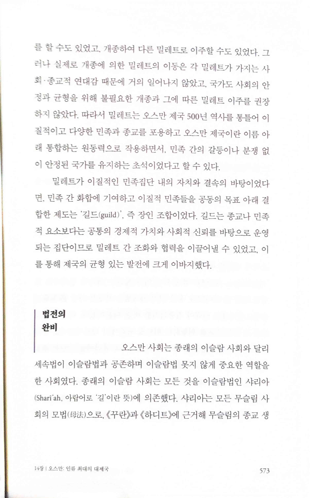

> 밀레트가 이질적인 민족집단 내의 자치와 결속의 바탕이었다면, 민족 간 화합에 기여하고 이질적 민족들을 공동의 목표 아래 결합한 제도는 '길드(guild)', 즉 장인 조합이었다. 길드는 종교나 민족적 요소보다는 공통의 경제적 가치와 사회적 신뢰를 바탕으로 운영되는 집단이므로 밀레트 간 조화와 협력을 이끌어낼 수 있었고, 이를 통해 제국의 균형 있는 발전에 크게 이바지했다.
* 마치 matrix 조직의 컨셉이 연상된다. 같은 민족 - 직군별 집단과, 공통의 경제적 가치를 위한 - product 단위 모임이 비슷하단 생각이 들었다.