# 임포스터 가면을 쓴 부모가 가면을 쓴 아이를 만든다 IMPOSTOR

## Chapter 1 가면을 벗기 위한 메타인지 사고법 첫 번째, 행복에 도달하는 길은 울퉁불퉁하다
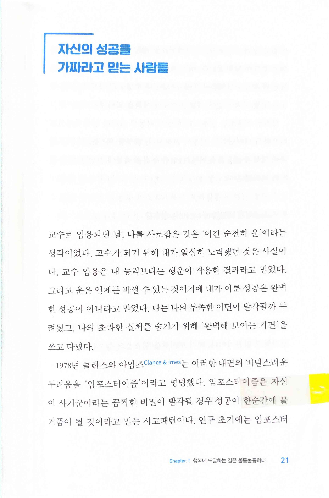

> 임포스터이즘은 자신이 사기꾼이라는 끔찍한 비밀이 발각될 경우 성공이 한순간에 물거품이 될 것이라고 믿는 사고패턴

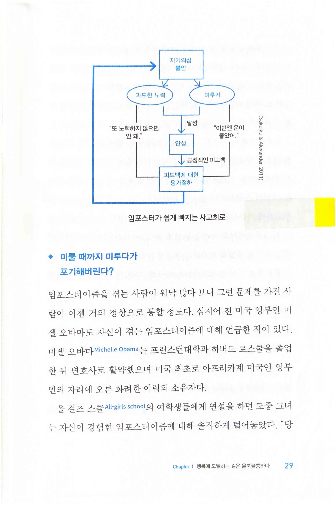

> 임포스터가 쉽게 빠지는 사고회로

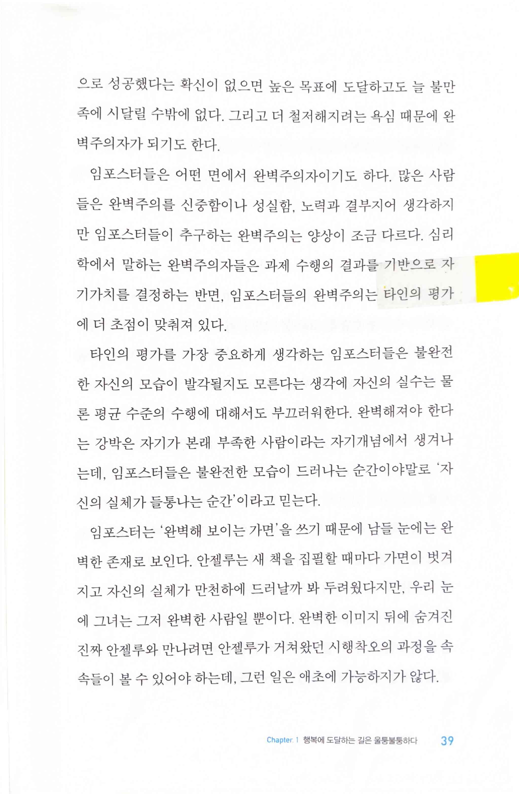

> 심리학에서 말하는 완벽주의자들은 과제 수행의 결과를 기반으로 자기가치를 결정하는 반면, 임포스터들의 완벽주의는 타인의 평가에 더 초점이 맞춰져 있다.

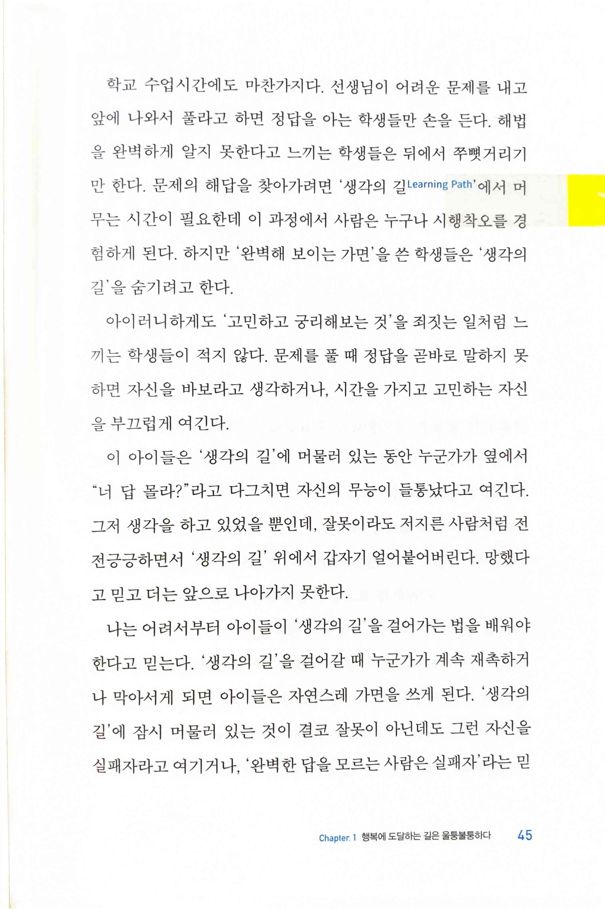

> 문제의 해답을 찾아가려면 '생각의 길 Learning Path'에서 머무는 시간이 필요한데 이 과정에서 사람은 누구나 시행착오를 경험하게 된다. 하지만 '완벽해 보이는 가면을 쓴 학생들은 '생각의 길'을 숨기려고 한다.

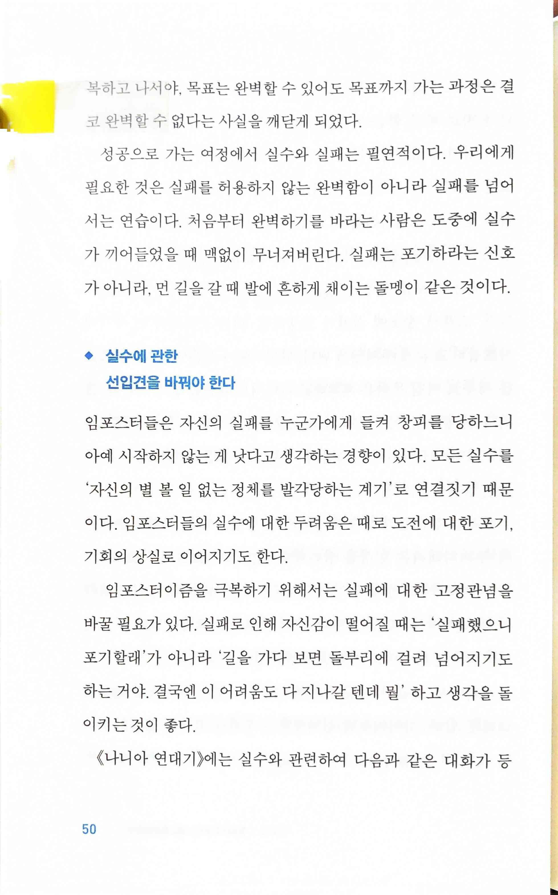

> 목표는 완벽할 수 있어도 목표까지 가는 과정은 결코 완벽할 수 없다

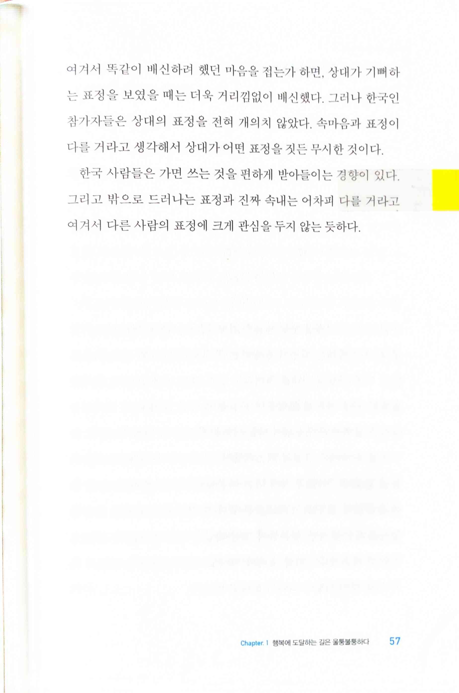

> 한국 사람들은 가면 쓰는 것을 편하게 받아들이는 경향이 있다. 그리고 밖으로 드러나는 표정과 진짜 속내는 어차피 다를 거라고 여겨서 다른 사람의 표정에 크게 관심을 두지 않는 듯하다.

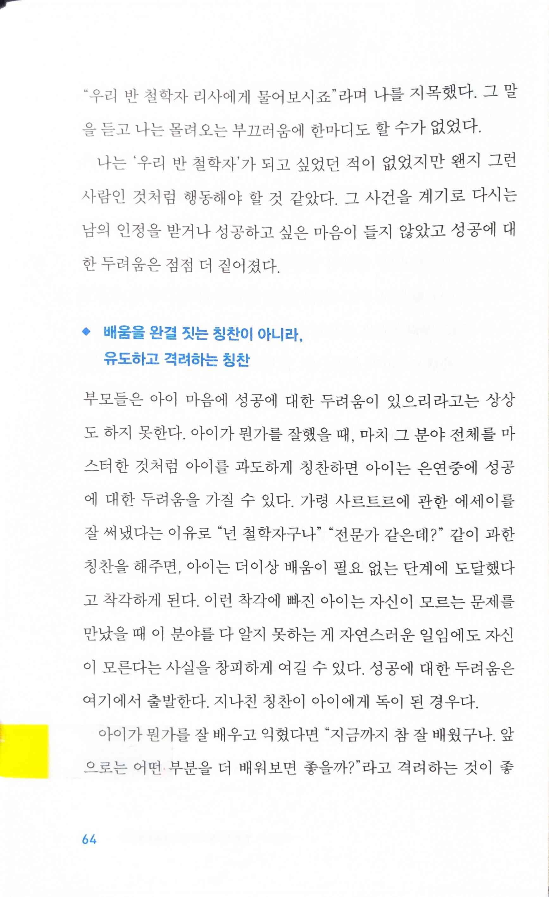

> 아이가 뭔가를 잘 배우고 익혔다면 "지금까지 참 잘 배웠구나. 앞으로는 어떤 부분을 더 배워보면 좋을까?"라고 격려하는 것이 좋다. 이제 더는 배울 게 없다는 식으로 아이를 칭찬하면, 아이는 앞으로는 노력 없이도 완벽해져야 한다고 여겨 더 불안해질 수 있다.

## Chapter 2 가면을 벗기 위한 메타인지 사고법 두 번째, 어느 아이든 모르는 시기를 거친다
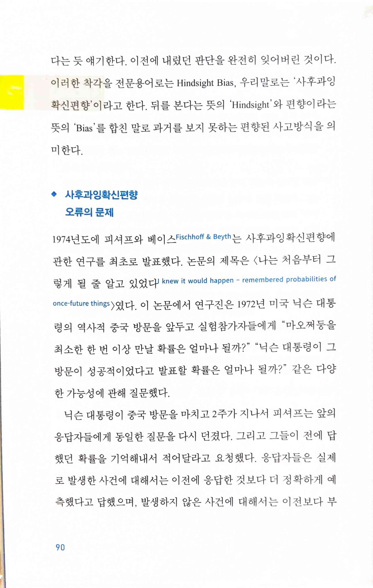

> Hindsight Bias, 우리말로는 '사후과잉확신편향'이라고 한다. 뒤를 본다는 뜻의 'Hindsight'와 편향이라는 뜻의 'Bias'를 합친 말로 과거를 보지 못하는 편향된 사고방식을 의미한다.

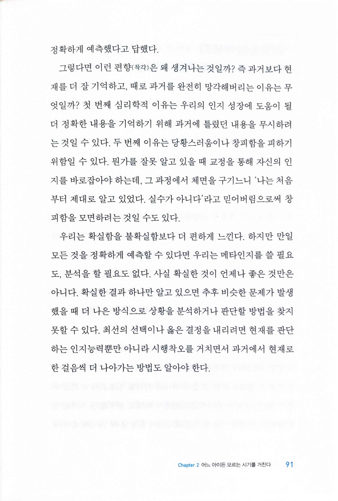

> 편향(착각)이 생기는 이유. 즉 과거보다 현재를 더 잘 기억하고, 때로 과거를 완전히 망각해버리는 이유
>
> 첫 번째 심리학적 이유는 우리의 인지 성장에 도움이 될 더 정확한 내용을 기억하기 위해 과거에 틀렸던 내용을 무시하려는 것일 수 있다. 두 번째 이유는 당황스러움이나 창피함을 피하기 위함일 수 있다.
>
> 최선의 선택이나 옳은 결정을 내리려면 현재를 판단하는 인지능력뿐만 아니라 시행착오를 거치면서 과거에서 현재로 한 걸음씩 더 나아가는 방법도 알아야 한다.

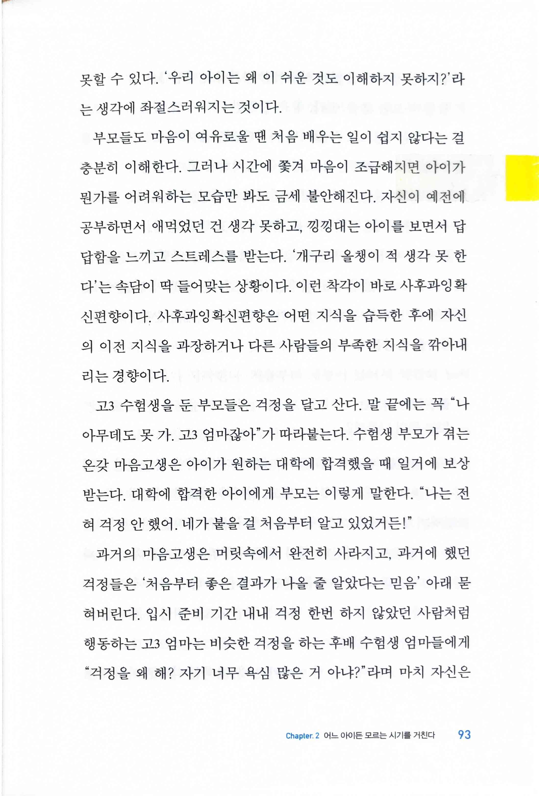

> 부모들도 마음이 여유로울 땐 처음 배우는 일이 쉽지 않다는 걸 충분히 이해한다. 그러나 시간에 쫓겨 마음이 조급해지면 아이가 뭔가를 어려워하는 모습만 봐도 금세 불안해진다... '개구리 올챙이 적 생각 못 한다'는 속담이 딱 들어맞는 상황이다. 이런 착각이 바로 사후과잉확신편향이다. 사후과잉확신편향은 어떤 지식을 습득한 후에 자신의 이전 지식을 과장하거나 다른 사람들의 부족한 지식을 깎아내리는 경향이다.
 
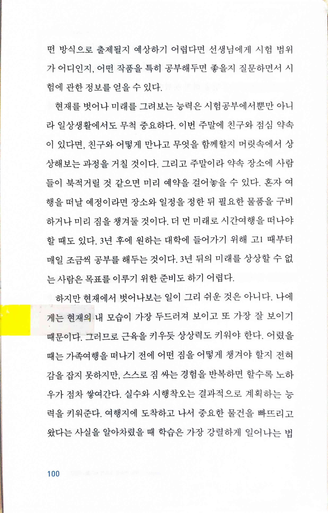

> 하지만 현재에서 벗어나보는 일이 그리 쉬운 것은 아니다. 나에게는 현재의 내 모습이 가장 두드러져 보이고 또 가장 잘 보이기 때문이다. 그러므로 근육을 키우듯 상상력도 키워야 한다... 실수와 시행착오는 결과적으로 계획하는 능력을 키워준다.

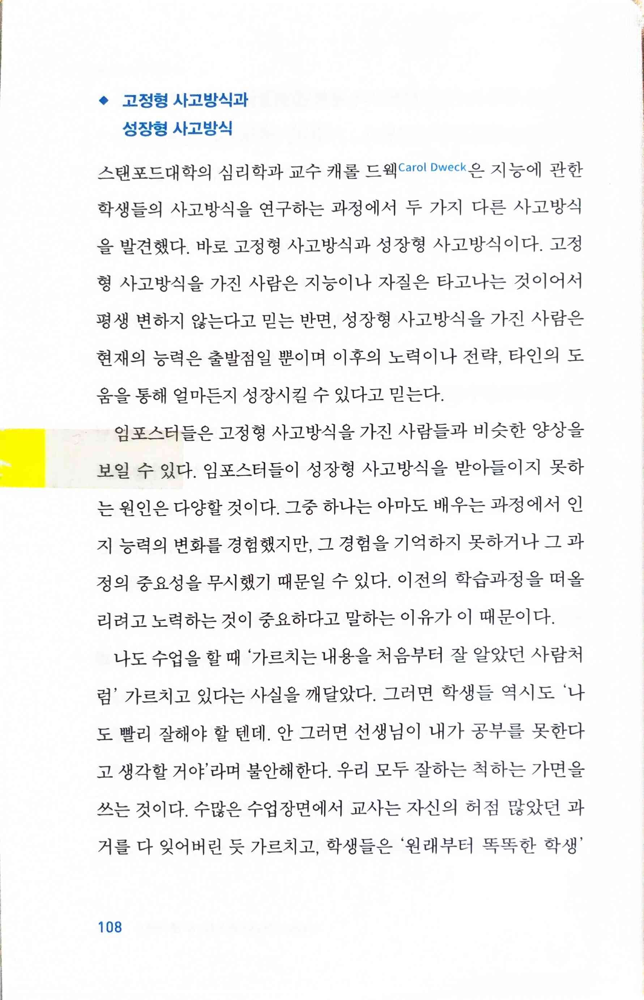

> 임포스터들은 고정형 사고방식을 가진 사람들과 비슷한 양상을 보일 수 있다. 임포스터들이 성장형 사고방식을 받아들이지 못하는 원인은 다양할 것이다. 그중 하나는 아마도 배우는 과정에서 인지 능력의 변화를 경험했지만, 그 경험을 기억하지 못하거나 그 과정의 중요성을 무시했기 때문일 수 있다. 이전의 학습과정을 떠올리려고 노력하는 것이 중요하다고 말하는 이유가 이 때문이다.

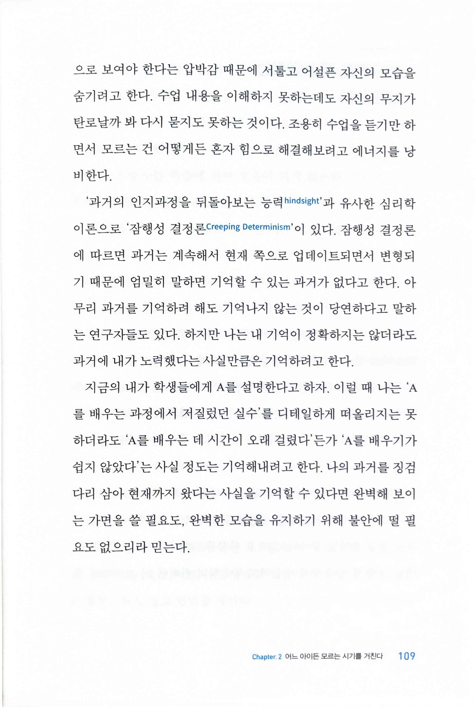

> 나의 과거를 징검다리 삼아 현재까지 왔다는 사실을 기억할 수 있다면 완벽해 보이는 가면을 쓸 필요도, 완벽한 모습을 유지하기 위해 불안에 떨 필요도 없으리라 믿는다.

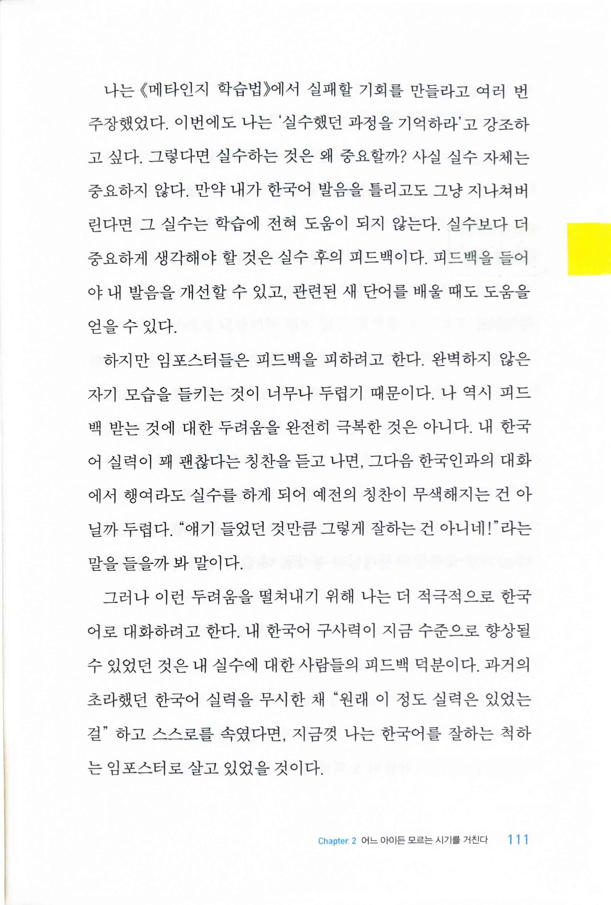

> 실수보다 더 중요하게 생각해야 할 것은 실수 후의 피드백이다.  피드백을 들어야 ... 개선할 수 있고, ... 도움을 얻을 수 있다.

 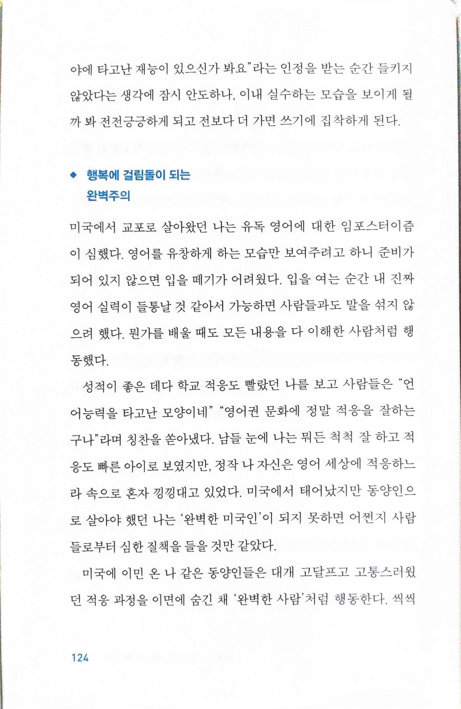

> 임포스터이즘은 신입생뿐만 아니라 새롭게 일을 시작한 사람들에게서도 많이 나타난다. 사람들의 기대 수준에 맞는 성과를 내지 못하면 자신의 실력이 들통날 것을 두려워해 초기 적응 과정에서 '완벽해 보이는 가면'을 쓰려고 한다. 이때 '잘 적응하는 척하는'가면을 쓰게 되면 자신이 맡은 책임과 역할을 완벽하게 수행하고 있다는 착각에 빠진다. 이 가면을 쓴 사람은 타인으로부터 “이 분야에 타고난 재능이 있으신가봐요"라는 인정을 받는 순간 들키지 않았다는 생각에 잠시 안도하나, 이내 실수하는 모습을 보이게 될까봐 전전긍긍하게 되고 전보다 더 가면 쓰기에 집착하게 된다.

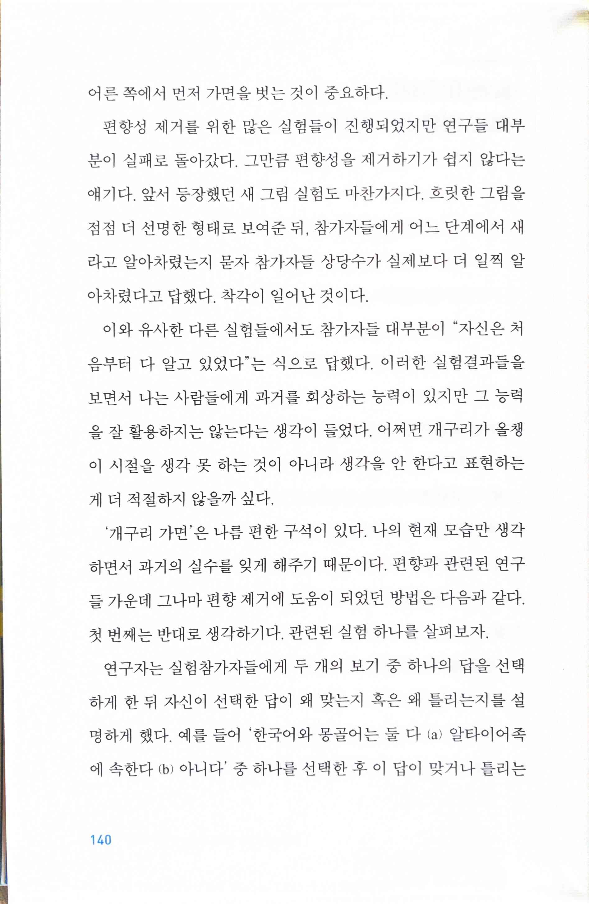

> 편향성 제거를 위한 많은 실험들이 진행되었지만 연구들 대부분이 실패로 돌아갔다. 그만큼 편향성을 제거하기가 쉽지 않다는 얘기다.
>
> 사람들에게 과거를 회상하는 능력이 있지만 그 능력을 잘 활용하지는 않는다는 생각이 들었다. 어쩌면 개구리가 올챙이 시절을 생각 못 하는 것이 아니라 생각을 안 한다고 표현하는게 더 적절하지 않을까 싶다.
>
> '개구리 가면'은 나름 편한 구석이 있다. 나의 현재 모습만 생각하면서 과거의 실수를 잊게 해주기 때문이다.

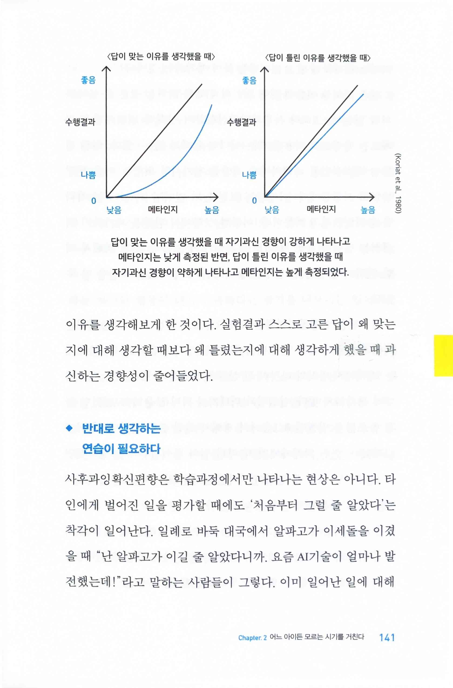

> 스스로 고른 답이 왜 맞는지에 대해 생각할 때보다 왜 틀렸는지에 대해 생각하게 했을 때 과신하는 경향성이 줄어들었다.

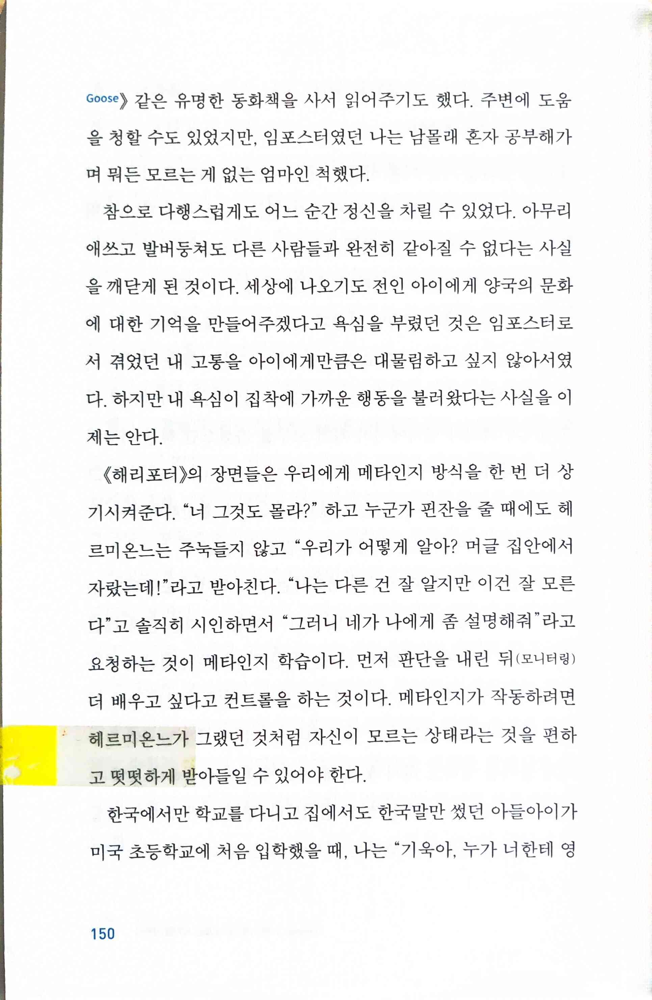

> 메타인지가 작동하려면 ... 자신이 모르는 상태라는 것을 편하고 떳떳하게 받아들일 수 있어야 한다.

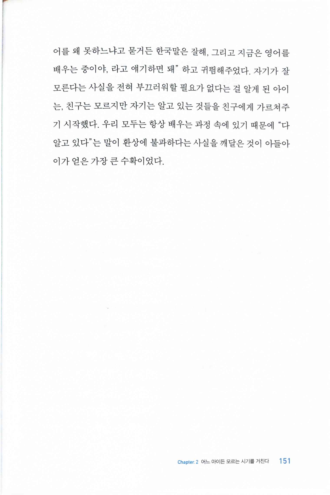

> 우리 모두는 항상 배우는 과정 속에 있기 때문에 “다 알고 있다"는 말이 환상에 불과하다

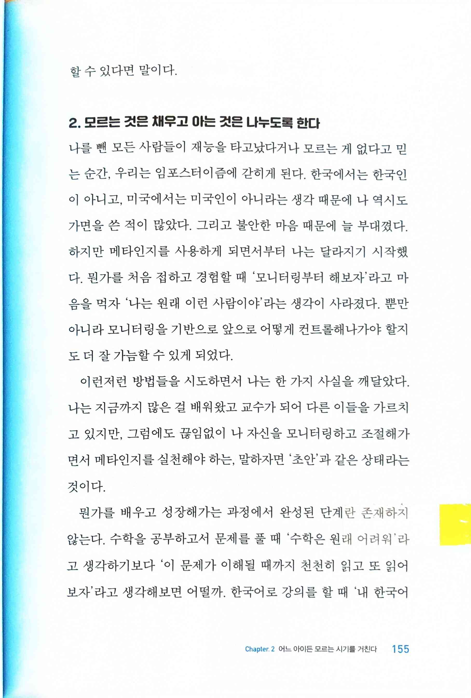

> 뭔가를 배우고 성장해가는 과정에서 완성된 단계란 존재하지 않는다.

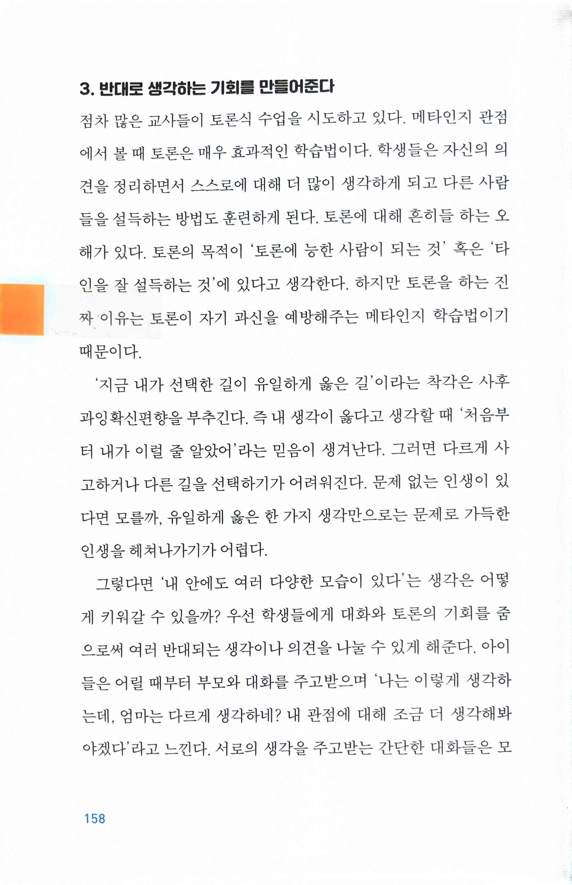

> 토론을 하는 진짜 이유는 토론이 자기 과신을 예방해주는 메타인지 학습법이기 때문이다.
>
> '지금 내가 선택한 길이 유일하게 옳은 길'이라는 착각은 사후 과잉확신편향을 부추긴다. 즉 내 생각이 옳다고 생각할 때 처음부터 내가 이럴 줄 알았어'라는 믿음이 생겨난다. 그러면 다르게 사고하거나 다른 길을 선택하기가 어려워진다. 문제 없는 인생이 있다면 모를까, 유일하게 옳은 한 가지 생각만으로는 문제로 가득한 인생을 헤쳐나가기가 어렵다.

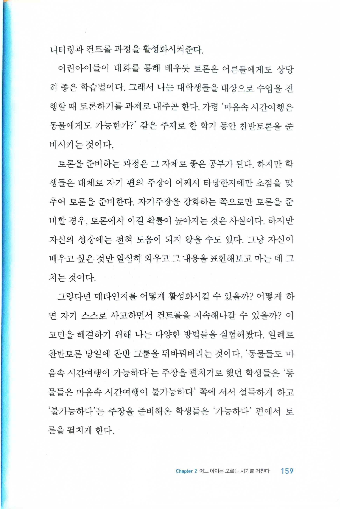

> 자기주장을 강화하는 쪽으로만 토론을 준비할 경우, 토론에서 이길 확률이 높아지는 것은 사실이다. 하지만자신의 성장에는 전혀 도움이 되지 않을 수도 있다. 그냥 자신이 배우고 싶은 것만 열심히 외우고 그 내용을 표현해보고 마는 데 그치는 것이다.

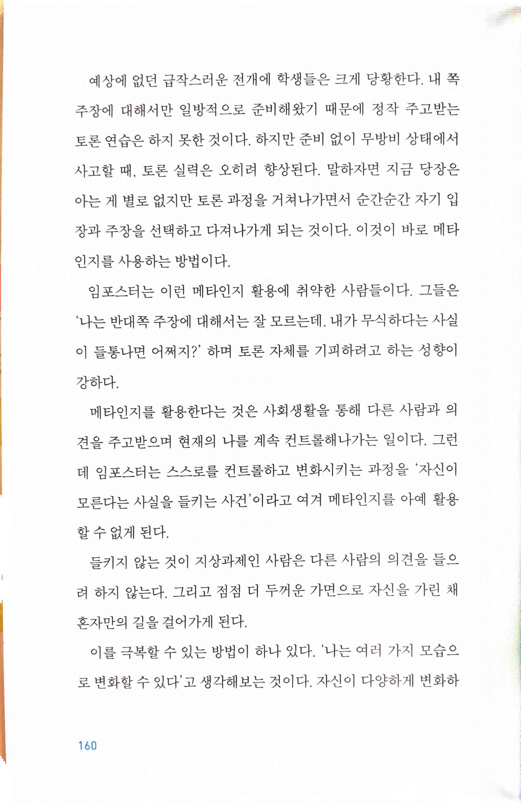

> 메타인지를 활용한다는 것은 사회생활을 통해 다른 사람과 의견을 주고받으며 현재의 나를 계속 컨트롤해나가는 일이다. 그런데 임포스터는 스스로를 컨트롤하고 변화시키는 과정을 '자신이 모른다는 사실을 들키는 사건'이라고 여겨 메타인지를 아예 활용할 수 없게 된다.

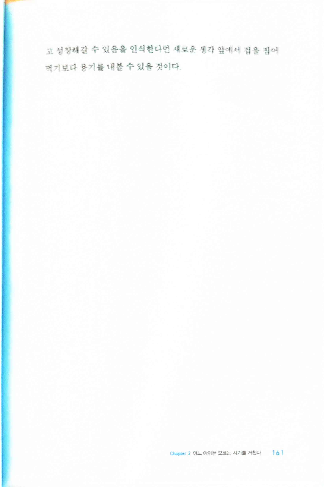

> 이를 극복할 수 있는 방법이 하나 있다. '나는 여러 가지 모습으로 변화할 수 있다'고 생각해보는 것이다. 자신이 다양하게 변화하고 성장해갈 수 있음을 인식한다면 새로운 생각 앞에서 겁을 집어먹기보다 용기를 내볼 수 있을 것이다.

## Chapter 3 가면을 벗기 위한 메타인지 사고법 세 번째, 진정한 겸손은 도움을 청할 줄 아는 것
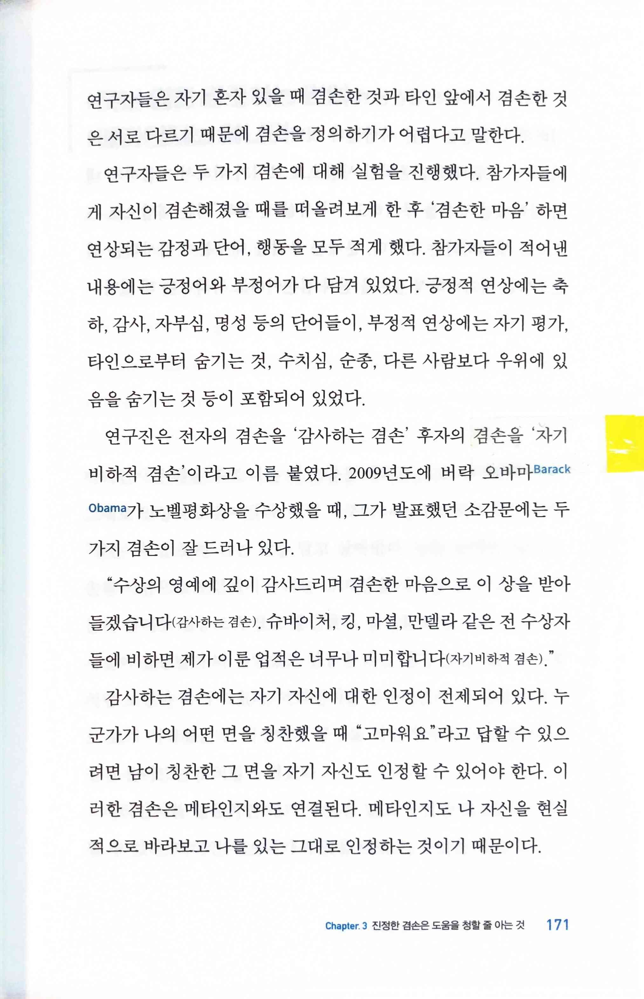

> 긍정적 연상에는 축하, 감사, 자부심, 명성 등의 단어들이, 부정적 연상에는 자기 평가, 타인으로부터 숨기는 것, 수치심, 순종, 다른 사람보다 우위에 있음을 숨기는 것 등이 포함되어 있었다.
>
> 전자의 겸손을 '감사하는 겸손' 후자의 겸손을 '자기비하적 겸손'
>
> 감사하는 겸손에는 자기 자신에 대한 인정이 전제되어 있다. 누군가가 나의 어떤 면을 칭찬했을 때 “고마워요"라고 답할 수 있으려면 남이 칭찬한 그 면을 자기 자신도 인정할 수 있어야 한다. 이러한 겸손은 메타인지와도 연결된다. 메타인지도 나 자신을 현실적으로 바라보고 나를 있는 그대로 인정하는 것이기 때문이다.

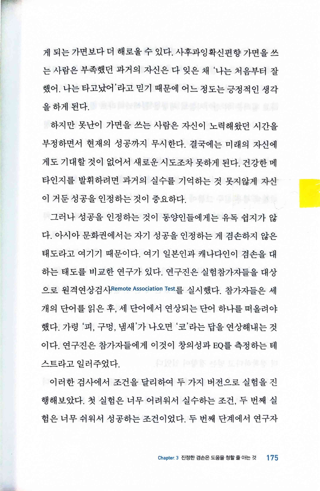

> 건강한 메타인지를 발휘하려면 과거의 실수를 기억하는 것 못지않게 자신이 거둔 성공을 인정하는 것이 중요하다.

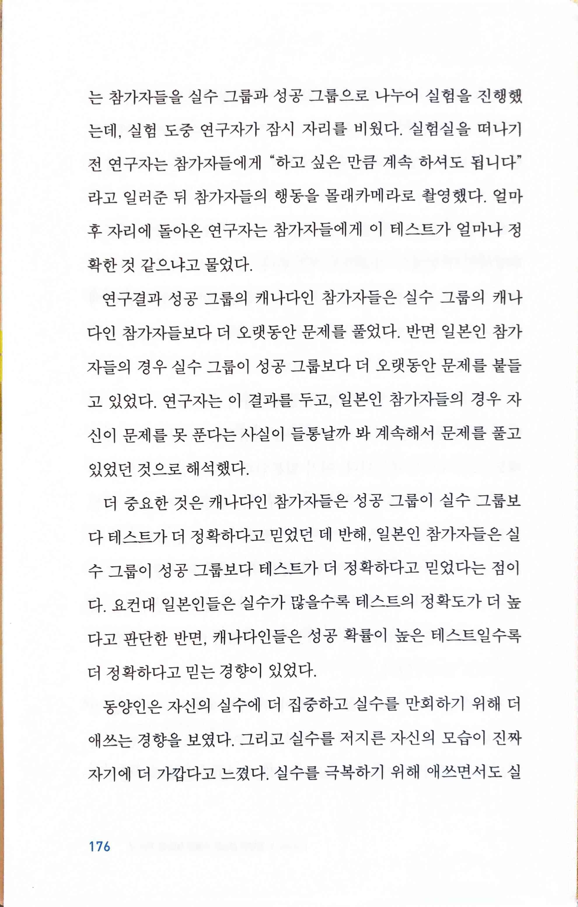

> 동양인은 자신의 실수에 더 집중하고 실수를 만회하기 위해 더 애쓰는 경향을 보였다. 그리고 실수를 저지른 자신의 모습이 진짜 자기에 더 가깝다고 느꼈다.

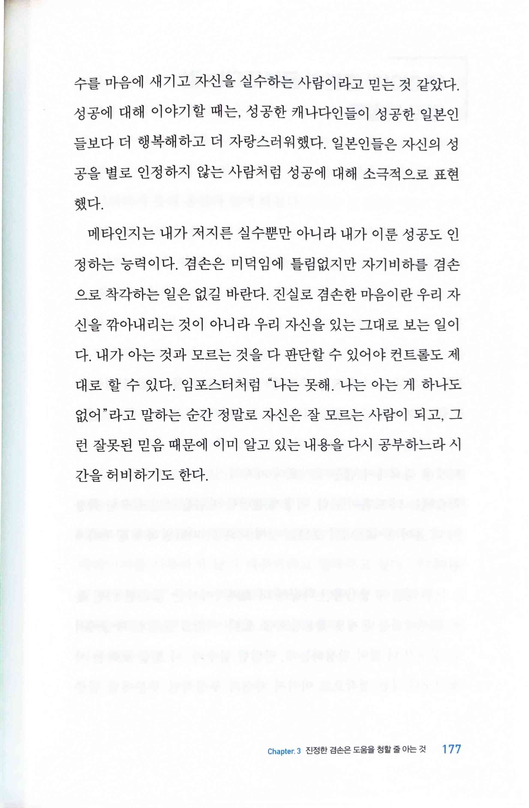

> 메타인지는 내가 저지른 실수뿐만 아니라 내가 이룬 성공도 인정하는 능력이다. 겸손은 미덕임에 틀림없지만 자기비하를 겸손으로 착각하는 일은 없길 바란다. 진실로 겸손한 마음이란 우리 자신을 깎아내리는 것이 아니라 우리 자신을 있는 그대로 보는 일이다. 내가 아는 것과 모르는 것을 다 판단할 수 있어야 컨트롤도 제대로 할 수 있다. 임포스터처럼 “나는 못해. 나는 아는 게 하나도 없어”라고 말하는 순간 정말로 자신은 잘 모르는 사람이 되고, 그런 잘못된 믿음 때문에 이미 알고 있는 내용을 다시 공부하느라 시간을 허비하기도 한다.

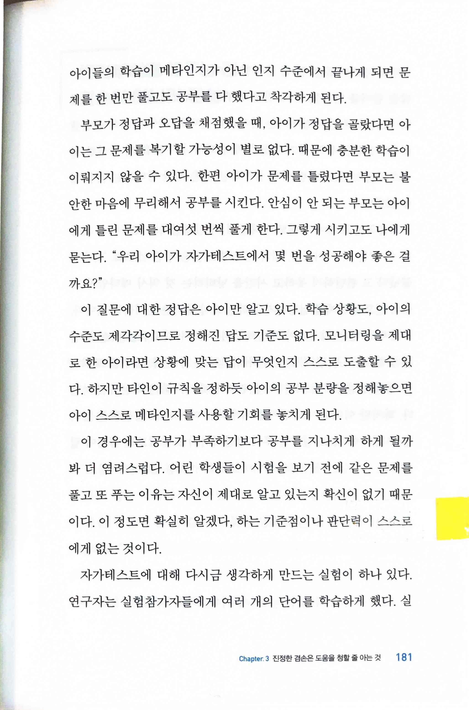

> 어린 학생들이 시험을 보기 전에 같은 문제를 풀고 또 푸는 이유는 자신이 제대로 알고 있는지 확신이 없기 때문이다. 이 정도면 확실히 알겠다 하는 기준점이나 판단력이 스스로에게 없는 것이다.

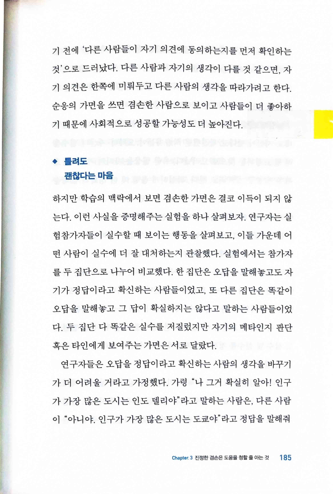

> 순응의 가면을 쓰면 겸손한 사람으로 보이고 사람들이 더 좋아하기 때문에 사회적으로 성공할 가능성도 더 높아진다.
>
> 하지만 학습의 맥락에서 보면 겸손한 가면은 결코 이득이 되지 않는다.

> 오답인데도 자신이 맞다고 확신했던 학습자들이 오히려 자신의 실수를 더 잘 교정하는 것으로 드러났다. 이런 현상을 가리켜 과잉교정효과Hypercorrection Effect라고 한다. 확실하게 틀릴 때 더 정확하게 학습이 되는 것이다.
>
> 관심을 두는 데서 더 나아가 자신의 견해를 확실하고 솔직하게 표현할 수 있게 되면, 실수를 정답과 더 잘 연관짓고 실수 및 실수를 정정했던 과정에 대해서도 더 오래 숙고하게 되는 것 같다.

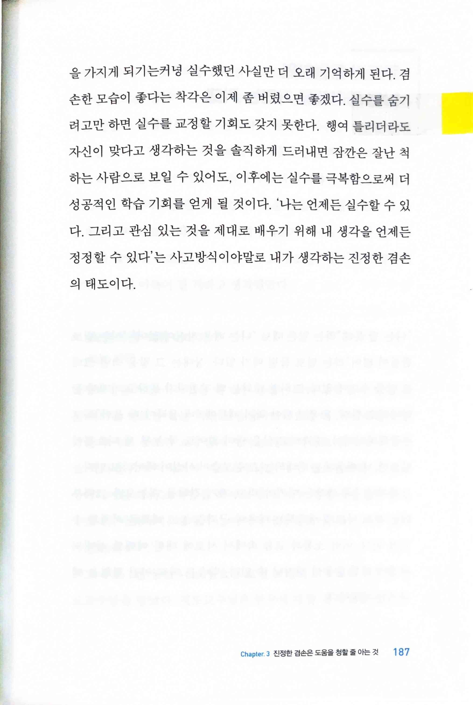

> 겸손한 모습이 좋다는 착각은 이제 좀 버렸으면 좋겠다. 실수를 숨기려고만 하면 실수를 교정할 기회도 갖지 못한다. 행여 틀리더라도 자신이 맞다고 생각하는 것을 솔직하게 드러내면 잠깐은 잘난 척하는 사람으로 보일 수 있어도, 이후에는 실수를 극복함으로써 더 성공적인 학습 기회를 얻게 될 것이다. '나는 언제든 실수할 수 있다. 그리고 관심 있는 것을 제대로 배우기 위해 내 생각을 언제든 정정할 수 있다'는 사고방식이야말로 내가 생각하는 진정한 겸손의 태도이다.

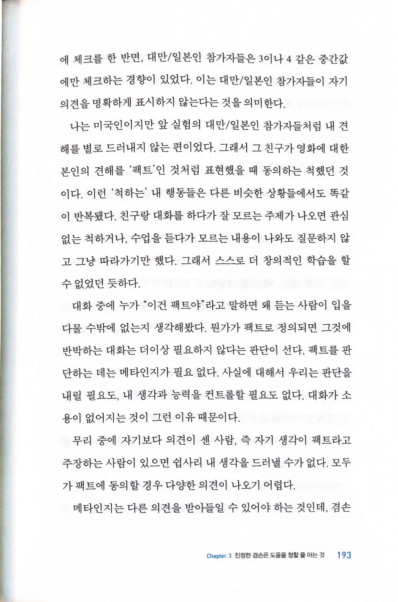

> 뭔가가 팩트로 정의되면 그것에 반박하는 대화는 더이상 필요하지 않다는 판단이 선다. 팩트를 판단하는 데는 메타인지가 필요 없다. 사실에 대해서 우리는 판단을 내릴 필요도, 내 생각과 능력을 컨트롤할 필요도 없다. 대화가 소용이 없어지는 것이 그런 이유 때문이다.

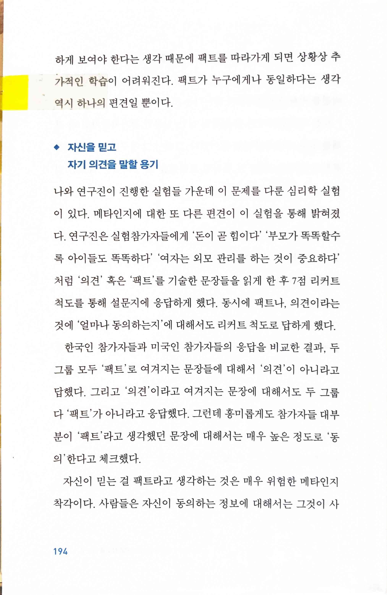

> 팩트가 누구에게나 동일하다는 생각 역시 하나의 편견일 뿐이다.

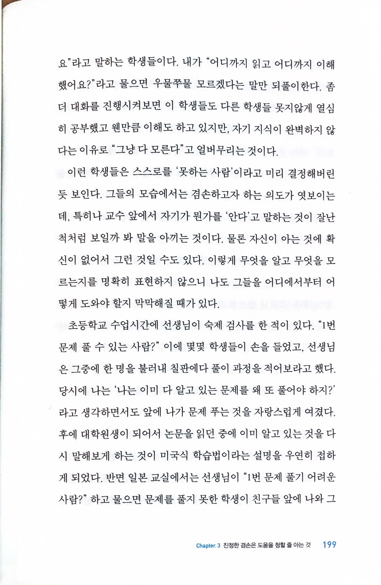

> 이미 알고 있는 것을 다시 말해보게 하는 것이 미국식 학습법

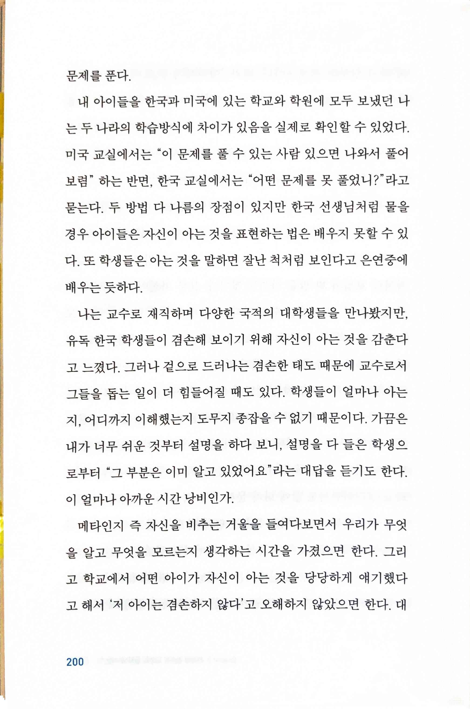

> 내 아이들을 한국과 미국에 있는 학교와 학원에 모두 보냈던 나는 두 나라의 학습방식에 차이가 있음을 실제로 확인할 수 있었다. 미국 교실에서는 “이 문제를 풀 수 있는 사람 있으면 나와서 풀어보렴" 하는 반면, 한국 교실에서는 “어떤 문제를 못 풀었니?"라고 묻는다. 두 방법 다 나름의 장점이 있지만 한국 선생님처럼 물을 경우 아이들은 자신이 아는 것을 표현하는 법은 배우지 못할 수 있다. 또 학생들은 아는 것을 말하면 잘난 척처럼 보인다고 은연중에 배우는 듯하다.
>
> 메타인지 즉 자신을 비추는 거울을 들여다보면서 우리가 무엇을 알고 무엇을 모르는지 생각하는 시간을 가졌으면 한다.

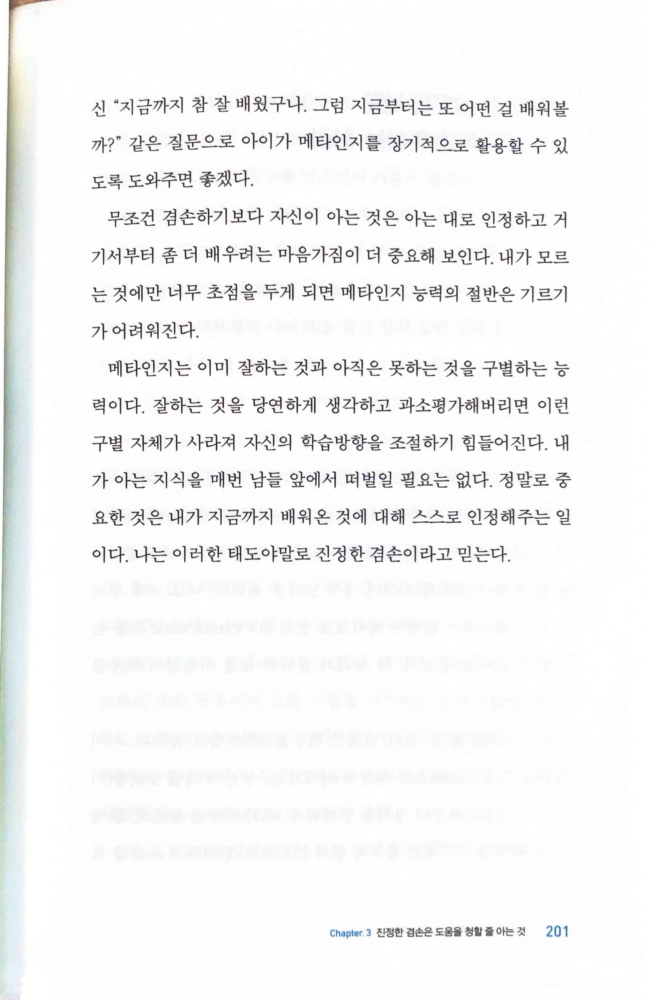

> 무조건 겸손하기보다 자신이 아는 것은 아는 대로 인정하고 거기서부터 좀 더 배우려는 마음가짐이 더 중요해 보인다. 내가 모르는 것에만 너무 초점을 두게 되면 메타인지 능력의 절반은 기르기가 어려워진다.
>
> 메타인지는 이미 잘하는 것과 아직은 못하는 것을 구별하는 능력이다. 잘하는 것을 당연하게 생각하고 과소평가해버리면 이런 구별 자체가 사라져 자신의 학습방향을 조절하기 힘들어진다. 내가 아는 지식을 매번 남들 앞에서 떠벌일 필요는 없다. 정말로 중요한 것은 내가 지금까지 배워온 것에 대해 스스로 인정해주는 일이다. 나는 이러한 태도야말로 진정한 겸손이라고 믿는다.

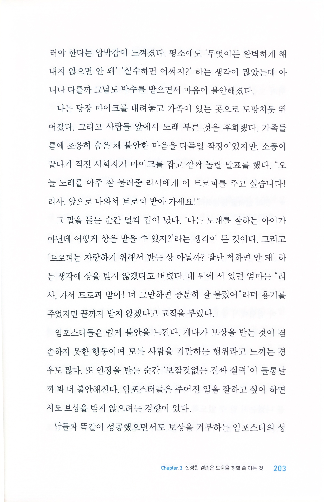

> 임포스터들은 쉽게 불안을 느낀다. 게다가 보상을 받는 것이 겸손하지 못한 행동이며 모든 사람을 기만하는 행위라고 느끼는 경우도 많다. 또 인정을 받는 순간 '보잘것없는 진짜 실력'이 들통날까 봐 더 불안해진다. 임포스터들은 주어진 일을 잘하고 싶어 하면서도 보상을 받지 않으려는 경향이 있다.

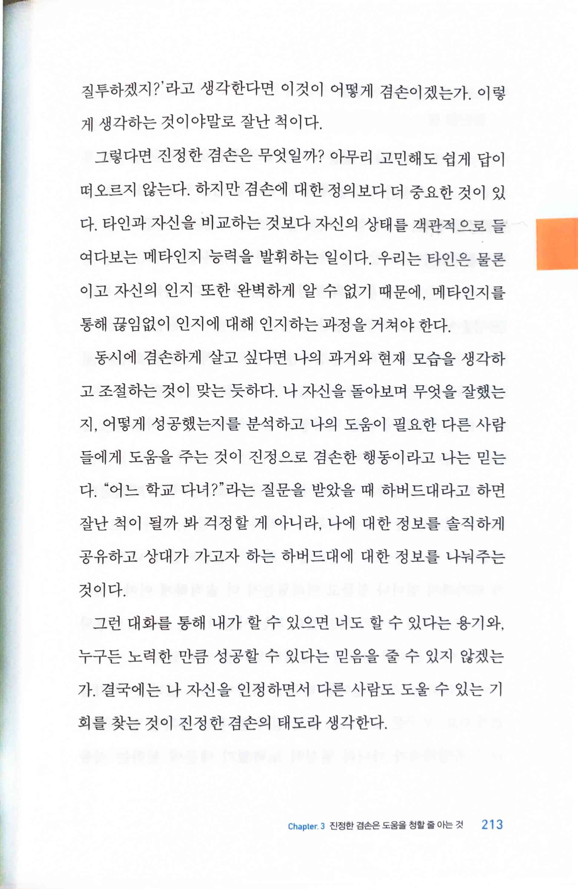

> 타인과 자신을 비교하는 것보다 자신의 상태를 객관적으로 들여다보는 메타인지 능력을 발휘하는 일이다. 우리는 타인은 물론이고 자신의 인지 또한 완벽하게 알 수 없기 때문에, 메타인지를 통해 끊임없이 인지에 대해 인지하는 과정을 거쳐야 한다.
>
> 동시에 겸손하게 살고 싶다면 나의 과거와 현재 모습을 생각하고 조절하는 것이 맞는 듯하다. 나 자신을 돌아보며 무엇을 잘했는지, 어떻게 성공했는지를 분석하고 나의 도움이 필요한 다른 사람들에게 도움을 주는 것이 진정으로 겸손한 행동이라고 나는 믿는다.

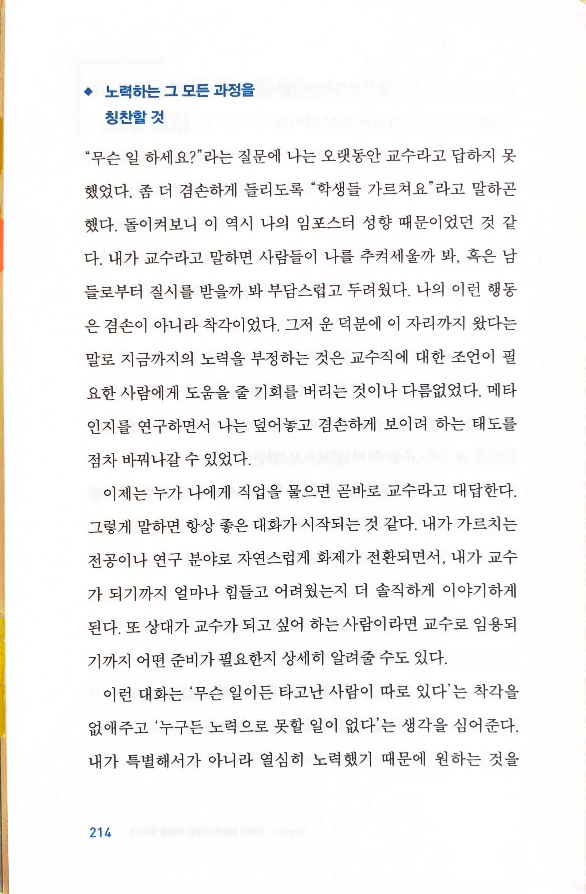

> '무슨 일이든 타고난 사람이 따로 있다'는 착각, ‘누구든 노력으로 못할 일이 없다'는 생각 

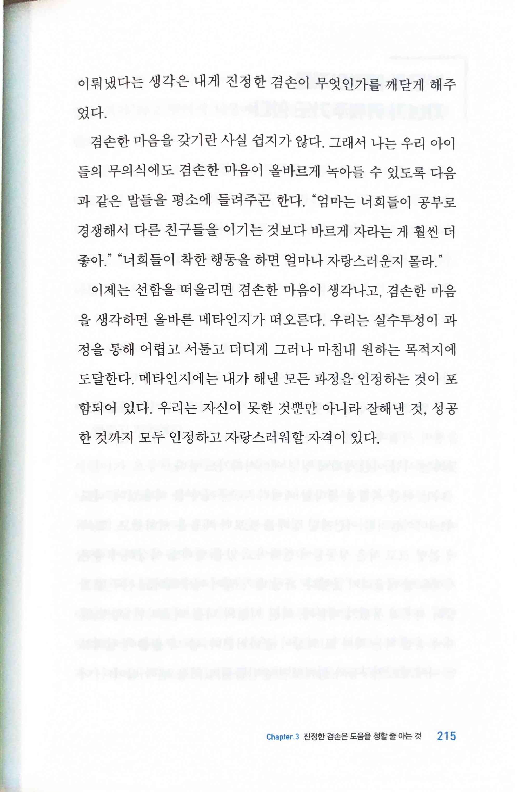

> 우리는 자신이 못한 것뿐만 아니라 잘해낸 것, 성공한 것까지 모두 인정하고 자랑스러워할 자격이 있다.

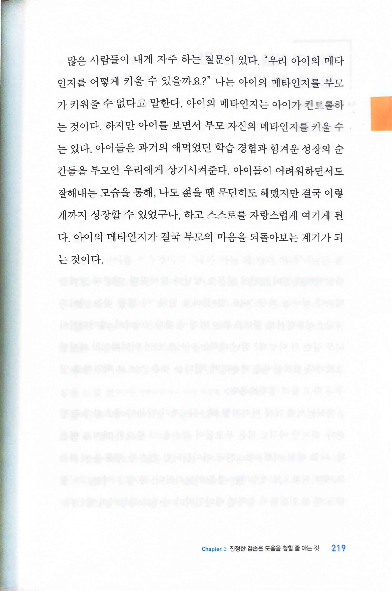

> 아이의 메타인지를 부모가 키워줄 수 없다. 아이의 메타인지는 아이가 컨트롤하는 것이다. 하지만 아이를 보면서 부모 자신의 메타인지를 키울 수는 있다. 아이들은 과거의 애먹었던 학습 경험과 힘겨운 성장의 순간들을 부모인 우리에게 상기시켜준다. 아이들이 어려워하면서도잘해내는 모습을 통해, 나도 젊을 땐 무던히도 헤맸지만 결국 이렇게까지 성장할 수 있었구나, 하고 스스로를 자랑스럽게 여기게 된다. 아이의 메타인지가 결국 부모의 마음을 되돌아보는 계기가 되는 것이다.

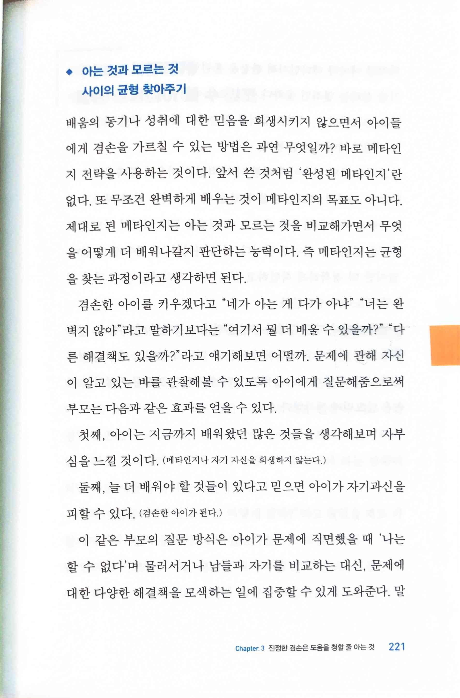

> 겸손한 아이를 키우겠다고 “네가 아는 게 다가 아냐” “너는 완벽지 않아" 라고 말하기보다는 "여기서 뭘 더 배울 수 있을까?” “다른 해결책도 있을까?"라고 얘기해보면 어떨까. 문제에 관해 자신이 알고 있는 바를 관찰해볼 수 있도록 아이에게 질문

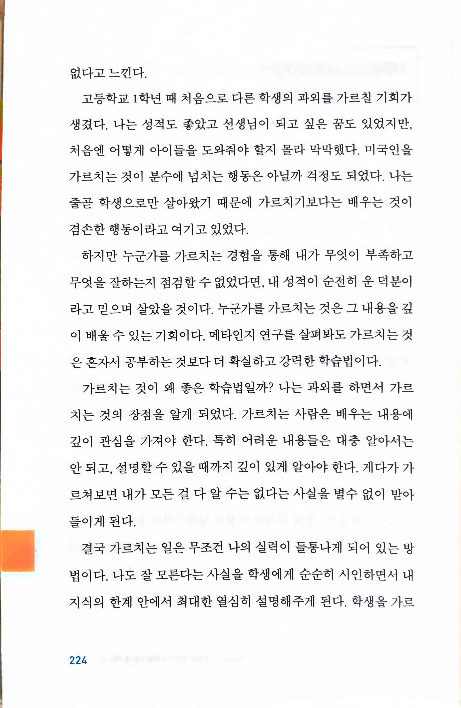

> 결국 가르치는 일은 무조건 나의 실력이 들통나게 되어 있는 방법이다. 나도 잘 모른다는 사실을 학생에게 순순히 시인하면서 내 지식의 한계 안에서 최대한 열심히 설명해주게 된다.

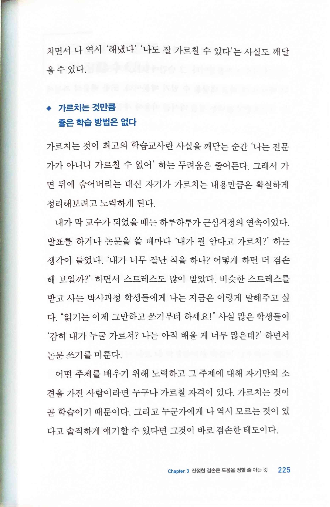

> 어떤 주제를 배우기 위해 노력하고 그 주제에 대해 자기만의 소견을 가진 사람이라면 누구나 가르칠 자격이 있다. 가르치는 것이 곧 학습이기 때문이다.

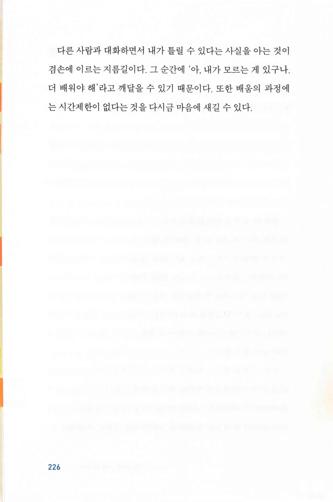

> 다른 사람과 대화하면서 내가 틀릴 수 있다는 사실을 아는 것이 겸손에 이르는 지름길이다. 그 순간에 '아, 내가 모르는 게 있구나. 더 배워야 해'라고 깨달을 수 있기 때문이다. 또한 배움의 과정에는 시간제한이 없다는 것을 다시금 마음에 새길 수 있다.

> 2010년에 <The Weirdest People in the World? (세계에서 가장 이상한 사람?)>이라는 제목을 달고 논문 하나가 게재된 적이 있다. 원래 'weird'는 '이상한'이라는 뜻인데, 이 논문에 쓰인 ‘W.E.I.R.D.’는 두문자어를 조합해서 만든 신조어다. 'Western(미국), Educated(교육을 받은), Industrialized(선진국), Rich(부유한), Democratic(민주주의의)' 성향의 사람들을 위주로 연구 데이터를 수집하다 보니, 여기서 얻어진 결과가 마치 세상 모든 사람들의 패턴이나 특성을 대변하는 것처럼 착각을 일으킨다는 것이다. 실제로 더 큰 범주나 맥락에서 보면 W.E.I.R.D의 데이터가 '이상할 정도로 제한적인 편협한 경우가 많은데도 말이다.
 
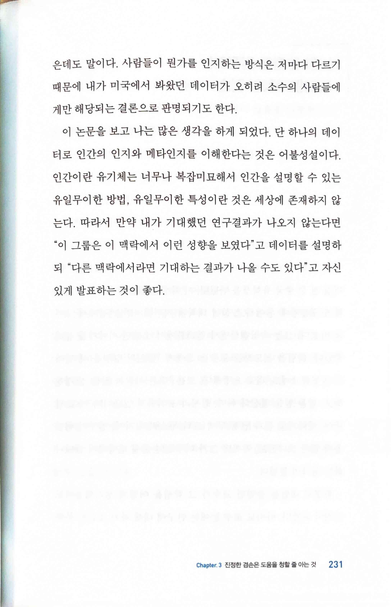

> 인간이란 유기체는 너무나 복잡미묘해서 인간을 설명할 수 있는 유일무이한 방법, 유일무이한 특성이란 것은 세상에 존재하지 않는다.

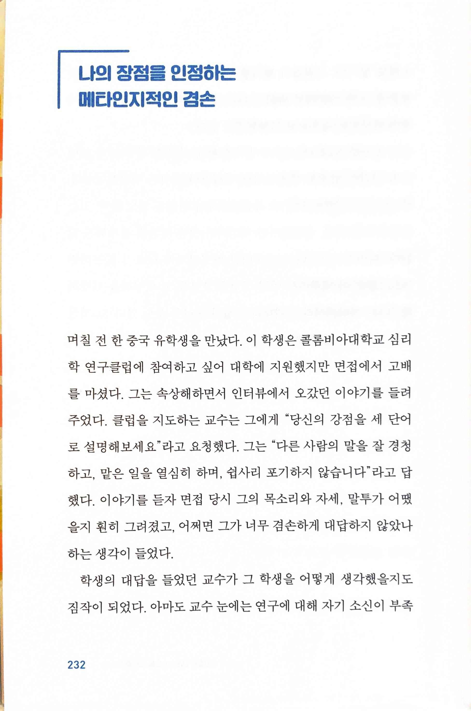 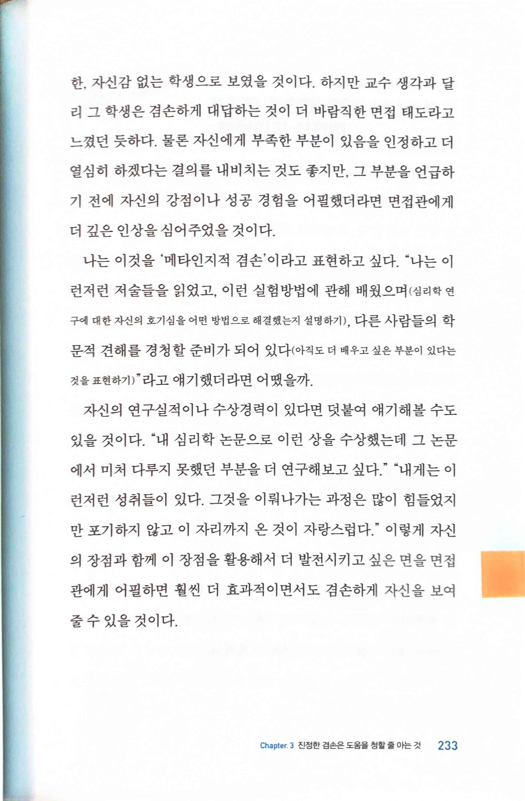

> 자신의 장점과 함께 이 장점을 활용해서 더 발전시키고 싶은 면을 면접관에게 어필하면 훨씬 더 효과적이면서도 겸손하게 자신을 보여줄 수 있을 것이다.

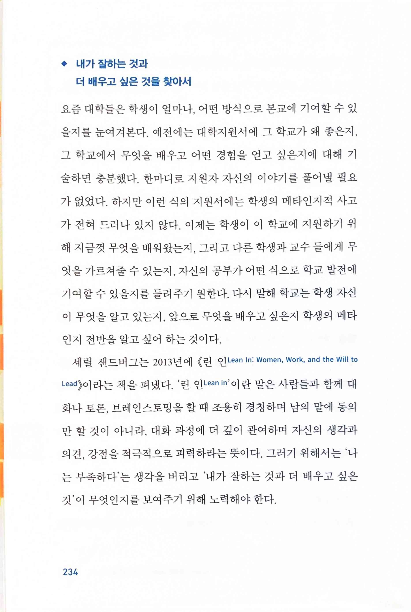

> '린 인 Lean in'이란 말은 사람들과 함께 대화나 토론, 브레인스토밍을 할 때 조용히 경청하며 남의 말에 동의만 할 것이 아니라, 대화 과정에 더 깊이 관여하며 자신의 생각과 의견, 강점을 적극적으로 피력하라는 뜻이다. 그러기 위해서는 '나는 부족하다'는 생각을 버리고 '내가 잘하는 것과 더 배우고 싶은 것'이 무엇인지를 보여주기 위해 노력해야 한다.

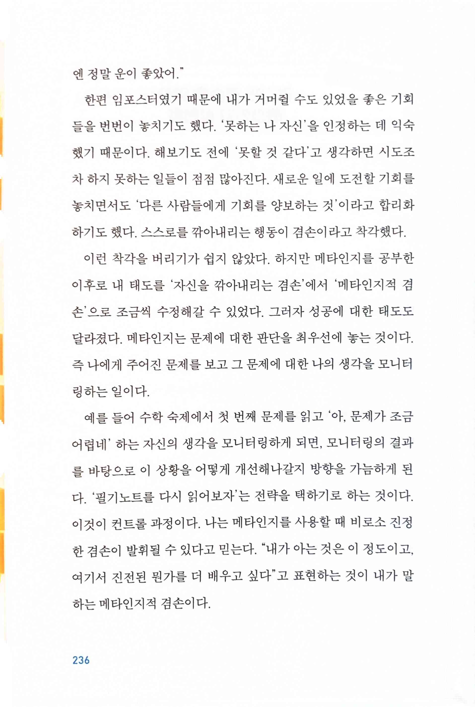

> '자신을 깎아내리는 겸손'에서 '메타인지적 겸손'으로 조금씩 수정... 메타인지는 문제에 대한 판단을 최우선에 놓는 것이다.즉 나에게 주어진 문제를 보고 그 문제에 대한 나의 생각을 모니터링하는 일이다.
 
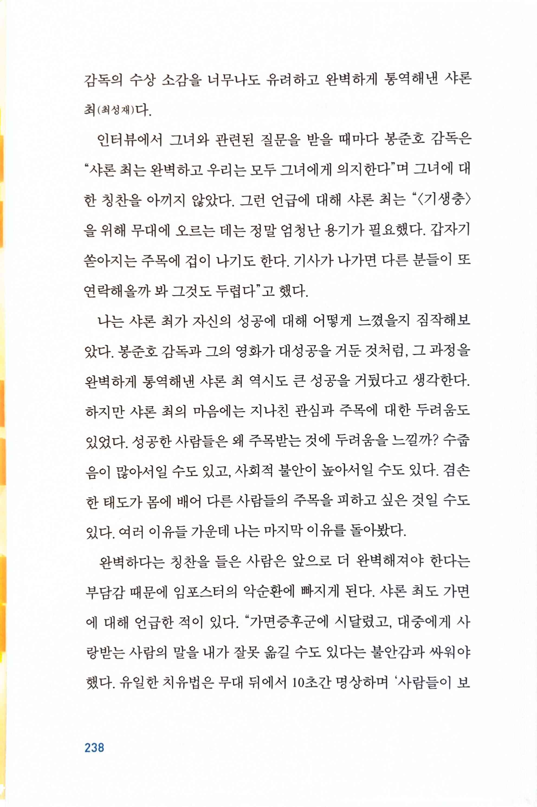

> 완벽하다는 칭찬을 들은 사람은 앞으로 더 완벽해져야 한다는 부담감 때문에 임포스터의 악순환에 빠지게 된다.

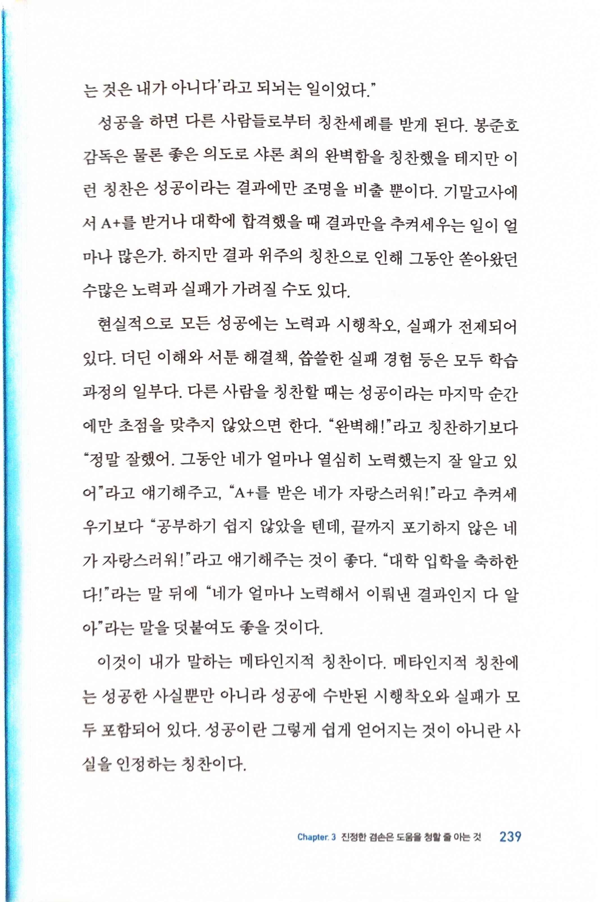

> 현실적으로 모든 성공에는 노력과 시행착오, 실패가 전제되어있다. 더딘 이해와 서툰 해결책, 씁쓸한 실패 경험 등은 모두 학습과정의 일부다. 다른 사람을 칭찬할 때는 성공이라는 마지막 순간에만 초점을 맞추지 않았으면 한다...
>
> 이것이 내가 말하는 메타인지적 칭찬이다. 메타인지적 칭찬에는 성공한 사실뿐만 아니라 성공에 수반된 시행착오와 실패가 모두 포함되어 있다. 성공이란 그렇게 쉽게 얻어지는 것이 아니란 사실을 인정하는 칭찬이다.

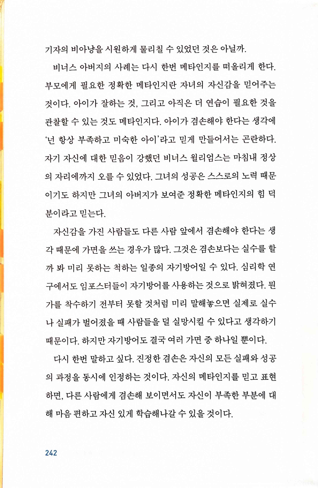

> 부모에게 필요한 정확한 메타인지란 자녀의 자신감을 믿어주는 것이다.
>
> 진정한 겸손은 자신의 모든 실패와 성공의 과정을 동시에 인정하는 것이다.

## Chapter 4 부모와 아이 모두를 위한 '들키기 학습'
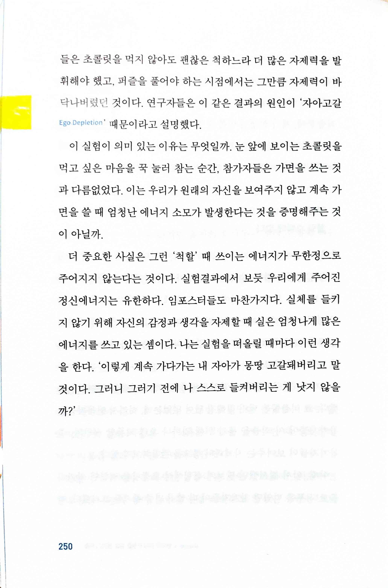

> '자아고갈Ego Depletion'
>
> 우리가 원래의 자신을 보여주지 않고 계속 가면을 쓸 때 엄청난 에너지 소모가 발생한다

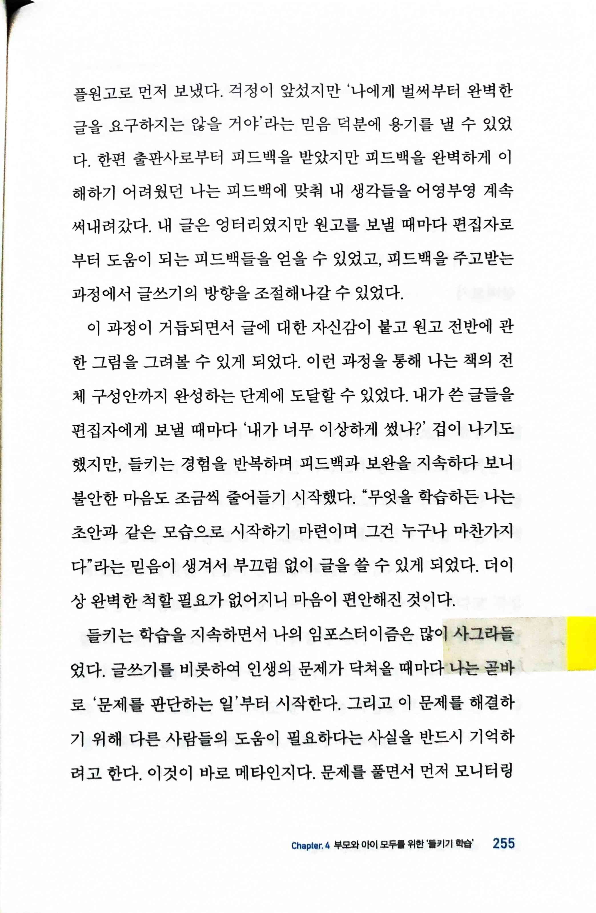

> 더이상 완벽한 척할 필요가 없어지니 마음이 편안해진 것이다.

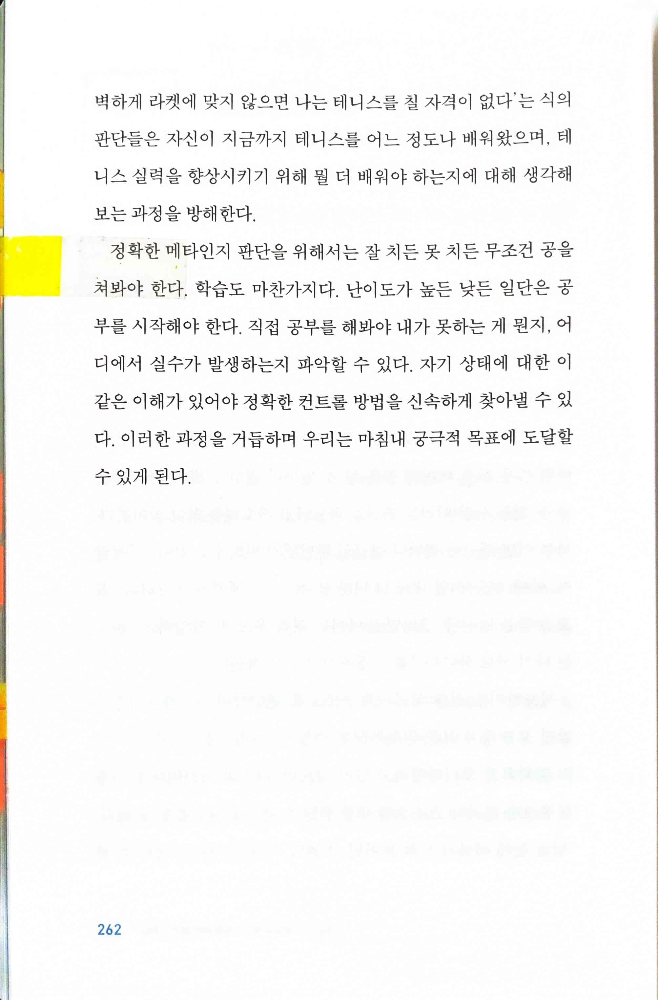

> 정확한 메타인지 판단을 위해서는 잘 치든 못 치든 무조건 공을 쳐봐야 한다. 학습도 마찬가지다. 난이도가 높든 낮든 일단은 공부를 시작해야 한다. 직접 공부를 해봐야 내가 못하는 게 뭔지, 어디에서 실수가 발생하는지 파악할 수 있다. 자기 상태에 대한 이같은 이해가 있어야 정확한 컨트롤 방법을 신속하게 찾아낼 수 있다. 이러한 과정을 거듭하며 우리는 마침내 궁극적 목표에 도달할 수 있게 된다.

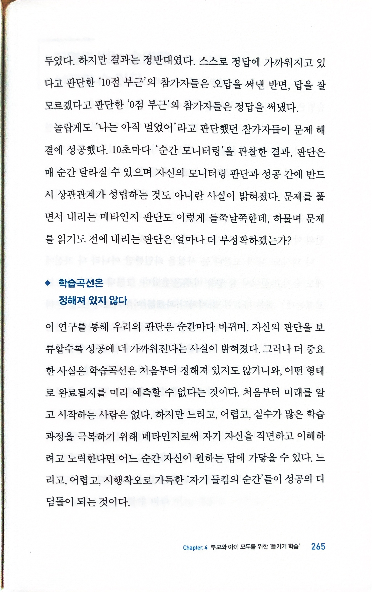

> 우리의 판단은 순간마다 바뀌며, 자신의 판단을 보류할수록 성공에 더 가까워진다는 사실이 밝혀졌다. 그러나 더 중요한 사실은 학습곡선은 처음부터 정해져 있지도 않거니와, 어떤 형태로 완료될지를 미리 예측할 수 없다는 것이다. 처음부터 미래를 알고 시작하는 사람은 없다. 하지만 느리고, 어렵고, 실수가 많은 학습과정을 극복하기 위해 메타인지로써 자기 자신을 직면하고 이해하려고 노력한다면 어느 순간 자신이 원하는 답에 가닿을 수 있다.

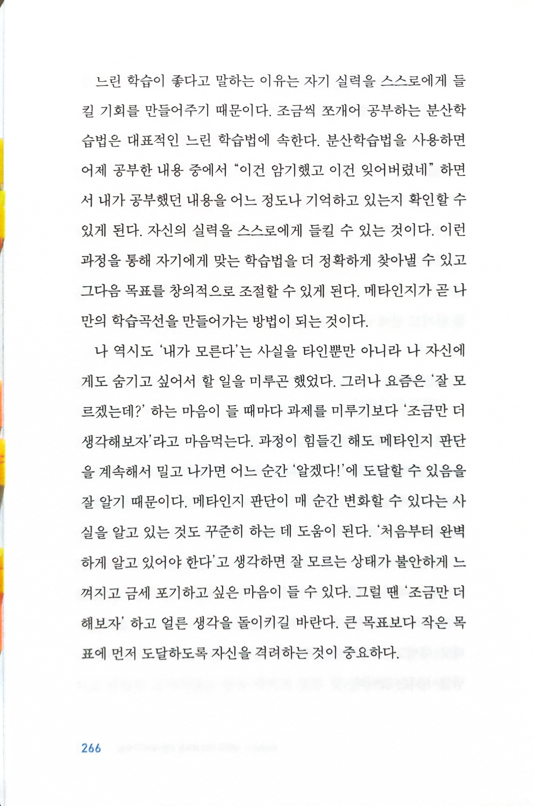

> 느린 학습이 좋다고 말하는 이유는 자기 실력을 스스로에게 들킬 기회를 만들어 주기 때문이다.

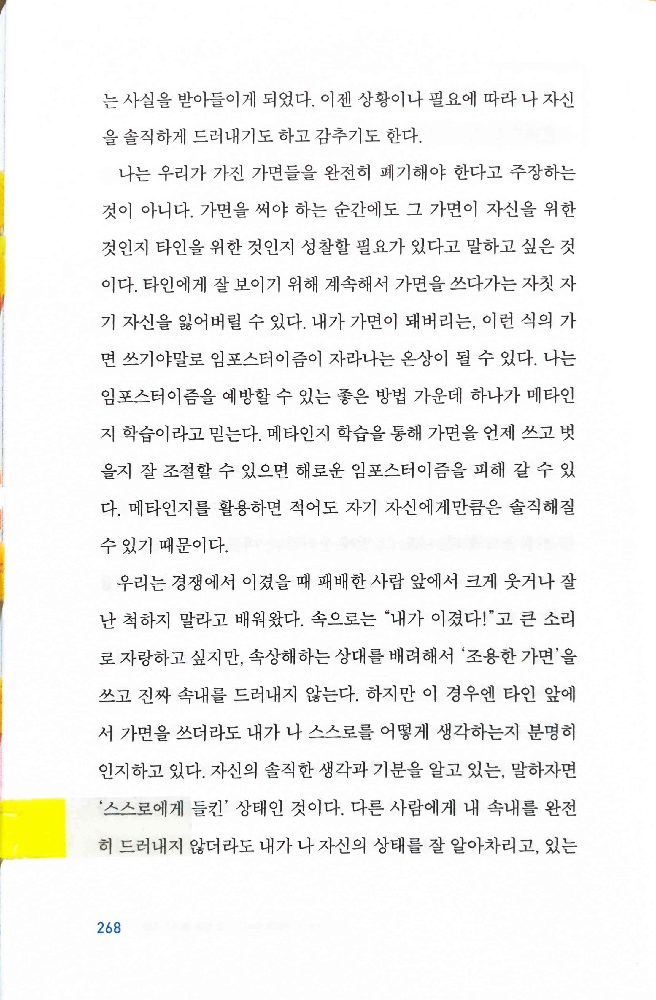 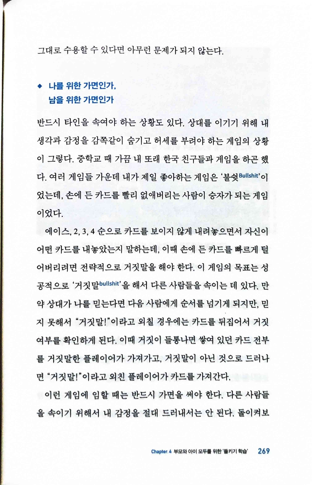

> 다른 사람에게 내 속내를 완전히 드러내지 않더라도 내가 나 자신의 상태를 잘 알아차리고 있는 그대로 수용할 수 있다면 아무런 문제가 되지 않는다.

> 보통은 솔직한 감정을 보여주는 것이 타인에게도 편안한 느낌을 준다. 상대가 솔직하게 감정을 드러내면 나 역시도 숨길 필요가 없어져 한결 편안해지기 때문이다.

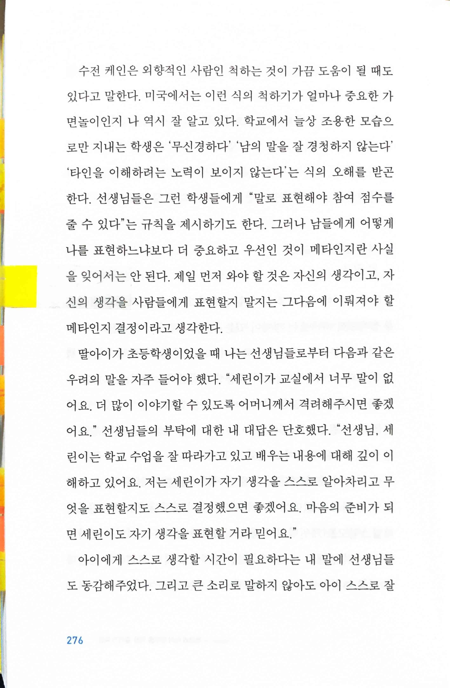

> 남들에게 어떻게나를 표현하느냐보다 더 중요하고 우선인 것이 메타인지. 제일 먼저 와야 할 것은 자신의 생각이고, 자신의 생각을 사람들에게 표현할지 말지는 그다음에 이뤄져야 할 메타인지 결정

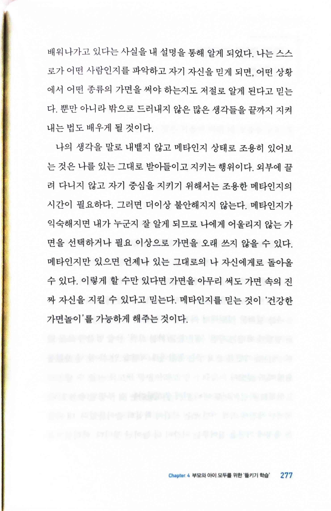

> 스스로가 어떤 사람인지를 파악하고 자기 자신을 믿게 되면, 어떤 상황에서 어떤 종류의 가면을 써야 하는지도 저절로 알게 된다

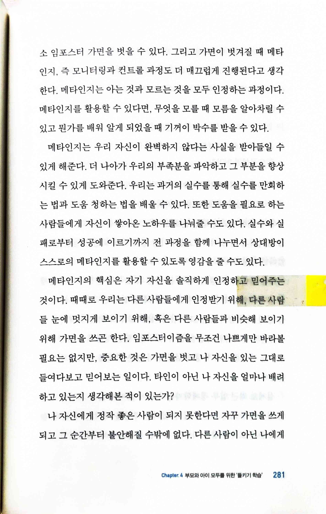

> 메타인지의 핵심은 자기 자신을 솔직하게 인정하고 믿어주는 것... 타인이 아닌 나 자신을 얼마나 배려하고 있는지 생각해본 적이 있는가?

## 에필로그 아직 임포스터로 살고 있는 부모들을 위한 생각의 길
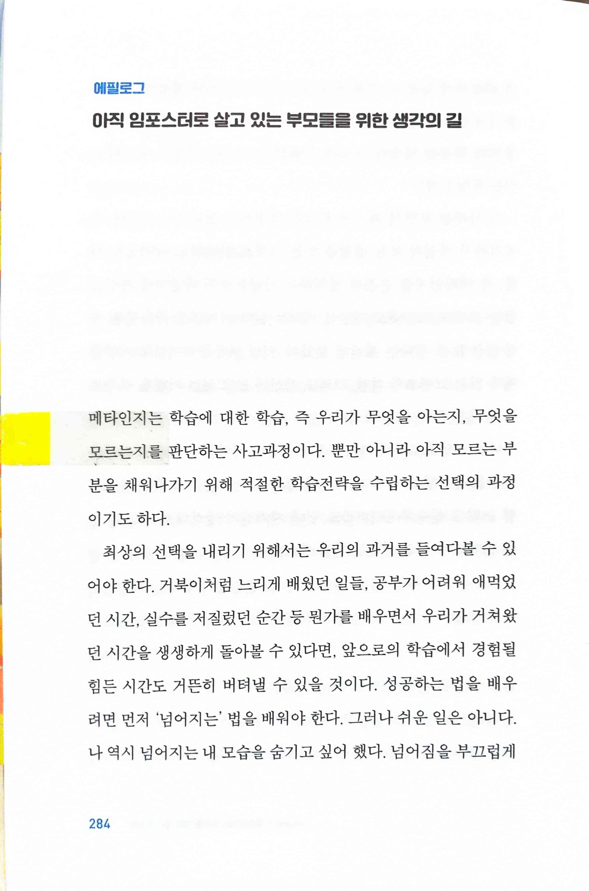

> 메타인지는 학습에 대한 학습, 즉 우리가 무엇을 아는지, 무엇을 모르는지를 판단하는 사고과정이다. 뿐만 아니라 아직 모르는 부분을 채워나가기 위해 적절한 학습전략을 수립하는 선택의 과정이기도 하다.
>
> 최상의 선택을 내리기 위해서는 우리의 과거를 들여다볼 수 있어야 한다... 성공하는 법을 배우려면 먼저 '넘어지는 법을 배워야 한다. 
