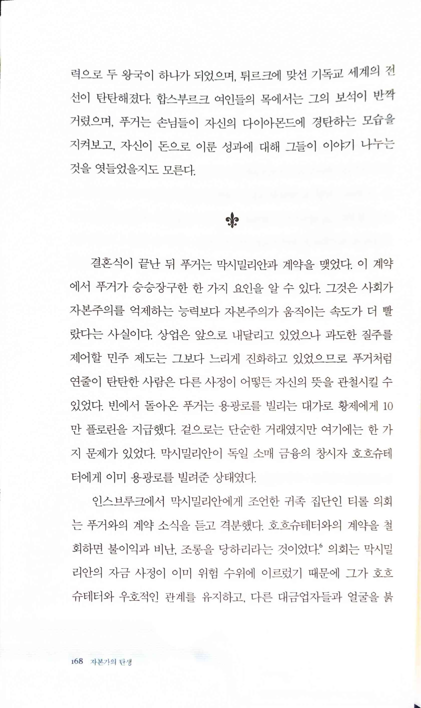
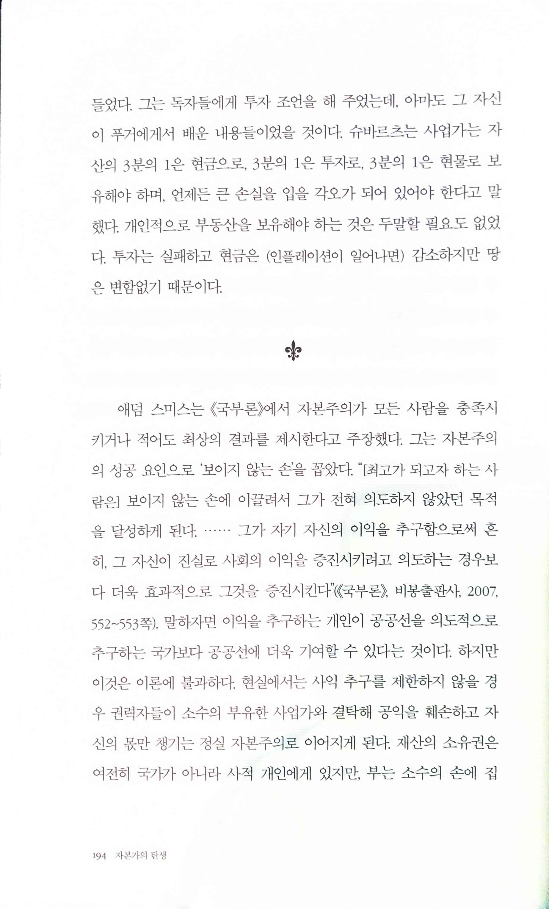
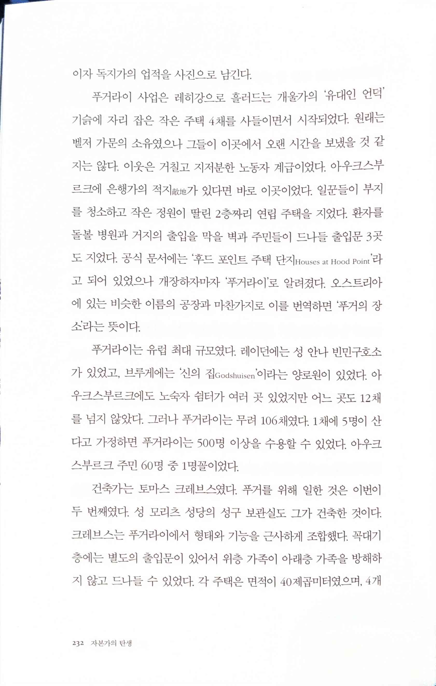
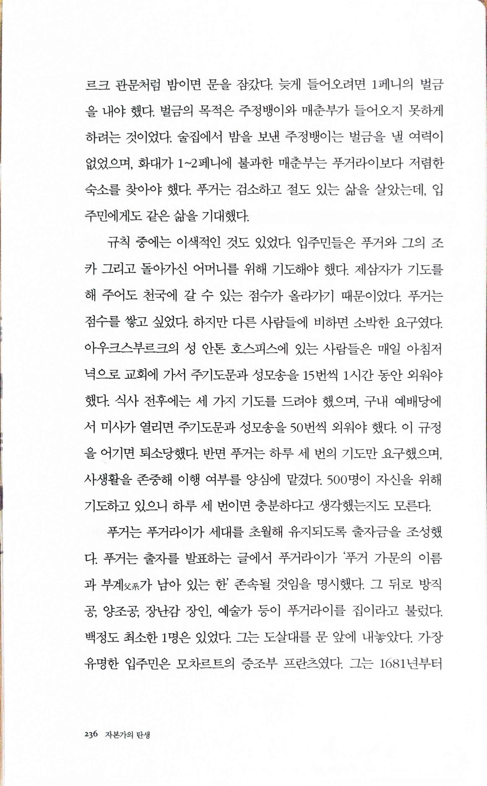
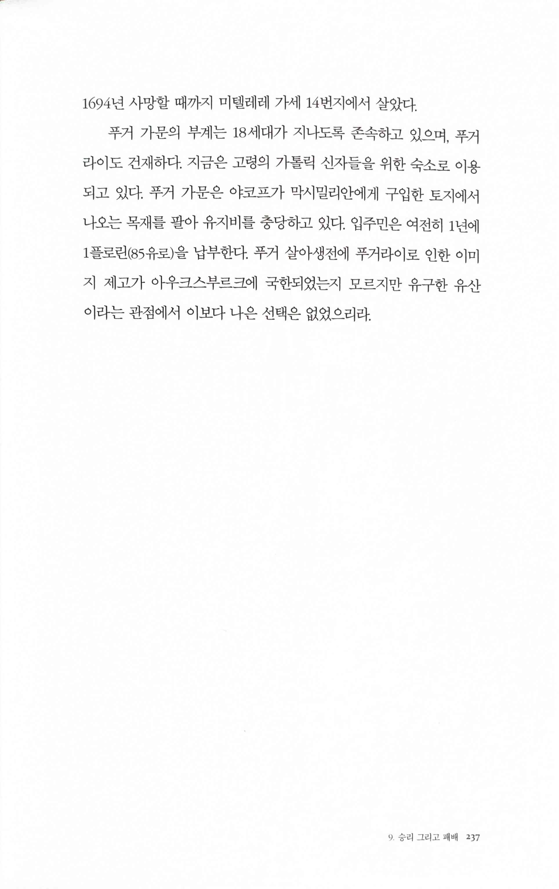

자본가의 탄생 The Life and Times of JACO FUGER THE RICHEST MAN WHO EVER LIVED
=============================================================================

> 결혼식이 끝난 뒤 푸거는 막시밀리안과 계약을 맺었다. 이 계약에서 푸거가 승승장구한 한 가지 요인을 알 수 있다. 그것은 사회가 자본주의를 억제하는 능력보다 자본주의가 움직이는 속도가 더 빨랐다는 사실이다. 상업은 앞으로 내달리고 있었으나 과도한 질주를 제어할 민주 제도는 그보다 느리게 진화하고 있었으므로 푸거처럼 연줄이 탄탄한 사람은 다른 사정이 어떻든 자신의 뜻을 관철시킬 수있었다.

> 그는 독자들에게 투자 조언을 해 주었는데, 아마도 그 자신이 푸거에게서 배운 내용들이었을 것이다. 슈바르츠는 사업가는 자산의 3분의 1은 현금으로, 3분의 1은 투자로, 3분의 1은 현물로 보유해야 하며, 언제든 큰 손실을 입을 각오가 되어 있어야 한다고 말했다. 개인적으로 부동산을 보유해야 하는 것은 두말할 필요도 없었다. 투자는 실패하고 현금은 (인플레이션이 일어나면) 감소하지만 땅은 변함없기 때문이다.
>
> 애덤 스미스는 <국부론》에서 자본주의가 모든 사람을 충족시키거나 적어도 최상의 결과를 제시한다고 주장했다. 그는 자본주의의 성공 요인으로 '보이지 않는 손'을 꼽았다. 최고가 되고자 하는 사람은 보이지 않는 손에 이끌려서 그가 전혀 의도하지 않았던 목적을 달성하게 된다. 그가 자기 자신의 이익을 추구함으로써 흔히, 그 자신이 진실로 사회의 이익을 증진시키려고 의도하는 경우보다 더욱 효과적으로 그것을 증진시킨다(《국부론》, 비봉출판사, 2007,552-553쪽). 말하자면 이익을 추구하는 개인이 공공선을 의도적으로추구하는 국가보다 공공선에 더욱 기여할 수 있다는 것이다. 하지만 이것은 이론에 불과하다. 현실에서는 사익 추구를 제한하지 않을 경우 권력자들이 소수의 부유한 사업가와 결탁해 공익을 훼손하고 자신의 몫만 챙기는 정실 자본주의로 이어지게 된다. 재산의 소유권은 여전히 국가가 아니라 사적 개인에게 있지만, 부는 소수의 손에 집중되는 것이다. 한편 경쟁이 없으면 보이지 않는 손이 유익한 효과를 발휘하지 못한다.

  

> '후드 포인트 주택 단지 Houses at Hood Point', '푸거라이'
* [16세기 독일 아우크스부르크의 푸거라이(Fuggerei) 설립과 운영](https://www.kci.go.kr/kciportal/ci/sereArticleSearch/ciSereArtiView.kci?sereArticleSearchBean.artiId=ART001985657)
* [세계 최초 사회주택 푸거라이 500주년을 맞아](https://www.yeongnam.com/web/view.php?key=20210301010000122)
* [Augsburg | #11. 푸거라이](https://reisende.tistory.com/1265)
* [푸거라이(Fuggerei) - 세계에서 가장 오래된 사회복지시설](https://blog.naver.com/tnghcjstkdmg/221446242074)
