제주 오름 트레킹 가이드
=======================
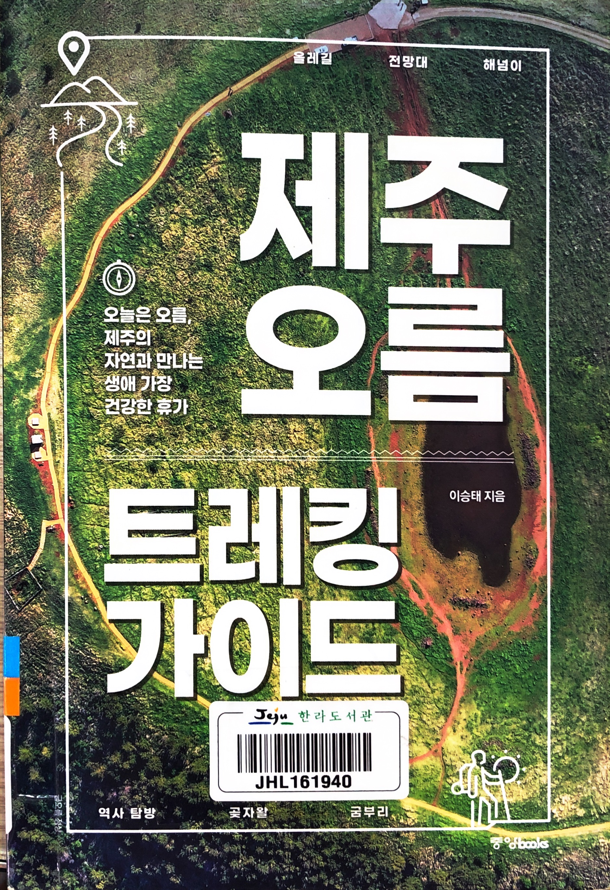

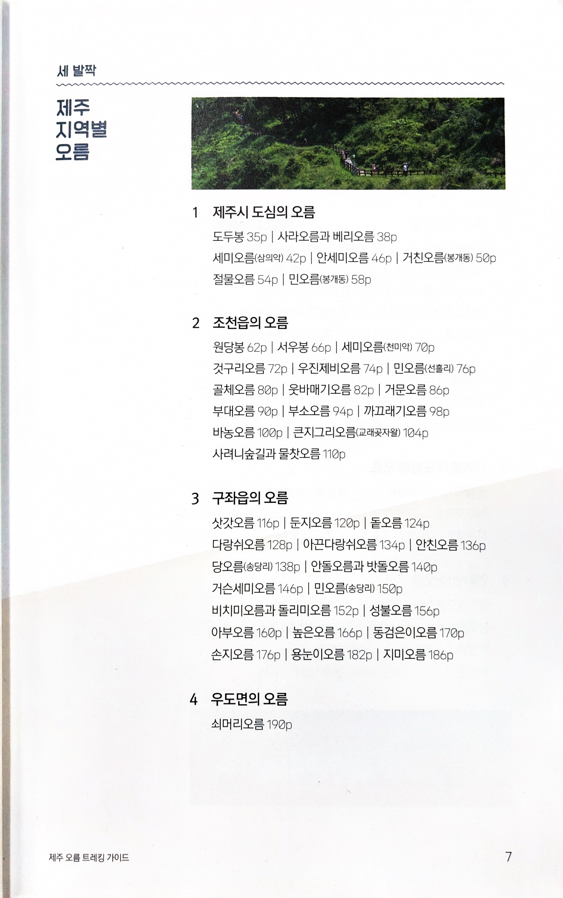

> 1 제주시 도심의 오름
>
> 도두봉 | 사라오름과 베리오름 | 세미오름(삼의악) | 안세미오름 | 거친오름(봉개동) | 절물오름 | 민오름(봉개동)
>
> 2 조천읍의 오름
>
> 원당봉 | 서우봉 | 세미오름(천미악) | 것구리오름 | 우진제비오름 | 민오름(홀리) | 골체오름 | 웃바매기오름 | 거문오름 | 부대오름 | 부소오름 | 까끄래기오름 | 바농오름 |큰지그리오름(교래곶자왈) | 사려니숲길과 물찻오름
>
> 3 구좌읍의 오름
>
> 삿갓오름 | 둔지오름 | 돝오름 | 다랑쉬오름 | 아끈다랑쉬오름 | 안친오름 | 당오름(송당리) | 안돌오름과 밧돌오름 | 거슨세미오름 | 민오름(송당리) | 비치미오름과 돌리미오름 | 성불오름 | 아부오름 | 높은오름 | 동검은이오름 | 손지오름 | 용눈이오름 | 지미오름
>
> 4 우도면의 오름
>
> 쇠머리오름

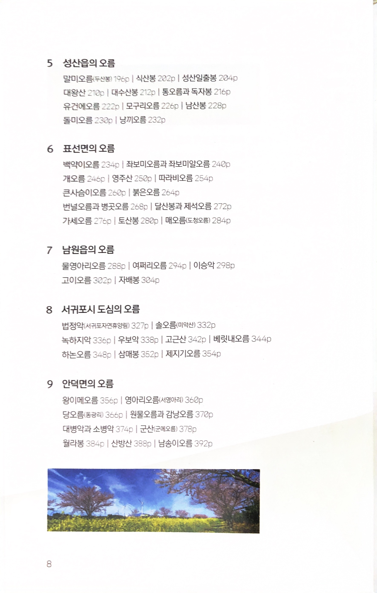

> 5 성산읍의 오름
>
> 말미오름(두산봉) | 식산봉 | 성산일출봉 | 대왕산 | 대수산봉 | 통오름과 독자봉 | 유건에오름 | 모구리오름 | 남산봉 | 돌미오름 |끼오름
>
> 6 표선면의 오름
>
> 백약이오름 | 좌보미오름과 좌보미알오름 | 개오름 | 영주산 | 따라비오름 | 큰사슴이오름 | 붉은오름 | 번널오름과 병곳오름 | 달산봉과 제석오름 | 가세오름 | 토산봉 | 매오름(도청오름)
>
> 7 남원읍의 오름
>
> 물영아리오름 | 여쩌리오름 | 이승악 | 고이오름 | 자배봉
>
> 8 서귀포시 도심의 오름
>
> 법정악(서귀포자연휴양림) | 솔오름(미악산) | 녹하지악 | 우보악 | 고근산 | 베릿내오름 | 하논오름 | 삼매봉 | 제지기오름
>
> 9 안덕면의 오름
>
> 왕이메오름 | 영아리오름(서영아리) | 당오름(동광리) | 원물오름과 감낭오름 | 대병악과 소병악 | 군산(군메오름) | 월라봉 | 산방산 | 남송이오름

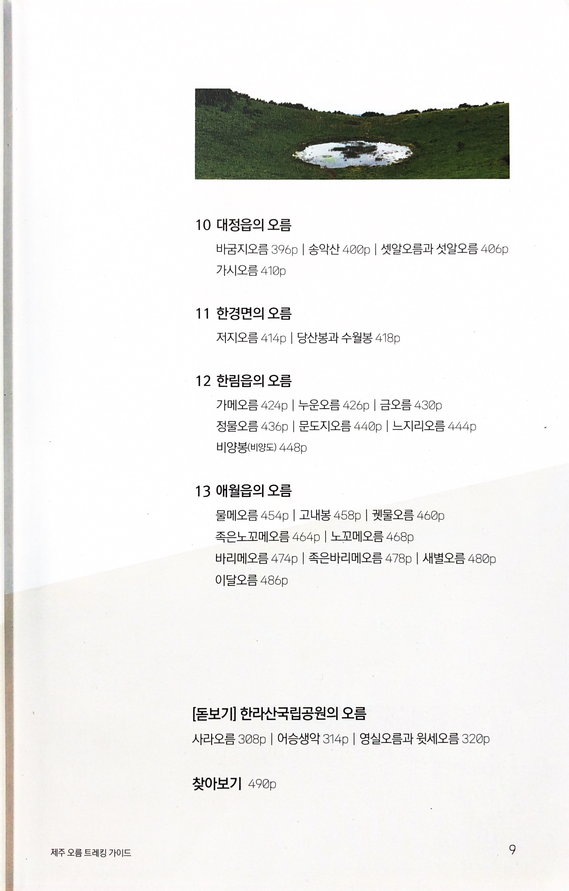

> 10 대정읍의 오름
>
> 바굼지오름 | 송악산 |셋알오름과 섯알오름 | 가시오름
>
> 11 한경면의 오름
>
> 저지오름 | 당산과 수월봉
>
> 12 한림읍의 오름
>
> 가메오름 | 누운오름 | 금오름 | 정물오름 | 문도지오름 |느지리오름 | 비양봉(비양도)
>
> 13 애월읍의 오름
>
> 물메오름 | 고내봉 | 궷물오름 | 족은노꼬메오름 | 노꼬메오름 | 바리메오름 | 족은바리메오름 | 새별오름 | 이달오름
>
> [돋보기] 한라산국립공원의 오름
>
> 사라오름 | 어승생악 | 영실오름과 윗세오름

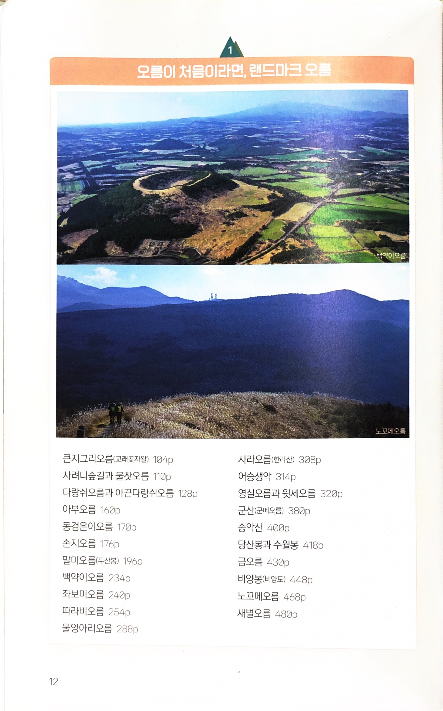

* 오름이 처음이라면, 랜드마크 오름
  * 큰지그리오름(교래곶자왈)
  * 사려니숲길과 물찻오름
  * 다랑쉬오름과 아끈다랑쉬오름
  * 아부오름 
  * 동검은이오름
  * 손지오름
  * 말미오름(두산봉)
  * 백약이오름
  * 좌보미오름 따라비오름
  * 물영아리오름
  * 사라오름(한라산) 어승생악
  * 영실오름과 윗세오름
  * 군산(군메오름)
  * 송악산
  * 당산봉과 수월봉
  * 금오름
  * 비양봉(양도)
  * 노꼬메오름
  * 새별오름

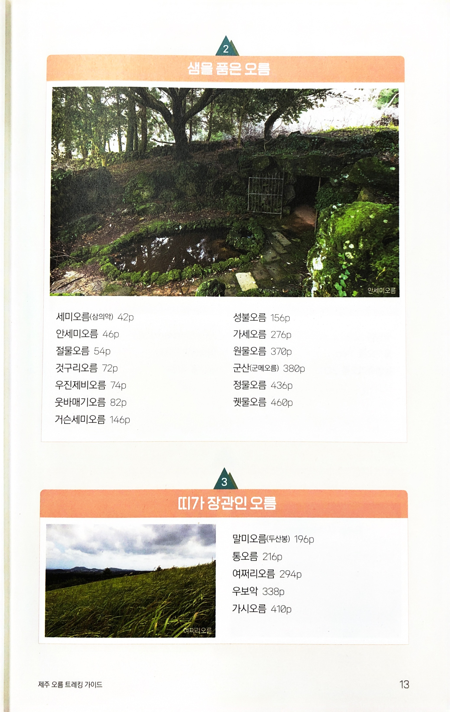

* 샘을 품은 오름
  * 세미오름(삼의악)
  * 안세미오름
  * 절물오름
  * 것구리오름
  * 우진제비오름
  * 웃바매기오름
  * 거슨세미오름
  * 성불오름
  * 가세오름
  * 원물오름
  * 군산(군메오름)
  * 정물오름
  * 귓물오름
* 띠가 장관인 오름
  * 말미오름(두산봉)
  * 통오름
  * 여쩌리오름
  * 우보악
  * 가시오름

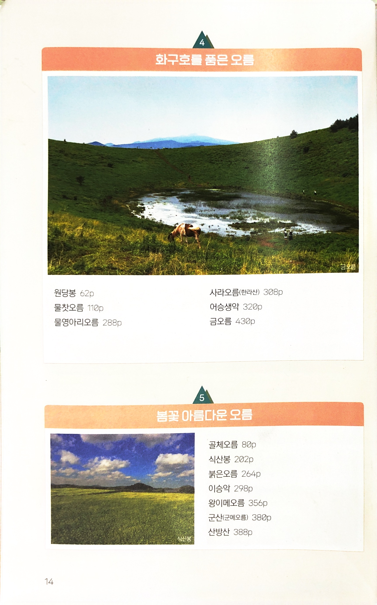

* 화구호를 품은 오름
  * 원당봉
  * 물찻오름
  * 물영아리오름
  * 사라오름(한라산)
  * 어승생악
  * 금오름
* 봄꽃 아름다운 오름
  * 골체오름
  * 식산봉
  * 붉은오름
  * 이승악
  * 왕이메오름
  * 군산(군메오름)
  * 산방산

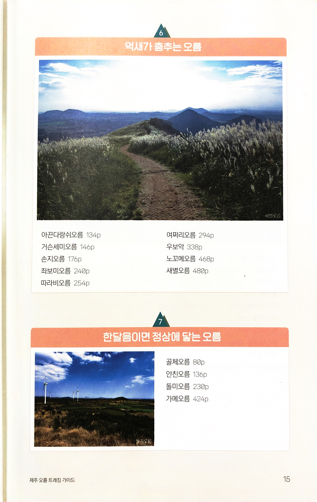

* 억새가 춤추는 오름
  * 아끈다랑쉬오름
  * 거슨세미오름
  * 손지오름
  * 좌보미오름
  * 따라비오름
  * 여쩌리오름
  * 우보악
  * 노꼬메오름
  * 새별오름
* 한달음이면 정상에 닿는 오름
  * 골체오름
  * 안친오름
  * 돌미오름
  * 가메오름

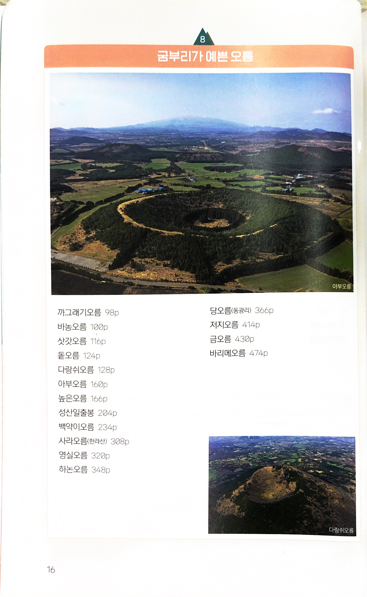

* 굼부리가 예쁜 오름
  * 까그래기오름
  * 바농오름
  * 삿갓오름
  * 돝오름
  * 다랑쉬오름
  * 아부오름
  * 높은오름
  * 성산일출봉
  * 백약이오름
  * 사라오름(한라산)
  * 영실오름
  * 하논오름
  * 당오름(동광리)
  * 저지오름
  * 금오름
  * 바리메오름

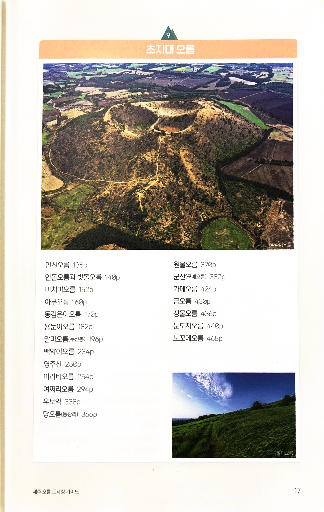

* 초지대 오름
  * 안친오름
  * 안돌오름과 밧돌오름
  * 비치미오름
  * 아부오름
  * 동검은이오름
  * 용눈이오름
  * 말미오름(두산봉)
  * 백약이오름
  * 영주산
  * 따라비오름
  * 여쩌리오름
  * 우보악
  * 당오름(동광리)
  * 원물오름
  * 군산(군메오름)
  * 가메오름
  * 금오름
  * 정물오름
  * 문도지오름
  * 노꼬메오름

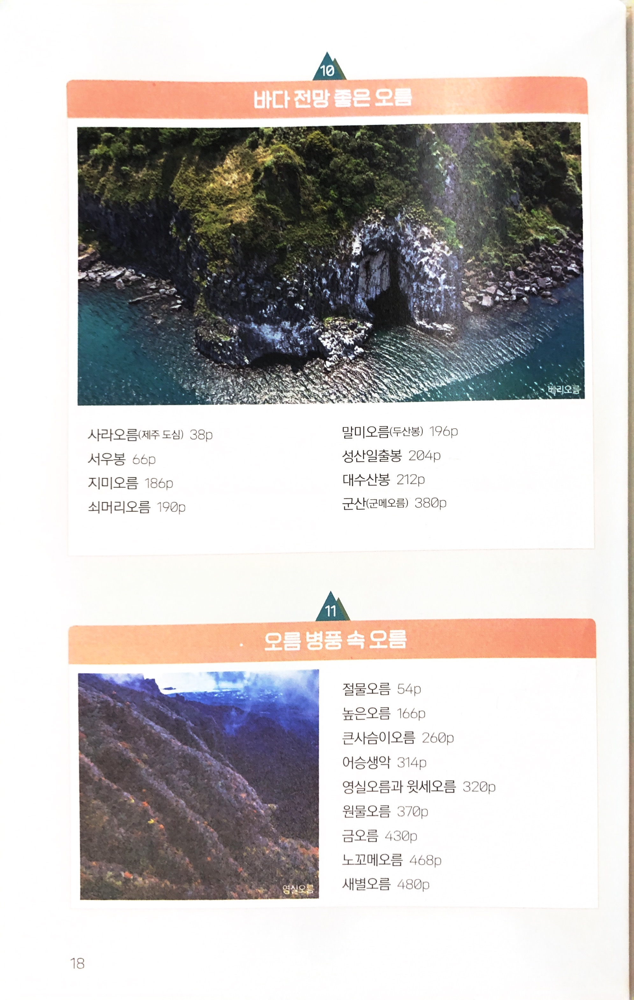

* 바다전망 좋은 오름
  * 사라오름(제주 도심)
  * 서우봉
  * 지미오름
  * 쇠머리오름
  * 말미오름(두산봉)
  * 성산일출봉
  * 대수산봉
  * 군산(군메오름)
* 오름 병풍 속 오름
  * 절물오름
  * 높은오름
  * 큰사슴이오름
  * 어승생악
  * 영실오름과 윗세오름
  * 원물오름
  * 금오름
  * 노꼬메오름
  * 새별오름

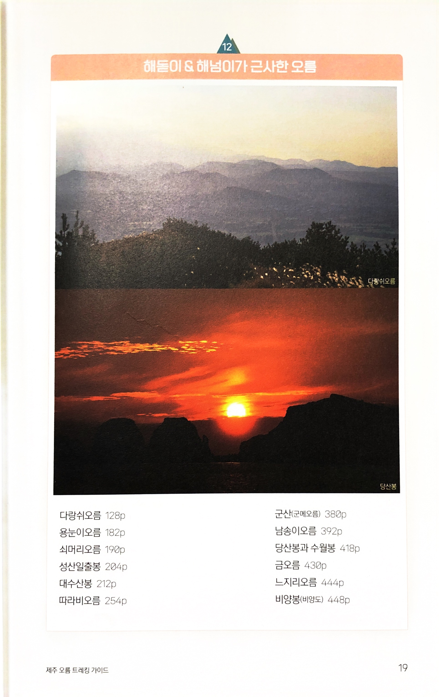

* 해돋이 & 해넘이가 근사한 오름
  * 다랑쉬오름
  * 용눈이오름
  * 쇠머리오름
  * 성산일출봉
  * 대수산봉
  * 따라비오름
  * 군산(군메오름)
  * 남송이오름
  * 당산봉과 수월봉
  * 금오름
  * 느지리오름
  * 비양봉(비양도)