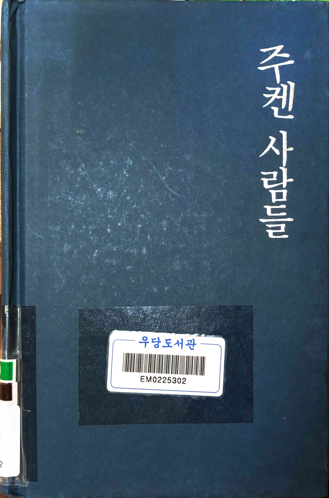
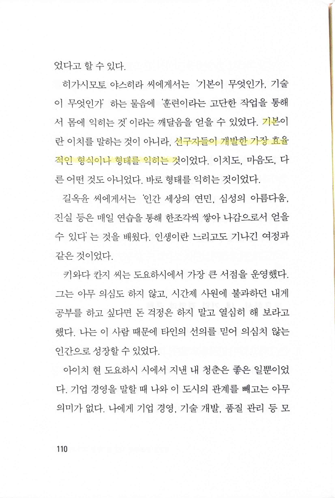
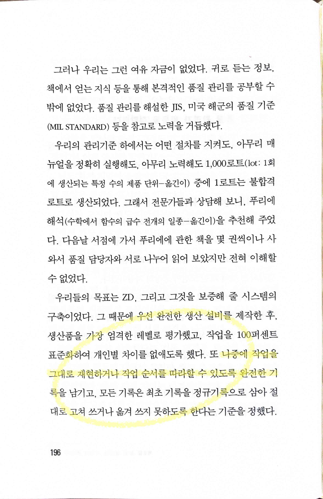
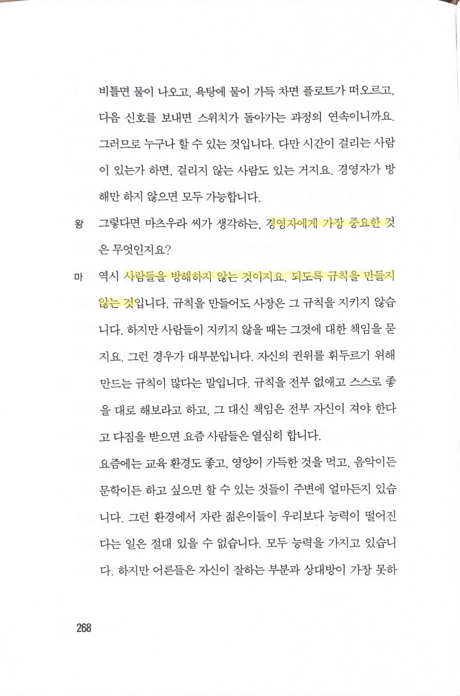
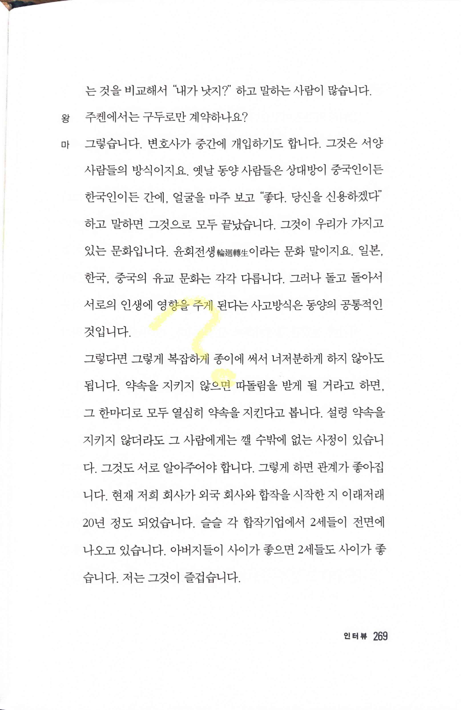

# 주켄 사람들

Tags: management
Date: January 6, 2024
Score: ★★★☆☆

- ★★★☆☆ 2024.01.05~06 기대했던 바와 다르게 어떻게 이런 운영을 하게 되었는지는 많이 나오지는 않아 아쉬웠음

- 요즘 계속해서 다시 생각하는 기본에 대한 꽤 괜찮은 이야기. 선구자들이 만들어 놓은 효율적인 걸 익히는 것만으로도 어렵고, 모든 걸 따라하기도 어렵다. 내가 교과서에 대해 하던 이야기와 비슷하다는 점에서 마음에 많이 와 닿는다

- 누구나 그대로 재현하고 다시 따라할 수 있게 작성해놓는다면 정말 완벽한 문서화. 더 골을 읽으면서부터 많이 느끼고 있지만 대체로 sw 업계에서 싫어하고 따라하고 싶지 않아하는 제조업의 여러가지 best practice들은 process 관점에서 볼 때 배우고 실천할 만한 게 정말 많다(물론 그럼에도 맞지 않는 이식의 시도들 - e.g. six sigma - 도 많이 있었지만)

- 이 부분이 이 책을 읽게 된 계기를 설명해주는 부분일텐데, 너무 단촐해서 아쉽다. 사람들을 방해하지 않아야(그래서 자율적인 환경을 조성하고 motivation을 극대화) 하지만, 또 큰 목표를 따라가도록 해야 할텐데, 이 조화를 어떻게 이뤄야 하는지는 모르겠다. 책에도 더 이상의 설명은 없음

- 이 부분은 도저히 이해가 안 가는 부분. 계약서가 없이 믿음만으로 일을 진행하는데 또 수십년을 지속적으로 성장할 수 있었다니?! 문제를 일으키는 파트너는 단 한 번도 없었던 걸까? 정말 궁금하다
