# 한국인들의 이상한  행복
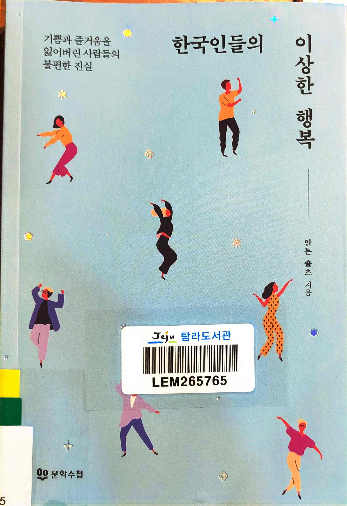

* 전반적으로 틀린 이야기는 아니라고 생각하지만, 어떻게 보면 전형적인 유럽인의 보수적인 시각에서 쓴 책

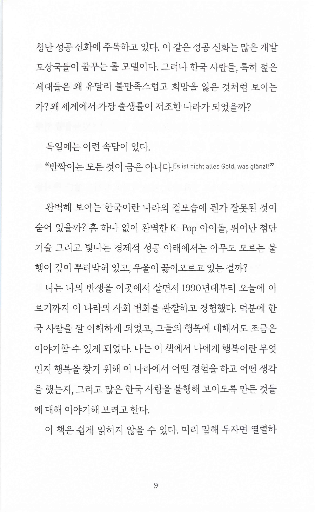

> (독일 속담) "반짝이는 모든 것이 금은 아니다. Es ist nicht alles Gold, was glänzt!”

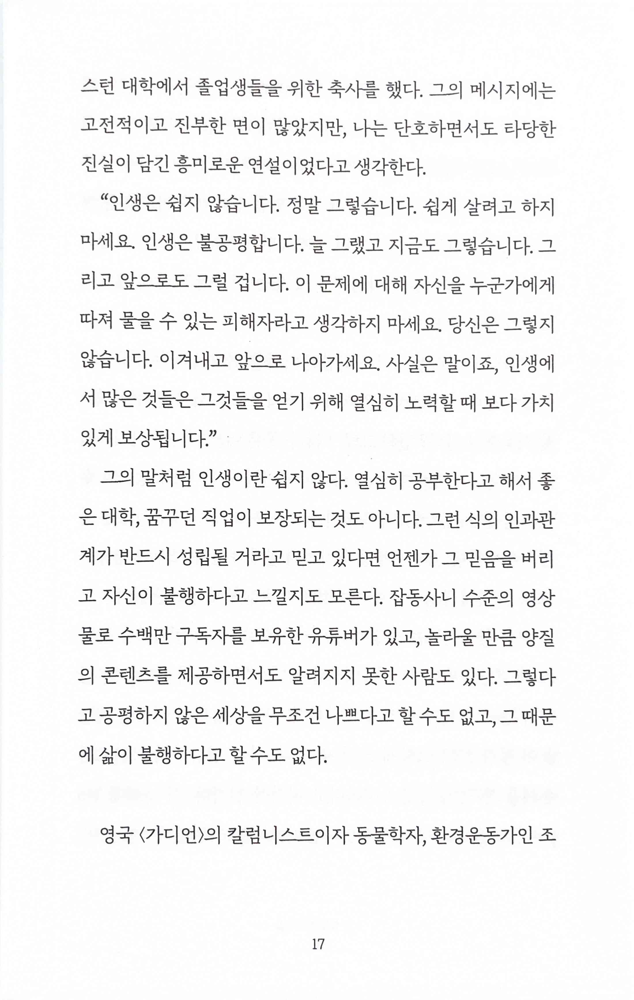

> (2016년 미국의 배우 매슈 매코너헤이Matthew McConaughey는 휴스턴 대학 졸업생들을 위한 축사)
>
> "인생은 쉽지 않습니다. 정말 그렇습니다. 쉽게 살려고 하지마세요. 인생은 불공평합니다. 늘 그랬고 지금도 그렇습니다. 그리고 앞으로도 그럴 겁니다. 이 문제에 대해 자신을 누군가에게 따져 물을 수 있는 피해자라고 생각하지 마세요. 당신은 그렇지않습니다. 이겨내고 앞으로 나아가세요. 사실은 말이죠, 인생에서 많은 것들은 그것들을 얻기 위해 열심히 노력할 때 보다 가치있게 보상됩니다.”

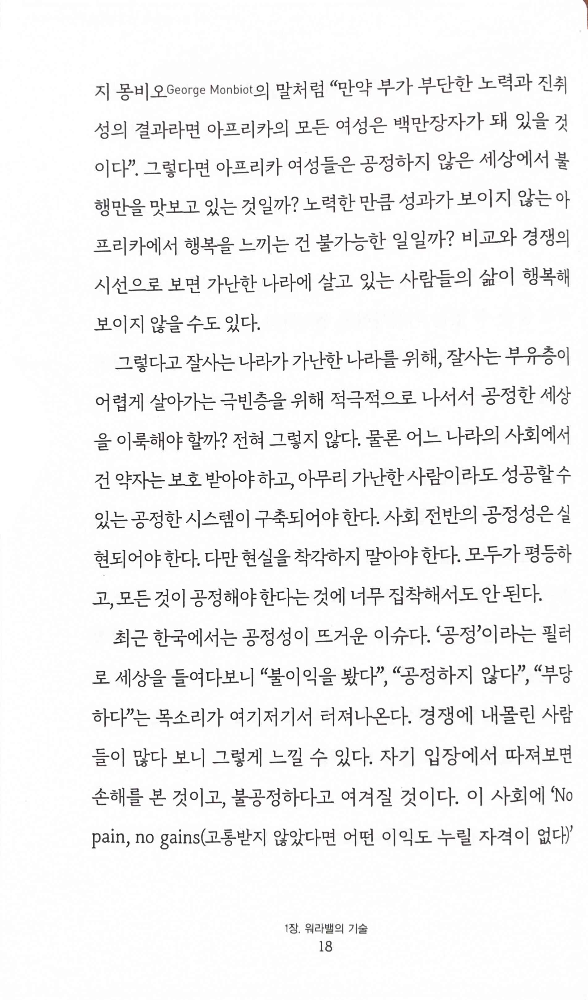

> (영국 <가디언>의 칼럼니스트이자 동물학자, 환경운동가인 조지 몽비오George Monbiot) “만약 부가 부단한 노력과 진취성의 결과라면 아프리카의 모든 여성은 백만장자가 돼 있을 것이다."

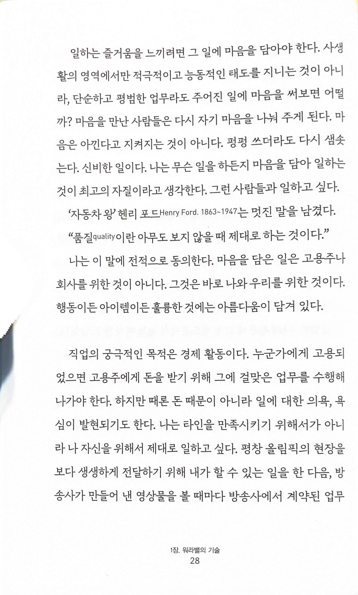

> ('자동차왕' 헨리 포드 Henry Ford) "품질quality 이란 아무도 보지 않을 때 제대로 하는 것이다."

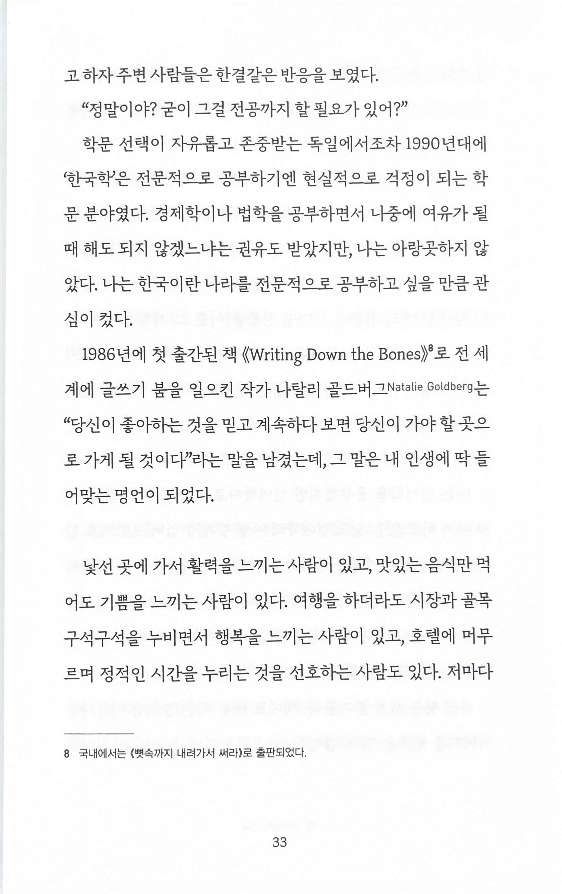

> (나탈리 골드버그 Natalie Goldberg) "당신이 좋아하는 것을 믿고 계속하다 보면 당신이 가야 할 곳으로 가게 될 것이다”

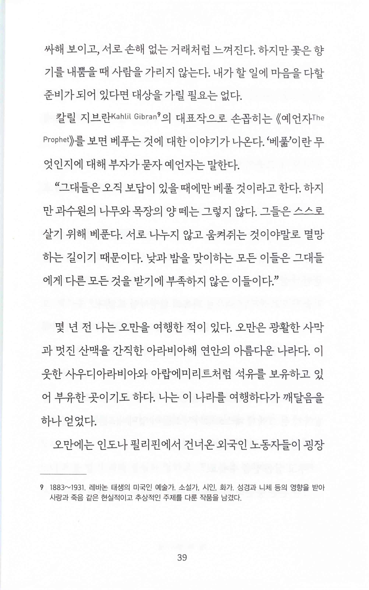

> (칼릴 지브란Kahlil Gibran, 예언자The Prophet) "그대들은 오직 보답이 있을 때에만 베풀 것이라고 한다. 하지만 과수원의 나무와 목장의 양 떼는 그렇지 않다. 그들은 스스로 살기 위해 베푼다. 서로 나누지 않고 움켜쥐는 것이야말로 멸망하는 길이기 때문이다. 낮과 밤을 맞이하는 모든 이들은 그대들에게 다른 모든 것을 받기에 부족하지 않은 이들이다.”

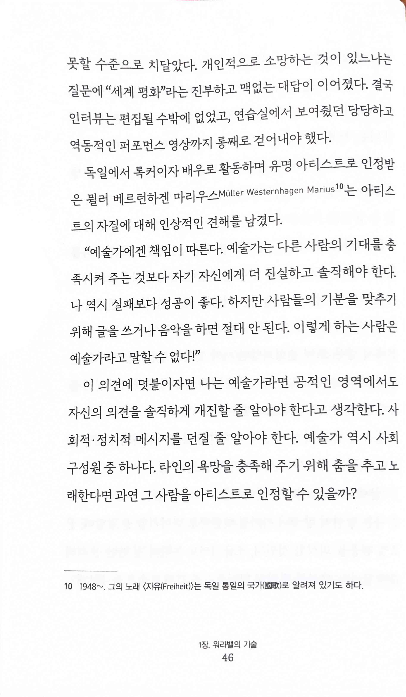

> (뮐러 베르턴하겐 마리우스Müller Westernhagen Marius) "예술가에겐 책임이 따른다. 예술가는 다른 사람의 기대를 충족시켜 주는 것보다 자기 자신에게 더 진실하고 솔직해야 한다. 나 역시 실패보다 성공이 좋다. 하지만 사람들의 기분을 맞추기 위해 글을 쓰거나 음악을 하면 절대 안 된다. 이렇게 하는 사람은 예술가라고 말할 수 없다!"

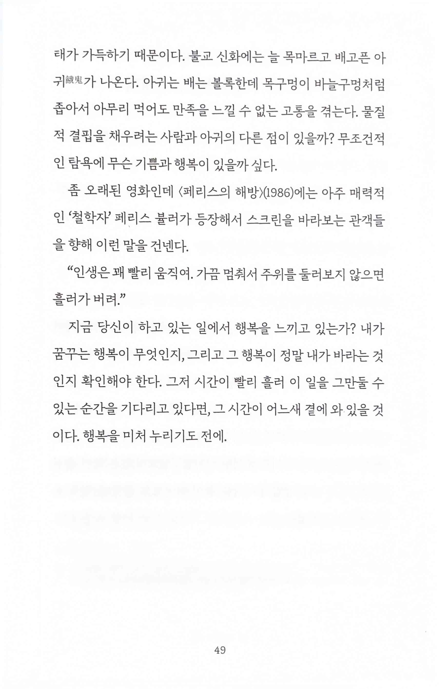

> <페리스의 해방>(1986) “인생은 꽤 빨리 움직여. 가끔 멈춰서 주위를 둘러보지 않으면 흘러가 버려."

> ('갈라하드 경Sir Galahad'/베르타 헬레네 디너Bertha HeleneDiener) “시간을 소유 have 하는 유일한 방법은 시간을 갖는 take 것이다.”
>
> (헤르만 헤세 Hermann Hesse) "노는 아이의 영혼만큼 고귀하면서도, 이해하기 어렵고, 낯선 존재가 되어 사라져 버리는 것은 없다.”

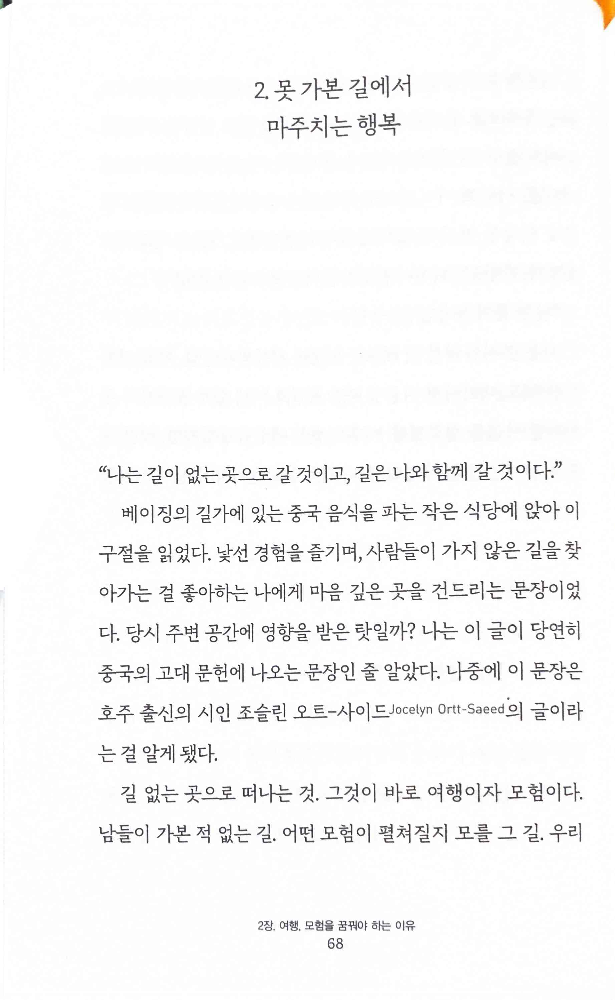

> (조슬린 오트-사이드 Jocelyn Ortt-Saeed) "나는 길이 없는 곳으로 갈 것이고, 길은 나와 함께 갈 것이다."

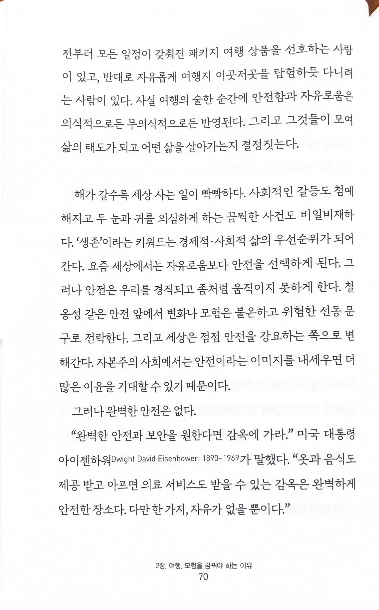

> (아이젠하워 Dwight David Eisenhower) "완벽한 안전과 보안을 원한다면 감옥에 가라. 옷과 음식도 제공 받고 아프면 의료 서비스도 받을 수 있는 감옥은 완벽하게 안전한 장소다. 다만 한가지, 자유가 없을 뿐이다.”
* 이 책에서 공감이 가는 이야기도 있지만 아닌 거도 있는데 가장 이해가기 않는 부분

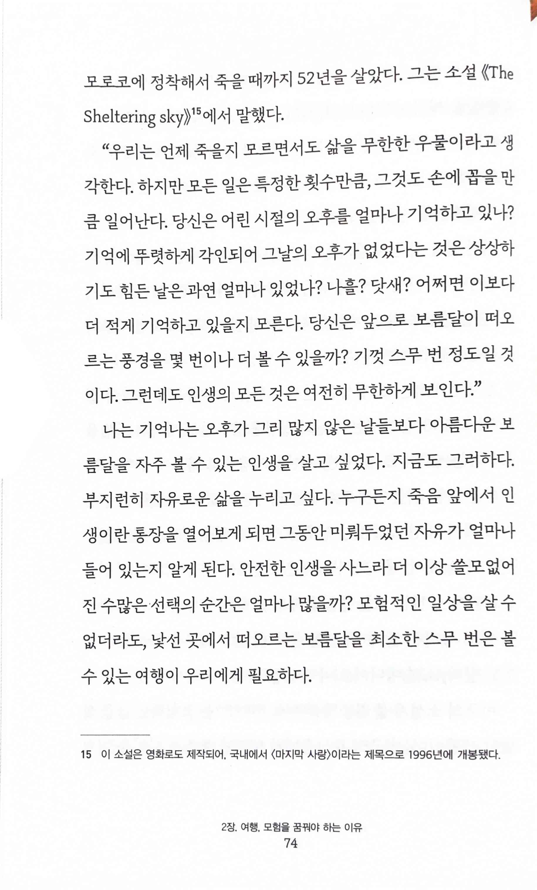

> (폴 볼스Paul Bowles, 소설 《The Sheltering sky》) "우리는 언제 죽을지 모르면서도 삶을 무한한 우물이라고 생각한다. 하지만 모든 일은 특정한 횟수만큼, 그것도 손에 꼽을 만큼 일어난다. 당신은 어린 시절의 오후를 얼마나 기억하고 있나? 기억에 뚜렷하게 각인되어 그날의 오후가 없었다는 것은 상상하기도 힘든 날은 과연 얼마나 있었나? 나흘? 닷새? 어쩌면 이보다 더 적게 기억하고 있을지 모른다. 당신은 앞으로 보름달이 떠오르는 풍경을 몇 번이나 더 볼 수 있을까? 기껏 스무 번 정도일 것이다. 그런데도 인생의 모든 것은 여전히 무한하게 보인다."

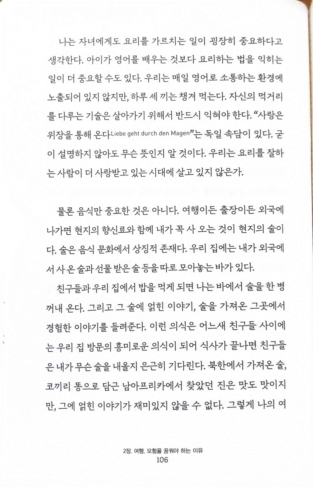

> (독일 속담) "사랑은 위장을 통해 온다 Liebe geht durch den Magen”

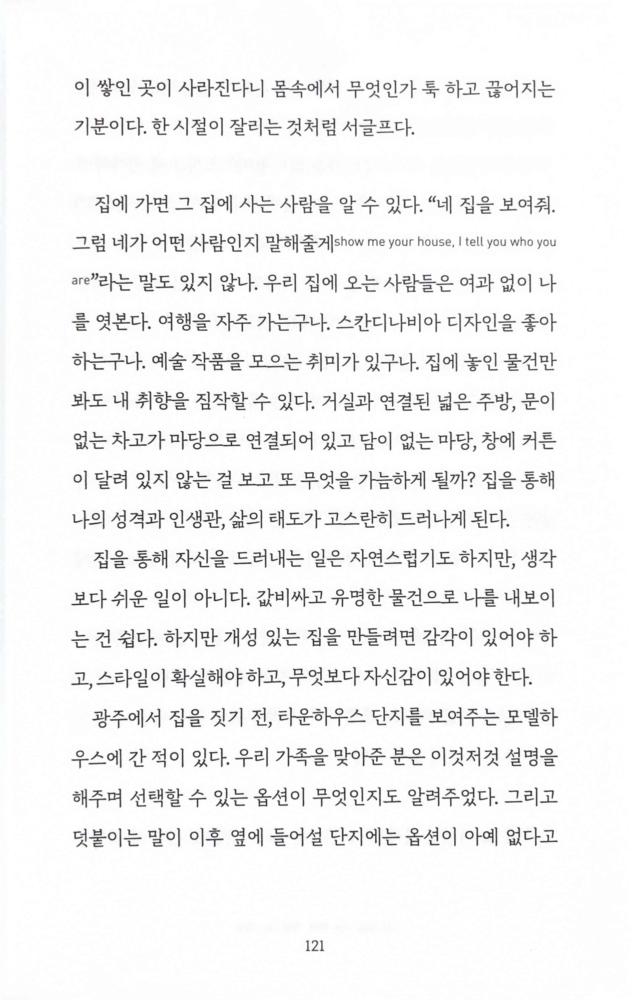

> “네 집을 보여줘.그럼 네가 어떤 사람인지 말해줄게show me your house, I tell you who you are"

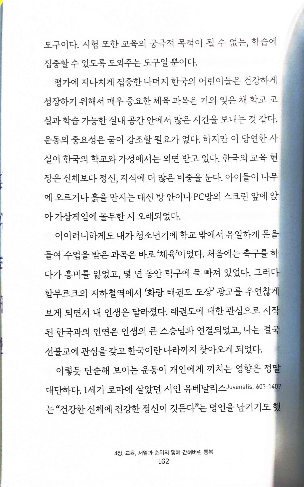

> (유베날리스 Juvenalis) "건강한 신체에 건강한 정신이 깃든다"

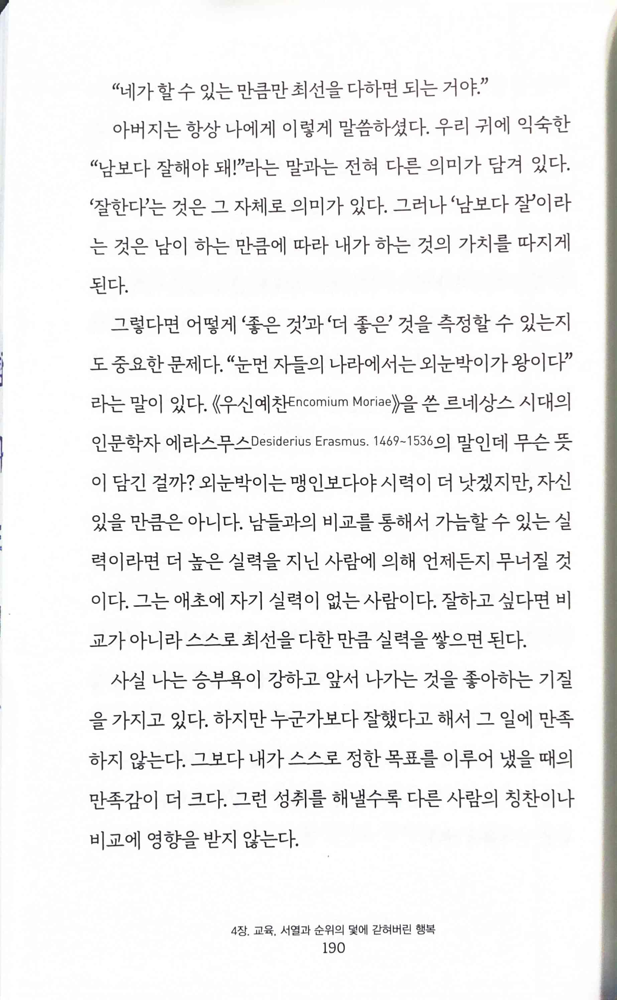

> (에라스무스Desiderius Erasmus) "눈먼 자들의 나라에서는 외눈박이가 왕이다"

> (유도의 창시자 가노 지고로嘉納治五郞) "누군가보다 나은 것이 중요한 것이 아니라 어제보다 나은 것이 중요하다."

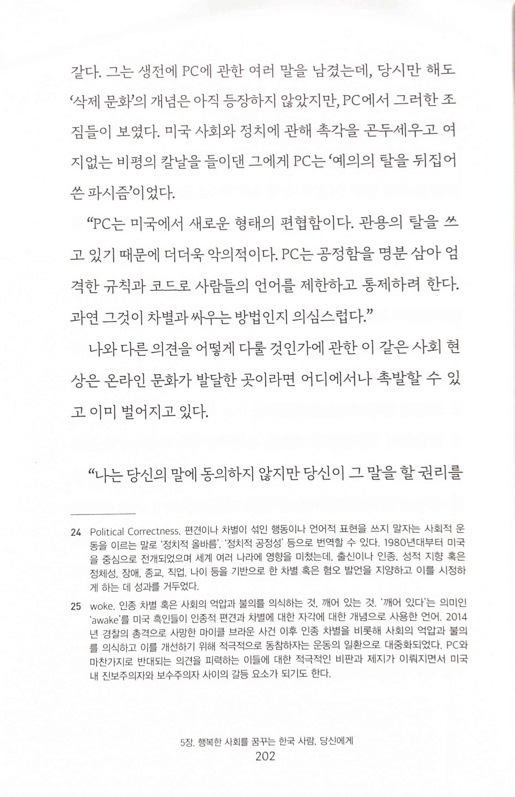

> “PC는 미국에서 새로운 형태의 편협함이다. 관용의 탈을 쓰고 있기 때문에 더더욱 악의적이다. PC는 공정함을 명분 삼아 엄격한 규칙과 코드로 사람들의 언어를 제한하고 통제하려 한다. 과연 그것이 차별과 싸우는 방법인지 의심스럽다."

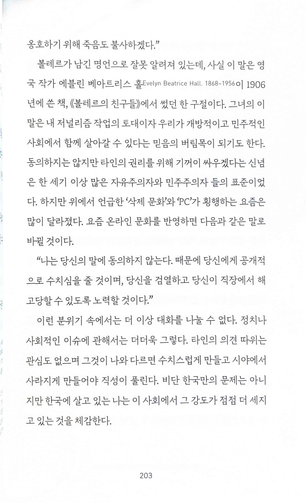

> (에블린 베아트리스 홀Evelyn Beatrice Hall, 《볼테르의 친구들>) “나는 당신의 말에 동의하지 않지만 당신이 그 말을 할 권리를 옹호하기 위해 죽음도 불사하겠다."

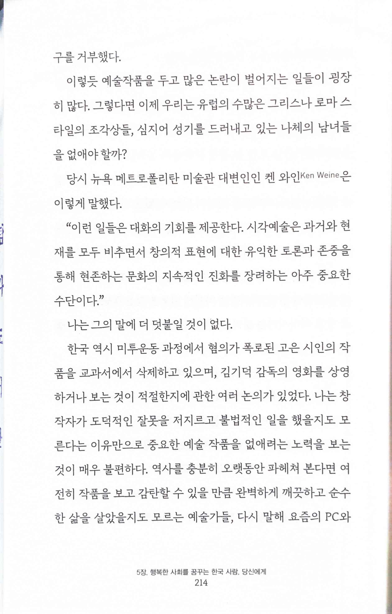

> (뉴욕 메트로폴리탄 미술관 대변인 켄 와인 Ken Weine) “이런 일들은 대화의 기회를 제공한다. 시각 예술은 과거와 현재를 모두 비추면서 창의적 표현에 대한 유익한 토론과 존중을 통해 현존하는 문화의 지속적인 진화를 장려하는 아주 중요한 수단이다.”