리프트오프
==========
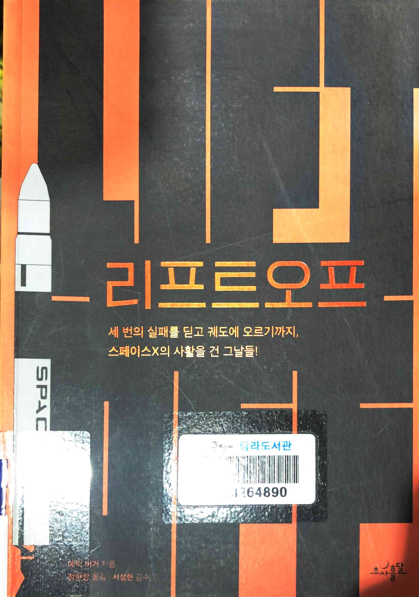

# 1 초창기 EARLY YEARS 2000년 9월~2004년 12월
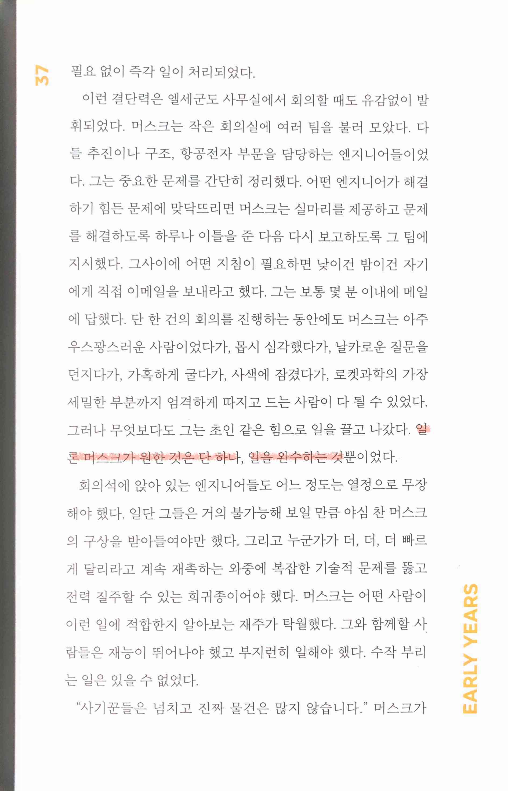

> 일론 머스크가 원한 것은 단 하나, 일을 완수하는 것뿐이었다.

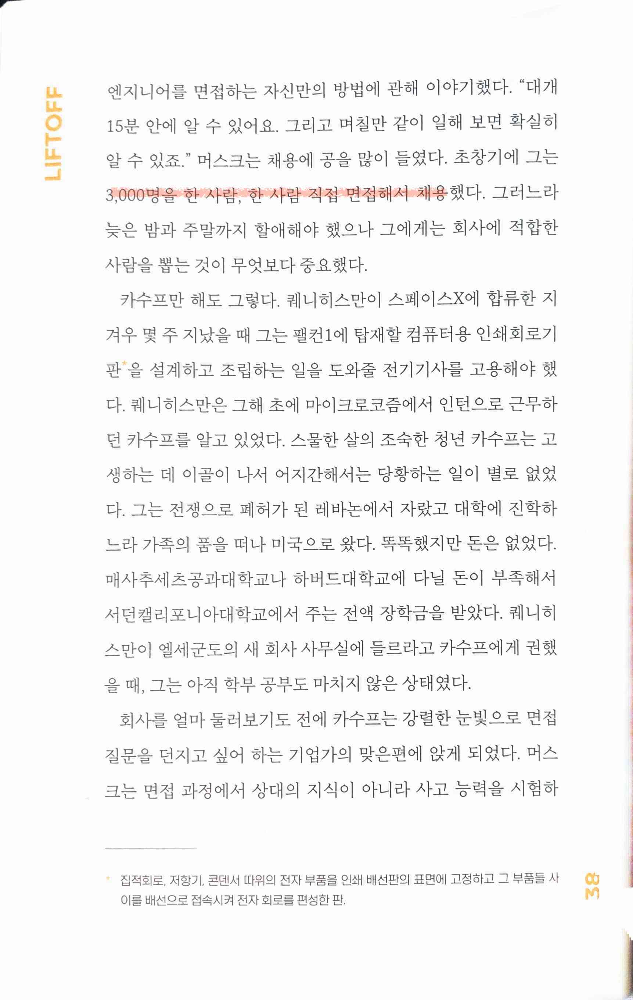

> 초창기에 그는 3,000명을 한 사람, 한 사람 직접 면접해서 채용했다.
* 직접 같이 일하는 게 최고의 방법이라는 건 당연히 동의. 하지만 그렇게 할 수 없으니 interview가 있는 건데, 15분 안에 알 수 있다는 건 뛰어난 사람의 직감일텐데 내겐 도움이 안 된다. 

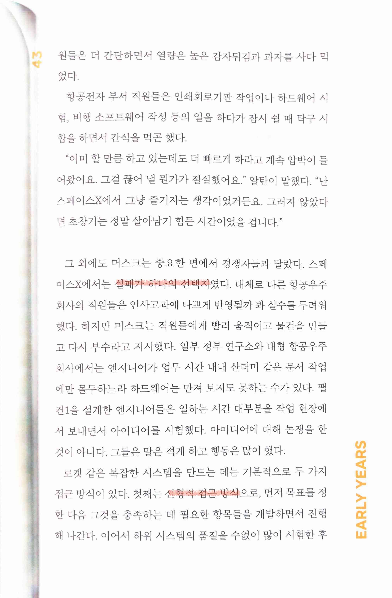

> 스페이스X에서는 실패가 하나의 선택지

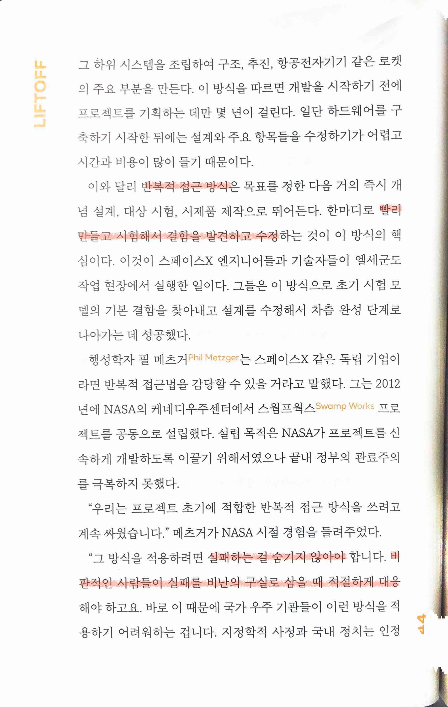

> 복잡한 시스템을 만드는 데는 기본적으로 두 가지 접근 방식... 첫째는 선형적 접근 방식으로, 먼저 목표를 정한 다음 그것을 충족하는 데 필요한 항목들을 개발하면서 진행... 이와 달리 반복적 접근 방식은 목표를 정한 다음 거의 즉시 개념 설계, 대상 시험, 시제품 제작으로 뛰어든다. 한마디로 빨리만들고 시험해서 결함을 발견하고 수정하는 것이 이 방식의 핵심
* 전형적인 waterfall vs. agile 아닌가?
> 그 방식을 적용하려면 실패하는 걸 숨기지 않아야 합니다. 비판적인 사람들이 실패를 비난의 구실로 삼을 때 적절하게 대응해야 하고요.

> 스페이스X에서 실패가 선택 사항이었던 까닭은 사장이 직원들에게 불가능한 일을 자주 요구했기 때문이기도 하다.

# 2 MERLIN 멀린 2002년 8월~2003년 3월
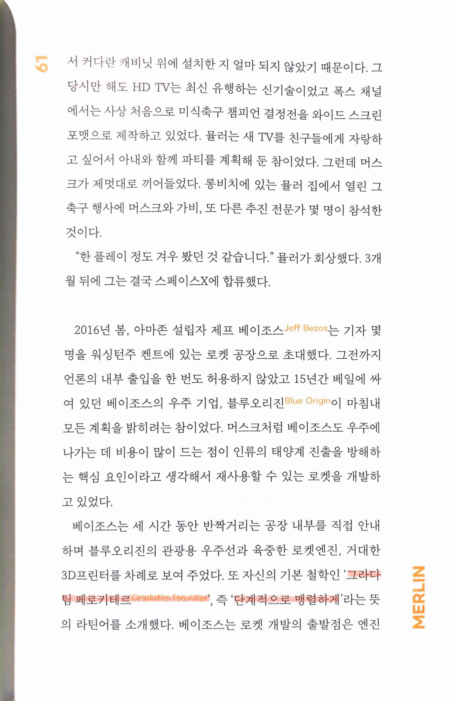

> 베이조스 '그라다팀 페로키테르 Gradatirn ferociter', 즉 '단계적으로 맹렬하게'라는 뜻의 라틴어
* [Gradatim Ferociter! Jeff Bezos explains Blue Origin's motto, logo ... and the boots – GeekWire](https://www.geekwire.com/2016/jeff-bezos-blue-origin-motto-logo-boots/)

# 3 콰절레인 KWAJALEIN 2003년 1월~2005년 5월

# 4 1차발사 FLIGHT ONE 2005년 5월~2006년 6월
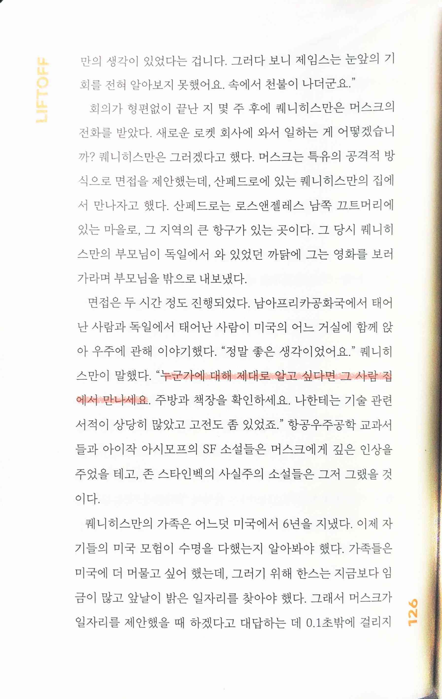

> 누군가에 대해 제대로 알고 싶다면 그 사람 집에서 만나세요.
* 이런 걸 볼 때마다 미국사람들의 개인주의에 대해 생각해보게 된다. 얘들은 굉장히 개인적인 듯 싶으면서도 (특히 미국애들) 국가나 국기에 대해 이야기할 때는 또 굉장히 전체주의적으로 보이기도 하고. 문화적인 부분을 이해 못해서 그렇긴 하겠지만 이런 거도 참 신기하다. 직접 만나서 이야기하는 게 중요하다는 데는 매우 동의하지만, 집에서 만난다는 건 쉽지 않은 일 아닌가?

# 5 발사 서비스 판매 SELLING ROCKETS 2002년 8월~2006년 8월

> 머스크의 경영 스타일. 뭔가를 하는것에 관하여 말하지 말라, 그냥 하라.

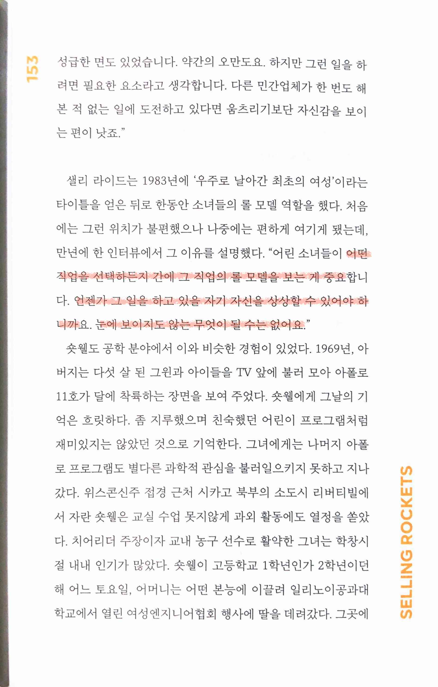

> 샐리 라이드, 1983년에 '우주로 날아간 최초의 여성'... "어린 소녀들이 어떤 직업을 선택하든지 간에 그 직업의 롤 모델을 보는 게 중요합니다. 언젠가 그 일을 하고 있을 자기 자신을 상상할 수 있어야 하니까요. 눈에 보이지도 않는 무엇이 될 수는 없어요.”
* 어린 소녀만이 아니라 모든 사람들에게 마찬가지

> 설계 단계 초기에 실수를 찾아내서 최종 제품에 오류가 생기지 않게끔 싹을 잘라내는 것이 스페이스X의 방식이라고 참을성 있게 설명
* 실수/실패를 허용해서 빠르게 수정하는 것과 초기에 실수를 찾아내서 방지하는 건 병행이 되는 건가?
> 머스크는 회의하면서 즉각 결정을 내리곤 했다. 이것이 바로 스페이스X가 빠르게 움직일 수 있었던 비결 중 하나다.

# 2차 발사 FLIGHT TWO 2006년 3월~2007년 3월
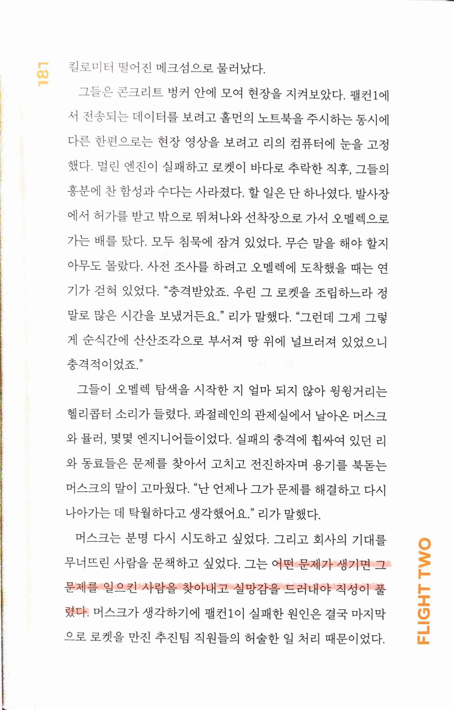

> 어떤 문제가 생기면 그 문제를 일으킨 사람을 찾아내고 실망감을 드러내야 직성이 풀렸다.
* 실망감만 드러내고 그 뒤는 깨끗하게 잊는다는 걸까? 실수/실패를 허용하고 사람을 탓하지 않는게 아닌가?

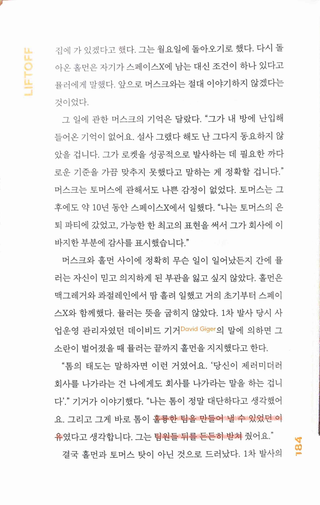

> 훌륭한 팀을 만들어 낼 수 있었던 이유... 팀원들 뒤를 든든히 받쳐

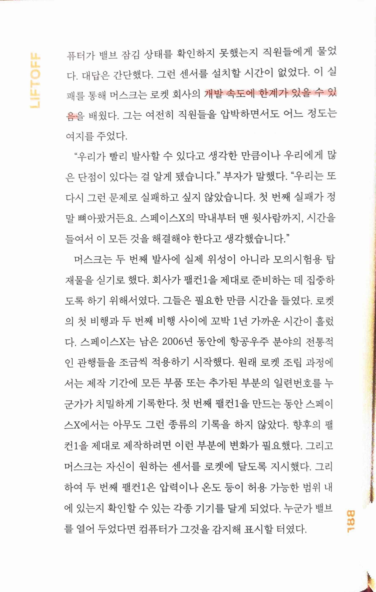

> 개발 속도에 한계가 있을 수 있음

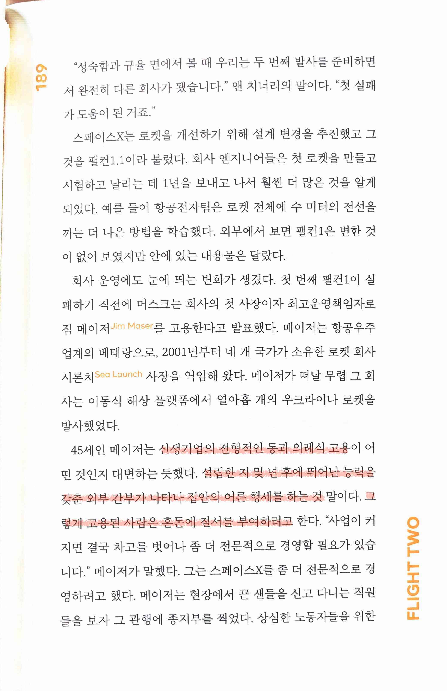

> 신생기업의 전형적인 통과 의례식 고용. 설립한 지 몇 년 후에 뛰어난 능력을 갖춘 외부 간부가 나타나 집안의 어른 행세를 하는 것 말이다. 그렇게 고용된 사람은 혼돈에 질서를 부여하려고 한다.
* 점령군처럼 행동하지 말라는 것과 일맥상통하는 부분일까?

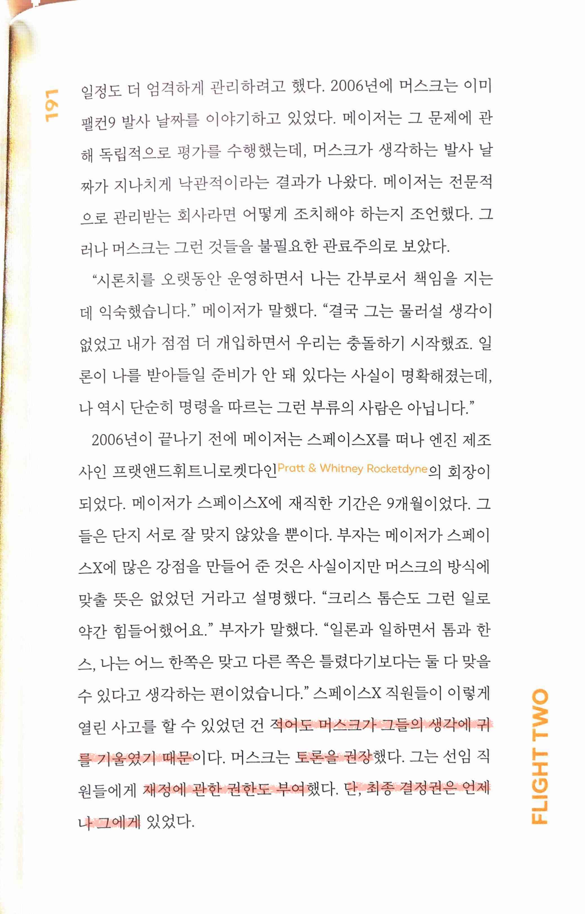

> 적어도 머스크가 그들의 생각에 귀를 기울였기 때문. 머스크는 토론을 권장. 선임 직원들에게 재정에 관한 권한도 부여. 단, 최종 결정권은 언제나 그에게

# 7 텍사스 TEXAS 2003년 1월~2008년 8월
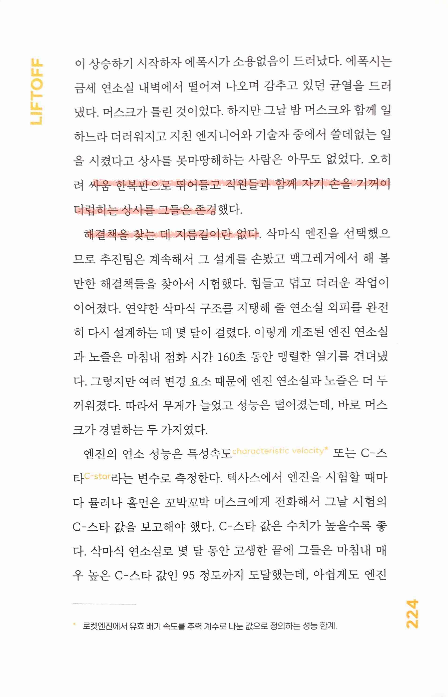

> 싸움 한복판으로 뛰어들고 직원들과 함께 자기 손을 기꺼이 더럽히는 상사를 그들은 존경
>
> 해결책을 찾는 데 지름길이란 없다.

# 8 3차 발사 FLIGHT THREE 2008년 5월~2008년 8월
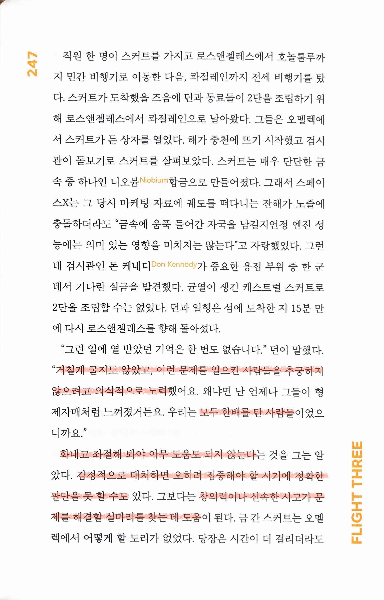

> 거칠게 굴지도 않았고, 이런 문제를 일으킨 사람들을 추궁하지 않으려고 의식적으로 노력... 모두 한배를 탄 사람들
>
> 화내고 좌절해 봐야 아무 도움도 되지 않는다... 감정적으로 대처하면 오히려 집중해야 할 시기에 정확한 판단을 못 할 수도... 창의력이나 신속한 사고가 문제를 해결할 실마리를 찾는 데 도움

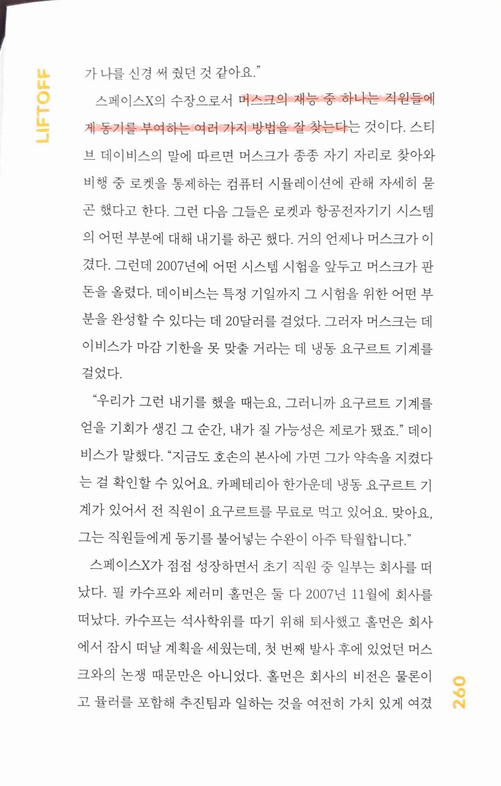

> 머스크의 재능 중 하나는 직원들에게 동기를 부여하는 여러 가지 방법을 잘 찾는다는 것

# 9 8주 EIGHT WEEKS 2008년 8월~2008년 9월
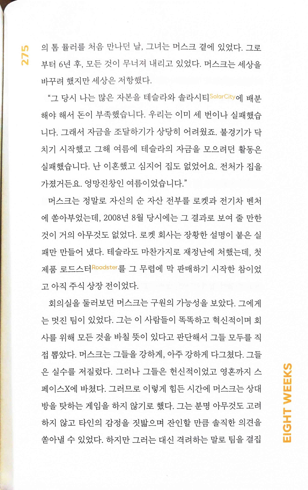

> 힘든 시간에 머스크는 상대방을 탓하는 게임을 하지 않기로 했다.

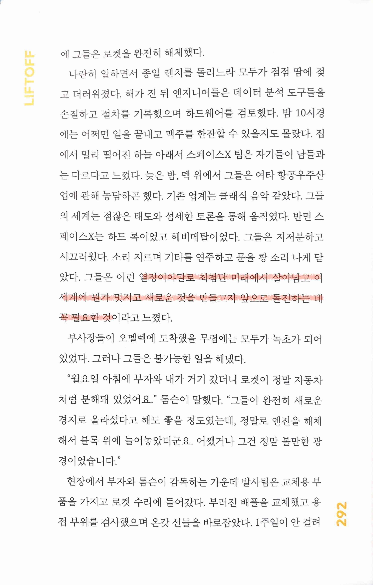

> 열정이야말로 최첨단 미래에서 살아남고 이 세계에 뭔가 멋지고 새로운 것을 만들고자 앞으로 돌진하는 데 꼭 필요한 것

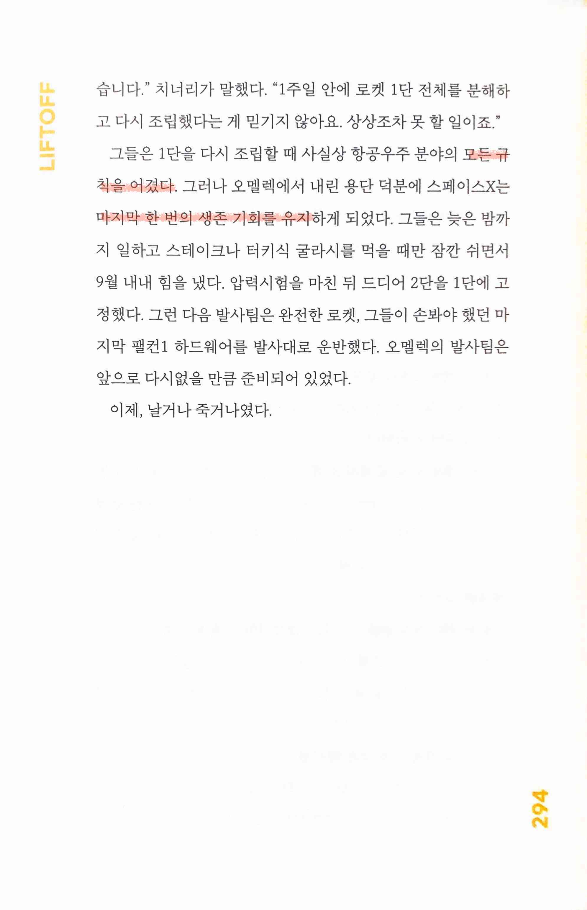

> 모든 규칙을 어겼다... 마지막 한 번의 생존 기회를 유지

# 10 4차 발사 FLIGHT FOUR 2008년 9월 28일

# 11 열한 개 ALWAYS GO TO ELEVEN  2008년 9월~2020년 5월
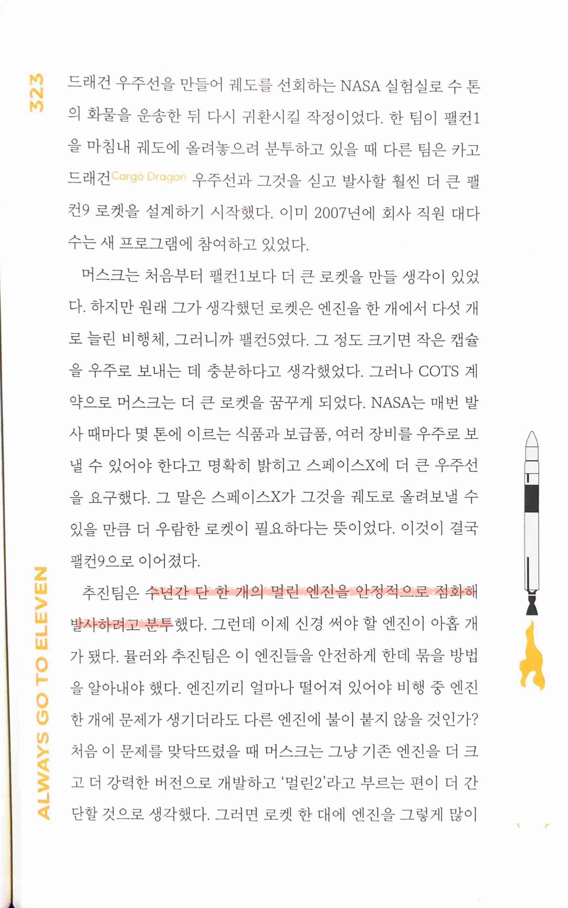

> 수년간 단 한 개의 멀린 엔진을 안정적으로 점화해 발사하려고 분투

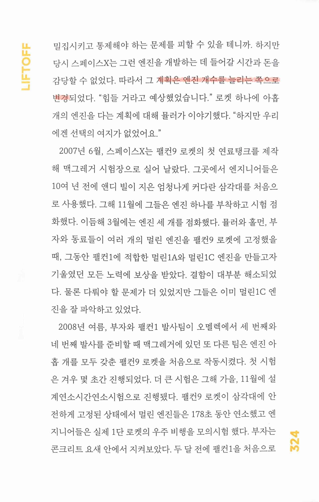

> 계획은 엔진 개수를 늘리는 쪽으로 변경

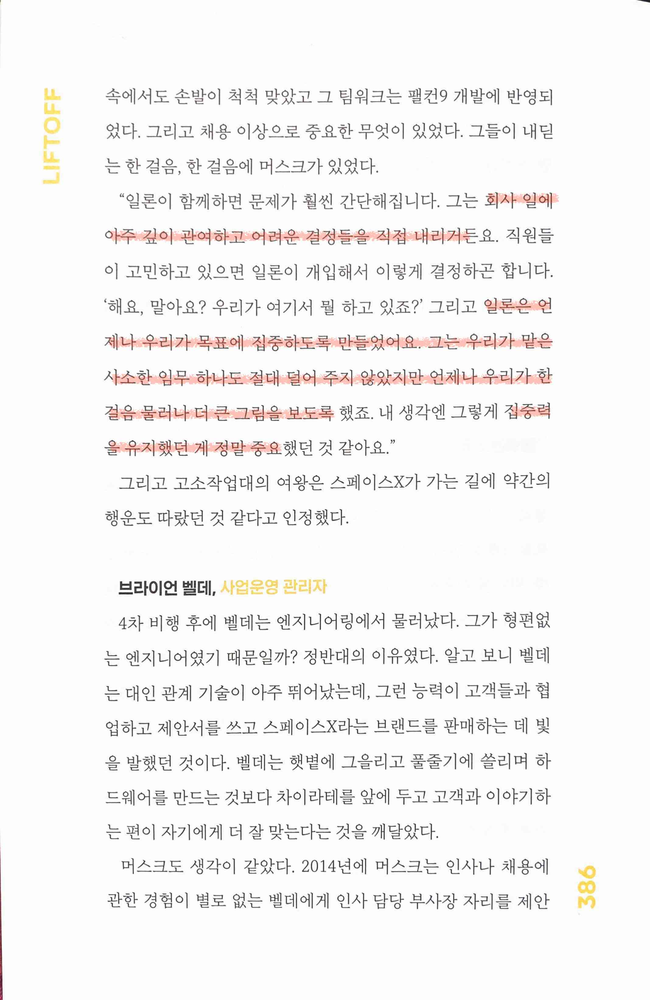

> 회사 일에 아주 깊이 관여하고 어려운 결정들을 직접 내리거든요... 일론은 언제나 우리가 목표에 집중하도록 만들었어요. 그는 우리가 맡은사소한 임무 하나도 절대 덜어 주지 않았지만 언제나 우리가 한걸음 물러나 더 큰 그림을 보도록... 그렇게 집중력을 유지했던 게 정말 중요했던 것 같아요.