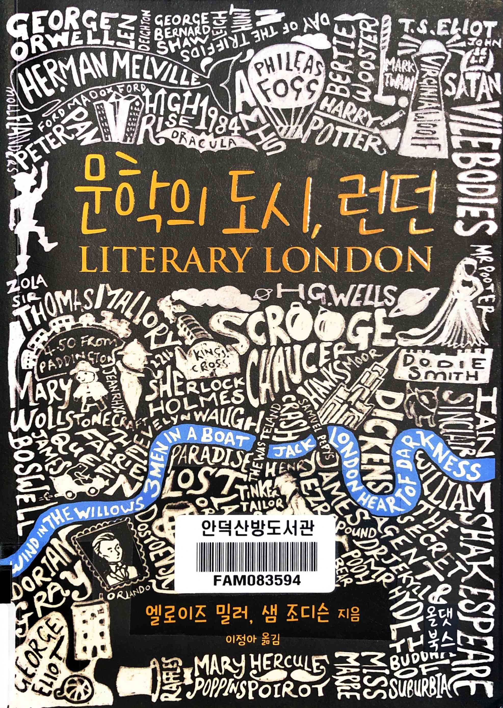
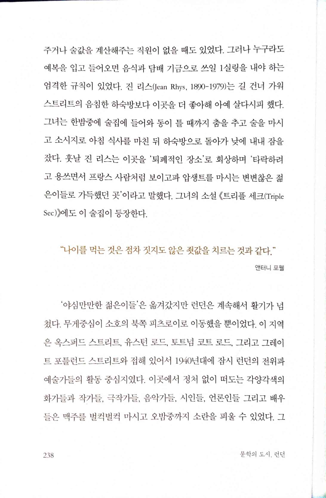

# 문학의 도시, 런던 Literary London

Tags: essay
Date: January 8, 2025 → January 10, 2025
Score: ★★☆☆☆

- ★★☆☆☆ January 8, 2025 → January 10, 2025
- p238 “나이를 먹는 것은 점차 짓지도 않은 죗값을 치르는 것과 같다.”
    
    
    
    - https://www.goodreads.com/quotes/25158-growing-old-is-like-being-increasingly-penalized-for-a-crime
        - “Growing old is like being increasingly penalized for a crime you haven't committed.” ― **Anthony Powell**
        - 영화 은교로 잘 알려진 `너의 젊음이 너의 노력으로 얻은 상이 아니듯 나의 늙음도 나의 잘못으로 받은 벌이 아니다.` 라는 대사가 연상되는 글
            - 검색해보면 이 대사는 Theodore Roethke의 "As your youth is not a reward from your effort my agedness is not a punishment from my fault"라는 싯구라고 나오는데, 정작 이 결과가 한국어 검색 결과만 있었다
            - 그래서 여기 저기 찾아본 결과 이 싯구는 찾을 수 없었고, [perplexity](https://www.perplexity.ai/search/as-your-youth-is-not-a-reward-75A726VySwW1fkgZ__wWgQ)만이 Theodore Roethke의 시도 아니고, 그의 스타일과 맞지도 않는다는 답변을 해줌
                - [genspark.ai](https://www.genspark.ai/search?query=As%20your%20youth%20is%20not%20a%20reward%20from%20your%20effort%20my%20agedness%20is%20not%20a%20punishment%20from%20my%20fault%20Theodore%20Roethke)나 [felo.ai](https://felo.ai/search/ijQKBPCbpiCApwiQCJqXC7)는 그의 53년작 The Waking에서 찾을 수 있다고 답변
                - [Theodore Roethke | The Poetry Foundation](https://www.poetryfoundation.org/poets/theodore-roethke) The Waking을 비롯해 Theodore Roethke의 시를 볼 수 있는 link
            - 결론: 역시 데이터 소스가 중요. 이미 잘못된 데이터가 여기저기 퍼진 후에는 이걸 마치 진실인 양 받아들이기 쉬움
                - perplexity는 어떻게 잘못된 걸 알았을까?
