바다 인류 A Maritime History
============================

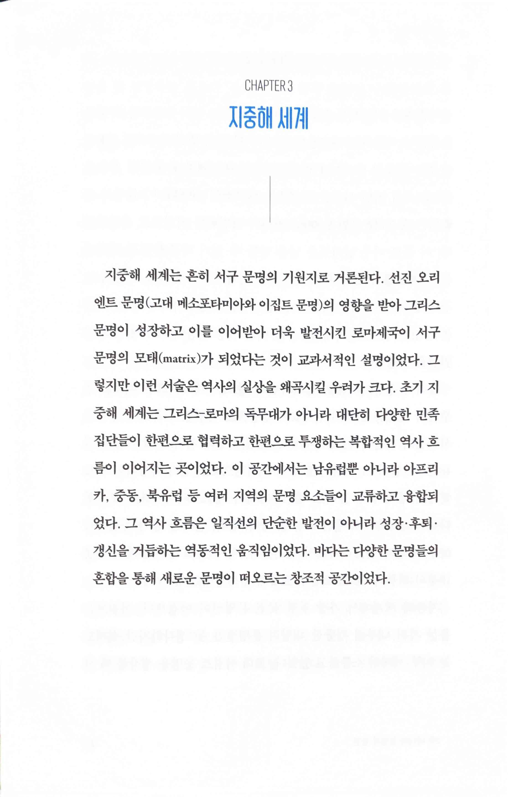

> 지중해 세계는 흔히 서구 문명의 기원지로 거론된다... 그렇지만 이런 서술은 역사의 실상을 왜곡시킬 우려가 크다. 초기 지중해 세계는 그리스-로마의 독무대가 아니라 대단히 다양한 민족집단들이 한편으로 협력하고 한편으로 투쟁하는 복합적인 역사 흐름이 이어지는 곳이었다... 바다는 다양한 문명들의 혼합을 통해 새로운 문명이 떠오르는 창조적 공간이었다.

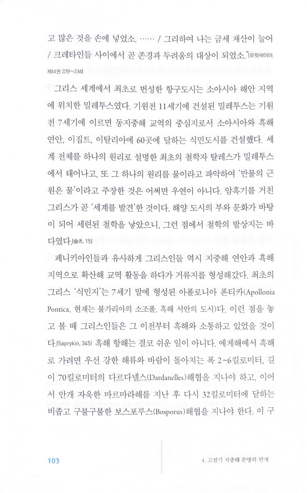

> 세계 전체를 하나의 원리로 설명한 최초의 철학자 탈레스가 밀레투스에서 태어나고, 또 그 하나의 원리를 물이라고 파악하여 '만물의 근원은 물'이라고 주장한 것은 어쩌면 우연이 아니다. 암흑기를 거친 그리스가 곧 '세계를 발견한 것이다. 해양 도시의 부와 문화가 바탕이 되어 세련된 철학을 낳았으니, 그런 점에서 철학의 발상지는 바다였다.

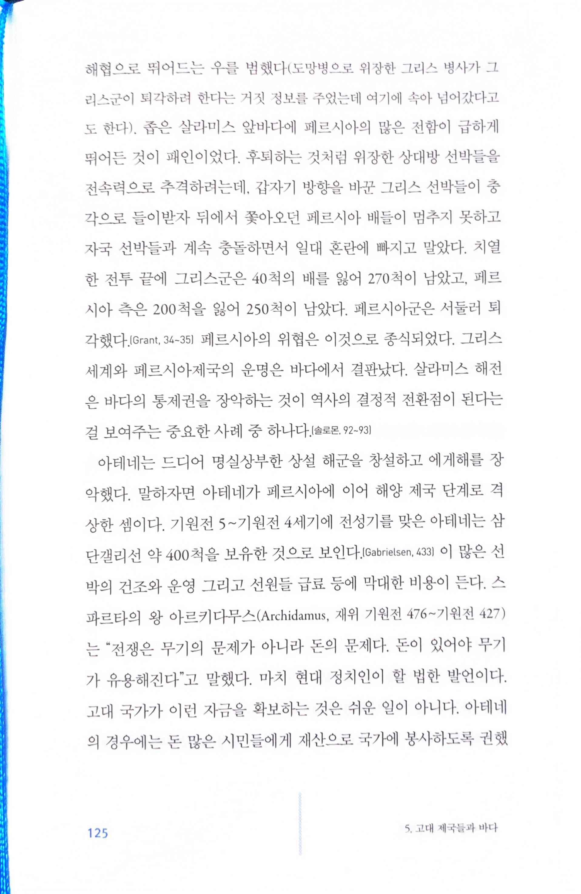

> 그리스세계와 페르시아제국의 운명은 바다에서 결판났다. 살라미스 해전은 바다의 통제권을 장악하는 것이 역사의 결정적 전환점이 된다는 걸 보여주는 중요한 사례 중 하나다.
>
> 스파르타의 왕 아르키다무스(Archidamus, 재위 기원전 476~기원전 427)는 "전쟁은 무기의 문제가 아니라 돈의 문제다. 돈이 있어야 무기가 유용해진다"고 말했다. 마치 현대 정치인이 할 법한 발언이다.

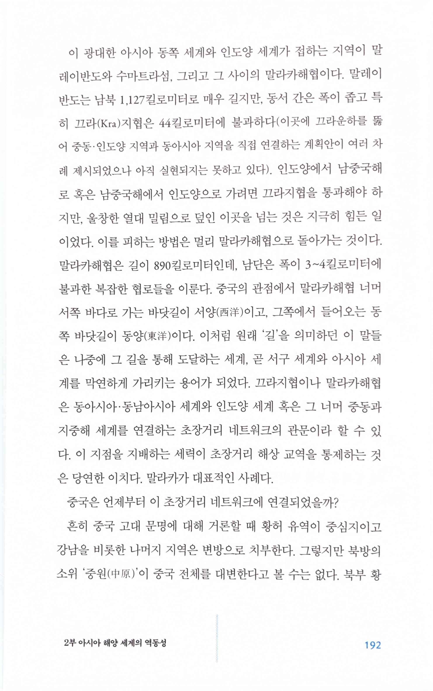

> 중국의 관점에서 말라카해협 너머 서쪽 바다로 가는 바닷길이 `서양(西洋)`이고, 그쪽에서 들어오는 동쪽 바닷길이 `동양(東洋)`이다. 이처럼 원래 '길'을 의미하던 이 말들은 나중에 그 길을 통해 도달하는 세계, 곧 서구 세계와 아시아 세계를 막연하게 가리키는 용어가 되었다. 끄라지협이나 말라카해협은 동아시아·동남아시아 세계와 인도양 세계 혹은 그 너머 중동과 지중해 세계를 연결하는 초장거리 네트워크의 관문이라 할 수 있다. 이 지점을 지배하는 세력이 초장거리 해상 교역을 통제하는 것은 당연한 이치다. 말라카가 대표적인 사례다.
* 언어의 유래도 흥미롭지만 무엇보다 중국의 관점에서 만들어졌다는 말이 와닿는다. 지금은 싱가포르를 통해 미국이 재해권을 조정하고 있지만 남중국해라는 지명을 만들고 중국이 계속 노리고 있으니 정말 언젠가는 맞붙게 될까 두렵고 궁금하다.

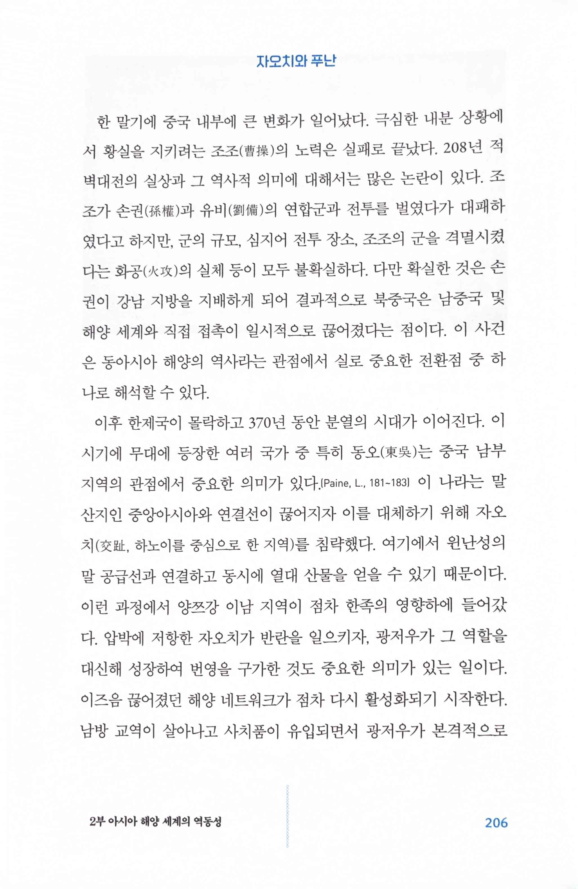

> 208년 적벽대전의 실상과 그 역사적 의미에 대해서는 많은 논란이 있다... 다만 확실한 것은 손권이 강남 지방을 지배하게 되어 결과적으로 북중국은 남중국 및 해양 세계와 직접 접촉이 일시적으로 끊어졌다는 점이다. 이 사건은 동아시아 해양의 역사라는 관점에서 실로 중요한 전환점 중 하나로 해석할 수 있다.
* 이런 해석은 처음 봤는데 정말 흥미롭다. 중국이 아무리 넓어도 결국 바다에 둘러싸인 육지인데 삼국지의 관점으로만 생각했으니 이런 생각은 전혀 해보질 못했다.

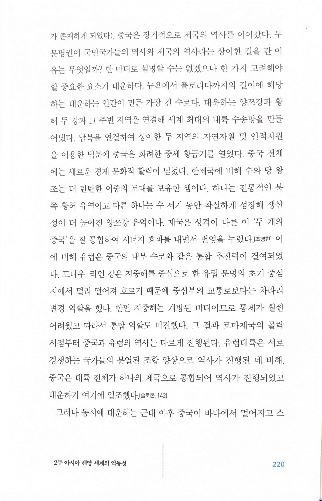

> 중국은 장기적으로 제국의 역사를 이어갔다. 두 문명권이 국민국가들의 역사와 제국의 역사라는 상이한 길을 간 이유는 무엇일까? 한 마디로 설명할 수는 없겠으나 한 가지 고려해야할 중요한 요소가 대운하다. 뉴욕에서 플로리다까지의 길이에 해당하는 대운하는 인간이 만든 가장 긴 수로다. 대운하는 양쯔강과 황허 두 강과 그 주변 지역을 연결해 세계 최대의 내륙 수송망을 만들어냈다. 남북을 연결하여 상이한 두 지역의 자연자원 및 인적자원을 이용한 덕분에 중국은 화려한 중세 황금기를 열었다. 중국 전체에는 새로운 경제 문화적 활력이 넘쳤다. 한제국에 비해 수와 당 왕조는 더 탄탄한 이중의 토대를 보유한 셈이다. 하나는 전통적인 북쪽 황허 유역이고 다른 하나는 수 세기 동안 착실하게 성장해 생산성이 더 높아진 양쯔강 유역이다. 제국은 성격이 다른 이 '두 개의 중국'을 잘 통합하여 시너지 효과를 내면서 번영을 누렸다. 이에 비해 유럽은 중국의 내부 수로와 같은 통합 추진력이 결여되었다. 도나우-라인 강은 지중해를 중심으로 한 유럽 문명의 초기 중심지에서 멀리 떨어져 흐르기 때문에 중심부의 교통로보다는 차라리 변경 역할을 했다. 한편 지중해는 개방된 바다이므로 통제가 훨씬 어려웠고 따라서 통합 역할도 미진했다. 그 결과 로마제국의 몰락시점부터 중국과 유럽의 역사는 다르게 진행된다. 유럽대륙은 서로 경쟁하는 국가들의 분열된 조합 양상으로 역사가 진행된 데 비해,중국은 대륙 전체가 하나의 제국으로 통합되어 역사가 진행되었고 대운하가 여기에 일조했다.
* 양쯔강과 황허를 통합한 대운하, 도나우-라인강, 지중해의 각 물길과 관련된 비교. 정말 책 제목에 걸맞는 멋진 비교다.

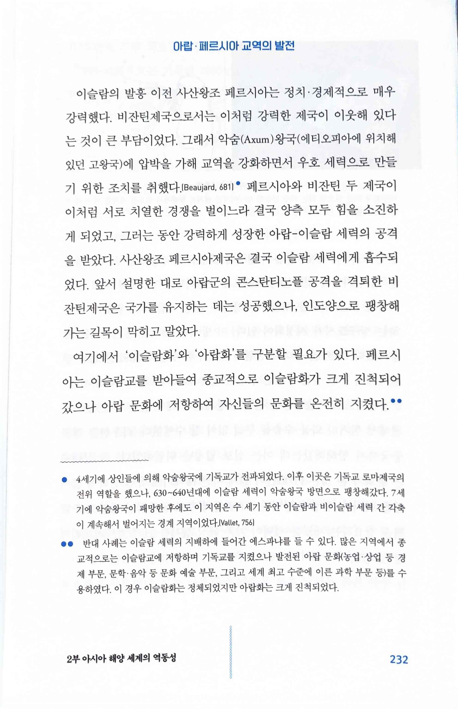

> `'이슬람화'`와 `'아랍화'`를 구분할 필요가 있다. 페르시아는 이슬람교를 받아들여 종교적으로 이슬람화가 크게 진척되어갔으나 아랍 문화에 저항하여 자신들의 문화를 온전히 지켰다.
>
> 반대 사례는 이슬람 세력의 지배하에 들어간 에스파냐를 들 수 있다. 많은 지역에서 종교적으로는 이슬람교에 저항하며 기독교를 지켰으나 발전된 아랍 문화(농업·상업 등 경제 부문, 문학·음악 등 문화 예술 부문, 그리고 세계 최고 수준에 이른 과학 부문 등)를 수용하였다. 이 경우 이슬람화는 정체되었지만 아랍화는 크게 진척되었다.

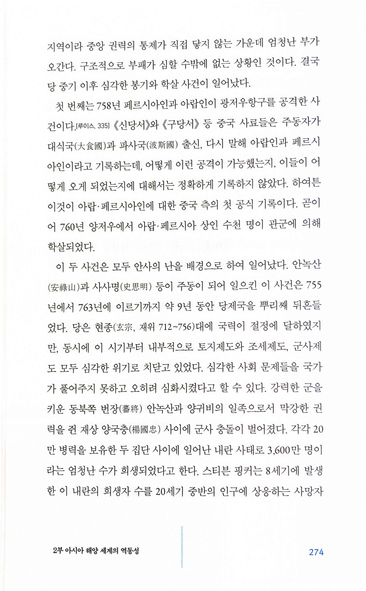

> `대식국`과 `파사국` 출신, 다시 말해 아랍인과 페르시아인

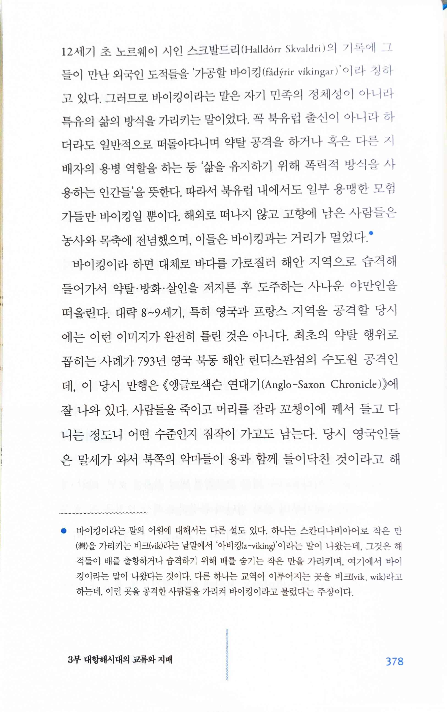

> `바이킹`이라는 말은 자기 민족의 정체성이 아니라 특유의 삶의 방식을 가리키는 말이었다. 꼭 북유럽 출신이 아니라 하더라도 일반적으로 떠돌아다니며 약탈 공격을 하거나 혹은 다른 지배자의 용병 역할을 하는 등 '삶을 유지하기 위해 폭력적 방식을 사용하는 인간들'을 뜻한다. 따라서 북유럽 내에서도 일부 용맹한 모험가들만 바이킹일 뿐이다. 해외로 떠나지 않고 고향에 남은 사람들은 농사와 목축에 전념했으며, 이들은 바이킹과는 거리가 멀었다.
>
> • 바이킹이라는 말의 어원에 대해서는 다른 설도 있다. 하나는 스칸디나비아어로 작은 만을 가리키는 비크(vik)라는 낱말에서 '아비킹(a-viking)'이라는 말이 나왔는데, 그것은 해적들이 배를 출항하거나 습격하기 위해 배를 숨기는 작은 만을 가리키며, 여기에서 바이킹이라는 말이 나왔다는 것이다. 다른 하나는 교역이 이루어지는 곳을 비크(vik, wik)라고 하는데, 이런 곳을 공격한 사람들을 가리켜 바이킹이라고 불렀다는 주장이다.

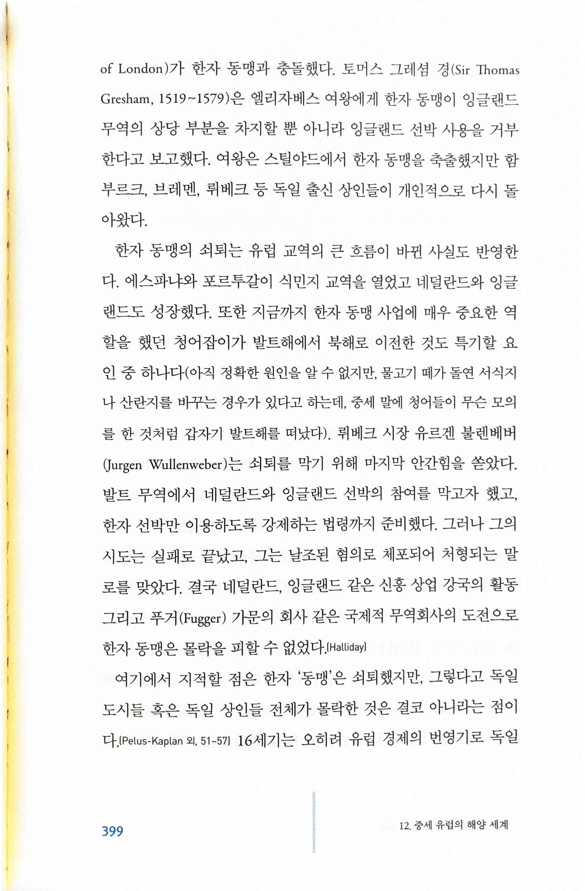

> 한자 동맹의 쇠퇴는 유럽 교역의 큰 흐름이 바뀐 사실도 반영한다.
* 청어들이 갑자기 발트해를 떠난게 영향을 줬다니 당시에는 정말 심각한 문제였겠지만 역사를 읽는 입장에선 재미있는 일이다.

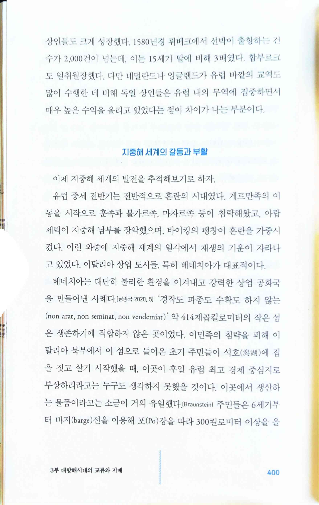

> 베네치아는 대단히 불리한 환경을 이겨내고 강력한 상업 공화국을 만들어낸 사례다. 

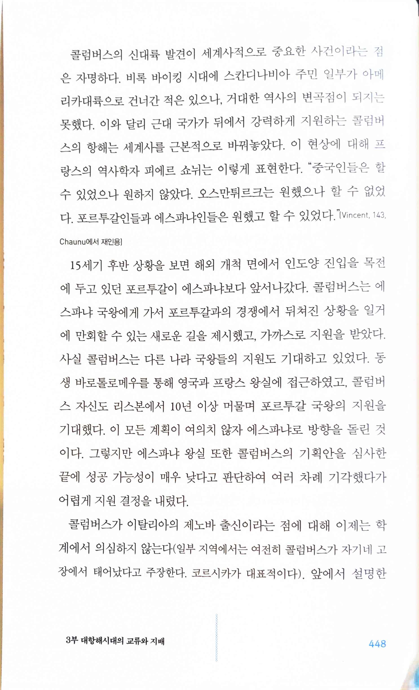

> 콜럼버스의 신대륙 발견이 세계사적으로 중요한 사건이라는 점은 자명하다... 이 현상에 대해 프랑스의 역사학자 피에르 쇼뉘는 이렇게 표현한다. "중국인들은 할 수 있었으나 원하지 않았다. 오스만튀르크는 원했으나 할 수 없었다. 포르투갈인들과 에스파냐인들은 원했고 할 수 있었다.

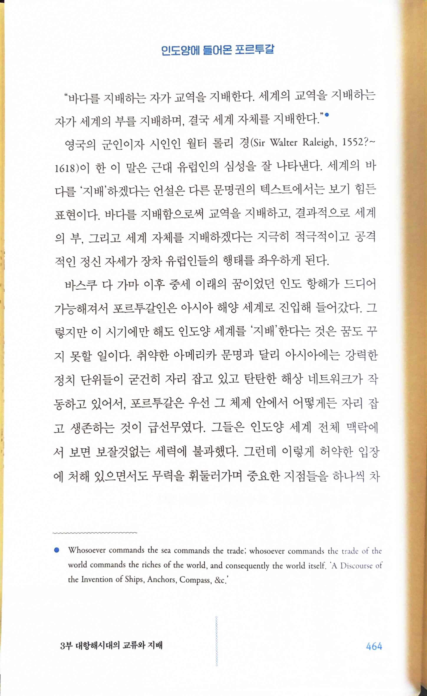

> "바다를 지배하는 자가 교역을 지배한다. 세계의 교역을 지배하는 자가 세계의 부를 지배하며, 결국 세계 자체를 지배한다."
* Whosoever commands the sea commands the trade; whosoever commands the trade of the world commands the riches of the world, and consequently the world itself. 'A Discourse of the Invention of Ships, Anchors, Compass, &c.'
> 영국의 군인이자 시인인 월터 롤리 경(Sir Walter Raleigh, 1552?~1618)이 한 이 말은 근대 유럽인의 심성을 잘 나타낸다. 세계의 바다를 '지배'하겠다는 언설은 다른 문명권의 텍스트에서는 보기 힘든 표현이다. 바다를 지배함으로써 교역을 지배하고, 결과적으로 세계의 부, 그리고 세계 자체를 지배하겠다는 지극히 적극적이고 공격적인 정신 자세가 장차 유럽인들의 행태를 좌우하게 된다.

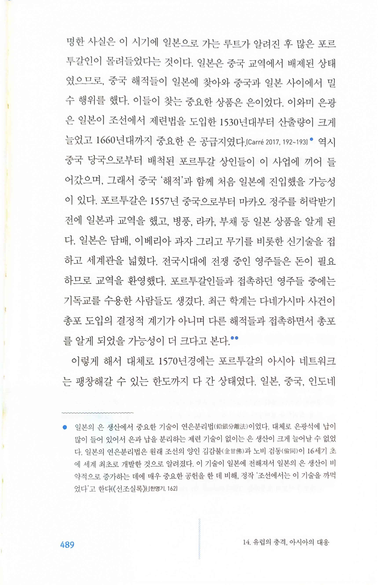

> 이와미 은광은 일본이 조선에서 제련법을 도입한 1530년대부터 산출량이 크게 늘었고 1660년대까지 중요한 은 공급지였다.
>
> 일본의 은 생산에서 중요한 기술이 `연은분리법`이었다. 대체로 은광석에 납이 많이 들어 있어서 은과 납을 분리하는 제련 기술이 없이는 은 생산이 크게 늘어날 수 없었다. 일본의 연은분리법은 원래 조선의 양인 김감불과 노비 검동이 16세기 초에 세계 최초로 개발한 것으로 알려졌다. 이 기술이 일본에 전해져서 일본의 은 생산이 비약적으로 증가하는 데에 매우 중요한 공헌을 한 데 비해, 정작 '조선에서는 이 기술을 까먹었다'고 한다.

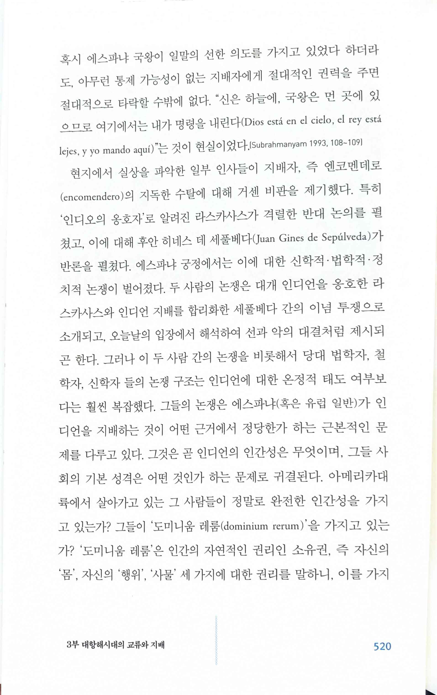 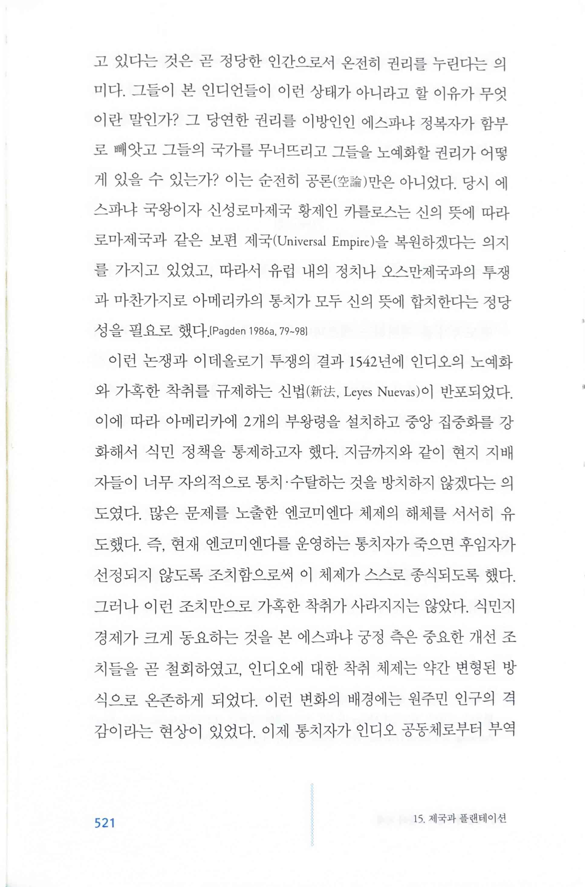

> 아무런 통제 가능성이 없는 지배자에게 절대적인 권력을 주면 절대적으로 타락할 수밖에 없다. “신은 하늘에, 국왕은 먼 곳에 있으므로 여기에서는 내가 명령을 내린다(Dios está en el cielo, el rey está lejes, y yo mando aqui)"는 것이 현실이었다.
>
> '도미니움 레룸'은 인간의 자연적인 권리인 소유권, 즉 자신의 '몸', 자신의 '행위', '사물' 세 가지에 대한 권리를 말하니, 이를 가지고 있다는 것은 곧 정당한 인간으로서 온전히 권리를 누린다는 의미다.
* 정말 극도로 오만한 생각이지만, 이런 개념을 미리 정의하고 강요함으로 지배권을 정당화하는 작업은 언어의 힘이란 게 어떤지 시사하는 듯 하다.

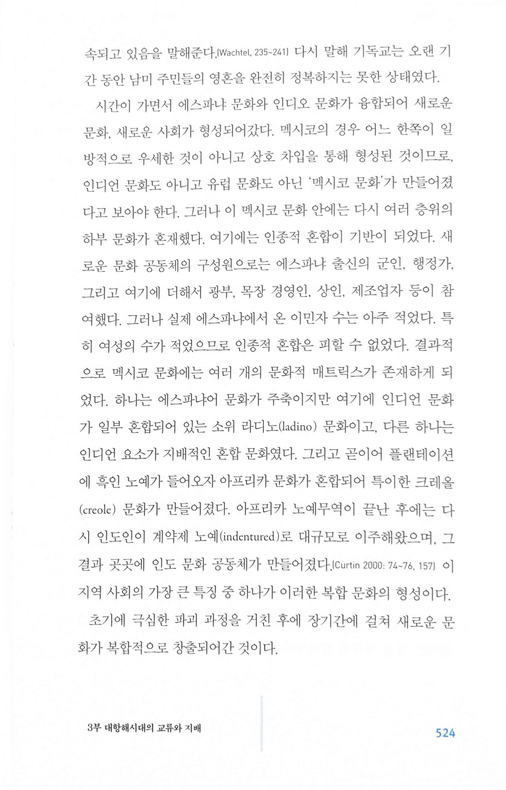

> 시간이 가면서 에스파냐 문화와 인디오 문화가 융합되어 새로운 문화, 새로운 사회가 형성되어갔다. 멕시코의 경우 어느 한쪽이 일방적으로 우세한 것이 아니고 상호 차입을 통해 형성된 것이므로, 인디언 문화도 아니고 유럽 문화도 아닌 '멕시코 문화'가 만들어졌다고 보아야 한다... 에스파냐어 문화가 주축이지만 여기에 인디언 문화가 일부 혼합되어 있는 소위 라디노(ladino) 문화이고, 다른 하나는 인디언 요소가 지배적인 혼합 문화였다. 그리고 곧이어 플랜테이션에 흑인 노예가 들어오자 아프리카 문화가 혼합되어 특이한 크레올(creole) 문화가 만들어졌다. 아프리카 노예무역이 끝난 후에는 다시 인도인이 계약제 노예(indentured)로 대규모로 이주해왔으며, 그 결과 곳곳에 인도 문화 공동체가 만들어졌다.
>
> 초기에 극심한 파괴 과정을 거친 후에 장기간에 걸쳐 새로운 문화가 복합적으로 창출되어간 것이다.

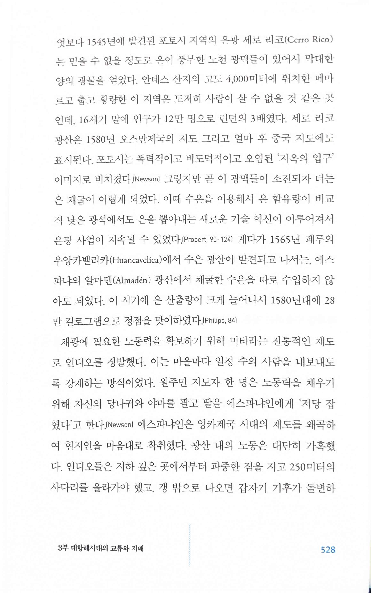

> 1545년에 발견된 포토시 지역의 은광 세로 리코(Cerro Rico)는 믿을 수 없을 정도로 은이 풍부한 노천 광맥들이 있어서 막대한 양의 광물을 얻었다. 안데스 산지의 고도 4,000미터에 위치한 메마르고 춥고 황량한 이 지역은 도저히 사람이 살 수 없을 것 같은 곳인데, 16세기 말에 인구가 12만 명으로 런던의 3배였다.
* 욕망의 힘은 정말 상상을 훨씬 뛰어넘는다

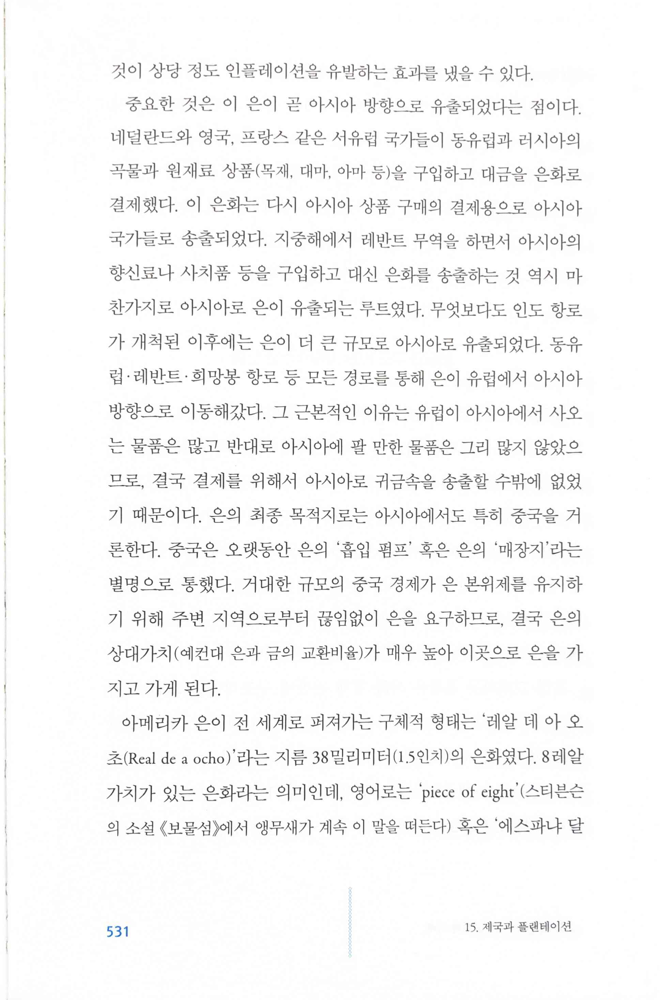

> 동유럽 · 레반트 • 희망봉 항로 등 모든 경로를 통해 은이 유럽에서 아시아 방향으로 이동해갔다. 그 근본적인 이유는 유럽이 아시아에서 사오는 물품은 많고 반대로 아시아에 팔 만한 물품은 그리 많지 않았으므로, 결국 결제를 위해서 아시아로 귀금속을 송출할 수밖에 없었기 때문이다.
>
> 아메리카 은이 전 세계로 퍼져가는 구체적 형태는 `'레알 데 아오초(Real de a ocho)'`라는 지름 38 밀리미터(1.5인치)의 은화였다. 8레알가치가 있는 은화라는 의미인데, 영어로는 `'piece of eight'` (스티븐슨의 소설 <보물섬>에서 앵무새가 계속 이 말을 떠든다) 혹은 `'에스파냐 달러(Spanish dollar)'`라고도 한다. 이 은화가 전 세계로 확산하여 최초의 세계화폐로 기능했다. 일부 지역에서는 은화 표면에 따로 표시를 해서 지역 화폐로 통용하기도 했다. 결과적으로 아메리카 은은 유통 화폐 역할을 해서 세계의 교역을 활성화했다. 다른 한편 아메리카의 은 생산과 배분을 장악한 유럽 세력이 아시아의 문호를 강제로 열어젖히는 수단으로 삼았다(브로델은 은을 아시아의 문호를 강제로 열기 위해 쏘아대는 총알로 비유한 바 있다).

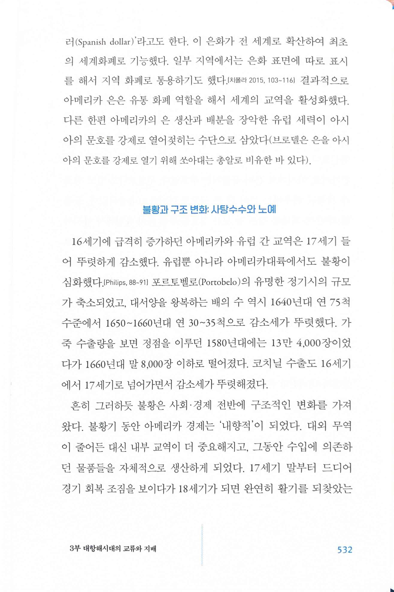

> 흔히 그러하듯 불황은 사회·경제 전반에 구조적인 변화를 가져왔다. 불황기 동안 아메리카 경제는 '내향적'이 되었다. 대외 무역이 줄어든 대신 내부 교역이 더 중요해지고, 그동안 수입에 의존하던 물품들을 자체적으로 생산하게 되었다.

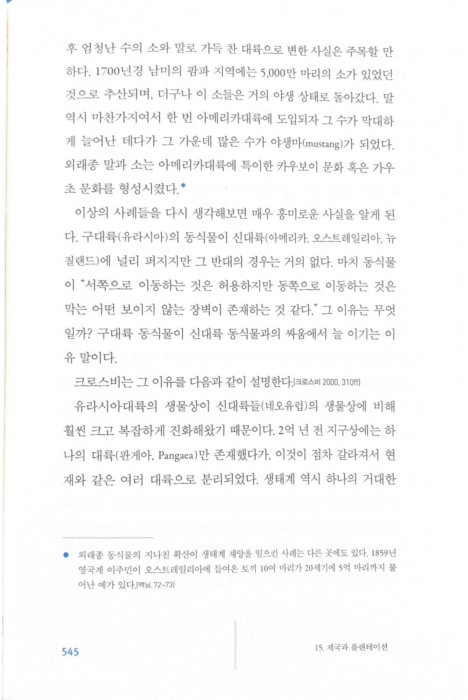 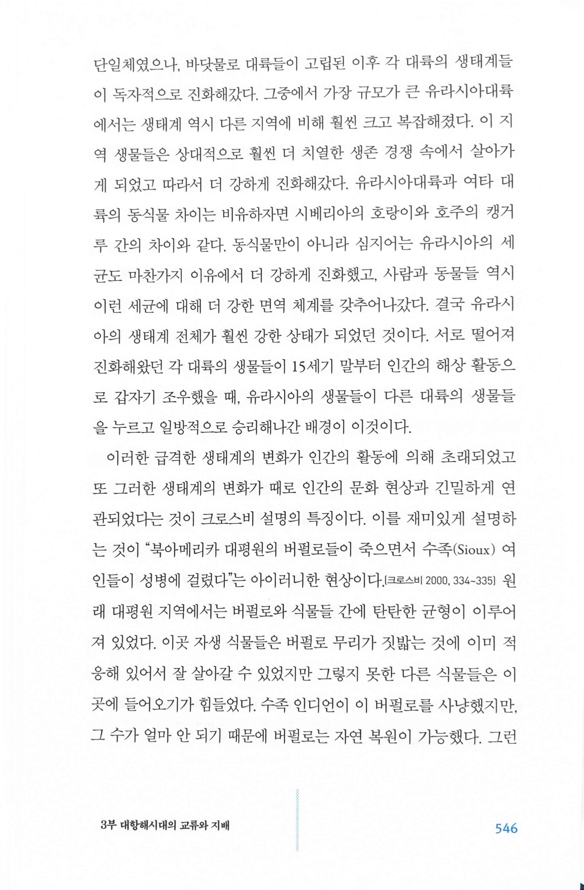

> 구대륙(유라시아)의 동식물이 신대륙(아메리카, 오스트레일리아, 뉴질랜드)에 널리 퍼지지만 그 반대의 경우는 거의 없다. 마치 동식물이 "서쪽으로 이동하는 것은 허용하지만 동쪽으로 이동하는 것은 막는 어떤 보이지 않는 장벽이 존재하는 것 같다." 그 이유는 무엇일까? 구대륙 동식물이 신대륙 동식물과의 싸움에서 늘 이기는 이유 말이다.
>
> 크로스비는 그 이유를 다음과 같이 설명한다.
>
> 유라시아대륙의 생물상이 신대륙들(네오유럽)의 생물상에 비해 훨씬 크고 복잡하게 진화해왔기 때문이다... 가장 규모가 큰 유라시아대륙에서는 생태계 역시 다른 지역에 비해 훨씬 크고 복잡해졌다. 이 지역 생물들은 상대적으로 훨씬 더 치열한 생존 경쟁 속에서 살아가게 되었고 따라서 더 강하게 진화해갔다... 동식물만이 아니라 심지어는 유라시아의 세균도 마찬가지 이유에서 더 강하게 진화했고, 사람과 동물들 역시 이런 세균에 대해 더 강한 면역 체계를 갖추어나갔다. 결국 유라시아의 생태계 전체가 훨씬 강한 상태가 되었던 것이다. 서로 떨어져 진화해왔던 각 대륙의 생물들이 15세기 말부터 인간의 해상 활동으로 갑자기 조우했을 때, 유라시아의 생물들이 다른 대륙의 생물들을 누르고 일방적으로 승리해나간 배경이 이것이다.
>
> 이러한 급격한 생태계의 변화가 인간의 활동에 의해 초래되었고 또 그러한 생태계의 변화가 때로 인간의 문화 현상과 긴밀하게 연관되었다는 것이 크로스비 설명의 특징이다.

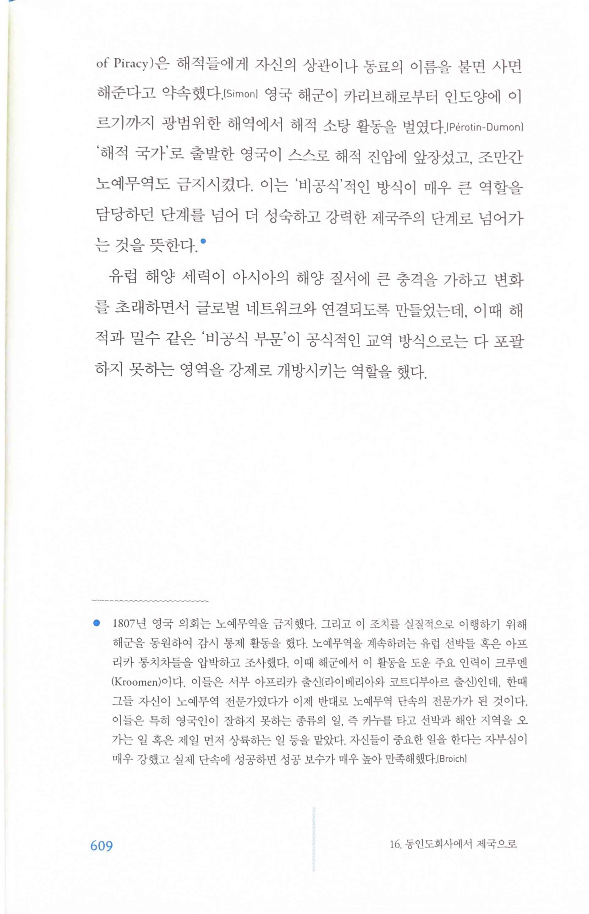

> '해적 국가'로 출발한 영국이 스스로 해적 진압에 앞장섰고, 조만간 노예무역도 금지시켰다. 이는 '비공식'적인 방식이 매우 큰 역할을 담당하던 단계를 넘어 더 성숙하고 강력한 제국주의 단계로 넘어가는 것을 뜻한다.
>
> 유럽 해양 세력이 아시아의 해양 질서에 큰 충격을 가하고 변화를 초래하면서 글로벌 네트워크와 연결되도록 만들었는데, 이때 해적과 밀수 같은 '비공식 부문'이 공식적인 교역 방식으로는 다 포괄하지 못하는 영역을 강제로 개방시키는 역할을 했다.

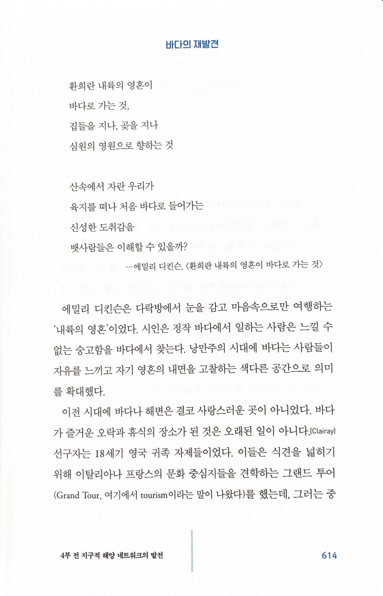 

> 낭만주의 시대에 바다는 사람들이 자유를 느끼고 자기 영혼의 내면을 고찰하는 색다른 공간으로 의미를 확대했다.
>
> 이전 시대에 바다나 해변은 결코 사랑스러운 곳이 아니었다. 바다가 즐거운 오락과 휴식의 장소가 된 것은 오래된 일이 아니다... 여름에 많은 도시 사람들이 해변에 놀러가기 시작한 것은 19세기 중엽 이후, 특히 파리에서 노르망디와 브르타뉴까지 철도가 부설된 후이고, 본격적인 여름 해양 관광은 1960년대 이후의 일이다. 갈수록 바다가 친밀한 공간으로 변해갔다.

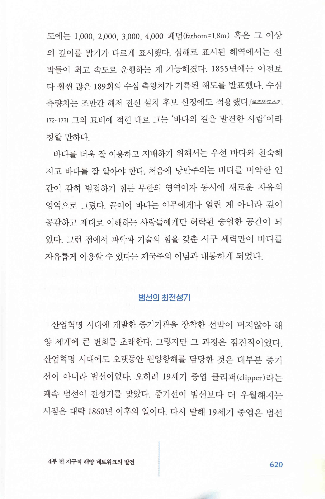 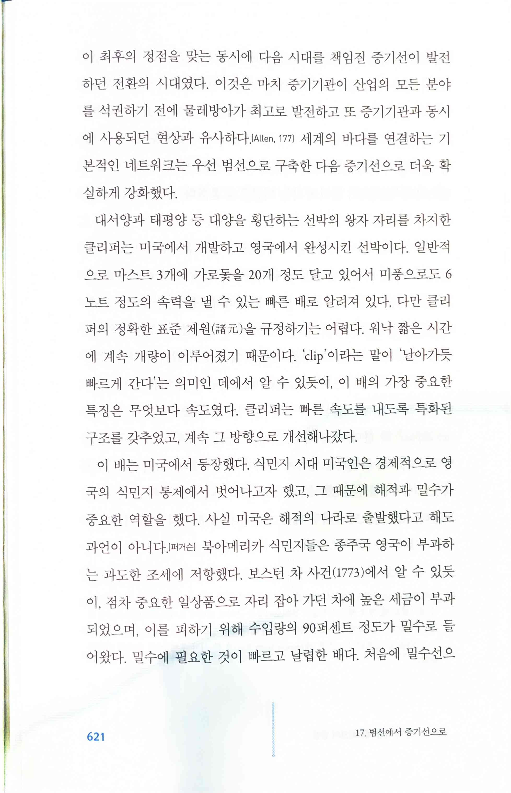

> 바다를 더욱 잘 이용하고 지배하기 위해서는 우선 바다와 친숙해지고 바다를 잘 알아야 한다. 처음에 낭만주의는 바다를 미약한 인간이 감히 범접하기 힘든 무한의 영역이자 동시에 새로운 자유의 영역으로 그렸다. 곧이어 바다는 아무에게나 열린 게 아니라 깊이 공감하고 제대로 이해하는 사람들에게만 허락된 숭엄한 공간이 되었다. 그런 점에서 과학과 기술의 힘을 갖춘 서구 세력만이 바다를 자유롭게 이용할 수 있다는 제국주의 이념과 내통하게 되었다.
>
> 산업혁명 시대에 개발한 증기기관을 장착한 선박이 머지않아 해양 세계에 큰 변화를 초래한다. 그렇지만 그 과정은 점진적이었다. 산업혁명 시대에도 오랫동안 원양항해를 담당한 것은 대부분 증기선이 아니라 범선이었다. 오히려 19세기 중엽 `클리퍼 (clipper)`라는 쾌속 범선이 전성기를 맞았다. 증기선이 범선보다 더 우월해지는시점은 대략 1860년 이후의 일이다. 다시 말해 19세기 중엽은 범선이 최후의 정점을 맞는 동시에 다음 시대를 책임질 증기선이 발전하던 전환의 시대였다. 이것은 마치 증기기관이 산업의 모든 분야를 석권하기 전에 물레방아가 최고로 발전하고 또 증기기관과 동시에 사용되던 현상과 유사하다. 세계의 바다를 연결하는 기본적인 네트워크는 우선 범선으로 구축한 다음 증기선으로 더욱 확실하게 강화했다.
>
> 이 배는 미국에서 등장했다. 식민지 시대 미국인은 경제적으로 영국의 식민지 통제에서 벗어나고자 했고, 그 때문에 해적과 밀수가 중요한 역할을 했다. 사실 미국은 해적의 나라로 출발했다고 해도 과언이 아니다.

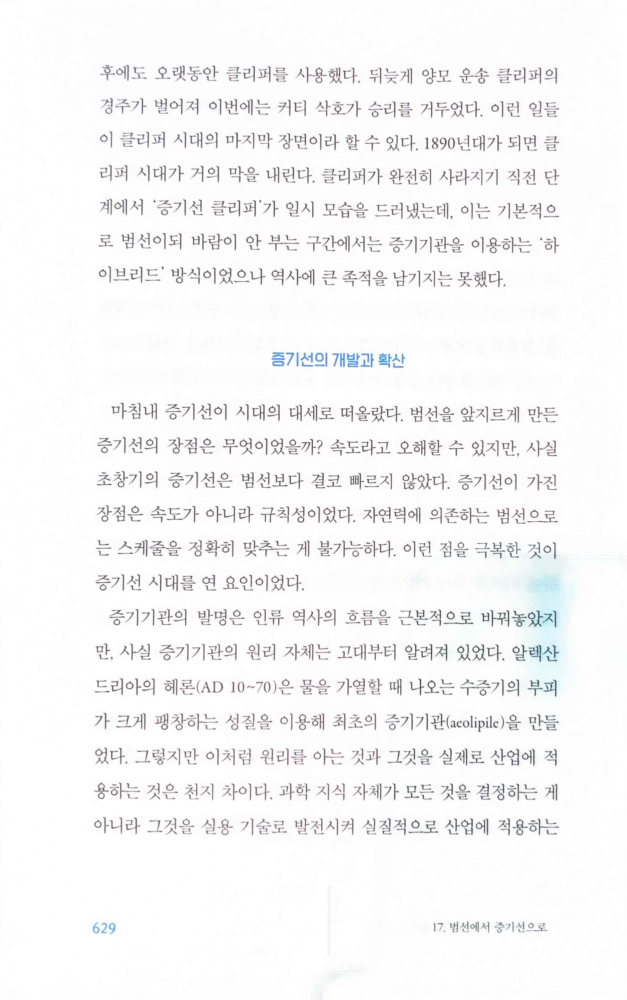

> 1890년대가 되면 클리퍼 시대가 거의 막을 내린다. 클리퍼가 완전히 사라지기 직전 단계에서 '증기선 클리퍼'가 일시 모습을 드러냈는데, 이는 기본적으로 범선이 바람이 안 부는 구간에서는 증기기관을 이용하는 '하이브리드' 방식이었으나 역사에 큰 족적을 남기지는 못했다.
* 내연기관과 전기차 방식을 같이 쓰는 하이브리드 자동차도 역시 큰 역할을 못하고 사라지는 걸까? 이 방식의 최강자였던 일본 자동차 업계의 상황을 보면 그럴 가능성이 높아 보이긴 한다.
> 범선을 앞지르게 만든 증기선의 장점은 무엇이었을까? 속도라고 오해할 수 있지만, 사실 초창기의 증기선은 범선보다 결코 빠르지 않았다. 증기선이 가진 장점은 속도가 아니라 규칙성이었다. 자연력에 의존하는 범선으로는 스케줄을 정확히 맞추는 게 불가능하다. 이런 점을 극복한 것이 증기선 시대를 연 요인이었다.
>
> 원리를 아는 것과 그것을 실제로 산업에 적용하는 것은 천지 차이다.

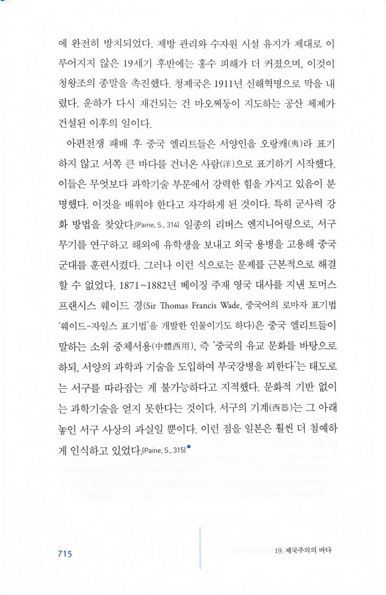

> 아편전쟁 패배 후 중국 엘리트들은 서양인을 오랑캐(夷)라 표기하지 않고 서쪽 큰 바다를 건너온 사람(洋)으로 표기하기 시작했다. 이들은 무엇보다 과학기술 부문에서 강력한 힘을 가지고 있음이 분명했다. 이것을 배워야 한다고 자각하게 된 것이다. 특히 군사력 강화 방법을 찾았다.(Paine. S., 314) 일종의 리버스 엔지니어링으로, 서구 무기를 연구하고 해외에 유학생을 보내고 외국 용병을 고용해 중국 군대를 훈련시켰다. 그러나 이런 식으로는 문제를 근본적으로 해결할 수 없었다. 1871~1882년 베이징 주재 영국 대사를 지낸 토머스 프랜시스 웨이드 경(Sir Thomas Francis Wade, 중국어의 로마자 표기법 '웨이드-자일스 표기법'을 개발한 인물이기도 하다)은 중국 엘리트들이 말하는 소위 `중체서용(中體西用)`, 즉 '중국의 유교 문화를 바탕으로 하되, 서양의 과학과 기술을 도입하여 부국강병을 꾀한다'는 태도로는 서구를 따라잡는 게 불가능하다고 지적했다. 문화적 기반 없이는 과학기술을 얻지 못한다는 것이다. 서구의 기계(西器)는 그 아래 놓인 서구 사상의 과실일 뿐이다. 이런 점을 일본은 훨씬 더 첨예하게 인식하고 있었다.

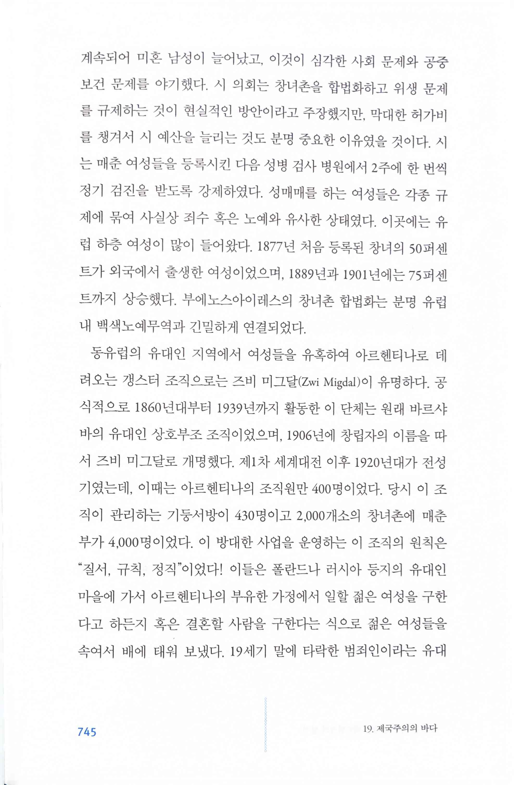 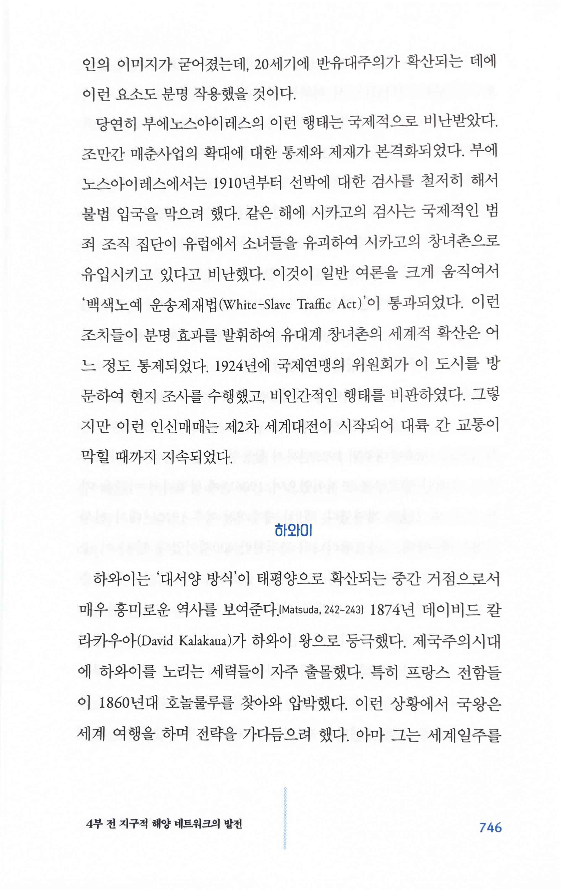

> 동유럽의 유대인 역에서 여성들을 유혹하여 아르헨티나로 데려오는 갱스터 조직으로는 즈비 미그달(Zwi Migdal)이 유명하다... 이 방대한 사업을 운영하는 이 조직의 원칙은 "질서, 규칙, 정직"이었다!
>
> 그렇지만 이런 인신매매는 제2차 세계대전이 시작되어 대륙 간 교통이 막힐 때까지 지속되었다.

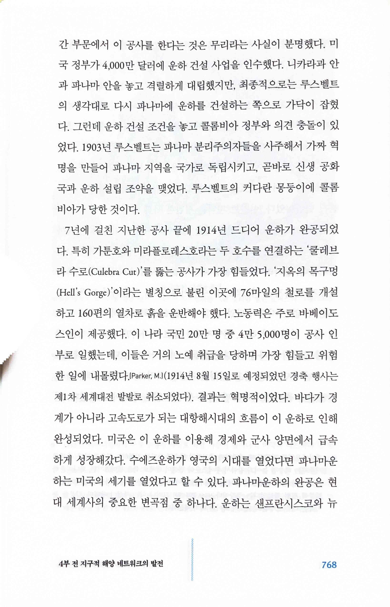 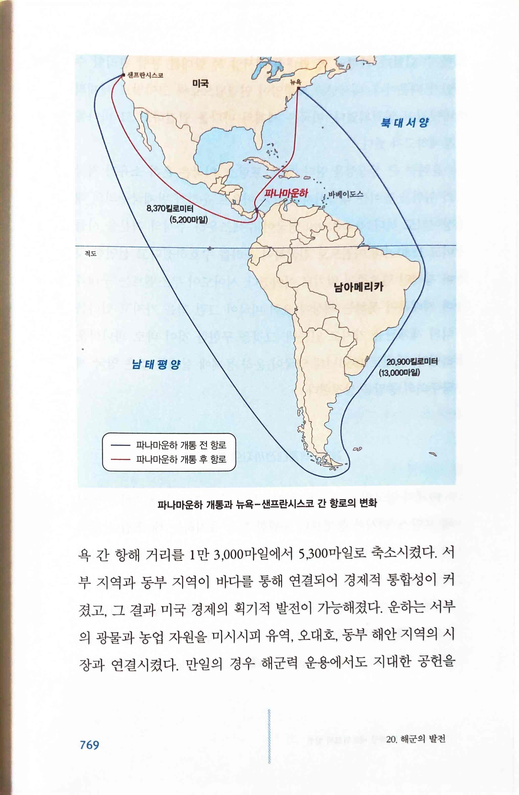

> 1903년 루스벨트는 파나마 분리주의자들을 사주해서 가짜 혁명을 만들어 파나마 지역을 국가로 독립시키고, 곧바로 신생 공화국과 운하 설립 조약을 맺었다. 루스벨트의 커다란 몽둥이에 콜롬비아가 당한 것이다.
>
> 바다가 경계가 아니라 고속도로가 되는 대항해시대의 흐름이 이 운하로 인해 완성되었다. 미국은 이 운하를 이용해 경제와 군사 양면에서 급속하게 성장해갔다. 수에즈운하가 영국의 시대를 열었다면 파나마운하는 미국의 세기를 열었다고 할 수 있다. 파나마운하의 완공은 현대 세계사의 중요한 변곡점 중 하나다... 서부 지역과 동부 지역이 바다를 통해 연결되어 경제적 통합성이 커졌고, 그 결과 미국 경제의 획기적 발전이 가능해졌다.
* 말라카 해협의 재해권을 중국이 가져간다면, 혹시 운하를 판다면, 혹은 일대일로가 성공적이었다면 중국의 세기를 열게 되었을까?

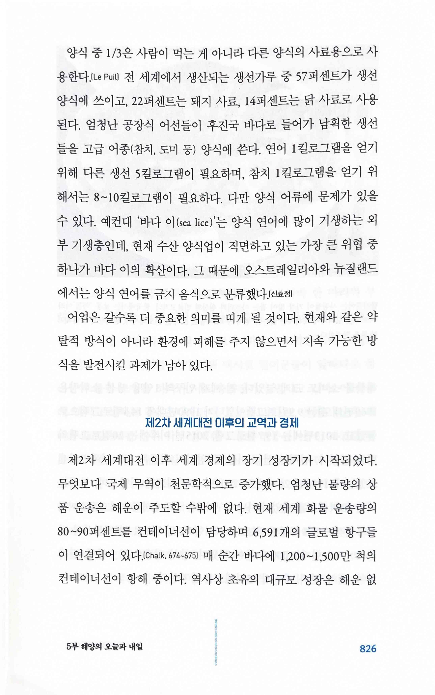 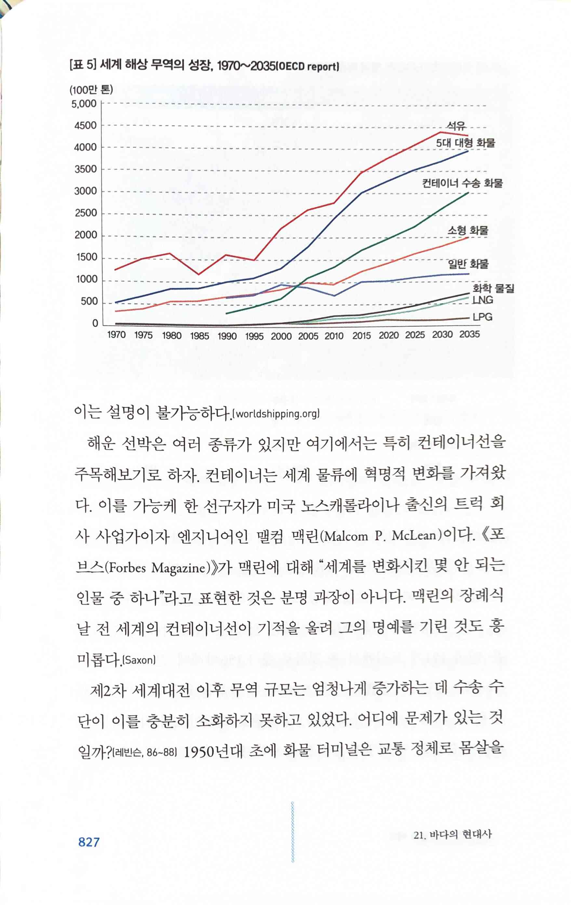 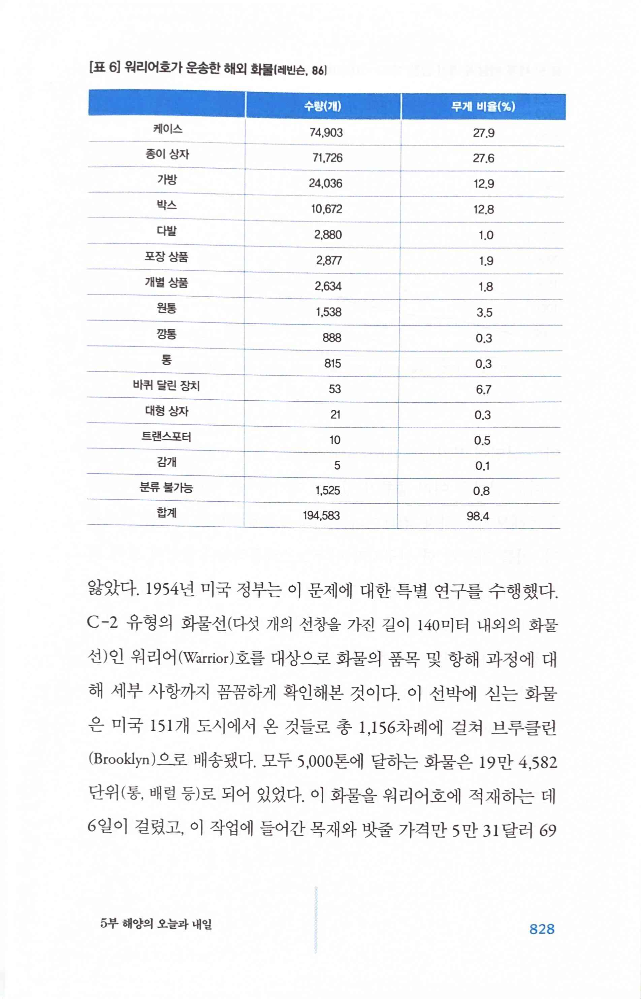 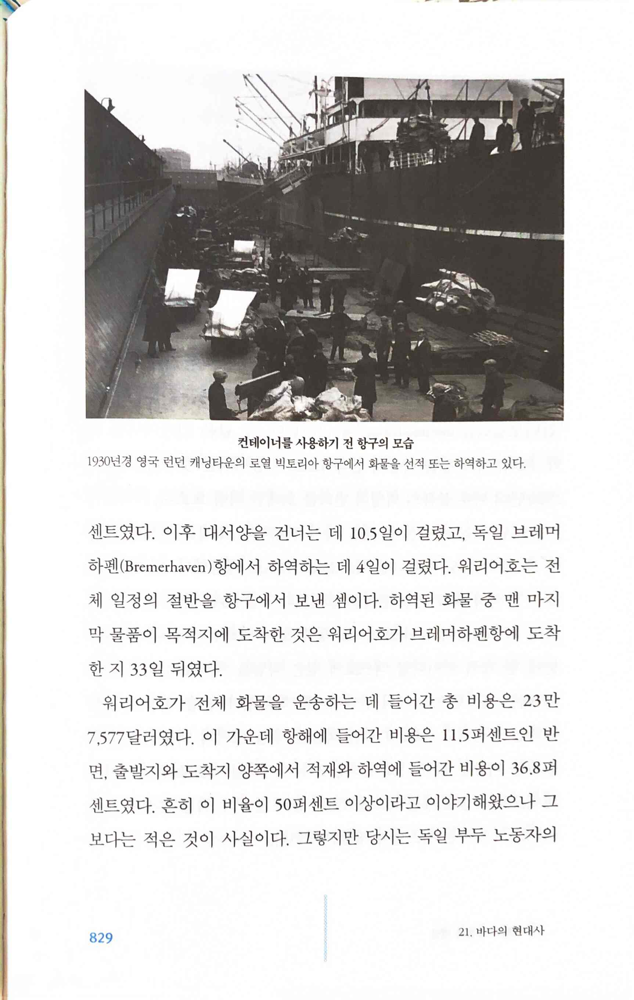 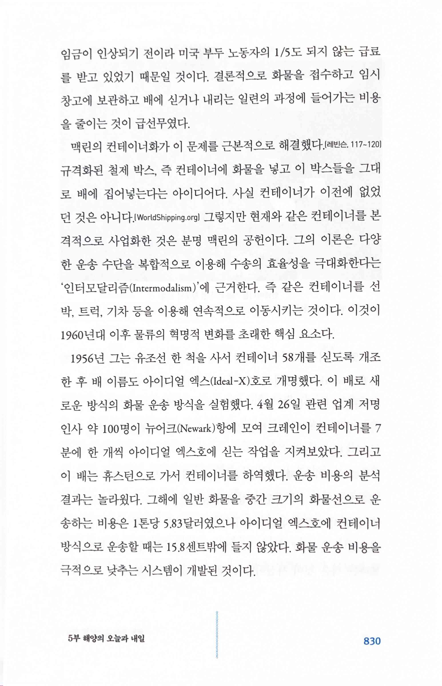  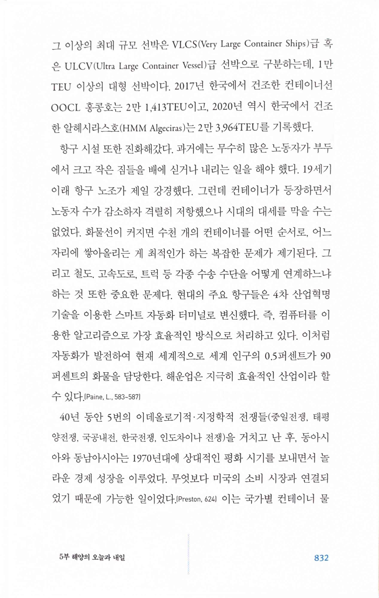

> 어업은 갈수록 더 중요한 의미를 띠게 될 것이다. 현재와 같은 약탈적 방식이 아니라 환경에 피해를 주지 않으면서 지속 가능한 방식을 발전시킬 과제가 남아 있다.
* 과연 가능한 일일까?
> 엄청난 물량의 상품 운송은 해운이 주도할 수밖에 없다. 현재 세계 화물 운송량의 80\~90퍼센트를 컨테이너선이 담당하며 6,591 개의 글로벌 항구들이 연결되어 있다. 매 순간 바다에 1,200\~1,500만 척의 컨테이너선이 항해 중이다. 역사상 초유의 대규모 성장은 해운 없이는 설명이 불가능하다.
* [World Shipping Council](https://www.worldshipping.org/)
> 컨테이너는 세계 물류에 혁명적 변화를 가져왔다. 이를 가능케 한 선구자가 미국 노스캐롤라이나 출신의 트럭 회사 사업가이자 엔지니어인 맬컴 맥린(Malcom P. McLean)이다. 《포브스(Forbes Magazine)》가 맥린에 대해 “세계를 변화시킨 몇 안 되는 인물 중 하나"라고 표현한 것은 분명 과장이 아니다. 맥린의 장례식날 전 세계의 컨테이너선이 기적을 울려 그의 명예를 기린 것도 흥미롭다.
>
> 맥린의 컨테이너화가 이 문제를 근본적으로 해결했다. 규격화된 철제 박스, 즉 컨테이너에 화물을 넣고 이 박스들을 그대로 배에 집어넣는다는 아이디어다. 사실 컨테이너가 이전에 없었던 것은 아니다. 그렇지만 현재와 같은 컨테이너를 본격적으로 사업화한 것은 분명 맥린의 공헌이다. 그의 이론은 다양한 운송 수단을 복합적으로 이용해 수송의 효율성을 극대화한다는 `'인터모달리즘(Intermodalism)'`에 근거한다. 즉 같은 컨테이너를 선박, 트럭, 기차 등을 이용해 연속적으로 이동시키는 것이다. 이것이 1960년대 이후 물류의 혁명적 변화를 초래한 핵심 요소다.
* 역시 창조도 중요하지만 어떻게 이용하느냐의 발상 전환도 정말 중요하다.
> 항구 시설 또한 진화해갔다... 그런데 컨테이너가 등장하면서 노동자 수가 감소하자 격렬히 저항했으나 시대의 대세를 막을 수는 없었다... 즉, 컴퓨터를 이용한 알고리즘으로 가장 효율적인 방식으로 처리하고 있다. 이처럼 자동화가 발전하여 현재 세계적으로 세계 인구의 0.5퍼센트가 90퍼센트의 화물을 담당한다. 해운업은 지극히 효율적인 산업이라 할 수 있다.

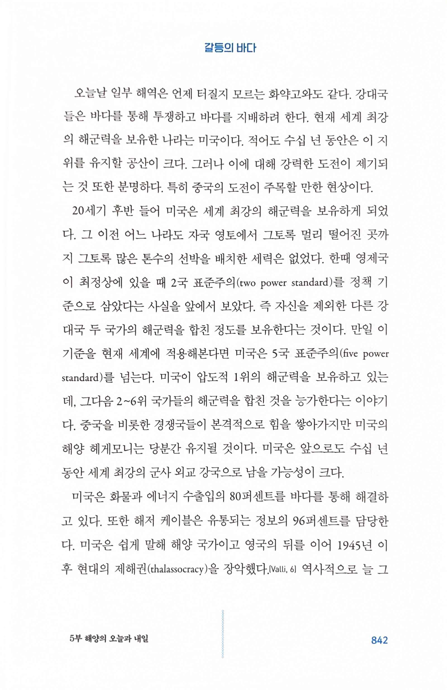 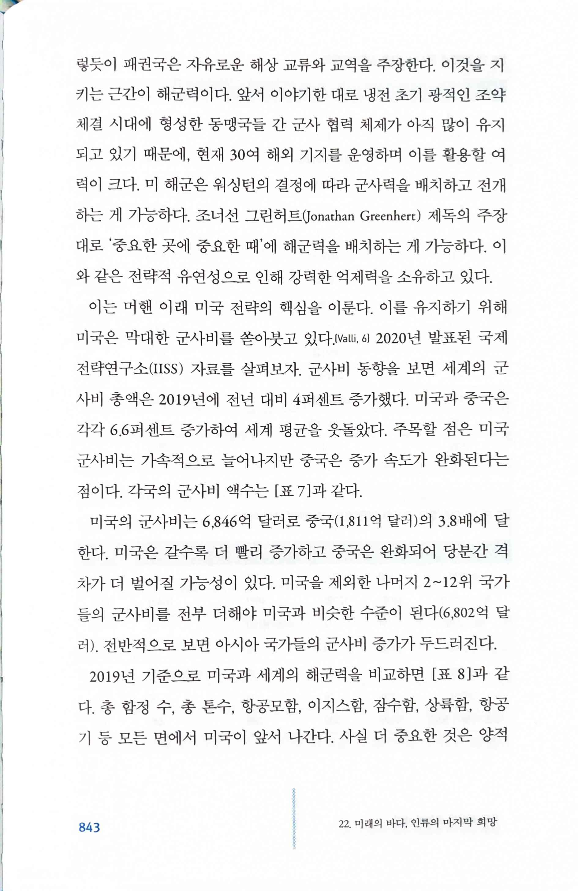 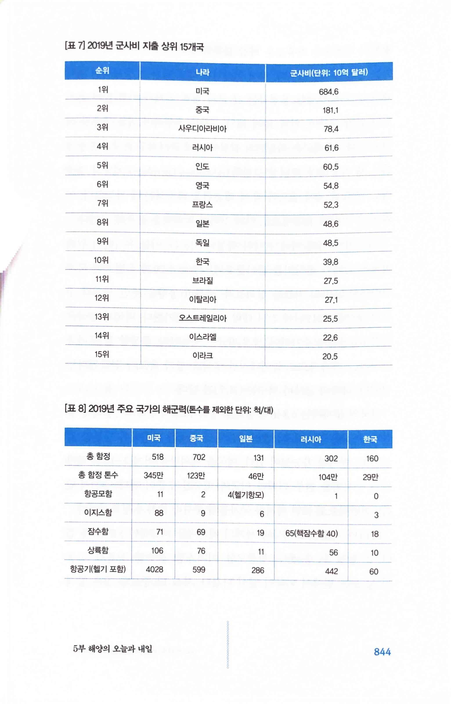 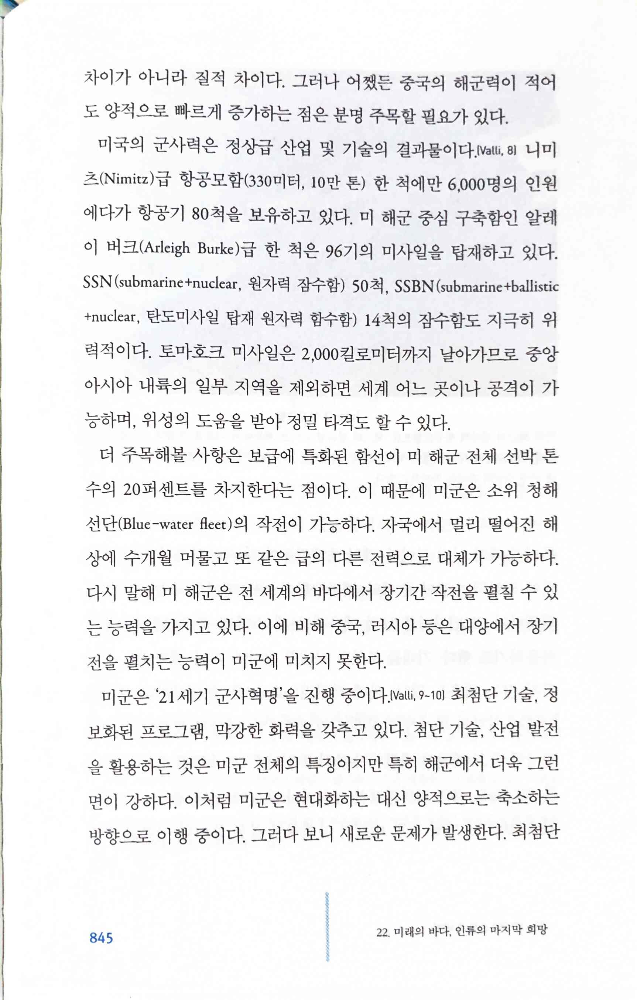  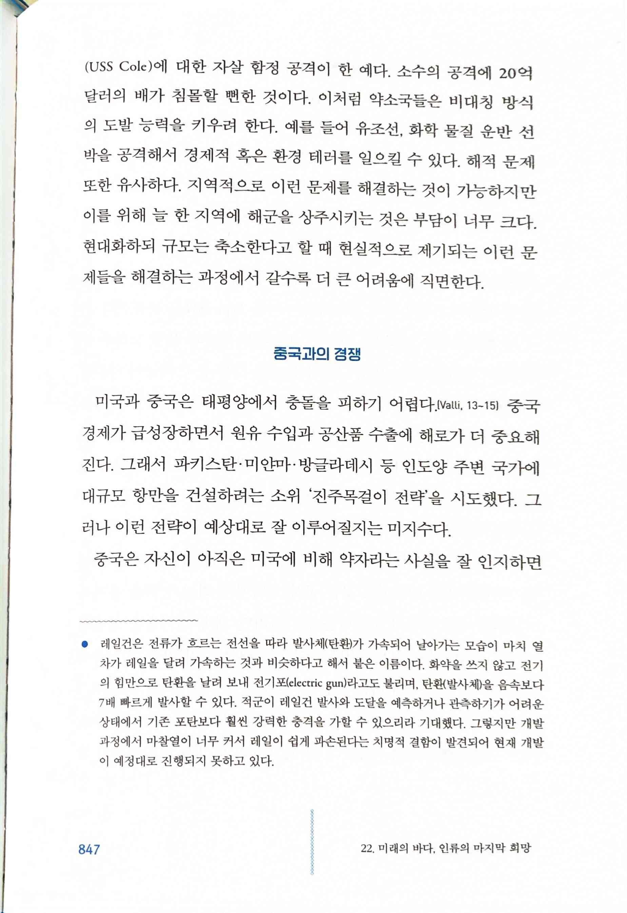

> 오늘날 일부 해역은 언제 터질지 모르는 화약고와도 같다. 강대국들은 바다를 통해 투쟁하고 바다를 지배하려 한다. 현재 세계 최강의 해군력을 보유한 나라는 미국이다. 적어도 수십 년 동안은 이 지위를 유지할 공산이 크다. 그러나 이에 대해 강력한 도전이 제기되는 것 또한 분명하다. 특히 중국의 도전이 주목할 만한 현상이다.
>
> 20세기 후반 들어 미국은 세계 최강의 해군력을 보유하게 되었다. 그 이전 어느 나라도 자국 영토에서 그토록 멀리 떨어진 곳까지 그토록 많은 톤수의 선박을 배치한 세력은 없었다. 한때 영제국이 최정상에 있을 때 2국 표준주의(two power standard)를 정책 기준으로 삼았다는 사실을 앞에서 보았다. 즉 자신을 제외한 다른 강대국 두 국가의 해군력을 합친 정도를 보유한다는 것이다. 만일 이 기준을 현재 세계에 적용해본다면 미국은 5국 표준주의(five power standard)를 넘는다. 미국이 압도적 1위의 해군력을 보유하고 있는데, 그다음 2~6위 국가들의 해군력을 합친 것을 능가한다는 이야기다. 중국을 비롯한 경쟁국들이 본격적으로 힘을 쌓아가지만 미국의 해양 헤게모니는 당분간 유지될 것이다. 미국은 앞으로도 수십 년동안 세계 최강의 군사외교 강국으로 남을 가능성이 크다.
>
> 미국은 화물과 에너지 수출입의 80퍼센트를 바다를 통해 해결하고 있다. 또한 해저 케이블은 유통되는 정보의 96퍼센트를 담당한다. 미국은 쉽게 말해 해양 국가이고 영국의 뒤를 이어 1945년 이후 현대의 `제해권(thalassocracy)`을 장악했다.
>
> 더 주목해볼 사항은 보급에 특화된 함선이 미 해군 전체 선박 톤수의 20퍼센트를 차지한다는 점이다. 이 때문에 미군은 소위 청해선단(Blue-water fleet)의 작전이 가능하다. 자국에서 멀리 떨어진 해상에 수개월 머물고 또 같은 급의 다른 전력으로 대체가 가능하다. 다시 말해 미 해군은 전 세계의 바다에서 장기간 작전을 펼칠 수 있는 능력을 가지고 있다. 이에 비해 중국, 러시아 등은 대양에서 장기전을 펼치는 능력이 미군에 미치지 못한다.
>
> 미국과 중국은 태평양에서 충돌을 피하기 어렵다. 중국 경제가 급성장하면서 원유 수입과 공산품 수출에 해로가 더 중요해진다. 그래서 파키스탄·미얀마·방글라데시 등 인도양 주변 국가에 대규모 항만을 건설하려는 소위 `'진주목걸이 전략'`을 시도했다. 그러나 이런 전략이 예상대로 잘 이루어질지는 미지수다.

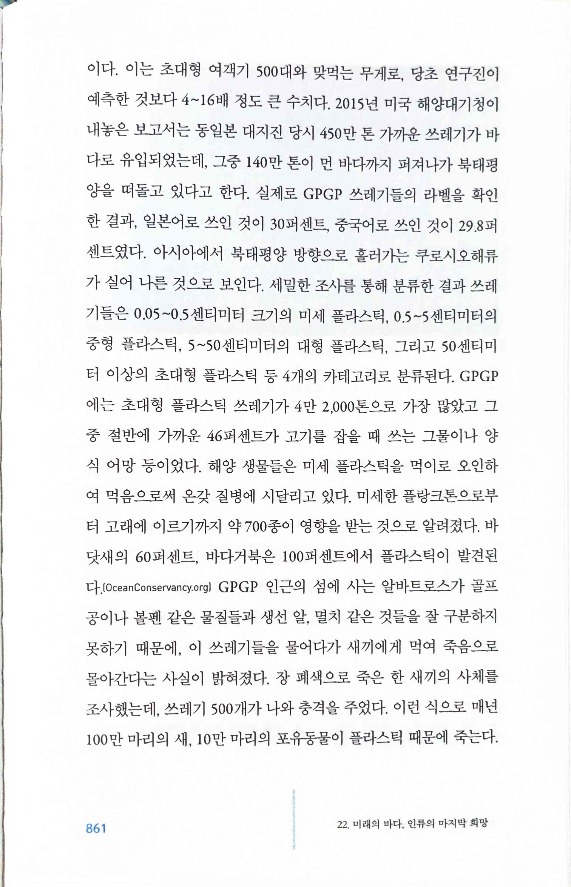

* 해양 쓰레기의 심각성
