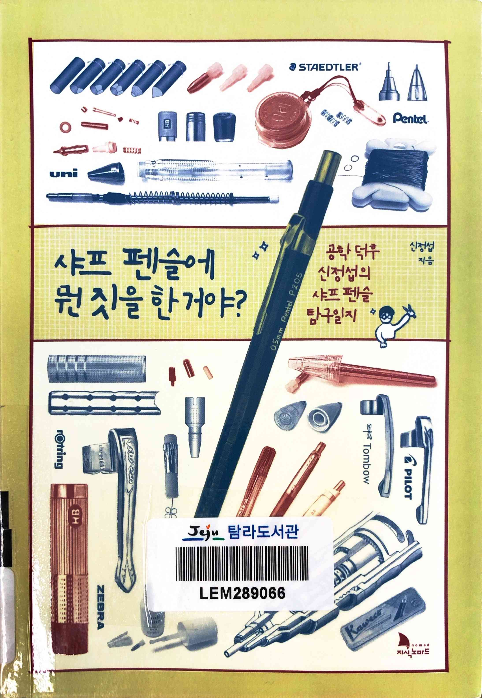
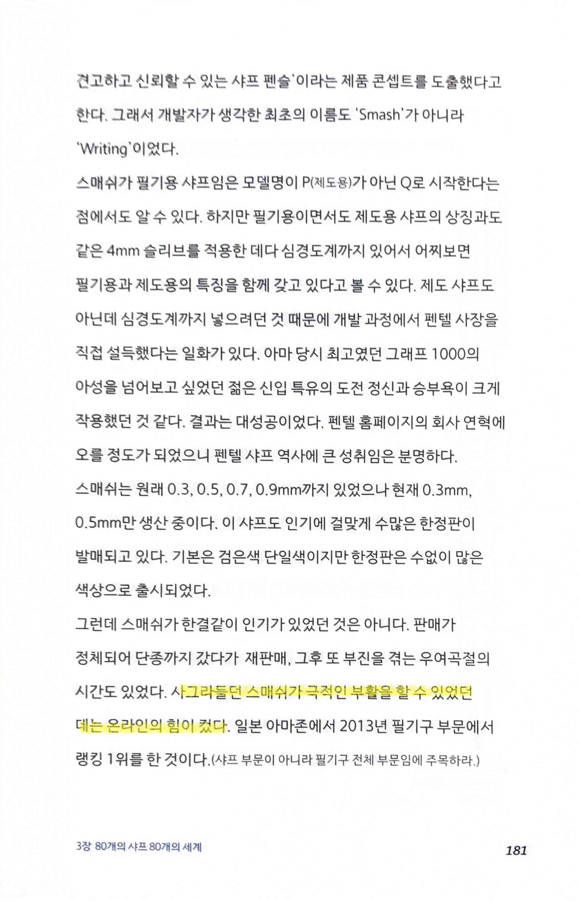
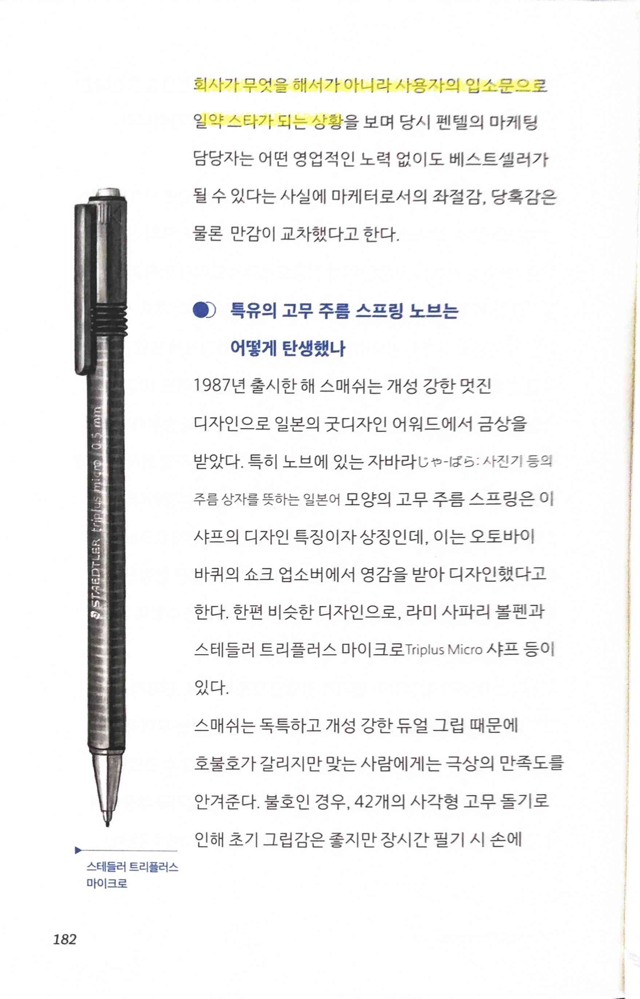
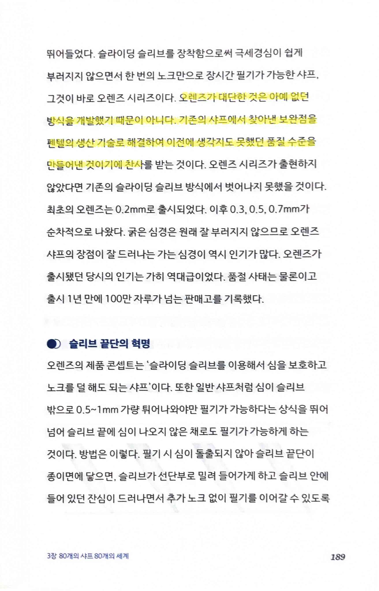
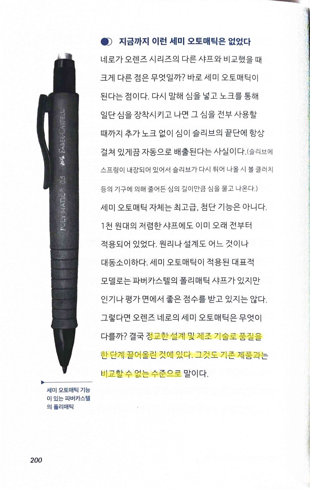

# 샤프 펜슬에 뭔 짓을 한 거야?

Tags: product
Date: November 11, 2024
Score: ★★★☆☆

- ★★★☆☆ November 11, 2024 진정한 덕후가 쓴 샤프에 대한 책. 존경스럽단 마음이 절로 든다. 샤프라는 흔한 commodity에 대해 이렇게까지 분석을 하고 책을 쓸 수 있다는 게 성취를 잘 보여주는 예라는 생각이 든다. 아무 생각없이 값 싸게 사용하던 도구의 내부가 이렇게 정밀하고 다양하게 구현되었다는 게 놀랍고 대단하다.
- pp181~182 사용자가 스스로 공유가능한 기능이 가질 수도 있는 가치, 생각지 못한 성과가 나올 수도 있단 생각이 든다
    
    
    
    
    
- p189 놀라움과 동시에 사라져가는 아날로그 기술에 대한 집착(?)이 일본의 특성을 여실히 보여준단 생각이 듦
    
    
    
- p200 극한의 효율을 추구해야 성공할 수 있는 제조업의 일면을 보여준다
    
    
