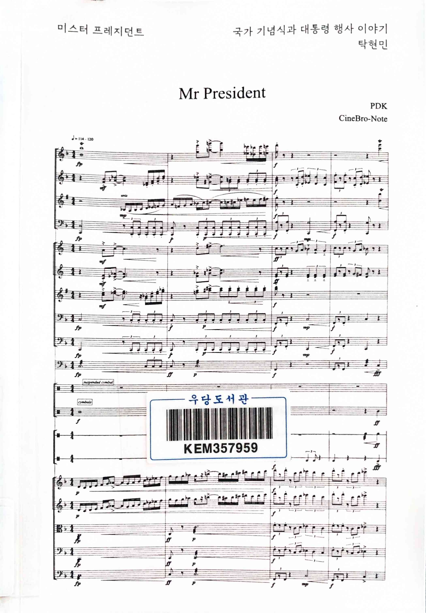
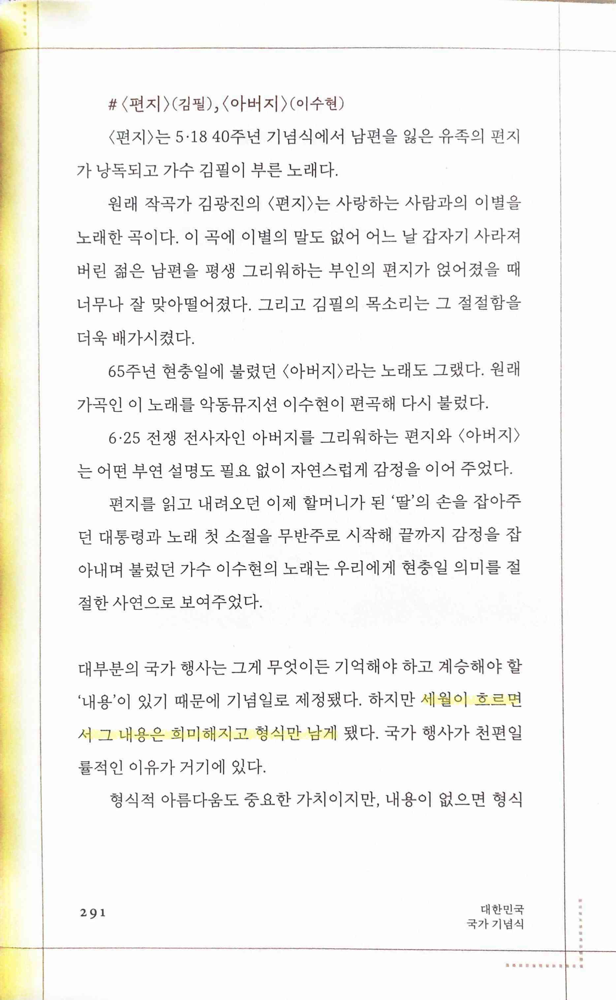
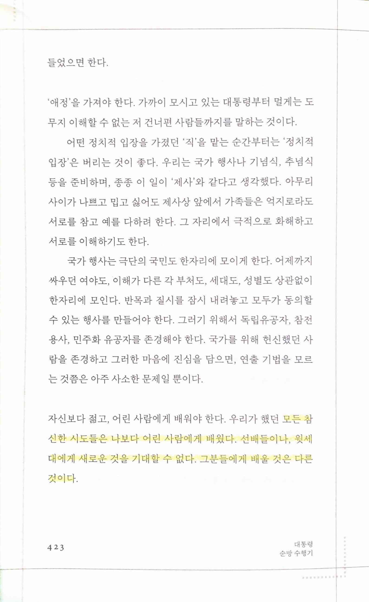
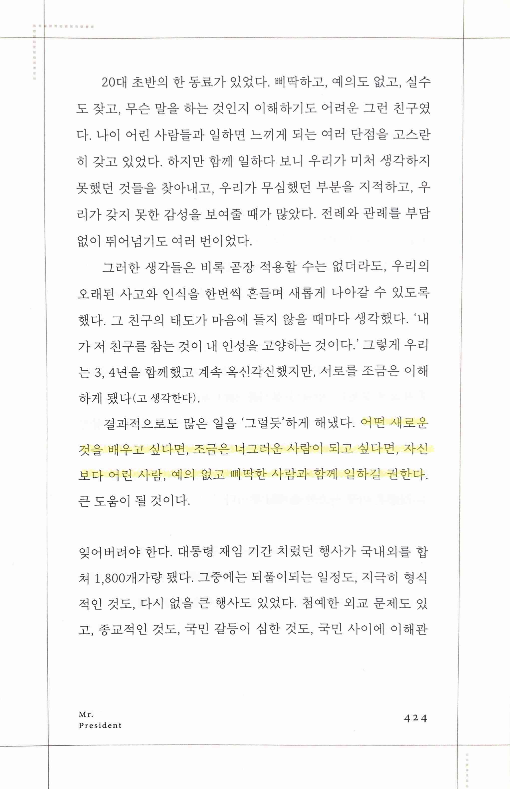

미스터 프레지던트
=================

* 당연하지만 대부분 내용이 대통령 관련 행사의 뒷 이야기, 어려움 등이다. 생각보다 읽을만하고 또 그 디테일들이 어디서 나왔는지 조금이나마 알 수 있다. 공과가 있던 시절이지만, 지금같이 모든 걸 엉망으로 하는 시절과 비교한다면 하늘과 땅 차이라는 걸 알 수 있다.

> 세월이 흐르면서 그 내용은 희미해지고 형식만 남게 됐다.
* 뭔가를 할 때 형식도 중요하지만 실제가 더 중요하다는 걸 다시 생각하게 되는 부분. 의미가 사라지면 껍데기만 남게 된다. 그래서 이미 예전에 신동엽 시인이 '껍데기는 가라'고 하지 않았나

> 모든 참신한 시도들은 나보다 어린 사람에게 배웠다. 선배들이나, 윗세대에게 새로운 것을 기대할 수 없다. 그분들에게 배울 것은 다른 것이다.

> 어떤 새로운 것을 배우고 싶다면, 조금은 너그러운 사람이 되고 싶다면, 자신보다 어린 사람, 예의 없고 삐딱한 사람과 함께 일하길 권한다.
* 나도 이걸 더 실천하고, 이걸 허용하는 데를 찾아야겠단 생각을 다시 한 번 하게 된다