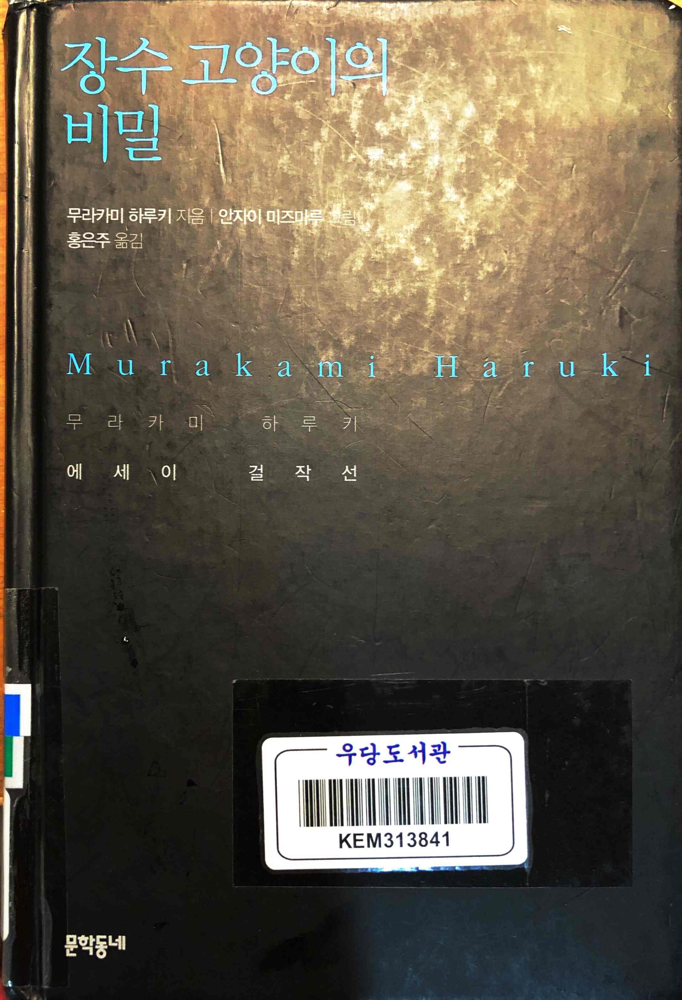
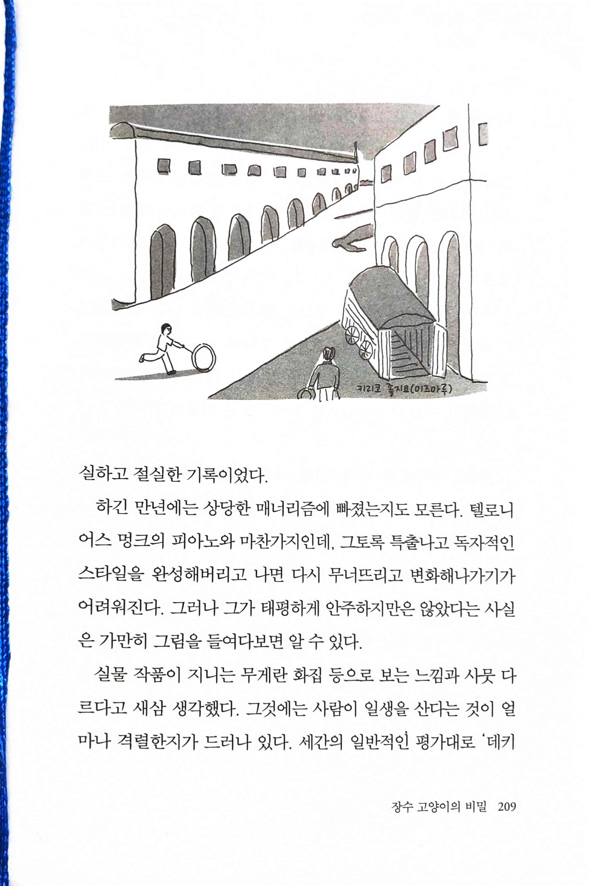
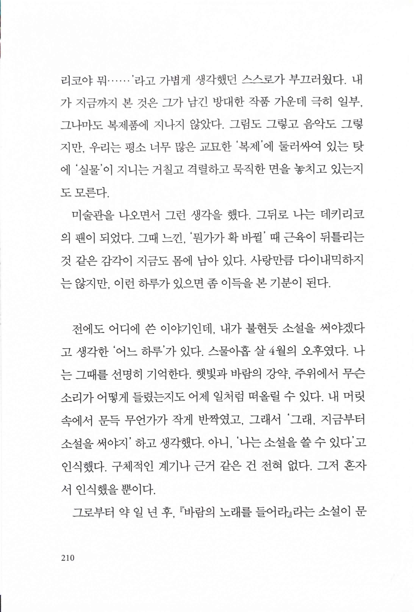
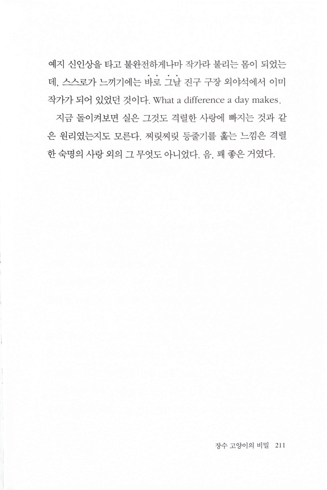
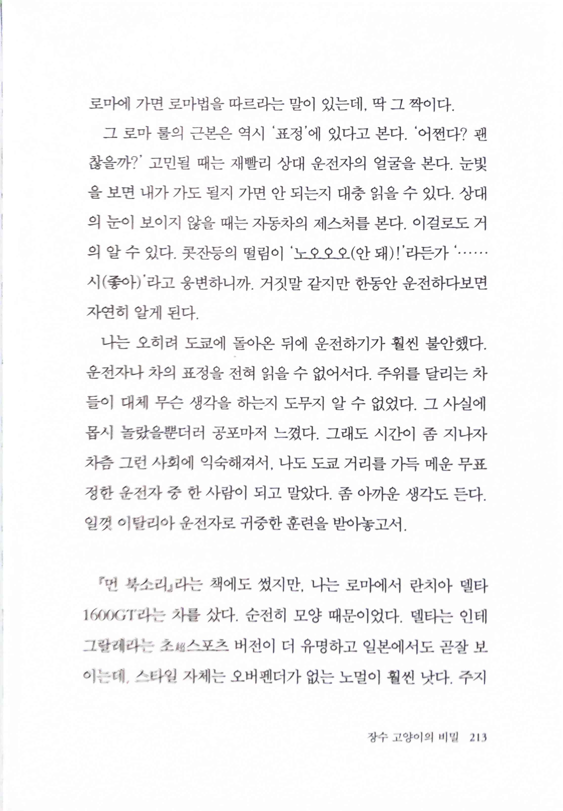
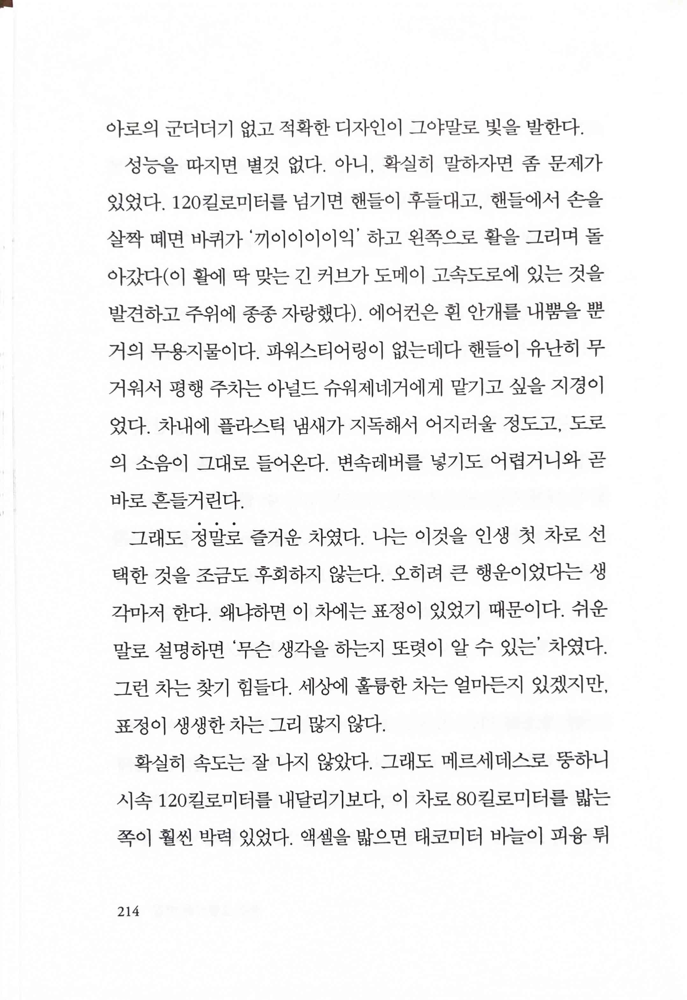

# 장수 고양이의 비밀

> 텔로니어스 멍크의 피아노와 마찬가지인데, 그토록 특출나고 독자적인 스타일을 완성해버리고 나면 다시 무너뜨리고 변화해 나가기가 어려워진다.
* 내가 항상 생각하는 팀 린스컴과 통하는 이야기. 체격의 한계를 극복하기 위해 독특하고 복잡한 딜리버리로 강력한 구위를 자랑하며 한 때 메이저리그를 휩쓸며 싸이영 상 2회 수상, 팀의 월드시리즈 우승을 이끌며 첫 3년은 완벽했으나 밸런스를 잃고 난 후 결국 재기하지 못했다.

 

> 지금 돌이켜보면 실은 그것도 격렬한 사랑에 빠지는 것과 같은 원리였는지도 모른다. 찌릿찌릿 등줄기를 훑는 느낌은 격렬한 숙명의 사랑 외의 그 무엇도 아니었다. 음, 꽤 좋은 거였다.
* 하루키 팬이라면 누구나 아는 진구 구장 이야기. 인생에 이런 순간을 만나고 성공하고 기억할 수 있는 사람이 몇이나 있을까.

 
* 란치아 델타 1600GT 운전 경험을 재미있게 표현하는 부분. 이런 문장이 하루키 수필에서 가장 즐겁다.