뉴턴의 아틀리에
===============
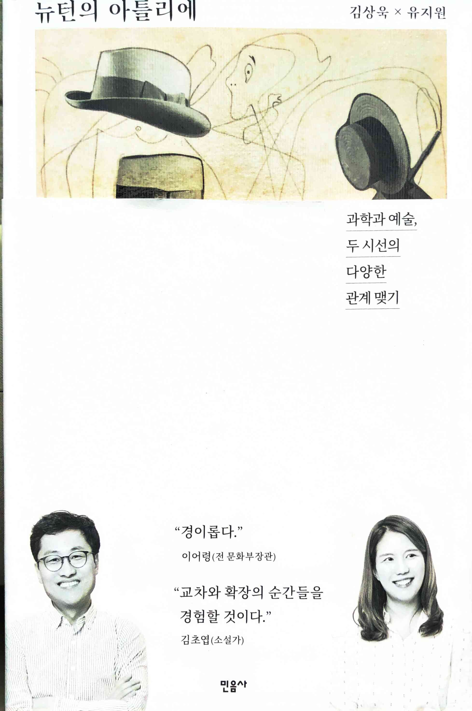

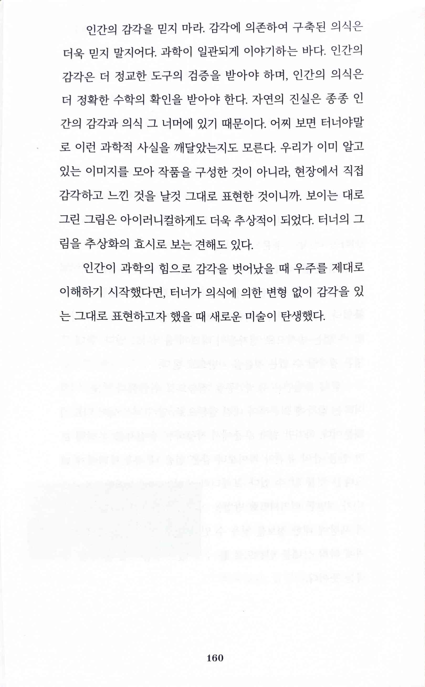

> 인간의 `감각`을 믿지 마라. 감각에 의존하여 구축된 의식은 더욱 믿지 말지어다. 과학이 일관되게 이야기하는 바다. 인간의 감각은 더 정교한 도구의 검증을 받아야 하며, 인간의 의식은 더 정확한 수학의 확인을 받아야 한다. 자연의 진실은 종종 인간의 감각과 의식 그 너머에 있기 때문이다.
* 인간의 인지 편향과 마찬가지로, 감각을 그대로 받아들이는게 자연스럽고 당연해 보이지만 항상 그렇지는 않다는 점을 알고 적절히 활용해야 한다는 의미로 받아들였다. 주변 사람들에게 종종, 특히 인터뷰에서 나는 사람이 가장 중요하지만 그렇기 때문에 인터뷰 몇 번 만으로는 사람을 바로 알 수 없다고 이야기하는 데 이런 감각/인지 편향에 대한 이야기로 확장하면 좀 더 부드럽고 자연스럽게 내 생각을 설명할 수 있단 생각이 들었다.

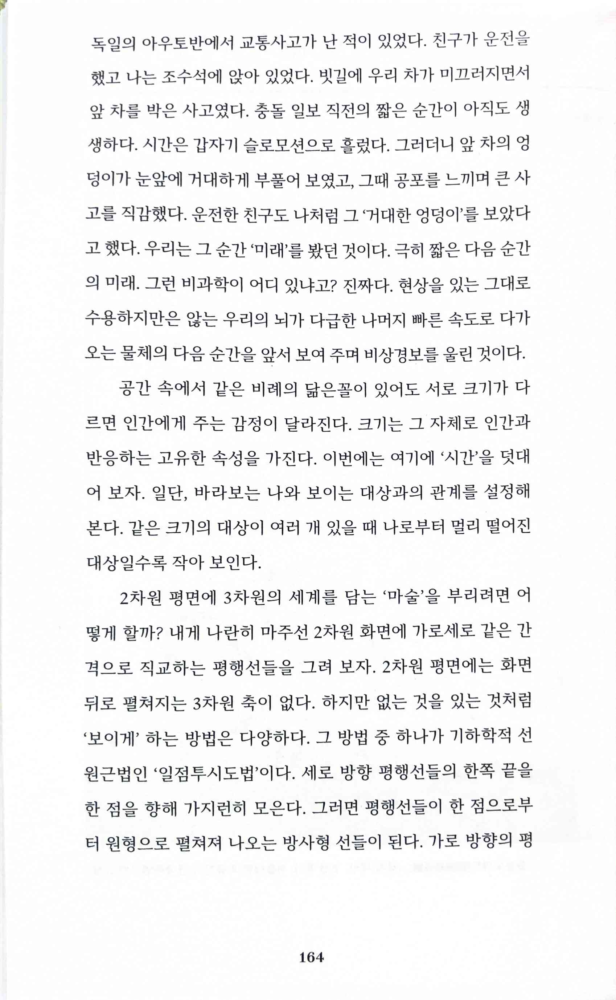

> 충돌 일보 직전의 짧은 순간이 아직도 생생하다. 시간은 갑자기 슬로모션으로 흘렀다. 그러더니 앞 차의 엉덩이가 눈앞에 거대하게 부풀어 보였고, 그때 공포를 느끼며 큰 사고를 직감했다. 운전한 친구도 나처럼 그 '거대한 엉덩이'를 보았다고 했다. 우리는 그 순간 '미래'를 봤던 것이다. 극히 짧은 다음 순간의 미래. 그런 비과학이 어디 있냐고? 진짜다. 현상을 있는 그대로 수용하지만은 않는 우리의 뇌가 다급한 나머지 빠른 속도로 다가오는 물체의 다음 순간을 앞서 보여 주며 비상경보를 울린 것이다.

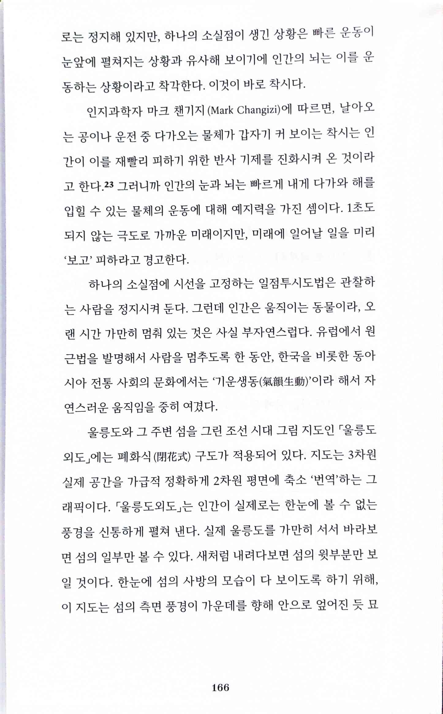

> 인지과학자 마크 챙기지 (Mark Changizi)에 따르면, 날아오는 공이나 운전 중 다가오는 물체가 갑자기 커 보이는 착시는 인간이 이를 재빨리 피하기 위한 반사 기제를 진화시켜 온 것이라고 한다. 그러니까 인간의 눈과 뇌는 빠르게 내게 다가와 해를입힐 수 있는 물체의 운동에 대해 예지력을 가진 셈이다. 1초도되지 않는 극도로 가까운 미래이지만, 미래에 일어날 일을 미리'보고' 피하라고 경고한다.
>
> 하나의 소실점에 시선을 고정하는 `일점투시도법`은 관찰하는 사람을 정지시켜 둔다. 그런데 인간은 움직이는 동물이라, 오랜 시간 가만히 멈춰 있는 것은 사실 부자연스럽다. 유럽에서 원근법을 발명해서 사람을 멈추도록 한 동안, 한국을 비롯한 동아시아 전통 사회의 문화에서는 `'기운생동(氣韻生動)'`이라 해서 자연스러운 움직임을 중히 여겼다.
>
> 울릉도와 그 주변 섬을 그린 조선 시대 그림 지도인 울릉도외도에는 는 `폐화식(閉花式) 구도`가 적용되어 있다.

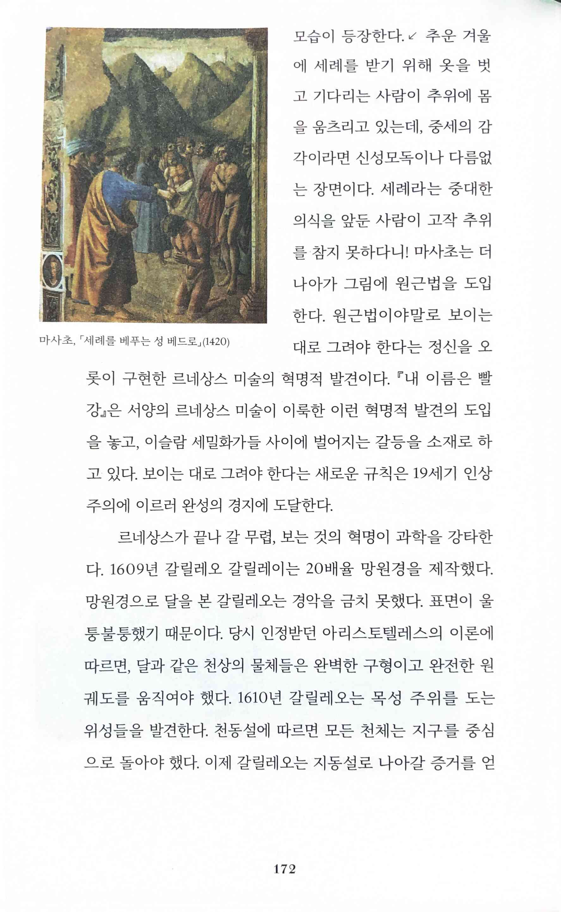

> `원근법`이야말로 보이는대로 그려야 한다는 정신을 오롯이 구현한 르네상스 미술의 혁명적 발견이다.
>
> 보이는 대로 그려야 한다는 새로운 규칙은 19세기 `인상주의`에 이르러 완성의 경지에 도달한다.
>
> 르네상스가 끝나갈 무렵, 보는 것의 혁명이 과학을 강타한다. 1609년 갈릴레오 갈릴레이는 20배율 망원경을 제작했다. 망원경으로 달을 본 갈릴레오는 경악을 금치 못했다. 표면이 울퉁불퉁했기 때문이다. 당시 인정받던 아리스토텔레스의 이론에 따르면, 달과 같은 천상의 물체들은 완벽한 구형이고 완전한 원궤도를 움직여야 했다. 1610년 갈릴레오는 목성 주위를 도는 위성들을 발견한다. 천동설에 따르면 모든 천체는 지구를 중심으로 돌아야 했다. 이제 갈릴레오는 지동설로 나아갈 증거를 얻은 것이다. 과학 혁명의 시작이다. 혁명은 자세히 볼 수 있게 된 것에서 시작되었다.
* 조금 비약하면, 지표를 측정하고 대시보드를 통해서 봐야 매니지먼트의 변화가 일어난다고 할 수 있지 않을까?

> 무지개; 독일어로는 '레겐보겐(Regenbogen)'이라 한다. 레겐과 보겐, 리듬감이 좋다. '레겐(Regen)'은 비, '보겐(Bogen)'은 둥근 아치의 형태를 말하니, 뜻밖에도 색보다는 재료와형태를 의미한다... 영어 '레인보(rainbow)'도 재료와 형태의 조합이다. 그러면 우리말 무지개는 어떨까?
>
> '물'과 '지게(戶)'(위쪽이 둥근 문)'가 '무지개'를 이루니, 놀랍게도 똑같이 '물이 만든 둥근 형상'이라는 뜻이다. 낯선 언어는 때로, 지금은 너무 익숙해서 둔감해진 우리 단어가 탄생하던 당시의 풋풋한 순간에 이렇게 접촉하게 해 준다.
>
> 파인애플은 벼목에 속한다.이 사실을 알기 전까지, 파인애플과 벼의 껍질이 닮았다는 것을 눈으로 보고 뇌로 알면서도, 게으른 눈과 뇌는 이상하게도 그걸모른 척했다. 낯선 환경이 우리 마음에 들어오면, 오류 많던 각자의 머릿속 단어 지도에 지형 변화가 일어난다.
* 나는 전혀 몰랐는데, 이걸 아는 사람이 과연 얼마나 될까?

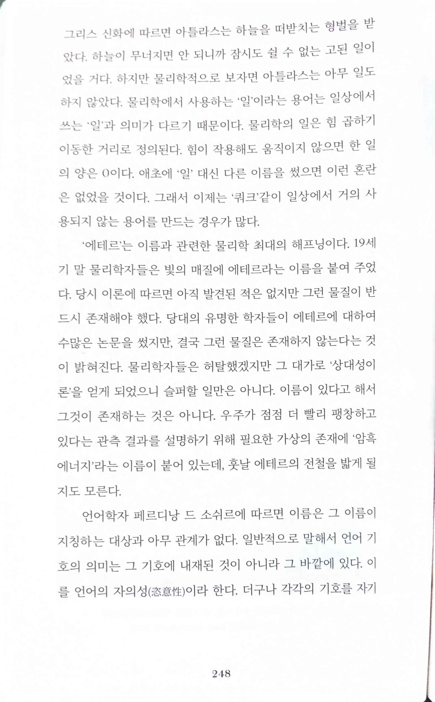

> 그리스 신화에 따르면 아틀라스는 하늘을 떠받치는 형벌을 받았다. 하늘이 무너지면 안 되니까 잠시도 쉴 수 없는 고된 일이었을 거다. 하지만 물리학적으로 보자면 아틀라스는 아무 일도 하지 않았다. 물리학에서 사용하는 '일'이라는 용어는 일상에서 쓰는 '일'과 의미가 다르기 때문이다. 물리학의 일은 힘 곱하기 이동한 거리로 정의된다. 힘이 작용해도 움직이지 않으면 한 일의 양은 0이다. 애초에 '일' 대신 다른 이름을 썼으면 이런 혼란은 없었을 것이다. 그래서 이제는 '쿼크'같이 일상에서 거의 사용되지 않는 용어를 만드는 경우가 많다.
>
> `에테르`; 이름이 있다고 해서 그것이 존재하는 것은 아니다. 우주가 점점 더 빨리 팽창하고 있다는 관측 결과를 설명하기 위해 필요한 가상의 존재에 `'암흑에너지'`라는 이름이 붙어 있는데, 훗날 에테르의 전철을 밟게 될지도 모른다.
* 이걸 읽으면서, 어떤 일을 한다고 해서 꼭 의미가 있는 일은 아니란 생각이 들었으니 요즘의 나는 심각하게 매니지먼트에만 빠져있는 듯 싶다.

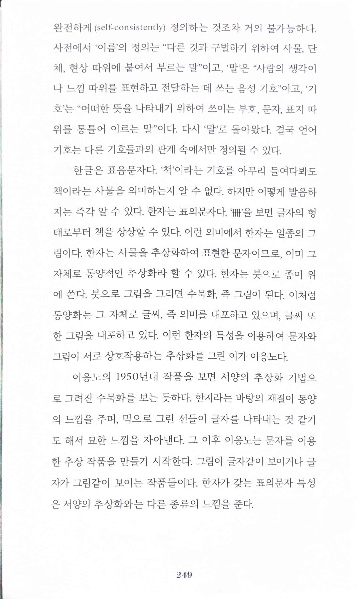

> 언어학자 `페르디낭 드 소쉬르`에 따르면 이름은 그 이름이 지칭하는 대상과 아무 관계가 없다. 일반적으로 말해서 언어 기호의 의미는 그 기호에 내재된 것이 아니라 그 바깥에 있다. 이를 `언어의 자의성`(性)이라 한다. 더구나 각각의 기호를 자기 완전하게 (self-consistently) 정의하는 것조차 거의 불가능하다. 사전에서 '이름'의 정의는 "다른 것과 구별하기 위하여 사물, 단체, 현상 따위에 붙여서 부르는 말"이고, '말'은 "사람의 생각이나 느낌 따위를 표현하고 전달하는 데 쓰는 음성 기호"이고, '기호'는 "어떠한 뜻을 나타내기 위하여 쓰이는 부호, 문자, 표지 따위를 통틀어 이르는 말"이다. 다시 '말'로 돌아왔다. 결국 언어 기호는 다른 기호들과의 관계 속에서만 정의될 수 있다.

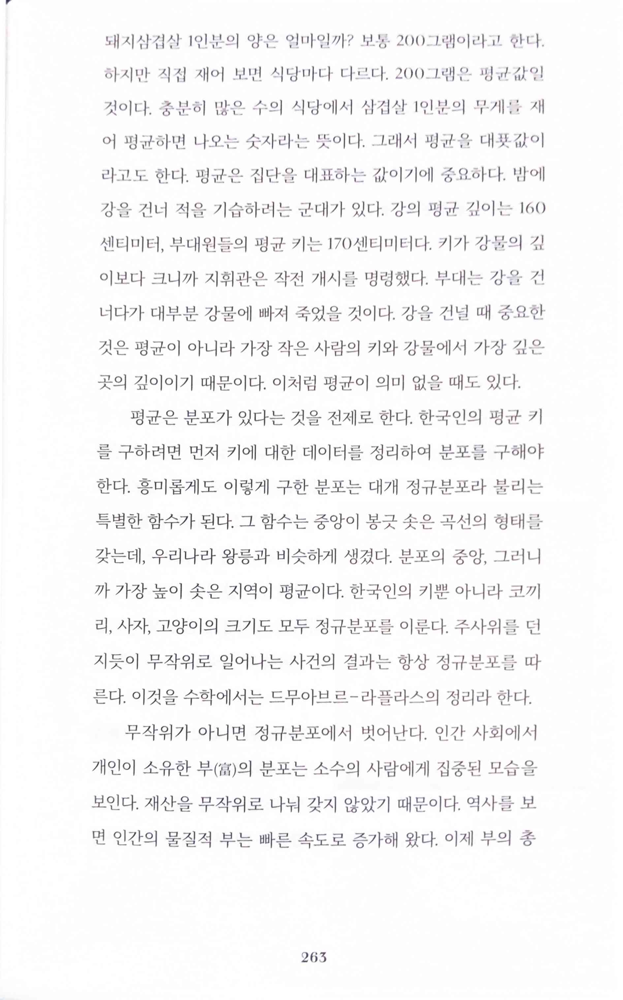

> 주사위를 던지듯이 무작위로 일어나는 사건의 결과는 항상 정규분포를 따른다. 이것을 수학에서는 `드무아브르-라플라스의 정리`라 한다.
>
> 무작위가 아니면 정규분포에서 벗어난다.

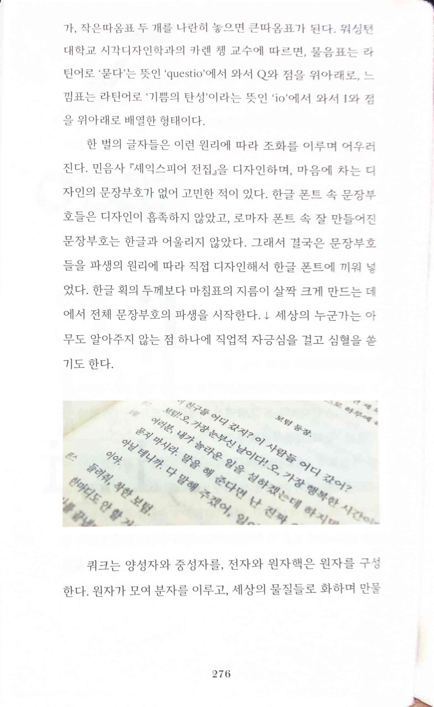

> 워싱턴 대학교 시각디자인학과의 카렌 쳉 교수에 따르면, `물음표`는 라틴어로 '묻다'는 뜻인 'questio'에서 와서 Q와 점을 위아래로, `느낌표`는 라틴어로 '기쁨의 탄성'이라는 뜻인 'io'에서 와서 와 점을 위아래로 배열한 형태이다.

 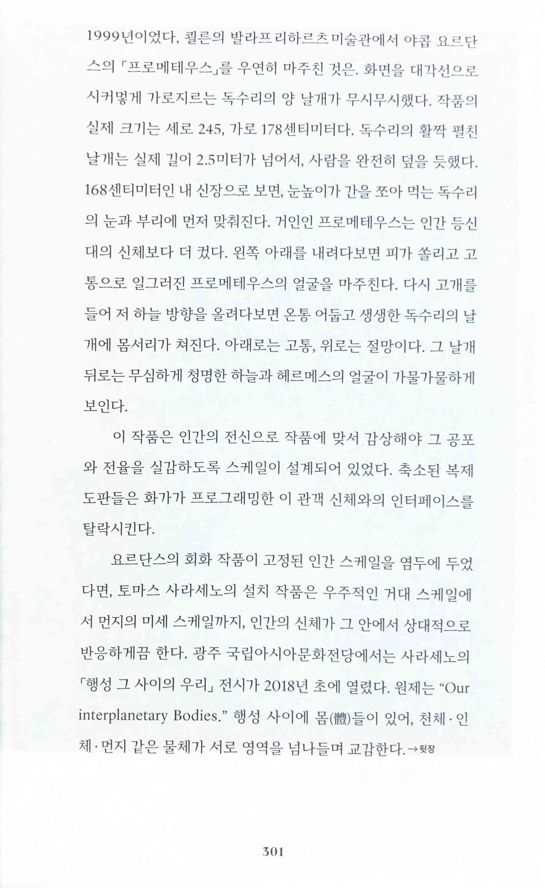

> 야콥 요르단스의 회화 작품 「프로메테우스」 (1640), 쾰른 발라프 리하르츠 미술관
>
> 이 작품은 인간의 전신으로 작품에 맞서 감상해야 그 공포와 전율을 실감하도록 스케일이 설계되어 있었다. 축소된 복제도판들은 화가가 프로그래밍한 이 관객 신체와의 인터페이스를 탈락시킨다.

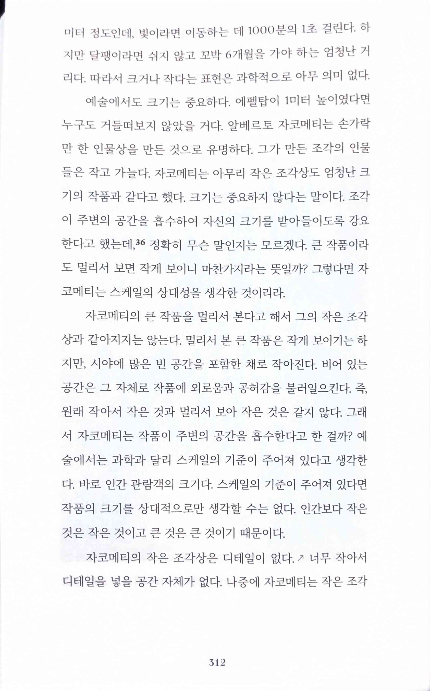

> 예술에서도 크기는 중요하다. 에펠탑이 1미터 높이였다면 누구도 거들떠보지 않았을 거다. `알베르토 자코메티`는 손가락만 한 인물상을 만든 것으로 유명하다. 그가 만든 조각의 인물들은 작고 가늘다. 자코메티는 아무리 작은 조각상도 엄청난 크기의 작품과 같다고 했다. 크기는 중요하지 않다는 말이다. 조각이 주변의 공간을 흡수하여 자신의 크기를 받아들이도록 강요한다고 했는데, 정확히 무슨 말인지는 모르겠다. 큰 작품이라도 멀리서 보면 작게 보이니 마찬가지라는 뜻일까? 그렇다면 자코메티는 스케일의 상대성을 생각한 것이리라.
>
> 예술에서는 과학과 달리 스케일의 기준이 주어져 있다고 생각한다. 바로 인간 관람객의 크기다.
* 그래서 인간의 예술과 자연에서 느끼는 감동이 다르게 다가오는 걸까?

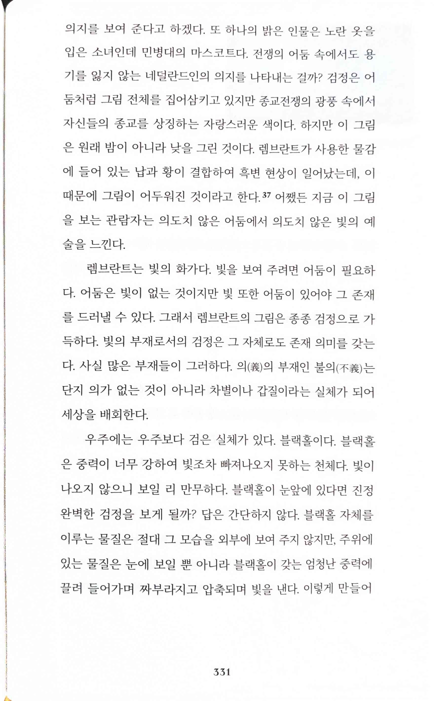

> 렘브란트는 빛의 화가다. 빛을 보여 주려면 어둠이 필요하다. 어둠은 빛이 없는 것이지만 빛 또한 어둠이 있어야 그 존재를 드러낼 수 있다. 그래서 렘브란트의 그림은 종종 검정으로 가득하다. 빛의 `부재`로서의 검정은 그 자체로도 존재 의미를 갖는다. 사실 많은 부재들이 그러하다. 의(義)의 부재인 불의(不義)는 단지 의가 없는 것이 아니라 차별이나 갑질이라는 실체가 되어 세상을 배회한다.

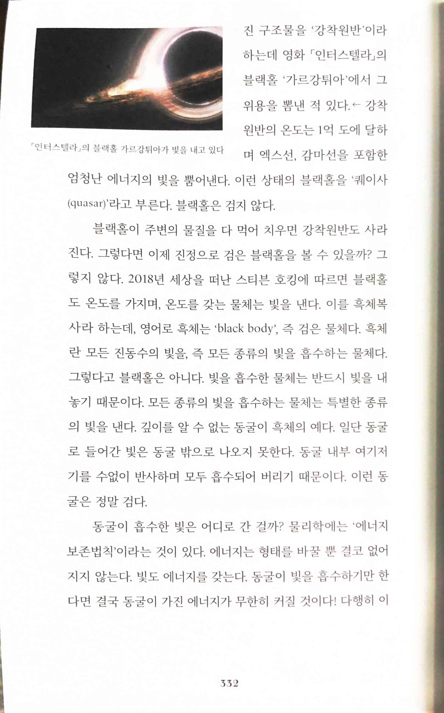

> 우주에는 우주보다 검은 실체가 있다. 블랙홀이다. 블랙홀은 중력이 너무 강하여 빛조차 빠져나오지 못하는 천체다. 빛이 나오지 않으니 보일 리 만무하다. 블랙홀이 눈앞에 있다면 진정 완벽한 검정을 보게 될까? 답은 간단하지 않다. 블랙홀 자체를 이루는 물질은 절대 그 모습을 외부에 보여 주지 않지만, 주위에 있는 물질은 눈에 보일 뿐 아니라 블랙홀이 갖는 엄청난 중력에 끌려 들어가며 짜부라지고 압축되며 빛을 낸다. 이렇게 만들어진 구조물을 `'강착원반'`이라하는데 영화 「인터스텔라」의 블랙홀 '가르강튀아'에서 그 위용을 뽐낸 적 있다. 강착원반의 온도는 1억 도에 달하며 엑스선, 감마선을 포함한 엄청난 에너지의 빛을 뿜어낸다. 이런 상태의 블랙홀을 퀘이사(quasar)'라고 부른다. 블랙홀은 검지 않다.
>
> 블랙홀이 주변의 물질을 다 먹어 치우면 강원도 사라진다. 그렇다면 이제 진정으로 검은 블랙홀을 볼 수 있을까? 그렇지 않다. 2018년 세상을 떠난 스티븐 호킹에 따르면 블랙홀도 온도를 가지며, 온도를 갖는 물체는 빛을 낸다. 이를 `흑체복사`라 하는데, 영어로 흑체는 'black body', 즉 검은 물체다. 흑체란 모든 진동수의 빛을, 즉 모든 종류의 빛을 흡수하는 물체다.그렇다고 블랙홀은 아니다. 빛을 흡수한 물체는 반드시 빛을 내놓기 때문이다. 모든 종류의 빛을 흡수하는 물체는 특별한 종류의 빛을 낸다.

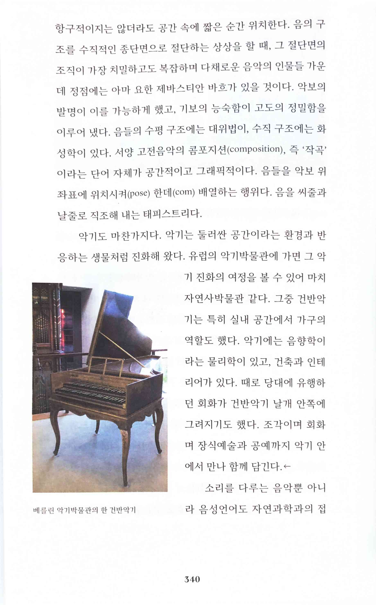

> 항구적이지는 않더라도 공간 속에 짧은 순간 위치한다. 음의 구조를 수직적인 종단면으로 절단하는 상상을 할 때, 그 절단면의 조직이 가장 치밀하고도 복잡하며 다채로운 음악의 인물들 가운데 정점에는 아마 요한 제바스티안 바흐가 있을 것이다. 악보의 발명이 이를 가능하게 했고, 기보의 능숙함이 고도의 정밀함을 이루어 냈다. 음들의 수평 구조에는 대위법이, 수직 구조에는 화성학이 있다. 서양 고전음악의 `콤포지션(composition)`, 즉 '작곡'이라는 단어 자체가 공간적이고 그래픽적이다. 음들을 악보 위 좌표에 위치시켜(pose) 한데 (com) 배열하는 행위다. 음을 씨줄과 날줄로 직조해 내는 태피스트리다.

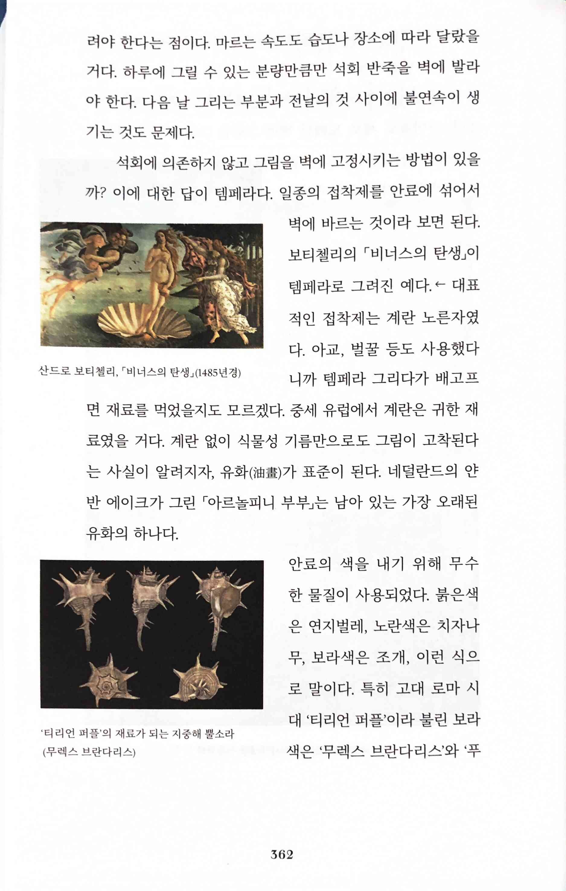 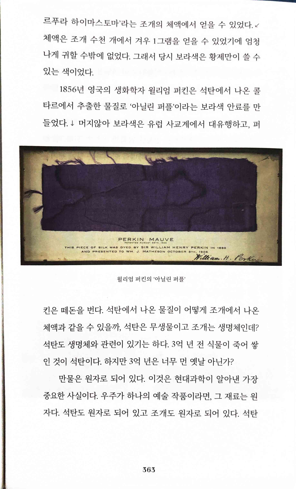

> 안료의 색을 내기 위해 무수한 물질이 사용되었다. 붉은색은 연지벌레, 노란색은 치자나무, 보라색은 조개, 이런 식으로 말이다. 특히 고대 로마 시대 `'티리언 퍼플'`이라 불린 보라색은 '무렉스 브란다리스'와 '푸르푸라 하이마스토마'라는 조개의 체액에서 얻을 수 있었다. 체액은 조개 수천 개에서 겨우 1그램을 얻을 수 있었기에 엄청나게 귀할 수밖에 없었다. 그래서 당시 보라색은 황제만이 쓸 수 있는 색이었다.
>
> 1856년 영국의 생화학자 윌리엄 퍼킨은 석탄에서 나온 콜타르에서 추출한 물질로 `'아닐린 퍼플'`이라는 보라색 안료를 만들었다.

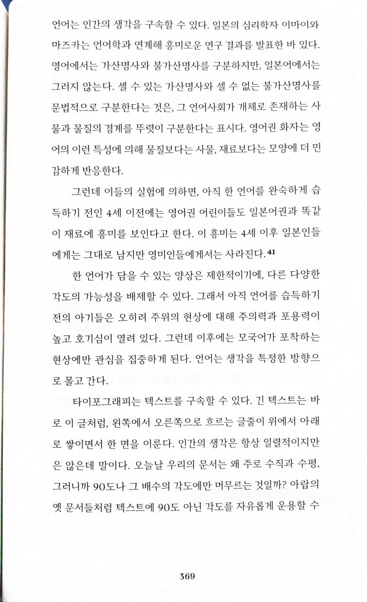

> 언어는 인간의 생각을 구속할 수 있다. 일본의 심리학자 이마이와 마즈카는 언어학과 연계해 흥미로운 연구 결과를 발표한 바 있다. 영어에서는 가산명사와 불가산명사를 구분하지만, 일본어에서는 그러지 않는다. 셀 수 있는 가산명사와 셀 수 없는 불가산명사를 문법적으로 구분한다는 것은, 그 언어사회가 개체로 존재하는 사물과 물질의 경계를 뚜렷이 구분한다는 표시다. 영어권 화자는 영어의 이런 특성에 의해 물질보다는 사물, 재료보다는 모양에 더 민감하게 반응한다.
>
> 한 언어가 담을 수 있는 양상은 제한적이기에, 다른 다양한 각도의 가능성을 배제할 수 있다. 그래서 아직 언어를 습득하기 전의 아기들은 오히려 주위의 현상에 대해 주의력과 포용력이 높고 호기심이 열려 있다. 그런데 이후에는 모국어가 포착하는 현상에만 관심을 집중하게 된다. 언어는 생각을 특정한 방향으로 몰고 간다.
* 너무나 당연한게 어떤 직업에 오래 일하는 사람들은 대부분의 생각이 그 방향으로 간다는 사실은 오래된 친구들과의 관계만 봐도 드러난다. 어린 시절에는 친구들과 좋아하는 취미나 관심사에 대해 이야기하지만, 나이가 들고 각자의 직업에 오래 종사하다보면 자연스레 그런 주제들은 사라지고 예전 이야기나, 아니면 일반적인 공통의 관심사(나이든 남자라면 대부분 정치, 경제 등)가 화제에 오른다. 각자 직업에 관계된 이야기를 하면 이해하기 어렵거나 안되는 경우가 대부분이다. 자신의 경험으로 미뤄서 그 문화나 사고 방식을 받아들이기 어려운 경우가 생기기 때문이라고 본다. 그 바탕에는 사용하는 전문 용어가 깔리는 경우가 많다. 자신의 직업에서는 자연스러운 축약어나 일반적인 용어이지만, 다른 직업을 갖는 사람들에게는 매우 전문적이라 들어본 적도 없거나, 들어도 설명을 해야 겨우 이해할 수 있기 때문이다.

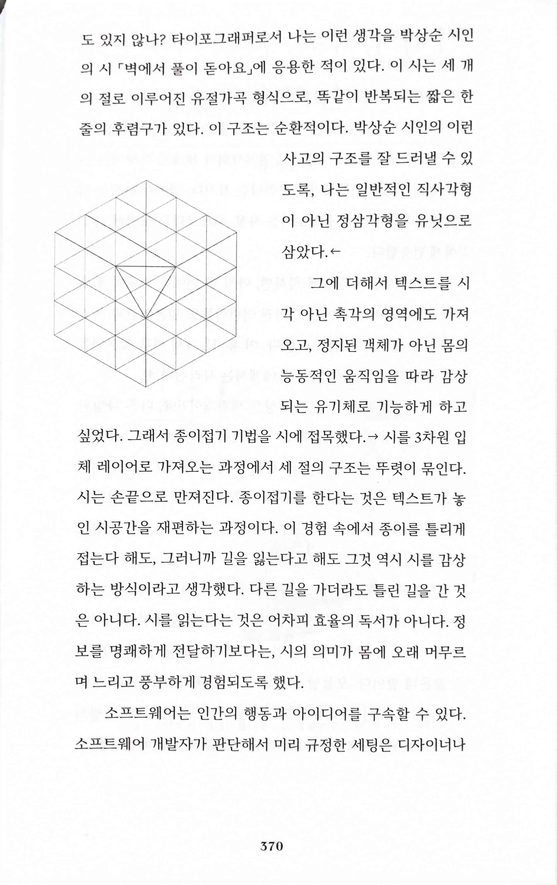 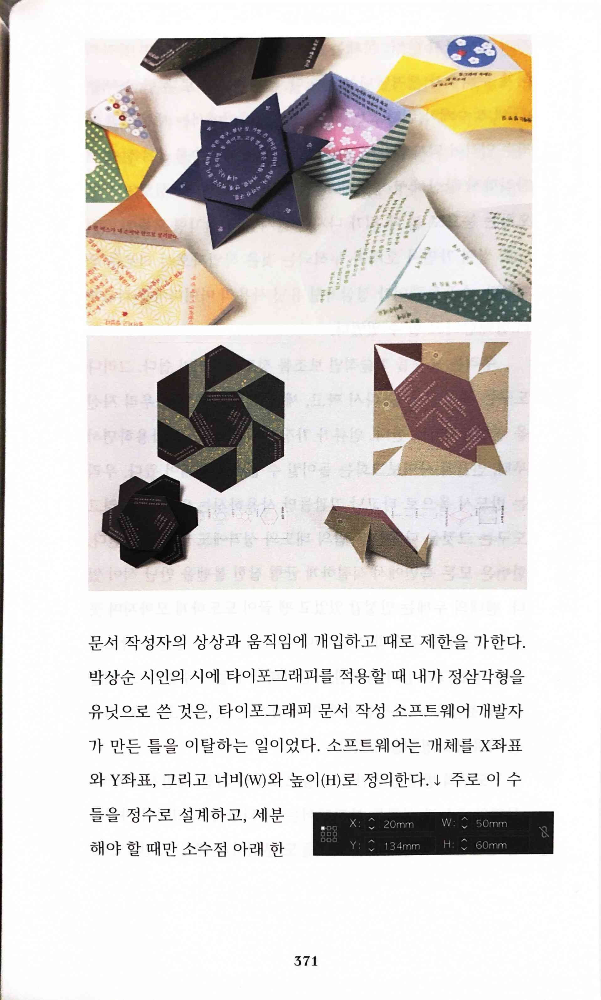 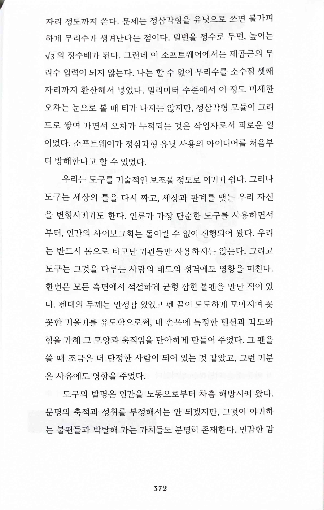 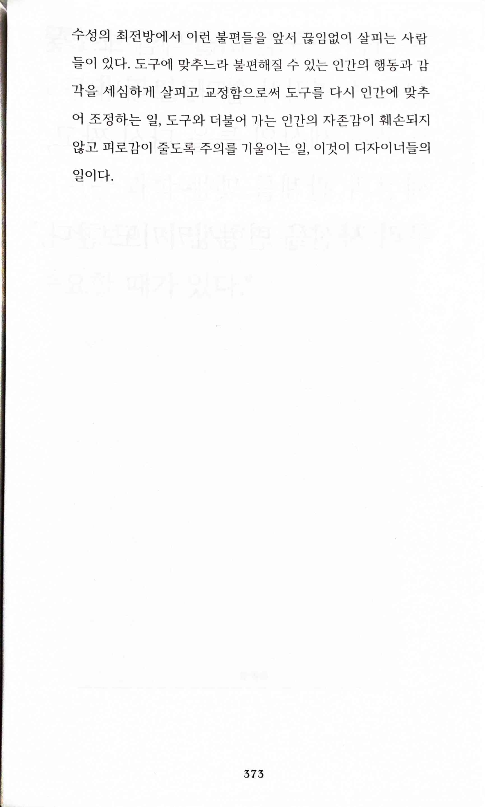

> 소프트웨어는 인간의 행동과 아이디어를 구속할 수 있다. 소프트웨어 개발자가 판단해서 미리 규정한 세팅은 디자이너나 문서 작성자의 상상과 움직임에 개입하고 때로 제한을 가한다.박상순 시인의 시에 타이포그래피를 적용할 때 내가 정삼각형을 유닛으로 쓴 것은, 타이포그래피 문서 작성 소프트웨어 개발자가 만든 틀을 이탈하는 일이었다. 소프트웨어는 개체를 X좌표와 Y좌표, 그리고 너비(W)와 높이(H)로 정의한다. 주로 이 수들을 정수로 설계하고, 세분해야 할 때만 소수점 아래 한 자리 정도까지 쓴다. 문제는 정삼각형을 유닛으로 쓰면 불가피하게 무리수가 생겨난다는 점이다. 밑변을 정수로 두면, 높이는 V3 의 정수배가 된다. 그런데 이 소프트웨어에서는 제곱근의 무리수 입력이 되지 않는다. 나는 할 수 없이 무리수를 소수점 셋째자리까지 환산해서 넣었다. 밀리미터 수준에서 이 정도 미세한 오차는 눈으로 볼 때 티가 나지는 않지만, 정삼각형 모듈이 그리드로 쌓여 가면서 오차가 누적되는 것은 작업자로서 괴로운 일이었다. 소프트웨어가 정삼각형 유닛 사용의 아이디어를 처음부터 방해한다고 할 수 있었다.
>
> 우리는 도구를 기술적인 보조물 정도로 여기기 쉽다. 그러나 도구는 세상의 틀을 다시 짜고, 세상과 관계를 맺는 우리 자신을 변형시키기도 한다. 인류가 가장 단순한 도구를 사용하면서부터, 인간의 사이보그화는 돌이킬 수 없이 진행되어 왔다. 우리는 반드시 몸으로 타고난 기관들만 사용하지는 않는다. 그리고 도구는 그것을 다루는 사람의 태도와 성격에도 영향을 미친다. 한번은 모든 측면에서 적절하게 균형 잡힌 볼펜을 만난 적이 있다. 펜대의 두께는 안정감 있었고 펜 끝이 도도하게 모아지며 꼿꼿한 기울기를 유도함으로써, 내 손목에 특정한 텐션과 각도와 힘을 가해 그 모양과 움직임을 단아하게 만들어 주었다. 그 펜을 쓸 때 조금은 더 단정한 사람이 되어 있는 것 같았고, 그런 기분은 사유에도 영향을 주었다.
>
> 도구의 발명은 인간을 노동으로부터 차츰 해방시켜 왔다. 문명의 축적과 성취를 부정해서는 안 되겠지만, 그것이 야기하는 불편들과 박탈해 가는 가치들도 분명히 존재한다. 민감한 감수성의 최전방에서 이런 불편들을 앞서 끊임없이 살피는 사람들이 있다. 도구에 맞추느라 불편해질 수 있는 인간의 행동과 감각을 세심하게 살피고 교정함으로써 도구를 다시 인간에 맞추어 조정하는 일, 도구와 더불어 가는 인간의 자존감이 훼손되지않고 피로감이 줄도록 주의를 기울이는 일, 이것이 디자이너들의일이다.

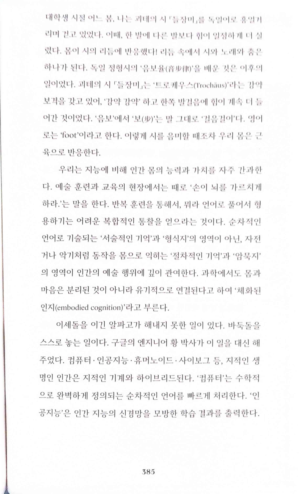

> 우리는 지능에 비해 인간 몸의 능력과 가치를 자주 간과한다. 예술 훈련과 교육의 현장에서는 때로 '손이 뇌를 가르치게 하라'는 말을 한다. 반복 훈련을 통해서, 뭐라 언어로 풀어서 형용하기는 어려운 복합적인 통찰을 얻으라는 것이다. 순차적인 언어로 기술되는 '서술적인 기억'과 '형식지'의 영역이 아닌, 자전거나 악기처럼 동작을 몸으로 익히는 '절차적인 기억'과 '암묵지'의 영역이 인간의 예술 행위에 깊이 관여한다. 과학에서도 몸과 마음은 분리된 것이 아니라 유기적으로 연결된다고 하여 '체화된 인지 (embodied cognition)'라고 부른다.
* 흔히 말하는 muscle memory로 봐도 될까?

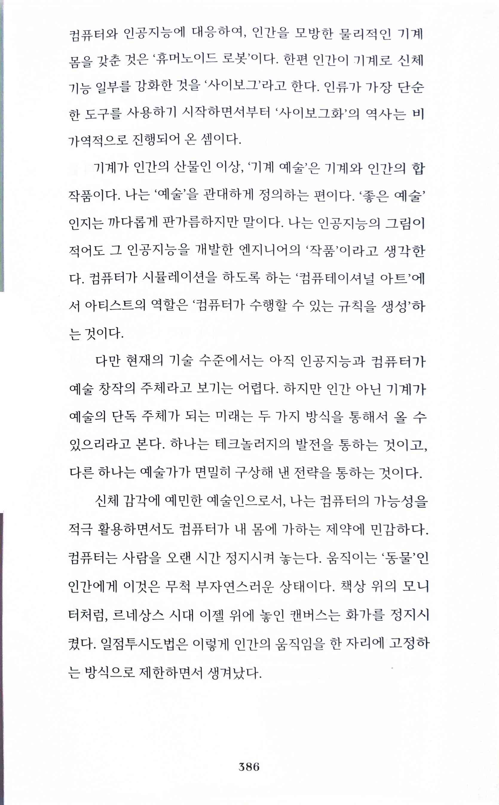

> 컴퓨터와 인공지능에 대응하여, 인간을 모방한 물리적인 기계몸을 갖춘 것은 '휴머노이드 로봇'이다. 한편 인간이 기계로 신체기능 일부를 강화한 것을 '사이보그'라고 한다. 인류가 가장 단순한 도구를 사용하기 시작하면서부터 '사이보그화'의 역사는 비가역적으로 진행되어 온 셈이다.
* 이런 의미에서는 이미 스마트폰이나 각종 웨어러블 기기를 통해 사이보그화는 어느 정도 진행이 되어왔다.

> 하지만 예술품이 시장에 나오면 그것의 가치는 예술이 아니라 시장이 결정한다.
>
> 거래에 있어 그림이 진짜 예술품인지 여부는 중요하지 않다. 인공지능이 만든 작품이 예술품인지 여부는 다른 관점에서 생각해야 한다.
>
> E. H. 곰브리치의 「서양미술사』는 이런 문장으로 시작된다. “미술(art)이라는 것은 사실상 존재하지 않는다. 다만 미술가들이 있을 뿐이다." 미술가가 하는 일이 미술이라는 말인데, 그렇다면 미술가는 누구인가? 미술 하는 사람이 미술가니까 결국 자기참조의 오류에 빠진 것 아닌가? 곰브리치의 말에는 심오한 의미가 있다고 생각한다. 어떤 결과물이 미술품인지 판단하는 근거는 결과물이 아니라 그 결과물을 만든 주체에 있다는 것이다.

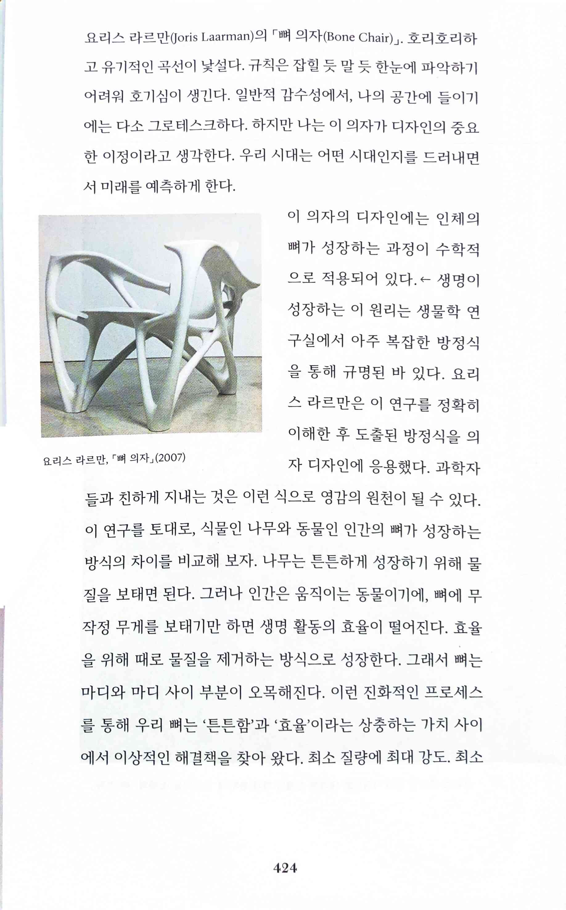

> 식물인 나무와 동물인 인간의 뼈가 성장하는 방식의 차이를 비교해 보자. 나무는 튼튼하게 성장하기 위해 물질을 보태면 된다. 그러나 인간은 움직이는 동물이기에, 뼈에 무작정 무게를 보태기만 하면 생명 활동의 효율이 떨어진다. 효율을 위해 때로 물질을 제거하는 방식으로 성장한다. 그래서 뼈는 마디와 마디 사이 부분이 오목해진다. 이런 진화적인 프로세스를 통해 우리 뼈는 '튼튼함'과 '효율'이라는 상충하는 가치 사이에서 이상적인 해결책을 찾아 왔다.
* 핵심 가치를 실현하기 위해 버릴 것은 버리고, 정말 중요한 것만 남겨야 한다는 이야기를 할 때 사용할 수 있을까?

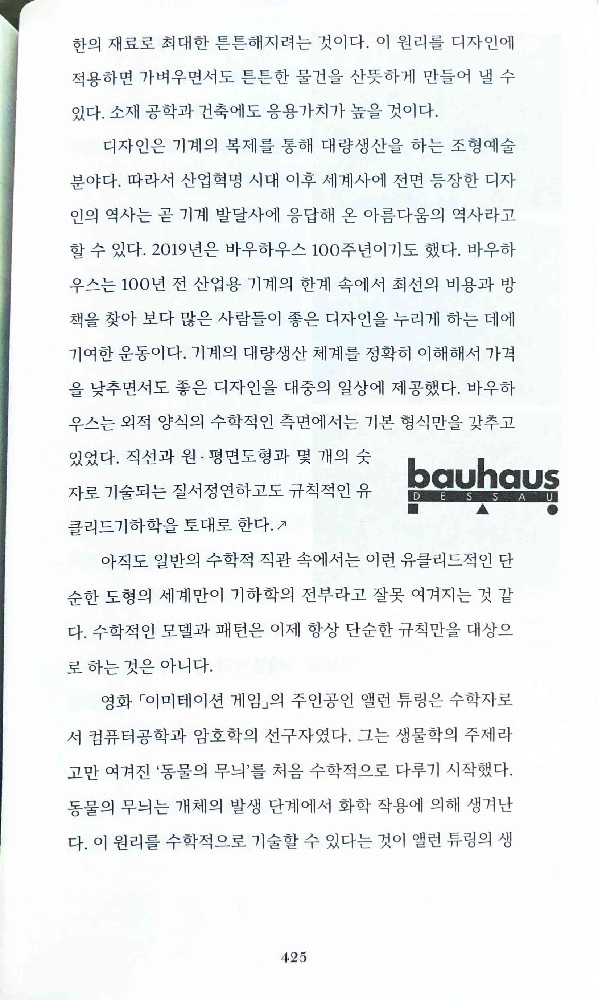

> 바우하우스는 외적 양식의 수학적인 측면에서는 기본 형식만을 갖추고 있었다. 직선과 원 · 평면도형과 몇 개의 숫자로 기술되는 질서정연하고도 규칙적인 유클리드기하학을 토대로 한다.