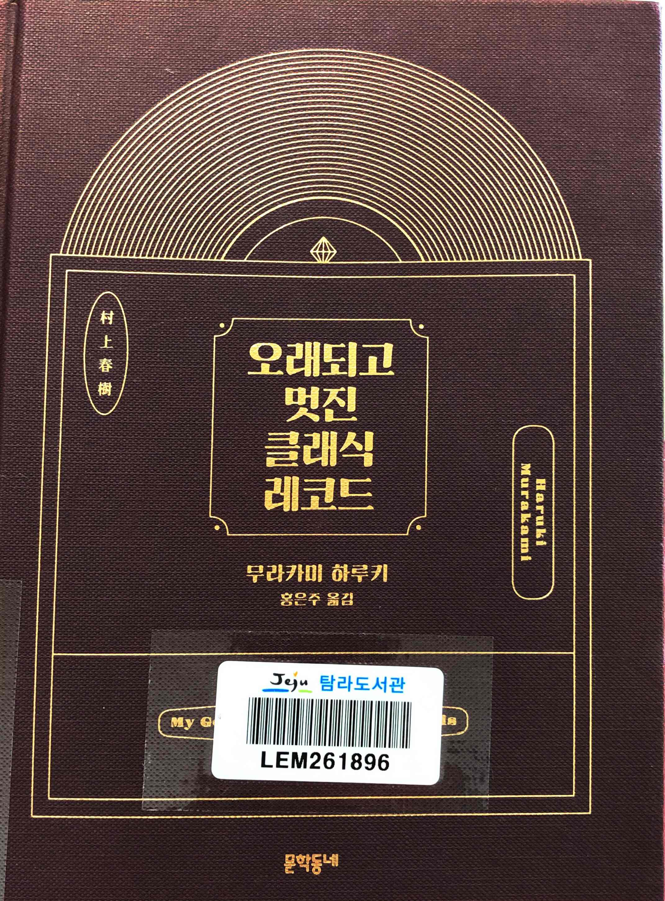
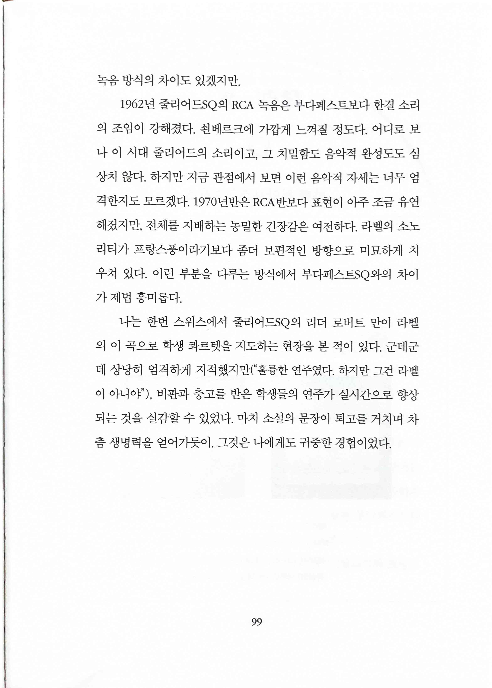
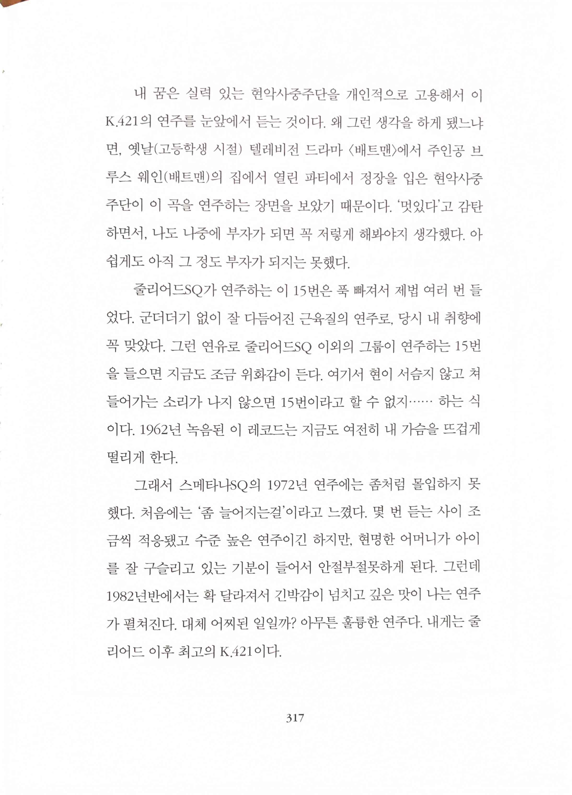
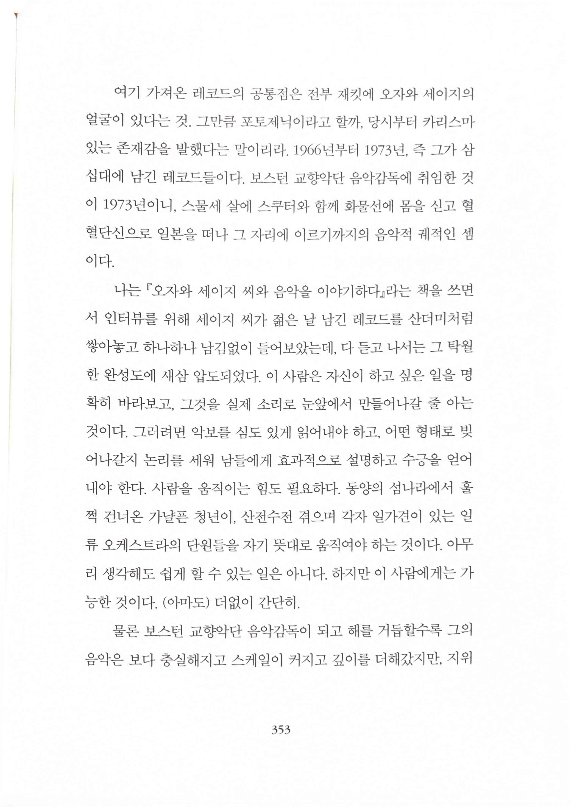

# Haruki Murakami Old and Nice Classic Records 오래되고 멋진 클래식 레코드

* 하루키 책 중에서 이렇게 성의없이 읽은 책은 처음. 다른 분들이 왜 비추천했는지 알겠다.
* 당연히 글이 나뻐서가 아니다. 다만 다른 수필에서 읽을 수 있는 하루키의 글에서 느낄 수 있는 재미를 거의 느낄 수 없다.
* 위스키를 잘 알아서 위스키 성지여행을 재미있게 읽은게 아닌데, 이 책은 정말 클래식에 조예가 있어야 글의 느낌이 전해질 듯한 느낌이다.
* 지휘자나 오케스트라단에 따른 차이는 커녕 작곡가 이름도 잘 모르는 사람들이 음감의 질 따위를 논할 수는 없는 수준이니까.
* 한 가지 더, 책 표지도 원서가 더 예쁘다(고 생각한다)
  * [Haruki Murakami Old and Nice Classic Records Hard Cover | Etsy South Korea](https://www.etsy.com/listing/1110805081/haruki-murakami-old-and-nice-classic)

> 나는 한번 스위스에서 줄리어드SQ의 리더 로버트 만이 라벨의 이 곡으로 학생 콰르텟을 지도하는 현장을 본 적이 있다. 군데군데 상당히 엄격하게 지적했지만(“훌륭한 연주였다. 하지만 그건 라벨이 아니야") 비판과 충고를 받은 학생들의 연주가 실시간으로 향상되는 것을 실감할 수 있었다. 마치 소설의 문장이 퇴고를 거치며 차츰 생명력을 얻어가듯이. 그것은 나에게도 귀중한 경험이었다.
* 뭐든 돌아보고 향상시키는 일이 필요하다는 점을 다시 한 번 느낀다

> 내 꿈은 실력 있는 현악사중주단을 개인적으로 고용해서 이 K.421의 연주를 눈앞에서 듣는 것이다. 왜 그런 생각을 하게 됐느냐면, 옛날(고등학생 시절) 텔레비전 드라마 <배트맨>에서 주인공 브루스 웨인(배트맨)의 집에서 열린 파티에서 정장을 입은 현악사중주단이 이 곡을 연주하는 장면을 보았기 때문이다. '멋있다'고 감탄하면서, 나도 나중에 부자가 되면 꼭 저렇게 해봐야지 생각했다. 아쉽게도 아직 그 정도 부자가 되지는 못했다.
* 사실 이런 부분이 하루키의 수필에서 주제에 대해 전문성이 없어도 재미있게 읽을 수 있고 빠져들게 만드는 부분인데(이라고 생각하는데) 이 책은 아쉽게도 이런 점이 정말 부족하다

> 탁월한 완성도에 새삼 압도되었다. 이 사람은 자신이 하고 싶은 일을 명확히 바라보고, 그것을 실제 소리로 눈앞에서 만들어나갈 줄 아는것이다. 그러려면 악보를 심도 있게 읽어내야 하고, 어떤 형태로 빚어나갈지 논리를 세워 남들에게 효과적으로 설명하고 수긍을 얻어내야 한다. 사람을 움직이는 힘도 필요하다. 동양의 섬나라에서 훌쩍 건너온 가냘픈 청년이 산전수전 겪으며 각자 일가견이 있는 일류 오케스트라의 단원들을 자기 뜻대로 움직여야 하는 것이다. 아무리 생각해도 쉽게 할 수 있는 일은 아니다. 하지만 이 사람에게는 가능한 것이다. (아마도) 더없이 간단히.
* `탁월한 완성도`에 대한 공감가는 이야기