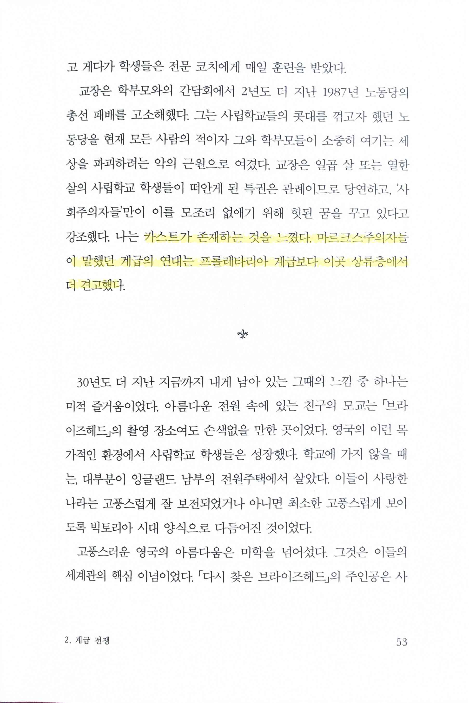
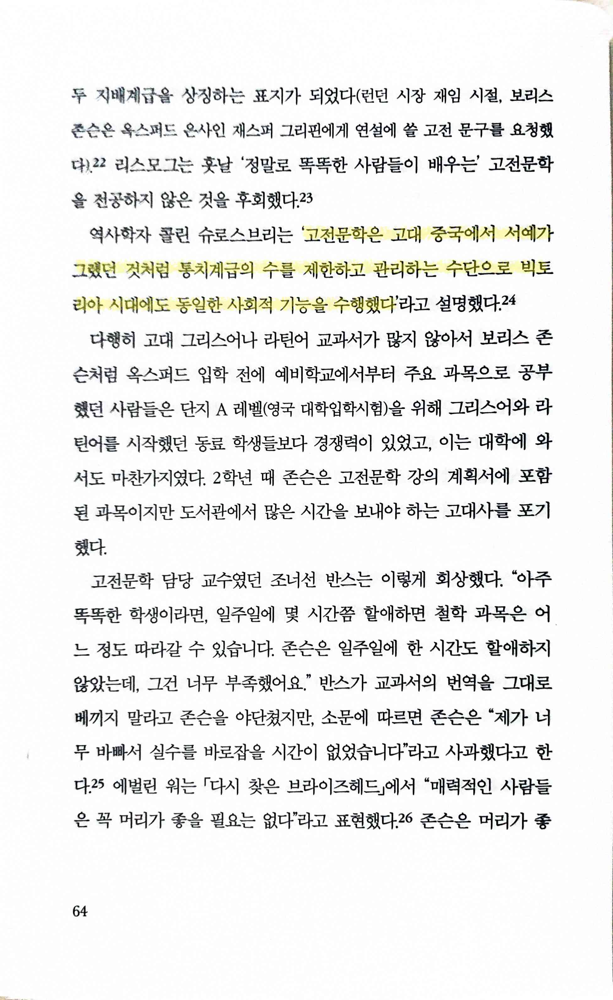
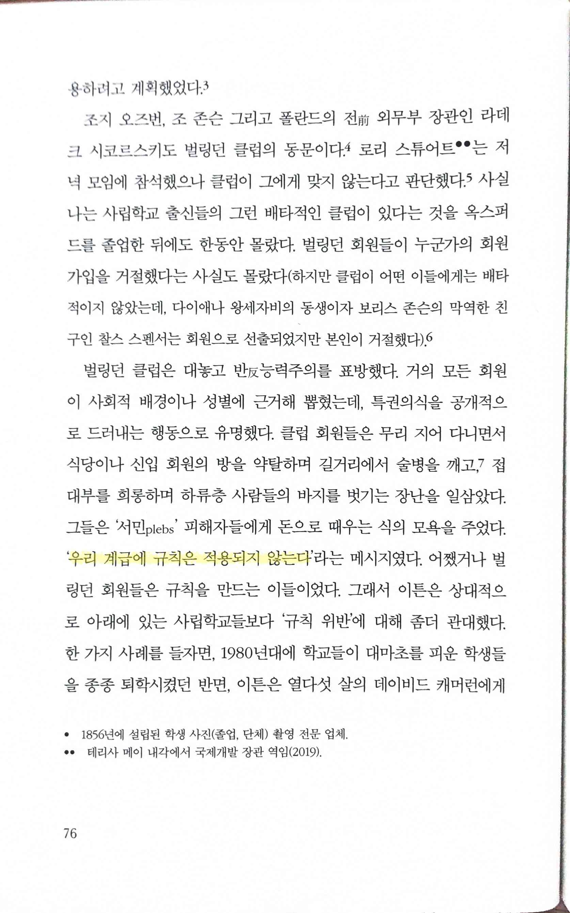
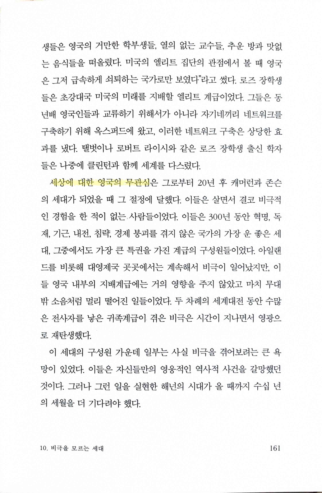
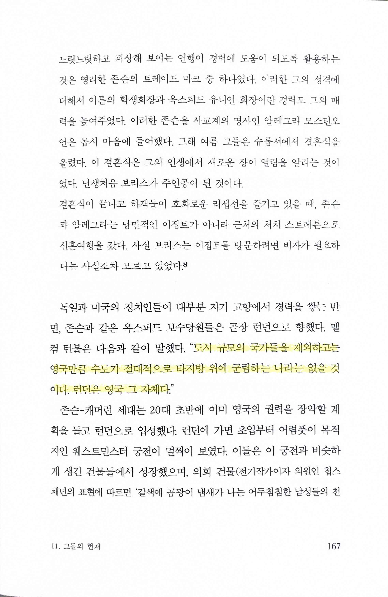
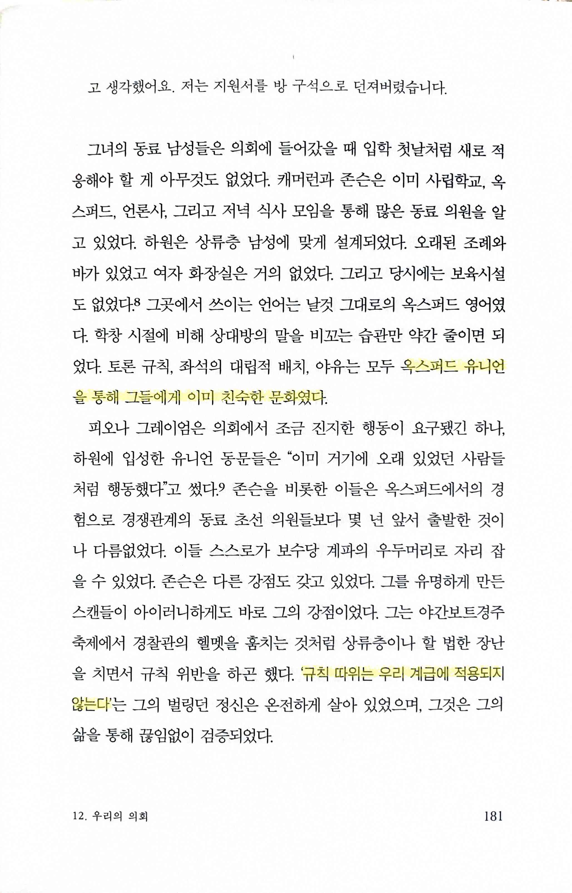
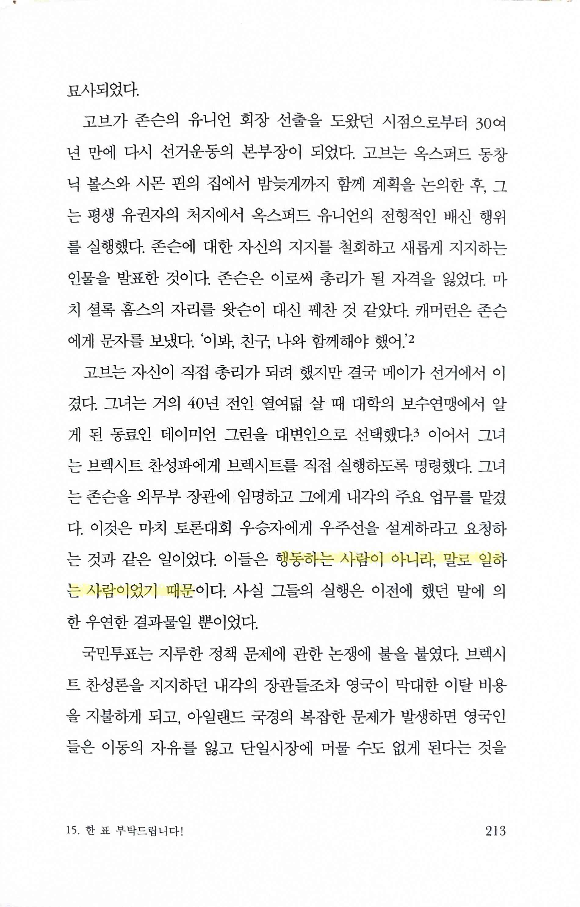
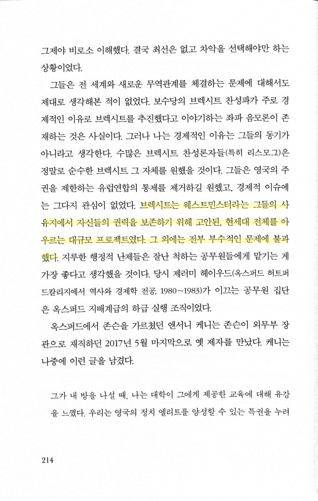
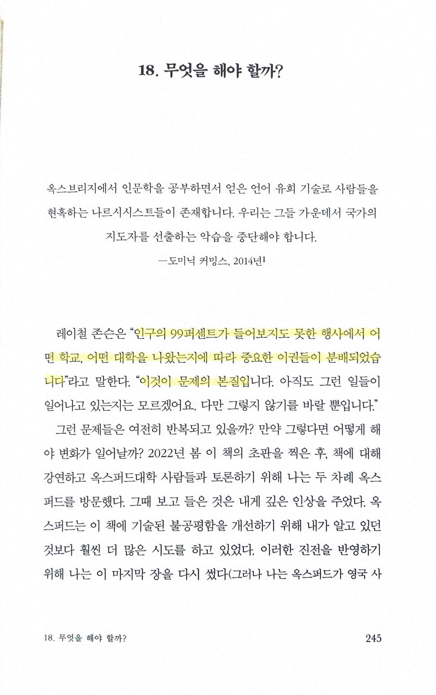
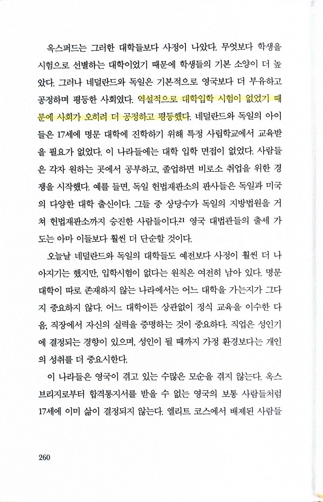

# 옥스퍼드 초엘리트 Oxford

Tags: essay
Date: August 11, 2024
Score: ★★☆☆☆

- ★★☆☆☆ August 11, 2024 영국의 브렉시트를 주도한 보수당 정치세력이 옥스퍼드의 상위 계급 모임에서부터 어떻게 잉태되었는지를 보여주는 책. 마지막 장에서 옥스퍼드도 이제는 변화하는 모습을 보이고 있다고 하는데(하지만 쉽게 변할 거라고 생각하지는 않음), 우리 사회는 오히려 차츰 이런 계급 사회의 형태를 띄는 게 아닐까 우려된다.
    - 한라 309.124-쿠894ㅇ 탐라 문340.924-쿠843ㅇ 우당 문340.924-쿠843ㅇ
    - https://www.youtube.com/watch?v=HV6VsiBNjbg
    - https://www.khan.co.kr/culture/book/article/202401051800001
- p53
    
    
    
    - 카스트가 존재하는 것을 느꼈다. 마르크스주의자들이 말했던 계급의 연대는 프롤레타리아 계급보다 이곳 상류층에서 더 견고했다.
- p64
    
    
    
    - ‘고전문학은 고대 중국에서 서예가 그랬던 것처럼 통치계급의 수를 제한하고 관리하는 수단으로 빅토리아 시대에도 동일한 사회적 기능을 수행했다’
- p76
    
    
    
    - ‘우리 계급에 규칙은 적용되지 않는다’
- p161
    
    
    
    - 세상에 대한 영국의 무관심
        - 식민지를 잃은 제국의 현상일까?
- p167
    
    
    
    - “도시 규모의 국가들을 제외하고는 영국만큼 수도가 절대적으로 타지방 위에 군림하는 나라는 없을 것이다. 런던은 영국 그 자체다.”
        - 우리나라와 비교하면 어떨까?
- p181
    
    
    
    - 옥스퍼드 유니언을 통해 그들에게 이미 친숙한 문화였다.
    - ‘규칙 따위는 우리 계급에 적용되지 않는다’
- pp213~214
    
    
    
    - 행동하는 사람이 아니라, 말로 일하는 사람이었기 때문
    
    
    
    - 브렉시트는 웨스트민스터라는 그들의 사유지에서 자신들의 권력을 보존하기 위해 고안된, 현세대 전체를 아우르는 대규모 프로젝트였다. 그 외에는 전부 부수적인 문제에 불과했다.
- p245
    
    
    
    - “인구의 99퍼센트가 들어보지도 못한 행사에서 어떤 학교, 어떤 대학을 나왔는지에 따라 중요한 이권들이 분배되었습니다”… “이것이 문제의 본질…
- p260
    
    
    
    - 역설적으로 대학입학 시험이 없었기 때문에 사회가 오히려 더 공정하고 평등했다.
        - grade를 나누지를 않기 때문에 그런 걸까?
