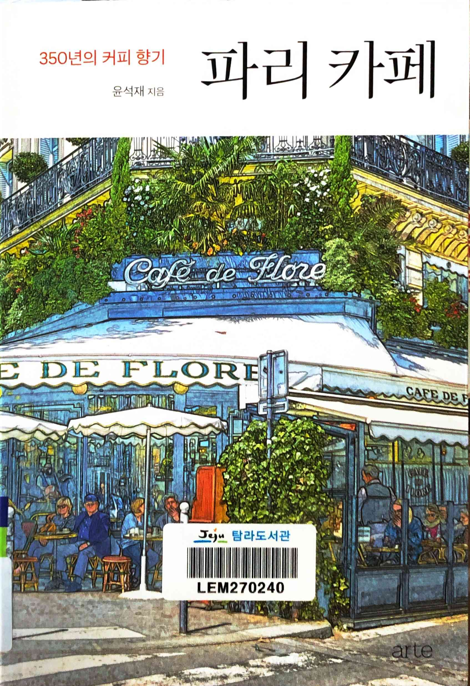
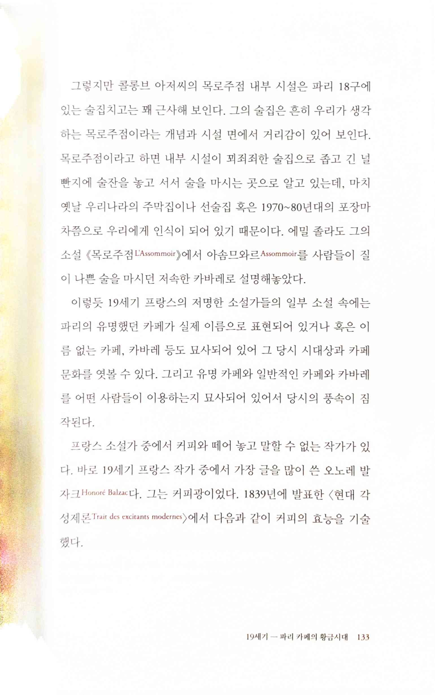
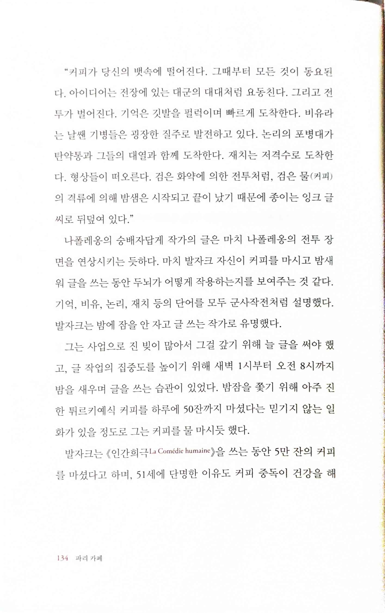

파리 카페
=========

* 유학 시절에는 아무런 지식도 정보도 없어 즐기지 못했던 파리의 카페를 사회적 지위와 여유가 생긴 이후에 돌아보고 알려주는 책. 그렇다고 허영심에 찬 졸부가 자랑하듯 이야기하는 게 아니라, 여행책을 봐서는 알기 어려운 역사적인 이야기와 함께 오래된 카페를 소개하기 때문에 좀 더 좁은 분야로 남들과 다른 여행을 가거나, 그냥 여러가지 분야의 이야기를 좋아하는 사람들에게 가볍고 재미있게 읽기 좋다. 아울러 이 책을 읽으면서 느낀 점 하나는 이제 우리나라도 이렇게 세분화된 분야에 대한 책들이 많이 나오는 걸 보니 정말 먹고 살만해진 나라구나 하는 생각.

 

> 오노레 발자크 Honore Balzac, <현대 각성제론 Trait des excitants modernes>
>
> "커피가 당신의 뱃속에 떨어진다. 그때부터 모든 것이 동요된다. 아이디어는 전장에 있는 대군의 대대처럼 요동친다. 그리고 전투가 벌어진다. 기억은 깃발을 펄럭이며 빠르게 도착한다. 비유라는 날쌘 기병들은 굉장한 질주로 발전하고 있다. 논리의 포병대가 탄약통과 그들의 대열과 함께 도착한다. 재치는 저격수로 도착한다. 형상들이 떠오른다. 검은 화약에 의한 전투처럼, 검은 물(커피)의 격류에 의해 밤샘은 시작되고 끝이 났기 때문에 종이는 잉크 글씨로 뒤덮여 있다."
* 문학적인 표현에 크게 감흥을 갖지 않게 되었지만, 이 표현은 읽는 순간 짜릿한 느낌이 들 정도로 마음이 갔다. 커피를 전투로 비유하다니, 나 같은 사람은 감히 시도하기도 어려운 상상력이다.

# 책에 나오는 파리의 유명 카페와 레스토랑의 홈페이지
* 프로코프 [Le Procope | Restaurant | Plus ancien café-restaurant de Paris | Odéon](https://www.procope.com/)
* 카페 드 플로르 [Accueil - Café de Flore](https://cafedeflore.fr/)
* 레 드 마고 [Les Deux Magots - Café Restaurant Saint Germain des Pres](https://lesdeuxmagots.fr/)
* 라 클로즈리 데 릴라 [La Closerie des Lilas / Restaurant Gastronomique / Paris](https://www.closeriedeslilas.fr/)
* 라 쿠폴 [La Coupole | Brasserie | Fruits de mer | Sur place | A Emporter | Livraison | Paris 14](https://www.lacoupole-paris.com/)
* 르 셀렉트 [Le Select Montparnasse / Restaurant / Paris](https://www.leselectmontparnasse.fr/)
* 르 돔 [Accueil-Décembre - Restaurant le Dôme](https://www.restaurant-ledome.com/)
* 카페 드 라 페 [→ Café de la Paix Paris · Restaurant in Paris, Opéra Garnier](https://www.cafedelapaix.fr/)
* 푸퀘스 [Fouquet's Paris](https://www.hotelsbarriere.com/fr/collection-fouquets/paris/restaurants-et-bars/fouquets.html)
* 라 메르 카트린 [lamerecatherine](https://lamerecatherine.com/)
* 라 본느 프랑퀘트 [La Bonne Franquette | Restaurant Paris Montmartre](https://www.labonnefranquette.com/)
* 라 메종 로즈 [lamaisonrose-montmartre](https://lamaisonrose-montmartre.com/)
* 라팽 아질 [AU LAPIN AGILE | CABARET ARTISTIQUE DEPUIS 1860](http://au-lapin-agile.com/)