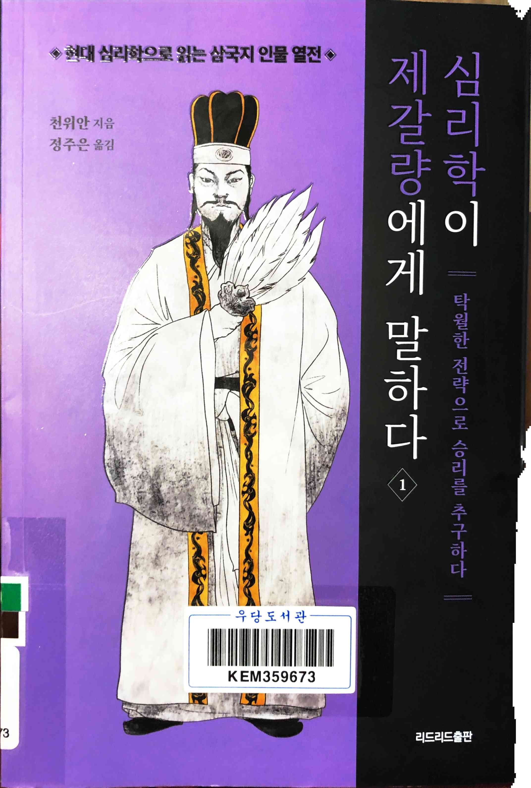
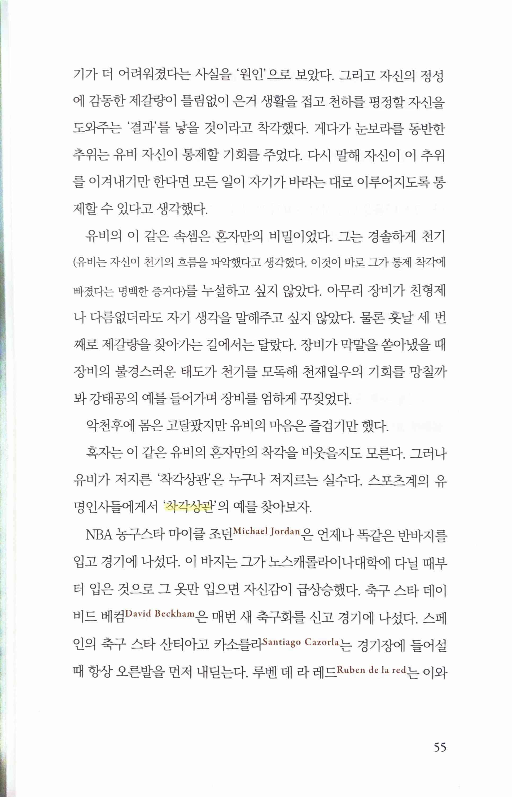
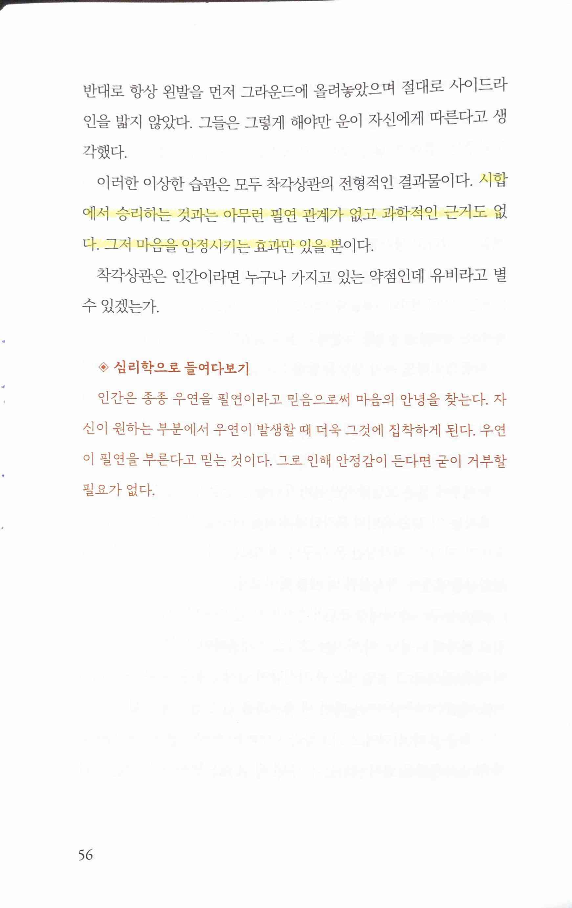
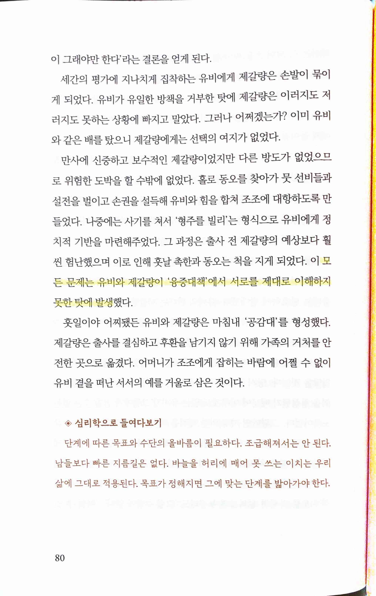
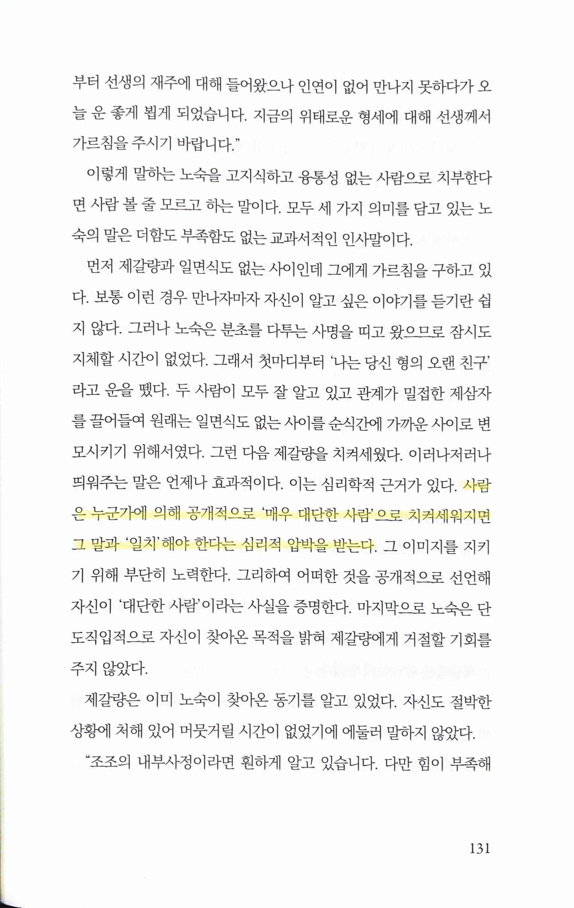
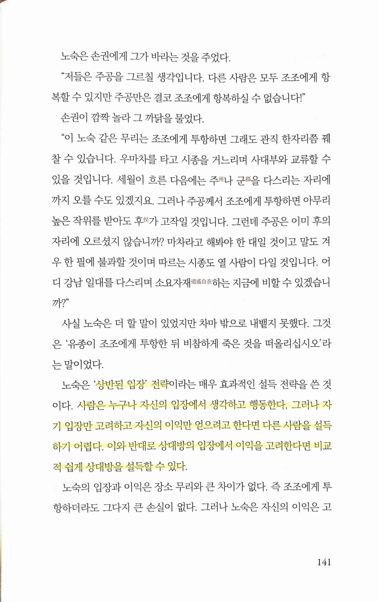
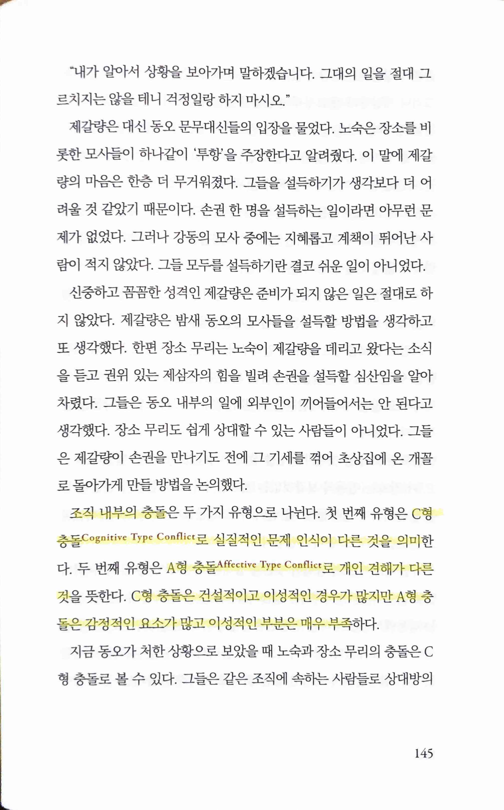
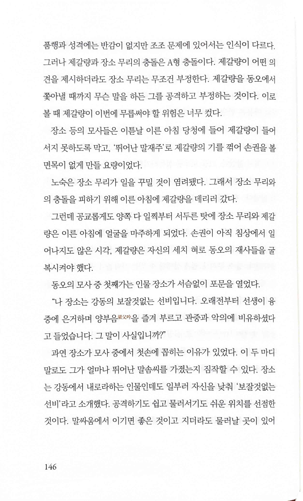
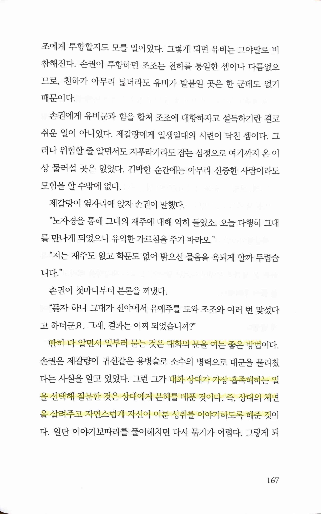
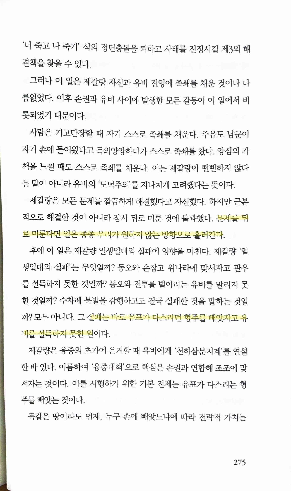

심리학이 제갈량에게 말하다
===================

* 1권 ★★★☆☆ 2023.05.06
* 2권 ★★★☆☆ 2023.05.28 저자의 제갈량에 대한 평가; 초두효과(첫인상)때문에 평생 위연을 의심했고 통제욕구로 인해 모든 걸 혼자 처리해서 인재를 키우지 않았지만 자신의 신비한 이미지를 만들고 유지하는데 온갖 노력을 기울여 역사에 길이 남은 인물

 

> 착각상관
>
> 시합에서 승리하는 것과는 아무런 필연 관계가 없고 과학적인 근거도 없다. 그저 마음을 안정시키는 효과만 있을 뿐이다.
* 밑에도 써있지만 '그저' 마음을 안정시키는 효과가 아니라 마음을 '안정'시킬 수 있기에 중요한 것

> 모든 문제는 유비와 제갈량이 '융중대책'에서 서로를 제대로 이해하지 못한 탓에 발생했다.
* 서로를 이해하지 못한채 일을 크게 성공했으나 결국 나중의 실패 또한 이미 처음부터 품은 채 시작했다는 이런 해석은 신선했다.

> 사람은 누군가에 의해 공개적으로 '매우 대단한 사람'으로 치켜세워지면 그 말과 '일치' 해야 한다는 심리적 압박을 받는다.

> '상반된 입장' 전략... 사람은 누구나 자신의 입장에서 생각하고 행동한다. 그러나 자기 입장만 고려하고 자신의 이익만 얻으려고 한다면 다른 사람을 설득하기 어렵다. 이와 반대로 상대방의 입장에서 이익을 고려한다면 비교적 쉽게 상대방을 설득할 수 있다.

 

> 조직 내부의 충돌... C형 충돌 Cognitive Type Conflict로 실질적인 문제 인식이 다른 것... A형 충돌 Affective Type Conflict로 개인 견해가 다른 것... C형 충돌은 건설적이고 이성적인 경우가 많지만 A형 충돌은 감정적인 요소가 많고 이성적인 부분은 매우 부족

> 빤히 다 알면서 일부러 묻는 것은 대화의 문을 여는 좋은 방법... 대화 상대가 가장 흡족해하는 일을 선택해 질문한 것은 상대에게 은혜를 베푼 것이다. 즉, 상대의 체면을 살려주고 자연스럽게 자신이 이룬 성취를 이야기하도록 해준 것

> 문제를 뒤로 미룬다면 일은 종종 우리가 원하지 않는 방향으로 흘러간다.
>
> 실패는 바로 유표가 다스리던 형주를 빼앗자고 유비를 설득하지 못한 일이다.
* 역시 신선한 해석. 필요하다면 명분도 만들어내는게 정치의 세계인데 왜 그걸 하지 않았/못했을까?