만화로 배우는 양자역학과 상대성이론 QUANTUM
===========================================
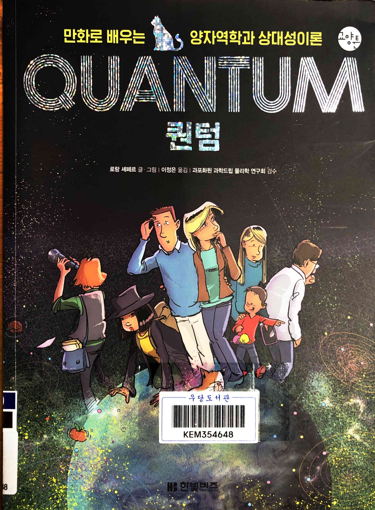

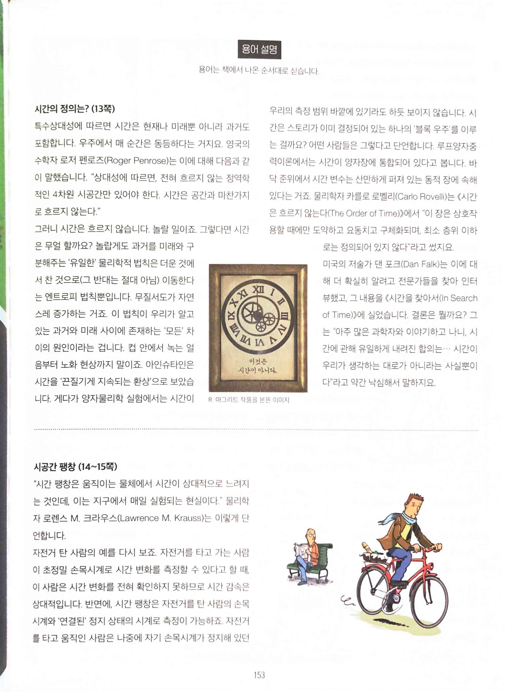

> 시간의 정의
>
> 영국의 수학자 로저 펜로즈(Roger Penrose) "상대성에 따르면, 전혀 흐르지 않는 정역학적인 4차원 시공간만 있어야 한다. 시간은 공간과 마찬가지로 흐르지 않는다."
>
> 놀랍게도 과거를 미래와 구분해주는 '유일한' 물리학적 법칙은 더운 것에서 찬 것으로(그 반대는 절대 아님) 이동한다는 엔트로피 법칙뿐입니다.
>
> 아인슈타인 '시간을 끈질기게 지속되는 환상'
>
> 물리학자 카를로 로벨리(Carlo Rovelli)는 시간은 흐르지 않는다(The Order of Time)>에서 “이 장은 상호작용할 때에만 도약하고 요동치고 구체화되며, 최소 층위 이하로는 정의되어 있지 않다"라고 썼지요.
>
> 미국의 저술가 댄 포크(Dan Falk), 시간을 찾아서(In Search_of Time) "아주 많은 과학자와 이야기하고 나니, 시간에 관해 유일하게 내려진 합의는 시간이 우리가 생각하는 대로가 아니라는 사실뿐이다"라고 약간 낙심해서 말하지요.

> 시공간 팽창
>
> "시간 팽창은 움직이는 물체에서 시간이 상대적으로 느려지는 것인데, 이는 지구에서 매일 실험되는 현실이다." 물리학자 로렌스 M. 크라우스(Lawrence M. Krauss)

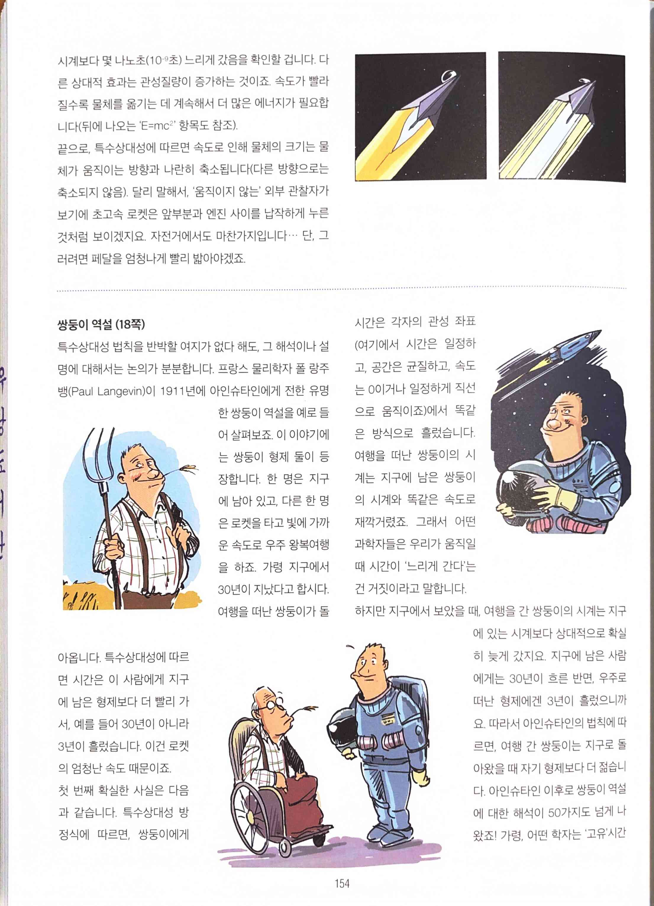

> 쌍둥이 역설
>
> 프랑스 물리학자 폴 랑주뱅(Paul Langevin)이 1911년에 아인슈타인에게 전달

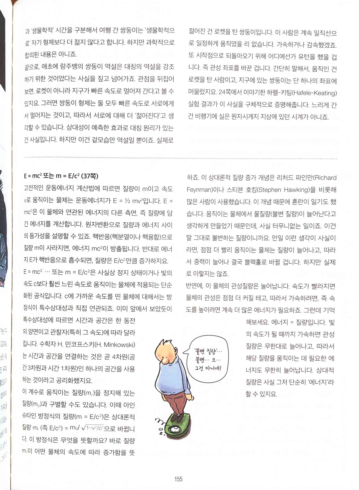

> E = mc² 또는 m = E/c²
>
> E = mc²은 이 물체와 연관된 에너지의 다른 측면, 즉 질량에 담긴 에너지를 계산
>
> 특수상대성에 따르면 시간과 공간은 한 동전의 양면이고 관찰자(특히 그 속도)에 따라 달라집니다. 수학자 H. 민코프스키(H. Minkowski)는 시간과 공간을 연결하는 것은 곧 4차원(공간 3차원과 시간 1차원)인 하나의 공간을 사용하는 것이라고 공리화했지요.
>
> 물질량(불변 질량)이 늘어난다고 생각하게 만들었기 때문인데,... 만일 이런 생각이 사실이라면, 점점 더 빨리 움직이는 물체는 질량이 늘어나고, 따라서 중력이 늘어나 결국 블랙홀로 바뀔 겁니다. 하지만 실제로 이렇지는 않죠.
>
> 반면에, 이 물체의 관성질량은 늘어납니다. 속도가 빨라지면 물체의 관성은 점점 더 커질 테고, 따라서 가속하려면, 즉 속도를 높이려면 계속 더 많은 에너지가 필요하죠. 그런데 기억해보세요. 에너지 = 질량입니다. 빛의 속도가 될 때까지 가속하면 관성질량은 무한대로 늘어나고, 따라서 해당 질량을 움직이는 데 필요한 에너지도 무한히 늘어납니다. 상대적 질량은 사실 그저 단순히 '에너지'라 할 수 있지요.

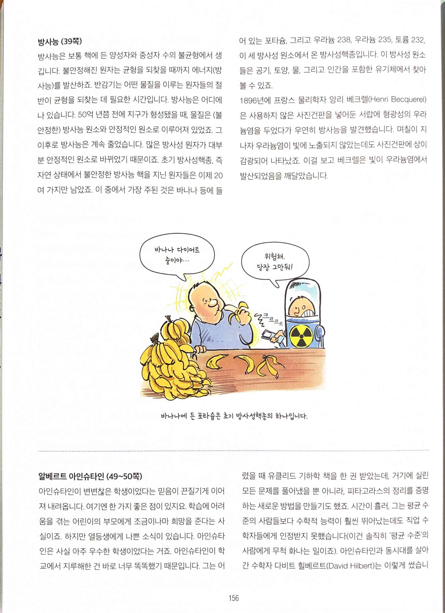

> 방사능
>
> 방사능은 보통 핵에 든 양성자와 중성자 수의 불균형에서 생깁니다. 불안정해진 원자는 균형을 되찾을 때까지 에너지(방사능)를 발산하죠. 반감기는 어떤 물질을 이루는 원자들의 절반이 균형을 되찾는 데 필요한 시간입니다.

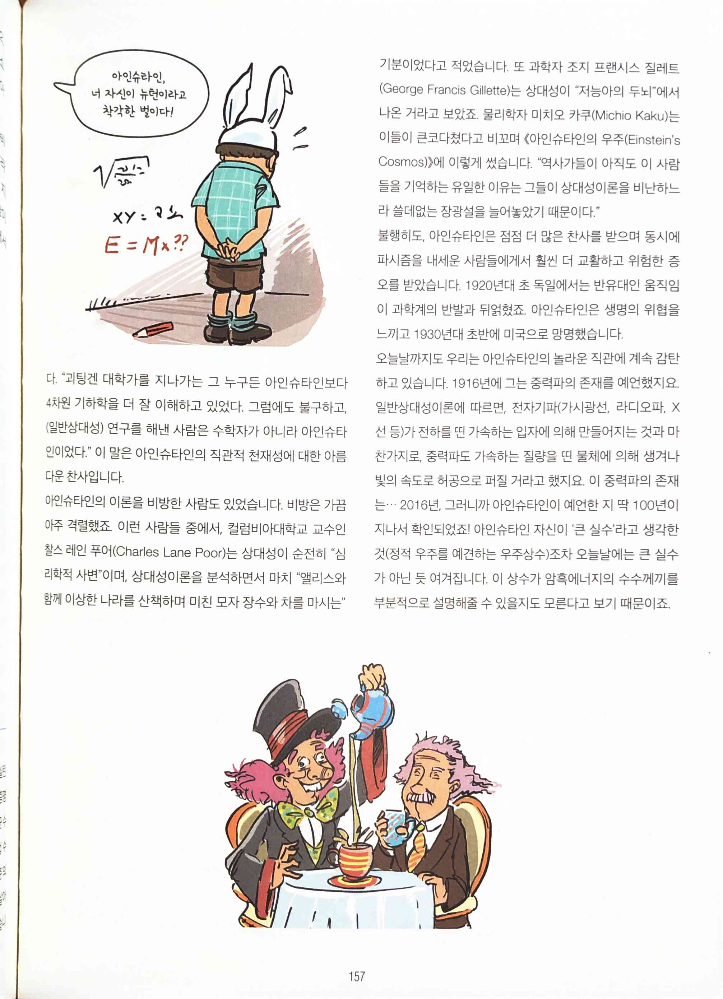

> 알베르트 아인슈타인

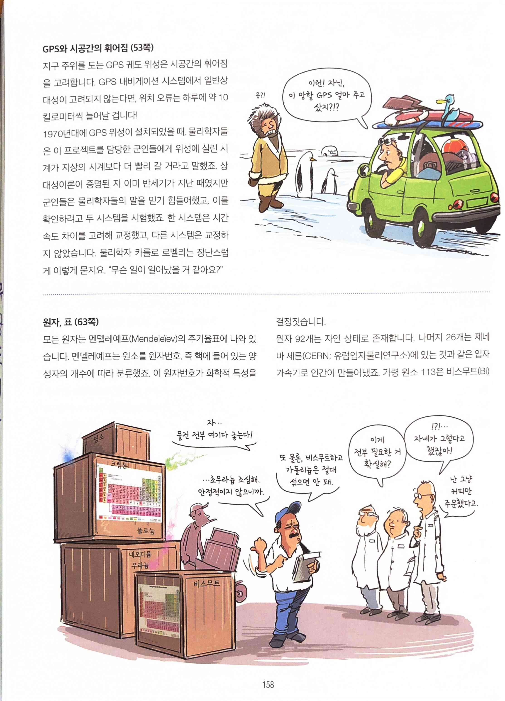

> GPS와 시공간의 휘어짐
>
> 지구 주위를 도는 GPS 궤도 위성은 시공간의 휘어짐을 고려
>
> 1970년대에 GPS 위성이 설치되었을 때, 물리학자들은 이 프로젝트를 담당한 군인들에게 위성에 실린 시계가 지상의 시계보다 더 빨리 갈 거라고 말했죠. 상대성이론이 증명된 지 이미 반세기가 지난 때였지만 군인들은 물리학자들의 말을 믿기 힘들어했고, 이를 확인하려고 두 시스템을 시험했죠.

> 원자, 표
>
> 모든 원자는 멘델레예프(Mendeleiev)의 주기율표에 나와 있습니다. 멘델레예프는 원소를 원자번호, 즉 핵에 들어 있는 양성자의 개수에 따라 분류했죠. 이 원자번호가 화학적 특성을 결정짓습니다.
>
> 원자 92개는 자연 상태로 존재합니다. 나머지 26개는 제네바 세른(CERN; 유럽입자물리연구소)에 있는 것과 같은 입자가속기로 인간이 만들어냈죠.

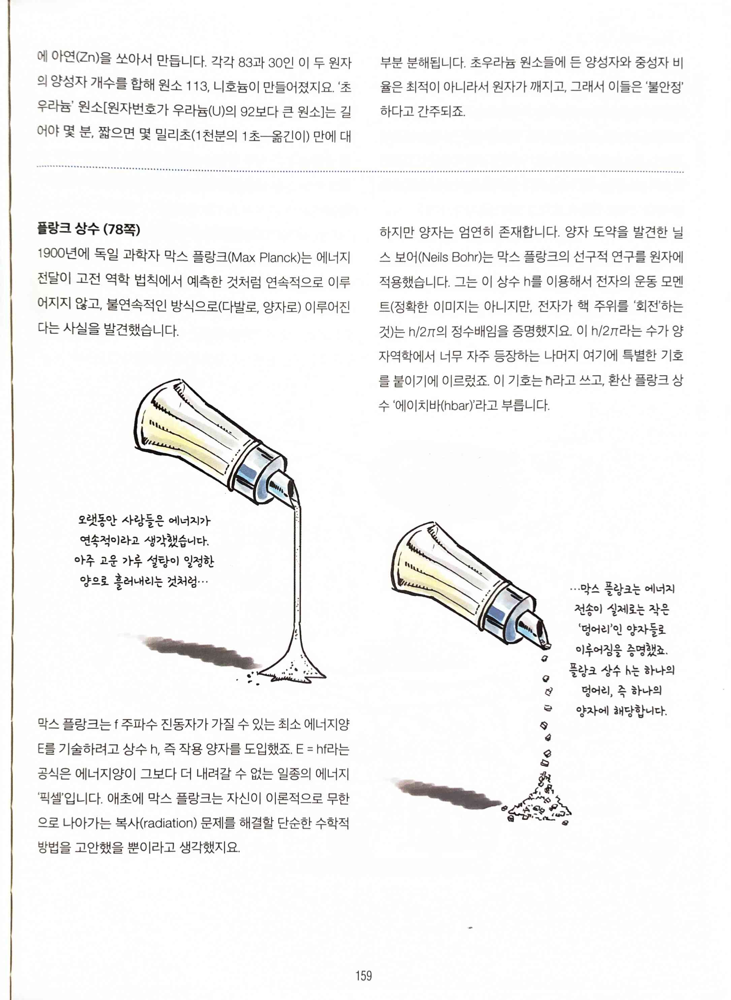

> 플랑크 상수
>
> 1900년에 독일 과학자 막스 플랑크(Max Planck)는 에너지 전달이 고전 역학 법칙에서 예측한 것처럼 연속적으로 이루어지지 않고, 불연속적인 방식으로(다발로, 양자로) 이루어진다는 사실을 발견했습니다.

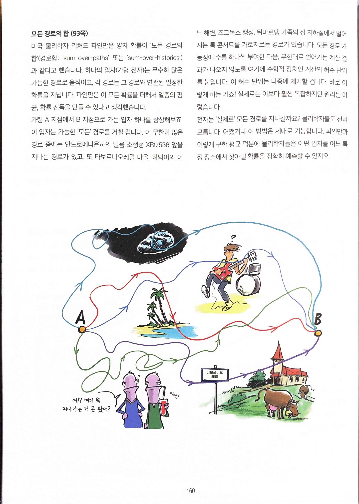

> 모든 경로의 합
>
> 미국 물리학자 리처드 파인만은 양자 확률이 '모든 경로의 합'(경로합: 'sum-over-paths' 또는 'sum-over-histories')과 같다고 했습니다. 하나의 입자(가령 전자)는 무수히 많은 가능한 경로로 움직이고, 각 경로는 그 경로와 연관된 일정한 확률을 지닙니다. 파인만은 이 모든 확률을 더해서 일종의 평균, 확률 진폭을 만들 수 있다고 생각했습니다.

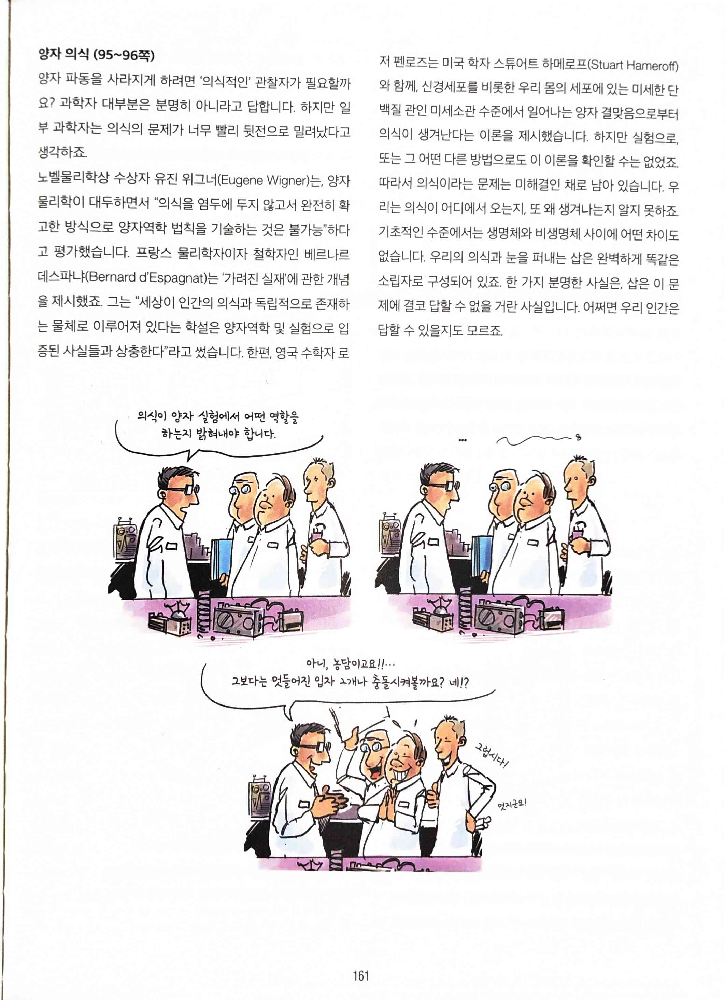

> 양자 의식
>
> 노벨물리학상 수상자 유진 위그너(Eugene Wigner)는 양자물리학이 대두하면서 "의식을 염두에 두지 않고서 완전히 확고한 방식으로 양자역학 법칙을 기술하는 것은 불가능"하다고 평가했습니다. 프랑스 물리학자이자 철학자인 베르나르 데스파냐(Bernard d'Espagnat)는 '가려진 실재'에 관한 개념을 제시했죠. 그는 "세상이 인간의 의식과 독립적으로 존재하는 물체로 이루어져 있다는 학설은 양자역학 및 실험으로 입증된 사실들과 상충한다"라고 썼습니다. 한편, 영국 수학자 로저 펜로즈는 미국 학자 스튜어트 하메로프(Stuart Hameroff)와 함께, 신경세포를 비롯한 우리 몸의 세포에 있는 미세한 단백질 관인 미세소관 수준에서 일어나는 양자 결맞음으로부터 의식이 생겨난다는 이론을 제시했습니다. 하지만 실험으로, 또는 그 어떤 다른 방법으로도 이 이론을 확인할 수는 없었죠. 따라서 의식이라는 문제는 미해결인 채로 남아 있습니다. 우리는 의식이 어디에서 오는지, 또 왜 생겨나는지 알지 못하죠. 기초적인 수준에서는 생명체와 비생명체 사이에 어떤 차이도 없습니다.

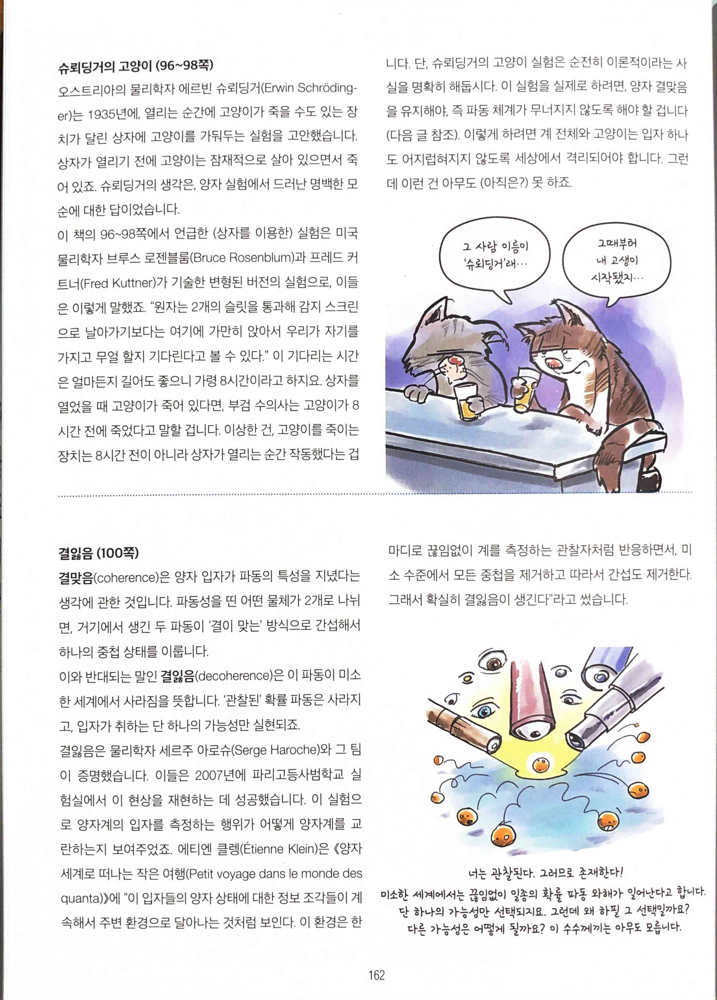

> 슈뢰딩거의 고양이
>
> 이 실험을 실제로 하려면, 양자 결맞음을 유지해야, 즉 파동 체계가 무너지지 않도록 해야 할 겁니다(다음 글 참조). 이렇게 하려면 계 전체와 고양이는 입자 하나도 어지럽혀지지 않도록 세상에서 격리되어야 합니다. 그런데 이런 건 아무도 (아직은?) 못 하죠.

> 결잃음
>
> 결맞음(coherence)은 양자 입자가 파동의 특성을 지녔다는 생각에 관한 것입니다. 파동성을 띤 어떤 물체가 2개로 나뉘면, 거기에서 생긴 두 파동이 '결이 맞는' 방식으로 간섭해서 하나의 중첩 상태를 이룹니다.
>
> 이와 반대되는 말인 결잃음(decoherence)은 이 파동이 미소한 세계에서 사라짐을 뜻합니다. '관찰된' 확률 파동은 사라지고, 입자가 취하는 단 하나의 가능성만 실현되죠.

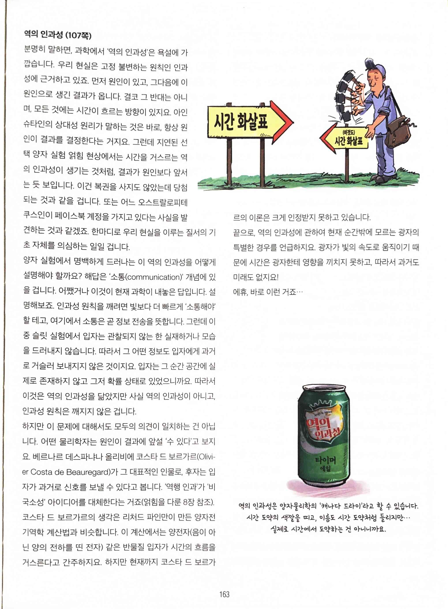

> 역의 인과성
>
> 분명히 말하면, 과학에서 '역의 인과성'은 욕설에 가깝습니다. 우리 현실은 고정 불변하는 원칙인 인과성에 근거하고 있죠. 먼저 원인이 있고, 그다음에 이 원인으로 생긴 결과가 옵니다. 결코 그 반대는 아니며, 모든 것에는 시간이 흐르는 방향이 있지요. 아인슈타인의 상대성 원리가 말하는 것은 바로, 항상 원인이 결과를 결정한다는 거지요. 그런데 지연된 선택 양자 실험 얽힘 현상에서는 시간을 거스르는 역의 인과성이 생기는 것처럼 결과가 원인보다 앞서는 듯 보입니다... 한마디로 우리 현실을 이루는 질서의 기초 자체를 의심하는 일일 겁니다.
>
> 양자 실험에서 명백하게 드러나는 이 역의 인과성을 어떻게 설명해야 할까요? 해답은 '소통(communication)' 개념에 있을 겁니다. 어쨌거나 이것이 현재 과학이 내놓은 답입니다. 설명해보죠. 인과성 원칙을 깨려면 빛보다 더 빠르게 '소통해야' 할 테고, 여기에서 소통은 곧 정보 전송을 뜻합니다. 그런데 이중 슬릿 실험에서 입자는 관찰되지 않는 한 실재하거나 모습을 드러내지 않습니다. 따라서 그 어떤 정보도 입자에게 과거로 거슬러 보내지지 않은 것이지요. 입자는 그 순간 공간에 실제로 존재하지 않고 그저 확률 상태로 있었으니까요. 따라서 이것은 역의 인과성을 닮았지만 사실 역의 인과성이 아니고, 인과성 원칙은 깨지지 않은 겁니다.

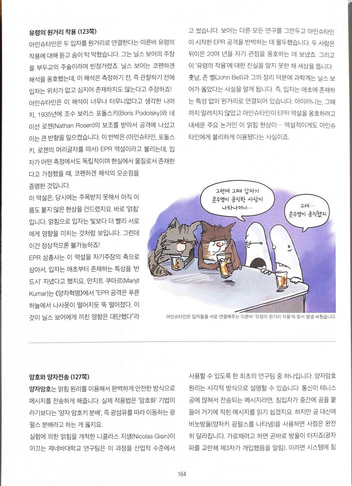

> 유령의 원거리 작용
>
> 훗날, 존 벨(John Bell)과 그의 정리 덕분에 과학계는 닐스 보어가 옳았다는 사실을 알게 됩니다. 즉, 입자는 애초에 존재하는 특성 없이 원거리로 연결되어 있습니다. 아이러니는, 그때까지 알려지지 않았고 아인슈타인이 EPR 역설을 옹호하려고 내세운 주요 논거인 이 얽힘 현상이… 역설적이게도 아인슈타인에게 불리하게 이용됐다는 사실이죠.

> 암호와 양자전송
>
> 양자암호는 얽힘 원리를 이용해서 완벽하게 안전한 방식으로 메시지를 전송하게 해줍니다. 실제 적용법은 '암호화' 기법이라기보다는 '양자암호키 분배', 즉 광섬유를 따라 이동하는 광펄스 분배라고 하는 게 옳지요.
>
> 전송(teleportation) 역시 얽힘 원리를 이용한 것입니다. 양자전송에서는 물체(물질)를 전송하는 게 아니라 오직 양자상태(물리적 상태)만 전송합니다. 니콜라스 지생은 <양자우연성> 에서 "질량 없는 빛 입자인 광자에게 실체는 그 에너지다. 광자의 물리적 상태는 광자의 분극 그리고 광자의 위치 구름과 잠재적인 진동수로 이루어져 있다"라고 말합니다.

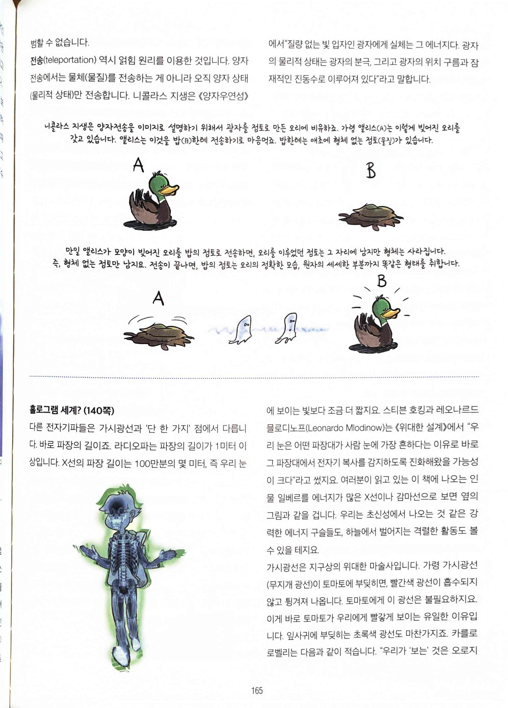

> 홀로그램 세계?
>
> 다른 전자기파들은 가시광선과 '단 한 가지' 점에서 다릅니다. 바로 파장의 길이죠. 라디오파는 파장의 길이가 1미터 이상입니다. X선의 파장 길이는 100만분의 몇 미터, 즉 우리 눈에 보이는 빛보다 조금 더 짧지요. 스티븐 호킹과 레오나르드 믈로디노프(Leonardo Mlodinow)는 <위대한 설계>에서 "우리 눈은 어떤 파장대가 사람 눈에 가장 흔하다는 이유로 바로 그 파장대에서 전자기 복사를 감지하도록 진화해왔을 가능성이 크다"라고 썼지요.
>
> "우리가 '보는' 것은 오로지 전자기장뿐이다. 우리가 무언가를 쳐다볼 때 우리가 직접 감지하는 것은 물체가 아니라, 그 물체와 우리 사이에서 생기는 전자기장의 진동, 물체가 반사하는 빛이다. 거울이나 영화관의 스크린, 홀로그램에서 보는 영상을 생각해보라. 이 세 가지 경우에, 여러분이 물체를 본다고 믿는 그곳에는 물체가 있는게 아니라, 물체가 거기에 있다고 생각하게 만드는 빛만 있는 것이다. 그 효과는 마찬가지다."

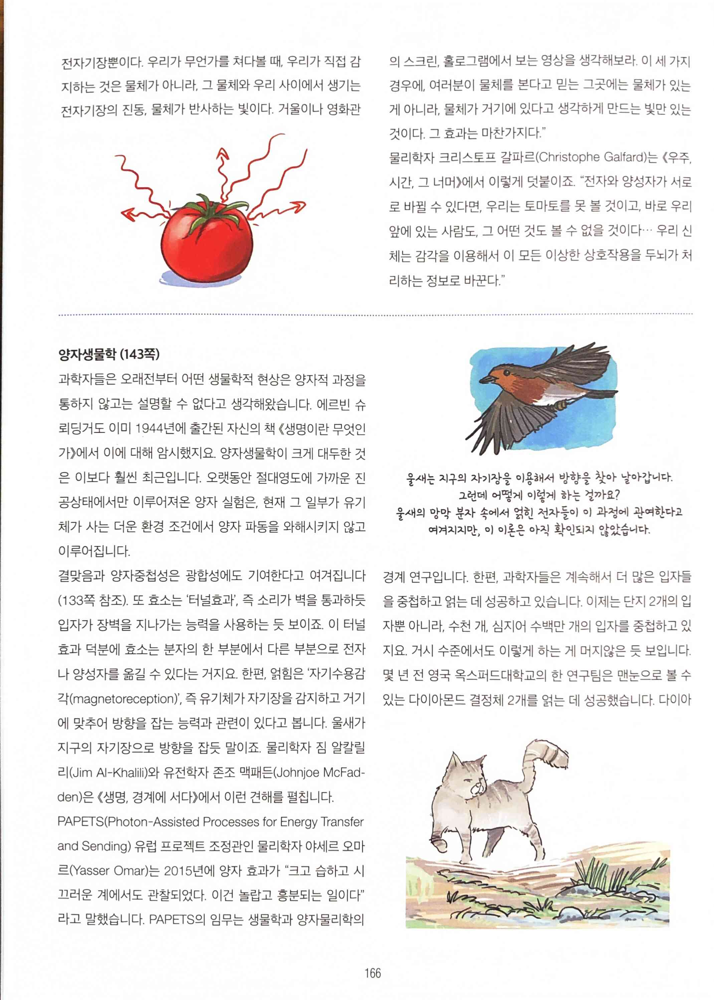

> 양자생물학
>
> 양자생물학이 크게 대두한 것은 이보다 훨씬 최근입니다. 오랫동안 절대영도에 가까운 진공상태에서만 이루어져온 양자 실험은 현재 그 일부가 유기체가 사는 더운 환경 조건에서 양자 파동을 와해시키지 않고 이루어집니다.
>
> 결맞음과 양자중첩성은 광합성에도 기여한다고 여겨집니다(133쪽 참조). 또 효소는 '터널효과', 즉 소리가 벽을 통과하듯 입자가 장벽을 지나가는 능력을 사용하는 듯 보이죠 이 터널 효과 덕분에 효소는 분자의 한 부분에서 다른 부분으로 전자나 양성자를 옮길 수 있다는 거지요. 한편, 얽힘은 자기수용감각(magnetoreception)', 즉 유기체가 자기장을 감지하고 거기에 맞추어 방향을 잡는 능력과 관련이 있다고 봅니다. 울새가 지구의 자기장으로 방향을 잡듯 말이죠. 물리학자 짐 알칼릴리(Jim Al-Khalili)와 유전학자 존조 맥패든(Johnjoe McFadden)은 <생명, 경계에 서다>에서 이런 견해를 펼칩니다.

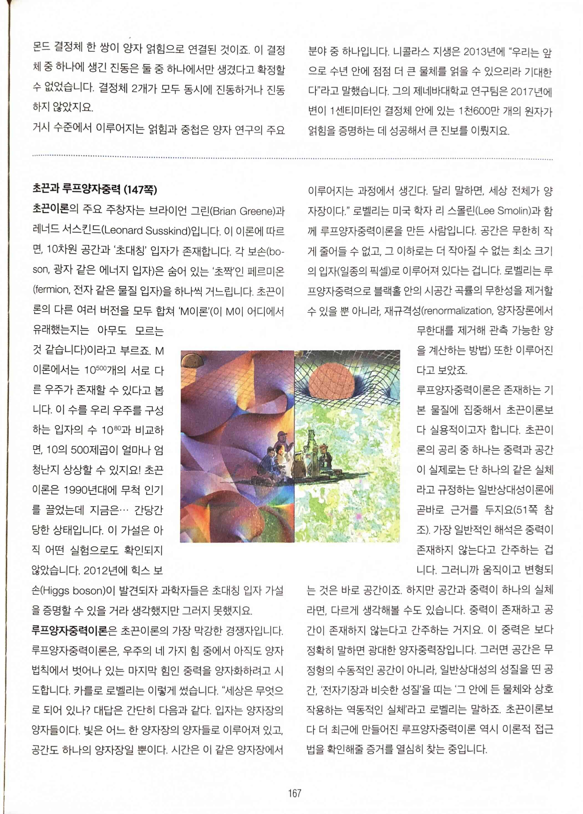

> 초끈과 루프양자중력
>
> 초끈이론의 주요 주창자는 브라이언 그린(Brian Greene)과 레너드 서스킨드(Leonard Susskind)입니다. 이 이론에 따르면, 10차원 공간과 '초대칭' 입자가 존재합니다. 각 보손(boson, 광자 같은 에너지 입자)은 숨어 있는 '초짝인 페르미온(fermion, 전자 같은 물질 입자)을 하나씩 거느립니다. 초끈이론의 다른 여러 버전을 모두 합쳐 'M이론(이 M이 어디에서 유래했는지는 아무도 모르는것 같습니다)이라고 부르죠.
>
> 루프양자중력이론은, 우주의 네 가지 힘 중에서 아직도 양자법칙에서 벗어나 있는 마지막 힘인 중력을 양자화하려고도합니다. 카를로 로벨리는 이렇게 썼습니다. "세상은 무엇로 되어 있나? 대답은 간단히 다음과 같다. 입자는 양자장의 양자들이다. 빛은 어느 한 양자장의 양자들로 이루어져 있고 공간도 하나의 양자장일 뿐이다. 시간은 이 같은 양자장에서 이루어지는 과정에서 생긴다. 달리 말하면, 세상 전체가 양자장이다." 로벨리는 미국 학자 리 스몰린(Lee Smolin)과 함께 루프양자중력이론을 만든 사람입니다. 공간은 무한히 작게 줄어들 수 없고, 그 이하로는 더 작아질 수 없는 최소 크기의 입자(일종의 픽셀)로 이루어져 있다는 겁니다. 로벨리는 루프양자중력으로 블랙홀 안의 시공간 곡률의 무한성을 제거할수 있을 뿐 아니라, 재규격성(renormalization, 양자장론에서 무한대를 제거해 관측 가능한 양을 계산하는 방법) 또한 이루어진다고 보았죠.