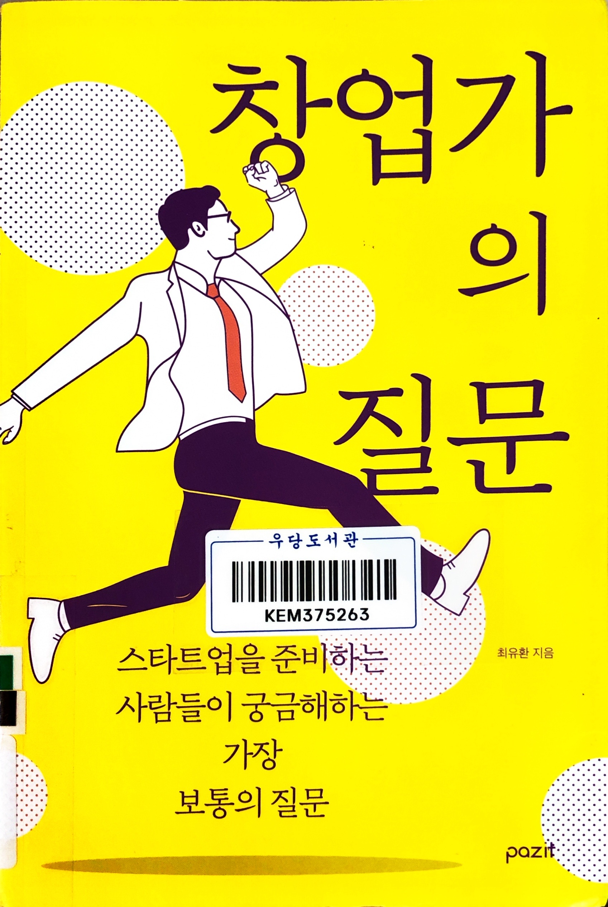
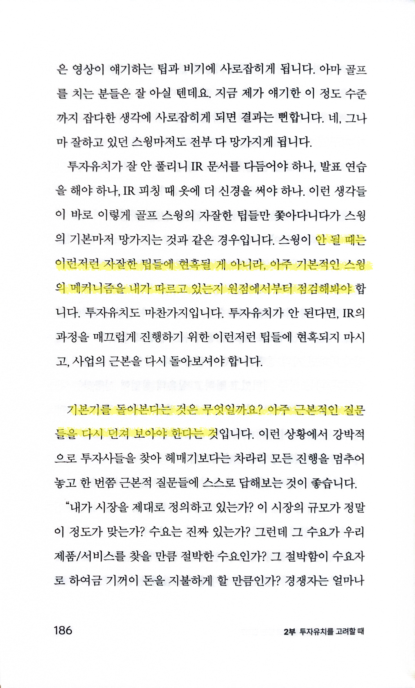
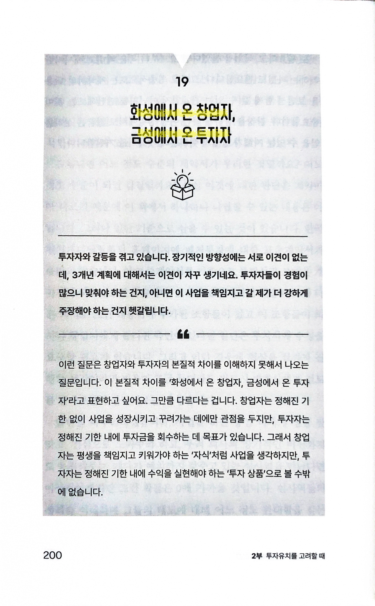
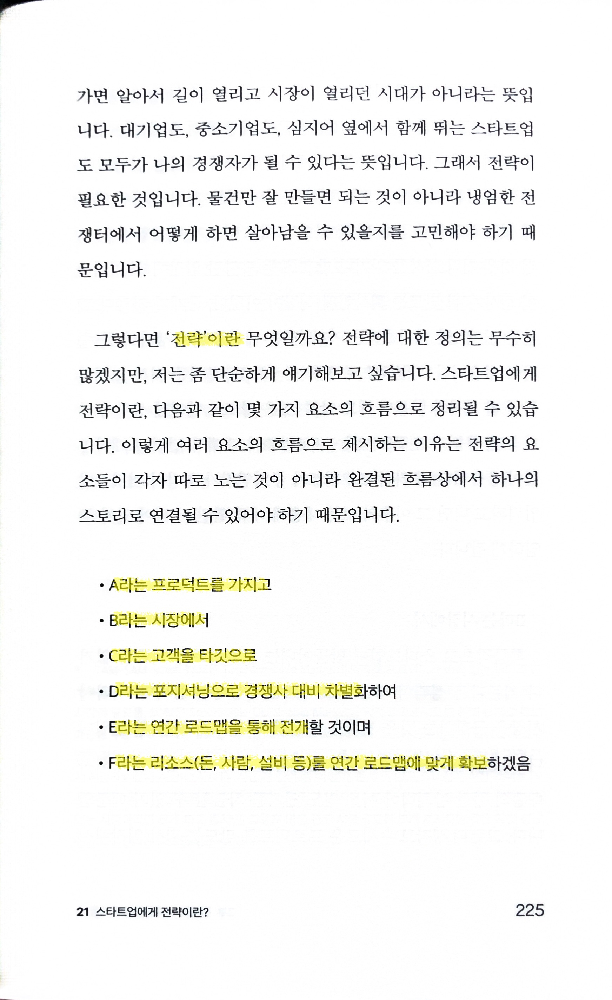
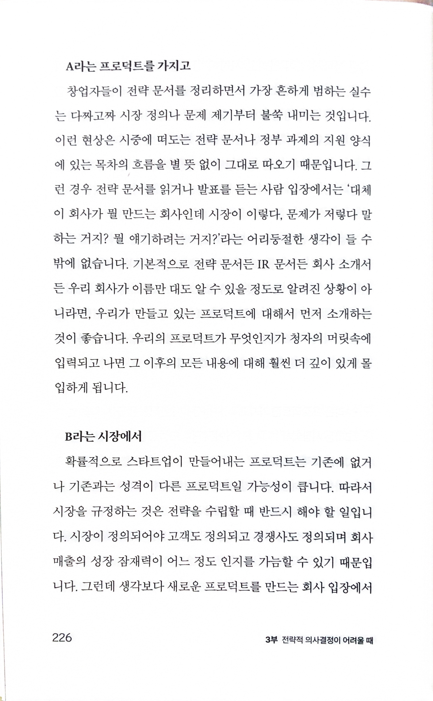
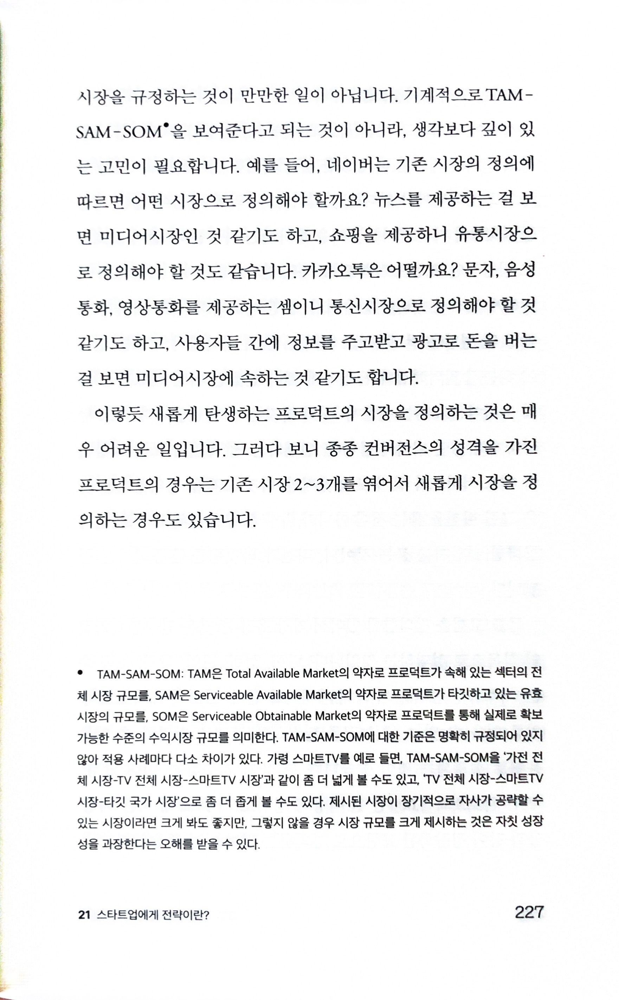
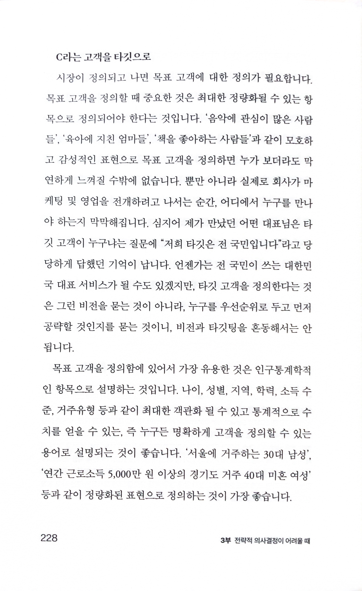
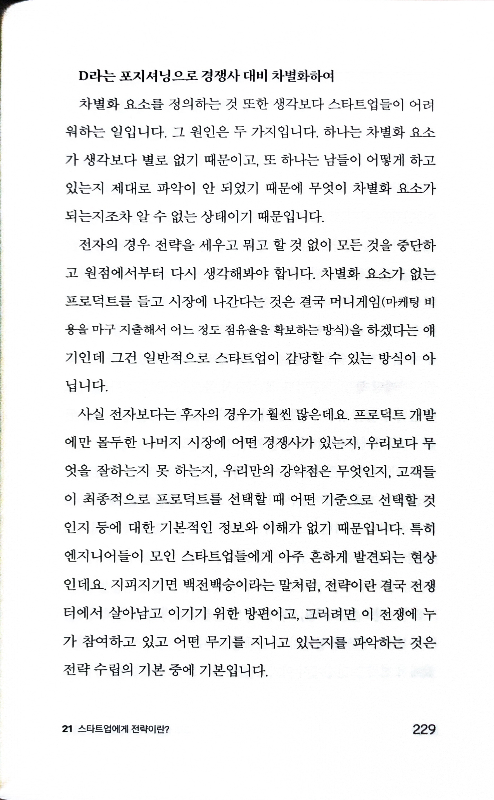
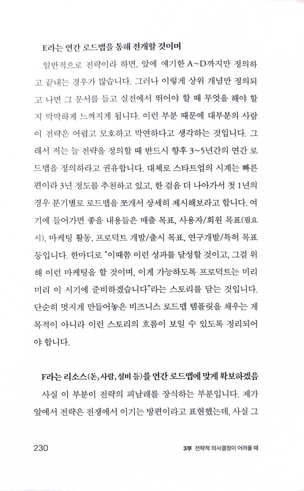
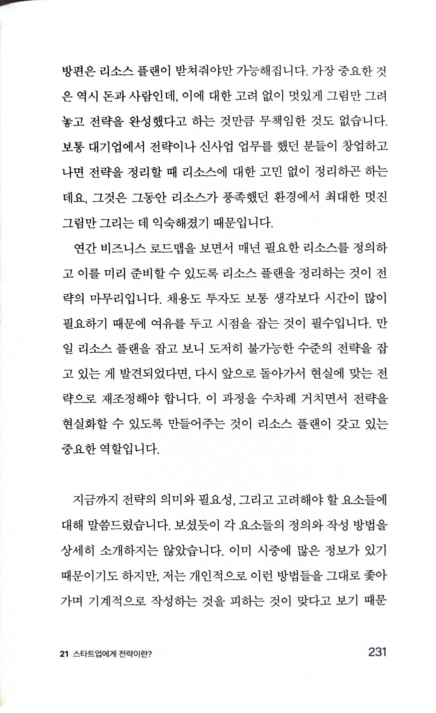

# 창업가의 질문

Tags: startup
Date: October 1, 2024
Score: ★★★★☆

- ★★★★☆ October 1, 2024 창업할 생각은 없지만 manager로 지내고 스타트업에서 CEO들과 일하다보니 창업에 대한 책은 종종 읽는다. 지금껏 읽었던 창업에 대해 알려주는 책들 중에서는 가장 좋다는 생각이 든다. Q&A 형식으로 실제 있을법한 상황을 통해 필요한 부분을 알려주며, 때로는 이렇게 자세하다 싶을 정도로(예를 들면 투자사를 확인하기 위해 벤처투자협회 홈페이지를 통해 확인할 수 있다는 절차를 알려주는 부분) 실질적인 부분까지 기록했다. 창업을 꿈꾸는 주변 사람이 있다면 꼭 추천하고 싶다.
    - 우당 문325.21-최67ㅊ
    - https://www.youtube.com/watch?v=eIF69CTMO54&ab_channel=박재호
- pp185~186
    - p185 어려움을 겪을수록, 기본기를 다시 점검해봐야
        
        
        
    - p186 ~가 안될 때는 이런저런 자잘한 팁들에 현혹될 게 아니라, 아주 기본적인 ~의 매커니즘을 내가 따르고 있는지 원점에서부터 점검해봐야… 기본기를 돌아본다는 것은 무엇일까요? 아주 근본적인 질문들을 다시 던져 보아야 한다는 것
        
        
        
        - 어떤 분야에 적용해도 통할 기본적인 원리. 그래서 나이가 들수록 ‘기본’이 중요하단 생각이 든다. 물론 그 ‘기본’이 뭔지 잘 정의하고 제대로 실행하는 건 또 다른 일이긴 하다
- p195 ‘복어의 독을 빼는 지혜’… 복어가 맛있게 요리가 되려면 반드시 독을 빼는 과정이 필요합니다. 복어를 그냥 있는 그대로 먹는다면 그 독 때문에 위험한 상황에 처하거나 사망에 이를 수도 있으니까요
    
    
    
- p200 화성에서 온 창업자, 금성에서 온 투자자
    
    
    
    - 나도 강연에서 사용했던 표현이지만, 정말 어디에나 사용하기 좋은 표현이란 생각이 든다
- pp225~231
    - p225 ‘전략’이란… A라는 프로덕트를 가지고 B라는 시장에서 C라는 고객을 타깃으로 D라는 포지셔닝으로 경쟁사 대비 차별화하여 E라는 연간 로드맵을 통해 전개할 것이며 F라는 리소스(돈, 사람, 설비 등)를 연간 로드맵에 맞게 확보하겠음
        
        
        
        - 전략에 대해 여러가지 정의가 있지만 매우 좋은 설명
    
    
    
    
    
    
    
    
    
    
    
    
