# 심리학이 관우에게 말하다

Tags: psychology
Date: January 20, 2024
Score: ★★★☆☆

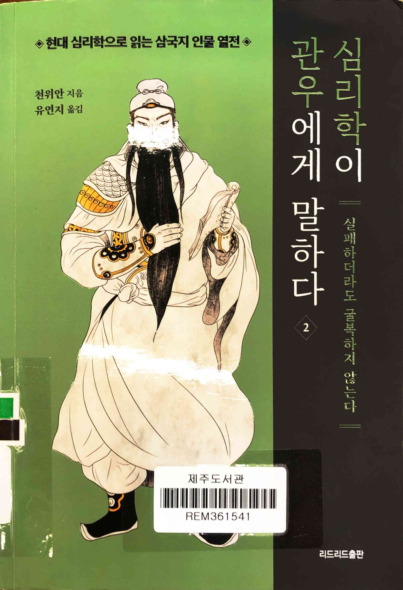

- ★★★☆☆ January 20, 2024

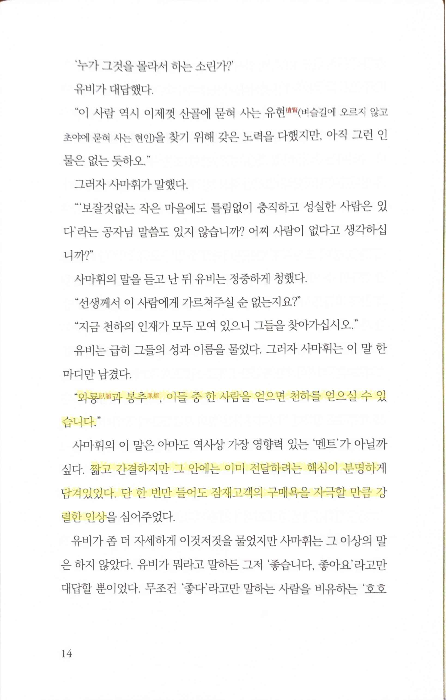

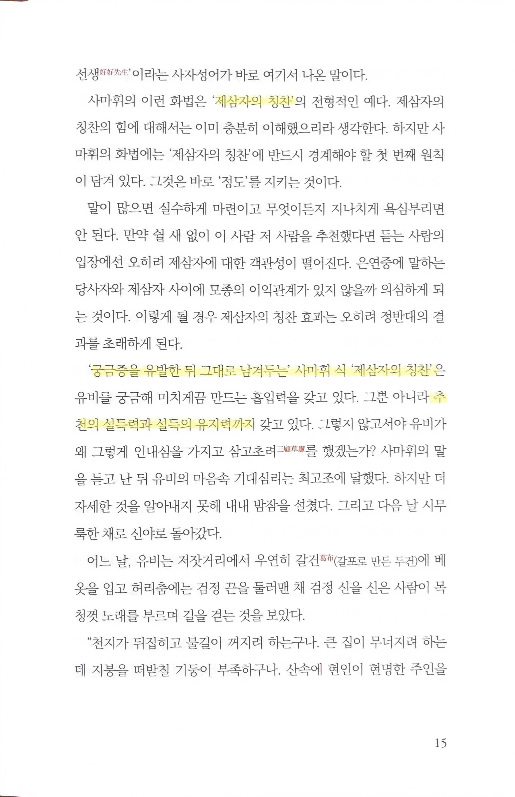

- pp14~15, 18
    - `와룡과 봉추, 이들 중 한 사람을 얻으면 천하를 얻으실 수 있습니다.`
        - `짧고 간결하지만 그 안에는 이미 전달하려는 핵심이 분명하게 담겨있었다. 단 한 번만 들어도 잠재 고객의 구매욕을 자극할 만큼 강렬한 인상`
    - `제삼자의 칭찬`
        - `궁금증을 유발한 뒤 그대로 남겨두는 사마휘 식 ‘제삼자의 칭찬’은… 추천의 설득력과 설득의 유지력까지…`
        - [윈저효과](https://kmoneysister.com/entry/%EC%9C%88%EC%A0%80-%ED%9A%A8%EA%B3%BC%EB%9E%80-%EC%8B%A0%EB%A2%B0%EB%A5%BC-%EC%96%BB%EA%B8%B0-%EC%9C%84%ED%95%9C-%EC%8B%AC%EB%A6%AC%ED%85%8C%ED%81%AC%EB%8B%89)
    - `제삼자의 칭찬이 왜 효과가 있을까?`
        - `제삼자의 의견이 객관적이고 공정하며 어떤 이익과도 결부되어 있지 않다고 생각하기 때문`

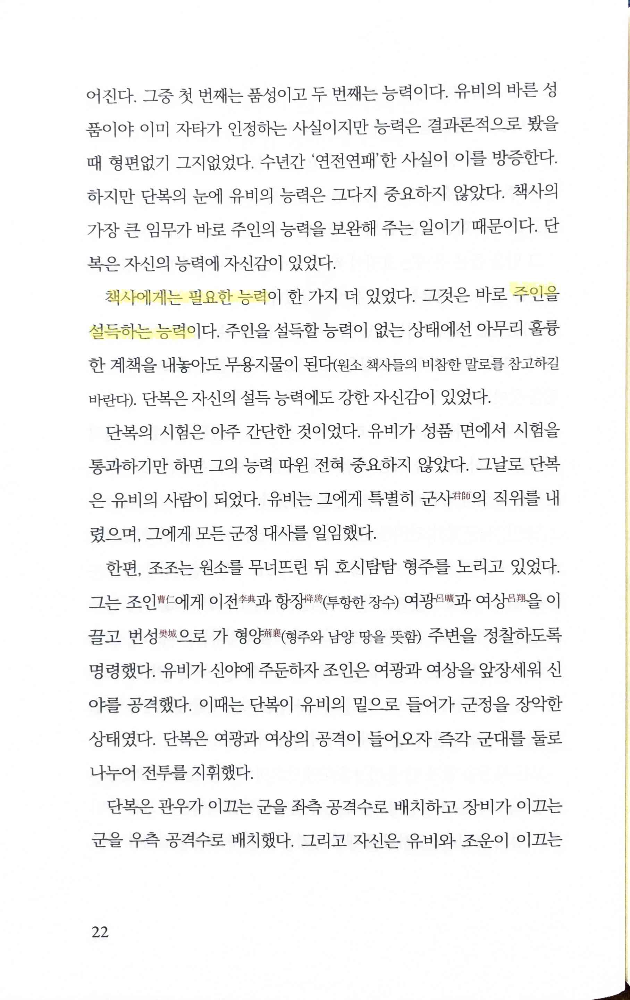

- `책사에게는 필요한 능력… 주인을 설득하는 능력`
    - 그 전에 바른 성품을 확인해야 한다고 하는데, 이건 어떻게 확인할 수 있을까?

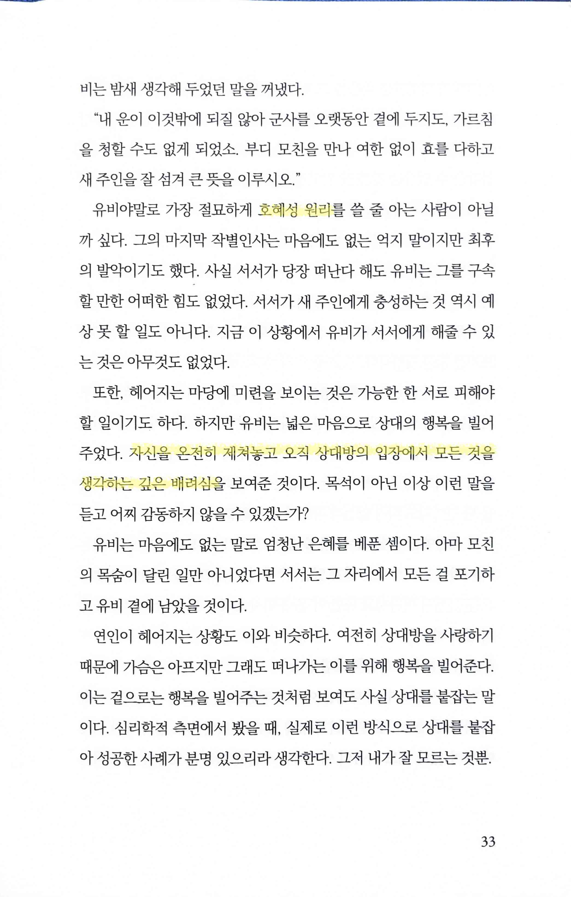

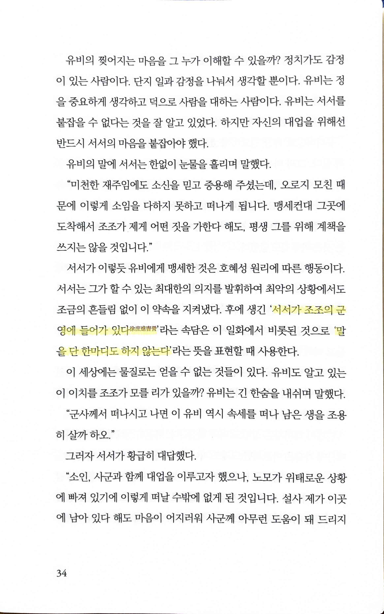

- pp33~34
    - `호혜성 원리`
        - `자신을 온전히 제쳐놓고 오직 상대방의 입장에서 모든 것을 생각하는 깊은 배려심`
    - `서서가 조조의 군영에 들어가 있다`
        - `‘말을 단 한마디도 하지 않는다’라는 뜻`

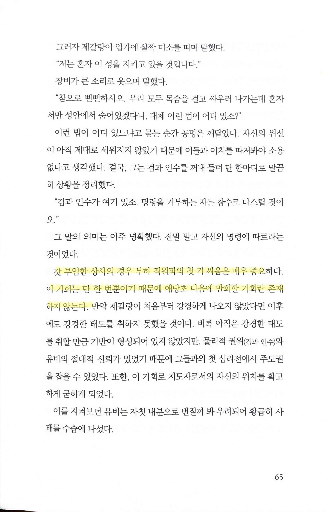

- `갓 부임한 상사의 경우 부하 직원과의 첫 기 싸움은 매우 중요… 이 기회는 단 한 번뿐이기 때문에 애당초 다음에 만회할 기회란 존재하지 않는다`
    - 최근 내가 겪는 어려움(어떤 제도, 규칙을 만들고 전파해서 모두에게 적용하는 게 잘 안 되는) 은 이걸 소홀히 했던 걸까? 이전에도 간과한 건 아니지만 이걸 그렇게까지 중요하게 생각하지 않았는데 이전에 이 부분에 문제가 없었던 건 운이 좋았던 걸까?

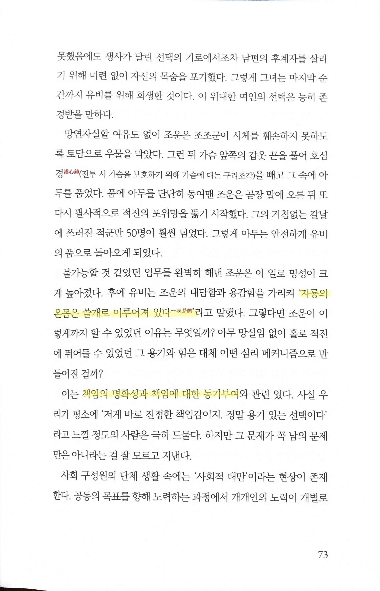

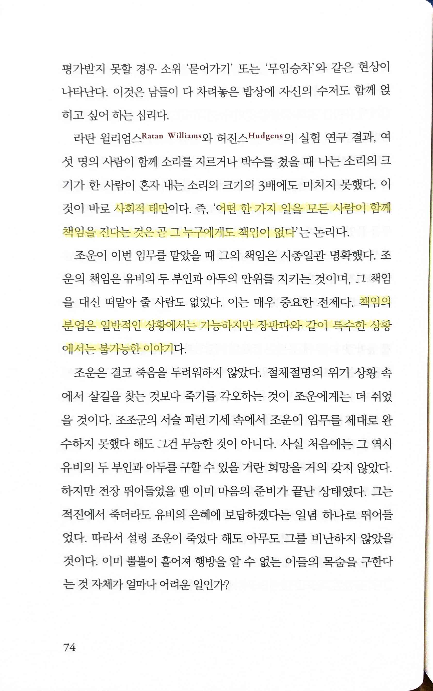

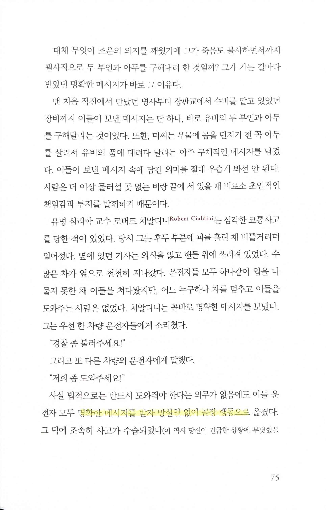

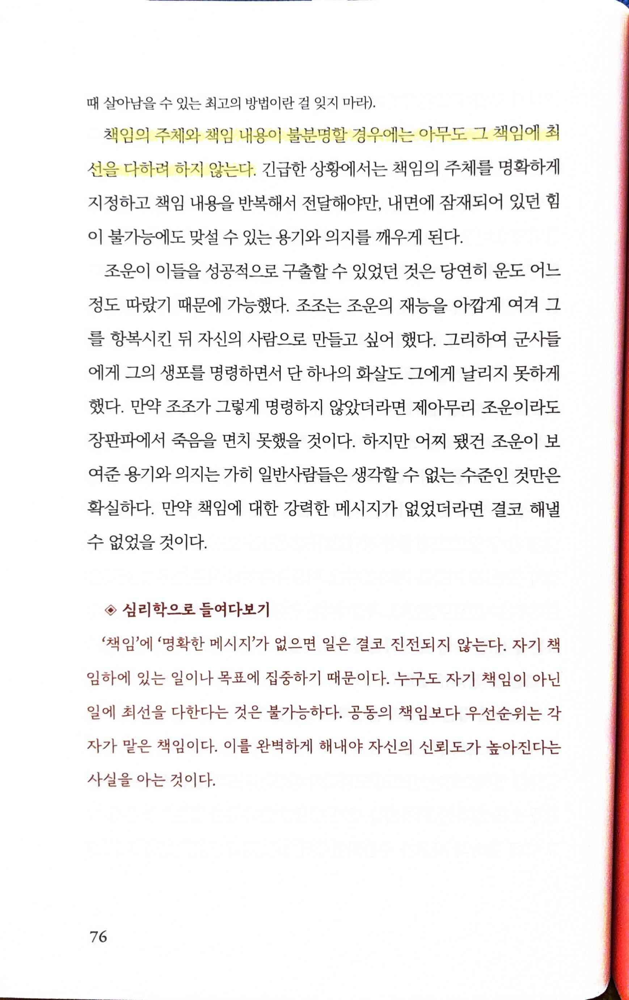

- pp73~76
    - `자룡의 온몸은 쓸개로 이루어져 있다`
        - `책임의 명확성과 책임에 대한 동기부여`
    - `사회적 태만… ‘어떤 한 가지 일을 모든 사람이 함께 책임을 진다는 것은 그 누구에게도 책임이 없다’`
        - `책임의 분업은 일반적인 상황에서는 가능하지만 장판파와 같이 특수한 상황에서는 불가능한 이야기`
    - `명확한 메시지를 받자 망설임 없이 곧장 행동으로`
    - `책임의 주체와 책임 내용이 불분명한 경우에는 아무도 그 책임에 최선을 다하려 하지 않는다.`
        - 현재 infra에서 (2년 전 재직하던 사람이 설치하고 작년 퇴사하면서) kafka 담당자가 없는 상황과 유사. 인수 인계가 제대로 이뤄지지 않은 문제도 있지만 결국은 나 혹은 회사 전체에서 이 부분을 간과했다고 밖에 볼 수 없는 상황

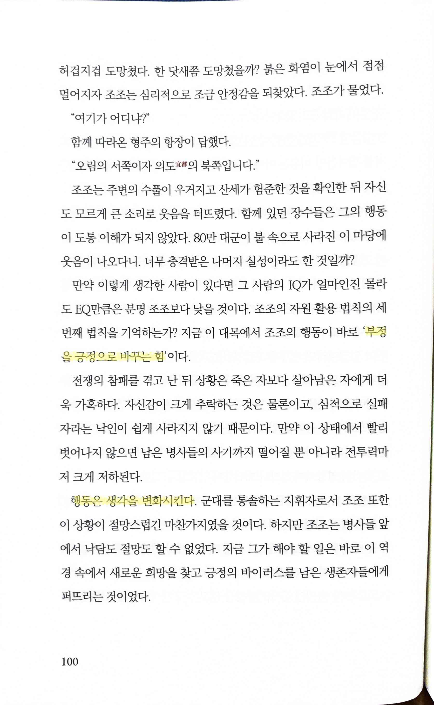

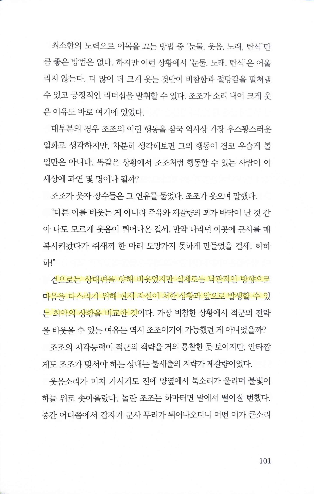

- pp100~101
    - `부정을 긍정으로 바꾸는 힘`
        - `행동은 생각을 변화시킨다.`
    - `겉으로는 상대편을 향해 비웃었지만 실제로는 낙관적인 방향으로 마음을 다스리기 위해 현재 자신이 처한 상황과 앞으로 발생할 수 있는 최악의 상황을 비교한 것`

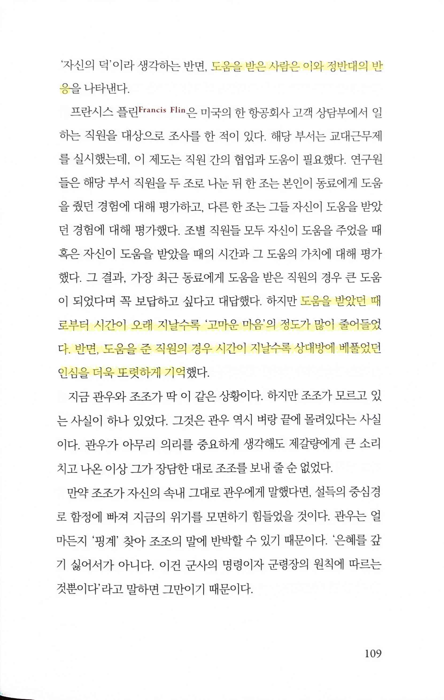

- `도움을 받은 사람은 이와 정반대의 반응`
    - `도움을 받았던 때로부터 시간이 오래 지날수록 ‘고마운 마음’의 정도가 많이 줄어들었다. 반면, 도움을 준 직원의 경우 시간이 지날수록 상대방에 베풀었던 인심을 더욱 또렷하게 기억`
    - 생각해보면 나 역시 그렇다. 내가 도와줬던 부분은 잘 기억하는데, 내가 도움을 받은 건 평소에는 잘 생각하지 않았다.

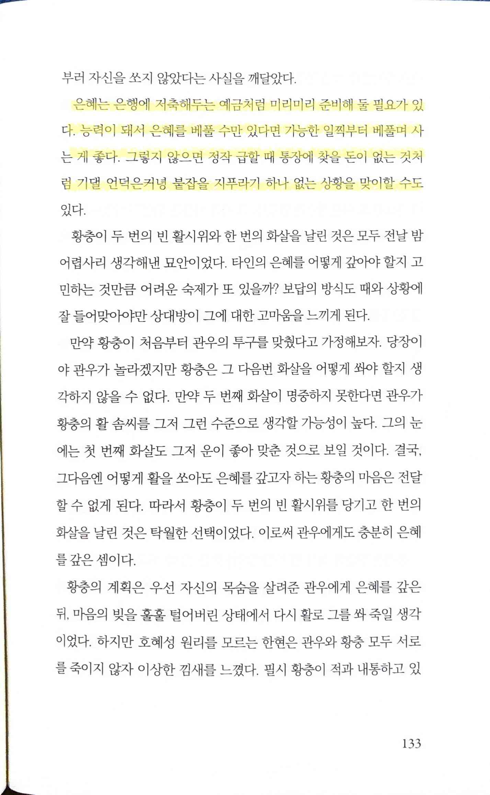

- `은혜는 은행에 저축해두는 예금처럼 미리미리 준비해 둘 필요가 있다. 능력이 돼서 은혜를 베풀 수만 있다면 가능한 일찍부터 베풀며 사는 게 좋다. 그렇지 않으면 정작 급할 때 통장에 찾을 돈이 없는 것처럼 기댈 언덕은커녕 붙잡을 지푸라기 하나 없는 상황을 맞이할 수도 있다.`
    - 모르는 건 아니지만 잊고 살기도 하고, 또 이 비유가 딱 들어맞기도 해서 기록. technical debt을 설명할 때 financial debt을 가지고 하는 것처럼 일반적인 상황을 비유로 설명하는 건 언제나 쉬운, 좋은 설명인 듯

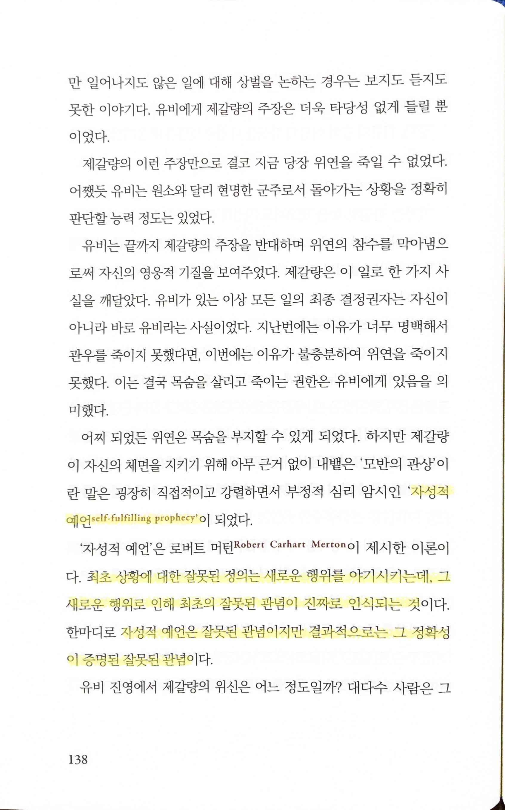

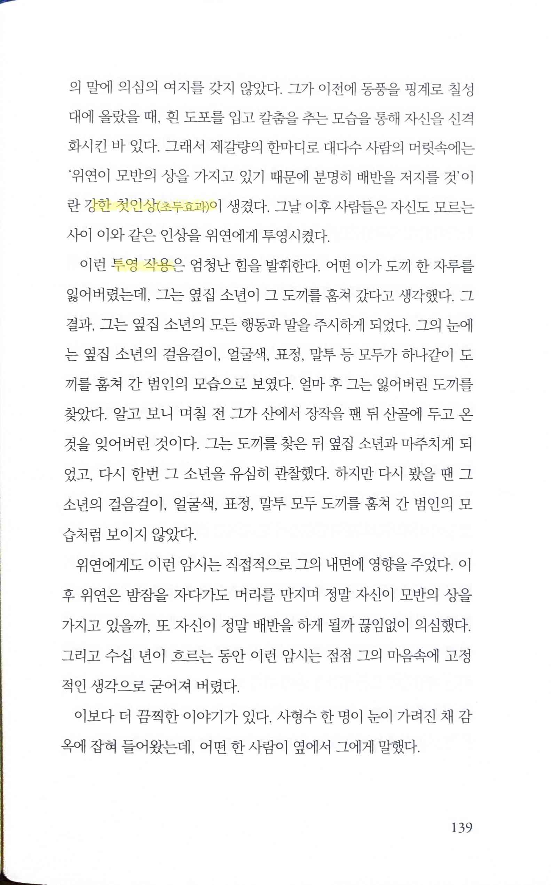

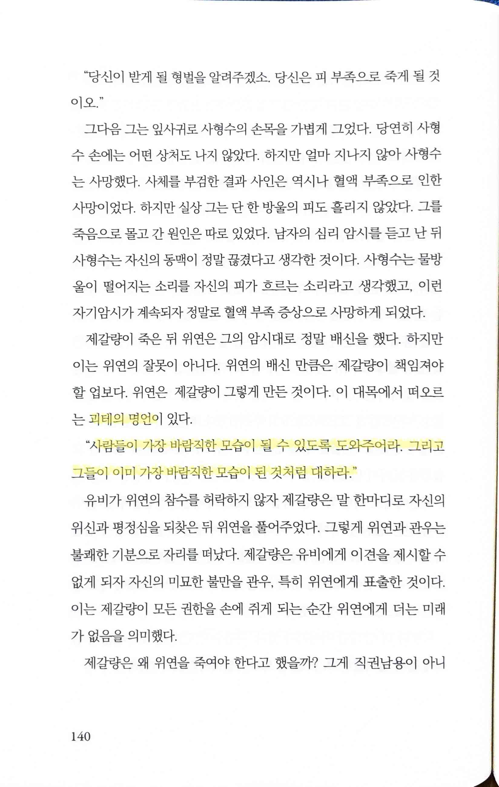

- pp138~140
    - `자성적 예언 self-fulfilling prophecy`
        - `최초 상황에 대한 잘못된 정의는 새로운 행위를 야기시키는데, 그 새로운 행위로 인해 최초의 잘못된 관념이 진짜로 인식되는 것… 자성적 예언은 잘못된 관념이지미나 결과적으로는 그 정확성이 증명된 잘못된 관념`
        - `강한 첫인상(초두효과)`
        - `투영 작용`
    - `괴테의 명언`
        - `“사람들이 가장 바람직한 모습이 될 수 있도록 도와주어라. 그리고 그들이 이미 가장 바람직한 모습이 된 것처럼 대하라”`
        - 계속해서 유사한 bug를 1~2주마다 만들어내는 개발자를 어떻게 대해야 할까? (그로 인해 QA 시간이 계속 지연되고 prod 배포도 실패하는 경우도 생기고 있지만) bug를 하나도 만들어내지 않는 좋은 개발자처럼 대해야 할까?

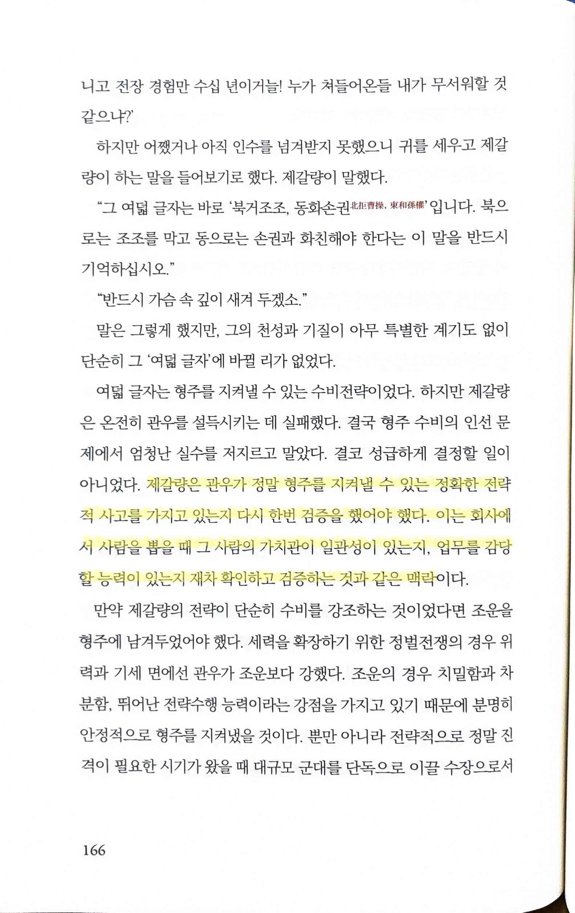

- `제갈량은 관우가 정말 형주를 지켜낼 수 있는 정확한 전략적 사고를 가지고 있는지 다시 한번 검증을 했어야 했다. 이는 회사에서 사람을 뽑을 때 그 사람의 가치관이 일관성이 있는지, 업무를 감당할 능력이 있는지 재차 확인하고 검증하는 것과 같은 맥락`

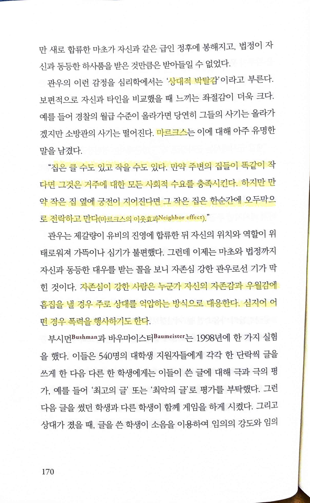

- p170
    - `상대적 박탈감`
        - `마르크스`
            - `“집은 클 수도 있고 작을 수도 있다. 만약 주변의 집들이 똑같이 작다면 그것은 거주에 대한 모든 사회적 수요를 충족시킨다. 하지만 만약 작은 집 옆에 궁전이 지어진다면 그 작은 집은 한순간에 오두막으로 전락하고 만다(마르크스의 이웃효과 Neighbor effect)`
    - `자존심이 강한 사람은 누군가 자신의 자존감과 우월감에 흠집을 낼 경우 주로 상대를 억압하는 방식으로 대응한다. 심지어 어떤 경우 폭력을 행사하기도 한다.`

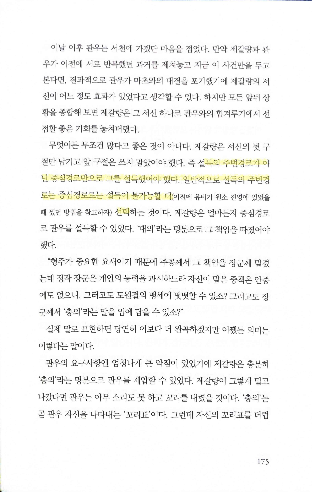

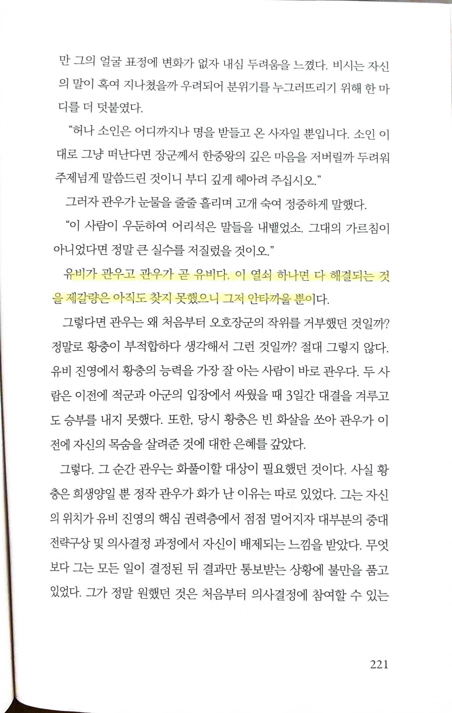

- p175
    - `설득의 주변경로가 아닌 중심경로만으로 그를 설득했어야 했다. 일반적으로 설득의 주변경로는 중심경로로는 설득이 불가능할 때 선택`
- p221
    - `유비가 관우고 관우가 곧 유비다. 이 열쇠 하나면 다 해결되는 것을 제갈량은 아직도 찾지 못했으니 그저 안타까울 뿐이다.`

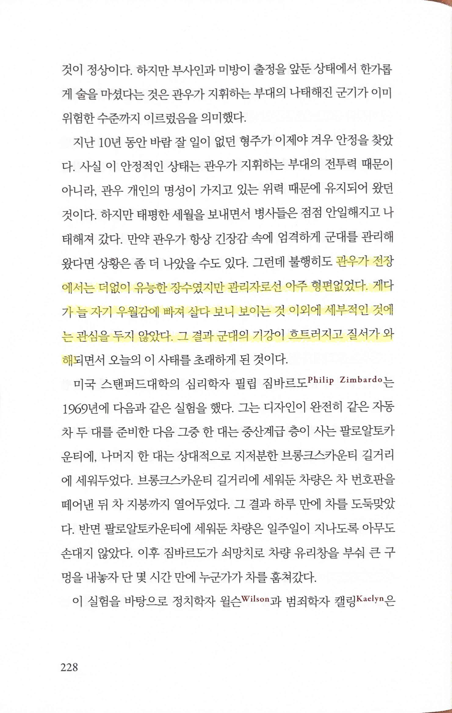

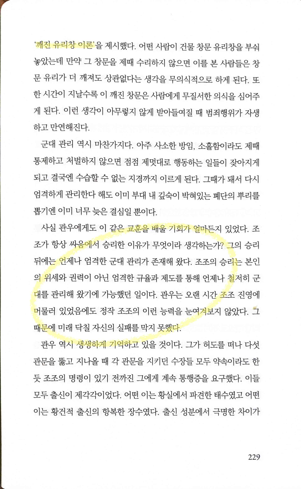

- pp228~229
    - `관우가 전장에서는 더없이 유능한 장수였지만 관리자로선 아주 형편없었다. 게다가 늘 자기 우월감에 빠져 살다 보니 보이는 것 이외에 세부적인 것에는 관심을 두지 않았다. 그 결과 군대의 기강이 흐트러지고 질서가 와해`
        - 마치 이건 새로운 product/project에만 관심을 두고 operation은 신경쓰지 않는 개발자와 비슷한 걸까?
    - `깨진 유리창 이론`
        - 엄격한 규율과 제도를 통해 철저하게 군대를 관리했던 조조의 예를 보며 위와 마찬가지로 operation 능력, operation에 대한 관심의 차이가 느껴진다

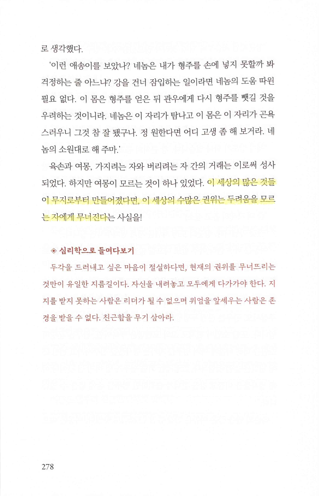

- `이 세상의 많은 것들이 무지로부터 만들어졌다면, 이 세상의 수많은 권위는 두려움을 모르는 자에게 무너진다`
    - 이 시리즈가 재미있기는 하지만, 한 가지 마음에 걸리는 부분은 모든 인물을 현대적으로, 자신의 이익이나 목표에만 치중하는 식으로 해석하는 경우가 좀 많다는 점이다. 이 일화 자체에는 동의하지만 육손, 여몽이 정말 이런 식으로 자신의 영달만을 위해 행동했을까? 라는 생각을 해보면 좀 의문이 든다

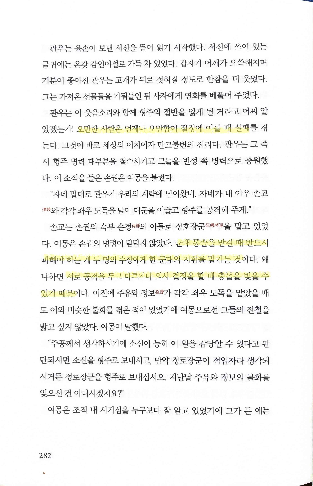

- p282
    - `오만한 사람은 언제나 오만함이 절정에 이를 때 실패`
    - `군대 통솔을 맡길 때 반드시 피해야 하는 게 두 명의 수장에게 한 군대의 지휘를 맡기는 것`
        - `서로 공적을 두고 다투거나 의사 결정을 할 때 충돌을 빚을 수 있기 때문`
        - [사사명의 난](https://namu.wiki/w/%EC%82%AC%EC%82%AC%EB%AA%85%EC%9D%98%20%EB%82%9C)에서 유래한 ‘뛰어난 두명의 명장보다 한명의 평범한 장수가 낫다’는 격언
        - 평시에는 두 명의 집정관이 최고 결정권을 가지지만 위급 상황에서는 한 명의 독재관이 지휘를 하는 과거 로마의 체계만 봐도 복수의 의사 결정권자가 존재하는 system은 최소한 속도를 맞출 수 없다는 점은 분명하다
        - 그런 관점에서 볼 때 matrix 조직은 spotify가 (과하게 말하면) startup 세상에 퍼뜨린 독이라고 할만하다

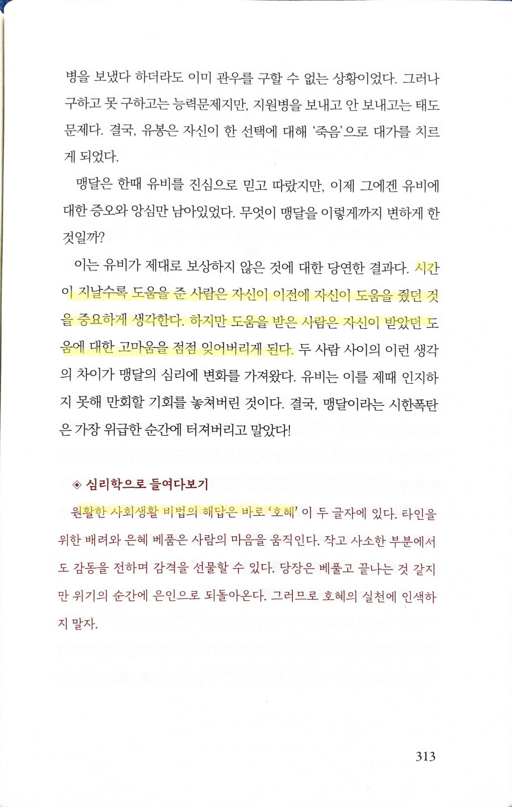

- `시간이 지날수록 도움을 준 사람은 자신이 이전에 자신이 도움을 줬던 것을 중요하게 생각한다. 하지만 도움을 받은 사람은 자신이 받았던 도움에 대한 고마움을 점점 잊어버리게 된다.`
    - `원활한 사회생활 비법의 해답은 바로 ‘호혜`’

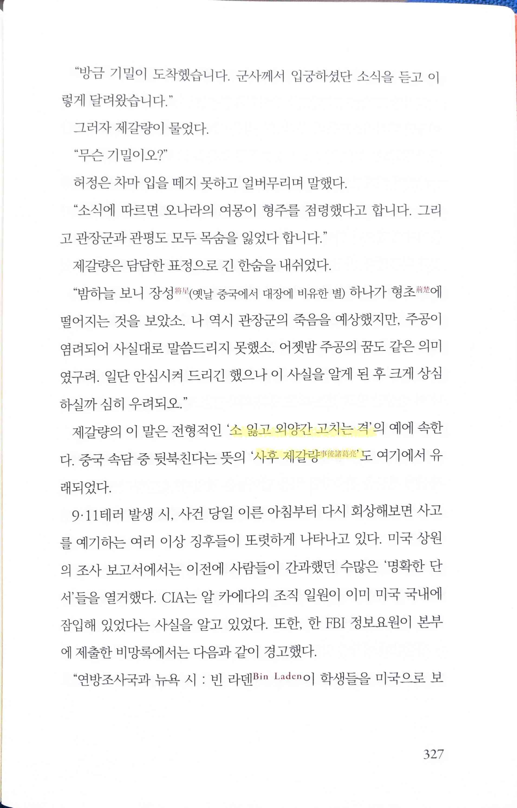

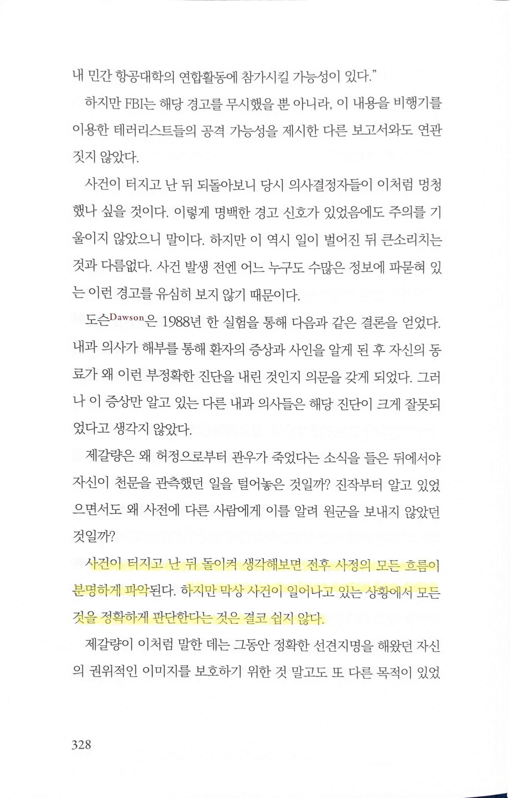

- pp327~328
    - `소 잃고 외양간 고치는 격, 사후 제갈량`
        - `사건이 터지고 난 뒤 돌이켜 생각해보면 전후 사정의 모든 흐름이 분명하게 파악… 하지만 막상 사건이 일어나고 있는 상황에서 모든 것을 정확하게 판단한다는 것은 결코 쉽지 않다.`

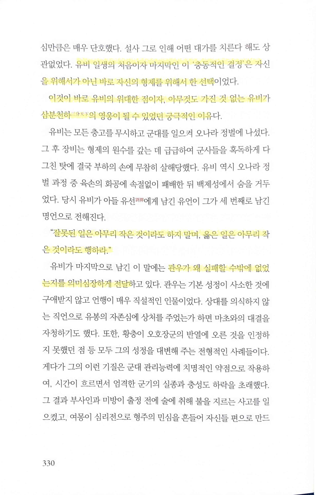

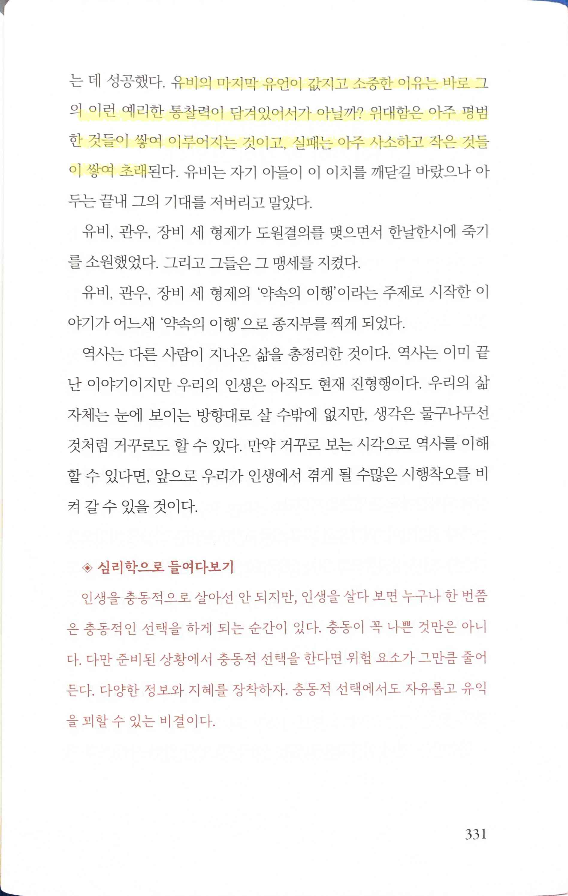

- pp330~331
    - `유비 일생의 처음이자 마지막인 이 ‘충동적인 결정’은 자신을 위해서가 아닌 바로 자신의 형제를 위해서 한 선택`
        - `이것이 바로 유비의 위대한 점이자, 아무것도 가진 것 없는 유비가 삼분천하의 영웅이 될 수 있었던 궁극적인 이유`
    - `‘잘못된 일은 아무리 작은 것이라도 하지 말며, 옳은 일은 아무리 작은 것이라도 행하라’`
        - `관우가 왜 실패할 수밖에 없었는지를 의미심장하게 전달`
        - `유비의 마지막 유언이 값지고 소중한 이유는 바로 그의 이런 예리한 통찰력이 담겨있어서가 아닐까? 위대함은 아주 평범한 것들이 쌓여 이루어지는 것이고, 실패는 아주 사소하고 작은 것들이 쌓여 초래`
        - 역시 operation의 중요함을 강조할 때 이야기할만한 일화. 모든 걸 철저하게 준비하는 건 시간과 노력의 비용 측면에서 불가능하고 선택하기 거의 불가능한 일이지만, 그럼에도 지속적으로 technical debt을 해소하고, 개선을 위한 business feature와 당장 직접적인 연관이 없어 보이는 일을 하는 건 결국 전체적으로 더 나은 product/service를 만드는 데 필수불가결한 일이란 생각이 든다
