# 이순신의 바다
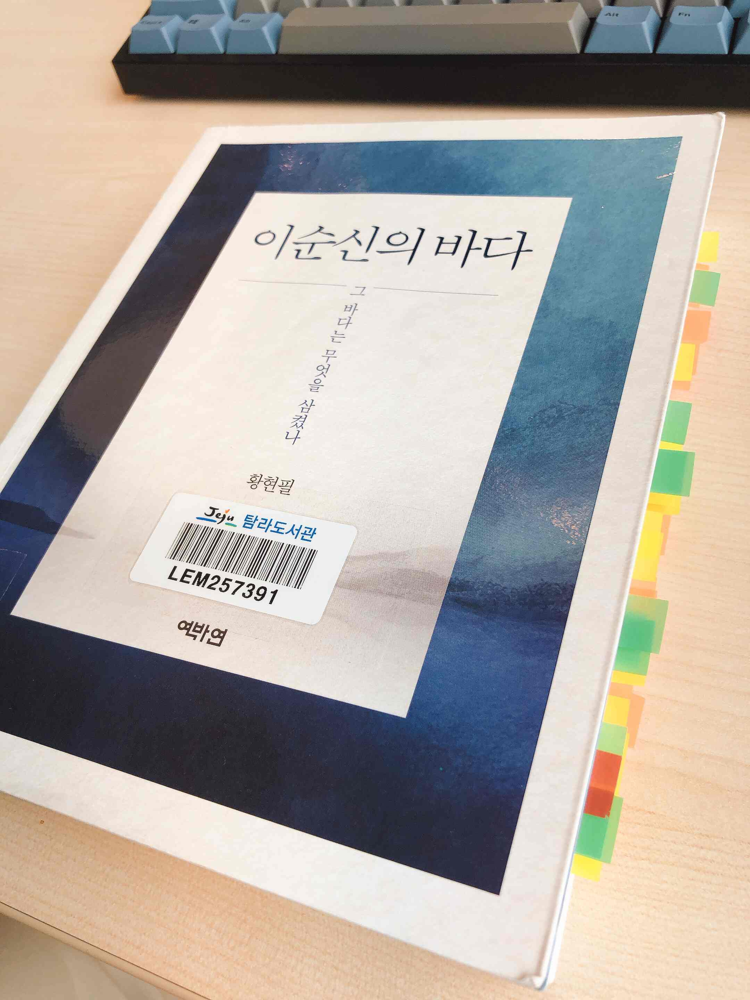

## 이순신 장군
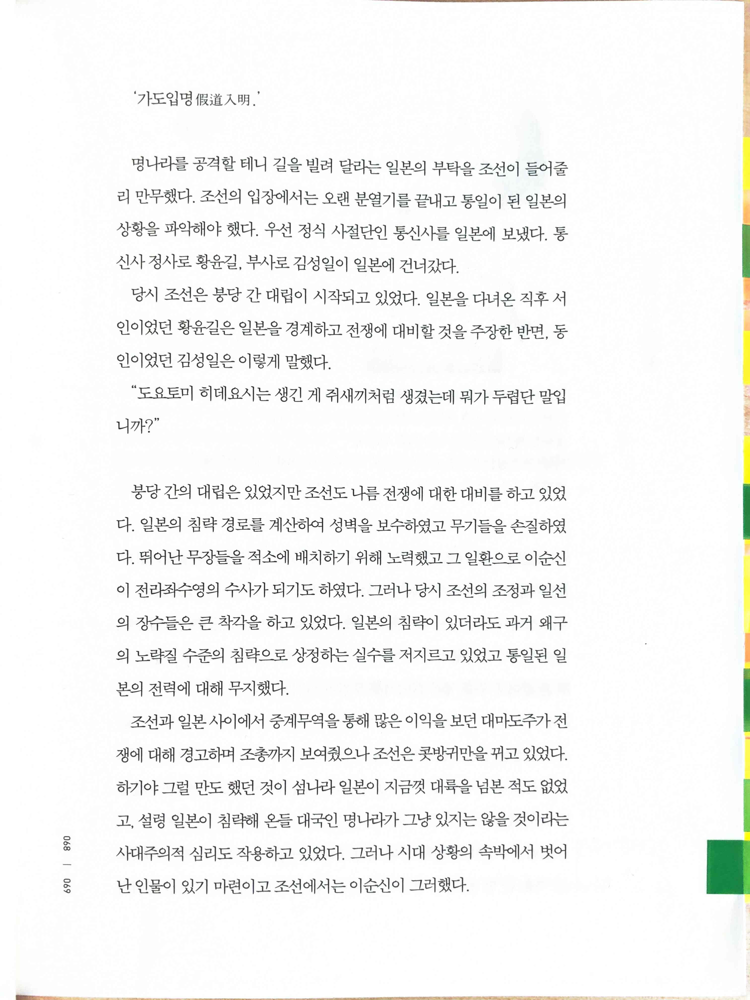

* `시대 상황의 속박에서 벗어난 인물이 있기 마련이고 조선에서는 이순신이 그러했다.`

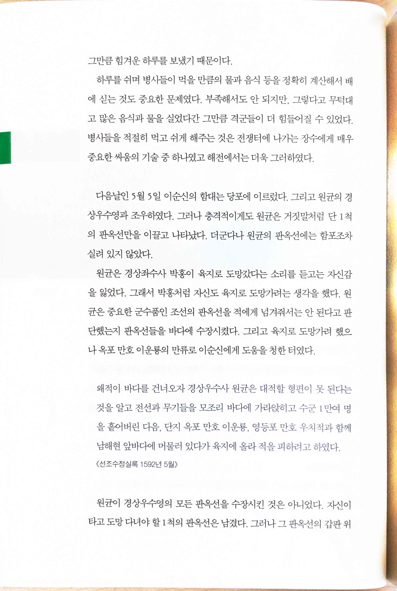

* `하루를 쉬며 병사들이 먹을 만큼의 물과 음식 등을 정확히 계산해서 배에 싣는 것도 중요한 문제였다. 부족해서도 안 되지만, 그렇다고 무턱대고 많은 음식과 물을 실었다간 그만큼 격군들이 더 힘들어질 수 있었다. 병사들을 적절히 먹고 쉬게 해주는 것은 전쟁터에 나가는 장수에게 매우 중요한 싸움의 기술 중 하나였고 해전에서는 더욱 그러하였다.`
  * (동서고금을 막론하고 언제나 전쟁에서 가장 중요한 병참. 그리고 아래에는 뭘로 봐도 무능한 원균)

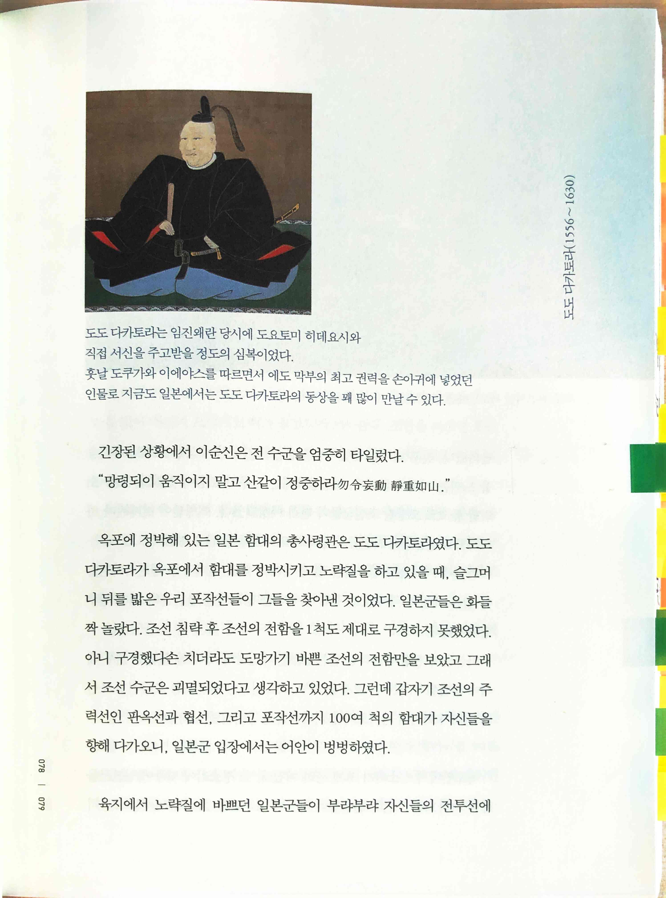

* `긴장된 상황에서 이순신은 전 수군을 엄중히 타일렀다. “망령되이 움직이지 말고 산같이 정중하라勿令妄動 靜重如山."`

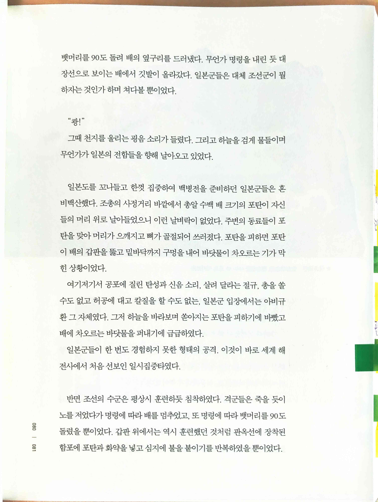

* `일본군들이 한 번도 경험하지 못한 형태의 공격. 이것이 바로 세계 해전사에서 처음 선보인 일시집중타였다.`

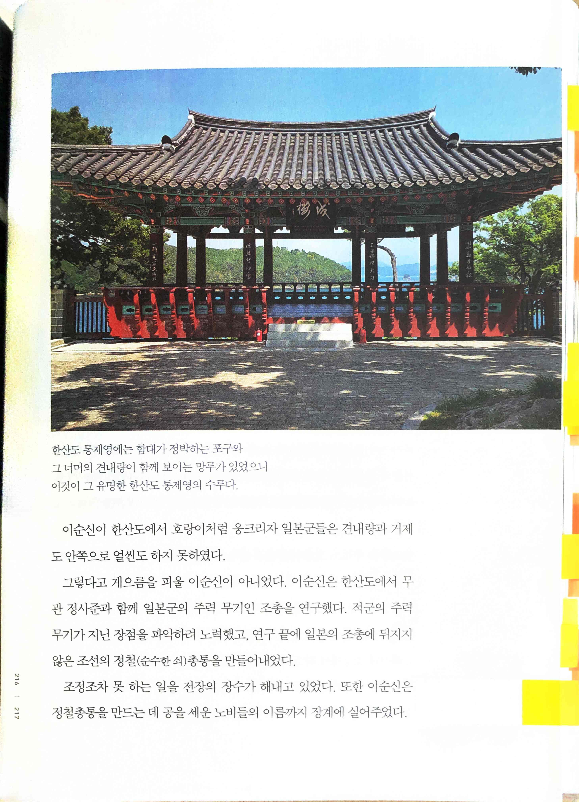

* `조정조차 못 하는 일을 전장의 장수가 해내고 있었다. 또한 이순신은 정철총통을 만드는 데 공을 세운 노비들의 이름까지 장계에 실어주었다.`

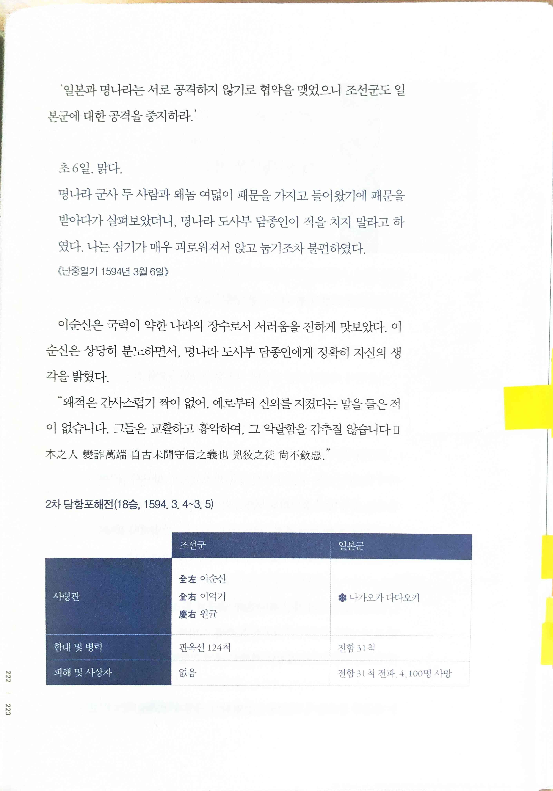

* `"왜적은 간사스럽기 짝이 없어, 예로부터 신의를 지켰다는 말을 들은 적이 없습니다. 그들은 교활하고 흉악하여, 그 악랄함을 감추질 않습니다本之人變詐萬端自古未聞守信之義也兇狡之徒尚不斂惡。”`

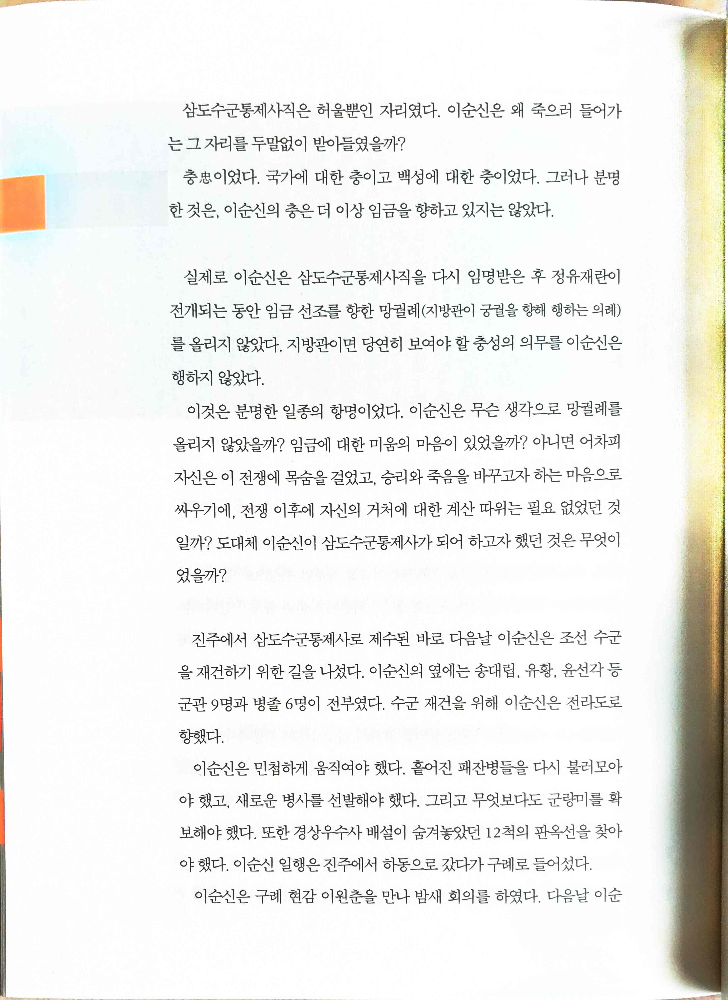

* `삼도수군통제사직은 허울뿐인 자리였다. 이순신은 왜 죽으러 들어가는 그 자리를 두말없이 받아들였을까?`
* `충忠이었다. 국가에 대한 충이고 백성에 대한 충이었다. 그러나 분명한 것은, 이순신의 충은 더 이상 임금을 향하고 있지는 않았다.`

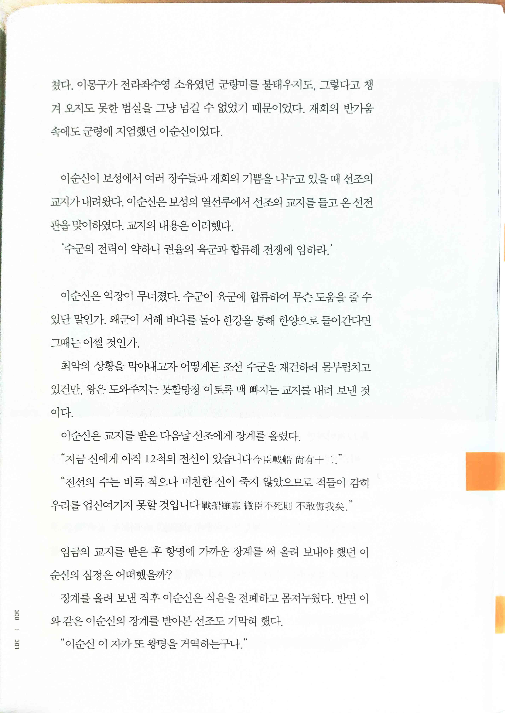

* `"지금 신에게 아직 12척의 전선이 있습니다今臣戰船 尙有十二."`
  * (이럴 거였으면 도대체 선조는 어떤 생각으로 이순신 장군을 기용했을까?)

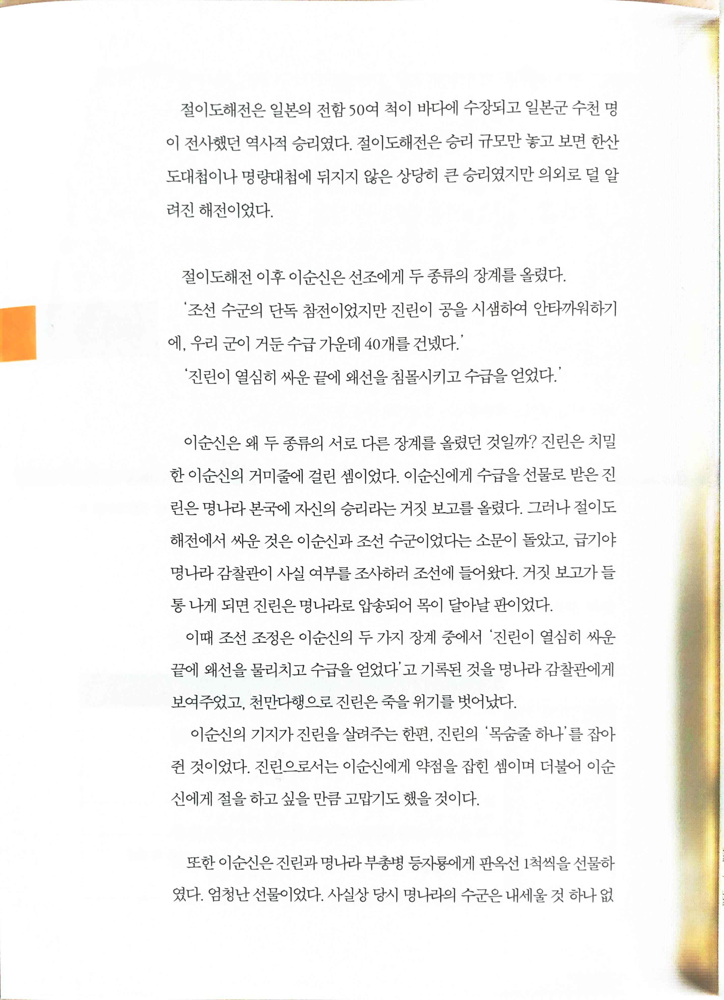

* `절이도해전 이후 이순신은 선조에게 두 종류의 장계를 올렸다.`
  * `'조선 수군의 단독 참전이었지만 진린이 공을 시샘하여 안타까워하기에, 우리 군이 거둔 수급 가운데 40개를 건넸다.'`
  * `'진린이 열심히 싸운 끝에 왜선을 침몰시키고 수급을 얻었다.'`
  * (기록된 성격만 보면 정말 우직하기만 할 거 같은데 또 이렇게 사람의 성격에 맞춰 계책을 쓰셨던 걸 보면 조정에도 진작 이렇게 할 수 있지 않았을까? 하는 생각이 들어 더 안타깝다)

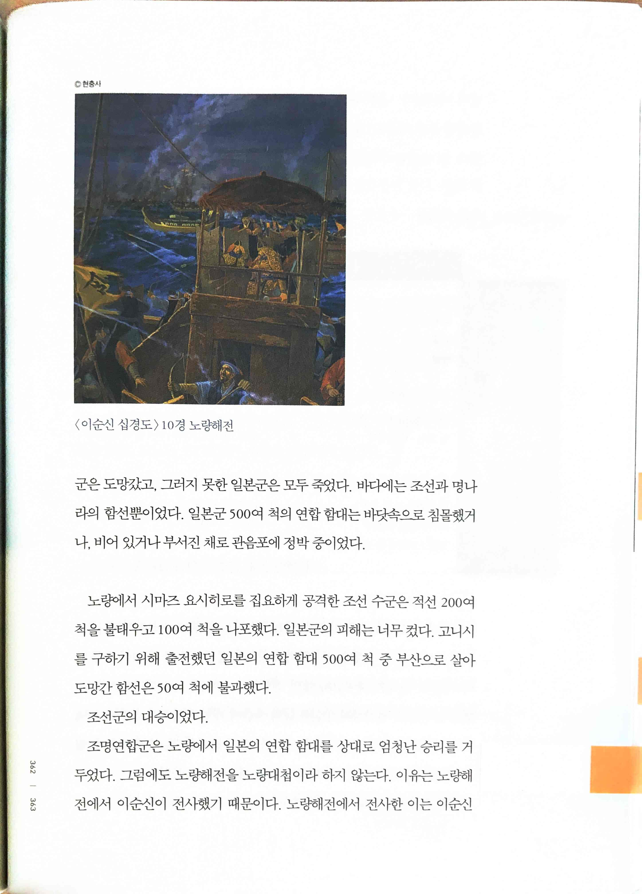

* `조명연합군은 노량에서 일본의 연합 함대를 상대로 엄청난 승리를 거두었다. 그럼에도 노량해전을 노량대첩이라 하지 않는다. 이유는 노량해전에서 이순신이 전사했기 때문이다.`

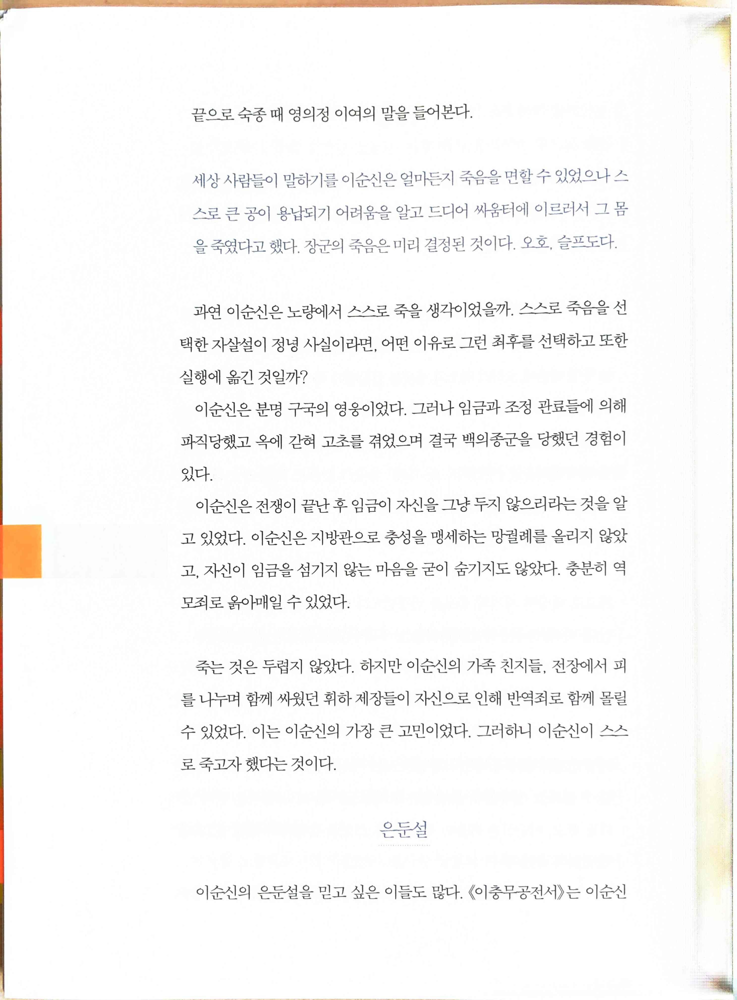

* `이순신은 분명 구국의 영웅이었다. 그러나 임금과 조정 관료들에 의해 파직당했고 옥에 갇혀 고초를 겪었으며 결국 백의종군을 당했던 경험이 있다.`
* `이순신은 전쟁이 끝난 후 임금이 자신을 그냥 두지 않으리라는 것을 알고 있었다. 이순신은 지방관으로 충성을 맹세하는 망궐례를 올리지 않았고, 자신이 임금을 섬기지 않는 마음을 굳이 숨기지도 않았다. 충분히 역모죄로 옮아매일 수 있었다.`

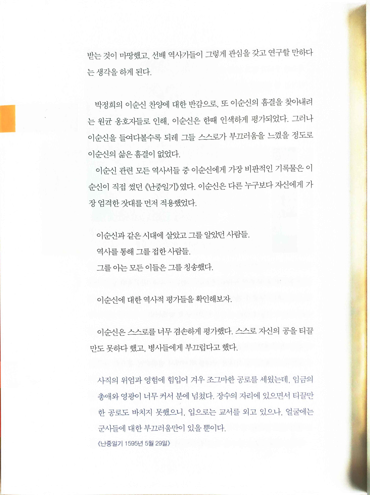

* `박정희의 이순신 찬양에 대한 반감으로, 또 이순신의 흠결을 찾아내려는 원균 옹호자들로 인해, 이순신은 한때 인색하게 평가되었다. 그러나 이순신을 들여다볼수록 되레 그들 스스로가 부끄러움을 느꼈을 정도로 이순신의 삶은 흠결이 없었다.`

## Leadership
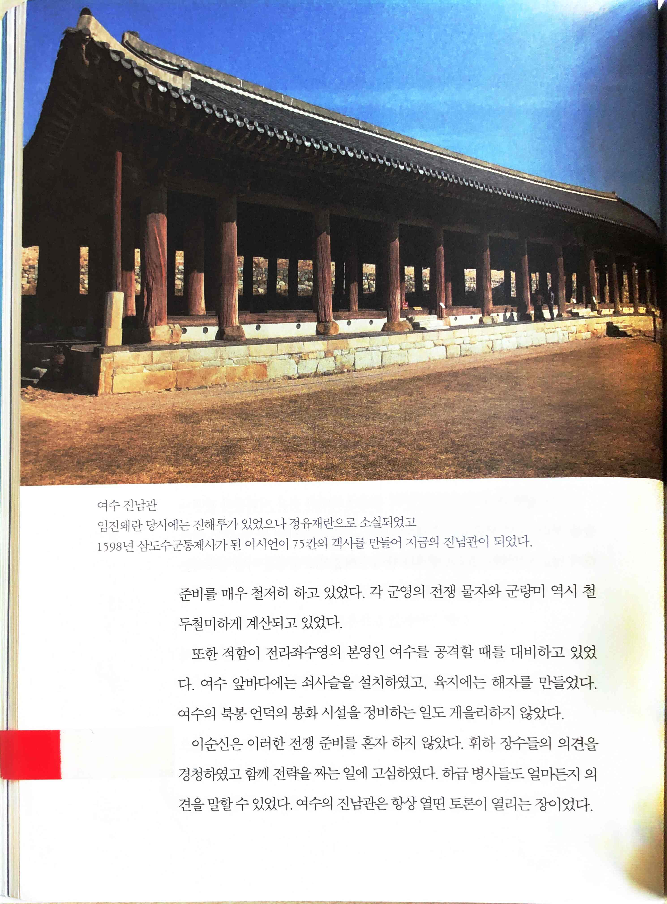

* `이순신은 이러한 전쟁 준비를 혼자 하지 않았다. 휘하 장수들의 의견을 경청하였고 함께 전략을 짜는 일에 고심하였다. 하급 병사들도 얼마든지 의견을 말할 수 있었다. 여수의 진남관은 항상 열띤 토론이 열리는 장이었다.`
  * (이순신 장군은 어떻게 토론을 했을까 궁금하다)

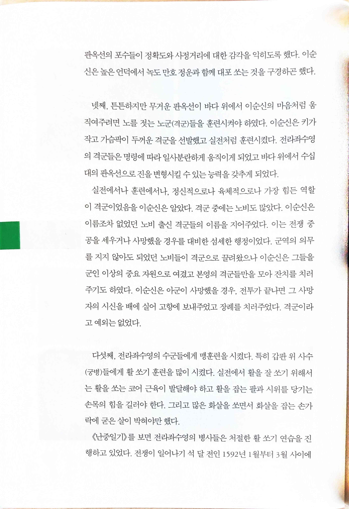

* `실전에서나 훈련에서나, 정신적으로나 육체적으로나 가장 힘든 역할이 격군이었음을 이순신은 알았다. 격군 중에는 노비도 많았다. 이순신은 이름조차 없었던 노비 출신 격군들의 이름을 지어주었다. 이는 전쟁 중공을 세우거나 사망했을 경우를 대비한 섬세한 행정이었다. 군역의 의무를 지지 않아도 되었던 노비들이 격군으로 끌려왔으나 이순신은 그들을 군인 이상의 중요 자원으로 여겼고 본영의 격군들만을 모아 잔치를 치러주기도 하였다. 이순신은 아군이 사망했을 경우, 전투가 끝나면 그 사망자의 시신을 배에 실어 고향에 보내주었고 장례를 치러주었다. 격군이라고 예외는 없었다.`
  * (시대를 생각하면 정말 신경쓸 필요 없는 신분까지 세심하게 신경을 썼단 이야기인데 대단하고 쉽게 믿어지지 않는 일)

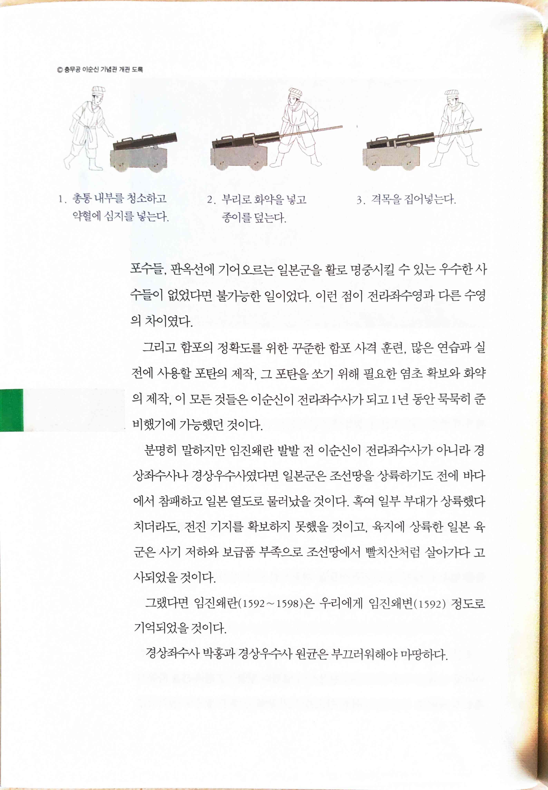

* `함포의 정확도를 위한 꾸준한 함포 사격 훈련, 많은 연습과 실전에 사용할 포탄의 제작, 그 포탄을 쏘기 위해 필요한 염초 확보와 화약의 제작, 이 모든 것들은 이순신이 전라좌수사가 되고 1년 동안 묵묵히 준비했기에 가능했던 것이다.`
  * (정말 이순신 장군이 경상좌수사였다면 어땠을까? 바로 부산 앞바다에서 왜군을 모조리 격침시키고 임진왜란이 발발하지 않았을까?)

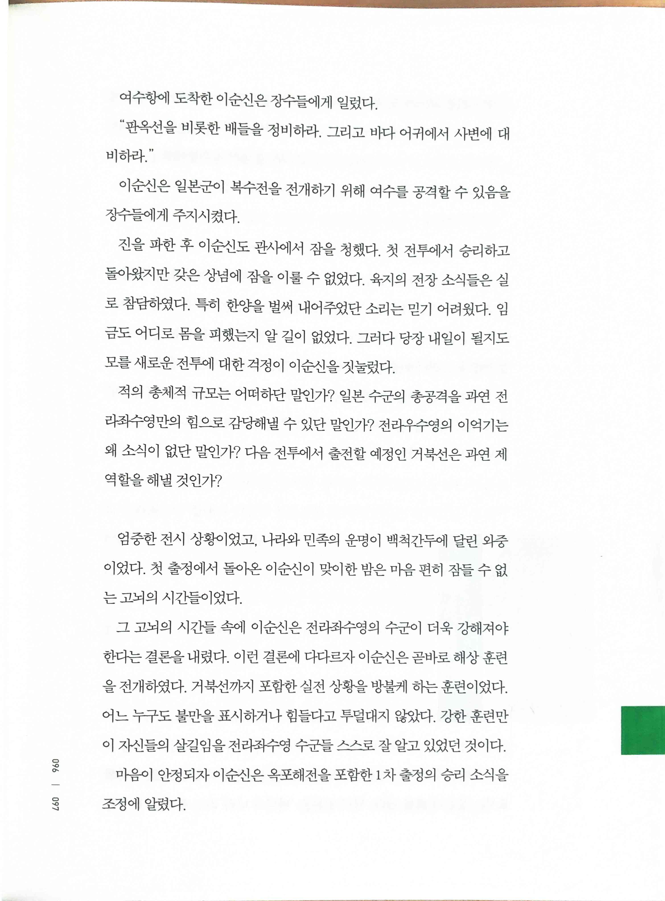

* `그 고뇌의 시간들 속에 이순신은 전라좌수영의 수군이 더욱 강해져야 한다는 결론을 내렸다. 이런 결론에 다다르자 이순신은 곧바로 해상 훈련을 전개하였다. 거북선까지 포함한 실전 상황을 방불케 하는 훈련이었다. 어느 누구도 불만을 표시하거나 힘들다고 투덜대지 않았다. 강한 훈련만이 자신들의 살길임을 전라좌수영 수군들 스스로 잘 알고 있었던 것이다.`

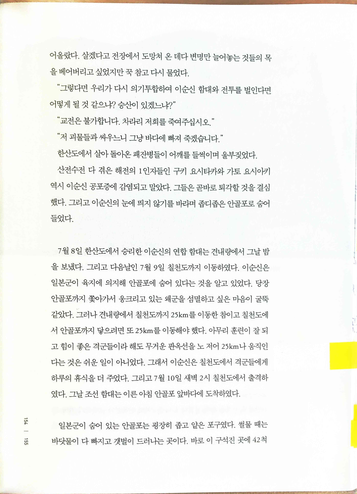

* `아무리 훈련이 잘 되고 힘이 좋은 격군들이라 해도 무거운 판옥선을 노 저어 25km나 움직인다는 것은 쉬운 일이 아니었다. 그래서 이순신은 칠천도에서 격군들에게 하루의 휴식을 더 주었다.`
  * (아무리 엄격하고 군율을 지키는 걸 중시하는 이순신 장군이지만 상황에 맞게 필요하면 적절한 휴식을 부여하며 긴장을 조정하는 모습을 보여줬다. 지금 식으로 이야기하면 burnout에 빠지지 않게 상황에 맞추는 리더의 모습)

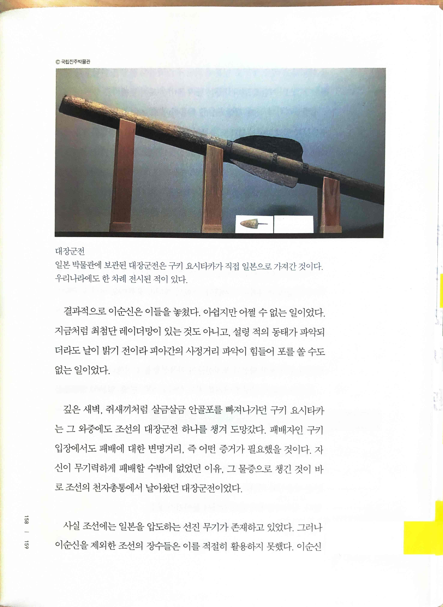

* `사실 조선에는 일본을 압도하는 선진 무기가 존재하고 있었다. 그러나 이순신을 제외한 조선의 장수들은 이를 적절히 활용하지 못했다.`

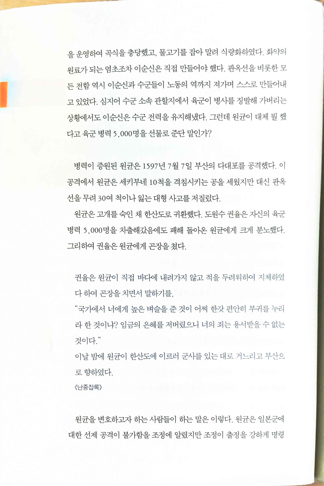

* `곡식을 충당했고, 물고기를 잡아 말려 식량화하였다. 화약의 원료가 되는 염초조차 이순신은 직접 만들어야 했다. 판옥선을 비롯한 모든 전함 역시 이순신과 수군들이 노동의 역까지 져가며 스스로 만들어내고 있었다. 심지어 수군 소속 관할지에서 육군이 병사를 징발해 가버리는 상황에서도 이순신은 수군 전력을 유지해냈다. `
  * (그런데 이순신 장군은 지원하지 않고 원균에겐 병력을 내줬다니)

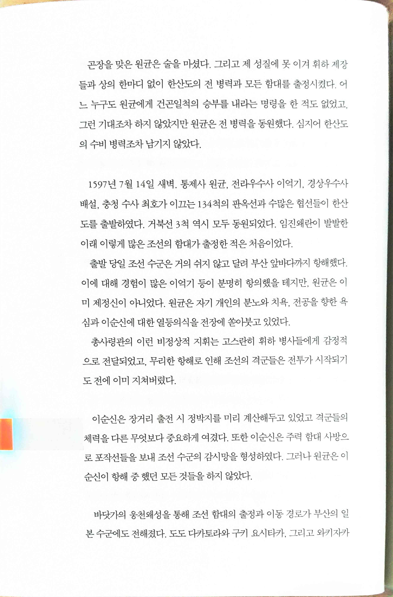

* `이순신은 장거리 출전 시 정박지를 미리 계산해두고 있었고 격군들의 체력을 다른 무엇보다 중요하게 여겼다. 또한 이순신은 주력 함대 사방으로 포작선들을 보내 조선 수군의 감시망을 형성하였다. 그러나 원균은 이순신이 항해 중 했던 모든 것들을 하지 않았다.`

## 선조
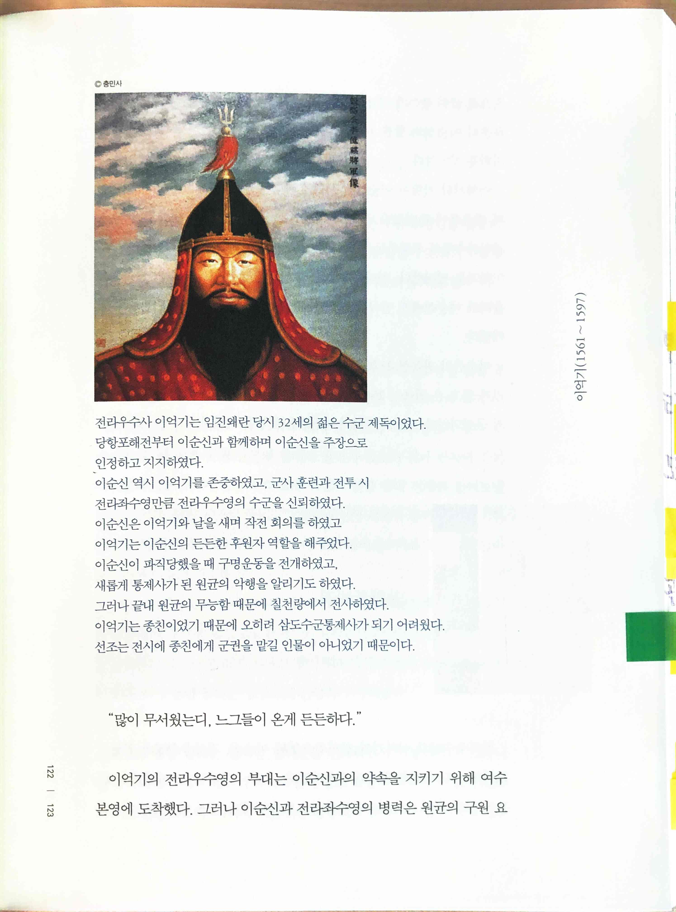

* `이억기는 종친이었기 때문에 오히려 삼도수군통제사가 되기 어려웠다.선조는 전시에 종친에게 군권을 맡길 인물이 아니었기 때문이다.`

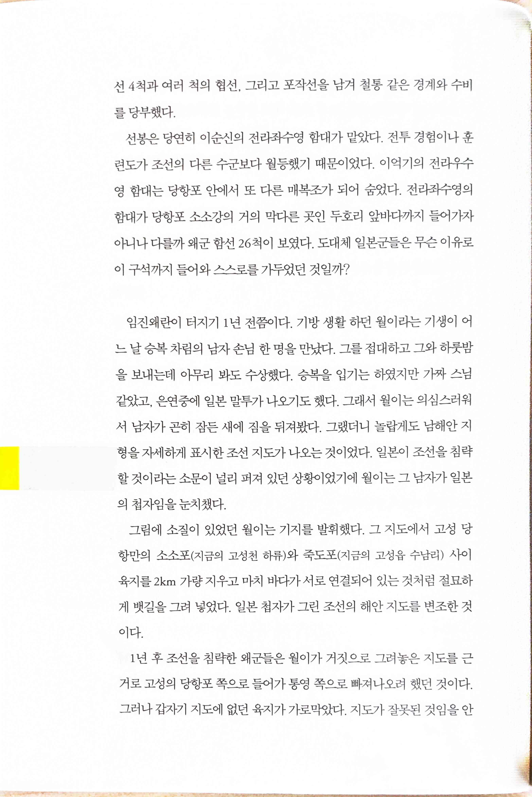

* `일본이 조선을 침략할 것이라는 소문이 널리 퍼져 있던 상황이었기에`
  * (이런 상황에서도 결국 침략을 당했으니 참...)

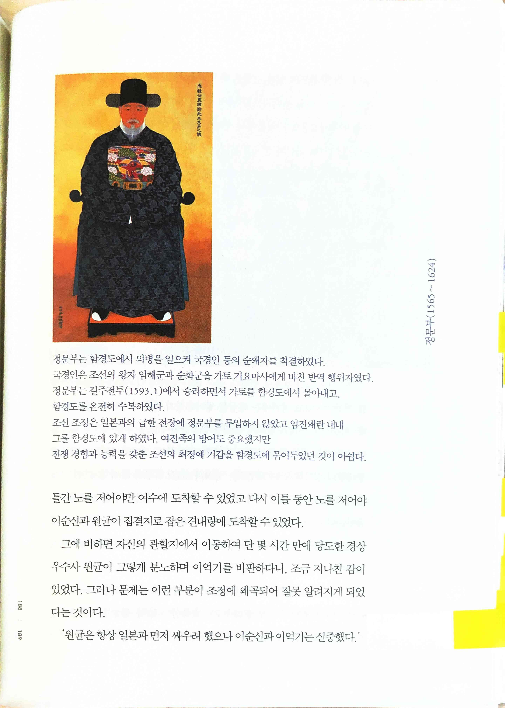

* `'원균은 항상 일본과 먼저 싸우려 했으나 이순신과 이억기는 신중했다.'`

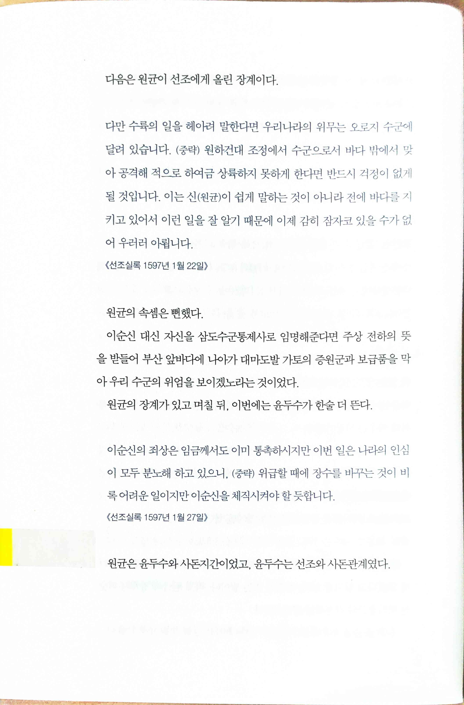

* `원균은 윤두수와 사돈지간이었고, 윤두수는 선조와 사돈관계였다.`

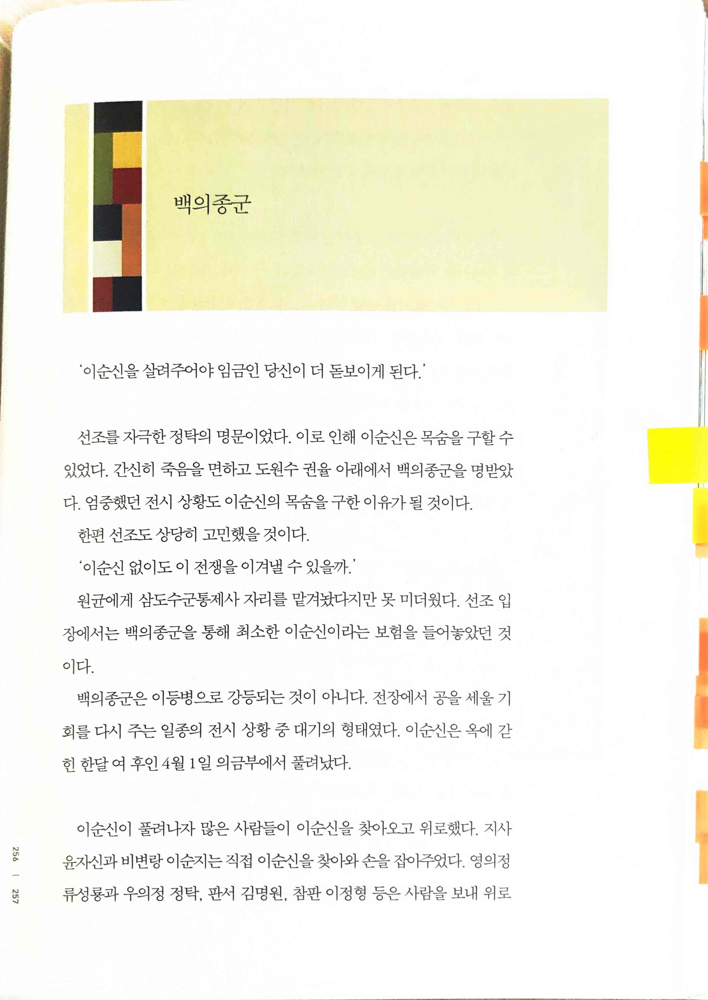

* `'이순신을 살려주어야 임금인 당신이 더 돋보이게 된다.'`
* `선조를 자극한 정탁의 명문이었다. 이로 인해 이순신은 목숨을 구할 수 있었다. 간신히 죽음을 면하고 도원수 권율 아래에서 백의종군을 명받았다. 엄중했던 전시 상황도 이순신의 목숨을 구한 이유가 될 것이다.`

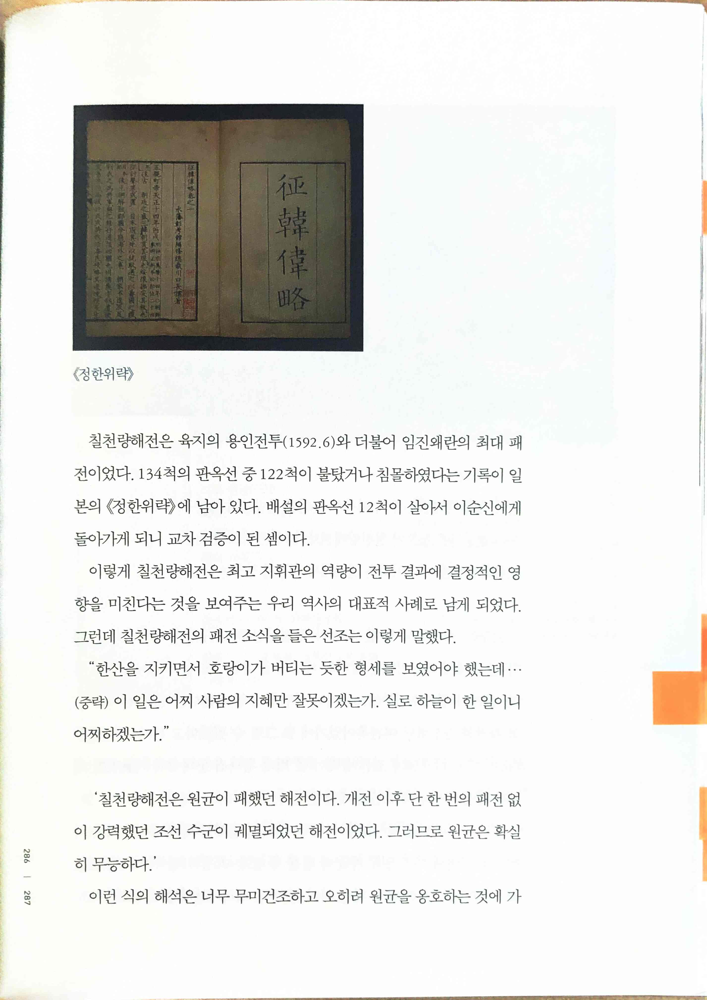

* `"한산을 지키면서 호랑이가 버티는 듯한 형세를 보였어야 했는데 …(중략) 이 일은 어찌 사람의 지혜만 잘못이겠는가. 실로 하늘이 한 일이니 어찌하겠는가.”`

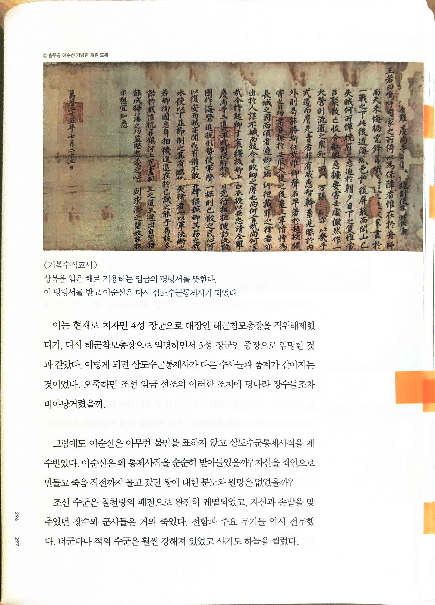

* `오죽하면 조선 임금 선조의 이러한 조치에 명나라 장수들조차 비아냥거렸을까.`

## 원균
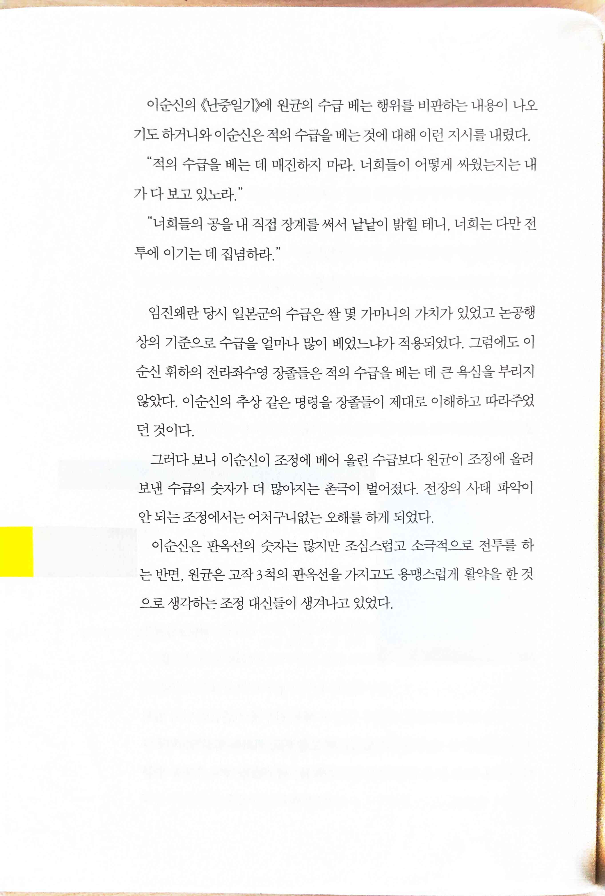

* `이순신은 판옥선의 숫자는 많지만 조심스럽고 소극적으로 전투를 하는 반면, 원균은 고작 3척의 판옥선을 가지고도 용맹스럽게 활약을 한 것으로 생각하는 조정 대신들이 생겨나고 있었다.`

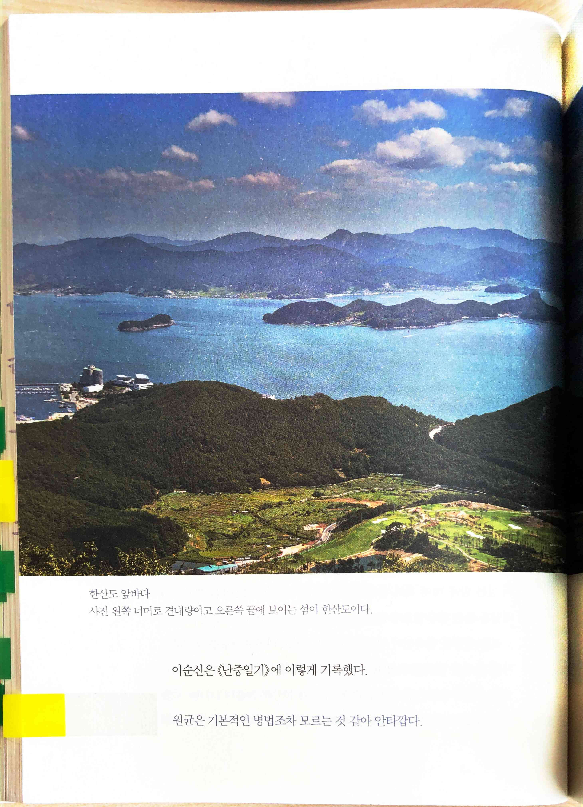

* `원균은 기본적인 병법조차 모르는 것 같아 안타깝다.`

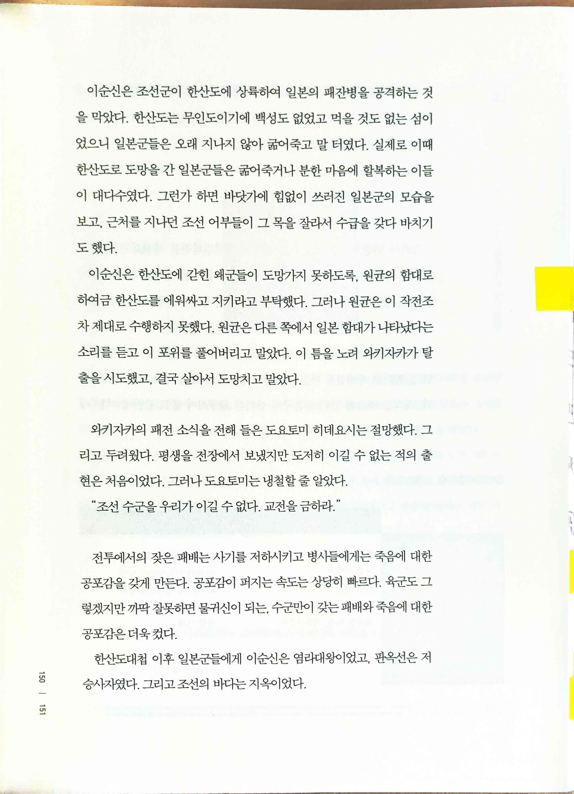

* `이순신은 한산도에 갇힌 왜군들이 도망가지 못하도록, 원균의 함대로 하여금 한산도를 에워싸고 지키라고 부탁했다. 그러나 원균은 이 작전조차 제대로 수행하지 못했다. 원균은 다른 쪽에서 일본 함대가 나타났다는 소리를 듣고 이 포위를 풀어버리고 말았다. 이 틈을 노려 와키자카가 탈출을 시도했고, 결국 살아서 도망치고 말았다.`

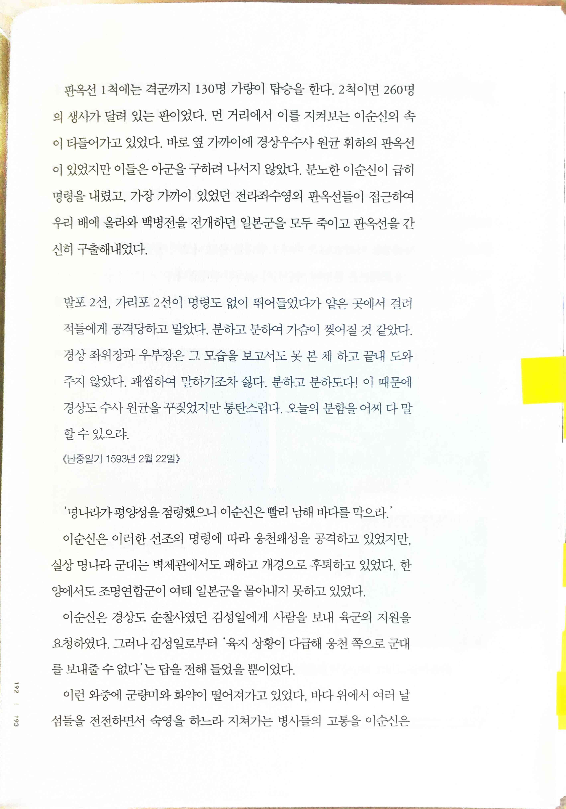

* `발포 2선, 가리포 2선이 명령도 없이 뛰어들었다가 얕은 곳에서 걸려적들에게 공격당하고 말았다. 분하고 분하여 가슴이 찢어질 것 같았다.경상 좌위장과 우부장은 그 모습을 보고서도 못 본 체 하고 끝내 도와주지 않았다. 괘씸하여 말하기조차 싫다. 분하고 분하도다! 이 때문에 경상도 수사 원균을 꾸짖었지만 통탄스럽다. 오늘의 분함을 어찌 다 말할 수 있으랴.`
* `《난중일기 1593년 2월 22일)`

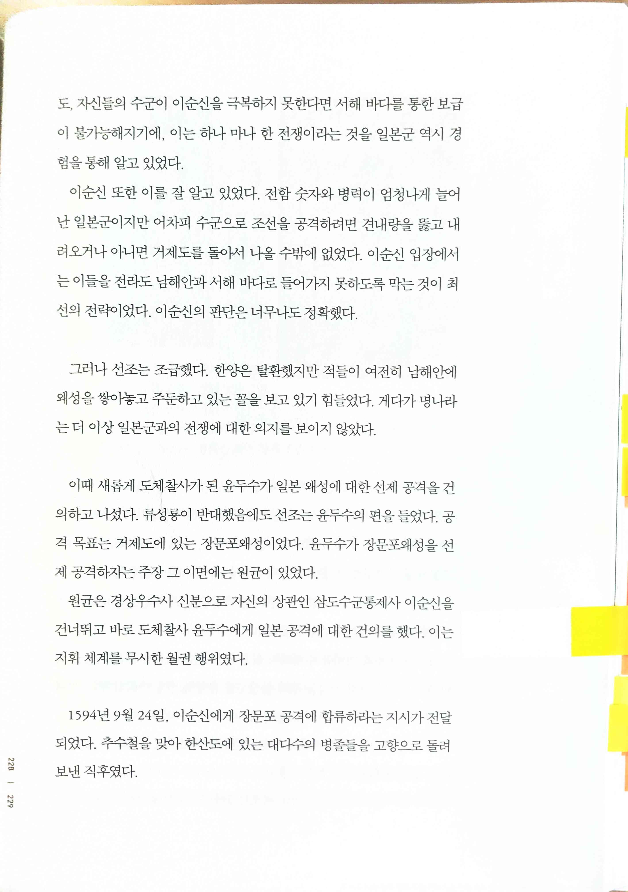

* `원균은 경상우수사 신분으로 자신의 상관인 삼도수군통제사 이순신을 건너뛰고 바로 도체찰사 윤두수에게 일본 공격에 대한 건의를 했다. 이는 지휘 체계를 무시한 월권 행위였다.`

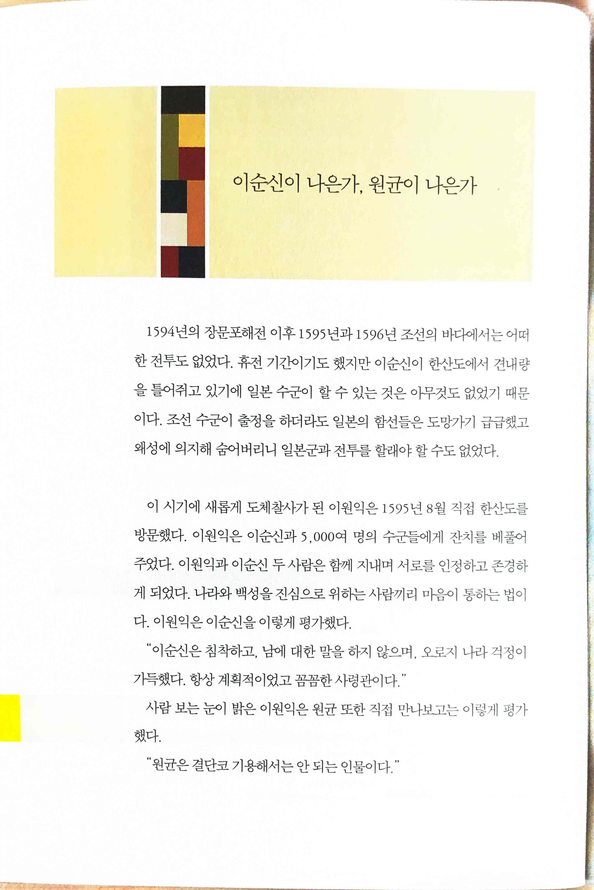

* `사람 보는 눈이 밝은 이원익은 원균 또한 직접 만나보고는 이렇게 평가했다.`
* `"원균은 결단코 기용해서는 안 되는 인물이다."`

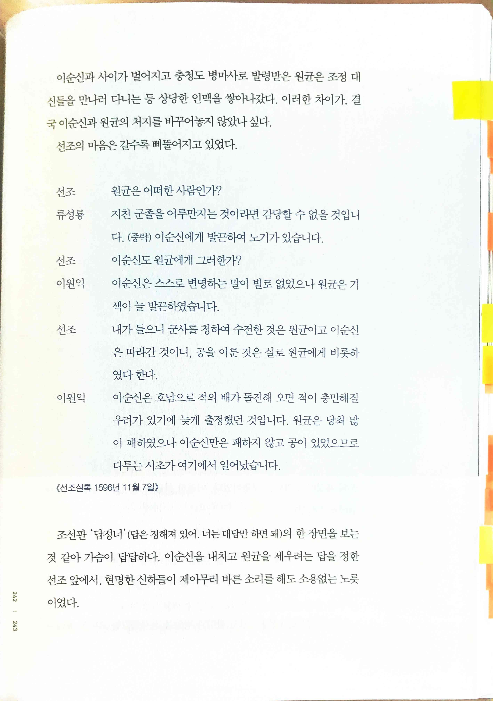

* `이순신과 사이가 벌어지고 충청도 병마사로 발령받은 원균은 조정 대신들을 만나러 다니는 등 상당한 인맥을 쌓아나갔다. 이러한 차이가, 결국 이순신과 원균의 처지를 바꾸어놓지 않았나 싶다.`

* `이원익은 백의종군 중이던 이순신에게 이렇게 말했다.`
* `"음흉한 사람 원균은 무고하는 짓이 매우 많지만 하늘이 살피지 못하니 나랏일을 어찌하겠습니까?"`

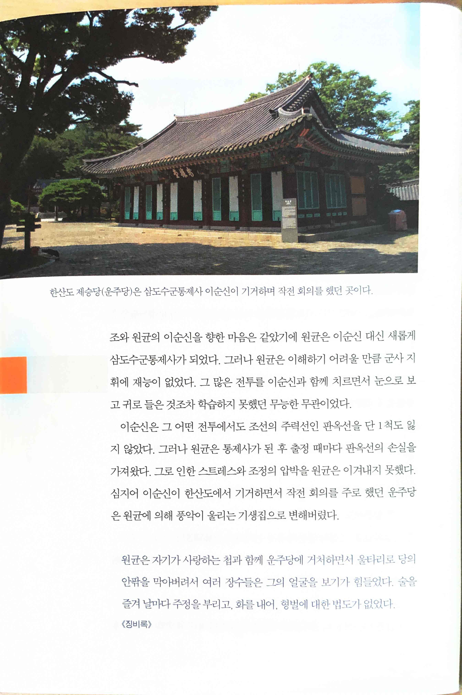

* `원균은 이해하기 어려울 만큼 군사 지휘에 재능이 없었다. 그 많은 전투를 이순신과 함께 치르면서 눈으로 보고 귀로 들은 것조차 학습하지 못했던 무능한 무관이었다.`

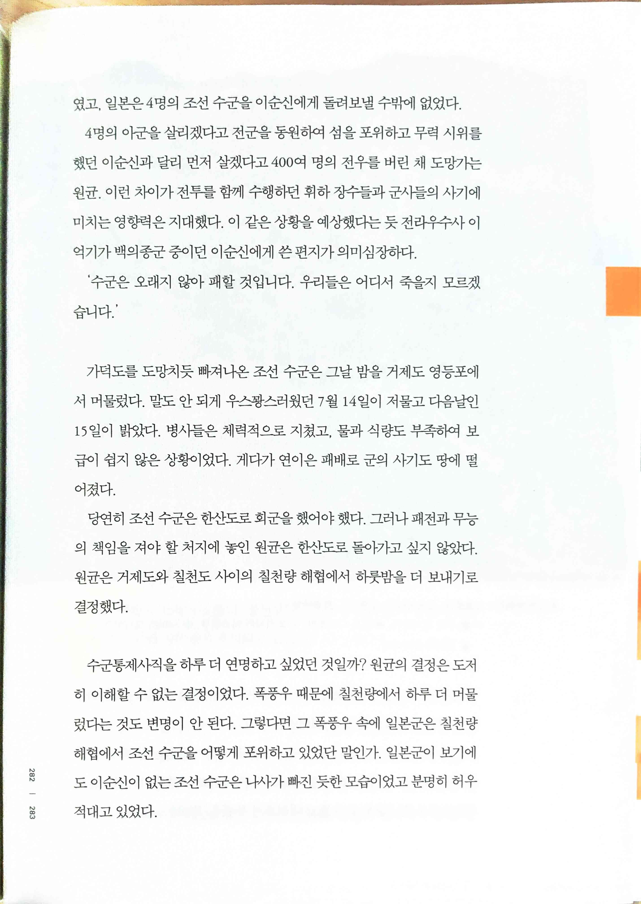

* `이 같은 상황을 예상했다는 듯 전라우수사 이억기가 백의종군 중이던 이순신에게 쓴 편지가 의미심장하다.`
* `'수군은 오래지 않아 패할 것입니다. 우리들은 어디서 죽을지 모르겠습니다.'`

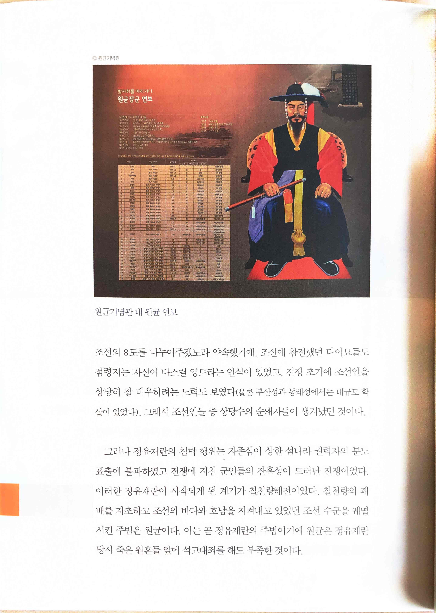

* `칠천량의 패배를 자초하고 조선의 바다와 호남을 지켜내고 있었던 조선 수군을 궤멸시킨 주범은 원균이다. 이는 곧 정유재란의 주범이기에 원균은 정유재란 당시 죽은 원혼들 앞에 석고대죄를 해도 부족한 것이다.`

## Etc
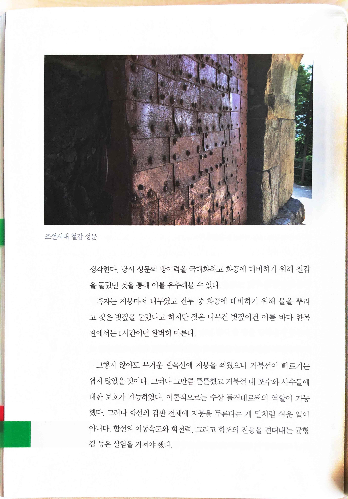

* `함선의 갑판 전체에 지붕을 두른다는 게 말처럼 쉬운 일이아니다. 함선의 이동속도와 회전력, 그리고 함포의 진동을 견뎌내는 균형감 등은 실험을 거쳐야 했다.`
  * (이렇게 배에 대한 이야기를 볼 때마다 [Vasa호](https://namu.wiki/w/%EB%B0%94%EC%82%AC%20%ED%98%B8) 이야기가 생각난다. 조선 시대는 아무래도 과학에 대한 지식이 부족할 수 밖에 없을텐데, 어떻게 이런 실험을 해서 건조를 했을까? 수많은 실험을 통해 경험적으로 해결했을까?)

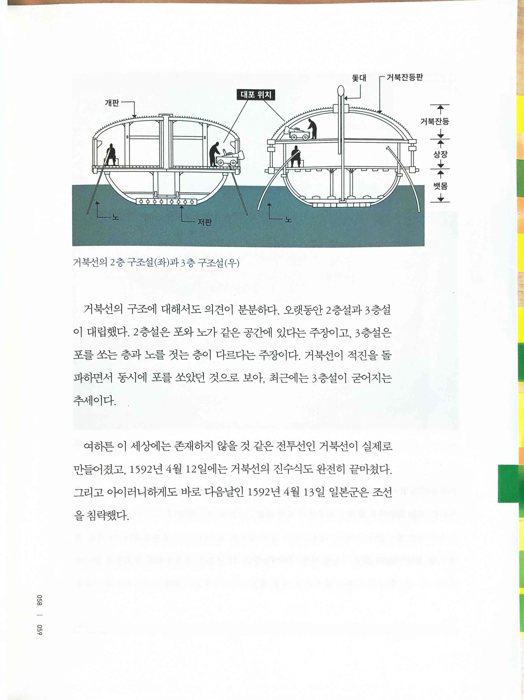

* `이 세상에는 존재하지 않을 것 같은 전투선인 거북선이 실제로 만들어졌고, 1592년 4월 12일에는 거북선의 진수식도 완전히 끝마쳤다. 그리고 아이러니하게도 바로 다음날인 1592년 4월 13일 일본군은 조선을 침략했다.`

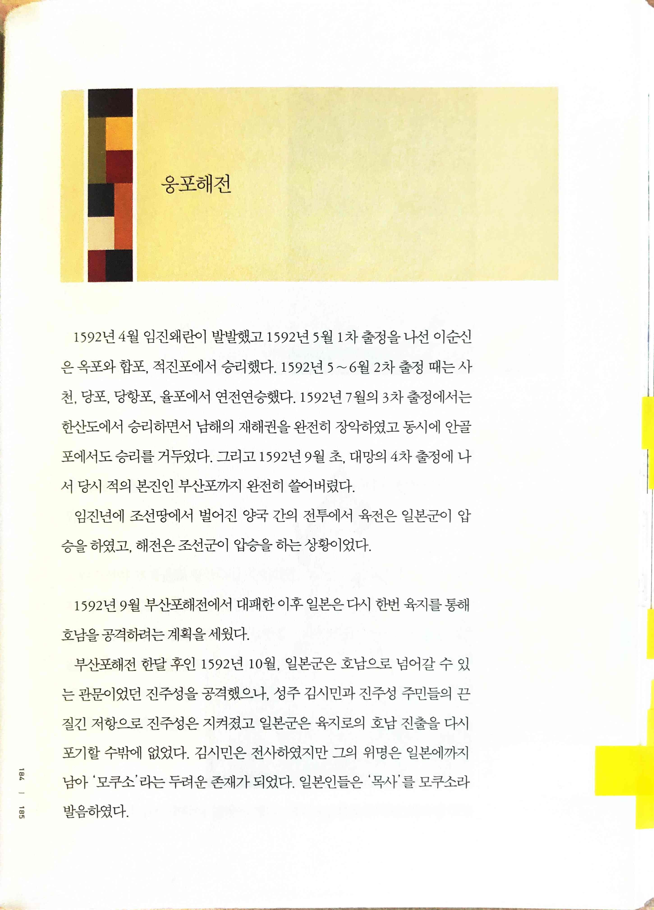

* `김시민은 전사하였지만 그의 위명은 일본에까지 남아 '모쿠소' 라는 두려운 존재가 되었다. 일본인들은 '목사'를 모쿠소라 발음하였다.`

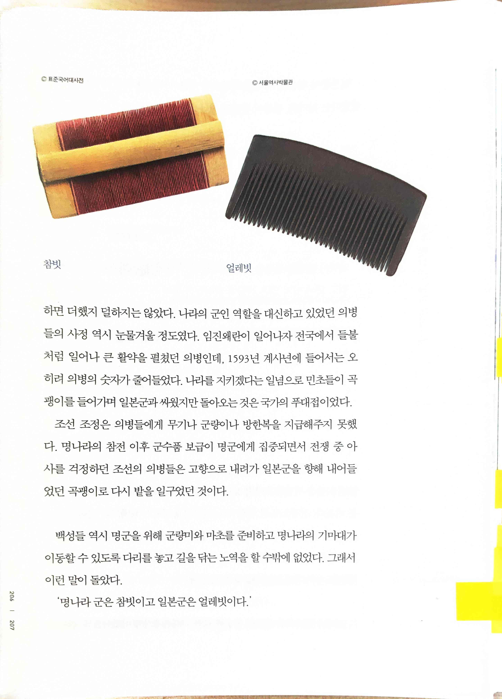

* `"명나라 군은 참빗이고 일본군은 얼레빗이다."`

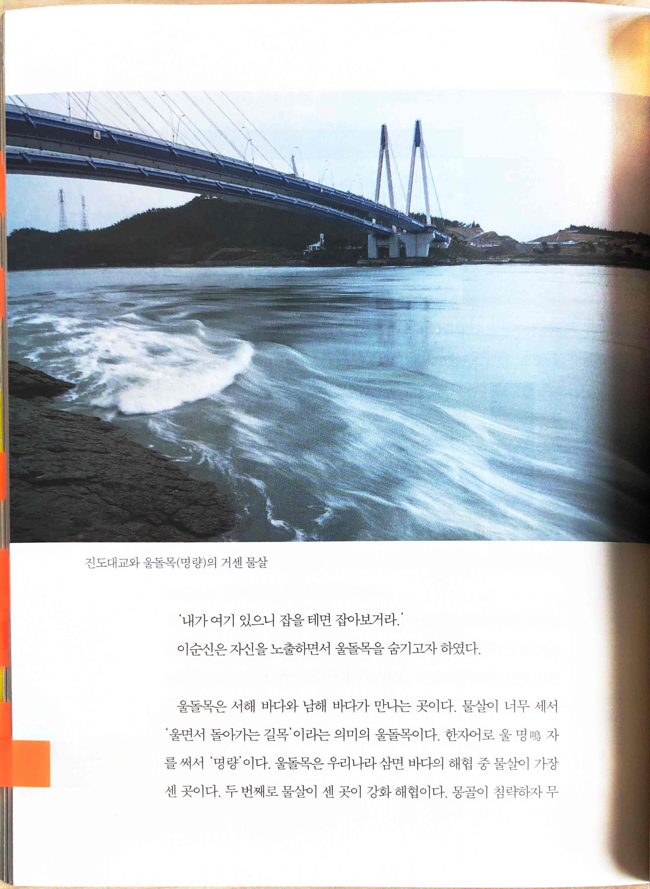

* `물살이 너무 세서'울면서 돌아가는 길목' 이라는 의미의 울돌목이다. 한자어로 울 명 자를 써서 '명량' 이다. 울돌목은 우리나라 삼면 바다의 해협 중 물살이 가장 센 곳이다.`
  * (두 번째가 강화 해협, 세 번째가 세월호가 침몰한 맹골 수도)

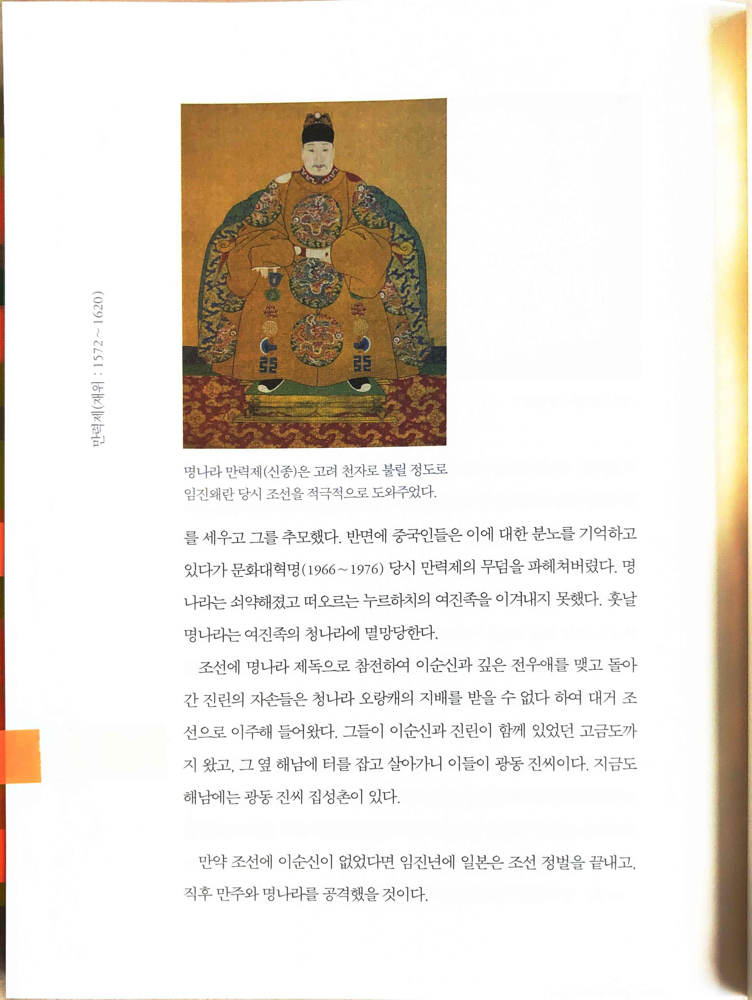

* `조선에 명나라 제독으로 참전하여 이순신과 깊은 전우애를 맺고 돌아간 진린의 자손들은 청나라 오랑캐의 지배를 받을 수 없다 하여 대거 조선으로 이주해 들어왔다. 그들이 이순신과 진린이 함께 있었던 고금도까지 왔고, 그 옆 해남에 터를 잡고 살아가니 이들이 광동 진씨이다. 지금도 해남에는 광동 진씨 집성촌이 있다.`