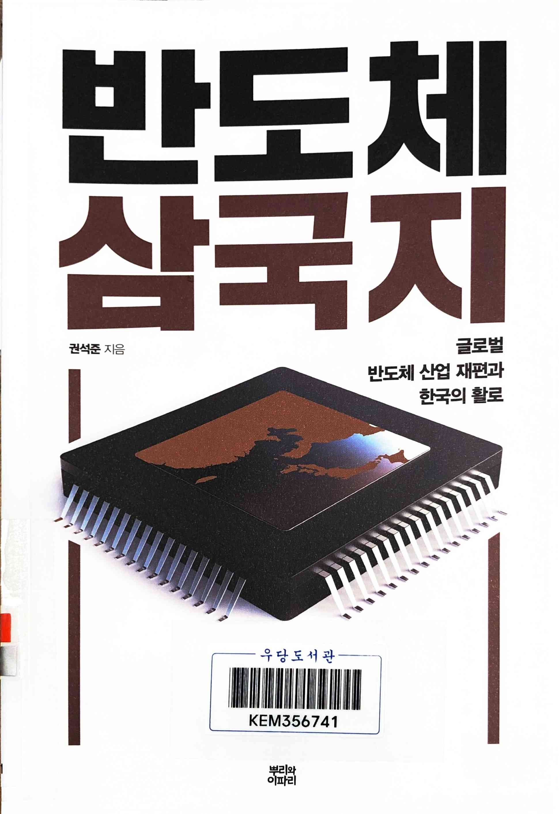
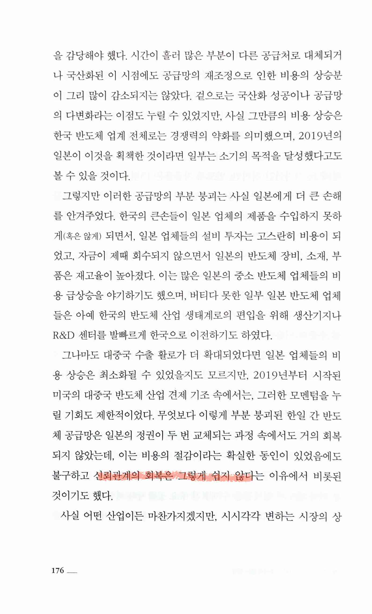
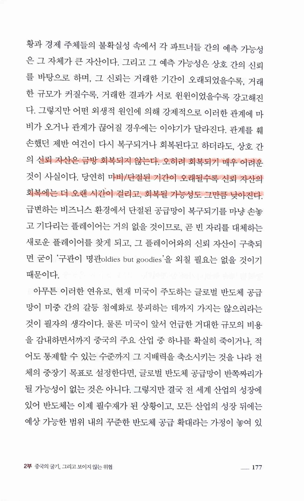
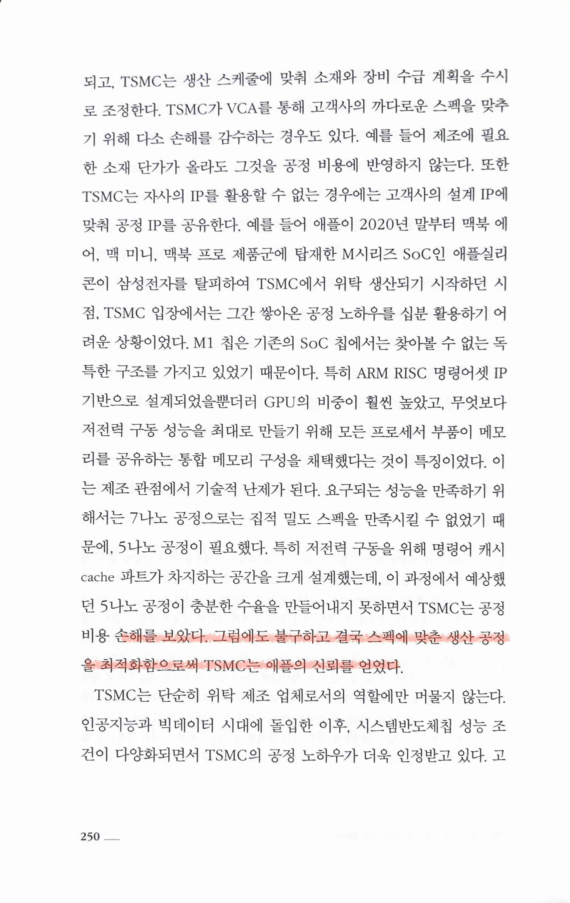
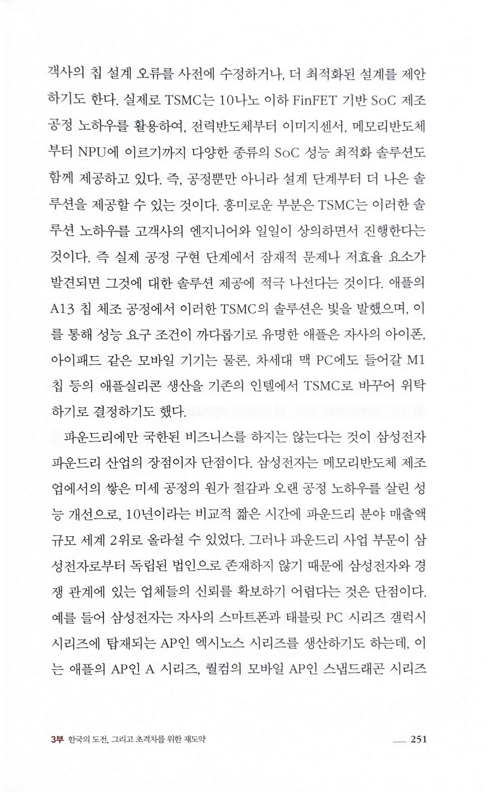
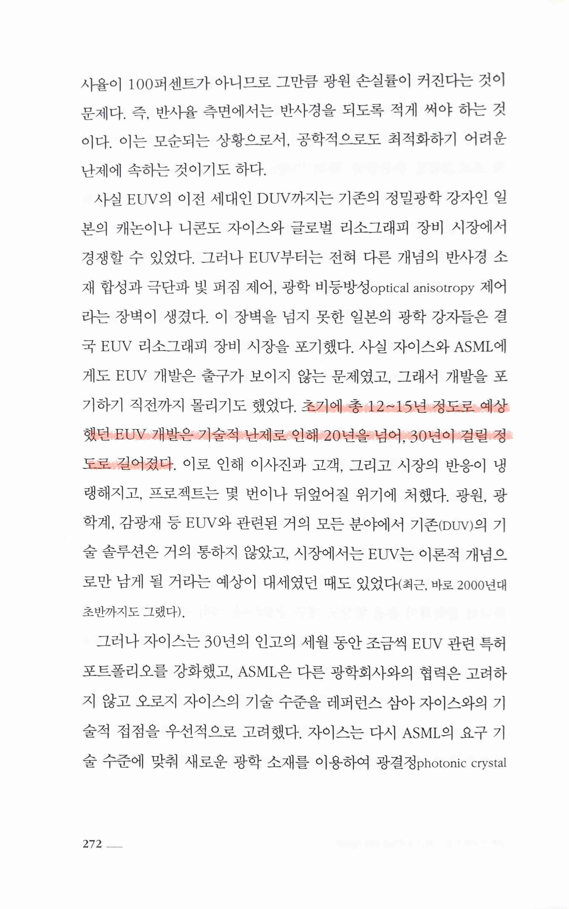
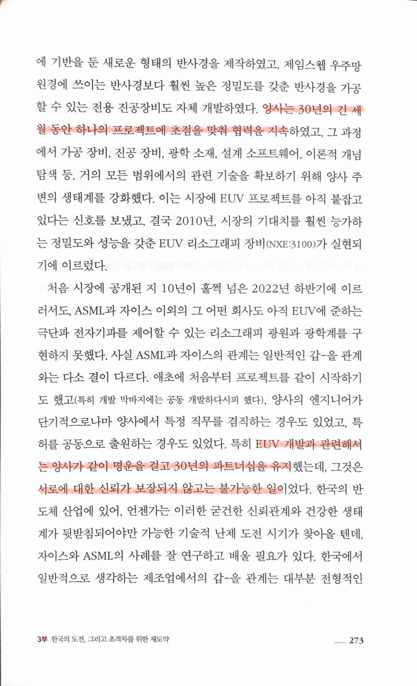

반도체 삼국지
=============

* 반도체 산업의 역사에 대한 이야기도 재미있으나 그보다 더 인상적이었던 건 기록해둔 다음 6 page의 `신뢰`에 대한 이야기였다. 쉽게 회복하기 어려운 한일간의 신뢰, 손해를 감수하고 공정 최적화에 성공한 TSMC와 Apple의 신뢰, EUV를 성공시키기 위한 30년에 걸친 ASML과 Zeiss의 신뢰. 단연코 가장 인상적인 건 ASML과 Zeiss이다. 개인간의 신뢰도 어려운 데 어떻게 서로 다른 나라의 두 기업이 한 세대에 걸쳐 공동의 목표를 향해 협력할 수 있었을까 정말 놀랍다.
  * [논란의 칩4 동맹, 우리에게 이득일까? f.권석준 교수 압권 6화 1부 - YouTube](https://www.youtube.com/watch?v=z_jtwbOWBr8)
  * [반도체 1등을 노리는 중국, 우리에게 위협이 되나? f.권석준 교수 압권 6화 2부 - YouTube](https://www.youtube.com/watch?v=eUFzit_VBNY)
  * [일본, 기술력의 함정에 빠지다 f.권석준 교수 압권 : 반도체 삼국지 1부 - YouTube](https://www.youtube.com/watch?v=QEeoHddvE6Q)

> 신뢰관계의 회복은 그렇게 쉽지 않다

> 상호 간의 신뢰 자산은 금방 회복되지 않는다. 오히려 회복되기 매우 어려운 것이 사실이다. 당연히 마비/단절된 기간이 오래될수록 신뢰 자산의 회복에는 더 오랜 시간이 걸리고, 회복될 가능성도 그만큼 낮아진다.

 

> 예상했던 5나노 공정이 충분한 수율을 만들어내지 못하면서 TSMC는 공정비용 손해를 보았다. 그럼에도 불구하고 결국 스펙에 맞춘 생산 공정을 최적화함으로써 TSMC는 애플의 신뢰를 얻었다.

 

> 초기에 총 12~15년 정도로 예상했던 EUV 개발은 기술적 난제로 인해 20년을 넘어, 30년이 걸릴 정도로 길어졌다.
>
> 양사는 30년의 긴 세월 동안 하나의 프로젝트에 초점을 맞춰 협력을 지속
>
> 특히 EUV 개발과 관련해서는 양사가 같이 명운을 걸고 30년의 파트너십을 유지했는데, 그것은 서로에 대한 신뢰가 보장되지 않고는 불가능한 일이었다.
