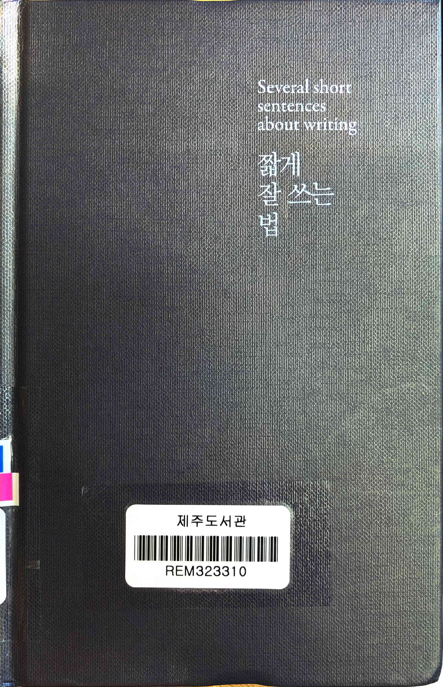
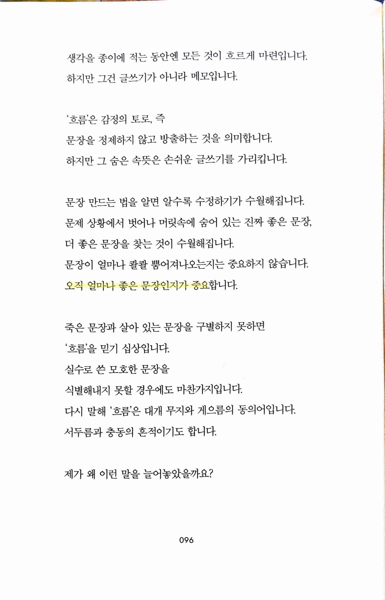
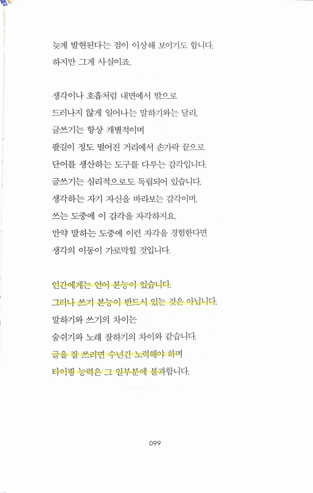
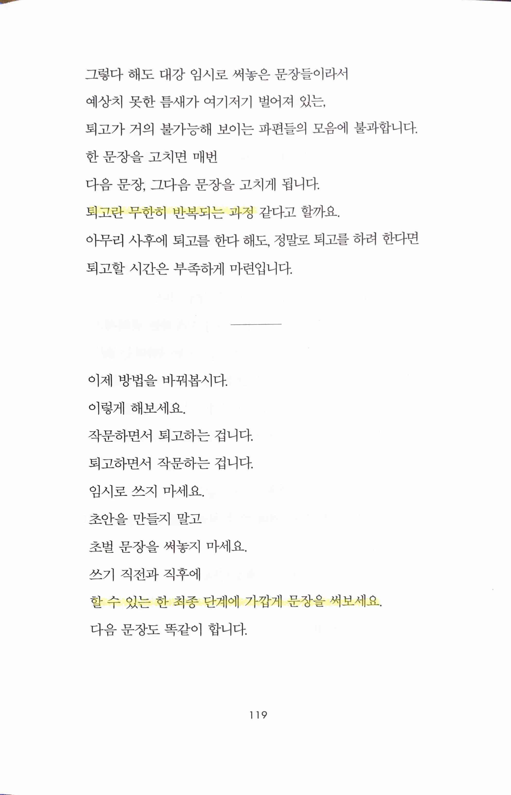
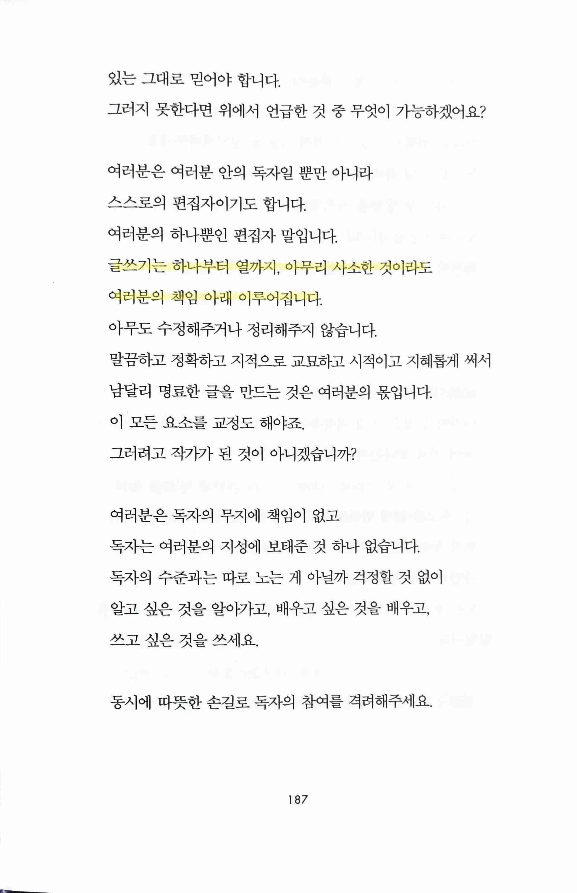
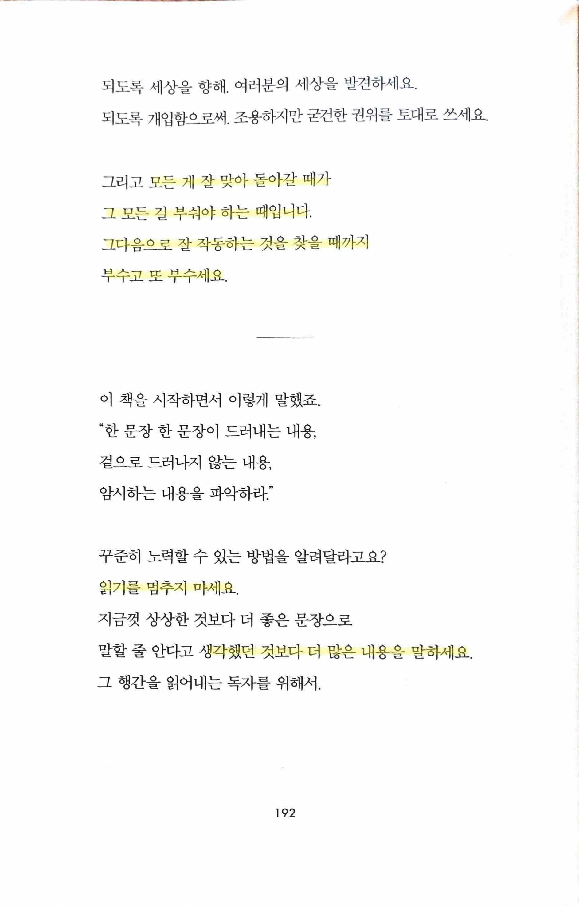

# Several short sentences about writing 짧게 잘 쓰는 법

- ★★★☆☆ 2023.07.29 coding과 연계하며 읽었는데 어느 정도 맞는 면이 있어서 혼자서 좋아하며 잘 읽었다. 번역체라 그런지 저자가 이야기하는 리듬감을 찾기는 어려웠으나 전반적으로 짧은 문장의 연속이라 읽기는 쉬웠지만 약간 비슷한 의미의 반복이라는 생각도 좀 들었다.

> 오직 얼마나 좋은 문장인지가 중요
> 
- 작성하는 code도, product도 품질이 결국 중요하다

> 인간에게는 언어 본능이 있습니다. 그러나 쓰기 본능이 반드시 있는 것은 아닙니다... 글을 잘 쓰려면 수년간 노력해야 하며 타이핑 능력은 그 일부분에 불과
> 
- 무엇이든 작성한다는 건 창작 행위이고 그래서 노력이 필요하다

> 퇴고란 무한히 반복되는 과정
> 
> 
> 할 수 있는 한 최종 단계에 가깝게 문장을 써보세요
> 
- 최종 단계에 가깝게, 즉 customer에게 전달할 product부터 만들고 그 내부로 들어가는 working backwards가 연상된다

> 글쓰기는 하나부터 열까지, 아무리 사소한 것이라도 여러분의 책임 아래 이루어집니다
> 
- 작성하는 code, product는 결국 developer의 몫

> 모든 게 잘 맞아 돌아갈 때가 그 모든 걸 부숴야 하는 때입니다. 그다음으로 잘 작동하는 것을 찾을 때까지 부수고 또 부수세요.
> 
> 
> 읽기를 멈추지 마세요... 생각했던 것보다 더 많은 내용을 말하세요.
> 
- code도 작성보다 남이 만든 code를 인수받아 개선하는 경우가 훨씬 많다. 또 생각만 하면 실력이 늘지 않는다. 결국 작성을 해서 돌려봐야 실력을 향상할 수 있다.
