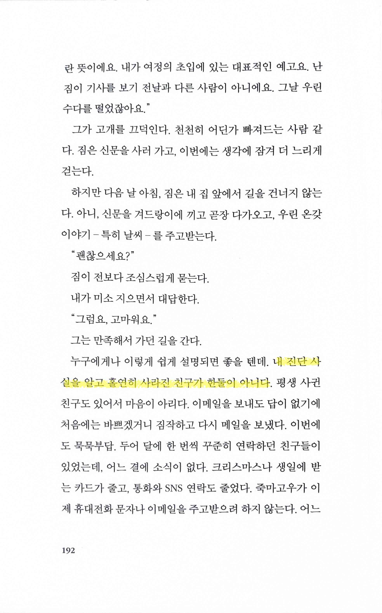
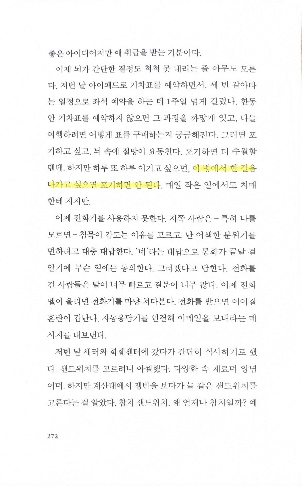
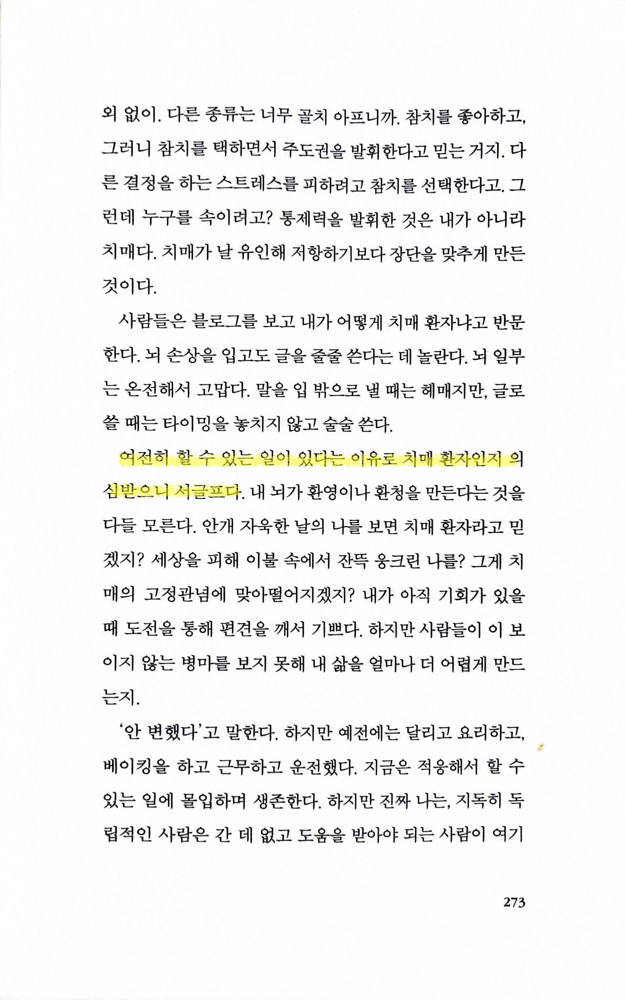

# 내가 알던 그 사람 Somebody I used to know

Tags: essay
Date: December 10, 2024 → December 11, 2024
Score: ★★★☆☆

- ★★★☆☆ December 10, 2024 → December 11, 2024 최근 계속 읽고 있는 알츠하이머/치매에 대한 개인 list에 있던 책. 다른 책과 구별할 수 있는 점은 자기 자신에 대한 책이라는 점. 치매 환자가 책을 쓰다니? 물론 중증 치매는 아니지만, 진단을 받고 서서히 일상의 일이 어려워지거나, 할 수 없는 일이 생기면서 겪는 고통을, 그리고 거기에 적응하면서 이겨내려고 분투하는 모습을 차분히 기술했다. 책을 읽고 홈페이지와 트위터를 방문했는데 올해 돌아가셨다. 삼가 고인의 명복을 빈다.
    - https://whichmeamitoday.wordpress.com/
    - https://x.com/WendyPMitchell/status/1760672737587236887
    - [내가 알던 사람](https://www.notion.so/14e3f0c2cf658056acefffc86cd03cc8?pvs=21)
    - [숨결이 바람 될 때 When Breath Becomes Air](https://www.notion.so/When-Breath-Becomes-Air-1473f0c2cf658012a3f5ed542b24ee28?pvs=21)
    - [아버지의 죽음 앞에서 Dear Life](https://www.notion.so/Dear-Life-1413f0c2cf658032b1d2de515de6d95d?pvs=21)
- p183 다른 책에서도 읽었지만 [치매는 치료법이 아직까지 없다](https://www.notion.so/14e3f0c2cf658056acefffc86cd03cc8?pvs=21). 그렇지만 사실을 사실대로 이야기하는 게 꼭 좋지는 않다.

    

- p192 인간 관계가 끊어진 걸 아쉬워할 수 있을 만큼은 정신이 있는걸 좋은 걸로 봐야 할까? 긍정적인 사고가 일반적으로 좋다고들 하지만… 잘 모르겠다

    

- pp272~273 아주 간단한 일도 끈기를 가지고 포기하지 말아야 한다는 점은, 고갈되기 쉬운 의지력이란 정신 에너지를 소모해야 한다는 관점에서, 생활의 모든 면에 보통 사람보다 몇 배의 노력을 들여야 하는 매우 힘든 일일 것이다. 게다가 그걸 통해 어느 정도 생활을 해나가는 모습을 보고 정말 치매 환자가 맞냐는 의심의 눈초리까지 받는다면 일종의 압박감 역시 심할테고.

    

    
