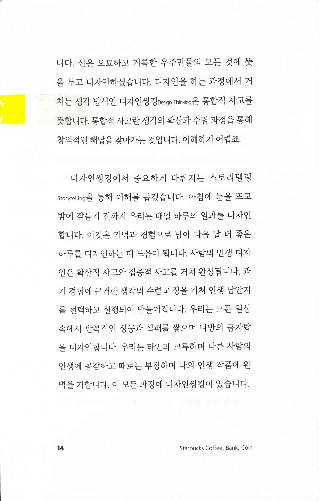
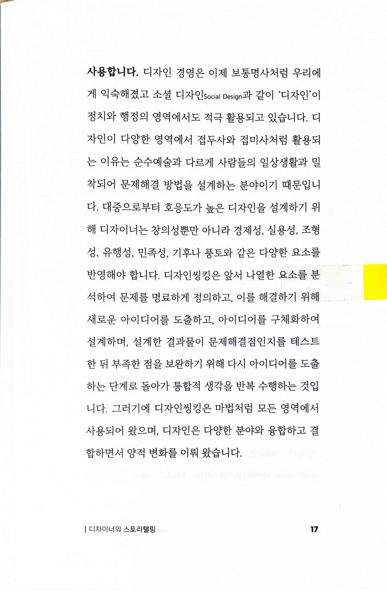
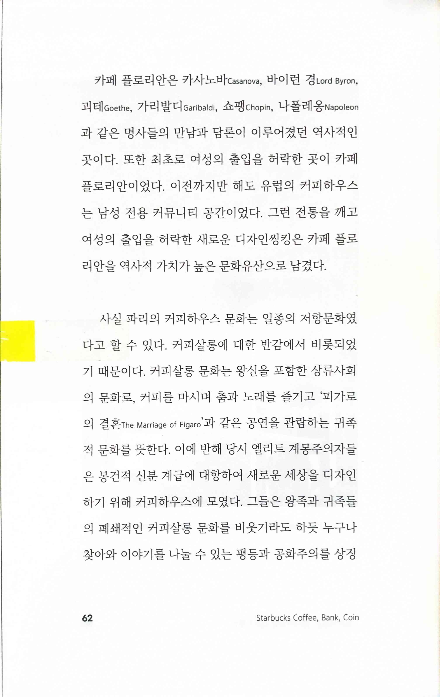
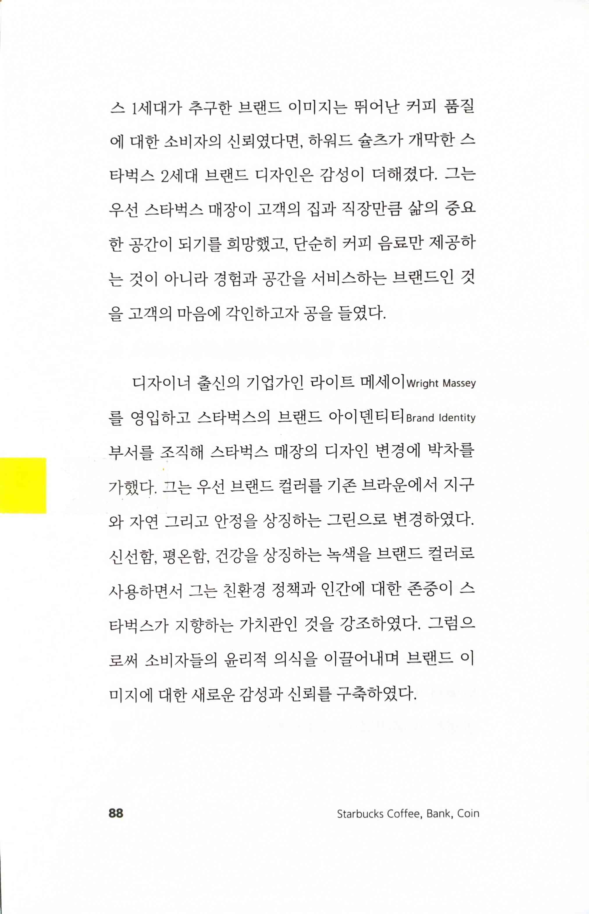
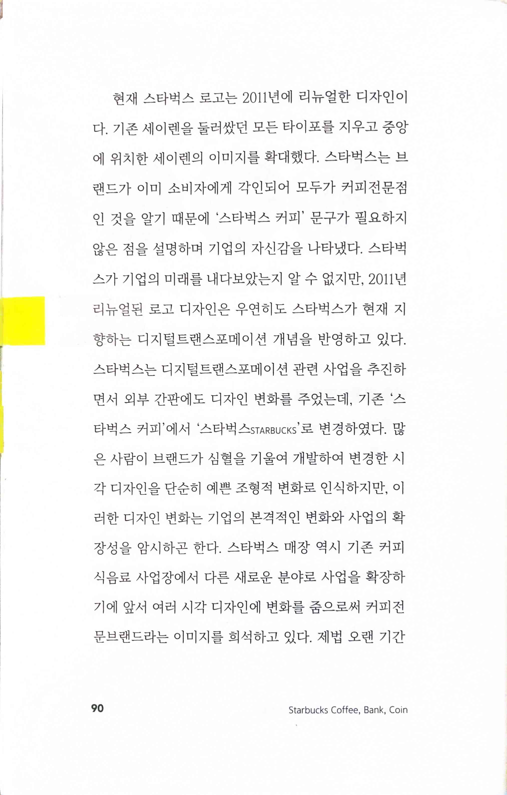
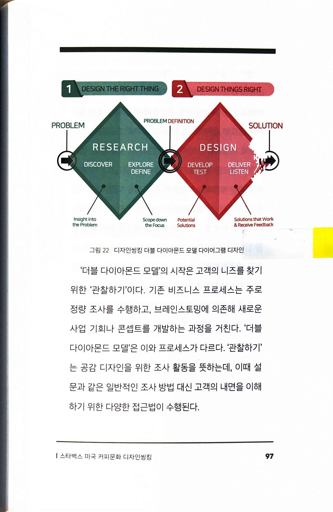
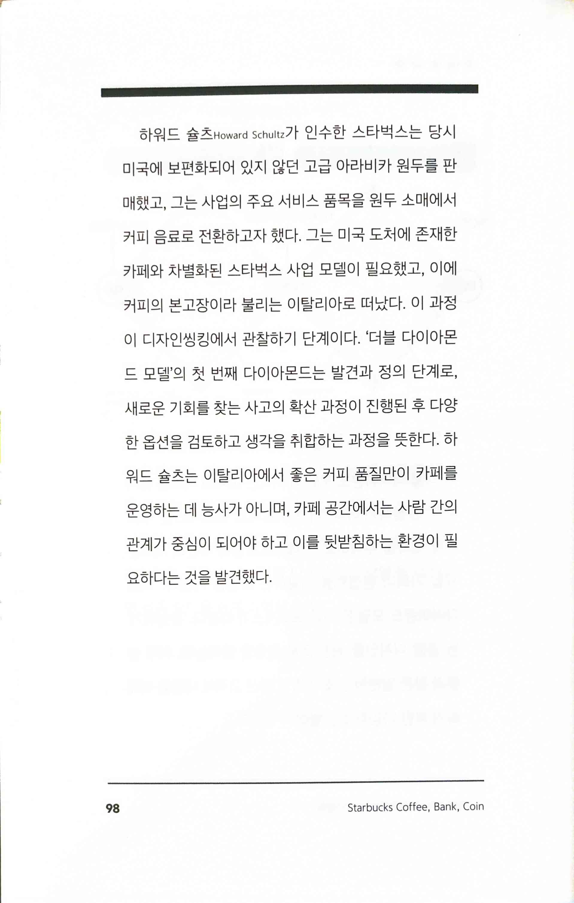
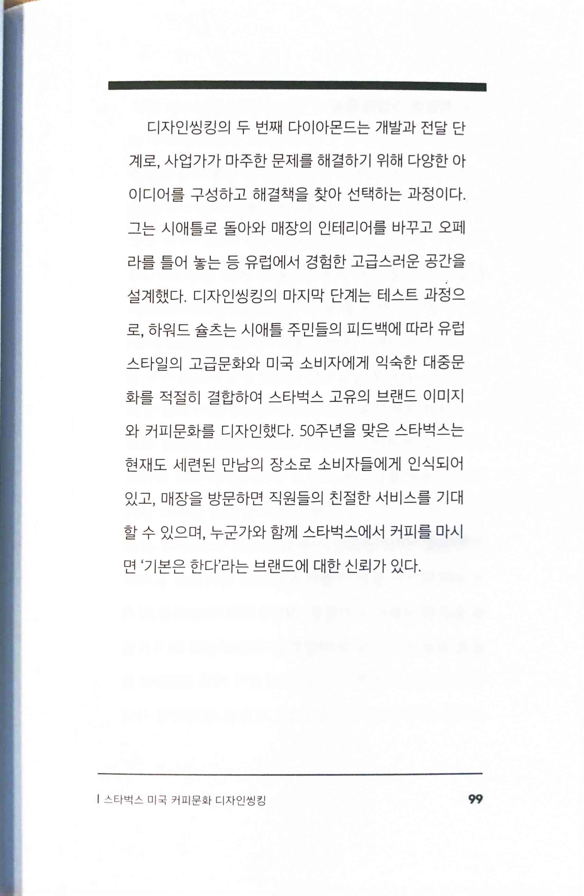
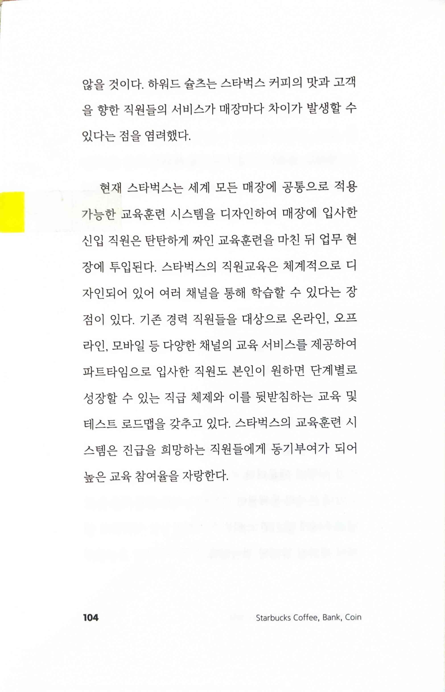
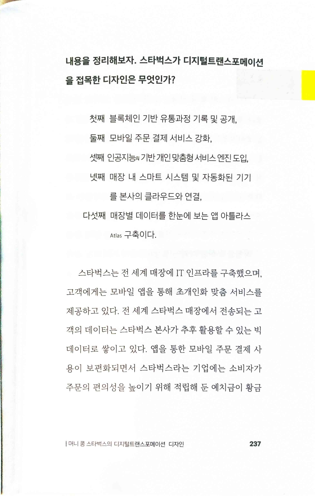

# 스타벅스 커피 스타벅스 은행 스타벅스 코인

> 디자인을 하는 과정에서 거치는 생각 방식인 디자인씽킹 Design Thinking은 통합적 사고를 뜻합니다. 통합적 사고란 생각의 확산과 수렴 과정을 통해 창의적인 해답을 찾아가는 것입니다.
* Storytelling이 중요

> 디자인씽킹은 앞서 나열한 요소를 분석하여 문제를 명료하게 정의하고, 이를 해결하기 위해 새로운 아이디어를 도출하고, 아이디어를 구체화하여 설계하며, 설계한 결과물이 문제해결점인지를 테스트한 뒤 부족한 점을 보완하기 위해 다시 아이디어를 도출하는 단계로 돌아가 통합적 생각을 반복 수행하는 것입니다.

* 커피살롱 vs. 커피하우스

> 브랜드 컬러를 기존 브라운에서 지구와 자연 그리고 안정을 상징하는 그린으로 변경하였다.신선함, 평온함, 건강을 상징하는 녹색을 브랜드 컬러로 사용하면서 그는 친환경 정책과 인간에 대한 존중이 스타벅스가 지향하는 가치관인 것을 강조하였다. 그럼으로써 소비자들의 윤리적 의식을 이끌어내며 브랜드 이미지에 대한 새로운 감성과 신뢰를 구축하였다.

> 2011년 리뉴얼된 로고 디자인은 우연히도 스타벅스가 현재 지향하는 디지털트랜스포메이션 개념을 반영하고 있다.
* 어떤 의미에서 DT 개념이 반영되었다는 건지 잘 모르겠음

> '더블 다이아몬드 모델'의 시작은 고객의 니즈를 찾기위한 ‘관찰하기’이다. 기존 비즈니스 프로세스는 주로 정량 조사를 수행하고, 브레인스토밍에 의존해 새로운사업 기회나 콘셉트를 개발하는 과정을 거친다. '더블다이아몬드 모델’은 이와 프로세스가 다르다. ‘관찰하기’는 공감 디자인을 위한 조사 활동을 뜻하는데, 이때 설문과 같은 일반적인 조사 방법 대신 고객의 내면을 이해하기 위한 다양한 접근법이 수행된다.

> '더블 다이아몬드 모델'의 첫 번째 다이아몬드는 발견과 정의 단계로, 새로운 기회를 찾는 사고의 확산 과정이 진행된 후 다양한 옵션을 검토하고 생각을 취합하는 과정을 뜻한다.

> 디자인씽킹의 두 번째 다이아몬드는 개발과 전달 단계로, 사업가가 마주한 문제를 해결하기 위해 다양한 아이디어를 구성하고 해결책을 찾아 선택하는 과정이다.

* 내부 교육의 중요성은 업계를 가리지 않는다는 또 하나의 사례

> 스타벅스가 디지털트랜스포메이션을 접목한 디자인
>
> 첫째 블록체인 기반 유통과정 기록 및 공개,
>
> 둘째 모바일 주문 결제 서비스 강화,
>
> 셋째 인공지능 기반 개인 맞춤형 서비스 엔진 도입,
>
> 넷째 매장 내 스마트 시스템 및 자동화된 기기를 본사의 클라우드와 연결,>
> 다섯째 매장별 데이터를 한눈에 보는 앱 아틀라스Atlas 구축이다.