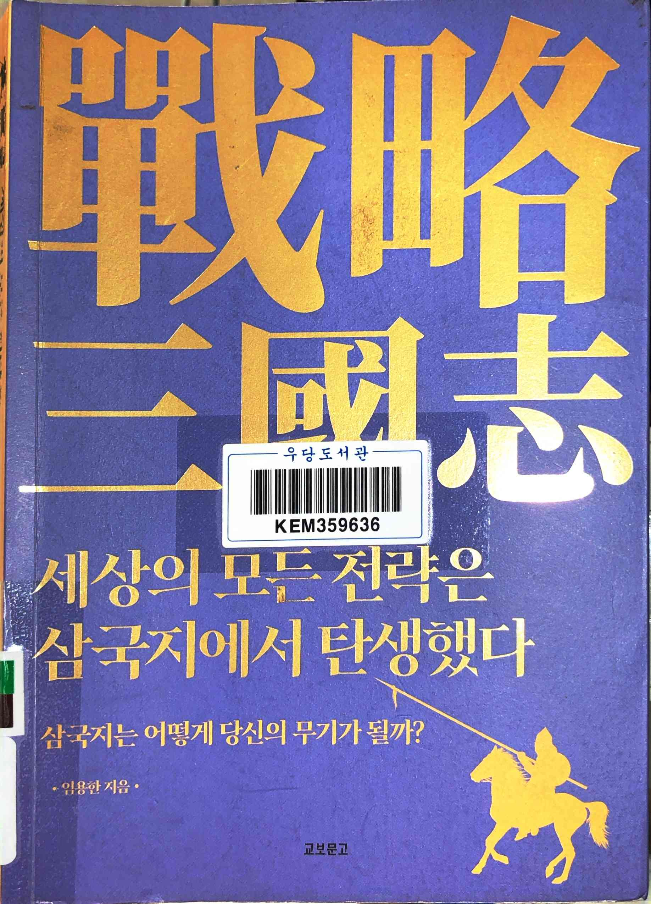
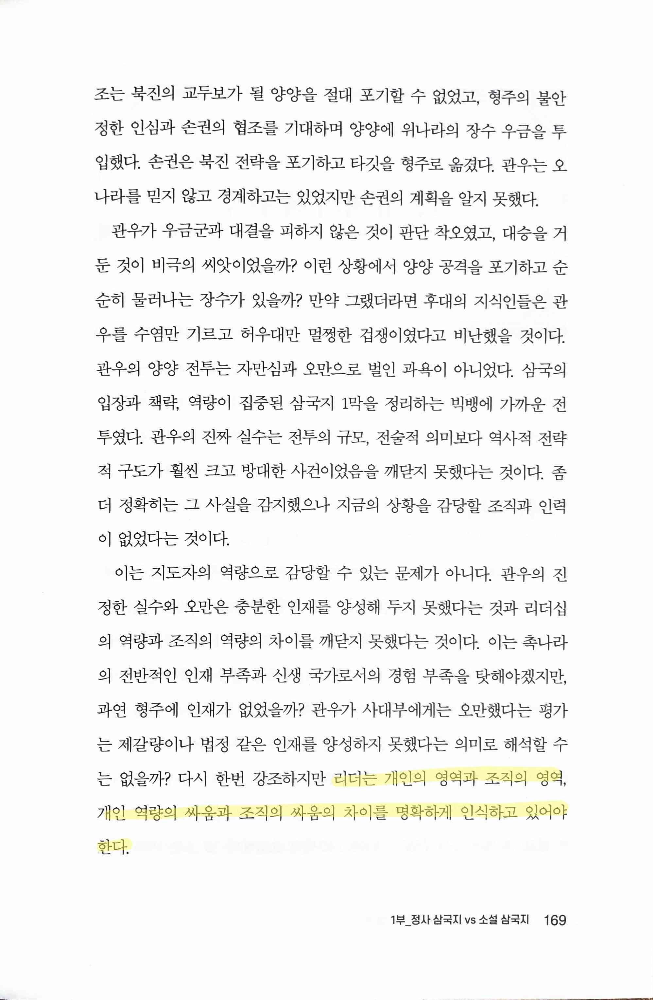
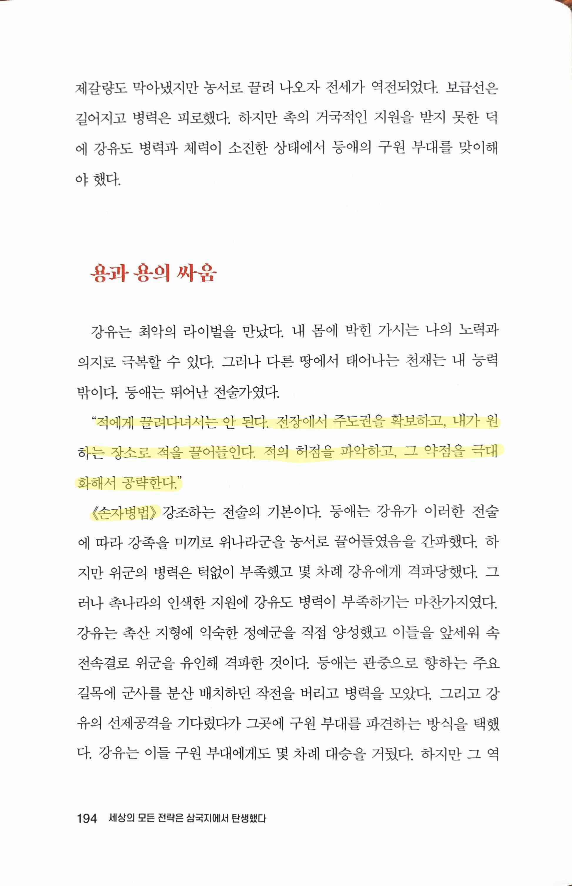
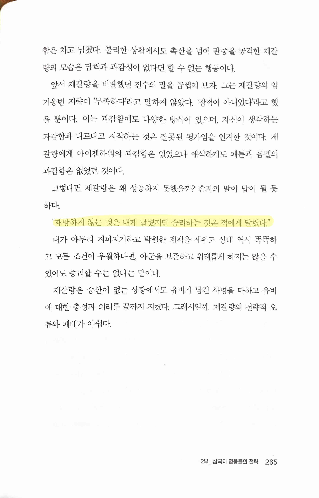
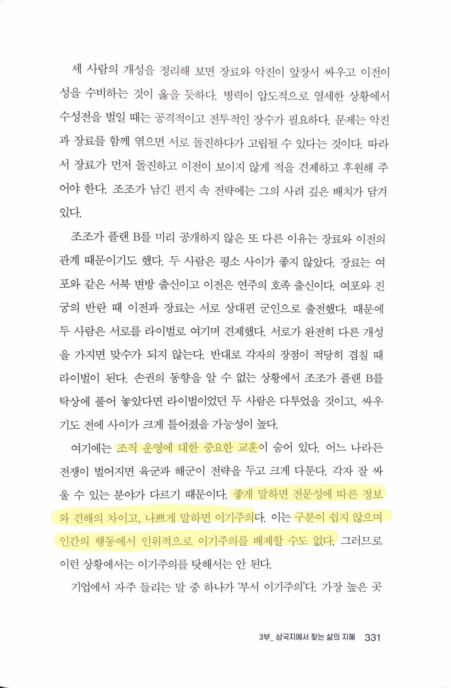
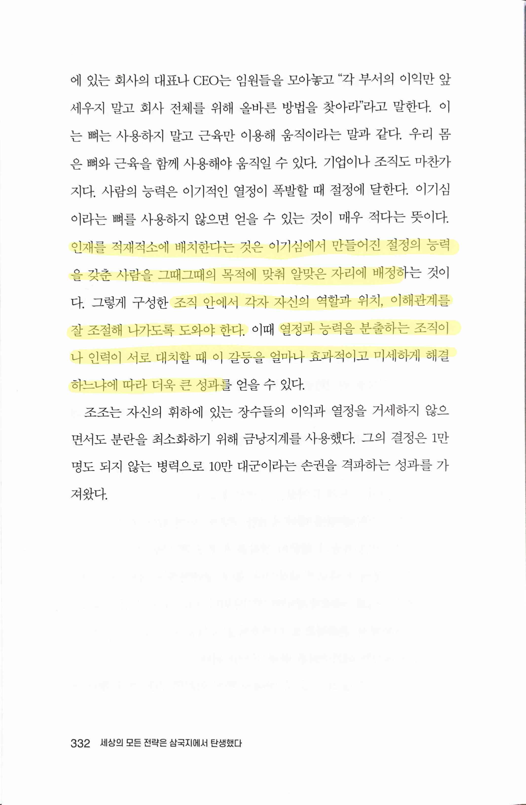

# 戰略 세상의 모든 전략은 삼국지에서 탄생했다

Date: July 23, 2023
Score: ★★★☆☆

- ★★★☆☆ 2023.07.22~23

> 리더는 개인의 영역과 조직의 영역, 개인 역량의 싸움과 조직의 싸움의 차이를 명확하게 인식하고 있어야 한다.
> 

> "적에게 끌려다녀서는 안 된다. 전장에서 주도권을 확보하고, 내가 원하는 장소로 적을 끌어들인다. 적의 허점을 파악하고, 그 약점을 극대화해서 공략한다." <손자병법>
> 

> 손자 "패망하지 않는 것은 내게 달렸지만 승리하는 것은 적에게 달렸다.”
> 

> 조직 운영에 대한 중요한 교훈... 좋게 말하면 전문성에 따른 정보와 견해의 차이고, 나쁘게 말하면 이기주의다. 이는 구분이 쉽지 않으며 인간의 행동에서 인위적으로 이기주의를 배제할 수도 없다.
> 

> 인재를 적재적소에 배치한다는 것은 이기심에서 만들어진 절정의 능력을 갖춘 사람을 그때그때의 목적에 맞춰 알맞은 자리에 배정하는 것이다. 그렇게 구성한 조직 안에서 각자 자신의 역할과 위치, 이해관계를 잘 조절해 나가도록 도와야 한다. 이때 열정과 능력을 분출하는 조직이나 인력이 서로 대치할 때 이 갈등을 얼마나 효과적이고 미세하게 해결하느냐에 따라 더욱 큰 성과를 얻을 수 있다.
>
