콜드 스타트
========

* ★★★★☆ 2023.06.01~05 네트워크 효과에 대한 책

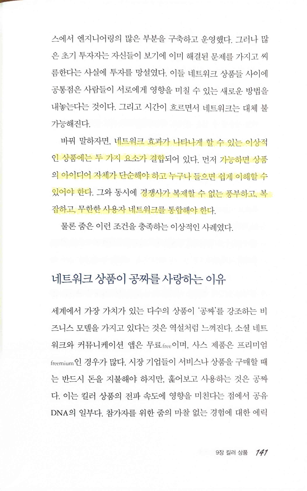

> 네트워크 효과가 나타나게 할 수 있는 이상적인 상품에는 두 가지 요소가 결합... 가능하면 상품의 아이디어 자체가 단순해야 하고 누구나 들으면 쉽게 이해할 수 있어야 한다. 그와 동시에 경쟁사가 복제할 수 없는 풍부하고, 복잡하고, 무한한 사용자 네트워크를 통합해야 한다.

> 네트워크에 균열이 일어나는 부분, 바로 거기서부터 문제를 해결하기 시작... 제로 zero

> 제로는... 쉽게 해결되지 않는다
>
> 제로로 인한 실제 비용은 제로를 경험하는 순간 발생하기보다는 그 후에 서서히 파괴적인 효과... 사용자들은 탈퇴하게 되고, 더 큰 문제는 서비스를 믿을 수 없다고 생각

> 유명한 전략 `초대받은 사람만 Invite-only` `도구 보러 왔다가 네트워크에 빠지다 Come for the tool, Stay for the network` `유료론칭 paying up for launch``플린트스토닝 Flintstoning`

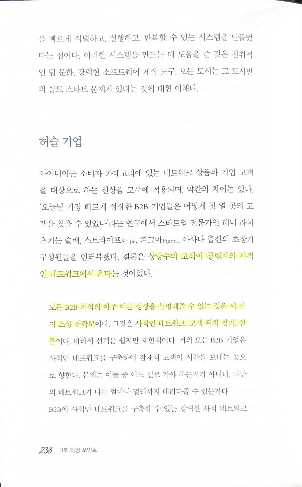

> 상당수의 고객이 창립자의 사적인 네트워크에서 온다
>
> 모든 B2B 기업의 아주 이른 성장을 설명해줄 수 있는 것은 세 가지 소싱 전략뿐... 사적인 네트워크, 고객 위치 찾기, 언론

> 폴 그레이엄은 기업가는 “확장되지 않는 일을 해야 한다"라고 주장... 직접 고객을 한 명씩 찾아가 설득하는 것이 처음 시작할 때는 좋은 방법이라는 의미

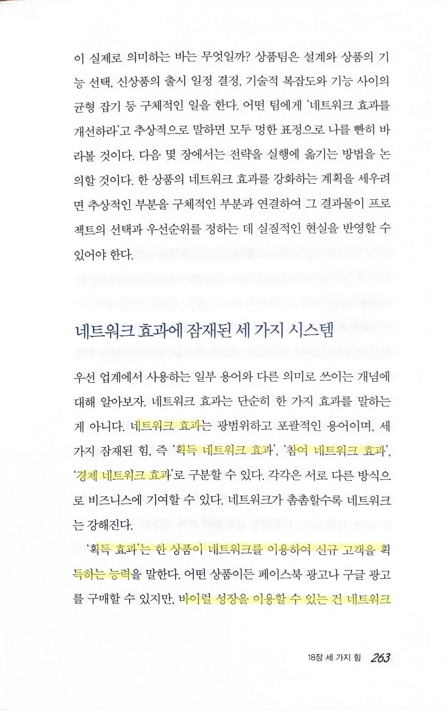  

> 네트워크 효과 `획득 네트워크 효과`, `참여 네트워크 효과`, `경제 네트워크 효과`
>
> '획득 효과'는 한 상품이 네트워크를 이용하여 신규 고객을 획득하는 능력... 바이럴 성장을 이용할 수 있는 건 네트워크상품뿐
>
> '참여 효과'는 네트워크의 밀도가 높아질수록 사용자가 네트워크에 머무는 시간이 길어지고, 새로운 용도를 찾아내는 것
>
> 사람들을 얼마나 오랫동안 네트워크에 머물게 했는지 시각적으로 보여주는 가장 중요한 리텐션 곡선은 사람들을 더 오랫동안 사용하게 만드는 사용 사례가 등장하면 향상
>
> 경제 효과는 네트워크가 성장하면서 네트워크 상품의 수익화를 가속화하고, 비용을 줄이고, 비즈니스 모델을 개선하는 능력

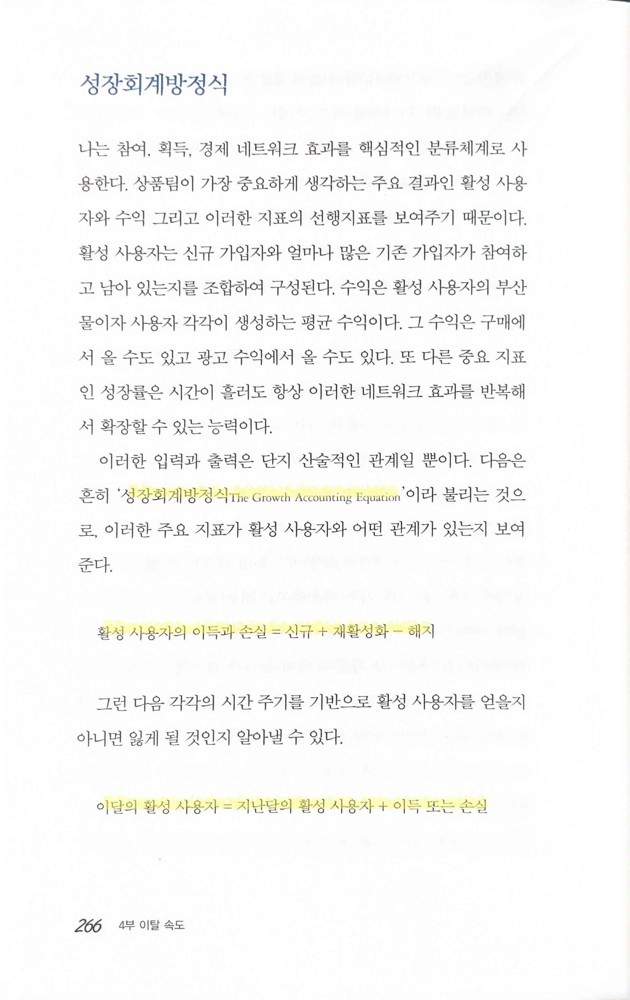

> `성장회계방정식 The Growth Accounting Equation`
>
> 활성 사용자의 이득과 손실 = 신규 + 재활성화 - 해지
>
> 이달의 활성 사용자 = 지난달의 활성 사용자 + 이득 또는 손실

> 네트워크 상품은 시간이 흐름에 따라 네트워크에 머무는 시간이 더욱 길어진다는 점에서 고유한 특징

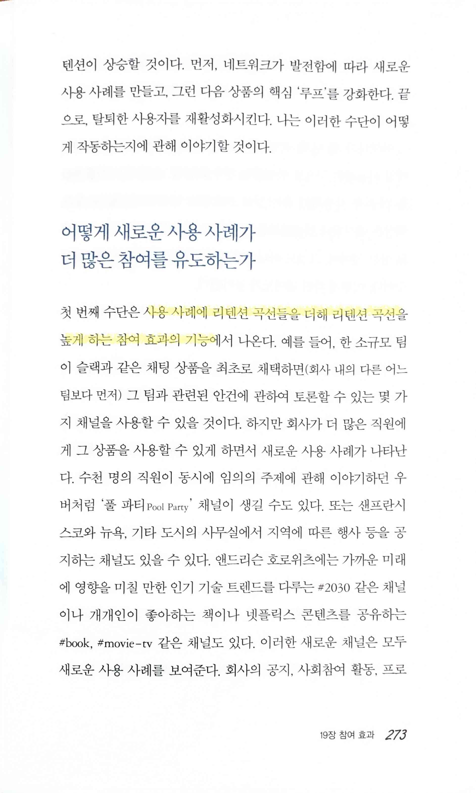

> 사용 사례에 리텐션 곡선들을 더해 리텐션 곡선을 높게 하는 참여 효과의 기능

> 많은 네트워크에는 현금 유출과 현금 유입을 유도하는 유형의 역학관계가 존재

> 인터넷에서는 성장하지 않으면 기본적으로 쇠퇴하기 직전

> B2B 상향식 스타트업이 영업팀을 조직하여 실행하지 못하면 성장은 느려질 것이 분명

> 타깃 성장률을 계산하기 위한 방정식
>
> 로켓 성장률 = {(목표 매출 - 시작 매출) / 시작 매출} ^ (1/년)

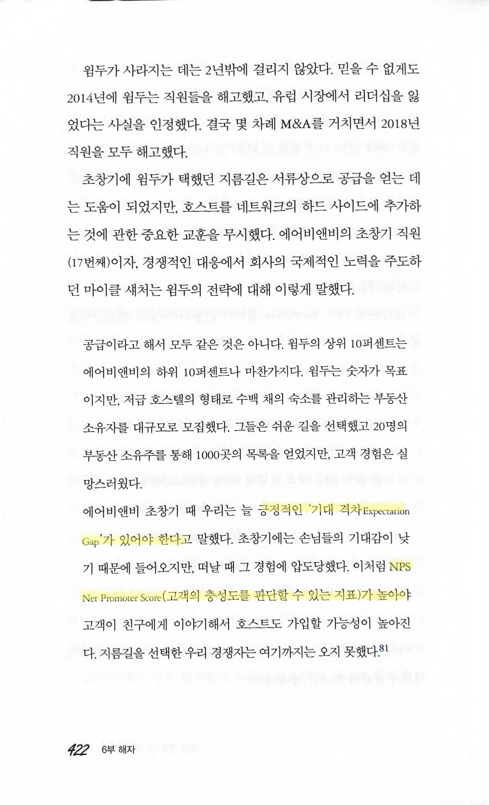

> 긍정적인 `기대 격차 Expectation Gap`가 있어야 한다... `NPS Net Promoter Score`(고객의 충성도를 판단할 수 있는 지표)가 높아야

> `경쟁적 해자 competitive moat`

> 소프트웨어의 기능을 복제하는 것은 일반적으로 어려운 일이 아니다... 상품이 방어력이 높은 것은 그들의 네트워크를 복제하기가 어렵기 때문

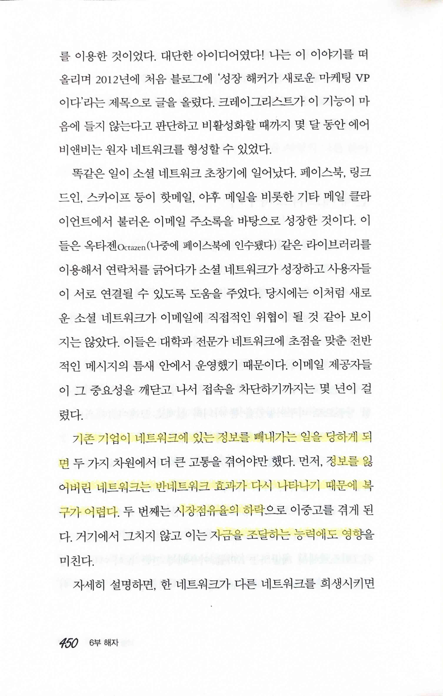 

> 기존 기업이 네트워크에 있는 정보를 빼내가는 일을 당하게 되면... 정보를 잃어버린 네트워크는 반네트워크 효과가 다시 나타나기 때문에 복구가 어렵다... 시장점유율의 하락... 자금을 조달하는 능력에도 영향

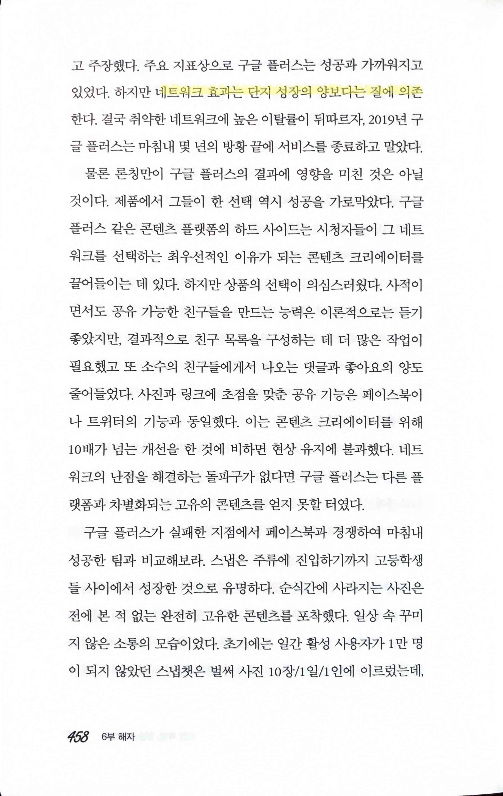

> 네트워크 효과는 단지 성장의 양보다는 질에 의존

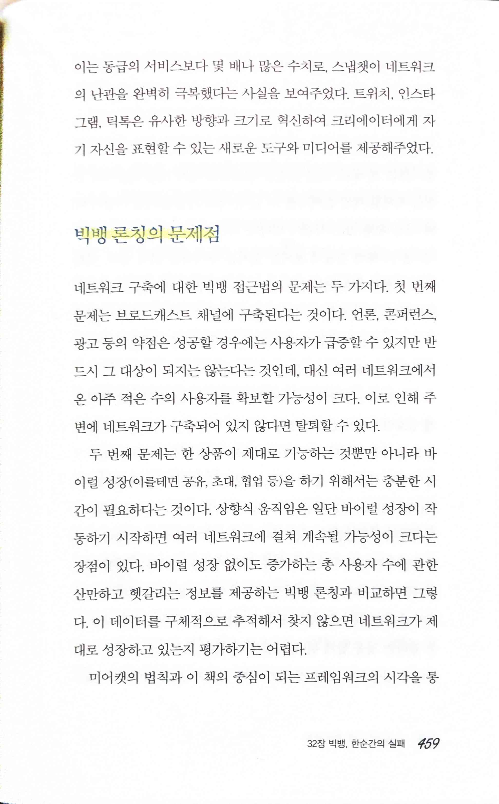 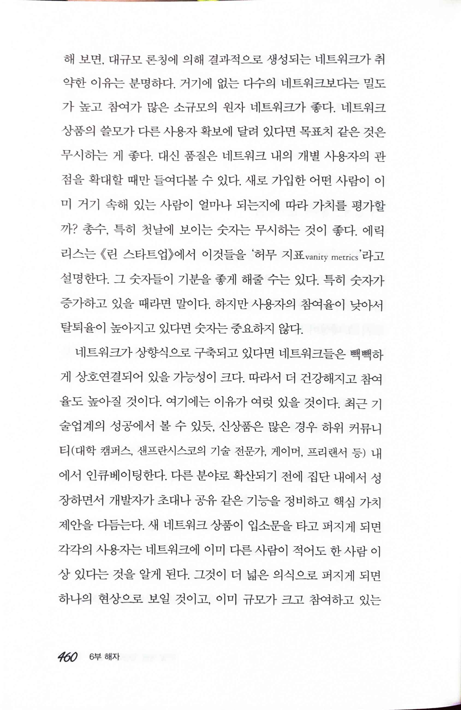 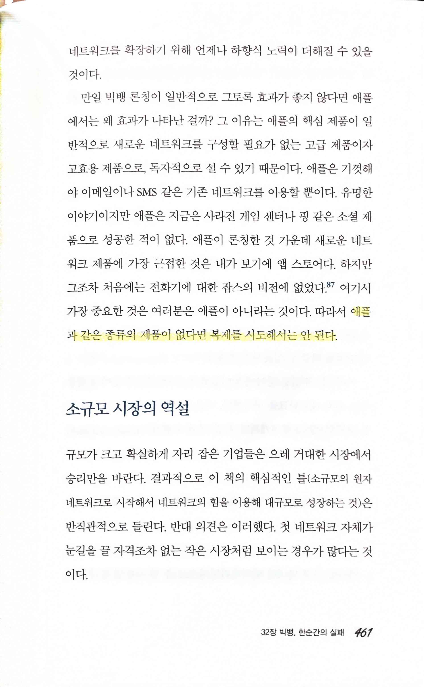

> 빅뱅 론칭의 문제점
>
> 애플과 같은 종류의 제품이 없다면 복제를 시도해서는 안 된다.

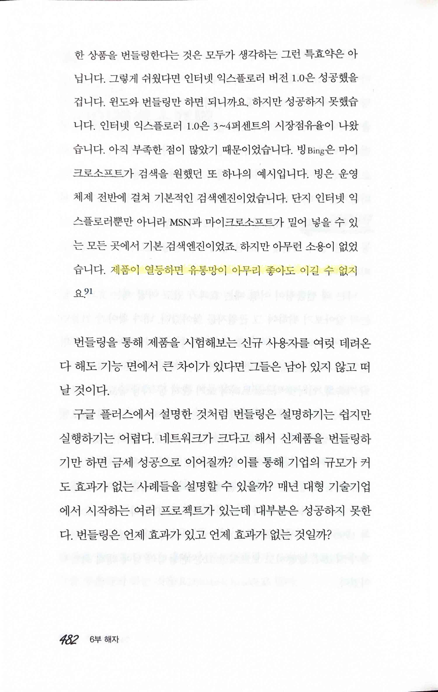

> 제품이 열등하면 유통망이 아무리 좋아도 이길 수 없지요